# Testing and Quality Assurance Framework - User Guide

## Table of Contents

- [Quick Start Guide](#quick-start-guide)
- [Pre-flight Checklist](#pre-flight-checklist)
  - [System Requirements](#system-requirements)
  - [Environment Setup](#environment-setup)
  - [Quick Environment Validation](#quick-environment-validation)
- [Testing Framework Overview](#testing-framework-overview)
- [Step-by-Step Testing Guide](#step-by-step-testing-guide)
  - [Step 1: Quick Validation (Essential for All Users)](#step-1-quick-validation-essential-for-all-users)
  - [Step 2: Integration Testing (For Developers and Researchers)](#step-2-integration-testing-for-developers-and-researchers)
  - [Step 3: Performance Testing (For System Validation)](#step-3-performance-testing-for-system-validation)

## Quick Start Guide

This guide provides practical instructions for using the comprehensive testing framework of the Multi-Sensor Recording System. Whether you're a researcher validating system reliability or a developer implementing new features, this guide will help you effectively utilize the testing infrastructure.

## Pre-flight Checklist

Before running any tests, ensure your environment meets these requirements:

### System Requirements
- **Java**: JDK 11 or higher (JDK 17 recommended)
- **Python**: 3.8+ with conda environment support
- **Android SDK**: API level 24+ for Android testing
- **Git**: For version control and submodule management
- **Network**: Stable internet connection for dependency downloads

### Environment Setup
```bash
# 1. Activate the conda environment
conda activate thermal-env

# 2. Verify Python dependencies
python -c "import pytest, numpy, opencv; print('Dependencies OK')"

# 3. Check Android environment (if testing Android components)
echo $ANDROID_HOME
adb devices

# 4. Verify repository is up to date
git submodule update --init --recursive
```

### Quick Environment Validation
```bash
# Run quick validation to ensure everything is working
cd /home/runner/work/bucika_gsr/bucika_gsr
./gradlew build
python PythonApp/run_quick_recording_session_test.py
```

## Testing Framework Overview

```mermaid
graph TB
    subgraph "Testing Workflow for Users"
        subgraph "Step 1: Basic Validation"
            QT[Quick Tests<br/>30 seconds<br/>Core functionality]
            UT[Unit Tests<br/>5 minutes<br/>Component validation]
        end
        
        subgraph "Step 2: Integration Testing"
            IT[Integration Tests<br/>15 minutes<br/>Cross-component validation]
            HT[Hardware Tests<br/>10 minutes<br/>Device simulation]
        end
        
        subgraph "Step 3: Advanced Testing"
            PT[Performance Tests<br/>30 minutes<br/>Benchmarking]
            ST[Stress Tests<br/>60 minutes<br/>High-load scenarios]
        end
        
        subgraph "Step 4: Quality Assurance"
            RT[Resilience Tests<br/>45 minutes<br/>Error recovery]
            CT[Compliance Tests<br/>20 minutes<br/>Research standards]
        end
    end
    
    QT --> UT
    UT --> IT
    IT --> HT
    HT --> PT
    PT --> ST
    ST --> RT
    RT --> CT
```



## Step-by-Step Testing Guide

### Step 1: Quick Validation (Essential for All Users)

**Purpose**: Verify basic system functionality before detailed testing

#### 1.1 Quick Comprehensive Test
```bash
# Navigate to the project directory
cd /home/runner/work/bucika_gsr/bucika_gsr/PythonApp

# Run quick validation test (30 seconds)
python run_quick_recording_session_test.py

# Expected output:
# ✓ Python application initialization successful
# ✓ Android device simulation successful  
# ✓ Socket communication established
# ✓ Recording session completed successfully
# ✓ File persistence validated
# ✓ All quick tests passed
```

#### 1.2 Basic Unit Tests
```bash
# Run Python unit tests
cd PythonApp
python -m pytest src/tests/test_unit_core.py -v

# Run Android unit tests
cd ../AndroidApp
../gradlew testDebugUnitTest

# Expected results: All tests should pass with >90% success rate
```

### Step 2: Integration Testing (For Developers and Researchers)

**Purpose**: Validate cross-component functionality and system integration

#### 2.1 PC-Android Integration
```bash
# Comprehensive recording session test
cd PythonApp
python run_recording_session_test.py --duration 60 --devices 2 --verbose

# This test validates:
# - PC application startup and initialization
# - Android device simulation and connection
# - Real-time data streaming and synchronization
# - Recording lifecycle management
# - File creation and data persistence
```

#### 2.2 Hardware Integration
```bash
# Hardware sensor simulation test
python test_hardware_sensor_simulation.py

# Expected behavior:
# - Shimmer sensors simulated on correct Bluetooth ports
# - USB cameras detected and configured
# - Thermal cameras initialized with proper drivers
# - All sensors streaming realistic data patterns
```

#### 2.3 Network Communication
```bash
# Network integration and communication test
python test_integration_logging.py

# Validates:
# - Socket communication protocols
# - Message serialization and deserialization
# - Error handling and recovery mechanisms
# - Logging system integration and validation
```

### Step 3: Performance Testing (For System Validation)

**Purpose**: Ensure system meets performance requirements under various loads

#### 3.1 Performance Benchmarking
```bash
# Run performance validation tests
python test_enhanced_stress_testing.py --performance-bench

# Performance metrics monitored:
# - Memory usage during extended recording
# - CPU utilization under high sensor data rates
# - Network throughput and latency optimization
# - Storage I/O performance with large files
```

#### 3.2 Multi-Device Scaling
```bash
# Test system scalability with multiple devices
python run_recording_session_test.py --devices 4 --duration 120 --performance-bench

# Scaling validation:
# - Memory usage scales linearly with device count
# - Network bandwidth adapts to available capacity
# - CPU usage remains below 70% under normal load
# - Response times stay under 500ms at 95th percentile
```

#### 3.3 Extended Session Testing
```bash
# Long-duration stability testing
python run_recording_session_test.py --long-duration --health-check

# Stability metrics:
# - Memory leak detection over extended periods
# - Resource cleanup validation after sessions
# - Performance degradation monitoring
# - Error rate tracking over time
```

### Step 4: Resilience Testing (For Reliability Validation)

**Purpose**: Validate system behavior under adverse conditions and error scenarios

#### 4.1 Network Resilience
```bash
# Network failure simulation and recovery testing
python test_network_resilience.py

# Network scenarios tested:
# - Gradual bandwidth reduction (100Mbps to 1Mbps)
# - Intermittent connectivity (connection drops every 30s)
# - High latency simulation (10ms to 500ms delays)
# - Packet loss scenarios (0.1% to 10% loss rates)
```

#### 4.2 Error Recovery Testing
```bash
# Error injection and recovery validation
python run_recording_session_test.py --error-simulation --network-issues

# Error scenarios:
# - Device disconnection during recording
# - Memory exhaustion simulation
# - Storage space limitations
# - Network timeout and recovery
```

#### 4.3 Data Integrity Testing
```bash
# Data corruption detection and recovery
python test_data_integrity_validation.py

# Data integrity validation:
# - Checksum validation for all recorded files
# - Corruption detection algorithms
# - Data recovery mechanisms
# - Cross-device synchronization validation
```

### Step 5: Cross-Platform Integration Testing

**Purpose**: Validate complete PC-Android communication and coordination workflows

#### 5.1 Recording Session Integration Testing

**Quick Integration Validation**
```bash
cd PythonApp

# Basic PC-Android communication test (3 minutes)
python run_quick_recording_session_test.py

# Expected output:
# ✅ PC Application Initialization Complete
# ✅ Android Device Simulations Active (2 devices)
# ✅ Communication and Networking Validated
# ✅ Recording Session Lifecycle Complete
# ✅ Data Persistence and Integrity Validated
```

**Comprehensive Integration Testing**
```bash
# Full integration test with multiple devices (15 minutes)
python run_recording_session_test.py --duration 90 --devices 3 --save-logs --verbose

# Test validation includes:
# - Device discovery and capability negotiation
# - Synchronized recording start/stop across devices
# - Real-time sensor data streaming validation
# - Cross-device timestamp synchronization
# - Session data persistence and file integrity
```

#### 5.2 Advanced Integration Scenarios

**Multi-Device Stress Testing**
```bash
# Stress test with 8 simulated devices (20 minutes)
python run_recording_session_test.py --stress-test --devices 8 --duration 300 --performance-bench

# Validates:
# - System scalability with high device count
# - Network communication under high load
# - Memory and CPU usage optimization
# - Concurrent file I/O operations
# - Resource cleanup and management
```

**Error Recovery Integration Testing**
```bash
# Error simulation and recovery testing (10 minutes)  
python run_recording_session_test.py --error-simulation --network-issues --devices 4

# Tests recovery from:
# - Network connectivity failures
# - Device disconnection scenarios  
# - Communication timeout conditions
# - Partial session data recovery
# - Graceful degradation handling
```

#### 5.3 Android Application Testing

**Unit and Integration Testing**
```bash
cd ../AndroidApp

# Run comprehensive Android test suite
./run_comprehensive_android_tests.sh

# Test categories executed:
# - Unit tests (business logic validation)
# - Integration tests (hardware communication)
# - UI tests (user interface workflows)
# - Performance tests (execution time and memory)
# - Stress tests (high-load scenarios)
```

**Performance and Coverage Analysis**
```bash
# Performance benchmarking and coverage analysis
./gradlew performanceTest jacocoTestReport

# Performance thresholds validated:
# - Execution time < 5 seconds per test
# - Memory usage < 100MB per test
# - Code coverage > 75%
# - Branch coverage > 70%

# View reports:
# - Performance: app/build/reports/performance/index.html
# - Coverage: app/build/reports/jacoco/jacocoTestReport/html/index.html
```

### Step 6: Quality Assurance (For Compliance Validation)

**Purpose**: Ensure system meets research-grade quality standards

#### 6.1 Code Quality Validation
```bash
# Python code quality checks
cd PythonApp
python -m flake8 src/ --count --statistics
python -m mypy src/ --ignore-missing-imports
python -m black src/ --check

# Android code quality checks
cd ../AndroidApp
../gradlew lintDebug
../gradlew detekt
```

#### 5.2 Security Testing
```bash
# Security vulnerability scanning
cd PythonApp
python -m bandit -r src/ -f json -o security_report.json

# Expected result: No high-severity security vulnerabilities
```

#### 5.3 Coverage Analysis
```bash
# Generate comprehensive coverage reports
cd PythonApp
python -m pytest src/tests/ --cov=src --cov-report=html

# Android coverage
cd ../AndroidApp
../gradlew jacocoTestReport

# Coverage targets:
# - Python: >75% line coverage, >70% branch coverage
# - Android: >80% line coverage, >75% branch coverage
```

## Advanced Testing Scenarios

### Research Session Validation

For researchers conducting experiments, run this comprehensive validation:

```bash
# Complete research-grade validation
cd PythonApp
python run_complete_test_suite.py

# This executes all test categories:
# 1. Integration Logging Test (3 minutes)
# 2. Focused Recording Session Test (5 minutes)
# 3. Hardware Sensor Simulation Test (7 minutes)
# 4. Enhanced Stress Testing Suite (15 minutes)
# 5. Network Resilience Testing (10 minutes)
# 6. Data Integrity Validation Test (8 minutes)
# 7. Comprehensive Recording Test (12 minutes)

# Total execution time: ~60 minutes
# Expected success rate: >95%
```

### Custom Test Configuration

#### Configurable Test Parameters
```bash
# Customize test execution for specific needs

# High-intensity stress testing
python run_recording_session_test.py \
    --stress-test \
    --devices 8 \
    --duration 300 \
    --memory-stress

# Network-constrained environment testing
python run_recording_session_test.py \
    --network-issues \
    --latency 100 \
    --packet-loss 5

# Extended stability validation
python run_recording_session_test.py \
    --long-duration \
    --duration 3600 \
    --health-check \
    --save-logs
```

#### Test Environment Configuration
```bash
# Configure test environment variables
export LOG_LEVEL="DEBUG"              # Detailed logging
export TEST_TIMEOUT="300"             # 5-minute test timeout
export PERFORMANCE_MODE="HIGH"        # High-performance testing
export MEMORY_LIMIT="2GB"            # Memory constraint testing
export NETWORK_SIMULATION="ENABLED"   # Network condition simulation
```

## Understanding Test Results

### Test Output Interpretation

#### Successful Test Run Example
```
📊 Test Execution Summary:
   ✅ Tests Passed: 247/250 (98.8%)
   ⚠️  Tests Skipped: 3 (hardware not available)
   ❌ Tests Failed: 0
   
📈 Performance Metrics:
   ⏱️  Total execution time: 1,847 seconds
   💾 Peak memory usage: 342 MB (within 500 MB limit)
   🌐 Network throughput: 15.3 Mbps average
   💿 Storage I/O: 45 MB/s write speed
   
🎯 Quality Metrics:
   📋 Code coverage: 84.2% (exceeds 75% target)
   🔒 Security vulnerabilities: 0 (high severity)
   📝 Documentation coverage: 91.5%
   
✅ Overall Status: PASS - System ready for production use
```

#### Test Failure Analysis
```
❌ Test Failure Detected:
   Test: test_network_resilience_high_latency
   Failure: Response time exceeded 500ms threshold (actual: 847ms)
   
🔍 Failure Analysis:
   - Network latency simulation: 200ms
   - Expected response time: <500ms
   - Actual response time: 847ms
   - Root cause: TCP timeout configuration too conservative
   
🛠️  Recommended Actions:
   1. Review network timeout configuration
   2. Optimize TCP buffer sizes
   3. Consider implementing adaptive timeout logic
   4. Re-run test with updated configuration
```

### Performance Benchmarks

#### Expected Performance Targets
```
🎯 Performance Targets for System Validation:

Memory Usage:
   📊 Normal operation: <300 MB
   📊 High load (8 devices): <800 MB
   📊 Extended session (1 hour): <400 MB
   
CPU Utilization:
   📊 Average during recording: <50%
   📊 Peak during initialization: <80%
   📊 Idle state: <10%
   
Network Performance:
   📊 Minimum throughput: 10 Mbps
   📊 Maximum latency: 100ms (95th percentile)
   📊 Connection establishment: <2 seconds
   
Storage Performance:
   📊 Write speed: >20 MB/s
   📊 Read speed: >50 MB/s
   📊 File operation latency: <50ms
```

### Troubleshooting Common Issues

#### Environment Issues
```bash
# Issue: conda environment not found
# Solution:
conda create -n thermal-env python=3.8
conda activate thermal-env
pip install -r requirements.txt

# Issue: Android SDK not configured
# Solution:
export ANDROID_HOME=/path/to/android/sdk
export PATH=$PATH:$ANDROID_HOME/platform-tools

# Issue: Git submodules not initialized
# Solution:
git submodule update --init --recursive
```

#### Test Execution Issues
```bash
# Issue: Test timeouts
# Solution: Increase timeout values
export TEST_TIMEOUT="600"  # 10 minutes

# Issue: Memory errors during testing
# Solution: Increase memory limits
export GRADLE_OPTS="-Xmx4g -XX:MaxMetaspaceSize=512m"

# Issue: Network connectivity problems
# Solution: Verify network configuration
ping google.com
curl -I https://github.com
```

#### Performance Issues
```bash
# Issue: Tests running slowly
# Solution: Enable parallel execution
python -m pytest -n auto  # Use all CPU cores

# Issue: Memory leaks detected
# Solution: Enable memory profiling
python -m memory_profiler test_script.py

# Issue: High CPU usage
# Solution: Use performance profiling
python -m cProfile -o profile.stats test_script.py
```

## Test Report Generation

### Automated Report Generation
```bash
# Generate comprehensive test reports
cd PythonApp
python run_complete_test_suite.py --generate-reports

# Reports generated:
# - test_results/html_report.html (web-based report)
# - test_results/json_report.json (machine-readable results)
# - test_results/performance_metrics.csv (performance data)
# - test_results/coverage_report.html (coverage analysis)
```

### Report Analysis Tools
```bash
# View test trends over time
python tools/analyze_test_trends.py --days 30

# Compare performance across test runs
python tools/performance_comparison.py --baseline baseline.json --current current.json

# Generate test summary for stakeholders
python tools/generate_test_summary.py --output executive_summary.pdf
```

## Continuous Integration Integration

### Local CI Simulation
```bash
# Simulate CI pipeline locally
cd /home/runner/work/bucika_gsr/bucika_gsr

# Run CI-equivalent test suite
./scripts/ci_test_pipeline.sh

# Expected execution time: 20-30 minutes
# Expected result: All quality gates pass
```

### Quality Gate Validation
```bash
# Validate all quality gates before committing
./scripts/pre_commit_validation.sh

# Quality gates checked:
# ✅ Unit tests pass (>95% success rate)
# ✅ Code coverage meets targets (>75%)
# ✅ Security scan passes (0 high severity issues)
# ✅ Performance benchmarks pass (no regression >10%)
# ✅ Documentation is up to date
```

## Best Practices for Testing

### For Researchers
1. **Run quick validation** before each experiment session
2. **Validate data integrity** after each recording session
3. **Monitor performance metrics** during extended experiments
4. **Document any anomalies** observed during testing
5. **Keep test logs** for research compliance requirements

### For Developers
1. **Run unit tests** before committing code changes
2. **Execute integration tests** before merging feature branches
3. **Validate performance impact** of new features
4. **Update test documentation** when adding new functionality
5. **Monitor test coverage** to maintain quality standards

### For System Administrators
1. **Schedule regular comprehensive testing** (weekly)
2. **Monitor system performance trends** over time
3. **Validate security configurations** regularly
4. **Maintain test environment consistency**
5. **Archive test results** for compliance requirements

## Research Compliance and Validation

### Data Quality Assurance
```bash
# Validate research data integrity
python tools/validate_research_data.py --session /path/to/session

# Validation includes:
# - Temporal synchronization accuracy (<1ms error)
# - Data completeness (>99.9% data points)
# - File format compliance (research standards)
# - Metadata consistency across devices
```

### Reproducibility Testing
```bash
# Ensure experimental reproducibility
python tools/reproducibility_test.py --config experiment_config.json

# Reproducibility checks:
# - Identical results across multiple runs
# - Consistent performance metrics
# - Deterministic data generation
# - Configuration documentation
```

This comprehensive testing framework ensures that the Multi-Sensor Recording System maintains the highest standards of reliability and quality for research applications.