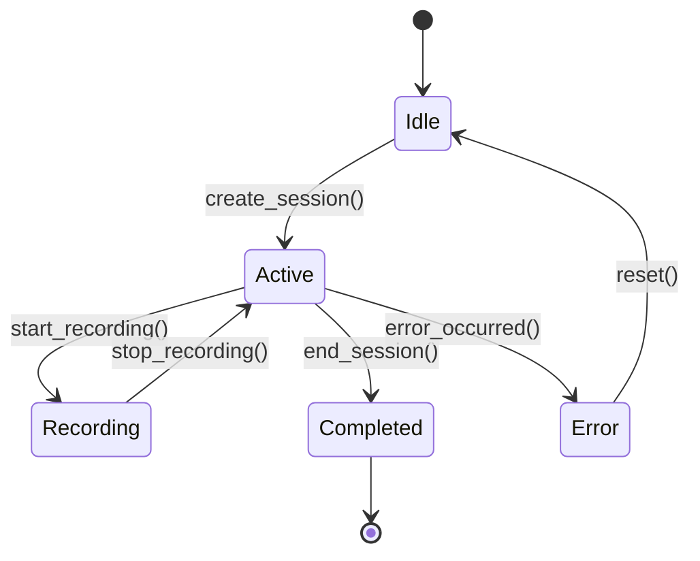

# Session Management Quick Reference

## Session Commands

### Create Session
```python
from session.session_manager import SessionManager

manager = SessionManager("recordings")
session = manager.create_session("experiment_name")  # Optional custom name
```

### Device Management
```python
# Add device to session
manager.add_device_to_session("phone_1", "android_phone", ["rgb_video", "gsr_data"])

# Add file to session
manager.add_file_to_session("phone_1", "rgb_video", "phone_1_rgb_20250731_143022.mp4", 52428800)
```

### End Session
```python
completed = manager.end_session()
print(f"Session duration: {completed['duration']:.1f}s")
```

## Event Logging

### Basic Events
```python
from session.session_logger import get_session_logger

logger = get_session_logger()
logger.log_event("custom_event", {"data": "value"})
```

### Common Events
```python
# Device events
logger.log_device_connected("phone_1", "android_phone", ["rgb_video"])
logger.log_device_disconnected("phone_1", "user_initiated")

# Recording events
logger.log_recording_start(["phone_1", "webcam_1"])
logger.log_recording_stop()

# Markers and stimulus
logger.log_marker("stimulus_start")
logger.log_stimulus_play("stress_video.mp4")
```

## File Naming Patterns

### Session Names
```
Format: [custom_name_]YYYYMMDD_HHMMSS
Examples:
- session_20250731_143022
- experiment_A_20250731_143022
```

### Device Files
```
Format: [device_id]_[type]_YYYYMMDD_HHMMSS.[ext]
Examples:
- phone_1_rgb_20250731_143022.mp4
- phone_1_gsr_20250731_143022.csv
- webcam_1_20250731_143022.mp4
```

## Directory Structure

```
recordings/session_20250731_143022/
├── session_metadata.json
├── session_20250731_143022_log.json
├── devices/
│   └── phone_1/
│       ├── rgb_videos/
│       ├── thermal_videos/
│       └── sensor_data/
├── webcam/
├── processing/
└── exports/
```

## Quick Data Access

### Find Session Data
```bash
# Navigate to session
cd recordings/session_20250731_143022/

# View session info
cat session_metadata.json

# View event timeline
cat session_20250731_143022_log.json

# Find all videos
find . -name "*.mp4"

# Find sensor data
find . -name "*.csv"
```

### Python Data Access
```python
# Load session metadata
import json
with open("session_metadata.json", "r") as f:
    metadata = json.load(f)

# Get session duration
duration = metadata.get("duration", 0)

# List recorded files
for device_id, files in metadata["files"].items():
    for file_info in files:
        print(f"{device_id}: {file_info['file_path']}")
```

## Common Error Patterns

### Session Creation Issues
```python
# Validate session name
if SessionManager.validate_session_name("my session"):
    session = manager.create_session("my session")
else:
    print("Invalid session name")
```

### Device Connection Issues
```python
# Check current session
if manager.get_current_session():
    manager.add_device_to_session("phone_1", "android_phone", ["rgb_video"])
else:
    print("No active session")
```

## Post-Processing

### Trigger Hand Segmentation
```python
# Automatic post-processing after session
results = manager.trigger_post_session_processing(
    enable_hand_segmentation=True,
    segmentation_method="mediapipe"
)

if results['hand_segmentation']['success']:
    print("Hand segmentation completed")
else:
    print(f"Error: {results['hand_segmentation']['error']}")
```

## Event Types Reference

| Event Type | Usage | Example |
|------------|-------|---------|
| `session_start` | Session initialization | Auto-generated |
| `session_end` | Session termination | Auto-generated |
| `device_connected` | Device joins session | `log_device_connected("phone_1")` |
| `device_disconnected` | Device leaves session | `log_device_disconnected("phone_1")` |
| `start_record` | Recording begins | `log_recording_start(["phone_1"])` |
| `stop_record` | Recording ends | `log_recording_stop()` |
| `marker` | User marker | `log_marker("stimulus_start")` |
| `stimulus_play` | Stimulus starts | `log_stimulus_play("video.mp4")` |
| `stimulus_stop` | Stimulus ends | `log_stimulus_stop("video.mp4")` |
| `file_received` | File transfer complete | `log_file_received("phone_1", "video.mp4")` |
| `error` | Error occurred | `log_error("connection", "Timeout")` |

## Session States



## File Type Reference

| File Type | Extension | Description |
|-----------|-----------|-------------|
| `rgb_video` | .mp4 | Standard color video |
| `thermal_video` | .mp4 | Thermal imaging video |
| `webcam_video` | .mp4 | PC webcam recording |
| `gsr_data` | .csv | GSR sensor measurements |
| `motion_data` | .csv | Accelerometer/gyroscope data |
| `audio_recording` | .wav | Audio recordings |
| `calibration_image` | .jpg | Camera calibration images |

## Device Types Reference

| Device Type | Capabilities | Example ID |
|-------------|--------------|------------|
| `android_phone` | rgb_video, thermal_video, gsr_data, motion_data | phone_1, phone_2 |
| `pc_webcam` | video_recording, audio_recording | webcam_1, webcam_2 |
| `shimmer_gsr` | gsr_data | shimmer_1, shimmer_2 |
| `thermal_camera` | thermal_video | thermal_1 |

## Troubleshooting

### Common Issues
- **Session won't create**: Check disk space and permissions
- **Device won't connect**: Verify network connection and device app
- **Files missing**: Check session log for transfer errors
- **Session incomplete**: Use session recovery tools

### Debug Commands
```python
# Check session status
print(manager.get_current_session())

# Verify logger state
print(logger.is_session_active())

# Check session folder
folder = manager.get_session_folder()
print(f"Session folder: {folder}")
```