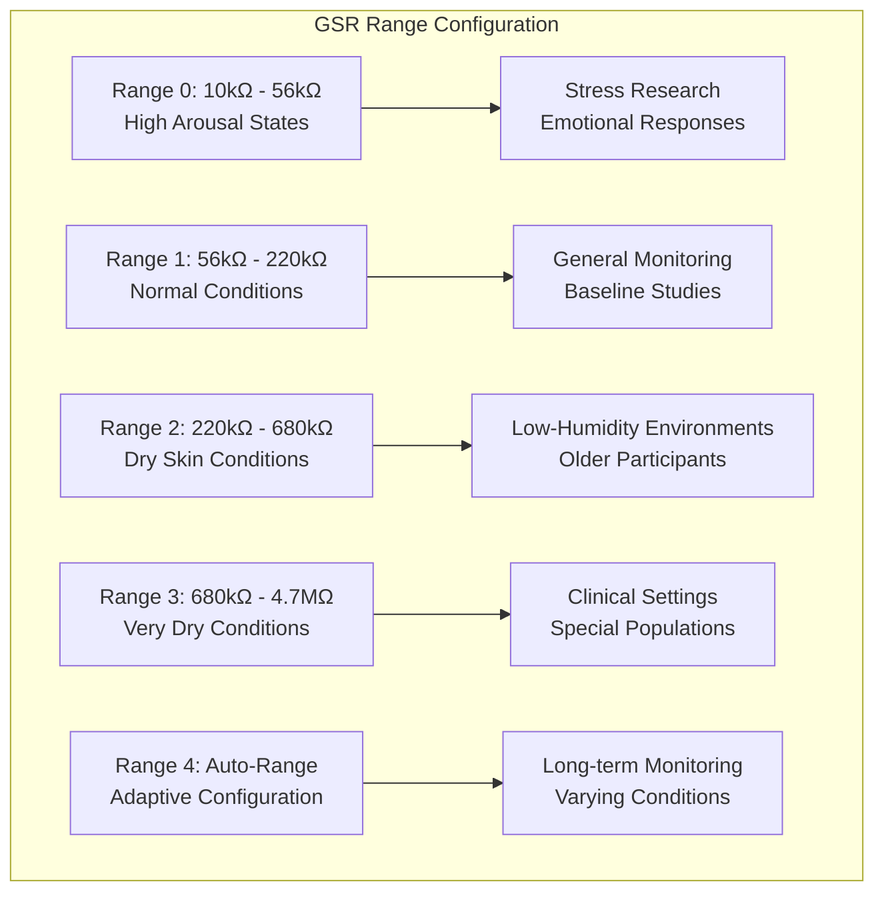
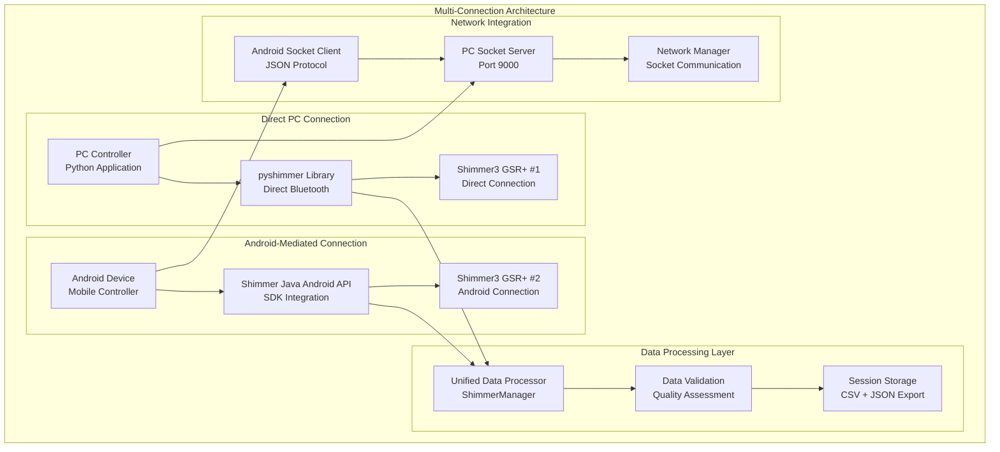
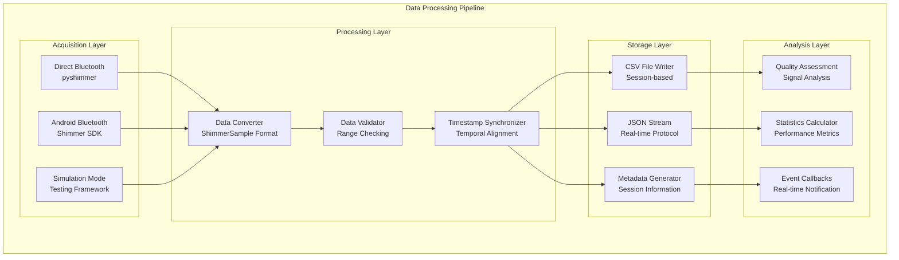

# Shimmer3 GSR+ Device Integration: Technical Deep-Dive

## Overview

This document provides a comprehensive technical analysis of the Shimmer3 GSR+ device integration within the Multi-Sensor Recording System. The Shimmer3 GSR+ represents a state-of-the-art wearable sensor platform that enables high-precision galvanic skin response measurements alongside complementary physiological signals including photoplethysmography (PPG), accelerometry, and other biometric parameters.

The integration architecture supports both direct PC-based connections via pyshimmer library and Android-mediated connections through the official Shimmer Java Android API, providing maximum flexibility for diverse research and application scenarios.

## Device Specifications

### Hardware Capabilities

The Shimmer3 GSR+ incorporates advanced sensor fusion capabilities designed for professional research applications:

- **Primary Sensor**: High-precision galvanic skin response (GSR) measurement
- **Sampling Rate Range**: 1 Hz to 1000 Hz (configurable)
- **GSR Measurement Range**: 10kΩ to 4.7MΩ (5 configurable ranges + auto-range)
- **Additional Sensors**: PPG, 3-axis accelerometer, 3-axis gyroscope, 3-axis magnetometer
- **Connectivity**: Bluetooth 2.1 + EDR / Bluetooth Low Energy (BLE)
- **Data Storage**: On-board MicroSD card capability
- **Battery Life**: 24+ hours continuous operation (typical usage)
- **Form Factor**: Compact wearable design optimized for research applications

### GSR Sensor Range Configuration

The device provides five distinct measurement ranges optimized for different skin conductance conditions:



## Architecture Overview

### System Integration Architecture

The Shimmer3 GSR+ integration employs a sophisticated dual-connection architecture that provides redundancy and flexibility for diverse deployment scenarios:



### Data Flow Architecture

The system implements a sophisticated data processing pipeline that ensures data integrity, temporal synchronization, and quality assessment:



## Key Classes and Components

### ShimmerManager Core Implementation

The `ShimmerManager` class serves as the central orchestrator for all Shimmer3 GSR+ device operations, implementing comprehensive device management, data processing, and session coordination:

```python
class ShimmerManager:
    """
    Enhanced Comprehensive Shimmer Sensor Management System
    
    Provides unified interface for managing Shimmer devices through both
    direct PC connections and Android-mediated connections.
    """
    
    def __init__(self, session_manager=None, logger=None, enable_android_integration=True):
        # Device management
        self.connected_devices: Dict[str, Union[ShimmerBluetooth, str]] = {}
        self.device_configurations: Dict[str, DeviceConfiguration] = {}
        self.device_status: Dict[str, ShimmerStatus] = {}
        
        # Android integration
        self.android_device_manager: Optional[AndroidDeviceManager] = None
        self.android_shimmer_mapping: Dict[str, str] = {}
        
        # Data management
        self.data_queues: Dict[str, queue.Queue] = {}
        self.csv_writers: Dict[str, csv.DictWriter] = {}
        
        # Configuration
        self.sensor_ranges = {
            'gsr_conductance': (0.0, 100.0),  # microsiemens
            'ppg_a13': (0.0, 4095.0),         # ADC units
            'accel_x': (-16.0, 16.0),         # g
            'battery_percentage': (0, 100)     # percentage
        }
```

### Connection Type Management

The system supports multiple connection types through an enumerated type system that enables consistent handling across different connectivity scenarios:

```python
class ConnectionType(Enum):
    """Types of Shimmer device connections"""
    DIRECT_BLUETOOTH = "direct_bluetooth"
    ANDROID_MEDIATED = "android_mediated"
    SIMULATION = "simulation"

class DeviceState(Enum):
    """Shimmer device states"""
    DISCONNECTED = "disconnected"
    CONNECTING = "connecting"
    CONNECTED = "connected"
    STREAMING = "streaming"
    ERROR = "error"
```

### Data Structure Design

The `ShimmerSample` dataclass provides a comprehensive structure for representing sensor data with full metadata and quality information:

```python
@dataclass
class ShimmerSample:
    """Enhanced data sample from Shimmer sensor"""
    
    timestamp: float
    system_time: str
    device_id: str
    connection_type: ConnectionType = ConnectionType.SIMULATION
    android_device_id: Optional[str] = None
    
    # Sensor data
    gsr_conductance: Optional[float] = None
    ppg_a13: Optional[float] = None
    accel_x: Optional[float] = None
    accel_y: Optional[float] = None
    accel_z: Optional[float] = None
    gyro_x: Optional[float] = None
    gyro_y: Optional[float] = None
    gyro_z: Optional[float] = None
    mag_x: Optional[float] = None
    mag_y: Optional[float] = None
    mag_z: Optional[float] = None
    ecg: Optional[float] = None
    emg: Optional[float] = None
    
    # Device status
    battery_percentage: Optional[int] = None
    signal_strength: Optional[float] = None
    
    # Session management
    session_id: Optional[str] = None
```

## Complex Algorithms and Logic

### Device Discovery and Connection Algorithm

The device discovery process implements a sophisticated multi-method approach that maximizes device detection reliability across different operating environments:

```python
def scan_and_pair_devices(self) -> Dict[str, List[str]]:
    """
    Scan for available Shimmer devices through all connection methods
    """
    discovered_devices = {
        'direct': [],
        'android': [],
        'simulated': []
    }
    
    # Method 1: Direct Bluetooth scanning via pyshimmer
    if PYSHIMMER_AVAILABLE:
        direct_devices = self._scan_direct_bluetooth_devices()
        discovered_devices['direct'] = direct_devices
    
    # Method 2: Android device scanning for Shimmer capabilities
    if self.enable_android_integration and self.android_device_manager:
        android_devices = self.android_device_manager.get_connected_devices()
        for device_id, device in android_devices.items():
            if 'shimmer' in device.capabilities:
                discovered_devices['android'].append(device_id)
    
    # Method 3: Simulation mode fallback
    if not discovered_devices['direct'] and not discovered_devices['android']:
        simulated_devices = [
            "00:06:66:66:66:66",  # Shimmer3 GSR+
            "00:06:66:66:66:67",  # Shimmer3 GSR+
        ]
        discovered_devices['simulated'] = simulated_devices
    
    return discovered_devices
```

### Data Validation Framework

The data validation system implements comprehensive range checking and quality assessment to ensure data integrity:

```python
def _validate_sample_data(self, sample: ShimmerSample) -> bool:
    """Validate Shimmer data sample against expected ranges"""
    try:
        # Check timestamp validity
        if sample.timestamp <= 0:
            return False
        
        # Check sensor values against physiological ranges
        sensor_checks = [
            ('gsr_conductance', sample.gsr_conductance),
            ('ppg_a13', sample.ppg_a13),
            ('accel_x', sample.accel_x),
            ('accel_y', sample.accel_y),
            ('accel_z', sample.accel_z),
            ('battery_percentage', sample.battery_percentage)
        ]
        
        for sensor_name, value in sensor_checks:
            if value is not None and sensor_name in self.sensor_ranges:
                min_val, max_val = self.sensor_ranges[sensor_name]
                if not (min_val <= value <= max_val):
                    self.logger.warning(f"Invalid {sensor_name} value: {value}")
                    return False
        
        return True
        
    except Exception as e:
        self.logger.error(f"Error validating sample data: {e}")
        return False
```

### Intelligent Reconnection Algorithm

The reconnection system implements exponential backoff with adaptive retry strategies:

```python
def _connect_single_device(self, mac_address: str, connection_type: ConnectionType) -> bool:
    """Connect to a single Shimmer device with specified connection type"""
    
    max_attempts = 3
    base_delay = 1.0  # seconds
    
    for attempt in range(max_attempts):
        try:
            delay = base_delay * (2 ** attempt)  # Exponential backoff
            
            if connection_type == ConnectionType.DIRECT_BLUETOOTH:
                # Implement direct pyshimmer connection
                serial_port = self._find_serial_port_for_device(mac_address)
                if not serial_port:
                    self.logger.error(f"No serial port found for {mac_address}")
                    time.sleep(delay)
                    continue
                
                shimmer_device = ShimmerBluetooth(serial_port)
                connect_success = shimmer_device.connect(timeout=10.0)
                
                if connect_success:
                    self.shimmer_devices[device_id] = shimmer_device
                    return True
            
            elif connection_type == ConnectionType.ANDROID_MEDIATED:
                # Implement Android-mediated connection
                return self._connect_android_device(mac_address)
            
            time.sleep(delay)
            
        except Exception as e:
            self.logger.error(f"Connection attempt {attempt + 1} failed: {e}")
            if attempt < max_attempts - 1:
                time.sleep(delay)
    
    return False
```

## System Integration Details

### Android Integration Components

The Android integration leverages the official Shimmer Java Android API through sophisticated wrapper components:

```python
class AndroidDeviceManager:
    """
    Manages Android devices with Shimmer capabilities
    """
    
    def __init__(self, server_port=9000, logger=None):
        self.server_port = server_port
        self.logger = logger
        self.connected_devices: Dict[str, AndroidDevice] = {}
        self.data_callbacks: List[Callable] = []
        self.status_callbacks: List[Callable] = []
    
    def add_data_callback(self, callback: Callable[[ShimmerDataSample], None]):
        """Register callback for Shimmer data from Android devices"""
        self.data_callbacks.append(callback)
    
    def send_sync_flash(self, duration_ms: int = 200) -> int:
        """Send synchronization flash to all connected Android devices"""
        sync_count = 0
        for device_id, device in self.connected_devices.items():
            if device.send_sync_signal('flash', duration_ms=duration_ms):
                sync_count += 1
        return sync_count
```

### PC Server Integration

The PC server component provides network communication capabilities for coordinating Android devices:

```python
class PCServer:
    """
    PC-based server for Android device coordination
    """
    
    def __init__(self, port=9000):
        self.port = port
        self.server_socket = None
        self.client_connections: Dict[str, socket.socket] = {}
    
    def start_server(self) -> bool:
        """Start the PC server for Android device connections"""
        try:
            self.server_socket = socket.socket(socket.AF_INET, socket.SOCK_STREAM)
            self.server_socket.bind(('localhost', self.port))
            self.server_socket.listen(5)
            return True
        except Exception as e:
            self.logger.error(f"Failed to start server: {e}")
            return False
    
    def handle_android_message(self, message: Dict[str, Any]):
        """Process messages from Android devices"""
        if message.get('type') == 'shimmer_data':
            self._process_shimmer_data(message)
        elif message.get('type') == 'status_update':
            self._process_status_update(message)
```

## Session Management and Data Export

### Session-Based Recording Architecture

The session management system provides comprehensive data organization and metadata tracking:

```python
def start_recording(self, session_id: str) -> bool:
    """Start recording data to files"""
    try:
        self.current_session_id = session_id
        self.session_start_time = datetime.now()
        
        # Create session directory structure
        session_dir = self._create_session_directory(session_id)
        if not session_dir:
            return False
        
        # Initialize CSV files for each device
        for device_id in self.device_status:
            if not self._initialize_csv_file(device_id, session_dir):
                self.logger.error(f"Failed to initialize CSV file for {device_id}")
                return False
        
        # Start streaming if not already started
        if not self.is_streaming:
            if not self.start_streaming():
                return False
        
        self.is_recording = True
        return True
        
    except Exception as e:
        self.logger.error(f"Error starting recording: {e}")
        return False
```

### CSV Export Format

The CSV export system provides comprehensive data export with full metadata:

```python
def _initialize_csv_file(self, device_id: str, session_dir: Path) -> bool:
    """Initialize CSV file for a device with comprehensive sensor data"""
    try:
        csv_file_path = session_dir / f"{device_id}_data.csv"
        csv_file = open(csv_file_path, "w", newline="")
        
        fieldnames = [
            "timestamp", "system_time", "device_id", "connection_type",
            "android_device_id", "session_id",
            "gsr_conductance", "ppg_a13",
            "accel_x", "accel_y", "accel_z",
            "gyro_x", "gyro_y", "gyro_z",
            "mag_x", "mag_y", "mag_z",
            "ecg", "emg", "battery_percentage", "signal_strength"
        ]
        
        writer = csv.DictWriter(csv_file, fieldnames=fieldnames)
        writer.writeheader()
        
        self.csv_files[device_id] = csv_file
        self.csv_writers[device_id] = writer
        
        return True
        
    except Exception as e:
        self.logger.error(f"Error initializing CSV file for {device_id}: {e}")
        return False
```

## Performance Optimization and Scalability

### Threading Architecture

The system employs sophisticated threading for concurrent data processing and file operations:

```python
def _start_background_threads(self) -> None:
    """Start background processing threads"""
    self.stop_event.clear()
    
    self.data_processing_thread = threading.Thread(
        target=self._data_processing_loop, 
        name="ShimmerDataProcessing"
    )
    self.data_processing_thread.daemon = True
    self.data_processing_thread.start()
    
    self.file_writing_thread = threading.Thread(
        target=self._file_writing_loop, 
        name="ShimmerFileWriting"
    )
    self.file_writing_thread.daemon = True
    self.file_writing_thread.start()

def _data_processing_loop(self) -> None:
    """Background thread for processing incoming data"""
    while not self.stop_event.is_set():
        try:
            for device_id, data_queue in self.data_queues.items():
                try:
                    sample = data_queue.get_nowait()
                    self._process_data_sample(sample)
                except queue.Empty:
                    continue
            
            time.sleep(0.01)  # Prevent busy waiting
            
        except Exception as e:
            self.logger.error(f"Error in data processing loop: {e}")
            time.sleep(1.0)
```

### Memory Management

The system implements efficient memory management through circular buffers and queue management:

```python
def _start_simulated_streaming(self, device_id: str) -> None:
    """Start simulated data streaming for testing"""
    
    def simulate_data():
        while not self.stop_event.is_set() and self.is_streaming:
            try:
                if (device_id in self.device_status and 
                    self.device_status[device_id].is_streaming):
                    
                    sample = self._generate_simulated_sample(device_id)
                    
                    if device_id in self.data_queues:
                        try:
                            self.data_queues[device_id].put_nowait(sample)
                        except queue.Full:
                            # Remove oldest sample and add new one
                            try:
                                self.data_queues[device_id].get_nowait()
                                self.data_queues[device_id].put_nowait(sample)
                            except queue.Empty:
                                pass
                
                time.sleep(1.0 / self.default_sampling_rate)
                
            except Exception as e:
                self.logger.error(f"Error in simulated streaming: {e}")
                time.sleep(1.0)
    
    self.thread_pool.submit(simulate_data)
```

### Battery Optimization Strategies

The system includes comprehensive battery optimization features for extended measurement sessions:

```kotlin
// Dynamic sampling rate management for battery conservation
fun optimizeSamplingForBattery(isActivelyRecording: Boolean, batteryLevel: Int) {
    when {
        batteryLevel < 20 -> {
            // Critical battery: minimal power mode
            shimmer.writeSamplingRate(1.0) // 1 Hz 
            shimmer.writeEnabledSensors(Configuration.Shimmer3.SENSOR_GSR) // GSR only
        }
        batteryLevel < 50 && !isActivelyRecording -> {
            // Low battery during standby: reduced rate
            shimmer.writeSamplingRate(5.0) // 5 Hz for basic monitoring
        }
        isActivelyRecording -> {
            // Active recording: optimal balance
            shimmer.writeSamplingRate(51.2) // Standard recording rate
        }
        else -> {
            // Normal operation: full capability
            shimmer.writeSamplingRate(128.0) // High-resolution mode
        }
    }
}

// Sensor combination optimization
fun configurePowerOptimalSensors(powerMode: PowerMode): Int {
    return when (powerMode) {
        PowerMode.LOW_POWER -> 
            Configuration.Shimmer3.SENSOR_GSR // GSR only
        PowerMode.STANDARD -> 
            Configuration.Shimmer3.SENSOR_GSR or Configuration.Shimmer3.SENSOR_PPG_A13
        PowerMode.HIGH_PERFORMANCE -> 
            Configuration.Shimmer3.SENSOR_GSR or 
            Configuration.Shimmer3.SENSOR_PPG_A13 or 
            Configuration.Shimmer3.SENSOR_LSM303DLHC_ACCEL
    }
}
```

## Error Handling and Recovery

### Comprehensive Error Classification

The system implements hierarchical error handling with specific recovery strategies:

```python
class ShimmerError(Exception):
    """Base exception for Shimmer-related errors"""
    pass

class ConnectionError(ShimmerError):
    """Errors related to device connection"""
    pass

class DataValidationError(ShimmerError):
    """Errors related to data validation"""
    pass

class ConfigurationError(ShimmerError):
    """Errors related to device configuration"""
    pass
```

### Graceful Cleanup and Resource Management

The cleanup process ensures proper resource disposal and connection termination:

```python
def cleanup(self) -> None:
    """Clean up resources and disconnect devices"""
    try:
        self.logger.info("Cleaning up Enhanced ShimmerManager...")
        
        # Stop recording and streaming
        if self.is_recording:
            self.stop_recording()
        if self.is_streaming:
            self.stop_streaming()
        
        # Stop background threads
        self.stop_event.set()
        if self.data_processing_thread and self.data_processing_thread.is_alive():
            self.data_processing_thread.join(timeout=5.0)
        
        # Cleanup Android integration
        if self.android_device_manager:
            self.android_device_manager.shutdown()
        
        # Disconnect pyshimmer devices
        for device_id, shimmer_device in self.shimmer_devices.items():
            try:
                if hasattr(shimmer_device, 'disconnect'):
                    shimmer_device.disconnect()
                self.logger.info(f"Disconnected pyshimmer device: {device_id}")
            except Exception as e:
                self.logger.error(f"Error disconnecting {device_id}: {e}")
        
        # Clean up thread pool
        self.thread_pool.shutdown(wait=True)
        
        self.is_initialized = False
        
    except Exception as e:
        self.logger.error(f"Error during cleanup: {e}")
```

## SDK Integration and External References

### Shimmer Research Official SDKs

The implementation leverages several official Shimmer Research SDKs and libraries:

**pyshimmer Library** ([github.com/seemoo-lab/pyshimmer](https://github.com/seemoo-lab/pyshimmer))
- Direct PC-based Bluetooth communication
- Low-level device control and configuration
- Real-time data streaming capabilities
- Compatible with Shimmer3 GSR+ hardware

**Shimmer Java Android API** ([github.com/ShimmerEngineering/Shimmer-Java-Android-API](https://github.com/ShimmerEngineering/Shimmer-Java-Android-API))
- Official Android SDK from Shimmer Research
- Comprehensive device management
- ObjectCluster data processing framework
- Production-ready Android integration

**Shimmer Android API** ([github.com/buccancs/ShimmerAndroidAPI](https://github.com/buccancs/ShimmerAndroidAPI))
- Enhanced Android integration components
- Extended functionality for research applications
- Multi-device coordination capabilities

### Technical Specifications from Online Sources

**Device Hardware Specifications** (Shimmer Research Documentation):
- **Processor**: TI CC2560 Bluetooth controller + MSP430 microcontroller
- **GSR Sensor**: Proprietary electrodermal activity measurement circuit
- **Sampling Resolution**: 12-bit ADC for analog sensors
- **Memory**: 32KB flash, 8KB RAM, optional MicroSD storage
- **Power Management**: 450mAh Li-ion battery with charging dock
- **Dimensions**: 65mm x 32mm x 15mm
- **Weight**: 23.6g including battery and strap

**Communication Protocols** (Shimmer Technical Reference):
- **Bluetooth Classic**: SPP (Serial Port Profile) for data transmission
- **Bluetooth Low Energy**: Custom GATT services for low-power operation
- **Data Rate**: Up to 921.6 kbps over Bluetooth Classic
- **Range**: 10m typical, 100m line-of-sight maximum
- **Frequency**: 2.4 GHz ISM band, frequency-hopping spread spectrum

**Sensor Calibration Parameters** (Shimmer Calibration Documentation):
- **GSR Calibration**: Factory-calibrated resistance-to-conductance conversion
- **Accelerometer**: ±2g/±4g/±8g/±16g full-scale ranges with digital calibration
- **Gyroscope**: ±250°/s to ±2000°/s with temperature compensation
- **PPG Sensor**: 24-bit sigma-delta ADC with programmable gain amplifier

## Integration with Overall System

The Shimmer3 GSR+ integration seamlessly integrates with the broader Multi-Sensor Recording System through several key interfaces:

### Network Protocol Integration

The system supports JSON-based network communication for real-time data sharing and device coordination across the network architecture.

### Session Management Integration

Session management is coordinated with the overall system's session framework, ensuring consistent data organization and metadata generation across all sensor modalities.

### Calibration System Integration

The Shimmer integration coordinates with the overall calibration system to ensure temporal synchronization and data alignment with other sensor modalities including cameras and thermal imaging.

### User Interface Integration

The system provides comprehensive callback interfaces that enable real-time UI updates, status monitoring, and user feedback through the main application interface.

This comprehensive technical architecture provides a robust foundation for research-grade physiological data collection while maintaining the flexibility and scalability required for diverse experimental scenarios. The modular design ensures long-term maintainability and facilitates future enhancements to support additional sensor modalities and analysis capabilities.