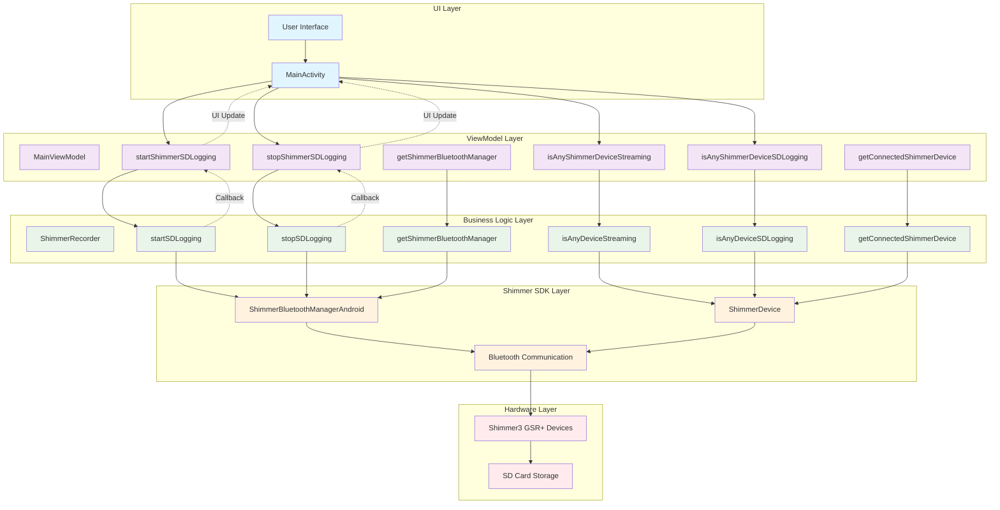
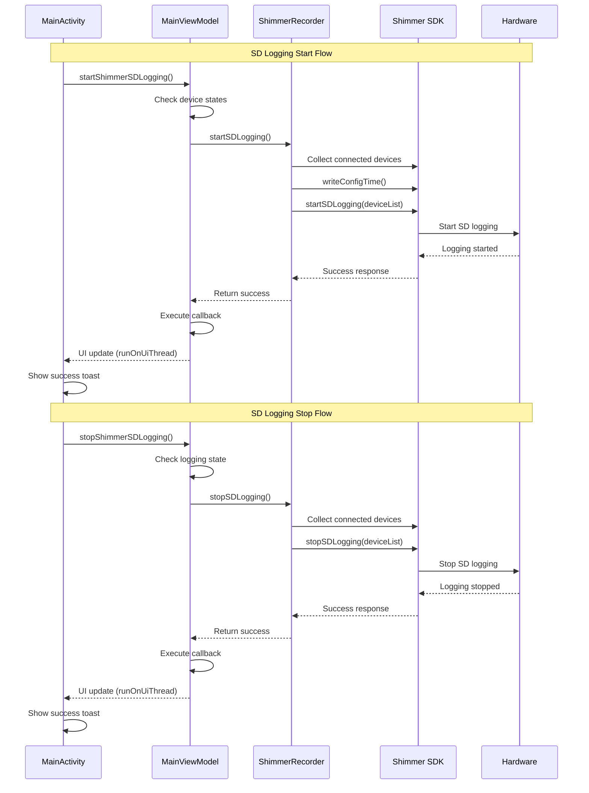
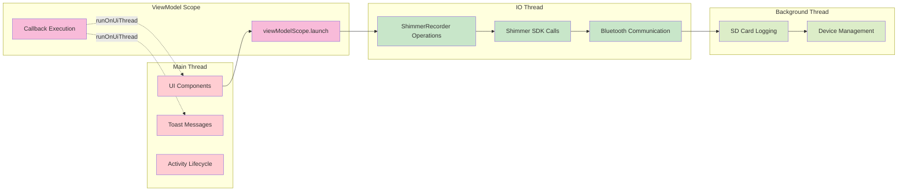
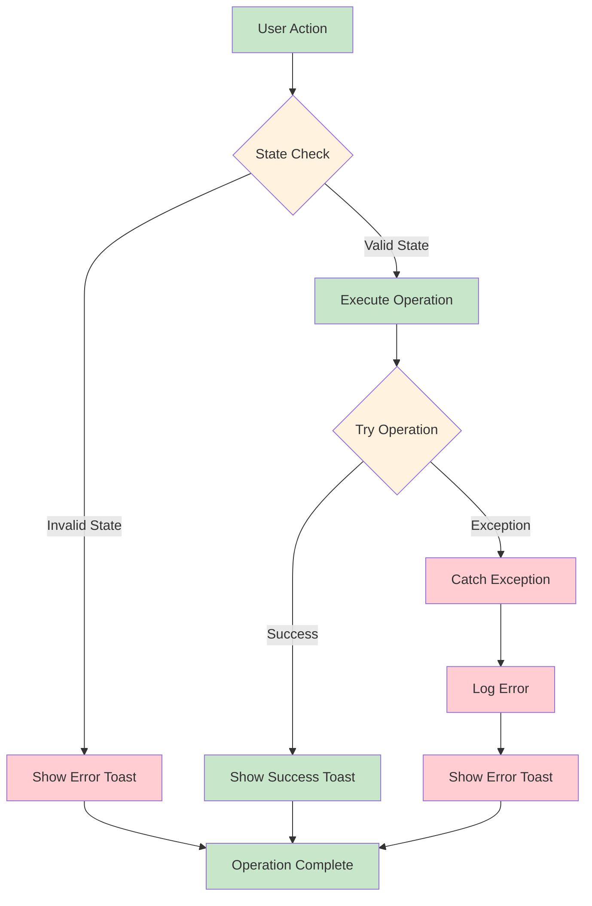

# Shimmer SD Logging Architecture

This document describes the architectural changes made for Shimmer SD logging integration.

## SD Logging Integration Architecture

## Data Flow Architecture

## Thread Safety Architecture

## Error Handling Architecture

## Key Architectural Benefits

### 1. **Separation of Concerns**
- UI layer handles user interactions and display
- ViewModel layer manages state and coordinates operations
- Business logic layer handles Shimmer-specific operations
- SDK layer provides hardware abstraction

### 2. **Thread Safety**
- All UI updates use `runOnUiThread` for main thread safety
- Shimmer operations run on IO dispatcher
- Callback-based architecture prevents blocking

### 3. **Error Handling**
- Comprehensive state validation before operations
- Graceful error recovery with user feedback
- Detailed logging for troubleshooting

### 4. **Maintainability**
- Clear separation between layers
- Wrapper methods provide clean API
- Consistent error handling patterns

### 5. **Testability**
- ViewModel wrapper methods can be easily mocked
- Clear interfaces between layers
- Callback-based architecture supports testing