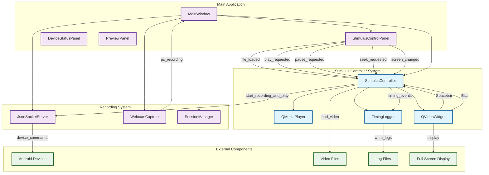
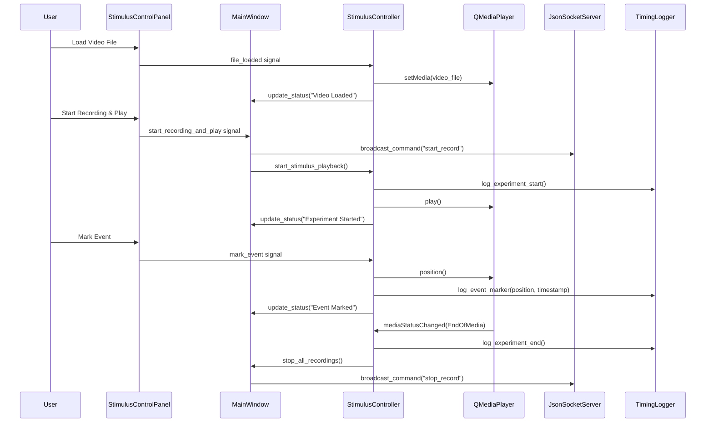

# Stimulus Presentation Controller Architecture

## Overview

This document describes the architectural design for Milestone 3.5: Stimulus Presentation Controller, which integrates video stimulus presentation with the existing multi-device recording system.

## System Architecture Diagram

## Component Responsibilities

### New Components (Milestone 3.5)

#### StimulusController
- **Purpose**: Central controller for video stimulus presentation
- **Responsibilities**:
  - Manage QMediaPlayer lifecycle and video loading
  - Handle playback controls (play, pause, stop, seek)
  - Coordinate full-screen display on selected monitor
  - Implement keyboard shortcuts (Spacebar, Esc)
  - Synchronize stimulus start with recording system
  - Trigger event logging and markers

#### QMediaPlayer
- **Purpose**: Qt multimedia component for video playback
- **Responsibilities**:
  - Load and decode video files (MP4, AVI, MOV, MKV, WMV)
  - Provide playback control (play, pause, stop)
  - Track playback position and duration
  - Emit signals for playback state changes

#### QVideoWidget
- **Purpose**: Qt widget for video display
- **Responsibilities**:
  - Render video frames from QMediaPlayer
  - Support full-screen mode on selected display
  - Handle keyboard input for shortcuts
  - Manage window positioning and geometry

#### TimingLogger
- **Purpose**: Local logging system for experiment timing
- **Responsibilities**:
  - Create timestamped log files for each experiment session
  - Log stimulus start/end times with precise timestamps
  - Log operator-triggered event markers with video position
  - Store all timing data locally on PC for analysis

### Enhanced Existing Components

#### StimulusControlPanel (Enhanced)
- **New Functionality**:
  - "Start Recording & Play" button for synchronized experiment start
  - "Mark Event" button for timestamped event logging
  - Real-time status indicators for playback and recording state
  - Enhanced error handling and user feedback

#### MainWindow (Enhanced)
- **New Functionality**:
  - Signal handlers for stimulus panel events
  - Integration with StimulusController for experiment coordination
  - Enhanced toolbar with stimulus-related actions
  - Coordinated start/stop of recording and stimulus systems

## Signal Flow Architecture

## Synchronization Strategy

### Timing Accuracy
- **System Clock**: All timestamps use Python's `time.time()` for sub-second precision
- **Synchronization Reference**: PC system time serves as master clock for all devices
- **Coordination**: Near-simultaneous start of stimulus playback and device recording
- **Logging**: All events logged with precise timestamps for post-analysis alignment

### Multi-Device Coordination
1. **Preparation Phase**: Load video, connect devices, verify readiness
2. **Synchronized Start**: 
   - Send start_record command to all Android devices
   - Start PC webcam recording
   - Begin stimulus video playback
   - Log experiment start timestamp
3. **Event Tracking**: Log operator markers and system events during experiment
4. **Coordinated Stop**: Stop all recordings when stimulus ends or operator stops

## File System Integration

### Video Files
- **Supported Formats**: MP4, AVI, MOV, MKV, WMV
- **Location**: User-selectable via file dialog
- **Validation**: Format verification and codec compatibility checking

### Log Files
- **Format**: JSON or CSV with structured timing data
- **Location**: Local PC storage alongside recording files
- **Content**: Experiment metadata, stimulus timeline, event markers
- **Naming**: Timestamped filenames for session identification

## Error Handling Strategy

### Video Playback Errors
- **Codec Issues**: User-friendly error messages with format recommendations
- **File Access**: Proper error handling for missing or corrupted files
- **Hardware Issues**: Graceful degradation for display or audio problems

### Synchronization Errors
- **Device Communication**: Timeout handling and retry mechanisms
- **Timing Accuracy**: Validation of synchronization precision
- **Recovery Procedures**: Ability to restart failed experiments

## Performance Considerations

### Resource Management
- **CPU Usage**: Monitor impact of simultaneous video playback and recording
- **Memory Usage**: Efficient video buffer management
- **Disk I/O**: Optimize concurrent file writing for recordings and logs

### Optimization Strategies
- **Video Resolution**: Support for different quality settings based on hardware
- **Buffer Management**: Appropriate buffering for smooth playback
- **Thread Management**: Proper separation of UI, media, and network threads

## Future Enhancement Opportunities

### Advanced Features
- **Multiple Stimulus Types**: Support for image sequences, audio stimuli
- **Stimulus Scripting**: Programmatic control of stimulus presentation
- **Real-time Analysis**: Live processing of recorded data during experiments
- **Cloud Integration**: Remote experiment monitoring and data backup

### Improved Synchronization
- **Hardware Sync**: Integration with external timing hardware
- **Visual Sync Markers**: Embedded sync signals in stimulus content
- **Network Time Protocol**: Enhanced timing accuracy across devices
