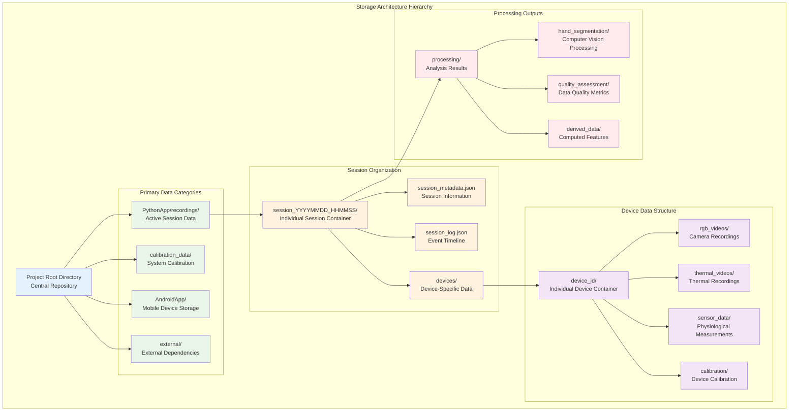

# Data Models and Storage Specification

## Table of Contents

- [1. Introduction](#1-introduction)
- [2. Storage Architecture Overview](#2-storage-architecture-overview)
- [3. Directory Structure and Organization](#3-directory-structure-and-organization)
  - [3.1 Root Data Organization](#31-root-data-organization)
  - [3.2 Session Folder Architecture](#32-session-folder-architecture)
  - [3.3 Device-Specific Data Organization](#33-device-specific-data-organization)
- [4. File Naming Standards and Conventions](#4-file-naming-standards-and-conventions)
  - [4.1 Core Naming Principles](#41-core-naming-principles)
  - [4.2 Session Naming Patterns](#42-session-naming-patterns)
  - [4.3 Data File Naming Conventions](#43-data-file-naming-conventions)
- [5. Data Schemas and Structures](#5-data-schemas-and-structures)
  - [5.1 Session Metadata Schema](#51-session-metadata-schema)
  - [5.2 Sensor Data Schema](#52-sensor-data-schema)
  - [5.3 Video Data Schema](#53-video-data-schema)
- [6. Quick Access and Navigation Guide](#6-quick-access-and-navigation-guide)
- [7. Data Management and Maintenance](#7-data-management-and-maintenance)
- [8. Implementation Guidelines](#8-implementation-guidelines)

## 1. Introduction

The Multi-Sensor Synchronized Recording System implements a comprehensive data management architecture designed to handle complex, multi-modal physiological data collection scenarios. This system must effectively organize and store synchronized data streams from multiple sources including RGB cameras, thermal imaging devices, physiological sensors, and metadata streams while maintaining temporal coherence and providing intuitive access patterns for researchers and analysts.

The data storage architecture addresses several critical requirements that are essential for scientific research applications. These include maintaining temporal synchronization across multiple data streams, providing comprehensive metadata for research reproducibility, implementing hierarchical organization that scales to large datasets, ensuring data integrity and validation across all storage operations, and facilitating efficient data retrieval and analysis workflows.

The system design recognizes that physiological research data has unique characteristics that distinguish it from typical data storage requirements. The data streams are inherently multi-modal, containing video, sensor readings, timing information, and contextual metadata that must be precisely aligned in time. The data collection sessions can span extended periods, generating substantial volumes of information that require efficient organization and compression strategies.

Furthermore, the research context demands exceptional attention to data quality, provenance, and reproducibility. Every aspect of the data collection process must be documented, from device configuration parameters to environmental conditions, enabling future researchers to understand and replicate experimental conditions. The storage architecture implements comprehensive logging and validation mechanisms that ensure data integrity while providing detailed audit trails for scientific validation.

## 2. Storage Architecture Overview

The storage architecture implements a hierarchical, session-based organization pattern that provides logical separation between different data collection activities while maintaining clear relationships between related data elements. This architecture balances the need for organizational clarity with the practical requirements of data access, analysis, and long-term storage management.



This hierarchical architecture provides several key advantages for research data management. The session-based organization enables clear temporal boundaries for different experimental activities, while the device-centric structure within each session maintains logical separation between different data sources. The processing outputs are organized to support iterative analysis workflows while maintaining clear provenance relationships to the original data sources.

## 3. Directory Structure and Organization

### 3.1 Root Data Organization

The root directory structure provides clear separation between different categories of data while maintaining intuitive navigation patterns for researchers and system administrators. Each major category serves distinct purposes within the overall data management strategy:

```
project-root/
├── PythonApp/
│   ├── recordings/                    # Primary session recordings
│   │   ├── session_YYYYMMDD_HHMMSS/   # Individual timestamped sessions
│   │   ├── session_YYYYMMDD_HHMMSS/   # Each session contains complete data
│   │   └── ...                        # Multiple sessions organized chronologically
│   ├── test_recordings/               # Development and validation sessions
│   │   ├── unit_test_sessions/        # Automated testing data
│   │   ├── integration_test_data/     # System integration validation
│   │   └── performance_benchmarks/    # Performance testing results
│   ├── test_videos/                   # Video processing validation outputs
│   │   ├── algorithm_validation/      # Computer vision algorithm testing
│   │   ├── quality_assessment/        # Video quality validation results
│   │   └── processing_benchmarks/     # Performance analysis outputs
│   └── test_logs/                     # Development and debugging logs
│       ├── system_diagnostics/        # System health monitoring
│       ├── error_analysis/            # Error pattern analysis
│       └── performance_metrics/       # System performance tracking
├── calibration_data/                  # System calibration and validation
│   ├── camera_calibration/            # RGB camera calibration sessions
│   │   ├── intrinsic_parameters/      # Camera intrinsic calibration
│   │   ├── extrinsic_parameters/      # Camera positioning calibration
│   │   └── stereo_calibration/        # Multi-camera system calibration
│   ├── thermal_calibration/           # Thermal camera calibration
│   │   ├── temperature_validation/    # Temperature accuracy validation
│   │   ├── spatial_calibration/       # Thermal-RGB alignment
│   │   └── temporal_calibration/      # Thermal camera timing calibration
│   └── sensor_calibration/            # Physiological sensor calibration
│       ├── gsr_calibration/           # GSR sensor accuracy validation
│       ├── ppg_calibration/           # Heart rate sensor validation
│       └── motion_calibration/        # Accelerometer calibration
├── AndroidApp/                        # Mobile application data storage
│   ├── device_storage/                # Device-specific temporary storage
│   ├── local_processing/              # On-device processing results
│   └── sync_buffers/                  # Data synchronization buffers
├── external/                          # External dependencies and libraries
│   ├── models/                        # Machine learning model files
│   ├── algorithms/                    # External algorithm implementations
│   └── reference_data/                # Reference datasets and benchmarks
└── documentation/                     # Documentation and metadata
    ├── schemas/                       # Data schema definitions
    ├── protocols/                     # Data collection protocols
    └── validation/                    # Data validation specifications
```

**PythonApp/recordings/**: This directory contains the primary research data collected during active sessions. Each session is organized into timestamped folders that contain complete datasets including video recordings, sensor data, metadata, and processing results. This organization enables chronological browsing and facilitates long-term data management.

**calibration_data/**: Contains all calibration sessions and validation data required to ensure measurement accuracy and system reliability. The calibration data is organized by sensor type and calibration purpose, enabling systematic validation of system performance and measurement quality over time.

**AndroidApp/**: Houses mobile application data including temporary storage, local processing results, and synchronization buffers. This organization enables efficient data transfer between mobile and desktop components while maintaining clear separation between temporary and permanent data storage.

### 3.2 Session Folder Architecture

Each recording session creates a comprehensive data container that includes all information necessary to understand, analyze, and reproduce the data collection process. The session folder architecture implements a standardized structure that ensures consistency across different experimental protocols while providing flexibility for diverse research requirements.

```
session_YYYYMMDD_HHMMSS/
├── session_metadata.json                    # Comprehensive session information
├── session_YYYYMMDD_HHMMSS_log.json        # Detailed chronological event log
├── session_configuration.json               # System configuration snapshot
├── devices/                                 # Device-specific data organization
│   ├── phone_1/                            # Primary mobile device data
│   │   ├── rgb_videos/                     # RGB camera recordings
│   │   │   ├── phone_1_rgb_YYYYMMDD_HHMMSS.mp4
│   │   │   ├── phone_1_rgb_metadata.json   # Video recording metadata
│   │   │   └── phone_1_rgb_quality.json    # Video quality assessment
│   │   ├── thermal_videos/                 # Thermal camera recordings
│   │   │   ├── phone_1_thermal_YYYYMMDD_HHMMSS.mp4
│   │   │   ├── phone_1_thermal_calibration.json
│   │   │   └── phone_1_thermal_metadata.json
│   │   ├── sensor_data/                    # Physiological sensor data
│   │   │   ├── phone_1_gsr_YYYYMMDD_HHMMSS.csv
│   │   │   ├── phone_1_ppg_YYYYMMDD_HHMMSS.csv
│   │   │   ├── phone_1_accel_YYYYMMDD_HHMMSS.csv
│   │   │   └── phone_1_sensor_metadata.json
│   │   ├── synchronization/                # Timing synchronization data
│   │   │   ├── sync_signals.csv           # Synchronization timestamps
│   │   │   ├── timing_validation.json      # Timing accuracy assessment
│   │   │   └── clock_drift_correction.json # Clock synchronization data
│   │   └── device_status/                  # Device health monitoring
│   │       ├── battery_levels.csv         # Power consumption tracking
│   │       ├── thermal_monitoring.csv     # Device temperature monitoring
│   │       └── performance_metrics.json   # Device performance data
│   ├── phone_2/                           # Additional mobile devices
│   │   └── (similar structure)            # Identical organization pattern
│   └── ...                                # Support for multiple devices
├── webcam/                                # Desktop camera recordings
│   ├── webcam_1_YYYYMMDD_HHMMSS.mp4       # Webcam video recording
│   ├── webcam_metadata.json               # Webcam configuration data
│   └── webcam_synchronization.json        # Webcam timing data
├── processing/                            # Data processing and analysis results
│   ├── hand_segmentation/                 # Computer vision processing
│   │   ├── segmented_videos/              # Hand region extraction results
│   │   ├── mask_sequences/                # Segmentation mask sequences
│   │   ├── roi_coordinates.json           # Region of interest coordinates
│   │   └── segmentation_quality.json     # Segmentation quality metrics
│   ├── feature_extraction/                # Physiological feature extraction
│   │   ├── gsr_features.json             # GSR-derived features
│   │   ├── video_features.json           # Video-based features
│   │   ├── temporal_features.json        # Time-series features
│   │   └── multimodal_features.json      # Cross-modal feature integration
│   ├── quality_assessment/                # Data quality analysis
│   │   ├── signal_quality_metrics.json   # Signal quality assessment
│   │   ├── data_completeness.json        # Data completeness analysis
│   │   ├── artifact_detection.json       # Artifact identification results
│   │   └── validation_report.json        # Comprehensive validation report
│   └── analysis_results/                  # Research analysis outputs
│       ├── statistical_analysis.json     # Statistical analysis results
│       ├── correlation_analysis.json     # Cross-modal correlation analysis
│       ├── prediction_results.json       # GSR prediction outcomes
│       └── research_findings.json        # Summary research findings
├── environment/                           # Environmental context data
│   ├── experimental_conditions.json      # Laboratory conditions
│   ├── participant_metadata.json         # Participant information (anonymized)
│   ├── protocol_information.json         # Experimental protocol details
│   └── external_factors.json             # External environmental factors
└── validation/                            # Data validation and verification
    ├── integrity_checksums.json          # File integrity verification
    ├── temporal_validation.json          # Temporal coherence validation
    ├── cross_device_validation.json      # Multi-device consistency check
    └── quality_certification.json        # Overall data quality certification
```

This comprehensive folder structure ensures that every aspect of the data collection process is documented and preserved, enabling complete reconstruction of experimental conditions and supporting rigorous scientific analysis and validation procedures.

### 3.3 Device-Specific Data Organization

The device-specific organization pattern provides standardized structure for data from individual devices while accommodating the unique characteristics of different sensor types and data modalities. This organization enables efficient data access and processing while maintaining clear relationships between related data streams.

Each device folder implements a consistent organizational pattern that includes:

**Video Data Organization**: Video recordings are organized by type (RGB, thermal) with accompanying metadata that documents recording parameters, quality assessments, and temporal alignment information. This organization supports efficient video processing workflows while maintaining comprehensive documentation of recording conditions.

**Sensor Data Organization**: Physiological sensor data is organized by sensor type with accompanying metadata that documents calibration parameters, data quality metrics, and temporal synchronization information. The CSV format provides compatibility with standard analysis tools while the JSON metadata enables comprehensive data documentation.

**Synchronization Data**: Timing synchronization data provides the foundation for multi-modal data integration, documenting the precise temporal relationships between different data streams and enabling accurate cross-modal analysis.

## 4. File Naming Standards and Conventions

### 4.1 Core Naming Principles

The file naming system implements several fundamental principles that ensure consistency, predictability, and compatibility across different computing platforms and analysis workflows:

**Predictability**: All file names follow consistent patterns that enable users to understand file contents and relationships without requiring additional documentation. The naming patterns are designed to be intuitive for researchers while providing sufficient detail for automated processing systems.

**Sortability**: File names are designed to sort chronologically when listed alphabetically, enabling efficient browsing of data collections and facilitating time-based analysis workflows. The timestamp format ensures that files appear in correct temporal order in standard file system views.

**Human Readability**: File names are descriptive and self-documenting, avoiding cryptic abbreviations or codes that might be difficult to interpret. Component separation using underscores provides clear visual separation of different naming elements.

**System Compatibility**: The naming conventions avoid special characters that could cause issues across different operating systems, ensuring compatibility with Windows, macOS, and Linux filesystems. The conventions are also designed to be safe for network transfers and archiving systems.

**Extensibility**: The naming patterns are designed to accommodate future system enhancements and additional data types without requiring changes to existing naming conventions or breaking compatibility with existing analysis workflows.

### 4.2 Session Naming Patterns

Session folders implement a standardized naming pattern that provides clear identification while supporting both manual and automated organization:

**Standard Pattern**: `session_YYYYMMDD_HHMMSS/`
- Uses ISO 8601 date format for international compatibility
- Includes precise timestamp to prevent naming conflicts
- Enables chronological sorting in file system views
- Provides immediate temporal context for data exploration

**Custom Naming Pattern**: `[custom_name_]YYYYMMDD_HHMMSS/`
- Allows descriptive session names for research organization
- Custom names limited to alphanumeric characters, hyphens, and underscores
- No spaces in folder names (use underscores for separation)
- Maximum total length of 100 characters to ensure compatibility
- Always ends with timestamp for uniqueness and sorting

**Examples of Valid Session Names**:
- `session_20250131_143022/` (standard session)
- `baseline_measurement_20250131_143022/` (custom named session)
- `stress_protocol_pilot_20250131_143022/` (descriptive research session)
- `calibration_validation_20250131_143022/` (system validation session)

### 4.3 Data File Naming Conventions

Data files within sessions follow specific naming patterns that identify the device, data type, and temporal context while maintaining consistency across different data modalities:

**Video File Naming**:
```
{device_id}_{video_type}_{YYYYMMDD_HHMMSS}.{extension}
```

Examples:
- `phone_1_rgb_20250131_143022.mp4` (RGB video from phone 1)
- `phone_2_thermal_20250131_143022.mp4` (thermal video from phone 2)
- `webcam_1_20250131_143022.mp4` (webcam recording)

**Sensor Data File Naming**:
```
{device_id}_{sensor_type}_{YYYYMMDD_HHMMSS}.csv
```

Examples:
- `phone_1_gsr_20250131_143022.csv` (GSR data from phone 1)
- `phone_1_ppg_20250131_143022.csv` (heart rate data from phone 1)
- `phone_1_accel_20250131_143022.csv` (accelerometer data from phone 1)

**Metadata File Naming**:
```
{base_filename}_metadata.json
{session_name}_log.json
{device_id}_{data_type}_quality.json
```

Examples:
- `phone_1_rgb_metadata.json` (video recording metadata)
- `session_20250131_143022_log.json` (session event log)
- `phone_1_gsr_quality.json` (GSR data quality assessment)

## 5. Data Schemas and Structures

### 5.1 Session Metadata Schema

The session metadata schema provides comprehensive documentation of data collection parameters, system configuration, and environmental conditions. This metadata enables reproducible research and supports automated data validation and analysis workflows.

```json
{
  "session_info": {
    "session_id": "session_20250131_143022",
    "start_time": "2025-01-31T14:30:22.000Z",
    "end_time": "2025-01-31T14:45:30.000Z",
    "duration_seconds": 908,
    "session_type": "research_data_collection",
    "protocol_version": "1.2.0",
    "researcher_id": "researcher_001",
    "experiment_id": "GSR_prediction_study_001"
  },
  "devices": {
    "mobile_devices": [
      {
        "device_id": "phone_1",
        "device_model": "Samsung Galaxy S22",
        "android_version": "13",
        "app_version": "2.1.0",
        "mac_address": "00:06:66:66:96:86",
        "sensors_enabled": ["rgb_camera", "thermal_camera", "shimmer_gsr"],
        "sampling_rates": {
          "rgb_video": 30,
          "thermal_video": 30,
          "gsr_sensor": 51.2,
          "accelerometer": 51.2
        },
        "calibration_status": {
          "camera_calibrated": true,
          "thermal_calibrated": true,
          "gsr_calibrated": true,
          "last_calibration": "2025-01-31T10:00:00.000Z"
        }
      }
    ],
    "desktop_devices": [
      {
        "device_id": "desktop_controller",
        "operating_system": "Windows 11",
        "python_version": "3.9.7",
        "app_version": "2.1.0",
        "webcam_devices": [
          {
            "device_id": "webcam_1",
            "resolution": "1920x1080",
            "framerate": 30
          }
        ]
      }
    ]
  },
  "data_files": {
    "video_files": [
      {
        "filename": "phone_1_rgb_20250131_143022.mp4",
        "file_size_bytes": 125829120,
        "resolution": "1920x1080",
        "framerate": 30,
        "duration_seconds": 908,
        "codec": "H.264",
        "checksum_md5": "a1b2c3d4e5f6g7h8i9j0k1l2m3n4o5p6"
      }
    ],
    "sensor_files": [
      {
        "filename": "phone_1_gsr_20250131_143022.csv",
        "file_size_bytes": 45120,
        "sample_count": 46489,
        "sampling_rate_hz": 51.2,
        "duration_seconds": 908,
        "sensor_type": "shimmer3_gsr_plus",
        "checksum_md5": "b2c3d4e5f6g7h8i9j0k1l2m3n4o5p6q7"
      }
    ]
  },
  "environmental_conditions": {
    "temperature_celsius": 22.5,
    "humidity_percent": 45,
    "lighting_conditions": "controlled_laboratory",
    "ambient_noise_level": "low",
    "electromagnetic_interference": "minimal"
  },
  "quality_assessment": {
    "overall_quality_score": 0.92,
    "data_completeness_percent": 99.8,
    "temporal_synchronization_quality": 0.95,
    "signal_quality_metrics": {
      "video_quality_score": 0.94,
      "gsr_signal_quality": 0.91,
      "synchronization_accuracy_ms": 2.3
    }
  }
}
```

### 5.2 Sensor Data Schema

Sensor data files implement standardized CSV formats with comprehensive headers that document data collection parameters and enable automated processing:

**GSR Data CSV Format**:
```csv
timestamp_ms,system_timestamp,gsr_conductance_microsiemens,gsr_resistance_kohms,signal_quality_score,artifact_flag,device_temperature_celsius
1706713822000,2025-01-31T14:30:22.000Z,12.5,80.0,0.92,0,36.5
1706713822020,2025-01-31T14:30:22.020Z,12.6,79.4,0.93,0,36.5
```

**Heart Rate Data CSV Format**:
```csv
timestamp_ms,system_timestamp,heart_rate_bpm,heart_rate_variability_ms,signal_quality_score,ppg_amplitude,device_temperature_celsius
1706713822000,2025-01-31T14:30:22.000Z,72,45.2,0.88,0.75,36.5
1706713822020,2025-01-31T14:30:22.020Z,73,44.8,0.89,0.76,36.5
```

**Accelerometer Data CSV Format**:
```csv
timestamp_ms,system_timestamp,accel_x_g,accel_y_g,accel_z_g,magnitude_g,motion_detected,device_orientation
1706713822000,2025-01-31T14:30:22.000Z,0.02,-0.01,0.98,0.98,false,portrait
1706713822020,2025-01-31T14:30:22.020Z,0.03,-0.01,0.97,0.97,false,portrait
```

### 5.3 Video Data Schema

Video metadata provides comprehensive documentation of recording parameters and quality assessments:

```json
{
  "video_metadata": {
    "filename": "phone_1_rgb_20250131_143022.mp4",
    "recording_parameters": {
      "resolution": {
        "width": 1920,
        "height": 1080
      },
      "framerate_fps": 30,
      "codec": "H.264",
      "bitrate_kbps": 8000,
      "keyframe_interval": 30
    },
    "camera_settings": {
      "exposure_mode": "auto",
      "focus_mode": "continuous_video",
      "white_balance": "auto",
      "iso_sensitivity": 200,
      "exposure_compensation": 0
    },
    "quality_metrics": {
      "average_brightness": 0.45,
      "contrast_score": 0.78,
      "sharpness_score": 0.82,
      "noise_level": 0.15,
      "motion_blur_score": 0.93
    },
    "temporal_information": {
      "start_timestamp": "2025-01-31T14:30:22.000Z",
      "end_timestamp": "2025-01-31T14:45:30.000Z",
      "frame_count": 27240,
      "dropped_frames": 12,
      "frame_drop_rate": 0.00044
    }
  }
}
```

## 6. Quick Access and Navigation Guide

This section provides practical guidance for efficiently locating and accessing data within the storage system, designed for researchers who need to quickly find specific recordings or data types.

### Quick Access Paths

The following command-line examples demonstrate the fastest methods for navigating to your data and accessing key information about recording sessions:

```bash
# Navigate to the main recordings directory
cd PythonApp/recordings/

# List all recorded sessions in chronological order
ls -la PythonApp/recordings/
# Output shows timestamped session folders: 
# session_20250731_143022/ session_20250731_150445/ ...

# Enter a specific session folder to explore contents
cd PythonApp/recordings/session_20250731_143022/

# Quick session overview - read the session summary
cat session_metadata.json | jq '.session_info'

# Review detailed event timeline for the session
cat session_20250731_143022_log.json | jq '.events[] | select(.type == "error")'

# Find all video files in the session
find . -name "*.mp4" -type f

# Find all sensor data files
find . -name "*.csv" -type f

# Check data file sizes and organization
du -sh devices/*/

# Quick quality assessment overview
cat processing/quality_assessment/validation_report.json | jq '.overall_assessment'
```

### File Locations Quick Reference

The following table provides immediate reference for locating different types of data within session folders:

| Data Type | Location | Example File | Purpose | Quick Access Command |
|-----------|----------|--------------|---------|---------------------|
| **Session Overview** | `session_metadata.json` | Complete session summary | Comprehensive metadata about the entire session | `cat session_metadata.json \| jq '.session_info'` |
| **Event Timeline** | `session_YYYYMMDD_HHMMSS_log.json` | Chronological event log | Detailed timeline of all session events | `cat *_log.json \| jq '.events[]'` |
| **RGB Videos** | `devices/phone_1/rgb_videos/` | `phone_1_rgb_20250731_143022.mp4` | Standard camera recordings | `find devices -name "*rgb*.mp4"` |
| **Thermal Videos** | `devices/phone_1/thermal_videos/` | `phone_1_thermal_20250731_143022.mp4` | Heat signature recordings | `find devices -name "*thermal*.mp4"` |
| **GSR Data** | `devices/phone_1/sensor_data/` | `phone_1_gsr_20250731_143022.csv` | Physiological measurements | `find devices -name "*gsr*.csv"` |
| **Heart Rate Data** | `devices/phone_1/sensor_data/` | `phone_1_ppg_20250731_143022.csv` | Cardiovascular measurements | `find devices -name "*ppg*.csv"` |
| **Motion Data** | `devices/phone_1/sensor_data/` | `phone_1_accel_20250731_143022.csv` | Accelerometer measurements | `find devices -name "*accel*.csv"` |
| **Webcam Videos** | `webcam/` | `webcam_1_20250731_143022.mp4` | Desktop camera recordings | `find webcam -name "*.mp4"` |
| **Analysis Results** | `processing/analysis_results/` | Various analysis outputs | Computed analysis results | `ls processing/analysis_results/` |
| **Quality Reports** | `processing/quality_assessment/` | Quality metrics and validation | Data quality assessments | `cat processing/quality_assessment/validation_report.json` |

### Data Discovery and Exploration

```bash
# Find sessions within a date range
find PythonApp/recordings -name "session_202501*" -type d

# Find sessions by custom name pattern
find PythonApp/recordings -name "*baseline*" -type d

# Get session duration information
jq '.session_info.duration_seconds' PythonApp/recordings/*/session_metadata.json

# Find sessions with specific devices
grep -l "phone_1" PythonApp/recordings/*/session_metadata.json

# Check data completeness across sessions
for session in PythonApp/recordings/session_*; do
  echo "Session: $(basename $session)"
  jq '.quality_assessment.data_completeness_percent' "$session/session_metadata.json"
done

# Find sessions with quality issues
find PythonApp/recordings -name "session_metadata.json" -exec jq -r 'select(.quality_assessment.overall_quality_score < 0.8) | .session_info.session_id' {} \;
```

## 7. Data Management and Maintenance

### Storage Optimization

The system implements several strategies for managing storage efficiency while maintaining data integrity:

**Compression Strategies**: Video files use efficient H.264 encoding with optimized compression settings that balance file size with analysis quality requirements. Sensor data uses CSV format with optional compression for long-term storage.

**Archival Procedures**: Completed sessions can be archived to secondary storage systems while maintaining accessible metadata for discovery and retrieval. The archival process preserves all essential metadata while enabling efficient storage management.

**Cleanup Procedures**: Automated cleanup procedures remove temporary files, processing intermediates, and redundant data while preserving all essential research data. The cleanup process includes comprehensive validation to prevent accidental data loss.

### Data Validation and Integrity

```bash
# Verify file integrity using checksums
find . -name "session_metadata.json" -exec jq -r '.data_files[].checksum_md5' {} \; | while read checksum; do
  echo "Validating checksum: $checksum"
done

# Check for missing or corrupted files
python3 tools/validate_session_integrity.py --session session_20250131_143022

# Validate temporal synchronization
python3 tools/check_temporal_alignment.py --session session_20250131_143022

# Generate data quality report
python3 tools/generate_quality_report.py --session session_20250131_143022 --output quality_report.html
```

### Backup and Recovery

The system implements comprehensive backup strategies that ensure data preservation while enabling efficient recovery procedures:

**Incremental Backup**: Regular incremental backups capture changes to session data while minimizing backup time and storage requirements.

**Redundant Storage**: Critical data is stored with redundancy to prevent data loss from hardware failures or storage system issues.

**Recovery Validation**: Backup integrity is validated through regular recovery testing to ensure that backup systems can successfully restore data when required.

## 8. Implementation Guidelines

### Developer Integration

The data management system provides several APIs and utilities that enable efficient integration with analysis and processing workflows:

**Python Data Access API**:
```python
from data_management import SessionManager, DataLoader

# Load session data
session_manager = SessionManager("PythonApp/recordings")
session = session_manager.load_session("session_20250131_143022")

# Access specific data types
gsr_data = session.get_sensor_data("phone_1", "gsr")
rgb_video = session.get_video_data("phone_1", "rgb")
metadata = session.get_metadata()

# Quality assessment
quality_report = session.assess_data_quality()
print(f"Overall quality: {quality_report.overall_score}")
```

**Data Validation Utilities**:
```python
from data_validation import SessionValidator

# Validate session integrity
validator = SessionValidator()
validation_result = validator.validate_session("session_20250131_143022")

if validation_result.is_valid:
    print("Session data is valid and complete")
else:
    print(f"Validation issues: {validation_result.issues}")
```

### Custom Analysis Integration

The standardized data formats enable seamless integration with custom analysis workflows:

```python
# Example analysis workflow
import pandas as pd
import numpy as np

def analyze_session(session_id):
    # Load session data
    session = SessionManager().load_session(session_id)
    
    # Load GSR data
    gsr_df = pd.read_csv(session.get_file_path("gsr_data"))
    
    # Perform analysis
    gsr_features = extract_gsr_features(gsr_df)
    
    # Save results
    results_path = session.get_processing_path("analysis_results")
    gsr_features.to_json(f"{results_path}/gsr_analysis.json")
    
    return gsr_features
```

This comprehensive data management system provides the foundation for robust, scalable physiological research data collection and analysis, ensuring data integrity, accessibility, and long-term preservation while supporting diverse research workflows and analysis requirements.