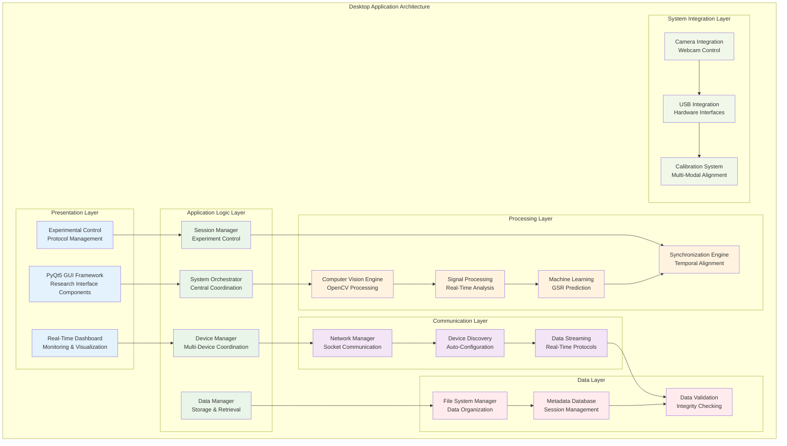
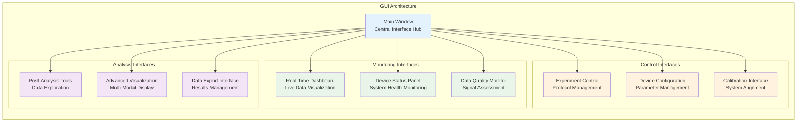
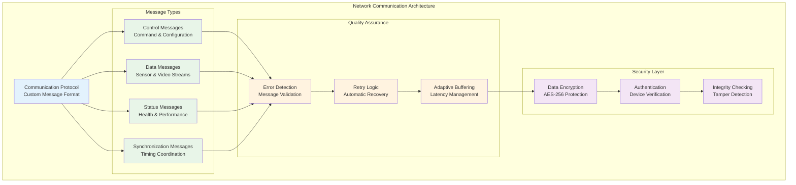

# Desktop Application Architecture and Implementation

## Table of Contents

- [1. Introduction to Desktop Application Design](#1-introduction-to-desktop-application-design)
  - [1.1 Design Philosophy and Fundamental Approach](#11-design-philosophy-and-fundamental-approach)
  - [1.2 System Architecture Overview](#12-system-architecture-overview)
- [2. Core Architecture Components](#2-core-architecture-components)
  - [2.1 Application Framework and GUI Architecture](#21-application-framework-and-gui-architecture)
  - [2.2 Distributed System Orchestration Layer](#22-distributed-system-orchestration-layer)
  - [2.3 Real-Time Data Processing Engine](#23-real-time-data-processing-engine)
- [3. User Interface and Interaction Design](#3-user-interface-and-interaction-design)
  - [3.1 Research-Oriented Interface Design](#31-research-oriented-interface-design)
  - [3.2 Real-Time Monitoring Dashboard](#32-real-time-monitoring-dashboard)
  - [3.3 Experimental Control Interface](#33-experimental-control-interface)
- [4. Data Management and Analysis Framework](#4-data-management-and-analysis-framework)
- [5. Network Communication and Device Coordination](#5-network-communication-and-device-coordination)
- [6. Computer Vision and Signal Processing Integration](#6-computer-vision-and-signal-processing-integration)
- [7. Extensibility and Plugin Architecture](#7-extensibility-and-plugin-architecture)
- [8. Performance Optimization and Resource Management](#8-performance-optimization-and-resource-management)
- [9. Quality Assurance and Validation Framework](#9-quality-assurance-and-validation-framework)

## 1. Introduction to Desktop Application Design

The Python desktop application functions as the sophisticated central command and control center for the entire contactless GSR prediction system, serving as the primary orchestration platform responsible for coordinating all distributed system components while simultaneously providing comprehensive real-time monitoring capabilities, advanced data analysis functionality, and robust research management tools specifically designed for physiological monitoring research applications. The application design philosophy emphasizes unwavering scientific rigor, exceptional real-time performance characteristics, and extensive extensibility capabilities to support the diverse range of research protocols, experimental configurations, and analytical requirements commonly encountered in physiological research environments.

The complexity and scope of the desktop application stems from its role as the central nervous system of the distributed measurement infrastructure, where it must seamlessly integrate and coordinate multiple heterogeneous hardware platforms, diverse sensor modalities, real-time signal processing algorithms, machine learning inference systems, and comprehensive data management capabilities. This central coordination role requires the application to maintain precise temporal awareness across all system components while providing researchers with intuitive interfaces for experimental control, real-time monitoring, and post-hoc analysis.

This comprehensive document presents an exhaustive technical analysis of the desktop application architecture, examining in detail the sophisticated design patterns employed, the complex implementation strategies developed specifically for multi-device coordination requirements, the advanced real-time data processing capabilities, the comprehensive visualization systems designed for physiological research applications, and the robust data management frameworks that ensure research data integrity and scientific reproducibility throughout the entire research workflow.

The architectural analysis encompasses both the theoretical foundations underlying the design decisions and the practical implementation considerations that drive the selection of specific technologies, frameworks, algorithms, and design patterns. The discussion reveals how the application successfully balances the competing requirements of real-time performance versus computational accuracy, distributed system coordination versus local processing optimization, research flexibility versus operational reliability, and advanced functionality versus user interface simplicity.

### 1.1 Design Philosophy and Fundamental Approach

The foundational design philosophy governing the Python desktop application development reflects a deep understanding of the unique challenges and specialized requirements inherent in physiological research applications, where traditional desktop application design approaches often prove inadequate for meeting the specialized needs of scientific data collection, analysis, and management systems.

**Research-Centric Design Methodology:**
The application design fundamentally prioritizes research workflow optimization and scientific validity over conventional desktop application design patterns and user experience conventions, recognizing that research applications have fundamentally different success criteria than commercial software products. This research-centric approach emphasizes experimental control capabilities, comprehensive data integrity mechanisms, and scientific reproducibility features as the primary success metrics, with traditional usability considerations being carefully balanced against the fundamental requirement of providing researchers with the precise control and monitoring capabilities necessary for conducting valid scientific studies.

This design philosophy manifests throughout the application architecture in numerous specific ways. User interface design prioritizes information density and functional completeness over visual simplicity, providing researchers with comprehensive access to all system parameters and status information necessary for experimental control and monitoring. Data processing pipelines are optimized for accuracy and validation rather than processing speed, implementing extensive quality checks and validation mechanisms that ensure scientific validity even when such mechanisms impose computational overhead.

**Distributed System Orchestration and Coordination:**
The application design approaches the desktop system as the central conductor of a complex distributed orchestra, where it must coordinate multiple mobile devices, diverse sensor systems, distributed processing components, and network communication channels while maintaining the precise temporal synchronization essential for physiological monitoring applications.

This orchestration responsibility requires sophisticated distributed system design patterns that can manage the complex interactions between autonomous system components while providing centralized coordination and control capabilities. The application implements comprehensive device discovery and management systems that can automatically detect and configure new system components, maintain real-time awareness of system status and performance, and provide automatic recovery mechanisms when distributed components experience failures or temporary disruptions.

### 1.2 System Architecture Overview

The desktop application architecture implements a sophisticated multi-layered design that provides clear separation of concerns while enabling efficient communication and coordination between system components:

This layered architecture provides several key advantages for research applications, including clear separation between user interface and business logic, modular processing components that can be independently optimized, and comprehensive data management that ensures research data integrity.

## 2. Core Architecture Components

### 2.1 Application Framework and GUI Architecture

The application framework is built upon PyQt5, which provides sophisticated GUI capabilities specifically optimized for research applications requiring extensive real-time data visualization, complex control interfaces, and professional-quality presentation suitable for scientific environments.

**PyQt5 Framework Integration:**
The PyQt5 framework provides the foundation for creating sophisticated graphical user interfaces that can handle the complex requirements of physiological research applications. The framework's signal-slot mechanism enables efficient communication between GUI components and underlying processing systems while maintaining responsive user interaction even during intensive data processing operations.

The GUI architecture implements a model-view-controller pattern that separates data representation from user interface presentation, enabling flexible interface configurations while maintaining consistent data integrity. This separation allows researchers to customize interface layouts and visualization preferences without affecting underlying data processing or system coordination functionality.

**Real-Time Visualization Components:**
The application includes sophisticated real-time visualization components designed specifically for physiological data monitoring. These components provide immediate visual feedback about data quality, system status, and experimental progress while maintaining the performance characteristics necessary for real-time operation.

### 2.2 Distributed System Orchestration Layer

The orchestration layer provides comprehensive management and coordination of all distributed system components, implementing sophisticated communication protocols, device management systems, and error recovery mechanisms.

**Device Discovery and Management:**
The system implements automatic device discovery mechanisms that can identify and configure connected mobile devices, sensor systems, and other hardware components. This discovery process includes comprehensive capability assessment, automatic configuration, and ongoing health monitoring.

The device management system maintains real-time awareness of all connected components, including device status, performance metrics, battery levels, and data quality indicators. This comprehensive monitoring enables proactive management of potential issues before they impact research activities.

**Session Coordination and Control:**
The orchestration layer implements sophisticated session management capabilities that coordinate all aspects of data collection activities across multiple devices and sensor systems. This coordination includes synchronized start/stop commands, real-time parameter adjustments, and emergency stop capabilities.

Session management extends beyond simple coordination to include comprehensive workflow management that can adapt to varying experimental requirements and research protocols. The system can dynamically reconfigure processing pipelines, modify data collection parameters, and adjust coordination strategies based on real-time assessment of system performance and experimental requirements.

### 2.3 Real-Time Data Processing Engine

The data processing engine implements sophisticated algorithms for real-time analysis of multi-modal physiological data, providing immediate quality assessment, feature extraction, and preliminary analysis results.

**Multi-Modal Data Integration:**
The processing engine handles simultaneous data streams from multiple sources including RGB video, thermal imaging, physiological sensors, and motion detectors. The integration process maintains precise temporal alignment between data streams while providing real-time quality assessment and validation.

The data integration system implements sophisticated buffering and synchronization mechanisms that can accommodate variable latency from different data sources while maintaining temporal precision necessary for physiological analysis. These mechanisms include adaptive buffering strategies that can adjust to network conditions and device performance characteristics.

**Real-Time Analysis Capabilities:**
The processing engine provides immediate analysis of incoming data streams, including signal quality assessment, artifact detection, and preliminary feature extraction. This real-time analysis enables researchers to monitor experimental progress and adjust parameters as needed during data collection sessions.

## 3. User Interface and Interaction Design

### 3.1 Research-Oriented Interface Design

The user interface design prioritizes research workflow efficiency and scientific functionality over conventional consumer application design patterns, providing researchers with comprehensive access to all system capabilities necessary for conducting rigorous physiological research.

**Information-Dense Display Design:**
The interface design accommodates the complex information requirements of physiological research by providing comprehensive status displays, detailed parameter controls, and extensive real-time feedback systems. This information density is carefully organized using professional interface design principles that maintain clarity while maximizing functional accessibility.

The display design includes customizable layout options that enable researchers to configure interface arrangements based on their specific experimental requirements and personal preferences. These customization capabilities include adjustable panel layouts, selectable visualization modes, and configurable alert systems.

### 3.2 Real-Time Monitoring Dashboard

The monitoring dashboard provides comprehensive real-time oversight of all system components and data streams, enabling researchers to maintain situational awareness throughout extended data collection sessions.

**Multi-Stream Visualization:**
The dashboard includes sophisticated visualization components that can simultaneously display multiple data streams including physiological signals, video feeds, device status information, and quality metrics. These visualizations are optimized for immediate comprehension and rapid identification of potential issues.

The visualization system implements adaptive scaling and filtering capabilities that can adjust display parameters based on current data characteristics and researcher preferences. These adaptations include automatic range adjustment, intelligent filtering of transient artifacts, and context-sensitive highlighting of significant events.

**Alert and Notification Systems:**
The dashboard includes comprehensive alert systems that can notify researchers of system issues, data quality problems, or experimental milestones. These alert systems are configurable to accommodate different research protocols and researcher preferences while ensuring that critical issues receive immediate attention.

### 3.3 Experimental Control Interface

The control interface provides researchers with comprehensive control over all aspects of data collection activities, from initial system configuration through final data export and analysis.

**Protocol Management:**
The control interface includes sophisticated protocol management capabilities that enable researchers to define, save, and execute complex experimental procedures. These protocols can specify device configurations, data collection parameters, analysis procedures, and quality requirements.

Protocol management extends to include version control capabilities that track protocol modifications and enable researchers to maintain consistency across related experimental sessions. This version control supports research reproducibility requirements while enabling iterative refinement of experimental procedures.

## 4. Data Management and Analysis Framework

The data management framework provides comprehensive support for research data throughout its entire lifecycle, from initial collection through long-term archival and analysis.

**Hierarchical Data Organization:**
The framework implements sophisticated data organization patterns that provide logical separation between different experimental sessions while maintaining clear relationships between related data elements. This organization includes automatic metadata generation, comprehensive indexing, and efficient retrieval mechanisms.

The data organization system supports multiple organizational schemes including temporal organization, experimental protocol organization, and subject-based organization. Researchers can access data through any of these organizational schemes while maintaining consistent data integrity and access control.

**Advanced Analysis Integration:**
The framework includes integration capabilities for advanced analysis tools and custom analysis algorithms. This integration supports both real-time analysis during data collection and comprehensive post-hoc analysis for research publication and validation.

The analysis integration includes support for popular scientific computing environments including Python scientific libraries, R statistical packages, and MATLAB analysis tools. This broad compatibility enables researchers to leverage existing analysis expertise while benefiting from the comprehensive data management capabilities.

## 5. Network Communication and Device Coordination

### Network Protocol Implementation

The communication system implements custom protocols optimized for real-time physiological data transmission while providing robust error recovery and quality assurance mechanisms.

**Real-Time Protocol Optimization:**
The communication protocol is specifically optimized for low-latency transmission of time-sensitive physiological data while providing comprehensive error detection and recovery capabilities. The protocol implements sophisticated prioritization mechanisms that ensure critical control messages receive immediate attention while maintaining efficient bandwidth utilization for data streams.

The protocol includes adaptive compression algorithms that can adjust compression levels based on current network conditions and data characteristics. These algorithms provide optimal balance between bandwidth efficiency and computational overhead while maintaining the data quality necessary for scientific analysis.

## 6. Computer Vision and Signal Processing Integration

### OpenCV Integration Framework

The computer vision framework leverages OpenCV capabilities to provide sophisticated image processing, feature extraction, and real-time analysis capabilities specifically optimized for physiological monitoring applications.

**Real-Time Video Processing:**
The system implements real-time video processing pipelines that can simultaneously handle multiple video streams while maintaining synchronization with physiological sensor data. These processing pipelines include motion detection, region of interest tracking, and feature extraction algorithms optimized for physiological signal detection.

The video processing system includes sophisticated quality assessment algorithms that continuously monitor video quality and detect potential issues such as motion blur, lighting changes, or camera positioning problems. These quality assessments provide immediate feedback to researchers and enable automatic adjustment of processing parameters.

**Advanced Signal Processing:**
The signal processing framework implements sophisticated algorithms for physiological signal analysis including filtering, feature extraction, and artifact detection. These algorithms are specifically optimized for the unique characteristics of physiological signals while providing the flexibility necessary for diverse research applications.

## 7. Extensibility and Plugin Architecture

### Plugin Framework Design

The application implements a comprehensive plugin architecture that enables researchers to add custom analysis algorithms, visualization components, and data export capabilities without requiring modifications to the core application.

**Algorithm Integration Interface:**
The plugin framework provides standardized interfaces for integrating custom analysis algorithms, enabling researchers to leverage domain-specific expertise while benefiting from the comprehensive data management and visualization capabilities of the core application.

The algorithm integration interface includes support for both real-time processing algorithms that operate during data collection and batch processing algorithms that operate on stored data. This flexibility enables researchers to implement both immediate feedback systems and comprehensive post-hoc analysis procedures.

**Custom Visualization Plugins:**
The framework supports custom visualization plugins that can provide specialized displays for specific research applications or analysis methodologies. These plugins can access all available data streams while providing customized presentation formats optimized for specific research requirements.

## 8. Performance Optimization and Resource Management

### Multi-Threading and Asynchronous Processing

The application implements sophisticated multi-threading architectures that enable concurrent processing of multiple data streams while maintaining responsive user interface performance.

**Thread Pool Management:**
The system uses intelligent thread pool management to optimize computational resource utilization while preventing resource contention that could impact real-time performance. The thread pool management includes adaptive scaling based on current system load and processing requirements.

**Memory Management Optimization:**
The application implements comprehensive memory management strategies that minimize memory usage while ensuring adequate performance for computationally intensive operations. These strategies include intelligent caching, efficient data structures, and proactive garbage collection management.

## 9. Quality Assurance and Validation Framework

### Comprehensive Validation System

The validation framework operates at multiple levels throughout the system, providing real-time quality assessment during data collection, comprehensive validation during data processing, and ongoing integrity monitoring during data storage and analysis.

**Real-Time Quality Assessment:**
The system provides immediate assessment of data quality including signal-to-noise ratios, temporal consistency validation, and cross-modal coherence checking. These assessments enable researchers to identify and address potential issues before they compromise research validity.

**Data Integrity Monitoring:**
The framework includes comprehensive data integrity monitoring that validates file integrity, temporal coherence, and cross-device consistency throughout the data lifecycle. This monitoring provides assurance that research data maintains its validity from initial collection through final analysis and publication.

The desktop application architecture represents a sophisticated integration of research requirements, technical capabilities, and operational considerations that enables researchers to conduct rigorous physiological monitoring studies while maintaining the flexibility and extensibility necessary for advancing research methodologies and scientific understanding.