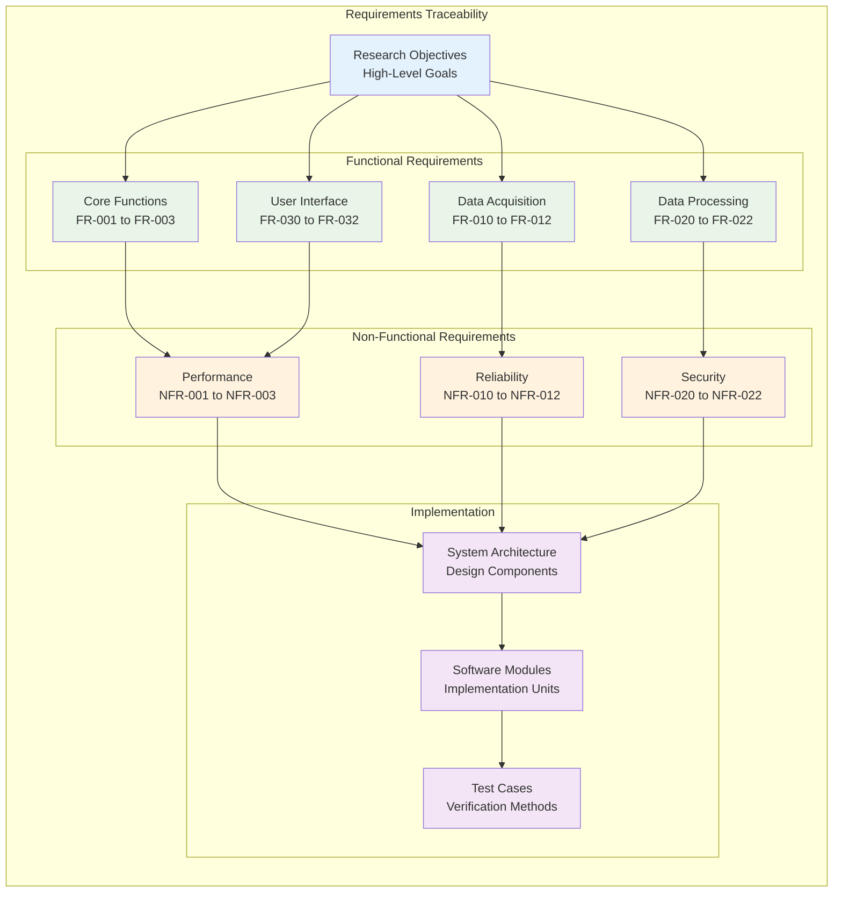

# Functional Requirements Specification

## Table of Contents

- [1. Introduction to Requirements Analysis](#1-introduction-to-requirements-analysis)
  - [1.1 Requirements Engineering Methodology](#11-requirements-engineering-methodology)
  - [1.2 Stakeholder Analysis and Perspectives](#12-stakeholder-analysis-and-perspectives)
- [2. System Overview and Scope](#2-system-overview-and-scope)
- [3. Functional Requirements](#3-functional-requirements)
  - [3.1 Core System Functions](#31-core-system-functions)
  - [3.2 Data Acquisition Requirements](#32-data-acquisition-requirements)
  - [3.3 Data Processing Requirements](#33-data-processing-requirements)
  - [3.4 User Interface Requirements](#34-user-interface-requirements)
- [4. Non-Functional Requirements](#4-non-functional-requirements)
  - [4.1 Performance Requirements](#41-performance-requirements)
  - [4.2 Reliability Requirements](#42-reliability-requirements)
  - [4.3 Security Requirements](#43-security-requirements)
- [5. System Integration Requirements](#5-system-integration-requirements)
- [6. Quality Assurance Requirements](#6-quality-assurance-requirements)
- [7. Validation and Verification Requirements](#7-validation-and-verification-requirements)
- [8. Regulatory and Compliance Requirements](#8-regulatory-and-compliance-requirements)
- [9. Requirements Traceability Matrix](#9-requirements-traceability-matrix)

## 1. Introduction to Requirements Analysis

Requirements analysis represents the critical foundational process that forms the essential bridge between initial problem identification and comprehensive system design, systematically transforming high-level research objectives, user needs, and stakeholder expectations into specific, measurable, verifiable, and implementable system specifications that guide all subsequent development activities. For the sophisticated contactless GSR prediction system, this comprehensive analysis must address the extraordinarily complex interplay between demanding research requirements, stringent technical constraints, diverse user needs, evolving regulatory considerations, and the unique challenges posed by developing a research-grade physiological monitoring system that operates effectively across diverse environments while maintaining the precision and reliability standards required for scientific applications.

The requirements analysis process for this system employs rigorous systematic methodologies specifically adapted for complex research system development, ensuring comprehensive coverage of all system aspects while maintaining complete traceability from high-level research objectives through detailed implementation specifications. This analysis methodology recognizes that the system must serve multiple distinct stakeholder groups including research scientists, clinical investigators, technology developers, study participants, and regulatory oversight bodies, each with fundamentally different perspectives on system requirements, success criteria, and operational priorities.

The comprehensive scope of this requirements analysis encompasses not only the immediate functional requirements for contactless GSR prediction but also the broader ecosystem requirements for research data management, system integration, validation frameworks, regulatory compliance, and long-term maintainability that are essential for successful deployment and operation of research-grade physiological monitoring systems in diverse institutional and regulatory environments.

### 1.1 Requirements Engineering Methodology

The requirements analysis methodology employed for this system follows established software engineering best practices that have been specifically adapted and enhanced to address the unique challenges and specialized needs inherent in developing sophisticated research system architectures.

**Comprehensive Requirements Elicitation Process:**
The systematic gathering of requirements from multiple diverse sources represents the foundation of the requirements analysis process, ensuring that all stakeholder perspectives, technical constraints, and operational requirements are identified and properly documented. This elicitation process encompasses extensive literature review of existing physiological monitoring systems and contactless sensing technologies, structured stakeholder interviews with researchers, clinicians, and technical experts, comprehensive domain expert consultation with specialists in physiology, signal processing, and human-computer interaction, and detailed analysis of existing commercial and research systems to identify both successful approaches and common limitations.

```mermaid
graph TD
    subgraph "Requirements Engineering Process"
        ELICITATION[Requirements Elicitation<br/>Stakeholder Input & Research]
        
        subgraph "Analysis Phase"
            FUNCTIONAL[Functional Analysis<br/>System Capabilities]
            NON_FUNCTIONAL[Non-Functional Analysis<br/>Quality Attributes]
            CONSTRAINTS[Constraint Analysis<br/>Technical & Regulatory]
        end
        
        subgraph "Specification Phase"
            DOCUMENTATION[Requirements Documentation<br/>Formal Specification]
            TRACEABILITY[Traceability Matrix<br/>Requirement Mapping]
            VALIDATION[Requirements Validation<br/>Stakeholder Review]
        end
        
        subgraph "Management Phase"
            BASELINE[Requirements Baseline<br/>Version Control]
            CHANGE_CONTROL[Change Control<br/>Impact Assessment]
            VERIFICATION[Verification Testing<br/>Compliance Validation]
        end
        
        FEEDBACK[Stakeholder Feedback<br/>Continuous Improvement]
    end
    
    ELICITATION --> FUNCTIONAL
    ELICITATION --> NON_FUNCTIONAL
    ELICITATION --> CONSTRAINTS
    
    FUNCTIONAL --> DOCUMENTATION
    NON_FUNCTIONAL --> DOCUMENTATION
    CONSTRAINTS --> DOCUMENTATION
    
    DOCUMENTATION --> TRACEABILITY
    TRACEABILITY --> VALIDATION
    
    VALIDATION --> BASELINE
    BASELINE --> CHANGE_CONTROL
    CHANGE_CONTROL --> VERIFICATION
    
    VERIFICATION --> FEEDBACK
    FEEDBACK --> ELICITATION
    
    classDef elicitationClass fill:#e3f2fd
    classDef analysisClass fill:#e8f5e8
    classDef specClass fill:#fff3e0
    classDef mgmtClass fill:#f3e5f5
    classDef feedbackClass fill:#ffebee
    
    class ELICITATION elicitationClass
    class FUNCTIONAL,NON_FUNCTIONAL,CONSTRAINTS analysisClass
    class DOCUMENTATION,TRACEABILITY,VALIDATION specClass
    class BASELINE,CHANGE_CONTROL,VERIFICATION mgmtClass
    class FEEDBACK feedbackClass
```

### 1.2 Stakeholder Analysis and Perspectives

The identification and analysis of stakeholder groups represents a critical component of the requirements analysis process, as different stakeholder groups have fundamentally different perspectives on system requirements, success criteria, and operational priorities.

**Primary Stakeholders:**

**Research Scientists and Academic Investigators:**
Research scientists represent the primary user group for the contactless GSR prediction system and require exceptionally accurate, reliable, and scientifically validated GSR measurements that can support rigorous psychological and physiological research applications. Their requirements emphasize measurement precision, temporal accuracy, data quality validation, and comprehensive documentation that supports scientific publication and peer review processes.

**Clinical Researchers and Healthcare Professionals:**
Clinical investigators require systems that can operate effectively in clinical environments while meeting relevant regulatory standards for research involving human subjects. Their requirements focus on patient safety, data privacy protection, clinical workflow integration, and compliance with healthcare data security standards.

**Technology Developers and System Administrators:**
Technical stakeholders require systems that are maintainable, extensible, and supportable across diverse deployment environments. Their requirements emphasize system reliability, diagnostic capabilities, integration flexibility, and comprehensive documentation for deployment and maintenance activities.

**Study Participants and Research Subjects:**
Participants require non-intrusive, comfortable, and transparent monitoring systems that protect their privacy while providing clear information about data collection activities. Their requirements focus on user experience, privacy protection, and informed consent mechanisms.

## 2. System Overview and Scope

The contactless GSR prediction system encompasses a comprehensive multi-modal physiological monitoring platform that integrates advanced computer vision techniques, sophisticated signal processing algorithms, and distributed computing architectures to provide research-grade physiological measurements without requiring direct physical contact with study participants.

**System Boundaries and Interfaces:**
The system operates within clearly defined boundaries that encompass data acquisition from multiple sensor modalities, real-time processing and analysis capabilities, distributed device coordination, and comprehensive data management functionality. External interfaces include integration with existing research infrastructure, regulatory compliance systems, and data analysis tools commonly used in physiological research.

**Core System Capabilities:**
- Contactless galvanic skin response prediction through advanced computer vision analysis
- Multi-modal sensor integration including RGB cameras, thermal imaging, and physiological sensors
- Real-time data processing with sub-second response times
- Distributed device coordination across multiple computing platforms
- Comprehensive data quality assessment and validation
- Research-grade data management with full audit trails

## 3. Functional Requirements

### 3.1 Core System Functions

**FR-001: Contactless GSR Prediction**
- **Requirement**: The system shall predict galvanic skin response values from contactless video analysis with correlation coefficient ≥ 0.75 compared to direct GSR measurements
- **Priority**: Critical
- **Verification**: Correlation analysis against reference GSR measurements across diverse subject populations
- **Dependencies**: Camera calibration, signal processing algorithms, machine learning models

**FR-002: Multi-Modal Data Integration**
- **Requirement**: The system shall integrate data from RGB cameras, thermal cameras, and direct physiological sensors with temporal synchronization accuracy ≤ 10 milliseconds
- **Priority**: High
- **Verification**: Temporal alignment analysis and cross-modal correlation validation
- **Dependencies**: Network synchronization protocols, data processing pipelines

**FR-003: Real-Time Processing**
- **Requirement**: The system shall provide real-time GSR predictions with latency ≤ 500 milliseconds from data acquisition to result availability
- **Priority**: High
- **Verification**: End-to-end latency measurement under various system loads
- **Dependencies**: Processing optimization, hardware performance

### 3.2 Data Acquisition Requirements

**FR-010: Video Data Capture**
- **Requirement**: The system shall capture RGB video at minimum 30 fps with resolution ≥ 1920×1080 pixels
- **Priority**: Critical
- **Verification**: Video quality assessment and frame rate validation
- **Dependencies**: Camera hardware, device performance

**FR-011: Thermal Data Capture**
- **Requirement**: The system shall capture thermal imagery at minimum 25 fps with temperature resolution ≤ 0.1°C
- **Priority**: High
- **Verification**: Thermal accuracy validation against reference temperature measurements
- **Dependencies**: Thermal camera integration, calibration procedures

**FR-012: Physiological Sensor Integration**
- **Requirement**: The system shall integrate with Shimmer3 GSR+ sensors for reference measurements with sampling rate ≥ 50 Hz
- **Priority**: Critical
- **Verification**: Data integrity validation and temporal synchronization verification
- **Dependencies**: Bluetooth communication, device drivers

### 3.3 Data Processing Requirements

**FR-020: Signal Processing Pipeline**
- **Requirement**: The system shall implement signal processing pipelines that can extract physiological features from video data with signal-to-noise ratio ≥ 20 dB
- **Priority**: Critical
- **Verification**: Signal quality assessment and feature extraction validation
- **Dependencies**: Computer vision algorithms, filtering techniques

**FR-021: Machine Learning Inference**
- **Requirement**: The system shall implement machine learning models for GSR prediction with inference time ≤ 100 milliseconds per prediction
- **Priority**: High
- **Verification**: Performance benchmarking and accuracy validation
- **Dependencies**: Model optimization, hardware acceleration

**FR-022: Quality Assessment**
- **Requirement**: The system shall provide real-time quality assessment of all data streams with quality metrics updated every second
- **Priority**: High
- **Verification**: Quality metric validation and reliability testing
- **Dependencies**: Signal analysis algorithms, quality standards

### 3.4 User Interface Requirements

**FR-030: Research Interface**
- **Requirement**: The system shall provide a comprehensive research interface supporting experimental protocol configuration, real-time monitoring, and data analysis
- **Priority**: High
- **Verification**: Usability testing with research stakeholders
- **Dependencies**: GUI framework, visualization libraries

**FR-031: Real-Time Monitoring**
- **Requirement**: The system shall display real-time physiological measurements with visualization update rate ≥ 10 Hz
- **Priority**: Medium
- **Verification**: Interface responsiveness testing under various system loads
- **Dependencies**: Rendering performance, data streaming

**FR-032: Data Export and Analysis**
- **Requirement**: The system shall support data export in standard formats (CSV, JSON, HDF5) with complete metadata preservation
- **Priority**: High
- **Verification**: Data integrity validation and format compliance testing
- **Dependencies**: File management, metadata systems

## 4. Non-Functional Requirements

### 4.1 Performance Requirements

**NFR-001: System Throughput**
- **Requirement**: The system shall process video streams from up to 4 simultaneous devices without performance degradation
- **Priority**: High
- **Measurement**: Concurrent device testing with performance monitoring
- **Acceptance Criteria**: <5% performance degradation with 4 devices compared to single device

**NFR-002: Resource Utilization**
- **Requirement**: The system shall operate within specified resource limits: CPU ≤ 80%, Memory ≤ 4GB, Storage growth ≤ 10GB/hour
- **Priority**: Medium
- **Measurement**: Resource monitoring during extended operation
- **Acceptance Criteria**: Sustained operation within limits for 8+ hours

**NFR-003: Scalability**
- **Requirement**: The system shall support scaling to accommodate 8+ concurrent users without architectural changes
- **Priority**: Low
- **Measurement**: Load testing with multiple concurrent users
- **Acceptance Criteria**: Linear performance scaling with user count

### 4.2 Reliability Requirements

**NFR-010: System Availability**
- **Requirement**: The system shall maintain 99.5% availability during scheduled operation periods
- **Priority**: High
- **Measurement**: Uptime monitoring and failure tracking
- **Acceptance Criteria**: <4 hours downtime per month during operation

**NFR-011: Data Integrity**
- **Requirement**: The system shall ensure 100% data integrity with comprehensive validation and error detection
- **Priority**: Critical
- **Measurement**: Data validation testing and corruption detection
- **Acceptance Criteria**: Zero undetected data corruption events

**NFR-012: Fault Recovery**
- **Requirement**: The system shall recover from transient failures within 30 seconds without data loss
- **Priority**: High
- **Measurement**: Fault injection testing and recovery time measurement
- **Acceptance Criteria**: Successful recovery in 95% of test scenarios

### 4.3 Security Requirements

**NFR-020: Data Privacy**
- **Requirement**: The system shall implement comprehensive data privacy protection including encryption at rest and in transit
- **Priority**: Critical
- **Measurement**: Security audit and penetration testing
- **Acceptance Criteria**: No privacy vulnerabilities identified in security assessment

**NFR-021: Access Control**
- **Requirement**: The system shall implement role-based access control with user authentication and authorization
- **Priority**: High
- **Measurement**: Access control testing and privilege escalation assessment
- **Acceptance Criteria**: No unauthorized access possible in testing scenarios

**NFR-022: Audit Logging**
- **Requirement**: The system shall maintain comprehensive audit logs of all user actions and system events
- **Priority**: Medium
- **Measurement**: Log completeness assessment and integrity validation
- **Acceptance Criteria**: 100% of security-relevant events logged with integrity protection

## 5. System Integration Requirements

**IR-001: Research Infrastructure Integration**
- **Requirement**: The system shall integrate with common research data management systems (REDCap, BIDS)
- **Priority**: Medium
- **Verification**: Integration testing with target research platforms

**IR-002: Analysis Tool Compatibility**
- **Requirement**: The system shall export data in formats compatible with MATLAB, R, Python scientific computing environments
- **Priority**: High
- **Verification**: Data import testing in target analysis environments

**IR-003: Hardware Platform Support**
- **Requirement**: The system shall support deployment on Windows, macOS, and Linux platforms
- **Priority**: Medium
- **Verification**: Cross-platform testing and validation

## 6. Quality Assurance Requirements

**QA-001: Measurement Accuracy**
- **Requirement**: GSR predictions shall achieve ≥75% correlation with reference measurements across diverse subject populations
- **Priority**: Critical
- **Verification**: Validation studies with diverse subject groups

**QA-002: Temporal Precision**
- **Requirement**: All timestamps shall have accuracy ≤5 milliseconds relative to reference time sources
- **Priority**: High
- **Verification**: Time synchronization validation against precision time references

**QA-003: Signal Quality Assessment**
- **Requirement**: The system shall automatically detect and flag data quality issues with ≥95% accuracy
- **Priority**: High
- **Verification**: Quality assessment validation against expert manual assessment

## 7. Validation and Verification Requirements

**VV-001: Algorithm Validation**
- **Requirement**: All physiological signal processing algorithms shall be validated against established ground truth datasets
- **Priority**: Critical
- **Verification**: Validation testing using publicly available physiological datasets

**VV-002: System Verification**
- **Requirement**: Complete system functionality shall be verified through comprehensive testing including unit, integration, and system tests
- **Priority**: Critical
- **Verification**: Test coverage analysis and requirement verification matrix

**VV-003: Clinical Validation**
- **Requirement**: System performance shall be validated in controlled clinical studies with human subjects
- **Priority**: High
- **Verification**: Clinical study protocols and statistical validation

## 8. Regulatory and Compliance Requirements

**RC-001: Human Subjects Research Compliance**
- **Requirement**: The system shall support compliance with human subjects research regulations (IRB, GDPR)
- **Priority**: Critical
- **Verification**: Regulatory compliance audit and documentation review

**RC-002: Data Protection Compliance**
- **Requirement**: The system shall implement data protection measures compliant with applicable privacy regulations
- **Priority**: Critical
- **Verification**: Privacy impact assessment and compliance validation

**RC-003: Medical Device Considerations**
- **Requirement**: The system shall be designed with consideration for potential medical device regulatory pathways
- **Priority**: Low
- **Verification**: Regulatory consultation and pathway analysis

## 9. Requirements Traceability Matrix

This comprehensive functional requirements specification provides the foundation for systematic development and validation of the contactless GSR prediction system, ensuring that all stakeholder needs are addressed while maintaining the precision and reliability necessary for research applications.