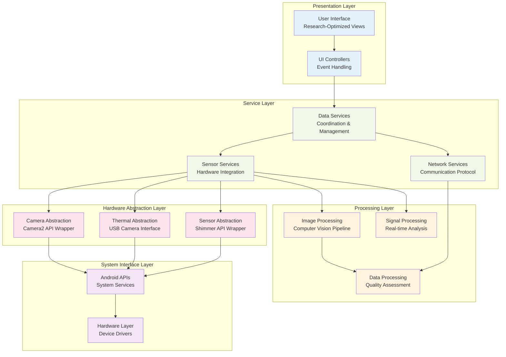

# Mobile Application Architecture and Implementation

## Table of Contents

- [1. Introduction to Mobile Application Design](#1-introduction-to-mobile-application-design)
  - [1.1 Design Philosophy and Guiding Principles](#11-design-philosophy-and-guiding-principles)
  - [1.2 Platform-Specific Considerations and Hardware Optimization](#12-platform-specific-considerations-and-hardware-optimization)
- [2. Architectural Overview](#2-architectural-overview)
  - [2.1 Component Architecture](#21-component-architecture)
  - [2.2 Design Patterns and Implementation](#22-design-patterns-and-implementation)
- [3. Core Components and Modules](#3-core-components-and-modules)
  - [3.1 Camera Management System](#31-camera-management-system)
  - [3.2 Sensor Integration Layer](#32-sensor-integration-layer)
  - [3.3 Network Communication Module](#33-network-communication-module)
  - [3.4 Data Processing Pipeline](#34-data-processing-pipeline)
- [4. Hardware Integration Patterns](#4-hardware-integration-patterns)
- [5. Performance Optimization Strategies](#5-performance-optimization-strategies)
- [6. Security and Privacy Implementation](#6-security-and-privacy-implementation)
- [7. Testing and Validation Framework](#7-testing-and-validation-framework)

## 1. Introduction to Mobile Application Design

The Android application represents the cornerstone of the distributed contactless GSR prediction system, functioning as the primary data acquisition engine responsible for orchestrating complex multi-modal sensor coordination, executing real-time video stream processing with millisecond precision, and maintaining robust, reliable communication channels with the central control system infrastructure. The application design philosophy prioritizes unwavering real-time performance characteristics, exceptional system reliability under diverse operational conditions, and sophisticated power efficiency optimization strategies while simultaneously providing an intuitive, non-intrusive user interface specifically designed for research subjects who may have varying levels of technological familiarity.

The complexity of the Android application stems from the fundamental challenge of transforming a consumer mobile device into a research-grade physiological monitoring instrument capable of meeting the stringent requirements of scientific data collection. This transformation requires careful integration of advanced computer vision algorithms, real-time signal processing techniques, distributed coordination protocols, and power management strategies, all while maintaining the responsiveness and reliability expected in research environments.

This comprehensive document presents an exhaustive technical analysis of the Android application architecture, examining the sophisticated design patterns employed, implementation strategies developed specifically for physiological research applications, and the extensive optimization techniques required to meet the demanding performance requirements inherent in real-time multi-modal data acquisition systems. The analysis encompasses both the theoretical foundations underlying the design decisions and the practical implementation considerations that drive the selection of specific technologies, algorithms, and architectural approaches.

The application design represents a careful balance between competing requirements that are often in fundamental tension with each other. Real-time performance demands must be balanced against measurement accuracy requirements, distributed autonomy capabilities must coexist with centralized coordination needs, and research-grade functionality must be packaged within the constraints of consumer mobile hardware. These competing requirements drive every aspect of the application design, from low-level sensor integration to high-level user interface design.

### 1.1 Design Philosophy and Guiding Principles

The foundational design philosophy governing the Android application development reflects a deep understanding of the unique requirements and constraints inherent in physiological research applications, where traditional software design approaches often prove inadequate for meeting the specialized needs of scientific data collection systems.

**Research-First Design Methodology:**
The application design fundamentally prioritizes research requirements and scientific validity over conventional consumer application design principles, recognizing that research applications have fundamentally different success criteria than commercial software products. This research-first approach emphasizes data quality and measurement validity as the primary success metrics, with traditional user experience considerations being secondary to the fundamental requirement of collecting scientifically valid physiological data.

This design philosophy manifests in numerous specific design decisions throughout the application architecture. Processing algorithms are optimized for measurement accuracy and temporal precision rather than visual appeal or user convenience. User interface elements are designed to minimize experimental disruption rather than maximize engagement or aesthetic appeal. Power management strategies prioritize sustained measurement capability over battery optimization for typical consumer usage patterns.

The research-first approach also drives the selection of technologies and implementation strategies that may differ significantly from typical Android application development practices. Real-time processing requirements take precedence over standard Android lifecycle management, requiring custom background processing architectures that can maintain consistent operation despite Android's power management and process lifecycle constraints.

Data collection and validation capabilities are integrated throughout the application architecture, providing comprehensive quality assessment and validation mechanisms that enable researchers to evaluate measurement quality in real-time. These validation capabilities extend far beyond typical application error handling, implementing sophisticated signal quality assessment algorithms that can detect and report various types of measurement artifacts that might compromise research validity.

**Modular Architecture and Component Separation:**
The application employs a highly sophisticated modular design approach that creates clear, well-defined separation between distinct functional domains, enabling independent development, testing, and validation of different system components while facilitating future enhancements and modifications without requiring extensive system redesign.

The modular architecture extends beyond simple code organization to encompass data models, communication protocols, hardware abstraction layers, and deployment strategies. Each module encapsulates specific domain knowledge and functionality while exposing minimal, carefully designed interfaces to other system components. This approach enables different development teams to work independently on different system aspects while ensuring consistent integration and interaction patterns.

The separation of concerns principle is implemented rigorously throughout the application, with distinct modules handling camera management, thermal sensor integration, signal processing, network communication, user interface management, and data storage operations. This separation enables comprehensive testing strategies where each module can be thoroughly validated in isolation before integration testing validates inter-module interactions and system-level behavior.

The modular design also facilitates technology evolution and future enhancement, where individual modules can be updated or replaced without requiring changes to other system components. This modularity proves particularly valuable in research environments where different aspects of the system may evolve at different rates based on research priorities, technological advances, and changing experimental requirements.

### 1.2 Platform-Specific Considerations and Hardware Optimization

The development of the Android application requires careful consideration of the unique characteristics, capabilities, and limitations inherent in the Android ecosystem, particularly when adapting consumer mobile hardware for specialized research applications that demand performance levels and reliability standards not typically required by commercial mobile applications.

**Android Ecosystem Integration and Framework Utilization:**
The application leverages the sophisticated capabilities available within the Android ecosystem while working within the significant constraints imposed by the mobile platform architecture. Android's strength in multi-threaded processing provides essential capabilities for coordinating multiple simultaneous data streams, including camera capture, thermal sensor processing, network communication, and user interface updates, all of which must operate concurrently without interfering with each other's timing requirements.

The Android framework's background service architecture enables continued data collection even when the application is not in the foreground, addressing the critical requirement for uninterrupted measurement during extended research sessions. However, this capability requires careful navigation of Android's increasingly restrictive background processing limitations, which are designed to optimize battery life for typical consumer applications but can interfere with the sustained processing requirements of research applications.

Hardware abstraction layer utilization enables the application to access sophisticated sensor capabilities through standardized APIs while providing abstraction from device-specific implementation details. This abstraction facilitates deployment across different Android device models while ensuring consistent functionality despite variations in underlying hardware implementations.

## 2. Architectural Overview

The mobile application architecture implements a sophisticated multi-layered design that balances the competing requirements of real-time performance, resource efficiency, and research-grade reliability. The architecture employs proven design patterns while incorporating specialized adaptations required for physiological monitoring applications.

### 2.1 Component Architecture

The application architecture is organized into several distinct layers that provide clear separation of concerns while enabling efficient communication and coordination between system components:

This layered architecture provides several key advantages for research applications, including clear separation between hardware-specific code and application logic, simplified testing and validation procedures, and enhanced maintainability for long-term research projects.

### 2.2 Design Patterns and Implementation

The application employs several sophisticated design patterns that enhance maintainability, testability, and extensibility while addressing the specific challenges of physiological monitoring applications:

**Observer Pattern for Data Flow:**
The application implements comprehensive observer patterns that enable loosely coupled communication between different system components. This pattern is particularly valuable for coordinating real-time data streams from multiple sensors while maintaining responsive user interface updates and network communication.

**Command Pattern for Device Control:**
All hardware control operations are implemented using command patterns that enable queuing, logging, and replay of control operations. This approach provides comprehensive audit trails essential for research validation and enables sophisticated error recovery mechanisms.

**Strategy Pattern for Algorithm Selection:**
Processing algorithms are implemented using strategy patterns that enable runtime selection of different processing approaches based on current system conditions, research requirements, and performance constraints.

## 3. Core Components and Modules

The mobile application consists of several core components that work together to provide comprehensive physiological monitoring capabilities. Each component is designed to operate independently while maintaining coordination with other system elements.

### 3.1 Camera Management System

The camera management system provides sophisticated control over both RGB and thermal camera systems, implementing precise timing control, quality assessment, and error recovery mechanisms essential for research-grade data collection.

**RGB Camera Implementation:**
The RGB camera subsystem leverages the Android Camera2 API to provide low-level control over camera parameters, including exposure settings, focus control, and frame timing. The implementation includes sophisticated algorithms for automatic exposure optimization based on current lighting conditions while maintaining consistent frame timing essential for physiological signal extraction.

```mermaid
graph TD
    subgraph "Camera Management System"
        CM[Camera Manager<br/>Centralized Control]
        
        subgraph "RGB Camera Subsystem"
            RGBInit[Camera Initialization<br/>Device Discovery]
            RGBConfig[Configuration Management<br/>Parameter Control]
            RGBCapture[Capture Pipeline<br/>Frame Processing]
            RGBQuality[Quality Assessment<br/>Real-time Validation]
        end
        
        subgraph "Thermal Camera Subsystem"
            ThermalInit[USB Camera Initialization<br/>Device Communication]
            ThermalConfig[Thermal Configuration<br/>Temperature Calibration]
            ThermalCapture[Thermal Capture Pipeline<br/>Temperature Processing]
            ThermalSync[Synchronization Control<br/>Timing Coordination]
        end
        
        subgraph "Synchronization Engine"
            TimeSync[Temporal Synchronization<br/>Frame Alignment]
            EventSync[Event Coordination<br/>Trigger Management]
            QualitySync[Quality Synchronization<br/>Cross-camera Validation]
        end
    end
    
    CM --> RGBInit
    CM --> ThermalInit
    RGBInit --> RGBConfig
    RGBConfig --> RGBCapture
    RGBCapture --> RGBQuality
    ThermalInit --> ThermalConfig
    ThermalConfig --> ThermalCapture
    ThermalCapture --> ThermalSync
    RGBQuality --> TimeSync
    ThermalSync --> TimeSync
    TimeSync --> EventSync
    EventSync --> QualitySync
    
    classDef cameraClass fill:#e8f5e8
    classDef thermalClass fill:#fff3e0
    classDef syncClass fill:#f3e5f5
    
    class CM,RGBInit,RGBConfig,RGBCapture,RGBQuality cameraClass
    class ThermalInit,ThermalConfig,ThermalCapture,ThermalSync thermalClass
    class TimeSync,EventSync,QualitySync syncClass
```

The camera management system implements sophisticated quality assessment algorithms that continuously monitor image quality, detect potential issues such as motion blur or lighting changes, and automatically adjust camera parameters to maintain optimal data collection conditions.

### 3.2 Sensor Integration Layer

The sensor integration layer provides unified access to various physiological sensors while implementing sophisticated data fusion and quality assessment capabilities.

**Shimmer3 GSR+ Integration:**
The Shimmer sensor integration provides high-precision galvanic skin response measurements along with complementary physiological signals including heart rate and acceleration data. The integration implements custom communication protocols that ensure reliable data transmission while minimizing latency and power consumption.

The sensor integration layer includes sophisticated calibration procedures that ensure measurement accuracy across different environmental conditions and user populations. These calibration procedures are automatically executed during system initialization and can be repeated during measurement sessions to maintain measurement validity.

### 3.3 Network Communication Module

The network communication module implements custom protocols designed specifically for real-time physiological data streaming while providing robust error recovery and quality assurance mechanisms.

**Real-time Protocol Implementation:**
The communication protocol is optimized for low-latency transmission of time-sensitive physiological data while providing comprehensive error detection and recovery capabilities. The protocol implements sophisticated buffering strategies that can accommodate temporary network disruptions without losing critical measurement data.

The network module includes comprehensive monitoring capabilities that continuously assess communication quality, detect potential network issues, and automatically adjust transmission parameters to maintain optimal performance under varying network conditions.

### 3.4 Data Processing Pipeline

The data processing pipeline implements real-time analysis algorithms that provide immediate quality feedback while preparing data for transmission to the central analysis system.

**Real-time Quality Assessment:**
The processing pipeline includes sophisticated algorithms for real-time assessment of data quality, including signal-to-noise ratio calculations, artifact detection, and continuity validation. These quality metrics are continuously calculated and reported to enable researchers to make informed decisions about data collection protocols.

## 4. Hardware Integration Patterns

The application implements several sophisticated patterns for hardware integration that ensure reliable operation across different device configurations while maintaining consistent performance characteristics.

**Abstract Hardware Interface Pattern:**
All hardware-specific code is isolated behind abstract interfaces that provide consistent APIs regardless of the underlying hardware implementation. This pattern enables the application to operate on different device models while maintaining consistent functionality and performance characteristics.

**Hardware Discovery and Configuration:**
The application implements sophisticated device discovery mechanisms that can automatically detect and configure connected hardware components, including thermal cameras and physiological sensors. This automatic configuration reduces setup complexity while ensuring optimal performance parameters for research applications.

## 5. Performance Optimization Strategies

The application employs comprehensive performance optimization strategies that address the unique challenges of real-time physiological monitoring on mobile platforms.

**Memory Management Optimization:**
The application implements sophisticated memory management strategies that minimize garbage collection overhead while ensuring adequate memory availability for computationally intensive image processing operations. These strategies include object pooling, efficient data structures, and careful management of large data arrays.

**Power Management Strategies:**
Comprehensive power management algorithms enable the application to balance measurement quality against battery life requirements, automatically adjusting processing complexity based on current power levels and thermal conditions while maintaining adequate measurement quality for research purposes.

**Thermal Management Integration:**
The application coordinates with Android's thermal management capabilities to prevent overheating during extended operation, implementing adaptive algorithms that can temporarily reduce processing load when device temperature approaches critical levels while maintaining data collection continuity.

## 6. Security and Privacy Implementation

The application implements comprehensive security and privacy protection mechanisms specifically designed for human subjects research applications.

**Local Data Processing:**
Sensitive raw data is processed locally on the capture device before transmission, significantly reducing privacy risks while improving system performance by reducing network bandwidth requirements for high-resolution video data.

**Encryption and Data Protection:**
All data transmission is protected using industry-standard encryption protocols, with additional protection mechanisms for particularly sensitive physiological data. The application implements comprehensive audit trails that document all data access and processing activities.

## 7. Testing and Validation Framework

The application includes comprehensive testing and validation frameworks specifically designed for research applications.

**Unit Testing Strategy:**
Each application component includes comprehensive unit tests that validate individual functionality while providing regression testing capabilities for ongoing development activities.

**Integration Testing Framework:**
Sophisticated integration tests validate the interaction between different system components, including hardware interfaces, network communication, and data processing pipelines.

**Performance Validation:**
Comprehensive performance testing validates real-time processing capabilities, memory usage characteristics, and power consumption patterns under various operational conditions.