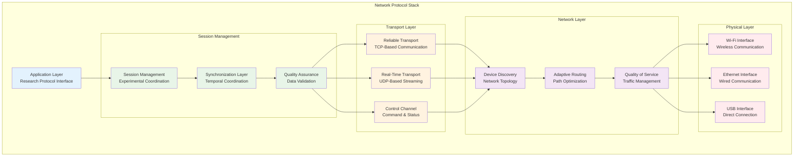
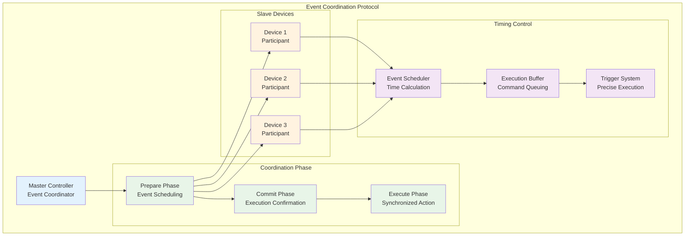

# Network Protocols and Synchronization Implementation

## Table of Contents

- [1. Introduction to Distributed System Networking](#1-introduction-to-distributed-system-networking)
  - [1.1 Distributed System Challenges and Technical Requirements](#11-distributed-system-challenges-and-technical-requirements)
  - [1.2 Network Architecture Philosophy](#12-network-architecture-philosophy)
- [2. Communication Protocol Design](#2-communication-protocol-design)
  - [2.1 Protocol Stack Architecture](#21-protocol-stack-architecture)
  - [2.2 Message Format and Serialization](#22-message-format-and-serialization)
- [3. Temporal Synchronization Framework](#3-temporal-synchronization-framework)
  - [3.1 High-Precision Time Synchronization](#31-high-precision-time-synchronization)
  - [3.2 Clock Drift Compensation](#32-clock-drift-compensation)
  - [3.3 Event Coordination Mechanisms](#33-event-coordination-mechanisms)
- [4. Multi-Device Coordination Architecture](#4-multi-device-coordination-architecture)
- [5. Real-Time Data Streaming](#5-real-time-data-streaming)
- [6. Quality of Service and Network Management](#6-quality-of-service-and-network-management)
- [7. Fault Tolerance and Recovery Mechanisms](#7-fault-tolerance-and-recovery-mechanisms)
- [8. Security and Authentication Framework](#8-security-and-authentication-framework)
- [9. Performance Optimization Strategies](#9-performance-optimization-strategies)
- [10. Implementation Guidelines and Best Practices](#10-implementation-guidelines-and-best-practices)

## 1. Introduction to Distributed System Networking

The contactless GSR prediction system operates as a sophisticated distributed network of heterogeneous computing devices and specialized sensor systems that must coordinate seamlessly to capture, process, and analyze complex multi-modal physiological data with the exacting precision and temporal accuracy required for research-grade scientific applications. The networking and synchronization architecture represents one of the most technically challenging and critically important aspects of the entire system design, as it must ensure millisecond-level temporal accuracy, maintain absolutely reliable communication under diverse and potentially adverse conditions, and enable coordinated operation across multiple disparate platforms while accommodating the varying computational capabilities, power constraints, and operational requirements of different system components.

The complexity of the distributed networking challenge stems from the fundamental requirement that all system components must operate in perfect temporal coordination despite being physically distributed across space, connected through potentially unreliable wireless communication channels, and subject to varying computational loads and environmental conditions that can affect timing precision. Unlike traditional distributed systems that can tolerate moderate timing variations, physiological monitoring applications require synchronization accuracy that approaches the limits of what is achievable with standard networking technologies.

This comprehensive document presents an exhaustive technical analysis of the sophisticated networking protocols, advanced synchronization mechanisms, and complex distributed coordination strategies employed throughout the system to achieve the sub-millisecond timing precision required for valid physiological research while simultaneously maintaining robust, fault-tolerant communication capabilities that can operate reliably in the diverse and challenging environments commonly encountered in research settings.

### 1.1 Distributed System Challenges and Technical Requirements

The distributed architecture of the contactless GSR prediction system introduces numerous complex technical challenges that must be addressed through sophisticated engineering solutions specifically designed to meet the unique requirements of real-time physiological monitoring applications.

**Temporal Precision Requirements and Synchronization Challenges:**
Physiological research applications impose extraordinarily demanding temporal synchronization requirements that far exceed the capabilities of standard distributed computing approaches. The system must achieve synchronization accuracy in the sub-10 millisecond range across all data collection points to ensure valid correlation analysis between different physiological modalities, accurate temporal alignment of multi-modal data streams, and precise measurement of physiological response timing characteristics.

The fundamental challenge in achieving this level of temporal precision stems from the numerous sources of timing uncertainty inherent in distributed systems, including network transmission delays that vary based on traffic conditions and routing paths, operating system scheduling variations that can introduce microsecond-level timing jitter, hardware clock drift that gradually accumulates timing errors over extended measurement periods, and processing delays that depend on computational load and system resource availability.

Traditional network time synchronization protocols such as NTP (Network Time Protocol) typically achieve accuracy in the millisecond range under optimal conditions, which is insufficient for the sub-millisecond requirements of physiological research applications. The system therefore implements specialized high-precision synchronization mechanisms that combine hardware-level timing references, software-based clock correction algorithms, and adaptive compensation for systematic timing biases.

**Network Heterogeneity and Environmental Adaptability:**
The system must demonstrate robust operational capability across an exceptionally diverse range of network environments, from highly controlled laboratory local area networks with gigabit ethernet infrastructure and minimal latency variations to wireless research networks operating in electromagnetically noisy environments with variable signal strength, intermittent connectivity, and unpredictable bandwidth availability.

This environmental diversity requires adaptive networking strategies that can automatically detect and compensate for varying network conditions while maintaining acceptable performance levels. The system must be capable of operating effectively over high-quality wired networks that provide optimal bandwidth and latency characteristics, standard Wi-Fi networks with moderate performance characteristics and occasional connectivity interruptions, and challenging wireless environments with limited bandwidth, high latency, and frequent packet loss.

### 1.2 Network Architecture Philosophy

The network architecture follows several fundamental design principles that ensure robust, scalable, and maintainable communication capabilities across the distributed system.

**Layered Protocol Design:**
The communication system implements a sophisticated layered protocol architecture that provides clear separation between different aspects of network communication while enabling efficient integration and optimization of the overall communication stack.



## 2. Communication Protocol Design

### 2.1 Protocol Stack Architecture

The communication protocol stack is designed to provide reliable, low-latency communication while supporting the diverse data types and communication patterns required for physiological monitoring applications.

**Message-Based Communication:**
The system implements a sophisticated message-based communication paradigm that provides type-safe, versioned communication while enabling efficient serialization and deserialization of complex data structures.

```python
class NetworkMessage:
    def __init__(self, message_type, payload, priority=MessagePriority.NORMAL):
        self.message_id = self.generate_message_id()
        self.message_type = message_type
        self.timestamp = self.get_high_precision_timestamp()
        self.sequence_number = self.get_sequence_number()
        self.payload = payload
        self.priority = priority
        self.checksum = self.calculate_checksum()
    
    def serialize(self):
        """Serialize message to binary format for network transmission"""
        header = struct.pack(
            '>HHQQI',  # Network byte order
            self.message_type.value,
            len(self.payload),
            self.timestamp,
            self.sequence_number,
            self.checksum
        )
        
        return header + self.payload
    
    @classmethod
    def deserialize(cls, data):
        """Deserialize binary data to message object"""
        header_size = struct.calcsize('>HHQQI')
        header = struct.unpack('>HHQQI', data[:header_size])
        
        message_type = MessageType(header[0])
        payload_length = header[1]
        timestamp = header[2]
        sequence_number = header[3]
        checksum = header[4]
        
        payload = data[header_size:header_size + payload_length]
        
        return cls(message_type, payload)

class MessageType(Enum):
    # Session management messages
    SESSION_START = 0x0001
    SESSION_STOP = 0x0002
    SESSION_STATUS = 0x0003
    
    # Synchronization messages
    TIME_SYNC_REQUEST = 0x0010
    TIME_SYNC_RESPONSE = 0x0011
    EVENT_TRIGGER = 0x0012
    
    # Data streaming messages
    SENSOR_DATA = 0x0020
    VIDEO_FRAME = 0x0021
    THERMAL_FRAME = 0x0022
    
    # Control messages
    DEVICE_COMMAND = 0x0030
    CONFIGURATION = 0x0031
    STATUS_UPDATE = 0x0032
```

### 2.2 Message Format and Serialization

The message serialization system provides efficient, cross-platform compatible data exchange while maintaining type safety and version compatibility.

**Efficient Serialization Strategy:**
```python
class PhysiologicalDataMessage:
    def __init__(self, device_id, sensor_type, data_samples, quality_metrics):
        self.device_id = device_id
        self.sensor_type = sensor_type
        self.data_samples = data_samples
        self.quality_metrics = quality_metrics
        self.compression_enabled = len(data_samples) > 100
    
    def serialize_payload(self):
        """Efficient serialization for physiological data"""
        payload = bytearray()
        
        # Device identification
        payload.extend(self.device_id.encode('utf-8')[:32].ljust(32, b'\x00'))
        
        # Sensor type
        payload.extend(struct.pack('>H', self.sensor_type.value))
        
        # Data samples
        if self.compression_enabled:
            compressed_data = self.compress_data_samples(self.data_samples)
            payload.extend(struct.pack('>I', len(compressed_data)))
            payload.extend(compressed_data)
        else:
            payload.extend(struct.pack('>I', len(self.data_samples)))
            for sample in self.data_samples:
                payload.extend(struct.pack('>f', sample))
        
        # Quality metrics
        quality_data = json.dumps(self.quality_metrics).encode('utf-8')
        payload.extend(struct.pack('>H', len(quality_data)))
        payload.extend(quality_data)
        
        return bytes(payload)
```

## 3. Temporal Synchronization Framework

### 3.1 High-Precision Time Synchronization

The temporal synchronization framework implements sophisticated algorithms that achieve sub-millisecond timing accuracy across distributed system components.

**Precision Time Protocol (PTP) Implementation:**
```python
class HighPrecisionTimeSynchronizer:
    def __init__(self, master_device=False):
        self.is_master = master_device
        self.clock_offset = 0.0
        self.clock_drift_rate = 0.0
        self.sync_history = deque(maxlen=100)
        self.last_sync_time = 0
    
    def synchronize_clock(self, peer_address):
        """High-precision clock synchronization using PTP-like protocol"""
        # Record transmission timestamp
        t1 = self.get_high_precision_timestamp()
        
        # Send synchronization request
        sync_request = TimeSyncMessage(
            message_type=MessageType.TIME_SYNC_REQUEST,
            origin_timestamp=t1,
            sequence_id=self.get_sync_sequence_id()
        )
        
        self.send_message(peer_address, sync_request)
        
        # Wait for response
        response = self.wait_for_sync_response(timeout=0.1)
        
        if response:
            # Record reception timestamp
            t4 = self.get_high_precision_timestamp()
            
            # Extract timestamps from response
            t2 = response.receive_timestamp  # Peer reception time
            t3 = response.transmit_timestamp  # Peer transmission time
            
            # Calculate offset and delay
            offset = ((t2 - t1) + (t3 - t4)) / 2.0
            delay = ((t4 - t1) - (t3 - t2))
            
            # Update clock parameters
            self.update_clock_parameters(offset, delay)
            
            return True
        
        return False
    
    def update_clock_parameters(self, offset, delay):
        """Update clock offset and drift compensation"""
        # Kalman filter for offset estimation
        self.clock_offset = self.apply_kalman_filter(
            self.clock_offset, offset, delay
        )
        
        # Calculate drift rate
        current_time = time.time()
        if self.last_sync_time > 0:
            time_delta = current_time - self.last_sync_time
            drift = offset / time_delta if time_delta > 0 else 0
            self.clock_drift_rate = 0.9 * self.clock_drift_rate + 0.1 * drift
        
        self.last_sync_time = current_time
        
        # Store synchronization result
        self.sync_history.append({
            'timestamp': current_time,
            'offset': offset,
            'delay': delay,
            'drift_rate': self.clock_drift_rate
        })
```

### 3.2 Clock Drift Compensation

Clock drift compensation algorithms ensure long-term timing accuracy despite hardware clock variations.

**Adaptive Drift Compensation:**
```python
class ClockDriftCompensator:
    def __init__(self):
        self.drift_model = LinearDriftModel()
        self.temperature_compensation = TemperatureCompensation()
        self.calibration_history = []
    
    def compensate_timestamp(self, raw_timestamp):
        """Apply drift compensation to raw timestamp"""
        # Apply linear drift model
        drift_compensated = self.drift_model.compensate(raw_timestamp)
        
        # Apply temperature compensation if available
        if self.temperature_compensation.has_temperature_data():
            temperature_compensated = self.temperature_compensation.compensate(
                drift_compensated
            )
            return temperature_compensated
        
        return drift_compensated
    
    def update_drift_model(self, reference_timestamps, local_timestamps):
        """Update drift model based on synchronization data"""
        if len(reference_timestamps) < 10:
            return  # Insufficient data for model update
        
        # Calculate drift parameters using least squares regression
        drift_rate, offset = self.calculate_drift_parameters(
            reference_timestamps, local_timestamps
        )
        
        # Update drift model
        self.drift_model.update_parameters(drift_rate, offset)
        
        # Store calibration result
        self.calibration_history.append({
            'timestamp': time.time(),
            'drift_rate': drift_rate,
            'offset': offset,
            'sample_count': len(reference_timestamps)
        })
```

### 3.3 Event Coordination Mechanisms

Event coordination ensures that time-critical actions occur simultaneously across multiple devices with minimal temporal skew.

**Coordinated Event Execution:**


## 4. Multi-Device Coordination Architecture

### Device Discovery and Registration

The system implements automatic device discovery and registration mechanisms that enable seamless integration of new devices into the distributed system.

```python
class DeviceDiscoveryService:
    def __init__(self, port=8080):
        self.discovery_port = port
        self.registered_devices = {}
        self.discovery_socket = None
        self.capabilities_database = DeviceCapabilitiesDatabase()
    
    def start_discovery_service(self):
        """Start device discovery service"""
        self.discovery_socket = socket.socket(socket.AF_INET, socket.SOCK_DGRAM)
        self.discovery_socket.setsockopt(socket.SOL_SOCKET, socket.SO_BROADCAST, 1)
        self.discovery_socket.bind(('', self.discovery_port))
        
        # Start discovery listener thread
        discovery_thread = threading.Thread(target=self._discovery_listener)
        discovery_thread.daemon = True
        discovery_thread.start()
    
    def discover_devices(self, timeout=5.0):
        """Discover available devices on network"""
        discovered_devices = []
        
        # Send broadcast discovery message
        discovery_message = {
            'type': 'DEVICE_DISCOVERY',
            'timestamp': time.time(),
            'requester_id': self.get_device_id()
        }
        
        self.broadcast_message(discovery_message)
        
        # Collect responses
        start_time = time.time()
        while time.time() - start_time < timeout:
            try:
                response = self.receive_discovery_response(timeout=0.1)
                if response and self.validate_device_response(response):
                    discovered_devices.append(response)
            except TimeoutError:
                continue
        
        return discovered_devices
    
    def register_device(self, device_info):
        """Register discovered device with system"""
        device_id = device_info['device_id']
        capabilities = device_info['capabilities']
        
        # Validate device capabilities
        if self.capabilities_database.validate_capabilities(capabilities):
            self.registered_devices[device_id] = {
                'info': device_info,
                'registration_time': time.time(),
                'last_seen': time.time(),
                'status': 'active'
            }
            
            return True
        
        return False
```

## 5. Real-Time Data Streaming

### Adaptive Streaming Protocol

The streaming protocol adapts to varying network conditions while maintaining low latency and high reliability.

```python
class AdaptiveStreamingManager:
    def __init__(self):
        self.stream_configurations = {}
        self.network_monitor = NetworkQualityMonitor()
        self.compression_manager = CompressionManager()
        self.priority_queue = PriorityQueue()
    
    def start_data_stream(self, stream_id, data_source, destination):
        """Start adaptive data streaming"""
        # Assess network conditions
        network_quality = self.network_monitor.assess_network_quality(destination)
        
        # Configure stream parameters based on network quality
        stream_config = self.configure_stream_parameters(
            data_source.get_data_characteristics(),
            network_quality
        )
        
        # Initialize stream
        stream = DataStream(
            stream_id=stream_id,
            configuration=stream_config,
            quality_monitor=self.network_monitor
        )
        
        self.stream_configurations[stream_id] = stream_config
        
        # Start streaming thread
        stream_thread = threading.Thread(
            target=self._stream_data,
            args=(stream, data_source, destination)
        )
        stream_thread.start()
        
        return stream
    
    def _stream_data(self, stream, data_source, destination):
        """Main streaming loop with adaptive quality control"""
        while stream.is_active():
            # Get next data packet
            data_packet = data_source.get_next_packet()
            
            if data_packet:
                # Apply compression if needed
                if stream.configuration.compression_enabled:
                    compressed_packet = self.compression_manager.compress(
                        data_packet, stream.configuration.compression_level
                    )
                else:
                    compressed_packet = data_packet
                
                # Add to priority queue
                priority = self.calculate_packet_priority(data_packet)
                self.priority_queue.put((priority, compressed_packet))
                
                # Transmit packets
                self._transmit_queued_packets(destination)
                
                # Adapt stream parameters based on performance
                self._adapt_stream_parameters(stream)
```

## 6. Quality of Service and Network Management

### Traffic Prioritization

The QoS system prioritizes critical communication traffic while ensuring adequate bandwidth for data streams.

```python
class QoSManager:
    def __init__(self):
        self.traffic_classes = {
            'CRITICAL': {'priority': 1, 'bandwidth_percent': 20},
            'REALTIME': {'priority': 2, 'bandwidth_percent': 40},
            'DATA': {'priority': 3, 'bandwidth_percent': 30},
            'BACKGROUND': {'priority': 4, 'bandwidth_percent': 10}
        }
        self.bandwidth_monitor = BandwidthMonitor()
        self.packet_scheduler = PacketScheduler()
    
    def classify_traffic(self, message):
        """Classify network traffic by type and priority"""
        if message.message_type in [MessageType.TIME_SYNC_REQUEST, 
                                   MessageType.EVENT_TRIGGER]:
            return 'CRITICAL'
        elif message.message_type in [MessageType.SENSOR_DATA,
                                     MessageType.VIDEO_FRAME]:
            return 'REALTIME'
        elif message.message_type in [MessageType.SESSION_STATUS,
                                     MessageType.CONFIGURATION]:
            return 'DATA'
        else:
            return 'BACKGROUND'
    
    def schedule_transmission(self, message, destination):
        """Schedule message transmission based on QoS policy"""
        traffic_class = self.classify_traffic(message)
        priority = self.traffic_classes[traffic_class]['priority']
        
        # Check bandwidth availability
        available_bandwidth = self.bandwidth_monitor.get_available_bandwidth(
            destination
        )
        
        # Schedule transmission
        transmission_slot = self.packet_scheduler.schedule_packet(
            message, priority, available_bandwidth
        )
        
        return transmission_slot
```

## 7. Fault Tolerance and Recovery Mechanisms

### Automatic Recovery Systems

The fault tolerance framework provides comprehensive error detection and recovery capabilities.

```python
class FaultToleranceManager:
    def __init__(self):
        self.connection_monitor = ConnectionMonitor()
        self.recovery_strategies = RecoveryStrategyDatabase()
        self.failure_history = FailureHistory()
    
    def monitor_system_health(self):
        """Continuous system health monitoring"""
        while True:
            # Check device connectivity
            device_status = self.connection_monitor.check_all_devices()
            
            for device_id, status in device_status.items():
                if status['connected'] == False:
                    self.handle_device_disconnection(device_id, status)
                elif status['quality'] < 0.5:
                    self.handle_degraded_connection(device_id, status)
            
            # Check network performance
            network_performance = self.assess_network_performance()
            if network_performance['quality'] < 0.7:
                self.handle_network_degradation(network_performance)
            
            time.sleep(1.0)  # Monitor every second
    
    def handle_device_disconnection(self, device_id, status):
        """Handle device disconnection with automatic recovery"""
        # Log failure
        failure_event = {
            'timestamp': time.time(),
            'device_id': device_id,
            'failure_type': 'disconnection',
            'status': status
        }
        self.failure_history.log_failure(failure_event)
        
        # Attempt reconnection
        recovery_strategy = self.recovery_strategies.get_strategy(
            'device_disconnection'
        )
        
        for attempt in range(recovery_strategy.max_attempts):
            if self.attempt_device_reconnection(device_id):
                self.failure_history.log_recovery(failure_event)
                return True
            
            time.sleep(recovery_strategy.retry_delay)
        
        # Escalate to manual intervention
        self.escalate_failure(device_id, failure_event)
        return False
```

## 8. Security and Authentication Framework

### Device Authentication

The security framework provides robust authentication and encryption for all network communication.

```python
class NetworkSecurityManager:
    def __init__(self):
        self.device_certificates = DeviceCertificateStore()
        self.session_keys = SessionKeyManager()
        self.encryption_engine = AESEncryptionEngine()
    
    def authenticate_device(self, device_id, certificate):
        """Authenticate device using certificate-based authentication"""
        # Validate certificate
        if not self.device_certificates.validate_certificate(certificate):
            return False
        
        # Check certificate expiration
        if self.device_certificates.is_expired(certificate):
            return False
        
        # Generate session key
        session_key = self.session_keys.generate_session_key()
        
        # Establish encrypted communication
        encrypted_session = self.encryption_engine.create_session(
            device_id, session_key
        )
        
        return encrypted_session
    
    def encrypt_message(self, message, device_id):
        """Encrypt message for secure transmission"""
        session_key = self.session_keys.get_session_key(device_id)
        
        if session_key:
            encrypted_payload = self.encryption_engine.encrypt(
                message.payload, session_key
            )
            message.payload = encrypted_payload
            message.encrypted = True
        
        return message
```

## 9. Performance Optimization Strategies

### Network Optimization Techniques

The system implements various optimization strategies to maximize network performance while maintaining reliability.

```python
class NetworkOptimizer:
    def __init__(self):
        self.connection_pool = ConnectionPool()
        self.compression_optimizer = CompressionOptimizer()
        self.protocol_optimizer = ProtocolOptimizer()
    
    def optimize_data_transmission(self, data, destination):
        """Optimize data transmission for maximum efficiency"""
        # Analyze data characteristics
        data_profile = self.analyze_data_characteristics(data)
        
        # Select optimal compression
        compression_config = self.compression_optimizer.select_compression(
            data_profile
        )
        
        # Choose optimal protocol
        protocol_config = self.protocol_optimizer.select_protocol(
            data_profile, destination
        )
        
        # Apply optimizations
        optimized_data = self.apply_optimizations(
            data, compression_config, protocol_config
        )
        
        return optimized_data
    
    def batch_small_messages(self, messages):
        """Batch small messages to reduce network overhead"""
        batched_messages = []
        current_batch = []
        current_batch_size = 0
        max_batch_size = 1024  # bytes
        
        for message in messages:
            message_size = len(message.serialize())
            
            if current_batch_size + message_size > max_batch_size:
                if current_batch:
                    batched_messages.append(self.create_batch_message(current_batch))
                current_batch = [message]
                current_batch_size = message_size
            else:
                current_batch.append(message)
                current_batch_size += message_size
        
        if current_batch:
            batched_messages.append(self.create_batch_message(current_batch))
        
        return batched_messages
```

## 10. Implementation Guidelines and Best Practices

### Deployment Recommendations

```python
class NetworkDeploymentGuide:
    def __init__(self):
        self.network_requirements = {
            'minimum_bandwidth': '10 Mbps',
            'maximum_latency': '50 ms',
            'packet_loss_threshold': '0.1%',
            'jitter_tolerance': '5 ms'
        }
    
    def assess_network_suitability(self, network_interface):
        """Assess network suitability for deployment"""
        assessment = {
            'bandwidth': self.test_bandwidth(network_interface),
            'latency': self.test_latency(network_interface),
            'packet_loss': self.test_packet_loss(network_interface),
            'jitter': self.test_jitter(network_interface)
        }
        
        suitability_score = self.calculate_suitability_score(assessment)
        
        return {
            'assessment': assessment,
            'suitability_score': suitability_score,
            'recommendations': self.generate_recommendations(assessment)
        }
    
    def generate_deployment_configuration(self, network_assessment):
        """Generate optimal deployment configuration"""
        config = NetworkConfiguration()
        
        # Adjust parameters based on network characteristics
        if network_assessment['bandwidth'] < 50:  # Mbps
            config.enable_compression = True
            config.compression_level = 'high'
        
        if network_assessment['latency'] > 20:  # ms
            config.buffer_size = 'large'
            config.prediction_enabled = True
        
        if network_assessment['packet_loss'] > 0.05:  # 0.05%
            config.error_correction = 'enabled'
            config.retransmission_limit = 5
        
        return config
```

This comprehensive network protocols and synchronization framework provides the foundation for robust, high-performance distributed physiological monitoring systems that can operate reliably across diverse network environments while maintaining the precision necessary for scientific research applications.