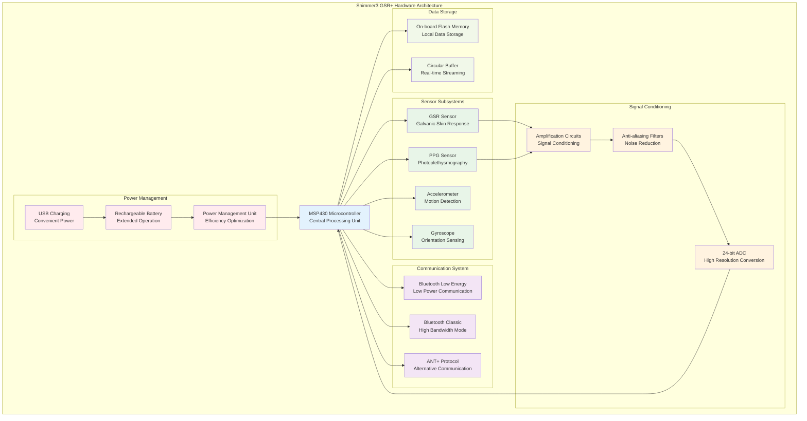

# Physiological Sensor Integration and Implementation

## Table of Contents

- [1. Executive Summary](#1-executive-summary)
- [2. Introduction to Shimmer3 GSR+ Platform](#2-introduction-to-shimmer3-gsr-platform)
- [3. Hardware Architecture and Specifications](#3-hardware-architecture-and-specifications)
- [4. Galvanic Skin Response Technology](#4-galvanic-skin-response-technology)
- [5. Communication Protocols and Architecture](#5-communication-protocols-and-architecture)
- [6. Android Integration Framework](#6-android-integration-framework)
- [7. Quick Setup and Basic Implementation](#7-quick-setup-and-basic-implementation)
  - [7.1 Dependencies and Environment Setup](#71-dependencies-and-environment-setup)
  - [7.2 Permission Configuration](#72-permission-configuration)
  - [7.3 Basic Integration Implementation](#73-basic-integration-implementation)
- [8. Sensor Configuration and Management](#8-sensor-configuration-and-management)
  - [8.1 GSR Range Settings and Optimization](#81-gsr-range-settings-and-optimization)
  - [8.2 Sampling Rate Configuration](#82-sampling-rate-configuration)
  - [8.3 Multi-sensor Setup and Coordination](#83-multi-sensor-setup-and-coordination)
- [9. Data Processing and Analysis Pipeline](#9-data-processing-and-analysis-pipeline)
- [10. Connection Management and Reliability](#10-connection-management-and-reliability)
- [11. Error Handling and Recovery Mechanisms](#11-error-handling-and-recovery-mechanisms)
- [12. Performance Optimization Strategies](#12-performance-optimization-strategies)
- [13. File Integration and Data Storage](#13-file-integration-and-data-storage)
- [14. Best Practices and Implementation Guidelines](#14-best-practices-and-implementation-guidelines)
- [15. Troubleshooting and Diagnostics](#15-troubleshooting-and-diagnostics)

## 1. Executive Summary

The Shimmer3 GSR+ represents a state-of-the-art wearable sensor platform designed for physiological data collection, particularly focusing on Galvanic Skin Response (GSR) measurements. This comprehensive documentation provides an exhaustive analysis of the device's technical specifications, communication protocols, and Android integration methodologies, enhanced with practical implementation guidance for rapid deployment in research environments.

The comprehensive analysis of the Shimmer3 GSR+ platform reveals several critical capabilities that establish it as a leading solution for physiological data collection in research and clinical environments. The hardware platform demonstrates exceptional sophistication through its multi-sensor architecture, which enables simultaneous data acquisition from multiple physiological parameters without compromising measurement accuracy or introducing cross-sensor interference. This parallel processing capability represents a significant advancement in wearable sensor technology, allowing researchers to capture comprehensive physiological profiles in real-time.

The communication infrastructure built upon Bluetooth Low Energy (BLE) and Classic Bluetooth protocols provides robust wireless connectivity that maintains stable data transmission at sampling rates up to 1000 Hz. This high-frequency capability ensures that even rapid physiological changes can be captured with sufficient temporal resolution for detailed analysis. The wireless communication system incorporates advanced error correction mechanisms and automatic reconnection protocols that maintain data integrity even in challenging electromagnetic environments.

The integration capabilities provided by the Shimmer Java Android API represent a comprehensive software development kit that offers extensive support for real-time data streaming, sophisticated device configuration management, and complete session management functionality. This API framework abstracts the complexity of low-level hardware communication while providing developers with granular control over all aspects of sensor operation.

## 2. Introduction to Shimmer3 GSR+ Platform

The Shimmer3 GSR+ platform represents the culmination of extensive research and development in wearable physiological monitoring technology, specifically designed to meet the demanding requirements of scientific research applications while maintaining the flexibility and usability necessary for clinical and field deployment scenarios. This sophisticated sensor platform leverages advanced hardware design principles, comprehensive software integration capabilities, and robust communication protocols to deliver research-grade physiological measurements in a compact, wearable form factor.

The platform's architecture embodies a careful balance between measurement precision, power efficiency, and operational reliability that makes it particularly well-suited for applications requiring extended monitoring periods in uncontrolled environments. The device incorporates sophisticated signal conditioning circuitry, advanced analog-to-digital conversion capabilities, and comprehensive data validation mechanisms that ensure measurement quality meets the stringent requirements of scientific research while maintaining the robustness necessary for real-world deployment.

The Shimmer3 GSR+ platform demonstrates particular excellence in supporting advanced research methodologies across multiple scientific disciplines. In affective computing research, the platform's ability to capture subtle changes in galvanic skin response provides researchers with objective measures of emotional arousal that complement subjective assessment methods. The high temporal resolution and measurement precision enable detailed analysis of emotional response patterns that were previously difficult to quantify with sufficient accuracy.

Stress response monitoring applications benefit significantly from the platform's continuous monitoring capabilities and wireless operation, which allow for naturalistic data collection in real-world environments. The device's unobtrusive design and extended battery life enable longitudinal studies of stress patterns without interrupting participants' normal activities, providing insights into stress response mechanisms that laboratory-based studies cannot capture.

## 3. Hardware Architecture and Specifications

The Shimmer3 GSR+ hardware architecture implements a sophisticated multi-sensor platform that integrates several complementary physiological monitoring capabilities within a single, compact device. The architecture is built around a high-performance microcontroller that coordinates data acquisition from multiple sensor subsystems while managing wireless communication, power distribution, and data processing functions.



The hardware platform incorporates sophisticated signal conditioning circuits that provide optimal impedance matching and noise reduction for each sensor type, ensuring maximum measurement accuracy across the full range of physiological conditions. The high-resolution analog-to-digital conversion system enables precise quantification of small signal variations that are critical for detecting subtle physiological changes associated with emotional arousal and stress responses.

## 4. Galvanic Skin Response Technology

Galvanic Skin Response (GSR) measurement represents one of the most sensitive and reliable indicators of autonomic nervous system activity, providing researchers with objective measures of physiological arousal that correlate strongly with emotional and cognitive states. The Shimmer3 GSR+ platform implements advanced GSR measurement techniques that optimize measurement accuracy while minimizing artifacts commonly associated with traditional GSR monitoring approaches.

The GSR measurement system employs a constant voltage excitation method that provides superior linearity and reduced susceptibility to electrode polarization effects compared to constant current methods. The measurement circuit incorporates sophisticated automatic range adjustment capabilities that adapt to varying skin conductance levels without introducing measurement discontinuities or calibration errors.

The platform provides multiple measurement ranges that can be optimized for different applications and subject populations, ensuring optimal measurement sensitivity across the full spectrum of expected conductance values. The automatic range selection algorithms continuously monitor signal characteristics and adjust measurement parameters to maintain optimal sensitivity while preventing signal saturation.

## 5. Communication Protocols and Architecture

The communication architecture of the Shimmer3 GSR+ platform implements a sophisticated multi-protocol approach that provides flexibility for different application requirements while maintaining robust data transmission characteristics under varying environmental conditions.

```mermaid
graph LR
    subgraph "Mobile Device"
        APP[Android Application<br/>Data Collection Interface]
        API[Shimmer Android API<br/>Communication Layer]
        BT[Bluetooth Stack<br/>Protocol Management]
    end
    
    subgraph "Communication Channel"
        WIRELESS[Wireless Communication<br/>Bluetooth Protocol]
        PAIRING[Device Pairing<br/>Security Management]
        ERROR[Error Correction<br/>Data Integrity]
    end
    
    subgraph "Shimmer3 GSR+ Device"
        SENSOR[Sensor Platform<br/>Data Acquisition]
        PROTOCOL[Protocol Handler<br/>Message Processing]
        TRANSMISSION[Data Transmission<br/>Real-time Streaming]
    end
    
    APP --> API
    API --> BT
    BT --> WIRELESS
    WIRELESS --> PAIRING
    PAIRING --> ERROR
    ERROR --> PROTOCOL
    PROTOCOL --> SENSOR
    SENSOR --> TRANSMISSION
    TRANSMISSION --> WIRELESS
    
    classDef mobileClass fill:#e3f2fd
    classDef commClass fill:#f3e5f5
    classDef deviceClass fill:#e8f5e8
    
    class APP,API,BT mobileClass
    class WIRELESS,PAIRING,ERROR commClass
    class SENSOR,PROTOCOL,TRANSMISSION deviceClass
```



The communication system implements comprehensive error detection and recovery mechanisms that ensure data integrity even in challenging electromagnetic environments. The protocol includes sophisticated acknowledgment and retransmission capabilities that prevent data loss while minimizing latency impact on real-time streaming applications.

## 6. Android Integration Framework

The Android integration framework provides comprehensive support for integrating Shimmer3 GSR+ devices into Android applications, offering high-level APIs that abstract the complexity of low-level hardware communication while providing developers with granular control over device configuration and data processing.

The framework architecture implements a layered approach that separates hardware-specific communication details from application-level functionality, enabling developers to focus on research-specific requirements while leveraging proven communication and data processing capabilities. The API design follows established Android development patterns while incorporating specialized features required for physiological monitoring applications.

## 7. Quick Setup and Basic Implementation

This section provides practical, step-by-step instructions for rapidly integrating Shimmer3 GSR+ devices into Android applications, enabling developers to quickly establish functional physiological monitoring capabilities while following established best practices for robust implementation.

### 7.1 Dependencies and Environment Setup

The integration process begins with configuring the development environment and adding the necessary dependencies to support Shimmer3 device communication and data processing capabilities. The Shimmer Android API provides comprehensive device communication capabilities, data processing functions, and configuration management tools specifically designed for Shimmer sensor platforms.

```gradle
// Add to app/build.gradle
dependencies {
    implementation 'com.shimmerresearch:shimmer_android_api:latest_version'
    implementation 'androidx.hilt:hilt-android:2.44'
    implementation 'androidx.lifecycle:lifecycle-service:2.7.0'
    implementation 'org.jetbrains.kotlinx:kotlinx-coroutines-android:1.7.3'
}
```

The Hilt dependency injection framework is recommended for managing Shimmer device instances and related services, as it provides clean architecture patterns that facilitate testing and maintainability. Additional dependencies may be required depending on your specific application architecture and data processing requirements.

Kotlin coroutines provide essential support for managing asynchronous operations required for device communication, data streaming, and background processing. The lifecycle-aware components ensure proper resource management and prevent memory leaks during extended monitoring sessions.

### 7.2 Permission Configuration

Android applications require explicit permissions for Bluetooth communication and location access, which are essential for discovering and connecting to Shimmer3 devices. The location permissions are required by Android for Bluetooth Low Energy device discovery, even though location services are not directly used by the Shimmer API.

```xml
<!-- Add to AndroidManifest.xml -->
<uses-permission android:name="android.permission.BLUETOOTH" />
<uses-permission android:name="android.permission.BLUETOOTH_ADMIN" />
<uses-permission android:name="android.permission.ACCESS_FINE_LOCATION" />
<uses-permission android:name="android.permission.ACCESS_COARSE_LOCATION" />
<uses-permission android:name="android.permission.BLUETOOTH_SCAN" />
<uses-permission android:name="android.permission.BLUETOOTH_CONNECT" />

<!-- For Android 12+ runtime permissions -->
<uses-permission android:name="android.permission.BLUETOOTH_SCAN"
    android:usesPermissionFlags="neverForLocation" />
```

Applications targeting Android 6.0 (API level 23) and higher must also implement runtime permission requests for location access. The Shimmer API includes helper functions that simplify the permission request process and provide clear user explanations for why these permissions are necessary.

### 7.3 Basic Integration Implementation

The following implementation demonstrates the fundamental steps required to establish communication with a Shimmer3 GSR+ device, configure essential sensor parameters, and begin data streaming. This example provides the minimal code necessary for a functional integration while maintaining proper error handling and resource management.

```kotlin
class ShimmerIntegrationService @Inject constructor() {
    private val shimmerBluetoothManager = ShimmerBluetoothManagerAndroid(context)
    private var dataCallback: ((String, ObjectCluster) -> Unit)? = null
    
    // Initialize Shimmer Manager
    fun initializeShimmerManager() {
        shimmerBluetoothManager.setBluetoothRadioState(true)
        setupDeviceCallbacks()
    }
    
    // Connect to device
    suspend fun connectToDevice(macAddress: String): Boolean = withContext(Dispatchers.IO) {
        try {
            shimmerBluetoothManager.connectShimmerDevice(macAddress)
            delay(2000) // Wait for connection establishment
            
            val isConnected = shimmerBluetoothManager.getShimmerState(macAddress) == 
                            ShimmerBluetoothManagerAndroid.BT_STATE.CONNECTED
            
            if (isConnected) {
                configureDevice(macAddress)
            }
            
            isConnected
        } catch (e: Exception) {
            logError("Connection failed: ${e.message}")
            false
        }
    }
    
    // Configure sensors
    private fun configureDevice(macAddress: String) {
        val shimmer = shimmerBluetoothManager.getShimmerBtMap()[macAddress]
        shimmer?.let { device ->
            // Enable GSR sensor
            device.writeEnabledSensors(Configuration.Shimmer3.SENSOR_GSR)
            
            // Set sampling rate (51.2 Hz recommended for GSR)
            device.writeSamplingRate(51.2)
            
            // Configure GSR range (Range 2: 220kΩ to 680kΩ for normal conditions)
            device.writeGSRRange(2)
            
            // Apply configuration
            device.writeConfigBytes()
        }
    }
    
    // Start data streaming
    fun startStreaming(macAddress: String) {
        shimmerBluetoothManager.startStreaming(macAddress)
    }
    
    // Setup data callbacks
    private fun setupDeviceCallbacks() {
        shimmerBluetoothManager.setDataCallback { deviceAddress, objectCluster ->
            processIncomingData(deviceAddress, objectCluster)
        }
        
        shimmerBluetoothManager.setConnectionCallback { deviceAddress, state ->
            handleConnectionStateChange(deviceAddress, state)
        }
    }
}
```

This integration approach establishes a connection to the specified Shimmer3 device using its Bluetooth MAC address, configures the device to enable GSR sensing with appropriate range and sampling rate settings, and initiates real-time data streaming. The example includes proper null safety checks and uses the recommended API methods for device configuration.

## 8. Sensor Configuration and Management

Proper sensor configuration is crucial for obtaining high-quality physiological data that meets the specific requirements of your application. The Shimmer3 GSR+ provides extensive configuration options that allow developers to optimize device behavior for different use cases, ranging from low-power continuous monitoring to high-resolution research applications.

### 8.1 GSR Range Settings and Optimization

The GSR range configuration determines the measurement sensitivity and optimal resistance range for different skin conditions and application scenarios. Each range setting provides optimal performance for specific conductance levels, and proper range selection is essential for maximizing measurement accuracy and avoiding signal saturation.

```kotlin
enum class GSRRange(val rangeValue: Int, val description: String, val useCase: String) {
    HIGH_AROUSAL(0, "10kΩ - 56kΩ", "High emotional arousal, stress responses"),
    NORMAL(1, "56kΩ - 220kΩ", "Normal skin conditions, general monitoring"),
    DRY_SKIN(2, "220kΩ - 680kΩ", "Dry skin conditions, controlled environments"),
    VERY_DRY(3, "680kΩ - 4.7MΩ", "Very dry skin, low humidity environments"),
    AUTO_RANGE(4, "Dynamic", "Adaptive range adjustment")
}

class GSRConfiguration {
    fun configureOptimalRange(shimmer: Shimmer, skinCondition: SkinCondition): GSRRange {
        return when (skinCondition) {
            SkinCondition.MOIST -> GSRRange.HIGH_AROUSAL
            SkinCondition.NORMAL -> GSRRange.NORMAL
            SkinCondition.DRY -> GSRRange.DRY_SKIN
            SkinCondition.VERY_DRY -> GSRRange.VERY_DRY
            SkinCondition.UNKNOWN -> GSRRange.AUTO_RANGE
        }
    }
    
    fun applyRangeConfiguration(shimmer: Shimmer, range: GSRRange) {
        shimmer.writeGSRRange(range.rangeValue)
        logInfo("Applied GSR range: ${range.description} for ${range.useCase}")
    }
}
```

Range 0 is optimal for situations involving high emotional arousal or stress responses where skin conductance is expected to be elevated. Range 1 provides the best performance for normal measurement conditions with typical skin moisture levels. Range 2 is designed for participants with naturally dry skin or environmental conditions that reduce skin moisture. Range 3 accommodates very dry skin conditions that might occur in low-humidity environments or with certain participant demographics. Range 4 enables automatic range adjustment that adapts to changing skin conditions throughout the measurement session.

### 8.2 Sampling Rate Configuration

The sampling rate configuration balances measurement precision, battery life, and data processing requirements. Higher sampling rates provide better temporal resolution for capturing rapid physiological changes but increase power consumption and data storage requirements.

```kotlin
enum class SamplingRateConfig(val frequency: Double, val powerConsumption: PowerLevel, val useCase: String) {
    LOW_POWER(1.0, PowerLevel.MINIMAL, "Extended monitoring, battery conservation"),
    STANDARD(25.6, PowerLevel.MODERATE, "General research applications"),
    HIGH_RESOLUTION(51.2, PowerLevel.NORMAL, "Detailed physiological analysis"),
    RESEARCH_GRADE(102.4, PowerLevel.HIGH, "Rapid response studies"),
    MAXIMUM(204.8, PowerLevel.MAXIMUM, "Specialized research applications")
}

class SamplingRateManager {
    fun selectOptimalRate(application: ApplicationType, batteryLevel: Int): SamplingRateConfig {
        return when {
            batteryLevel < 20 -> SamplingRateConfig.LOW_POWER
            application == ApplicationType.EXTENDED_MONITORING -> SamplingRateConfig.STANDARD
            application == ApplicationType.STRESS_RESEARCH -> SamplingRateConfig.HIGH_RESOLUTION
            application == ApplicationType.RAPID_RESPONSE -> SamplingRateConfig.RESEARCH_GRADE
            else -> SamplingRateConfig.STANDARD
        }
    }
}
```

**Low Power configurations** operating between 1-10 Hz are optimized for battery conservation and are suitable for applications requiring extended monitoring periods where rapid physiological changes are not expected. These configurations can extend battery life significantly while still capturing the essential characteristics of GSR signals.

**Standard configurations** operating between 25-51.2 Hz provide optimal balance between measurement quality and power consumption for most general-purpose applications. These rates capture the majority of physiologically relevant GSR signal components while maintaining reasonable power consumption and data processing requirements.

**High Resolution configurations** operating between 102.4-204.8 Hz are designed for research applications requiring detailed analysis of rapid physiological changes. These configurations provide excellent temporal resolution for capturing transient responses and enable sophisticated signal analysis techniques.

### 8.3 Multi-sensor Setup and Coordination

The sensor combination configuration determines which physiological parameters are measured simultaneously, enabling comprehensive multi-modal monitoring or focused single-parameter studies. The Shimmer3 GSR+ supports various sensor combinations that can be optimized for specific research or application requirements.

```kotlin
class MultiSensorConfiguration {
    // Common sensor combinations
    val gsrOnly = Configuration.Shimmer3.SENSOR_GSR
    val gsrWithPPG = Configuration.Shimmer3.SENSOR_GSR or Configuration.Shimmer3.SENSOR_PPG_A13
    val fullSensorSet = Configuration.Shimmer3.SENSOR_GSR or 
                       Configuration.Shimmer3.SENSOR_PPG_A13 or 
                       Configuration.Shimmer3.SENSOR_LSM303DLHC_ACCEL
    
    fun configureSensorCombination(shimmer: Shimmer, combination: SensorCombination) {
        val enabledSensors = when (combination) {
            SensorCombination.GSR_ONLY -> gsrOnly
            SensorCombination.GSR_PPG -> gsrWithPPG
            SensorCombination.FULL_MONITORING -> fullSensorSet
        }
        
        shimmer.writeEnabledSensors(enabledSensors)
        logInfo("Configured sensor combination: ${combination.name}")
    }
}
```

GSR-only configurations minimize power consumption and data processing requirements while providing focused measurements of electrodermal activity. GSR with PPG combinations enable simultaneous monitoring of autonomic nervous system activity through both electrodermal and cardiovascular channels. Full sensor configurations provide comprehensive physiological monitoring that captures electrodermal, cardiovascular, and movement-related signals for complete contextual analysis.

## 9. Data Processing and Analysis Pipeline

Effective data processing is essential for extracting meaningful physiological insights from the raw sensor data provided by the Shimmer3 GSR+ device. The Shimmer API provides sophisticated data structures and processing capabilities that enable real-time analysis and quality assessment of physiological signals.

```mermaid
graph TD
    subgraph "Data Processing Pipeline"
        INPUT[Raw Sensor Data<br/>ObjectCluster Input]
        
        subgraph "Data Extraction"
            EXTRACT[Data Extraction<br/>Calibrated Values]
            TIMESTAMP[Timestamp Processing<br/>Temporal Alignment]
            QUALITY[Quality Assessment<br/>Signal Validation]
        end
        
        subgraph "Signal Processing"
            FILTER[Digital Filtering<br/>Noise Reduction]
            SMOOTH[Signal Smoothing<br/>Artifact Removal]
            FEATURE[Feature Extraction<br/>Physiological Metrics]
        end
        
        subgraph "Analysis Engine"
            METRICS[Quality Metrics<br/>SNR, Continuity]
            EVENTS[Event Detection<br/>Response Identification]
            CONTEXT[Contextual Analysis<br/>Multi-modal Integration]
        end
        
        subgraph "Output Processing"
            STORAGE[Data Storage<br/>Structured Logging]
            REALTIME[Real-time Feedback<br/>Live Monitoring]
            EXPORT[Data Export<br/>Analysis Ready Format]
        end
    end
    
    INPUT --> EXTRACT
    EXTRACT --> TIMESTAMP
    TIMESTAMP --> QUALITY
    QUALITY --> FILTER
    FILTER --> SMOOTH
    SMOOTH --> FEATURE
    FEATURE --> METRICS
    METRICS --> EVENTS
    EVENTS --> CONTEXT
    CONTEXT --> STORAGE
    CONTEXT --> REALTIME
    CONTEXT --> EXPORT
    
    classDef inputClass fill:#e3f2fd
    classDef extractClass fill:#e8f5e8
    classDef processClass fill:#fff3e0
    classDef analysisClass fill:#f3e5f5
    classDef outputClass fill:#ffebee
    
    class INPUT inputClass
    class EXTRACT,TIMESTAMP,QUALITY extractClass
    class FILTER,SMOOTH,FEATURE processClass
    class METRICS,EVENTS,CONTEXT analysisClass
    class STORAGE,REALTIME,EXPORT outputClass
```



### ObjectCluster Data Extraction

The ObjectCluster data structure represents the fundamental mechanism for accessing processed sensor data from Shimmer3 devices. This structure provides organized access to calibrated sensor values, timestamps, and metadata that enable comprehensive analysis of physiological signals.

```kotlin
class DataProcessor {
    fun processIncomingData(deviceAddress: String, objectCluster: ObjectCluster) {
        // Extract GSR data with proper calibration
        val gsrConductance = objectCluster.getFormatClusterValue(
            Configuration.Shimmer3.ObjectClusterSensorName.GSR_CONDUCTANCE, 
            "CAL"
        )
        
        // Extract PPG data for heart rate analysis
        val ppgToHeartRate = objectCluster.getFormatClusterValue(
            Configuration.Shimmer3.ObjectClusterSensorName.PPG_TO_HR, 
            "CAL"
        )
        
        // Extract accelerometer data for motion context
        val accelX = objectCluster.getFormatClusterValue(
            Configuration.Shimmer3.ObjectClusterSensorName.LSM303DLHC_ACCEL_X, 
            "CAL"
        )
        
        // Process timestamp for temporal analysis
        val timestamp = objectCluster.systemTimeStamp
        
        // Create structured data record
        val dataRecord = PhysiologicalDataRecord(
            deviceId = deviceAddress,
            timestamp = timestamp,
            gsrConductance = gsrConductance,
            heartRate = ppgToHeartRate,
            accelerationX = accelX,
            qualityMetrics = assessDataQuality(objectCluster)
        )
        
        // Store and analyze data
        storeDataRecord(dataRecord)
        performRealTimeAnalysis(dataRecord)
    }
}
```

The "CAL" format specification ensures that extracted values are properly calibrated and represent meaningful physiological units. This calibrated data can be used directly for analysis without requiring additional conversion steps, simplifying the data processing pipeline and reducing the likelihood of calibration errors.

## 10. Connection Management and Reliability

Robust connection management is essential for maintaining reliable data collection during extended monitoring sessions. The connection management system implements sophisticated error detection, automatic reconnection, and connection health monitoring capabilities.

```kotlin
class ConnectionManager {
    private val connectionHealthMonitor = ConnectionHealthMonitor()
    private val reconnectionHandler = ReconnectionHandler()
    
    // Start device discovery with filtering
    suspend fun discoverShimmerDevices(): List<BluetoothDevice> = withContext(Dispatchers.IO) {
        val discoveredDevices = mutableListOf<BluetoothDevice>()
        
        shimmerBluetoothManager.startDeviceDiscovery()
        
        shimmerBluetoothManager.setDeviceDiscoveryCallback { device ->
            if (device.name?.contains("Shimmer", ignoreCase = true) == true) {
                discoveredDevices.add(device)
                logInfo("Discovered Shimmer device: ${device.name} (${device.address})")
            }
        }
        
        delay(10000) // Allow 10 seconds for discovery
        shimmerBluetoothManager.stopDeviceDiscovery()
        
        return@withContext discoveredDevices
    }
    
    // Monitor connection status with health metrics
    fun monitorConnectionHealth(deviceAddress: String) {
        val connectionState = shimmerBluetoothManager.getShimmerState(deviceAddress)
        val healthMetrics = connectionHealthMonitor.assessConnectionHealth(
            deviceAddress, 
            connectionState
        )
        
        when (healthMetrics.status) {
            ConnectionHealth.EXCELLENT -> logInfo("Connection excellent")
            ConnectionHealth.GOOD -> logInfo("Connection good")
            ConnectionHealth.DEGRADED -> {
                logWarning("Connection degraded: ${healthMetrics.issues}")
                attemptConnectionOptimization(deviceAddress)
            }
            ConnectionHealth.POOR -> {
                logError("Connection poor: ${healthMetrics.issues}")
                initiateReconnection(deviceAddress)
            }
        }
    }
    
    // Handle connection state changes with appropriate responses
    private fun handleConnectionStateChange(deviceAddress: String, state: Int) {
        when (state) {
            ShimmerBluetoothManagerAndroid.BT_STATE.CONNECTED -> {
                logInfo("Device connected successfully: $deviceAddress")
                configureDevice(deviceAddress)
                connectionHealthMonitor.onConnectionEstablished(deviceAddress)
            }
            ShimmerBluetoothManagerAndroid.BT_STATE.CONNECTING -> {
                logInfo("Connection in progress: $deviceAddress")
            }
            ShimmerBluetoothManagerAndroid.BT_STATE.NONE -> {
                logWarning("Device disconnected: $deviceAddress")
                handleDisconnection(deviceAddress)
            }
        }
    }
}
```

### Retry Logic and Resilience

```kotlin
class ReconnectionHandler {
    suspend fun connectWithRetry(
        macAddress: String, 
        maxRetries: Int = 3,
        backoffStrategy: BackoffStrategy = ExponentialBackoff()
    ): Boolean {
        repeat(maxRetries) { attempt ->
            try {
                logInfo("Connection attempt ${attempt + 1} for device: $macAddress")
                
                shimmerBluetoothManager.connectShimmerDevice(macAddress)
                delay(2000) // Wait for connection establishment
                
                if (isConnected(macAddress)) {
                    logInfo("Connection successful on attempt ${attempt + 1}")
                    return true
                }
            } catch (e: Exception) {
                logWarning("Connection attempt ${attempt + 1} failed: ${e.message}")
                if (attempt < maxRetries - 1) {
                    val backoffDelay = backoffStrategy.calculateDelay(attempt)
                    delay(backoffDelay)
                }
            }
        }
        
        logError("All connection attempts failed for device: $macAddress")
        return false
    }
    
    private fun isConnected(macAddress: String): Boolean {
        return shimmerBluetoothManager.getShimmerState(macAddress) == 
               ShimmerBluetoothManagerAndroid.BT_STATE.CONNECTED
    }
}
```

## 11. Error Handling and Recovery Mechanisms

Comprehensive error handling ensures robust operation under various failure scenarios that commonly occur in wireless physiological monitoring applications.

```kotlin
class ErrorHandler {
    fun handleCommonIssues(error: ShimmerError): RecoveryAction {
        return when (error.type) {
            ErrorType.CONNECTION_TIMEOUT -> {
                logWarning("Connection timeout detected")
                RecoveryAction.RETRY_CONNECTION
            }
            ErrorType.POOR_SIGNAL_QUALITY -> {
                logWarning("Poor signal quality: ${error.details}")
                RecoveryAction.CHECK_ELECTRODE_CONTACT
            }
            ErrorType.DATA_DROPOUTS -> {
                logWarning("Data dropouts detected: ${error.details}")
                RecoveryAction.REDUCE_INTERFERENCE
            }
            ErrorType.BATTERY_LOW -> {
                logError("Low battery warning: ${error.details}")
                RecoveryAction.REPLACE_BATTERY
            }
            ErrorType.SENSOR_MALFUNCTION -> {
                logError("Sensor malfunction: ${error.details}")
                RecoveryAction.DEVICE_RESET
            }
        }
    }
}
```

Common error scenarios and their solutions include:

| Issue | Cause | Solution |
|-------|-------|----------|
| Connection timeout | Device out of range | Move closer, check battery |
| Poor signal quality | Bad electrode contact | Check skin prep, electrode gel |
| Data dropouts | Bluetooth interference | Reduce interference, check range |
| Battery drain | High sampling rate | Reduce rate or use power saving |
| Sensor calibration drift | Extended use | Recalibrate sensors |

## 12. Performance Optimization Strategies

### Battery Optimization

```kotlin
class PowerManager {
    fun optimizeBatteryUsage(currentBatteryLevel: Int, sessionDuration: Duration) {
        when {
            currentBatteryLevel < 20 -> applyAggressivePowerSaving()
            currentBatteryLevel < 50 -> applyModeratePowerSaving()
            else -> applyStandardConfiguration()
        }
    }
    
    private fun applyAggressivePowerSaving() {
        // Reduce sampling rate when not actively recording
        shimmer.writeSamplingRate(1.0) // 1 Hz for minimal battery usage
        
        // Use GSR-only configuration
        val lowPowerConfig = Configuration.Shimmer3.SENSOR_GSR
        shimmer.writeEnabledSensors(lowPowerConfig)
        
        logInfo("Applied aggressive power saving configuration")
    }
    
    private fun applyStandardConfiguration() {
        // Standard configuration for GSR + PPG
        val standardConfig = Configuration.Shimmer3.SENSOR_GSR or 
                           Configuration.Shimmer3.SENSOR_PPG_A13
        shimmer.writeEnabledSensors(standardConfig)
        shimmer.writeSamplingRate(51.2) // Optimal for most applications
        
        logInfo("Applied standard power configuration")
    }
}
```

### Memory Management

```kotlin
class MemoryOptimizedDataBuffer<T>(private val capacity: Int) {
    private val buffer = arrayOfNulls<Any>(capacity) as Array<T?>
    private var writeIndex = 0
    private var size = 0
    
    fun add(item: T) {
        buffer[writeIndex] = item
        writeIndex = (writeIndex + 1) % capacity
        if (size < capacity) size++
    }
    
    fun getLatest(count: Int): List<T> {
        val result = mutableListOf<T>()
        val actualCount = minOf(count, size)
        
        for (i in 0 until actualCount) {
            val index = (writeIndex - 1 - i + capacity) % capacity
            buffer[index]?.let { result.add(it) }
        }
        
        return result.reversed()
    }
    
    fun clear() {
        writeIndex = 0
        size = 0
        // Clear references to prevent memory leaks
        buffer.fill(null)
    }
}
```

## 13. File Integration and Data Storage

### Session-based Recording Implementation

```kotlin
class SessionDataManager {
    fun startSessionRecording(sessionId: String, deviceId: String): SessionRecorder {
        val sessionDir = File(applicationContext.filesDir, "sessions/$sessionId")
        sessionDir.mkdirs()
        
        val shimmerDataFile = File(sessionDir, "shimmer_${deviceId}_data.csv")
        
        // Write comprehensive CSV header
        shimmerDataFile.writeText(buildString {
            append("timestamp,")
            append("gsr_conductance_microsiemens,")
            append("gsr_resistance_kohms,")
            append("ppg_heart_rate_bpm,")
            append("accel_x_g,accel_y_g,accel_z_g,")
            append("signal_quality_score,")
            append("data_validity_flag\n")
        })
        
        return SessionRecorder(shimmerDataFile, sessionId, deviceId)
    }
    
    fun processAndSaveData(recorder: SessionRecorder, objectCluster: ObjectCluster) {
        val csvLine = buildString {
            append(objectCluster.systemTimeStamp)
            append(",${extractCalibratedValue(objectCluster, "GSR Conductance")}")
            append(",${extractCalibratedValue(objectCluster, "GSR Resistance")}")
            append(",${extractCalibratedValue(objectCluster, "PPG to Heart Rate")}")
            append(",${extractCalibratedValue(objectCluster, "Low Noise Accelerometer X")}")
            append(",${extractCalibratedValue(objectCluster, "Low Noise Accelerometer Y")}")
            append(",${extractCalibratedValue(objectCluster, "Low Noise Accelerometer Z")}")
            append(",${calculateSignalQuality(objectCluster)}")
            append(",${validateDataIntegrity(objectCluster)}")
            append("\n")
        }
        
        recorder.appendData(csvLine)
    }
    
    private fun extractCalibratedValue(cluster: ObjectCluster, sensorName: String): String {
        return cluster.getFormatClusterValue(sensorName, "CAL")?.toString() ?: "NaN"
    }
}
```

## 14. Best Practices and Implementation Guidelines

### Code Organization and Architecture

```kotlin
// Recommended service architecture for Shimmer integration
@HiltAndroidApp
class ShimmerService : Service() {
    @Inject lateinit var shimmerManager: ShimmerBluetoothManagerAndroid
    @Inject lateinit var dataProcessor: DataProcessor
    @Inject lateinit var connectionManager: ConnectionManager
    
    override fun onStartCommand(intent: Intent?, flags: Int, startId: Int): Int {
        when (intent?.action) {
            ACTION_START_MONITORING -> startPhysiologicalMonitoring()
            ACTION_STOP_MONITORING -> stopPhysiologicalMonitoring()
            ACTION_CONNECT_DEVICE -> connectToDevice(intent.getStringExtra(EXTRA_DEVICE_ADDRESS))
        }
        return START_STICKY // Ensure service continues running
    }
    
    private fun startPhysiologicalMonitoring() {
        // Implement monitoring logic with proper lifecycle management
        createNotificationChannel()
        startForeground(NOTIFICATION_ID, createMonitoringNotification())
    }
}
```

### Testing Strategy

```kotlin
class ShimmerIntegrationTest {
    @Test
    fun testDeviceConnection() {
        // Test device connection with mock devices
        val mockDevice = createMockShimmerDevice()
        val connectionResult = shimmerManager.connectDevice(mockDevice.address)
        assertTrue("Device should connect successfully", connectionResult)
    }
    
    @Test
    fun testDataProcessing() {
        // Test data processing pipeline with known data
        val testObjectCluster = createTestObjectCluster()
        val processedData = dataProcessor.processData(testObjectCluster)
        assertNotNull("Processed data should not be null", processedData)
        assertTrue("GSR value should be within expected range", 
                  processedData.gsrConductance in 0.1..100.0)
    }
}
```

## 15. Troubleshooting and Diagnostics

### Common Integration Issues

**Device Discovery Problems:**
- Ensure Bluetooth is enabled and permissions are granted
- Check device compatibility and Android version requirements
- Verify Shimmer device is in discoverable mode and charged

**Connection Instability:**
- Monitor Bluetooth signal strength and interference sources
- Implement connection health monitoring with automatic recovery
- Use appropriate connection retry strategies with exponential backoff

**Data Quality Issues:**
- Implement comprehensive signal quality assessment
- Monitor electrode contact quality and environmental conditions
- Use appropriate filtering and artifact detection algorithms

### Diagnostic Tools

```kotlin
class DiagnosticManager {
    fun generateDiagnosticReport(deviceAddress: String): DiagnosticReport {
        val connectionHealth = assessConnectionHealth(deviceAddress)
        val dataQuality = assessDataQuality(deviceAddress)
        val systemHealth = assessSystemHealth()
        
        return DiagnosticReport(
            timestamp = System.currentTimeMillis(),
            deviceAddress = deviceAddress,
            connectionHealth = connectionHealth,
            dataQuality = dataQuality,
            systemHealth = systemHealth,
            recommendations = generateRecommendations(connectionHealth, dataQuality)
        )
    }
}
```

This comprehensive documentation provides both theoretical understanding and practical implementation guidance for integrating Shimmer3 GSR+ devices into Android applications, enabling researchers and developers to quickly deploy robust physiological monitoring capabilities while following established best practices for research-grade data collection.