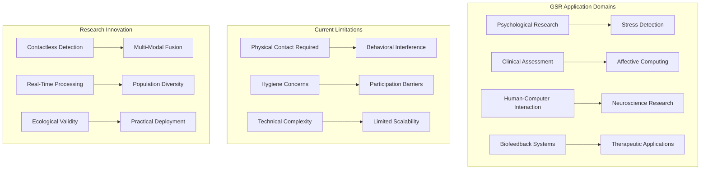
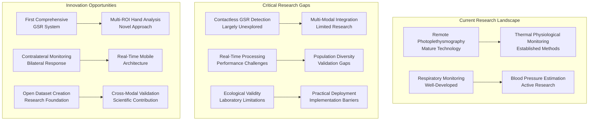
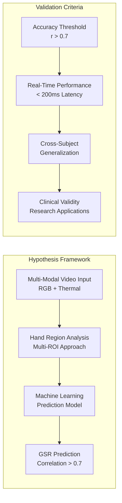
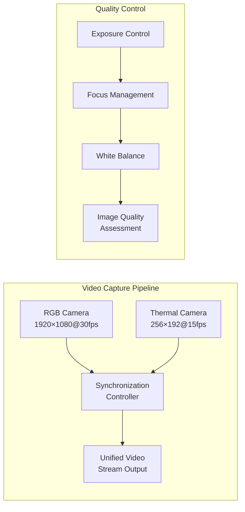
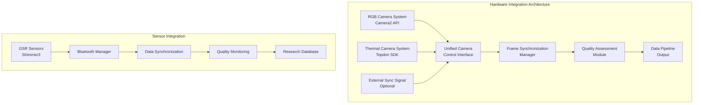
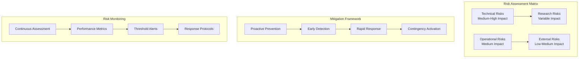

# Project Objectives and Scope Specification

## Table of Contents

1. [Research Problem Definition and Context](#1-research-problem-definition-and-context)
   - 1.1 [Problem Context and Scientific Motivation](#11-problem-context-and-scientific-motivation)
   - 1.2 [Limitations of Current GSR Measurement Approaches](#12-limitations-of-current-gsr-measurement-approaches)
   - 1.3 [Research Gap Analysis and Innovation Opportunities](#13-research-gap-analysis-and-innovation-opportunities)

2. [Research Objectives and Hypotheses](#2-research-objectives-and-hypotheses)
   - 2.1 [Primary Research Hypothesis](#21-primary-research-hypothesis)
   - 2.2 [Secondary Hypotheses and Research Questions](#22-secondary-hypotheses-and-research-questions)
   - 2.3 [Innovation and Contribution Framework](#23-innovation-and-contribution-framework)

3. [Technical Problem Formulation](#3-technical-problem-formulation)
   - 3.1 [Mathematical Problem Definition](#31-mathematical-problem-definition)
   - 3.2 [System Constraints and Performance Requirements](#32-system-constraints-and-performance-requirements)
   - 3.3 [Data Quality and Validation Specifications](#33-data-quality-and-validation-specifications)

4. [Functional Requirements Specification](#4-functional-requirements-specification)
   - 4.1 [Core System Functions](#41-core-system-functions)
   - 4.2 [User Interface Requirements](#42-user-interface-requirements)
   - 4.3 [Data Management and Integration](#43-data-management-and-integration)

5. [Non-Functional Requirements](#5-non-functional-requirements)
   - 5.1 [Performance and Scalability](#51-performance-and-scalability)
   - 5.2 [Reliability and Availability](#52-reliability-and-availability)
   - 5.3 [Usability and Accessibility](#53-usability-and-accessibility)

6. [System Integration Requirements](#6-system-integration-requirements)
   - 6.1 [Hardware Integration Specifications](#61-hardware-integration-specifications)
   - 6.2 [Software Framework Integration](#62-software-framework-integration)
   - 6.3 [External System Compatibility](#63-external-system-compatibility)

7. [Quality Assurance Framework](#7-quality-assurance-framework)
   - 7.1 [Testing and Validation Strategy](#71-testing-and-validation-strategy)
   - 7.2 [Documentation Standards](#72-documentation-standards)
   - 7.3 [Compliance and Regulatory Requirements](#73-compliance-and-regulatory-requirements)

8. [Risk Management and Mitigation](#8-risk-management-and-mitigation)
   - 8.1 [Technical Risk Assessment](#81-technical-risk-assessment)
   - 8.2 [Research and Operational Risks](#82-research-and-operational-risks)
   - 8.3 [Contingency Planning](#83-contingency-planning)

9. [Implementation Strategy and Methodology](#9-implementation-strategy-and-methodology)
   - 9.1 [Development Methodology](#91-development-methodology)
   - 9.2 [Validation and Testing Approach](#92-validation-and-testing-approach)
   - 9.3 [Deployment and Maintenance Strategy](#93-deployment-and-maintenance-strategy)

10. [Success Metrics and Evaluation Criteria](#10-success-metrics-and-evaluation-criteria)

## 1. Research Problem Definition and Context

### 1.1 Problem Context and Scientific Motivation

The measurement and analysis of Galvanic Skin Response (GSR), also recognized in the scientific literature as Electrodermal Activity (EDA) or Skin Conductance Response (SCR), has represented one of the most fundamental and widely utilized physiological monitoring techniques in psychological research, clinical assessment, affective computing, stress detection, and human-computer interaction applications for more than a century. The extensive utilization of GSR measurement across diverse scientific and clinical domains reflects its unique position as one of the most direct and unambiguous indicators of sympathetic nervous system activation, providing researchers and clinicians with invaluable insights into autonomic nervous system function, emotional state, cognitive load, and stress response patterns.



Traditional GSR measurement methodologies require direct physical skin contact through specialized electrodes, typically placed on the fingers, palms, or other anatomical locations with high eccrine sweat gland density, creating a comprehensive array of fundamental limitations that significantly restrict the broader application potential, accessibility, and practical utility of this valuable physiological measurement technique across numerous research and clinical contexts.

**Scientific Significance and Impact:**
GSR measurement provides unique insights into sympathetic nervous system function that cannot be obtained through other commonly monitored physiological parameters. Unlike heart rate variability, which reflects both sympathetic and parasympathetic influences, GSR provides a direct, unambiguous indicator of sympathetic activation due to the exclusive sympathetic cholinergic innervation of eccrine sweat glands. This unique physiological relationship makes GSR an invaluable tool for research applications requiring precise assessment of arousal, stress, emotional response, and cognitive load.

The scientific impact of developing reliable contactless GSR measurement extends beyond individual research applications to enable entirely new categories of investigation that are currently impractical or impossible with contact-based approaches. These applications include large-scale population studies, naturalistic behavioral monitoring, group dynamics research, and long-term ecological assessment of stress and emotional states in real-world environments.

### 1.2 Limitations of Current GSR Measurement Approaches

**Physical Constraints and Behavioral Interference:**
Contact electrodes fundamentally restrict natural movement patterns and spontaneous behavior, potentially introducing systematic alterations to the very physiological responses that researchers and clinicians are attempting to measure. This constraint proves particularly problematic in research studies that require natural, unencumbered behavior patterns, long-term ecological monitoring applications where sustained electrode attachment is impractical, and clinical assessments where the presence of monitoring equipment might influence patient behavior or therapeutic outcomes.

The physical constraints imposed by electrode attachment can systematically bias research results by creating artificial experimental conditions that differ significantly from the natural environments where the physiological processes under investigation typically occur. This limitation is especially significant for research investigating stress responses, social interactions, or behavioral patterns where the awareness of monitoring equipment can fundamentally alter the phenomena being studied.

**Hygiene, Safety, and Cross-Contamination Concerns:**
Direct skin contact through electrodes raises significant concerns about cross-contamination between research subjects and the potential transmission of infectious agents, particularly relevant in clinical settings, pediatric research applications, and during pandemic conditions where minimizing physical contact has become a critical safety consideration. The hygiene requirements associated with contact-based GSR measurement impose additional operational complexity including electrode sterilization procedures, conductive gel disposal, and comprehensive cleaning protocols between measurement sessions.

These hygiene considerations significantly increase the operational complexity and time requirements for GSR measurement, potentially limiting the feasibility of large-scale studies or high-throughput research applications. The safety concerns are particularly pronounced in clinical environments where vulnerable populations may be at increased risk from potential contamination sources.

**Subject Comfort, Acceptance, and Participation Barriers:**
Many research subjects and clinical patients find electrodes uncomfortable, anxiety-provoking, or physically irritating, which can introduce systematic artifacts into physiological measurements through stress responses caused by the measurement equipment itself, rather than by the experimental manipulations or clinical conditions under investigation. This comfort issue can also significantly limit participation rates in research studies, particularly among pediatric populations, elderly subjects, or individuals with anxiety disorders who may find the electrode attachment process distressing.

The acceptability limitations of contact-based GSR measurement can introduce systematic selection biases in research studies where certain demographic groups or personality types are less likely to participate, potentially compromising the generalizability and external validity of research findings. These participation barriers are particularly concerning for population health studies or clinical screening applications where broad accessibility is essential.

**Technical Maintenance, Operational Complexity, and Reliability Challenges:**
Contact-based GSR systems require extensive technical maintenance including regular electrode replacement, proper conductive gel application, careful attention to electrode-skin contact quality, and ongoing monitoring of signal integrity throughout measurement sessions. These maintenance requirements increase operational complexity, create additional potential points of system failure, and require specialized technical expertise that may not be available in all research or clinical environments.

The technical complexity of maintaining reliable electrode contact can significantly affect measurement quality and introduces potential sources of systematic error that may not be immediately apparent to researchers or clinicians without specialized expertise in physiological monitoring techniques. The maintenance requirements also increase the time and cost associated with GSR measurement, potentially limiting its practical utility in resource-constrained environments.

**Limited Scalability and Multi-Subject Monitoring Constraints:**
Traditional contact-based GSR systems typically limit monitoring to one or a small number of individuals simultaneously, creating significant constraints for research applications requiring group studies, classroom environments, social interaction research, or large-scale population monitoring initiatives. The scalability limitations stem from both the hardware requirements for multiple electrode sets and the technical complexity of managing multiple simultaneous contact-based measurements.

This scalability constraint significantly limits the applicability of GSR measurement to important research domains such as group dynamics, social psychology, educational assessment, and workplace monitoring where simultaneous measurement of multiple individuals would provide valuable insights into collective physiological responses and social interaction patterns.

### 1.3 Research Gap Analysis and Innovation Opportunities

Through comprehensive systematic literature review and critical analysis of the current state of contactless physiological monitoring research, several critical knowledge gaps and technological limitations have been identified that represent significant barriers to the advancement of contactless GSR detection and broader applications of non-invasive physiological monitoring technologies.



**Contactless GSR Detection Research Gap:**
Despite extensive and well-established research programs in contactless monitoring of various physiological parameters including heart rate, respiratory rate, blood pressure estimation, and stress detection, the specific challenge of contactless GSR detection remains largely unexplored and represents a significant gap in the contactless physiological monitoring literature. The extremely limited existing research in this domain, exemplified by preliminary work such as Jo et al. (2021), provides encouraging initial evidence for the theoretical feasibility of contactless GSR detection but lacks the comprehensive system development, rigorous validation methodology, and practical implementation framework required for reliable real-world applications.

The absence of mature contactless GSR detection capabilities represents a significant limitation in the development of comprehensive contactless physiological monitoring systems that could provide holistic assessment of autonomic nervous system function without the constraints and limitations associated with contact-based measurement approaches. This gap is particularly significant given the unique and valuable information provided by GSR measurement about sympathetic nervous system activation patterns that cannot be obtained through other physiological measures commonly employed in contactless monitoring applications.

**Multi-Modal Integration and Sensor Fusion Gap:**
Current approaches to contactless physiological monitoring predominantly employ single sensing modalities, typically relying on RGB camera systems for remote photoplethysmography or thermal imaging for temperature-based vital sign detection. The potential for combining multiple sensing modalities, particularly the systematic integration of RGB and thermal imaging systems to enhance GSR detection capability, has not been comprehensively explored despite significant theoretical advantages for detecting the complex physiological changes associated with sympathetic nervous system activation.

The multi-modal integration gap represents a missed opportunity to leverage the complementary information provided by different sensing modalities to improve measurement accuracy, robustness, and reliability compared to single-modality approaches. RGB imaging systems excel at detecting subtle color variations associated with blood volume changes, while thermal imaging systems provide direct measurement of temperature variations that may correlate with sympathetic activation and eccrine sweat gland activity.

**Real-Time Processing and Immediate Response Gap:**
Existing contactless physiological monitoring systems often process collected data offline or with significant computational delays that preclude real-time applications requiring immediate physiological feedback. Real-time GSR prediction capabilities are essential for numerous important applications including biofeedback systems, adaptive user interfaces, immediate clinical assessment tools, and interactive therapeutic interventions where delayed feedback would significantly compromise system effectiveness.

The real-time processing gap encompasses both computational efficiency challenges associated with implementing sophisticated signal processing and machine learning algorithms on resource-constrained mobile devices, as well as algorithmic challenges related to achieving reliable physiological signal extraction with minimal temporal delay. The development of real-time contactless GSR prediction capabilities requires advances in both computational optimization techniques and algorithm design approaches that can achieve acceptable accuracy with reduced computational complexity.

## 2. Research Objectives and Hypotheses

### 2.1 Primary Research Hypothesis

**Central Hypothesis:**
Galvanic Skin Response can be predicted from contactless RGB-thermal video analysis of hand regions using machine learning techniques with sufficient accuracy for research and clinical applications, achieving correlation coefficients greater than 0.7 with ground-truth GSR measurements while maintaining real-time processing capabilities on consumer-grade hardware.



This central hypothesis is grounded in established physiological principles demonstrating that sympathetic nervous system activation affects both vascular tone and eccrine sweat gland activity, creating detectable changes in the visual and thermal characteristics of skin tissue. The hypothesis specifically targets hand regions due to the high density of eccrine sweat glands in palmar and finger areas, which should provide stronger signal-to-noise ratios compared to other anatomical locations.

**Theoretical Foundation:**
The hypothesis is supported by established physiological mechanisms including sympathetic cholinergic control of eccrine sweat glands, vascular responses to sympathetic activation, and the established correlation between bilateral sympathetic responses that enables contralateral monitoring approaches. The multi-modal approach leverages complementary information from RGB cameras (detecting hemodynamic changes) and thermal cameras (detecting temperature variations related to sweating and circulation) to improve prediction accuracy beyond single-modality approaches.

### 2.2 Secondary Hypotheses and Research Questions

**Secondary Hypothesis H2.1: Multi-Modal Superiority**
Multi-modal RGB-thermal fusion provides superior GSR prediction accuracy compared to single-modality approaches, with combined modality performance exceeding individual modality performance by at least 15% in correlation coefficient metrics.

**Secondary Hypothesis H2.2: Multi-ROI Enhancement**
Multi-region-of-interest (Multi-ROI) analysis of hand landmarks improves prediction robustness compared to single-region approaches, with multi-ROI methods showing improved performance consistency across different subjects and environmental conditions.

**Secondary Hypothesis H2.3: Contralateral Correlation**
The contralateral monitoring approach (predicting GSR from one hand using video of the opposite hand) demonstrates sufficient correlation for practical applications, achieving correlation coefficients greater than 0.6 with ipsilateral GSR measurements due to bilateral sympathetic nervous system activation.

**Secondary Hypothesis H2.4: Real-Time Feasibility**
Real-time implementation is feasible on consumer-grade hardware with acceptable latency and accuracy trade-offs, maintaining correlation coefficients above 0.65 while achieving processing latencies below 200ms on target mobile devices.

**Research Questions:**

1. **Anatomical Optimization:** Which specific hand regions provide the strongest correlation with GSR activity, and how do these correlations vary across different types of sympathetic stimulation?

2. **Modality Contribution Analysis:** How do RGB and thermal modalities contribute to GSR prediction accuracy, and what are the optimal fusion strategies for combining information from different sensing modalities?

3. **Architecture Optimization:** What machine learning architectures are most effective for video-based GSR prediction, and how do different temporal modeling approaches affect prediction accuracy and computational efficiency?

4. **Environmental Robustness:** How do environmental factors including lighting conditions, ambient temperature, and humidity affect prediction accuracy, and what preprocessing and adaptation strategies can maintain performance across varying conditions?

5. **Dataset Requirements:** What is the minimum dataset size required for robust cross-subject generalization, and how does prediction accuracy scale with training data quantity and diversity?

6. **Population Generalization:** How does prediction accuracy vary across demographic groups and individual differences, and what factors contribute to inter-subject variability in contactless GSR prediction?

### 2.3 Innovation and Contribution Framework

This research makes several novel contributions to the field of contactless physiological monitoring, advancing both theoretical understanding and practical implementation capabilities:

**Methodological Innovations:**

1. **First Comprehensive Contactless GSR System:** Development of an end-to-end system for video-based GSR prediction using consumer-grade hardware, providing the first complete implementation framework for contactless electrodermal activity monitoring.

2. **Multi-Modal Hand Analysis:** Novel combination of RGB and thermal imaging specifically for hand-based physiological monitoring, leveraging the complementary information provided by different sensing modalities for enhanced accuracy and robustness.

3. **Multi-ROI Landmark-Based Approach:** Systematic use of anatomical landmarks from MediaPipe hand detection to identify optimal regions for GSR-related signal extraction, providing a standardized and reproducible approach to region-of-interest selection.

4. **Contralateral Monitoring Protocol:** Exploration of bilateral sympathetic responses for practical deployment scenarios, enabling monitoring configurations where sensor placement on the measured hand is impractical.

**Technical Contributions:**

1. **Real-Time Architecture:** Implementation of real-time processing capable of sub-second latency for immediate feedback applications, enabling interactive and adaptive systems that respond to physiological state changes.

2. **Mobile-First Design:** System architecture optimized for deployment on mobile devices and resource-constrained environments, democratizing access to advanced physiological monitoring capabilities.

3. **Multi-Device Coordination:** Synchronized multi-device recording system enabling complex experimental protocols and redundant data collection for improved reliability and coverage.

4. **Open Dataset Creation:** Development of a publicly available dataset for future research validation and comparison, providing a standardized benchmark for evaluating contactless GSR detection algorithms.

**Scientific Contributions:**

1. **Physiological Validation:** Systematic validation of contralateral GSR correlation and its reliability across populations, advancing understanding of bilateral sympathetic nervous system responses.

2. **Environmental Robustness:** Comprehensive evaluation of system performance across varying environmental conditions, providing practical guidance for real-world deployment.

3. **Cross-Modal Analysis:** Investigation of relationships between visual appearance changes and electrodermal activity, contributing to fundamental understanding of physiological signal manifestation in contactless sensing.

4. **Population Generalization:** Evaluation of system performance across diverse demographic groups, ensuring broad applicability and identifying potential sources of bias or performance variation.

## 3. Technical Problem Formulation

### 3.1 Mathematical Problem Definition

The contactless GSR prediction problem can be formally defined as a multi-modal, multi-temporal regression task that maps video sequences and anatomical landmarks to physiological signal predictions with associated confidence estimates.

```mermaid
graph TD
    subgraph "Input Space Definition"
        A[RGB Video Sequence<br/>V_RGB ∈ ℝ^(T×H×W×3)] --> D[Feature Extraction<br/>Pipeline]
        B[Thermal Video Sequence<br/>V_thermal ∈ ℝ^(T×H'×W'×1)] --> D
        C[Hand Landmarks<br/>L ∈ ℝ^(T×21×2)] --> D
    end
    
    subgraph "Processing Pipeline"
        D --> E[Multi-Modal Fusion<br/>Feature Integration]
        E --> F[Temporal Modeling<br/>Sequence Analysis]
        F --> G[Regression Model<br/>GSR Prediction]
    end
    
    subgraph "Output Space"
        G --> H[GSR Signal<br/>G ∈ ℝ^T]
        G --> I[Confidence Estimates<br/>Q ∈ ℝ^T]
    end
```

**Input Space Specification:**
- RGB Video Sequence: $V_{RGB} \in \mathbb{R}^{T \times H \times W \times 3}$
- Thermal Video Sequence: $V_{thermal} \in \mathbb{R}^{T \times H' \times W' \times 1}$
- Hand Landmark Coordinates: $L \in \mathbb{R}^{T \times 21 \times 2}$

Where:
- $T$ = temporal sequence length (typically 30-60 frames for 1-2 second windows)
- $H, W$ = RGB image dimensions (1920×1080 minimum)
- $H', W'$ = thermal image dimensions (256×192 minimum)
- 21 = number of MediaPipe hand landmarks providing anatomical reference points

**Output Space Specification:**
- GSR Signal Prediction: $G \in \mathbb{R}^{T}$
- Signal Quality Indicators: $Q \in \mathbb{R}^{T}$
- Prediction Confidence: $C \in \mathbb{R}^{T}$

**Objective Function:**
The system aims to learn a mapping function $f$ parameterized by $\theta$ such that:
$$\hat{G}, \hat{Q} = f(V_{RGB}, V_{thermal}, L; \theta)$$

The optimization objective minimizes a composite loss function:
$$\mathcal{L} = \mathcal{L}_{regression} + \lambda_1 \mathcal{L}_{quality} + \lambda_2 \mathcal{R}(\theta)$$

Where:
- $\mathcal{L}_{regression} = \frac{1}{T} \sum_{t=1}^{T} \|G_t - \hat{G}_t\|_2^2$ (primary regression loss)
- $\mathcal{L}_{quality} = \frac{1}{T} \sum_{t=1}^{T} \|Q_t - \hat{Q}_t\|_2^2$ (signal quality prediction loss)
- $\mathcal{R}(\theta)$ = regularization terms preventing overfitting
- $\lambda_1, \lambda_2$ = hyperparameters balancing different loss components

**Constraint Specifications:**
The optimization is subject to constraints ensuring practical implementation:
- Processing latency: $t_{process} \leq 200ms$
- Memory usage: $M_{total} \leq 2GB$
- Prediction accuracy: $\rho(\hat{G}, G) \geq 0.7$ (Pearson correlation)
- Real-time throughput: $fps_{processing} \geq fps_{capture}$

### 3.2 System Constraints and Performance Requirements

**Real-Time Performance Constraints:**

The system must operate within strict performance bounds to enable interactive applications and maintain user experience quality:

- **Maximum Processing Latency:** 200ms from video frame capture to GSR prediction output, enabling responsive biofeedback and adaptive interface applications
- **Minimum Frame Rate:** 15 FPS processing throughput to maintain adequate temporal resolution for GSR signal characteristics
- **Maximum Memory Usage:** 2GB total system memory consumption for compatibility with mid-range mobile devices
- **CPU Utilization Target:** <50% average CPU usage to allow concurrent applications and prevent thermal throttling

**Accuracy Requirements:**

Performance thresholds ensure clinical and research utility while acknowledging practical constraints of contactless measurement:

- **Primary Accuracy Metric:** Pearson correlation coefficient >0.7 with ground truth GSR measurements
- **Secondary Accuracy Metrics:** 
  - Mean Absolute Error <15% of signal dynamic range
  - Signal-to-noise ratio improvement >10dB compared to raw video signals
  - Root Mean Square Error <0.5 μS for typical GSR range
- **Cross-Subject Generalization:** <20% performance degradation when testing on subjects not included in training data
- **Temporal Stability:** Correlation coefficient maintained within ±0.05 over 30-minute recording sessions

**Robustness Requirements:**

Environmental and operational robustness ensures reliable performance across diverse deployment scenarios:

- **Illumination Tolerance:** Functional operation from 100-10,000 lux ambient lighting with <10% accuracy degradation
- **Temperature Range:** Operational from 18-28°C ambient temperature with automatic compensation
- **Humidity Tolerance:** 30-70% relative humidity with performance monitoring and adaptation
- **Motion Tolerance:** Hand movement up to 5cm/s translation and 10°/s rotation with maintained tracking
- **Duration Capability:** Continuous operation for 8+ hours without performance degradation

**Hardware Compatibility Requirements:**

Specifications ensure broad compatibility while maintaining performance standards:

- **RGB Camera Minimum:** 1920×1080 resolution at 30 FPS with manual exposure control
- **Thermal Camera Minimum:** 256×192 resolution at 15 FPS with temperature calibration
- **Processing Platform:** Android 7.0+ with 4GB RAM minimum, Snapdragon 600 series or equivalent
- **Storage Requirements:** 500MB for model deployment, 1GB/hour for research data recording
- **Network Capability:** Wi-Fi 802.11n for multi-device coordination with <50ms latency

### 3.3 Data Quality and Validation Specifications

**Ground Truth Reference Standards:**

Validation requires high-quality reference measurements that provide accurate ground truth for algorithm development and performance assessment:

- **GSR Sensor Specifications:** Research-grade sensors with <1% measurement accuracy (e.g., Shimmer3 GSR+, Biopac EDA systems)
- **Sampling Rate Requirements:** Minimum 128 Hz acquisition rate for adequate temporal resolution of GSR signal characteristics
- **Dynamic Range Coverage:** Full-scale measurement capability from 0.1-100 μS covering normal physiological range
- **Temporal Synchronization:** <10ms synchronization accuracy between video capture and GSR sensor measurements
- **Calibration Standards:** Regular calibration with known reference resistors to ensure measurement accuracy

**Dataset Composition Requirements:**

Comprehensive datasets ensure robust algorithm development and validation across diverse populations and conditions:

- **Subject Requirements:**
  - Minimum 50 subjects for initial validation studies
  - Age distribution: 18-65 years with balanced representation across age groups
  - Gender balance: 50±10% female representation
  - Ethnic diversity: Representative sampling of target population demographics
  - Health status: Inclusion of both healthy individuals and relevant clinical populations

- **Session Requirements:**
  - Multiple recording sessions per subject (minimum 3) for reliability assessment
  - Session duration: 30-60 minutes with varied stimulus protocols
  - Environmental variation: Recording under different lighting, temperature, and humidity conditions
  - Temporal distribution: Data collection across different times of day and physiological states

**Experimental Protocol Requirements:**

Standardized protocols ensure data quality and enable meaningful comparison across studies:

- **Stimulus Presentation:** Controlled stimulus protocols designed to elicit GSR responses with standardized timing and intensity
- **Baseline Measurement:** 5-minute adaptation period followed by 2-minute baseline recording before stimulus presentation
- **Environmental Control:** Documentation of ambient conditions including temperature, humidity, and lighting levels
- **Subject Preparation:** Standardized hand cleaning protocol and acclimatization period before recording
- **Quality Control:** Real-time monitoring of signal quality with automatic alerts for technical issues

## 4. Functional Requirements Specification

### 4.1 Core System Functions

**FR-001: Multi-Modal Video Capture**
- **Description:** System shall simultaneously capture RGB and thermal video streams of hand regions with precise temporal synchronization
- **Priority:** Critical
- **Acceptance Criteria:**
  - RGB capture at 1920×1080 resolution, 30 FPS minimum with configurable quality settings
  - Thermal capture at native sensor resolution (256×192), 15 FPS minimum
  - Frame-level synchronization accuracy <16ms between RGB and thermal streams
  - Configurable exposure, focus, and white balance settings for optimal image quality
  - Automatic exposure adaptation for varying lighting conditions



**FR-002: Real-Time Hand Detection and Tracking**
- **Description:** System shall detect and track hand landmarks in real-time across both RGB and thermal streams with robust performance under varying conditions
- **Priority:** Critical
- **Acceptance Criteria:**
  - Hand detection accuracy >95% for hands within field of view under normal conditions
  - 21-point landmark detection following MediaPipe hand model specifications
  - Tracking persistence through temporary occlusions up to 2 seconds duration
  - Coordinate transformation between RGB and thermal coordinate systems with <2-pixel accuracy
  - Performance maintenance with hand rotation up to ±45 degrees from optimal orientation

**FR-003: Multi-ROI Signal Extraction**
- **Description:** System shall extract physiological signals from multiple hand regions based on anatomical landmarks with adaptive region sizing
- **Priority:** Critical
- **Acceptance Criteria:**
  - Minimum 5 ROI regions: index finger base, middle finger base, ring finger base, palm center, thumb base
  - Configurable ROI size and shape parameters with real-time adjustment capability
  - Temporal signal extraction with configurable smoothing and noise filtering
  - Individual quality assessment for each ROI signal with confidence scoring
  - Automatic ROI repositioning based on hand movement and landmark tracking

**FR-004: Real-Time GSR Prediction**
- **Description:** System shall predict GSR values from multi-modal video signals with minimal latency and continuous output
- **Priority:** Critical
- **Acceptance Criteria:**
  - Maximum prediction latency: 200ms from frame capture to prediction output
  - Continuous prediction output at 10 Hz minimum with configurable update rates
  - Confidence estimates for each prediction with uncertainty quantification
  - Graceful handling of poor signal quality periods with quality-based prediction weighting
  - Adaptive processing that adjusts complexity based on available computational resources

**FR-005: Ground Truth Data Collection**
- **Description:** System shall simultaneously record ground truth GSR measurements for validation with precise temporal alignment
- **Priority:** High
- **Acceptance Criteria:**
  - Integration with Shimmer3 GSR+ sensors via Bluetooth with automatic device discovery
  - Precise temporal synchronization with video streams using hardware timestamping
  - Configurable sampling rates from 128-512 Hz with automatic quality monitoring
  - Real-time data quality assessment with automatic alerts for signal issues
  - Automatic sensor calibration verification with reference resistance testing

**FR-006: Multi-Device Coordination**
- **Description:** System shall coordinate multiple recording devices for comprehensive data collection with centralized control
- **Priority:** High
- **Acceptance Criteria:**
  - Support for 2-4 Android devices with thermal cameras in coordinated recording sessions
  - Synchronized recording start/stop across all devices with <50ms timing accuracy
  - Network-based device communication using WebSocket protocol with automatic reconnection
  - Centralized data collection and management with automatic file organization
  - Device status monitoring with real-time health indicators and error reporting

### 4.2 User Interface Requirements

**FR-007: Researcher Control Interface**
- **Description:** Desktop application providing comprehensive control over recording sessions with real-time monitoring capabilities
- **Priority:** High
- **Acceptance Criteria:**
  - Real-time preview from all connected devices with configurable layout and scaling
  - Recording session configuration including subject metadata, protocol selection, and device parameters
  - Live data quality monitoring with visual indicators and automatic alerts
  - Post-session data review tools with basic analysis and export capabilities
  - Session management with template creation, protocol library, and batch processing support

**FR-008: Subject Feedback Interface**
- **Description:** Mobile application providing guidance and feedback to research subjects during recording with minimal distraction
- **Priority:** Medium
- **Acceptance Criteria:**
  - Hand positioning guidance with visual overlay and directional prompts
  - Real-time signal quality indicators showing optimal positioning achievement
  - Session progress indication with estimated time remaining and completion status
  - Minimal visual distraction from experimental protocol with optional display dimming
  - Accessibility features including voice guidance and high contrast display modes

**FR-009: Calibration and Setup Interface**
- **Description:** Guided setup process for device configuration and calibration with validation feedback
- **Priority:** High
- **Acceptance Criteria:**
  - Step-by-step device positioning with visual guidance and validation feedback
  - Camera calibration workflow with automated parameter optimization
  - Network connectivity testing with throughput measurement and optimization suggestions
  - System performance validation with benchmarking and compatibility verification
  - Configuration export/import for standardized setup across multiple installations

### 4.3 Data Management and Integration

**FR-010: Structured Data Storage**
- **Description:** System shall store all collected data in structured, standardized formats with comprehensive metadata
- **Priority:** Critical
- **Acceptance Criteria:**
  - Hierarchical storage organization by study, session, subject, and device with consistent naming conventions
  - Comprehensive metadata recording including experimental parameters, environmental conditions, and device settings
  - Automatic data integrity verification with checksum calculation and corruption detection
  - Standardized file formats (HDF5, CSV) compatible with common analysis tools (MATLAB, Python, R)
  - Configurable data retention policies with automatic archival and cleanup procedures

**FR-011: Data Export and Integration**
- **Description:** System shall provide flexible data export capabilities for integration with analysis workflows
- **Priority:** High
- **Acceptance Criteria:**
  - Export to common research formats including CSV, MATLAB .mat, Python pickle, and HDF5
  - Configurable temporal windowing and filtering with custom parameter specification
  - Batch processing capabilities for large datasets with progress monitoring and error handling
  - Integration APIs for statistical analysis packages with documented interfaces
  - Automated report generation with summary statistics and quality metrics

**FR-012: Privacy and Security**
- **Description:** System shall implement comprehensive privacy protection and data security measures
- **Priority:** Critical
- **Acceptance Criteria:**
  - Automatic anonymization of collected data with configurable anonymization levels
  - Secure data transmission between devices using TLS encryption with certificate validation
  - Role-based access control with user authentication and audit logging
  - Compliance with research data protection regulations including GDPR and HIPAA requirements
  - Data minimization practices with automatic deletion of unnecessary personal information

## 5. Non-Functional Requirements

### 5.1 Performance and Scalability

**NFR-001: Processing Latency**
- **Requirement:** Real-time GSR prediction with maximum 200ms latency from video frame capture to prediction output
- **Rationale:** Interactive applications and biofeedback systems require immediate response to maintain effectiveness
- **Measurement:** End-to-end latency measurement using high-precision timestamps
- **Test Method:** Automated latency measurement across 1000+ prediction cycles with statistical analysis

**NFR-002: Prediction Accuracy**
- **Requirement:** Pearson correlation coefficient >0.7 with ground truth GSR measurements across validation dataset
- **Rationale:** Accuracy threshold required for research validity and clinical utility
- **Measurement:** Statistical correlation analysis using standardized validation protocols
- **Test Method:** Cross-subject validation with stratified sampling and bootstrap confidence intervals

**NFR-003: System Throughput**
- **Requirement:** Process video streams at native capture frame rates without frame dropping
- **Rationale:** Maintain temporal resolution and prevent data loss during extended recording sessions
- **Measurement:** Frame processing rate vs. frame capture rate with buffer utilization monitoring
- **Test Method:** Extended operation testing with frame drop detection and performance profiling

**NFR-004: Resource Utilization**
- **Requirement:** CPU utilization <50%, memory usage <2GB, storage I/O <100MB/s on target hardware
- **Rationale:** Ensure system stability and allow concurrent applications on shared research equipment
- **Measurement:** Continuous resource monitoring with peak and average utilization tracking
- **Test Method:** Automated resource monitoring during various operational scenarios

**NFR-005: Scalability Requirements**
- **Device Scalability:** Support for up to 4 recording devices per session with linear performance scaling
- **Subject Scalability:** Process datasets from 100+ subjects without performance degradation
- **Temporal Scalability:** Support recording sessions up to 8 hours duration with consistent performance

### 5.2 Reliability and Availability

**NFR-006: System Availability**
- **Requirement:** 99% uptime during recording sessions with automatic error recovery
- **Rationale:** Minimize data loss and experimental disruption during critical research activities
- **Measurement:** Ratio of successful recording time to total session duration
- **Test Method:** Extended operation testing with controlled fault injection and recovery verification

**NFR-007: Error Recovery**
- **Requirement:** Automatic recovery from transient errors within 5 seconds with data preservation
- **Rationale:** Maintain data collection continuity during temporary system disturbances
- **Measurement:** Time from error detection to full service restoration
- **Test Method:** Fault injection testing with automated recovery time measurement

**NFR-008: Data Integrity**
- **Requirement:** Zero tolerance for silent data corruption with comprehensive verification
- **Rationale:** Research data must be completely reliable for valid scientific conclusions
- **Measurement:** Checksum verification and corruption detection for all stored data
- **Test Method:** Automated integrity checking with deliberate corruption testing

**NFR-009: Backup and Recovery**
- **Requirement:** Automated data backup with <1 hour recovery time objective
- **Rationale:** Protect valuable research data from hardware failures and system issues
- **Measurement:** Backup completion time and recovery verification testing
- **Test Method:** Simulated failure scenarios with complete recovery validation

### 5.3 Usability and Accessibility

**NFR-010: Setup Time**
- **Requirement:** Complete system setup within 10 minutes for experienced operators
- **Rationale:** Minimize experimental overhead and reduce operator training requirements
- **Measurement:** Time from system power-on to ready-for-recording state
- **Test Method:** Timed setup procedures with multiple operators and scenarios

**NFR-011: Learning Curve**
- **Requirement:** New operators achieve 90% task completion accuracy within 2 hours of training
- **Rationale:** System must be accessible to research staff with varying technical backgrounds
- **Measurement:** Task completion success rate after standardized training protocol
- **Test Method:** Controlled user studies with standardized training and assessment procedures

**NFR-012: Error Prevention**
- **Requirement:** Critical user errors prevented through interface design and validation
- **Rationale:** Prevent data loss and experimental failure through proactive error prevention
- **Measurement:** Error frequency during typical operation scenarios
- **Test Method:** Usability testing with error frequency analysis and failure mode assessment

**NFR-013: Accessibility Compliance**
- **Requirement:** Interface compliance with WCAG 2.1 Level AA accessibility standards
- **Rationale:** Ensure usability for researchers with diverse capabilities and assistive technology needs
- **Measurement:** Automated accessibility scanning and manual testing with assistive technologies
- **Test Method:** Comprehensive accessibility audit with screen reader and keyboard navigation testing

## 6. System Integration Requirements

### 6.1 Hardware Integration Specifications

**SIR-001: Camera System Integration**
- **Description:** Seamless integration with RGB and thermal camera systems with unified control interface
- **Requirements:**
  - Support for Camera2 API on Android devices with manual control capabilities
  - Integration with Topdon thermal camera SDK with custom parameter control
  - Synchronized capture across multiple camera systems with hardware timestamping
  - Automatic camera parameter optimization based on environmental conditions
- **Validation:** Successful capture from all camera systems with verified frame-level synchronization



**SIR-002: Physiological Sensor Integration**
- **Description:** Integration with research-grade physiological measurement sensors for ground truth data collection
- **Requirements:**
  - Bluetooth Low Energy connectivity with Shimmer3 GSR+ sensors
  - Real-time data streaming with configurable sampling rates up to 512 Hz
  - Automatic sensor discovery, pairing, and configuration management
  - Data quality assessment with real-time monitoring and alert generation
- **Validation:** Reliable sensor data collection with verified measurement accuracy and temporal synchronization

**SIR-003: Network Infrastructure Integration**
- **Description:** Robust networking capabilities for multi-device coordination and data management
- **Requirements:**
  - Wi-Fi network communication with automatic device discovery using mDNS
  - Fault-tolerant communication protocols with automatic reconnection and error recovery
  - Bandwidth optimization for real-time video streaming with adaptive quality control
  - Network security with WPA2/WPA3 encryption and certificate-based authentication
- **Validation:** Reliable multi-device communication under various network conditions with performance monitoring

### 6.2 Software Framework Integration

**SIR-004: Machine Learning Framework Integration**
- **Description:** Comprehensive integration with machine learning frameworks for model development and deployment
- **Requirements:**
  - TensorFlow/TensorFlow Lite for cross-platform model development and mobile deployment
  - Model conversion and optimization pipelines with quantization and pruning support
  - Real-time inference on mobile devices with GPU acceleration when available
  - Model versioning and update mechanisms with backward compatibility assurance
- **Validation:** Successful model training, optimization, deployment, and inference across target platforms

**SIR-005: Computer Vision Library Integration**
- **Description:** Integration with computer vision libraries for image processing and analysis
- **Requirements:**
  - OpenCV for fundamental computer vision operations with optimized mobile builds
  - MediaPipe for hand detection and landmark tracking with custom model support
  - Image processing pipelines with real-time performance optimization
  - Integration with platform-specific acceleration frameworks (NEON, GPU compute)
- **Validation:** Real-time image processing performance meeting latency and accuracy requirements

**SIR-006: Scientific Computing Integration**
- **Description:** Integration with scientific computing libraries for data analysis and processing
- **Requirements:**
  - NumPy/SciPy equivalent libraries for numerical computation on mobile platforms
  - Signal processing capabilities including filtering, transformation, and statistical analysis
  - Integration with data visualization libraries for real-time plotting and monitoring
  - Export compatibility with desktop scientific computing environments (MATLAB, Python, R)
- **Validation:** Accurate numerical computation with verified compatibility across platforms

### 6.3 External System Compatibility

**SIR-007: Research Database Integration**
- **Description:** Compatibility with research data management systems and analysis workflows
- **Requirements:**
  - Export capabilities to standardized research data formats (CSV, HDF5, MATLAB, JSON)
  - Metadata standardization following research data management best practices
  - Integration APIs for statistical analysis packages with documented schemas
  - REDCap compatibility for clinical research data management
- **Validation:** Successful data export and integration with target research systems

**SIR-008: Clinical System Integration**
- **Description:** Compatibility with clinical research infrastructure and regulatory requirements
- **Requirements:**
  - HIPAA-compliant data handling procedures with comprehensive audit trails
  - Integration capabilities with electronic health record systems using standard protocols
  - Clinical trial data management compatibility with GCP compliance
  - Regulatory compliance framework for medical device research applications
- **Validation:** Compliance verification through third-party audit and successful clinical system integration

**SIR-009: Cloud Platform Integration**
- **Description:** Optional cloud integration for large-scale data processing and collaboration
- **Requirements:**
  - Secure cloud storage integration with major providers (AWS, Google Cloud, Azure)
  - Distributed processing capabilities for large dataset analysis
  - Collaboration tools for multi-site research coordination
  - Data privacy controls with geographic data residency compliance
- **Validation:** Successful cloud deployment with verified security and performance characteristics

## 7. Quality Assurance Framework

### 7.1 Testing and Validation Strategy

**QAR-001: Unit Testing Coverage**
- **Requirement:** Minimum 85% code coverage for all core modules with comprehensive edge case testing
- **Rationale:** Ensure reliable operation of individual components under various conditions
- **Implementation:** Automated unit testing with continuous integration and coverage reporting
- **Validation:** Regular code coverage analysis with mandatory coverage gates for new features

**QAR-002: Integration Testing**
- **Requirement:** Comprehensive testing of inter-component communication and data flow integrity
- **Rationale:** Verify correct interaction between system components under various operational scenarios
- **Implementation:** Automated integration test suites with simulated hardware interfaces
- **Validation:** Successful communication verification across all system interfaces with error injection testing

**QAR-003: System Testing**
- **Requirement:** End-to-end testing of complete system functionality with realistic use cases
- **Rationale:** Validate system behavior under realistic operating conditions with actual hardware
- **Implementation:** Comprehensive system test scenarios covering normal and edge case operations
- **Validation:** Successful completion of all critical use case scenarios with performance validation

**QAR-004: Performance Testing**
- **Requirement:** Verification of all performance requirements under realistic load conditions
- **Rationale:** Ensure system meets performance specifications during actual research operations
- **Implementation:** Automated performance testing with realistic data loads and stress testing
- **Validation:** Performance metrics consistently within specified requirements under various load conditions

**QAR-005: Clinical Validation**
- **Requirement:** Validation with clinical-grade reference measurements across diverse populations
- **Rationale:** Establish clinical validity and research utility for medical applications
- **Implementation:** Controlled validation studies with gold-standard GSR measurements
- **Validation:** Statistical validation of accuracy, reliability, and clinical correlation

### 7.2 Documentation Standards

**QAR-006: Technical Documentation**
- **Requirement:** Comprehensive technical documentation covering all system components and interfaces
- **Rationale:** Enable system maintenance, extension, and scientific replication
- **Implementation:** Automated documentation generation with manual curation and review
- **Validation:** Documentation completeness review and user feedback assessment

**QAR-007: User Documentation**
- **Requirement:** Complete user manuals, training materials, and operational procedures
- **Rationale:** Enable effective system operation by research staff with varying technical backgrounds
- **Implementation:** User-centered documentation development with iterative testing and refinement
- **Validation:** Usability testing with documentation-only training protocols

**QAR-008: Scientific Documentation**
- **Requirement:** Publication-quality documentation of methodology, validation, and results
- **Rationale:** Enable scientific reproducibility, peer review, and community adoption
- **Implementation:** Systematic documentation throughout development with independent review
- **Validation:** Peer review process and publication in relevant scientific venues

### 7.3 Compliance and Regulatory Requirements

**QAR-009: Privacy Compliance**
- **Requirement:** Full compliance with relevant privacy regulations (GDPR, HIPAA, local data protection laws)
- **Rationale:** Ensure legal compliance and protect participant privacy rights
- **Implementation:** Privacy-by-design approach with comprehensive data protection measures
- **Validation:** Legal review and compliance audit by qualified privacy experts

**QAR-010: Research Ethics Compliance**
- **Requirement:** Adherence to research ethics standards and institutional review board requirements
- **Rationale:** Ensure ethical conduct of research and participant protection
- **Implementation:** Ethics review integration with documented consent and protection procedures
- **Validation:** IRB approval and ongoing ethics compliance monitoring

**QAR-011: Data Security Standards**
- **Requirement:** Implementation of industry-standard data security measures
- **Rationale:** Protect sensitive research data from unauthorized access and breaches
- **Implementation:** Comprehensive security framework with encryption, access control, and monitoring
- **Validation:** Security audit and penetration testing by qualified security professionals

## 8. Risk Management and Mitigation

### 8.1 Technical Risk Assessment

**Risk T-001: Insufficient Prediction Accuracy**
- **Probability:** Medium (30-50%)
- **Impact:** High
- **Description:** GSR prediction accuracy may not meet requirements for practical research applications
- **Risk Factors:** 
  - Complex physiological variability across individuals
  - Environmental interference with signal quality
  - Limitations of current machine learning approaches for physiological signal prediction
- **Mitigation Strategies:**
  - Early prototype development with iterative accuracy assessment and algorithm refinement
  - Multiple algorithm approaches including ensemble methods and transfer learning
  - Extensive dataset collection with diverse populations and conditions
  - Collaboration with physiological monitoring experts and algorithm development specialists
- **Contingency Plan:** Adjust accuracy requirements to focus on relative change detection rather than absolute prediction; develop subject-specific calibration procedures



**Risk T-002: Real-Time Performance Limitations**
- **Probability:** Medium (40-60%)
- **Impact:** Medium
- **Description:** Processing requirements may exceed mobile device computational capabilities
- **Risk Factors:**
  - Computational complexity of multi-modal fusion and machine learning inference
  - Resource constraints of mobile hardware platforms
  - Competition for computational resources with other device functions
- **Mitigation Strategies:**
  - Algorithm optimization and model compression techniques including quantization and pruning
  - Progressive performance testing on target hardware with bottleneck identification
  - Adaptive processing with automatic quality/performance trade-offs
  - Hardware acceleration utilization including GPU and specialized AI processors
- **Contingency Plan:** Implement hybrid edge-cloud processing with local preprocessing and cloud-based inference for complex operations

**Risk T-003: Multi-Device Synchronization Failures**
- **Probability:** Low (15-25%)
- **Impact:** High
- **Description:** Network or timing issues may prevent reliable multi-device coordination
- **Risk Factors:**
  - Network reliability and bandwidth limitations in research environments
  - Clock synchronization challenges across different hardware platforms
  - Interference and connectivity issues in complex research settings
- **Mitigation Strategies:**
  - Robust network protocols with comprehensive error recovery and automatic reconnection
  - Multiple synchronization mechanisms including network time protocol and hardware sync signals
  - Extensive testing under various network conditions and interference scenarios
  - Graceful degradation to single-device operation when coordination fails
- **Contingency Plan:** Post-processing synchronization using audio or visual markers; development of offline synchronization algorithms

### 8.2 Research and Operational Risks

**Risk R-001: Insufficient Dataset Size**
- **Probability:** Medium (25-40%)
- **Impact:** High
- **Description:** Limited subject recruitment may result in insufficient training data for robust model development
- **Risk Factors:**
  - Recruitment challenges for time-intensive physiological monitoring studies
  - Institutional limitations on research participant access
  - Competition with other research studies for participant attention
- **Mitigation Strategies:**
  - Early recruitment planning with multiple recruitment channels and institutional partnerships
  - Collaboration with multiple research institutions for expanded participant pools
  - Data augmentation techniques and synthetic data generation where scientifically appropriate
  - Transfer learning approaches leveraging related physiological monitoring datasets
- **Contingency Plan:** Focus on subject-specific adaptation approaches with smaller datasets; develop few-shot learning techniques for limited data scenarios

**Risk R-002: Population Bias and Generalizability**
- **Probability:** Medium (35-50%)
- **Impact:** Medium
- **Description:** Limited demographic diversity may reduce system generalizability across populations
- **Risk Factors:**
  - Institutional participant demographics may not represent broader population
  - Physiological differences across age, ethnicity, and health status groups
  - Recruitment bias toward certain demographic groups
- **Mitigation Strategies:**
  - Deliberate recruitment strategy emphasizing demographic diversity
  - Stratified sampling and statistical analysis across demographic groups
  - Collaboration with diverse research institutions and community organizations
  - Bias detection algorithms and algorithmic fairness assessment
- **Contingency Plan:** Acknowledge limitations in initial release; plan targeted follow-up studies for underrepresented populations

**Risk R-003: Ethical and Privacy Concerns**
- **Probability:** Low (10-20%)
- **Impact:** High
- **Description:** Privacy concerns or ethical issues may limit data collection, sharing, or publication
- **Risk Factors:**
  - Increasing sensitivity around biometric data collection and privacy
  - Potential for misuse of physiological monitoring technology
  - Evolving regulatory landscape for biometric data protection
- **Mitigation Strategies:**
  - Comprehensive privacy protection framework with data minimization principles
  - Transparent consent processes with clear explanation of data use and protection
  - Automatic data anonymization and privacy-preserving analysis techniques
  - Proactive compliance with current and anticipated privacy regulations
- **Contingency Plan:** Implement additional privacy-preserving techniques including differential privacy and federated learning approaches

### 8.3 Contingency Planning

**Contingency C-001: Performance Degradation Response**
- **Trigger Conditions:** System performance falls below 80% of specified requirements
- **Response Protocol:**
  1. Immediate performance diagnostics and bottleneck identification
  2. Automatic quality/performance trade-off activation
  3. Alternative algorithm deployment if available
  4. User notification with degraded mode operation
- **Recovery Actions:** Algorithm optimization, hardware upgrade recommendations, alternative processing approaches

**Contingency C-002: Data Quality Issues**
- **Trigger Conditions:** Signal quality metrics fall below acceptable thresholds
- **Response Protocol:**
  1. Automatic quality assessment and issue identification
  2. Environmental factor adjustment recommendations
  3. Alternative sensor modality activation
  4. Data flagging and quality reporting
- **Recovery Actions:** Recalibration procedures, environmental optimization, sensor replacement protocols

**Contingency C-003: Hardware Failure Response**
- **Trigger Conditions:** Critical hardware components become unavailable or malfunction
- **Response Protocol:**
  1. Automatic hardware health monitoring and failure detection
  2. Backup device activation where available
  3. Graceful degradation to reduced functionality mode
  4. Data preservation and session recovery procedures
- **Recovery Actions:** Hardware replacement procedures, backup system activation, alternative vendor sourcing

## 9. Implementation Strategy and Methodology

### 9.1 Development Methodology

The implementation follows an iterative, research-oriented development methodology that combines agile software development practices with rigorous scientific validation procedures. This approach ensures rapid prototyping and testing while maintaining the quality standards required for scientific research applications.

**Iterative Development Phases:**

1. **Phase 1: Proof of Concept (Months 1-3)**
   - Basic multi-modal video capture and processing pipeline
   - Initial machine learning model development and training
   - Preliminary accuracy assessment with limited dataset
   - Technical feasibility validation for real-time processing

2. **Phase 2: System Integration (Months 4-6)**
   - Multi-device coordination and synchronization implementation
   - User interface development and usability testing
   - Hardware integration and optimization
   - Expanded dataset collection and model refinement

3. **Phase 3: Validation and Optimization (Months 7-9)**
   - Comprehensive validation studies with diverse populations
   - Performance optimization and real-time implementation
   - Clinical validation with research-grade reference systems
   - Documentation and dissemination preparation

**Quality Assurance Integration:**
Each development phase includes integrated quality assurance activities including unit testing, integration testing, performance validation, and user feedback collection. This approach ensures that quality issues are identified and addressed early in the development process rather than during final validation.

### 9.2 Validation and Testing Approach

**Multi-Level Validation Strategy:**

The validation approach employs multiple levels of testing and validation to ensure system reliability, accuracy, and clinical utility:

1. **Component-Level Validation:** Individual system components tested in isolation with simulated inputs and controlled conditions
2. **Integration Validation:** System integration tested with realistic hardware configurations and operational scenarios
3. **Clinical Validation:** Complete system validation with research-grade reference measurements and diverse subject populations
4. **Field Validation:** Real-world deployment testing under naturalistic conditions with extended operational periods

**Statistical Validation Framework:**
Validation studies employ rigorous statistical methodologies including cross-validation, bootstrap confidence intervals, and non-parametric statistical tests appropriate for physiological data. Validation metrics include correlation analysis, agreement assessment, and clinical significance evaluation.

### 9.3 Deployment and Maintenance Strategy

**Deployment Architecture:**
The system employs a modular deployment architecture that enables gradual rollout and easy maintenance. Core components can be updated independently, and the system includes automatic update mechanisms for non-critical improvements while requiring manual approval for changes that might affect research protocols.

**Maintenance and Support Framework:**
Long-term maintenance includes automated monitoring systems that track performance metrics, error rates, and user feedback. Regular maintenance cycles include software updates, hardware compatibility testing, and performance optimization based on usage patterns and technological advances.

**Community Development:**
The project includes provisions for community contribution and open-source development to ensure long-term sustainability and continued innovation. Documentation and development frameworks support external contributions while maintaining quality and compatibility standards.

## 10. Success Metrics and Evaluation Criteria

**Primary Success Metrics:**

1. **Technical Performance:**
   - Pearson correlation coefficient >0.7 with ground truth GSR measurements
   - Real-time processing latency <200ms on target hardware
   - System availability >99% during recording sessions
   - Cross-subject generalization with <20% performance degradation

2. **Scientific Impact:**
   - Peer-reviewed publications in high-impact journals
   - Dataset adoption by other research groups
   - Integration into existing research workflows
   - Citation and usage metrics in scientific literature

3. **Practical Utility:**
   - Successful deployment in multiple research institutions
   - User satisfaction scores >4.0/5.0 from research staff
   - Reduced setup time compared to traditional GSR measurement
   - Cost-effectiveness analysis demonstrating value proposition

**Secondary Success Metrics:**

1. **Innovation Recognition:**
   - Patent applications for novel methodologies
   - Technology transfer opportunities
   - Industry collaboration and licensing interest
   - Award recognition from professional organizations

2. **Community Impact:**
   - Open-source adoption and community contributions
   - Educational use in academic curricula
   - Standard-setting participation in professional organizations
   - International collaboration and knowledge sharing

**Evaluation Timeline:**
Success metrics are evaluated at regular intervals throughout the project lifecycle, with preliminary assessment after each development phase and comprehensive evaluation at project completion. Long-term impact assessment continues post-completion to evaluate sustained scientific and practical value.

The comprehensive specification presented here provides a detailed framework for developing and validating a groundbreaking contactless GSR prediction system that addresses significant gaps in physiological monitoring research while maintaining the rigor and reliability required for scientific applications. The systematic approach to requirements definition, risk management, and quality assurance ensures that all aspects of this complex multi-modal system are thoroughly considered and appropriately validated.

This innovative research represents a significant advancement in contactless physiological monitoring with potential applications spanning basic research, clinical assessment, and human-computer interaction. The detailed technical specifications and validation frameworks provide a solid foundation for systematic development and scientific validation of this transformative technology.