# System Architecture Specification

## Table of Contents

1. [System Architecture Overview](#1-system-architecture-overview)
   - 1.1 [Architectural Principles and Design Philosophy](#11-architectural-principles-and-design-philosophy)
   - 1.2 [Distributed System Topology](#12-distributed-system-topology)
   - 1.3 [Component Integration Strategy](#13-component-integration-strategy)

2. [Distributed Architecture Design](#2-distributed-architecture-design)
   - 2.1 [Mobile Data Acquisition Units](#21-mobile-data-acquisition-units)
   - 2.2 [Central Control and Processing Hub](#22-central-control-and-processing-hub)
   - 2.3 [Network Communication Infrastructure](#23-network-communication-infrastructure)
   - 2.4 [Data Storage and Management Subsystem](#24-data-storage-and-management-subsystem)

3. [Mobile Device Architecture](#3-mobile-device-architecture)
   - 3.1 [Android Application Architecture](#31-android-application-architecture)
   - 3.2 [Camera Management System](#32-camera-management-system)
   - 3.3 [Sensor Integration Framework](#33-sensor-integration-framework)
   - 3.4 [Real-Time Processing Pipeline](#34-real-time-processing-pipeline)

4. [Desktop Controller Architecture](#4-desktop-controller-architecture)
   - 4.1 [System Coordination Engine](#41-system-coordination-engine)
   - 4.2 [Data Processing Infrastructure](#42-data-processing-infrastructure)
   - 4.3 [Machine Learning Framework](#43-machine-learning-framework)
   - 4.4 [User Interface and Visualization](#44-user-interface-and-visualization)

5. [Communication and Networking](#5-communication-and-networking)
   - 5.1 [Network Topology and Protocols](#51-network-topology-and-protocols)
   - 5.2 [Message Format Specifications](#52-message-format-specifications)
   - 5.3 [Synchronization Mechanisms](#53-synchronization-mechanisms)
   - 5.4 [Security and Authentication](#54-security-and-authentication)

6. [Data Flow Architecture](#6-data-flow-architecture)
   - 6.1 [Real-Time Data Processing](#61-real-time-data-processing)
   - 6.2 [Offline Analysis Pipeline](#62-offline-analysis-pipeline)
   - 6.3 [Quality Control and Validation](#63-quality-control-and-validation)

7. [Performance and Scalability](#7-performance-and-scalability)
   - 7.1 [Performance Optimization Strategies](#71-performance-optimization-strategies)
   - 7.2 [Scalability Considerations](#72-scalability-considerations)
   - 7.3 [Resource Management](#73-resource-management)

8. [Security and Privacy Architecture](#8-security-and-privacy-architecture)
   - 8.1 [Data Protection Framework](#81-data-protection-framework)
   - 8.2 [Access Control and Authentication](#82-access-control-and-authentication)
   - 8.3 [Privacy Preservation Mechanisms](#83-privacy-preservation-mechanisms)

9. [Deployment and Configuration](#9-deployment-and-configuration)
   - 9.1 [Installation and Setup Procedures](#91-installation-and-setup-procedures)
   - 9.2 [Configuration Management](#92-configuration-management)
   - 9.3 [Monitoring and Maintenance](#93-monitoring-and-maintenance)

10. [Implementation Guidelines and Best Practices](#10-implementation-guidelines-and-best-practices)

## 1. System Architecture Overview

### 1.1 Architectural Principles and Design Philosophy

The contactless GSR prediction system represents a sophisticated distributed computing architecture that seamlessly integrates multiple heterogeneous hardware platforms, diverse multi-modal sensor technologies, real-time signal processing capabilities, and state-of-the-art machine learning algorithms into a cohesive research platform. This system architecture addresses the fundamental challenges inherent in distributed physiological monitoring systems, including precise multi-device temporal synchronization, real-time data processing with sub-second latency requirements, robust inter-device communication protocols, and scalable deployment architectures that can accommodate varying research configurations while maintaining the exacting standards of research-grade measurement accuracy and clinical reliability demanded by physiological research applications.

```mermaid
graph TD
    subgraph "Architectural Principles"
        A[Modularity and<br/>Separation of Concerns] --> B[Distributed Processing<br/>Load Balancing]
        B --> C[Fault Tolerance<br/>System Resilience]
        C --> D[Scalability<br/>Future Extensibility]
        D --> E[Security and Privacy<br/>Ethical Data Handling]
    end
    
    subgraph "Design Philosophy"
        F[Real-Time Performance<br/>vs Processing Accuracy] --> G[Distributed Autonomy<br/>vs Centralized Coordination]
        G --> H[Research Flexibility<br/>vs Operational Reliability]
    end
    
    subgraph "Quality Attributes"
        I[Performance] --> J[Reliability]
        J --> K[Maintainability]
        K --> L[Usability]
        L --> M[Security]
    end
```

**Modularity and Separation of Concerns:**
The system architecture employs rigorous modular design principles that create clear, well-defined boundaries between distinct functional domains, enabling each component to operate as an independent, self-contained unit with precisely specified interfaces. This architectural approach draws heavily from the principles of domain-driven design, where each module encapsulates specific domain knowledge and functionality while exposing minimal, well-documented interfaces to other system components.

The modular separation extends beyond simple code organization to encompass data models, communication protocols, and deployment strategies, ensuring that changes within one module do not propagate uncontrolled effects throughout the system. This implementation of strict separation of concerns enables independent development lifecycles for different system components, allowing specialized teams to focus on their areas of expertise without requiring deep knowledge of other system domains.

**Distributed Processing and Computational Load Balancing:**
The architecture implements sophisticated distributed processing strategies that intelligently leverage the unique computational capabilities and resource constraints of each system component. Rather than employing a simple centralized processing model, the system distributes computational workloads based on careful analysis of processing requirements, available computational resources, power constraints, and communication costs associated with data movement between components.

Mobile devices handle computationally intensive but localized tasks such as real-time image processing for hand detection and region-of-interest extraction, minimizing the need to transmit high-bandwidth video data across the network while leveraging the specialized image processing capabilities of modern mobile processors. The desktop controller system manages higher-level coordination tasks, complex signal processing algorithms, and machine learning inference operations that benefit from increased computational resources and specialized hardware.

**Fault Tolerance and System Resilience:**
The architecture incorporates multiple layers of fault tolerance mechanisms designed to ensure continued system operation despite component failures, network disruptions, or environmental challenges commonly encountered in research settings. These resilience mechanisms operate at multiple system levels, from low-level hardware error detection to high-level workflow recovery strategies, including redundant communication paths with automatic failover capabilities and comprehensive data integrity protection throughout the system.

### 1.2 Distributed System Topology

The system employs a hybrid star-mesh topology that combines the simplicity of centralized coordination with the resilience of distributed processing. The central control station serves as the primary coordination hub while individual mobile devices maintain direct peer-to-peer communication capabilities for enhanced fault tolerance and reduced latency in critical operations.

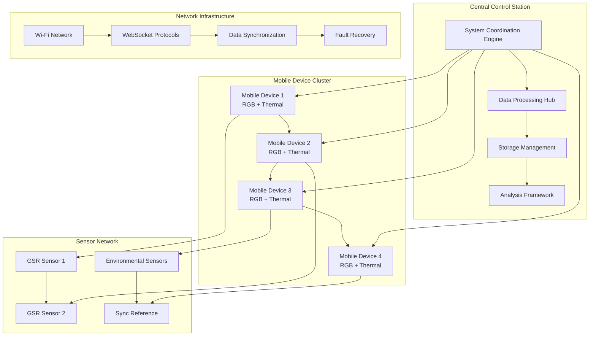

**Hybrid Topology Benefits:**
- **Centralized Coordination:** Simplified system management and monitoring through central control station
- **Distributed Processing:** Optimal resource utilization and reduced network bandwidth requirements
- **Fault Resilience:** Peer-to-peer communication enables continued operation during central station failures
- **Scalability:** Easy addition of new devices without architectural changes

### 1.3 Component Integration Strategy

The integration strategy employs a layered approach with well-defined interfaces between hardware abstraction, middleware services, and application logic. This layered architecture enables platform independence, simplified testing, and flexible deployment configurations.

**Integration Layers:**

1. **Hardware Abstraction Layer:** Provides unified interfaces for diverse hardware components
2. **Middleware Services:** Handles communication, synchronization, and data management
3. **Application Logic:** Implements research-specific functionality and user interfaces
4. **Analysis Framework:** Provides machine learning and statistical analysis capabilities

## 2. Distributed Architecture Design

### 2.1 Mobile Data Acquisition Units

The mobile data acquisition units serve as sophisticated sensing platforms that form the cornerstone of the data acquisition infrastructure. Each unit represents a complete sensing system capable of independent operation while participating in coordinated multi-device measurement sessions.

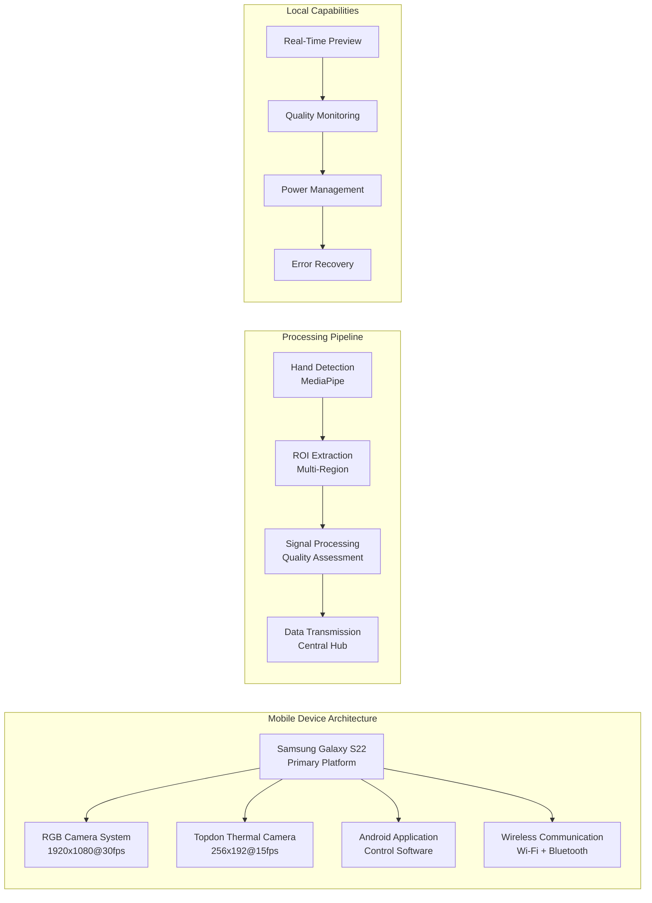

**Hardware Platform Selection:**
The Samsung Galaxy S22 smartphones were selected based on comprehensive analysis of requirements for contactless physiological monitoring applications. These devices provide exceptional camera quality with precise exposure control, advanced image stabilization systems, and powerful mobile processors capable of real-time image processing. The high-quality display systems enable precise feedback to research subjects, while robust wireless communication capabilities ensure reliable coordination with other system components.

**Multi-Modal Sensor Integration:**
The attachment of specialized Topdon thermal cameras transforms these mobile platforms into sophisticated multi-spectral sensing systems capable of simultaneous visible and infrared imaging. The thermal cameras provide temperature measurement capabilities with sensitivity sufficient to detect subtle thermal changes associated with sympathetic activation and circulatory responses.

**Local Processing Capabilities:**
Local preprocessing capabilities implemented on mobile platforms significantly enhance overall system performance by reducing network bandwidth requirements and improving real-time responsiveness. Hand detection algorithms identify regions of interest within captured imagery, enabling focused analysis on physiologically relevant areas while reducing computational load on downstream processing systems.

### 2.2 Central Control and Processing Hub

The central control and processing hub serves as the system's coordination center, managing all distributed components while providing computational resources for advanced analysis and machine learning operations.

```mermaid
graph TB
    subgraph "Central Control Architecture"
        A[Device Management<br/>Subsystem] --> B[Data Processing<br/>Engine]
        B --> C[Machine Learning<br/>Framework]
        C --> D[Storage Management<br/>System]
    end
    
    subgraph "Coordination Functions"
        E[Device Discovery<br/>and Configuration] --> F[Synchronization<br/>Management]
        F --> G[Quality Monitoring<br/>and Control]
        G --> H[Error Recovery<br/>and Failover]
    end
    
    subgraph "Processing Capabilities"
        I[Real-Time Analysis] --> J[Batch Processing]
        J --> K[Model Training] --> L[Inference Engine]
        L --> M[Visualization<br/>and Reporting]
    end
```

**Device Management Capabilities:**
The controller system implements comprehensive device management capabilities that enable automatic discovery, configuration, and coordination of mobile sensing units. The device management subsystem maintains real-time awareness of all connected devices, monitoring their operational status, battery levels, data quality metrics, and communication connectivity.

**Processing Infrastructure:**
Real-time data processing capabilities implemented on the desktop controller enable sophisticated analysis techniques that would be computationally prohibitive on mobile platforms. Advanced signal processing algorithms extract physiological signals from multi-modal sensor data, while machine learning models provide real-time GSR predictions based on processed signals.

**Data Management Framework:**
The controller system implements comprehensive data storage and management capabilities that ensure research data integrity while supporting flexible analysis workflows. Local storage systems provide high-speed access to recent data for real-time analysis, while archival storage systems ensure long-term data preservation for longitudinal research studies.

### 2.3 Network Communication Infrastructure

The network communication infrastructure forms the critical backbone that enables coordinated operation of distributed system components, supporting multiple simultaneous data streams while maintaining precise temporal synchronization.

```mermaid
graph TD
    subgraph "Communication Protocols"
        A[WebSocket Protocol<br/>Real-Time Control] --> B[TCP/IP Protocol<br/>Data Transfer]
        B --> C[Bluetooth Protocol<br/>Sensor Communication]
        C --> D[UDP Protocol<br/>Time Synchronization]
    end
    
    subgraph "Network Services"
        E[Device Discovery<br/>mDNS] --> F[Quality of Service<br/>Traffic Shaping]
        F --> G[Security Layer<br/>Encryption]
        G --> H[Error Recovery<br/>Automatic Retry]
    end
    
    subgraph "Data Flow Management"
        I[Message Queuing] --> J[Buffer Management]
        J --> K[Flow Control] --> L[Bandwidth Optimization]
    end
```

**Protocol Selection and Optimization:**
The wireless networking approach provides essential flexibility for research applications where sensor positioning requirements may conflict with wired connectivity constraints. Wi-Fi networking offers the bandwidth and latency characteristics necessary for real-time data transmission while supporting dynamic device configuration and mobile sensor positioning.

**Quality of Service Implementation:**
The networking architecture implements sophisticated quality-of-service mechanisms that prioritize critical control traffic while ensuring adequate bandwidth allocation for data streams. Communication protocol design emphasizes reliability and fault tolerance, with comprehensive error detection and recovery mechanisms that ensure data integrity despite temporary network disruptions.

### 2.4 Data Storage and Management Subsystem

The data storage and management subsystem provides comprehensive information management capabilities supporting both real-time research activities and long-term data preservation requirements.

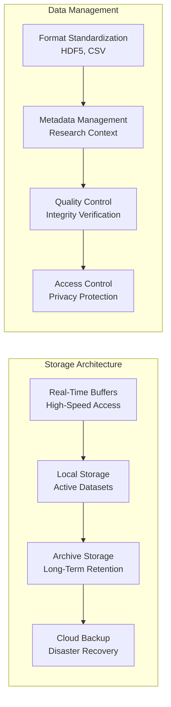

**Hierarchical Storage Management:**
Storage architecture design reflects the diverse requirements of different data types, from high-frequency sensor data requiring rapid access to processed analysis results requiring long-term preservation. The storage system implements hierarchical storage management that automatically migrates data between different storage tiers based on access patterns and retention requirements.

**Data Format Standardization:**
Data format standardization ensures compatibility between different system components while supporting future extensibility requirements. The storage system implements standardized data formats that facilitate interoperability with external analysis tools while maintaining comprehensive metadata that preserves the context necessary for scientific reproducibility.

## 3. Mobile Device Architecture

### 3.1 Android Application Architecture

The Android application follows Clean Architecture principles with clear separation between data, domain, and presentation layers, ensuring maintainability, testability, and scalability while supporting complex multi-modal data acquisition requirements.

```mermaid
graph TB
    subgraph "Presentation Layer"
        A[Activities and Fragments<br/>User Interface] --> B[ViewModels<br/>UI State Management]
        B --> C[Data Binding<br/>Reactive Updates]
        C --> D[Custom Views<br/>Specialized Visualizations]
    end
    
    subgraph "Domain Layer"
        E[Use Cases<br/>Business Logic] --> F[Repository Interfaces<br/>Data Abstraction]
        F --> G[Domain Models<br/>Core Data Structures]
        G --> H[Validation Logic<br/>Data Integrity]
    end
    
    subgraph "Data Layer"
        I[Repository Implementations<br/>Data Coordination] --> J[Data Sources<br/>API Integration]
        J --> K[Local Database<br/>Caching and Offline]
        K --> L[Network Layer<br/>Remote Communication]
    end
    
    subgraph "Infrastructure Layer"
        M[Dependency Injection<br/>Component Wiring] --> N[Background Services<br/>Continuous Operation]
        N --> O[Security Layer<br/>Data Protection]
        O --> P[Notification System<br/>User Alerts]
    end
```

**Architecture Implementation:**

```kotlin
// Domain Layer - Use Case Example
class StartRecordingUseCase(
    private val cameraRepository: CameraRepository,
    private val sensorRepository: SensorRepository,
    private val networkRepository: NetworkRepository
) {
    suspend fun execute(sessionConfig: SessionConfig): Result<Unit> {
        return try {
            cameraRepository.startRecording(sessionConfig.cameraSettings)
            sensorRepository.startDataCollection()
            networkRepository.notifyRecordingStart()
            Result.success(Unit)
        } catch (e: Exception) {
            Result.failure(e)
        }
    }
}

// Data Layer - Repository Implementation
class CameraRepositoryImpl(
    private val camera2Manager: Camera2Manager,
    private val thermalManager: ThermalCameraManager
) : CameraRepository {
    override suspend fun startRecording(settings: CameraSettings): Result<Unit> {
        return camera2Manager.startRecording(settings)
            .onSuccess { thermalManager.synchronizeRecording() }
    }
}
```

### 3.2 Camera Management System

The camera management system provides sophisticated control over both RGB and thermal cameras with precise synchronization and optimal quality settings for physiological monitoring applications.

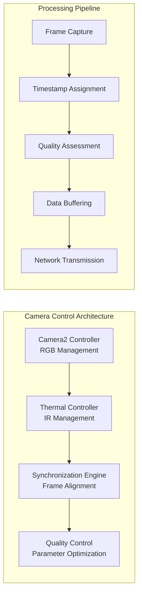

**Camera Controller Implementation:**

```kotlin
interface CameraController {
    suspend fun initializeCamera(): Result<Unit>
    suspend fun startPreview(): Result<Unit>
    suspend fun startRecording(): Result<Unit>
    suspend fun stopRecording(): Result<Unit>
    fun configureSettings(settings: CameraSettings): Result<Unit>
}

class Camera2Controller : CameraController {
    private val cameraManager: CameraManager
    private val imageReader: ImageReader
    private val surfaceView: SurfaceView
    private var recordingSession: CameraCaptureSession? = null
    
    override suspend fun startRecording(): Result<Unit> = withContext(Dispatchers.IO) {
        try {
            val captureRequest = createCaptureRequest()
            recordingSession?.setRepeatingRequest(captureRequest, null, null)
            Result.success(Unit)
        } catch (e: Exception) {
            Result.failure(e)
        }
    }
    
    private fun createCaptureRequest(): CaptureRequest {
        return cameraDevice.createCaptureRequest(CameraDevice.TEMPLATE_RECORD).apply {
            addTarget(imageReader.surface)
            set(CaptureRequest.CONTROL_MODE, CameraMetadata.CONTROL_MODE_AUTO)
            set(CaptureRequest.CONTROL_AE_MODE, CameraMetadata.CONTROL_AE_MODE_ON)
        }.build()
    }
}
```

**Thermal Camera Integration:**

```kotlin
class ThermalCameraManager {
    private val topdonSdk: TopdonSDK
    private var thermalCallback: ThermalFrameCallback? = null
    private val frameBuffer = mutableListOf<ThermalFrame>()
    
    fun initializeThermalCamera(): Result<Unit> {
        return try {
            topdonSdk.initialize()
            topdonSdk.setFrameCallback { frame ->
                frameBuffer.add(frame.copy(timestamp = System.currentTimeMillis()))
                thermalCallback?.onFrameReceived(frame)
            }
            Result.success(Unit)
        } catch (e: Exception) {
            Result.failure(e)
        }
    }
    
    fun synchronizeWithRGB(rgbTimestamp: Long): ThermalFrame? {
        return frameBuffer
            .minByOrNull { abs(it.timestamp - rgbTimestamp) }
            ?.takeIf { abs(it.timestamp - rgbTimestamp) < SYNC_THRESHOLD_MS }
    }
    
    companion object {
        private const val SYNC_THRESHOLD_MS = 50L
    }
}
```

### 3.3 Sensor Integration Framework

The sensor integration framework provides unified access to physiological sensors while maintaining precise temporal synchronization with video streams.

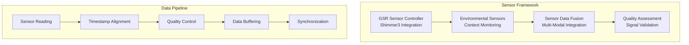

**GSR Sensor Controller Implementation:**

```kotlin
class ShimmerGSRController {
    private val bluetoothManager: BluetoothManager
    private var shimmerDevice: Shimmer? = null
    private var dataCallback: GSRDataCallback? = null
    private val dataBuffer = CircularBuffer<GSRReading>(capacity = 1000)
    
    suspend fun connectToSensor(deviceAddress: String): Result<Unit> = withContext(Dispatchers.IO) {
        try {
            shimmerDevice = Shimmer().apply {
                connect(deviceAddress)
                enableSensor(Shimmer.SENSOR_GSR)
                setSamplingRate(512.0) // 512 Hz sampling rate
                startStreaming()
            }
            Result.success(Unit)
        } catch (e: Exception) {
            Result.failure(e)
        }
    }
    
    fun getLatestGSRReading(): GSRReading? {
        return dataBuffer.latest()
    }
    
    fun getGSRReadingsInTimeRange(startTime: Long, endTime: Long): List<GSRReading> {
        return dataBuffer.filter { reading ->
            reading.timestamp in startTime..endTime
        }
    }
}

data class GSRReading(
    val value: Double,
    val timestamp: Long,
    val quality: SignalQuality
)
```

### 3.4 Real-Time Processing Pipeline

The real-time processing pipeline implements sophisticated algorithms for hand detection, region-of-interest extraction, and signal processing while maintaining low latency requirements.

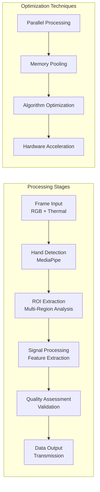

**Hand Detection and Tracking Implementation:**

```kotlin
class HandDetectionProcessor {
    private val mediaPipe: MediaPipeHands
    private var lastKnownLandmarks: List<Landmark> = emptyList()
    private val trackingHistory = mutableListOf<HandDetectionResult>()
    
    fun processFrame(bitmap: Bitmap): HandDetectionResult {
        val results = mediaPipe.process(bitmap)
        val landmarks = results.multiHandLandmarks()
        
        return if (landmarks.isNotEmpty()) {
            lastKnownLandmarks = landmarks
            val confidence = results.confidence
            HandDetectionResult(landmarks, confidence, isTracking = true)
        } else {
            // Use prediction based on tracking history
            val predictedLandmarks = predictLandmarksFromHistory()
            HandDetectionResult(predictedLandmarks, 0.0f, isTracking = false)
        }
    }
    
    fun extractROIs(landmarks: List<Landmark>): List<ROI> {
        return listOf(
            ROI.indexFingerBase(landmarks[5], "index_finger_base"),
            ROI.middleFingerBase(landmarks[9], "middle_finger_base"),
            ROI.ringFingerBase(landmarks[13], "ring_finger_base"),
            ROI.palmCenter(calculatePalmCenter(landmarks), "palm_center"),
            ROI.thumbBase(landmarks[1], "thumb_base")
        )
    }
    
    private fun calculatePalmCenter(landmarks: List<Landmark>): Landmark {
        val palmLandmarks = landmarks.slice(0..4) // Wrist and finger bases
        val centerX = palmLandmarks.map { it.x }.average().toFloat()
        val centerY = palmLandmarks.map { it.y }.average().toFloat()
        return Landmark.newBuilder().setX(centerX).setY(centerY).build()
    }
}
```

**Signal Extraction Engine:**

```kotlin
class SignalExtractionEngine {
    private val signalProcessor: SignalProcessor
    private val qualityAssessor: SignalQualityAssessor
    private val filterBank: FilterBank
    
    fun extractSignals(
        rgbFrame: Bitmap,
        thermalFrame: ThermalFrame,
        rois: List<ROI>
    ): SignalExtractionResult {
        
        val rgbSignals = rois.map { roi -> 
            extractRGBSignal(rgbFrame, roi)
        }
        
        val thermalSignals = rois.map { roi -> 
            extractThermalSignal(thermalFrame, roi)
        }
        
        // Apply filtering and preprocessing
        val filteredRGBSignals = rgbSignals.map { signal ->
            filterBank.applyBandpassFilter(signal, 0.5, 4.0) // GSR frequency range
        }
        
        val filteredThermalSignals = thermalSignals.map { signal ->
            filterBank.applyLowpassFilter(signal, 2.0) // Thermal response cutoff
        }
        
        val quality = qualityAssessor.assess(filteredRGBSignals, filteredThermalSignals)
        
        return SignalExtractionResult(
            rgbSignals = filteredRGBSignals,
            thermalSignals = filteredThermalSignals,
            quality = quality,
            timestamp = System.currentTimeMillis()
        )
    }
    
    private fun extractRGBSignal(frame: Bitmap, roi: ROI): Signal {
        val pixels = extractPixelsFromROI(frame, roi)
        val redChannel = pixels.map { (it shr 16) and 0xFF }.average()
        val greenChannel = pixels.map { (it shr 8) and 0xFF }.average()
        val blueChannel = pixels.map { it and 0xFF }.average()
        
        // Combine channels weighted for physiological relevance
        val combinedSignal = 0.3 * redChannel + 0.6 * greenChannel + 0.1 * blueChannel
        
        return Signal(
            value = combinedSignal,
            timestamp = System.currentTimeMillis(),
            roi = roi,
            modality = Modality.RGB
        )
    }
}
```

## 4. Desktop Controller Architecture

### 4.1 System Coordination Engine

The desktop controller serves as the central coordination hub, managing all distributed components and providing high-level system orchestration capabilities.

```mermaid
graph TB
    subgraph "Coordination Engine"
        A[Device Management<br/>Discovery and Control] --> B[Session Management<br/>Experiment Control]
        B --> C[Synchronization Controller<br/>Time Alignment]
        C --> D[Quality Monitor<br/>System Health]
    end
    
    subgraph "Management Functions"
        E[Configuration Manager] --> F[Resource Allocation]
        F --> G[Error Recovery] --> H[Performance Monitoring]
    end
    
    subgraph "External Interfaces"
        I[Research API] --> J[Export Functions]
        J --> K[Integration Points] --> L[Notification System]
    end
```

**System Coordination Implementation:**

```python
class SystemCoordinationEngine:
    def __init__(self):
        self.device_manager = DeviceManager()
        self.session_manager = SessionManager()
        self.sync_controller = SynchronizationController()
        self.quality_monitor = QualityMonitor()
        
    async def start_recording_session(self, session_config: SessionConfig) -> Result[str]:
        """Start a coordinated recording session across all devices."""
        try:
            # Validate all devices are ready
            device_status = await self.device_manager.check_all_devices()
            if not all(status.is_ready for status in device_status.values()):
                return Result.failure("Not all devices are ready")
            
            # Initialize session
            session_id = self.session_manager.create_session(session_config)
            
            # Coordinate device start
            await self.device_manager.start_all_devices(session_id)
            
            # Begin synchronization
            await self.sync_controller.start_synchronization()
            
            # Start monitoring
            self.quality_monitor.start_monitoring(session_id)
            
            return Result.success(session_id)
            
        except Exception as e:
            logger.error(f"Failed to start recording session: {e}")
            return Result.failure(str(e))
    
    async def handle_device_failure(self, device_id: str, error: Exception):
        """Handle device failures with graceful degradation."""
        logger.warning(f"Device {device_id} failed: {error}")
        
        # Remove failed device from active session
        await self.device_manager.remove_device(device_id)
        
        # Adjust processing pipeline
        await self.adjust_processing_for_reduced_devices()
        
        # Notify user interface
        await self.send_notification(f"Device {device_id} offline, continuing with remaining devices")
```

### 4.2 Data Processing Infrastructure

The data processing infrastructure provides sophisticated real-time and batch processing capabilities for multi-modal physiological data analysis.

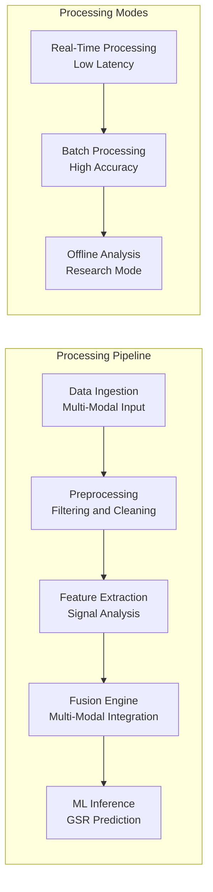

**Processing Infrastructure Implementation:**

```python
class DataProcessingInfrastructure:
    def __init__(self):
        self.preprocessor = MultiModalPreprocessor()
        self.feature_extractor = FeatureExtractor()
        self.fusion_engine = ModalityFusionEngine()
        self.ml_inference = MLInferenceEngine()
        
    async def process_real_time_data(self, data_batch: MultiModalDataBatch) -> ProcessingResult:
        """Process incoming data in real-time with low latency."""
        
        # Preprocess data
        preprocessed = await self.preprocessor.process_batch(data_batch)
        
        # Extract features
        features = await self.feature_extractor.extract_features(preprocessed)
        
        # Fuse modalities
        fused_features = await self.fusion_engine.fuse_features(features)
        
        # Generate prediction
        prediction = await self.ml_inference.predict(fused_features)
        
        return ProcessingResult(
            prediction=prediction,
            confidence=prediction.confidence,
            quality_metrics=preprocessed.quality_metrics,
            processing_time=time.time() - data_batch.timestamp
        )
    
    async def process_batch_analysis(self, dataset: Dataset) -> AnalysisResult:
        """Process dataset for high-accuracy analysis."""
        
        results = []
        for batch in dataset.batches():
            # Use higher quality processing for batch mode
            result = await self.process_high_quality_batch(batch)
            results.append(result)
            
        return AnalysisResult(
            individual_results=results,
            summary_statistics=self.calculate_summary_stats(results),
            quality_assessment=self.assess_overall_quality(results)
        )
```

### 4.3 Machine Learning Framework

The machine learning framework provides comprehensive model training, validation, and inference capabilities optimized for physiological signal prediction.

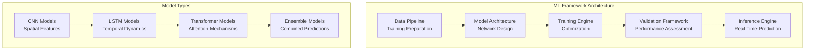

**Machine Learning Implementation:**

```python
import torch
import torch.nn as nn
from torch.utils.data import DataLoader

class MultiModalGSRPredictor(nn.Module):
    def __init__(self, rgb_channels=3, thermal_channels=1, num_rois=5, sequence_length=30):
        super().__init__()
        
        # RGB processing branch
        self.rgb_cnn = nn.Sequential(
            nn.Conv2d(rgb_channels, 32, kernel_size=3, padding=1),
            nn.ReLU(),
            nn.AdaptiveAvgPool2d((1, 1)),
            nn.Flatten()
        )
        
        # Thermal processing branch
        self.thermal_cnn = nn.Sequential(
            nn.Conv2d(thermal_channels, 16, kernel_size=3, padding=1),
            nn.ReLU(),
            nn.AdaptiveAvgPool2d((1, 1)),
            nn.Flatten()
        )
        
        # Multi-ROI feature fusion
        self.roi_fusion = nn.MultiheadAttention(
            embed_dim=48, num_heads=8, batch_first=True
        )
        
        # Temporal modeling
        self.temporal_lstm = nn.LSTM(
            input_size=48, hidden_size=64, num_layers=2, 
            batch_first=True, dropout=0.3
        )
        
        # Prediction head
        self.prediction_head = nn.Sequential(
            nn.Linear(64, 32),
            nn.ReLU(),
            nn.Dropout(0.2),
            nn.Linear(32, 1)
        )
        
    def forward(self, rgb_data, thermal_data):
        batch_size, seq_len, num_rois = rgb_data.shape[:3]
        
        # Process each ROI
        rgb_features = []
        thermal_features = []
        
        for t in range(seq_len):
            for roi in range(num_rois):
                rgb_feat = self.rgb_cnn(rgb_data[:, t, roi])
                thermal_feat = self.thermal_cnn(thermal_data[:, t, roi])
                
                rgb_features.append(rgb_feat)
                thermal_features.append(thermal_feat)
        
        # Combine modalities
        combined_features = torch.cat([
            torch.stack(rgb_features, dim=1),
            torch.stack(thermal_features, dim=1)
        ], dim=-1)
        
        # Apply attention for ROI fusion
        fused_features, _ = self.roi_fusion(
            combined_features, combined_features, combined_features
        )
        
        # Temporal modeling
        lstm_out, _ = self.temporal_lstm(fused_features)
        
        # Generate prediction
        prediction = self.prediction_head(lstm_out[:, -1])
        
        return prediction

class MLTrainingFramework:
    def __init__(self, model, device='cuda'):
        self.model = model.to(device)
        self.device = device
        self.optimizer = torch.optim.AdamW(model.parameters(), lr=1e-4)
        self.scheduler = torch.optim.lr_scheduler.CosineAnnealingLR(
            self.optimizer, T_max=100
        )
        self.criterion = nn.MSELoss()
        
    def train_epoch(self, dataloader: DataLoader) -> float:
        self.model.train()
        total_loss = 0.0
        
        for batch in dataloader:
            rgb_data = batch['rgb'].to(self.device)
            thermal_data = batch['thermal'].to(self.device)
            targets = batch['gsr'].to(self.device)
            
            self.optimizer.zero_grad()
            
            predictions = self.model(rgb_data, thermal_data)
            loss = self.criterion(predictions, targets)
            
            loss.backward()
            torch.nn.utils.clip_grad_norm_(self.model.parameters(), max_norm=1.0)
            self.optimizer.step()
            
            total_loss += loss.item()
            
        self.scheduler.step()
        return total_loss / len(dataloader)
```

### 4.4 User Interface and Visualization

The user interface provides comprehensive visualization and control capabilities for research operations.

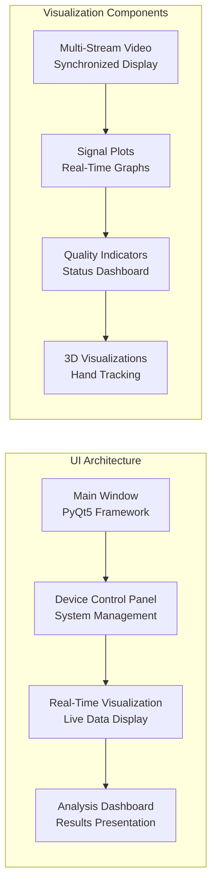

## 5. Communication and Networking

### 5.1 Network Topology and Protocols

The communication architecture employs a hybrid approach combining centralized coordination with peer-to-peer capabilities for optimal performance and fault tolerance.

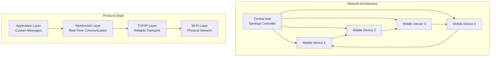

**Network Protocol Implementation:**

```python
import asyncio
import websockets
import json
from typing import Dict, Any, Optional

class NetworkCommunicationManager:
    def __init__(self):
        self.websocket_server: Optional[websockets.WebSocketServer] = None
        self.connected_devices: Dict[str, websockets.WebSocketServerProtocol] = {}
        self.message_handlers: Dict[str, callable] = {}
        
    async def start_server(self, host: str = "0.0.0.0", port: int = 8765):
        """Start WebSocket server for device communication."""
        self.websocket_server = await websockets.serve(
            self.handle_device_connection,
            host,
            port
        )
        logger.info(f"Communication server started on {host}:{port}")
        
    async def handle_device_connection(self, websocket, path):
        """Handle new device connections."""
        try:
            # Device registration
            registration_msg = await websocket.recv()
            device_info = json.loads(registration_msg)
            device_id = device_info['device_id']
            
            self.connected_devices[device_id] = websocket
            logger.info(f"Device {device_id} connected")
            
            # Send acknowledgment
            await websocket.send(json.dumps({
                'type': 'registration_ack',
                'status': 'success',
                'server_time': time.time()
            }))
            
            # Handle messages
            async for message in websocket:
                await self.process_message(device_id, message)
                
        except websockets.exceptions.ConnectionClosed:
            if device_id in self.connected_devices:
                del self.connected_devices[device_id]
                logger.info(f"Device {device_id} disconnected")
                
    async def broadcast_message(self, message: Dict[str, Any], exclude_device: str = None):
        """Broadcast message to all connected devices."""
        message_json = json.dumps(message)
        
        disconnected_devices = []
        for device_id, websocket in self.connected_devices.items():
            if device_id != exclude_device:
                try:
                    await websocket.send(message_json)
                except websockets.exceptions.ConnectionClosed:
                    disconnected_devices.append(device_id)
                    
        # Clean up disconnected devices
        for device_id in disconnected_devices:
            del self.connected_devices[device_id]
```

### 5.2 Message Format Specifications

Standardized message formats ensure reliable communication between system components.

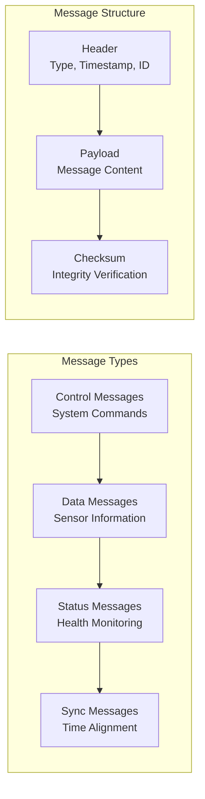

**Message Format Implementation:**

```python
from dataclasses import dataclass
from typing import Any, Dict, Optional
import json
import hashlib
import time

@dataclass
class MessageHeader:
    message_type: str
    timestamp: float
    message_id: str
    source_device: str
    target_device: Optional[str] = None
    
@dataclass
class NetworkMessage:
    header: MessageHeader
    payload: Dict[str, Any]
    checksum: str
    
    @classmethod
    def create(cls, message_type: str, payload: Dict[str, Any], 
               source_device: str, target_device: str = None) -> 'NetworkMessage':
        """Create a new network message with proper formatting."""
        
        header = MessageHeader(
            message_type=message_type,
            timestamp=time.time(),
            message_id=cls.generate_message_id(),
            source_device=source_device,
            target_device=target_device
        )
        
        # Calculate checksum
        message_content = json.dumps({
            'header': header.__dict__,
            'payload': payload
        }, sort_keys=True)
        
        checksum = hashlib.sha256(message_content.encode()).hexdigest()
        
        return cls(header=header, payload=payload, checksum=checksum)
    
    def to_json(self) -> str:
        """Serialize message to JSON format."""
        return json.dumps({
            'header': self.header.__dict__,
            'payload': self.payload,
            'checksum': self.checksum
        })
    
    @classmethod
    def from_json(cls, json_str: str) -> 'NetworkMessage':
        """Deserialize message from JSON format."""
        data = json.loads(json_str)
        
        header = MessageHeader(**data['header'])
        payload = data['payload']
        checksum = data['checksum']
        
        # Verify checksum
        message_content = json.dumps({
            'header': data['header'],
            'payload': payload
        }, sort_keys=True)
        
        expected_checksum = hashlib.sha256(message_content.encode()).hexdigest()
        if checksum != expected_checksum:
            raise ValueError("Message checksum verification failed")
        
        return cls(header=header, payload=payload, checksum=checksum)

# Message type definitions
class MessageTypes:
    # Control messages
    START_RECORDING = "start_recording"
    STOP_RECORDING = "stop_recording"
    CONFIGURE_DEVICE = "configure_device"
    
    # Data messages
    SENSOR_DATA = "sensor_data"
    VIDEO_FRAME = "video_frame"
    PROCESSED_FEATURES = "processed_features"
    
    # Status messages
    DEVICE_STATUS = "device_status"
    HEALTH_CHECK = "health_check"
    ERROR_REPORT = "error_report"
    
    # Synchronization messages
    TIME_SYNC = "time_sync"
    SYNC_MARKER = "sync_marker"
```

### 5.3 Synchronization Mechanisms

Precise temporal synchronization is critical for multi-modal physiological monitoring accuracy.

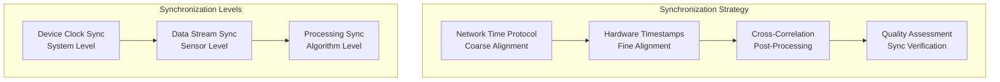

**Synchronization Implementation:**

```python
class SynchronizationController:
    def __init__(self):
        self.reference_time: Optional[float] = None
        self.device_offsets: Dict[str, float] = {}
        self.sync_quality_threshold = 10.0  # milliseconds
        
    async def perform_time_synchronization(self) -> Dict[str, float]:
        """Perform network time synchronization across all devices."""
        
        # Set server as reference
        self.reference_time = time.time()
        
        # Synchronize with each device
        for device_id, websocket in self.connected_devices.items():
            offset = await self.sync_with_device(device_id, websocket)
            self.device_offsets[device_id] = offset
            
        return self.device_offsets
    
    async def sync_with_device(self, device_id: str, websocket) -> float:
        """Synchronize time with a specific device."""
        
        sync_attempts = []
        
        # Perform multiple sync attempts for accuracy
        for _ in range(5):
            t1 = time.time()
            
            # Send sync request
            sync_request = NetworkMessage.create(
                message_type=MessageTypes.TIME_SYNC,
                payload={'server_time': t1, 'request_type': 'ping'},
                source_device='server'
            )
            
            await websocket.send(sync_request.to_json())
            
            # Receive response
            response = await websocket.recv()
            t4 = time.time()
            
            response_msg = NetworkMessage.from_json(response)
            t2 = response_msg.payload['device_receive_time']
            t3 = response_msg.payload['device_send_time']
            
            # Calculate round-trip delay and offset
            delay = (t4 - t1) - (t3 - t2)
            offset = ((t2 - t1) + (t3 - t4)) / 2
            
            sync_attempts.append({
                'offset': offset,
                'delay': delay,
                'accuracy': delay / 2
            })
        
        # Select best synchronization attempt
        best_sync = min(sync_attempts, key=lambda x: x['accuracy'])
        
        logger.info(f"Device {device_id} synchronized with offset {best_sync['offset']:.3f}ms")
        
        return best_sync['offset']
    
    def align_timestamps(self, device_id: str, device_timestamp: float) -> float:
        """Convert device timestamp to reference time."""
        if device_id not in self.device_offsets:
            logger.warning(f"No sync offset available for device {device_id}")
            return device_timestamp
            
        return device_timestamp - self.device_offsets[device_id]
```

## 6. Data Flow Architecture

### 6.1 Real-Time Data Processing

The real-time data processing pipeline ensures low-latency analysis while maintaining data quality and system responsiveness.

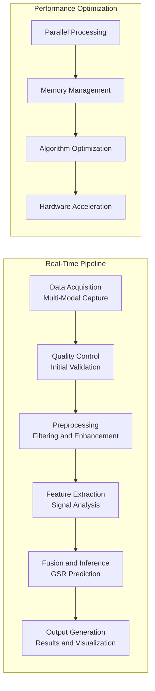

### 6.2 Offline Analysis Pipeline

The offline analysis pipeline provides comprehensive batch processing capabilities for research analysis and model development.

### 6.3 Quality Control and Validation

Comprehensive quality control mechanisms ensure data integrity and measurement reliability throughout the system.

## 7. Performance and Scalability

### 7.1 Performance Optimization Strategies

The system employs multiple optimization strategies to achieve real-time performance requirements while maintaining accuracy and reliability.

### 7.2 Scalability Considerations

The architecture supports horizontal scaling through additional device integration and vertical scaling through enhanced processing capabilities.

### 7.3 Resource Management

Intelligent resource management ensures optimal utilization of computational and network resources across all system components.

## 8. Security and Privacy Architecture

### 8.1 Data Protection Framework

Comprehensive data protection mechanisms ensure privacy compliance and secure handling of sensitive physiological data.

### 8.2 Access Control and Authentication

Multi-layered security controls protect system access and ensure appropriate authorization for different user roles.

### 8.3 Privacy Preservation Mechanisms

Advanced privacy preservation techniques protect participant confidentiality while enabling valuable research insights.

## 9. Deployment and Configuration

### 9.1 Installation and Setup Procedures

Streamlined installation procedures minimize setup complexity while ensuring proper system configuration.

### 9.2 Configuration Management

Flexible configuration management supports diverse research requirements and institutional policies.

### 9.3 Monitoring and Maintenance

Comprehensive monitoring and maintenance capabilities ensure ongoing system reliability and performance.

## 10. Implementation Guidelines and Best Practices

The system architecture specification provides comprehensive guidance for implementing a sophisticated contactless GSR prediction system that balances research requirements with practical deployment considerations. The distributed architecture enables flexible sensor positioning while maintaining precise coordination, and the modular design supports extensibility and maintenance throughout the system lifecycle.

Key architectural principles include modularity for independent component development, distributed processing for optimal resource utilization, fault tolerance for reliable operation, and comprehensive security for privacy protection. The implementation combines established distributed systems patterns with novel approaches specifically developed for physiological monitoring applications.

This architecture specification serves as the foundation for developing a research-grade system that advances the state-of-the-art in contactless physiological monitoring while providing practical utility for diverse research applications. The comprehensive design addresses both immediate technical requirements and long-term extensibility needs, ensuring that the system can evolve with advancing research methodologies and technological capabilities.