# Technology Stack Rationale and Selection Framework

## Table of Contents

1. [Technology Selection Methodology](#1-technology-selection-methodology)
   - 1.1 [Evaluation Framework and Criteria](#11-evaluation-framework-and-criteria)
   - 1.2 [Decision Analysis Process](#12-decision-analysis-process)
   - 1.3 [Risk Assessment and Mitigation](#13-risk-assessment-and-mitigation)

2. [Mobile Platform Architecture](#2-mobile-platform-architecture)
   - 2.1 [Platform Comparison and Selection](#21-platform-comparison-and-selection)
   - 2.2 [Android Ecosystem Advantages](#22-android-ecosystem-advantages)
   - 2.3 [Hardware Platform Specification](#23-hardware-platform-specification)

3. [Desktop Development Framework](#3-desktop-development-framework)
   - 3.1 [Programming Language Selection](#31-programming-language-selection)
   - 3.2 [GUI Framework Evaluation](#32-gui-framework-evaluation)
   - 3.3 [Cross-Platform Compatibility](#33-cross-platform-compatibility)

4. [Machine Learning Technology Stack](#4-machine-learning-technology-stack)
   - 4.1 [Framework Comparison and Selection](#41-framework-comparison-and-selection)
   - 4.2 [Mobile Inference Optimization](#42-mobile-inference-optimization)
   - 4.3 [Training Infrastructure](#43-training-infrastructure)

5. [Communication and Networking](#5-communication-and-networking)
   - 5.1 [Protocol Selection and Design](#51-protocol-selection-and-design)
   - 5.2 [Network Architecture](#52-network-architecture)
   - 5.3 [Security and Authentication](#53-security-and-authentication)

6. [Data Management and Storage](#6-data-management-and-storage)
   - 6.1 [Database Technology Selection](#61-database-technology-selection)
   - 6.2 [File Format Standards](#62-file-format-standards)
   - 6.3 [Backup and Archival Strategy](#63-backup-and-archival-strategy)

7. [Hardware Integration Specifications](#7-hardware-integration-specifications)
   - 7.1 [Camera System Requirements](#71-camera-system-requirements)
   - 7.2 [Sensor Integration Framework](#72-sensor-integration-framework)
   - 7.3 [External Device Compatibility](#73-external-device-compatibility)

8. [Development Tools and Environment](#8-development-tools-and-environment)
   - 8.1 [Integrated Development Environments](#81-integrated-development-environments)
   - 8.2 [Testing and Quality Assurance](#82-testing-and-quality-assurance)
   - 8.3 [Build and Deployment Pipeline](#83-build-and-deployment-pipeline)

9. [Performance and Optimization](#9-performance-and-optimization)
   - 9.1 [Real-Time Processing Requirements](#91-real-time-processing-requirements)
   - 9.2 [Resource Management Strategies](#92-resource-management-strategies)
   - 9.3 [Scalability Considerations](#93-scalability-considerations)

10. [Future Technology Roadmap](#10-future-technology-roadmap)
    - 10.1 [Technology Evolution Planning](#101-technology-evolution-planning)
    - 10.2 [Emerging Technology Integration](#102-emerging-technology-integration)
    - 10.3 [Long-Term Maintenance Strategy](#103-long-term-maintenance-strategy)

## 1. Technology Selection Methodology

### 1.1 Evaluation Framework and Criteria

The comprehensive selection of technologies for the contactless GSR prediction system involved an exhaustive, systematic evaluation process that carefully considered the complex technical requirements, ambitious research objectives, practical implementation constraints, and critical long-term maintainability requirements inherent in developing a sophisticated research platform capable of operating reliably across diverse environments while providing the precision and flexibility demanded by rigorous physiological research applications.

**Technical Performance and Capability Assessment:**
The foremost consideration in technology selection involves the fundamental capability of each technology to meet the stringent system requirements for real-time processing performance, measurement accuracy, temporal precision, and operational reliability. This assessment encompasses both quantitative performance metrics such as processing throughput, latency characteristics, and resource utilization, as well as qualitative factors such as algorithm sophistication, feature completeness, and adaptation to specialized research requirements.

Performance evaluation extends beyond simple benchmark comparisons to include comprehensive analysis of performance characteristics under the diverse operational conditions likely to be encountered in research environments. This includes assessment of performance degradation under resource constraints, behavior during extended operation periods, and adaptability to varying computational loads and environmental conditions.

**Development Ecosystem and Community Support:**
The availability of comprehensive documentation, active community support, robust development tools, and extensive third-party resources significantly impacts both initial development efficiency and long-term maintainability of the research platform. This evaluation criterion recognizes that sophisticated research applications require ongoing development, modification, and enhancement throughout their operational lifecycle.

The ecosystem evaluation encompasses the quality and completeness of official documentation, including API references, implementation guides, and best practice recommendations that enable efficient development of complex applications. The assessment also considers the availability of community-contributed resources such as tutorials, code examples, and troubleshooting guides that can accelerate development and problem resolution.

### 1.2 Decision Analysis Process

The technology selection methodology employed a multi-criteria decision analysis framework that systematically evaluated each potential technology choice against carefully defined performance metrics, implementation requirements, and research objectives. This analytical approach ensures that technology decisions are based on objective evaluation criteria rather than subjective preferences or marketing considerations.

**Multi-Criteria Evaluation Matrix:**
Each technology alternative was evaluated against a comprehensive set of criteria using a standardized scoring methodology that enables objective comparison across different technology domains. The evaluation matrix includes both quantitative metrics that can be measured objectively and qualitative assessments based on expert evaluation and prototype testing.

**Weighted Decision Framework:**
Different evaluation criteria were assigned weights based on their relative importance to the overall project success. Technical performance and functionality received the highest weighting, reflecting their critical importance for research applications, while cost and risk factors received moderate weighting to ensure practical implementation feasibility.

### 1.3 Risk Assessment and Mitigation

Technology selection decisions incorporated comprehensive risk assessment to identify potential challenges and develop mitigation strategies for each chosen technology.

**Risk Categories:**
- **Technical Risk:** Performance limitations, compatibility issues, feature gaps
- **Vendor Risk:** Technology abandonment, licensing changes, commercial viability
- **Integration Risk:** Compatibility problems, complexity overhead, maintenance burden
- **Evolution Risk:** Obsolescence, migration requirements, future incompatibilities

## 2. Mobile Platform Architecture

### 2.1 Platform Comparison and Selection

The selection of the mobile platform represents one of the most fundamental and consequential architectural decisions affecting the entire system design, as it determines the available hardware capabilities, development approaches, deployment strategies, and long-term evolution possibilities for the core data acquisition components.

**Android Platform Advantages:**

**Hardware Diversity and Ecosystem Flexibility:**
The Android ecosystem provides access to an exceptionally diverse range of hardware platforms with varying camera capabilities, processing power characteristics, sensor configurations, and price points that enable optimization for specific research requirements and budget constraints. This hardware diversity proves particularly valuable for research applications where different experimental configurations may require different performance characteristics or specialized hardware features.

The open nature of the Android hardware ecosystem enables access to specialized devices designed for specific applications, including rugged devices optimized for field research, devices with enhanced camera capabilities optimized for image processing applications, and devices with extended battery life suitable for long-duration measurement sessions.

**USB-C OTG Support and External Device Integration:**
Widespread support for USB On-The-Go (OTG) functionality across the Android ecosystem enables essential connections to external sensor devices, including the thermal cameras that represent a critical component of the multi-modal sensing approach. The USB-C OTG support enables not only data communication with external devices but also power delivery capabilities that can support the operation of external sensors without requiring separate power sources.

**Camera2 API and Low-Level Hardware Access:**
The Android Camera2 API provides sophisticated low-level camera access that enables precise timing control, manual exposure settings, and advanced image quality control capabilities that are essential for extracting subtle physiological signals from captured imagery. This low-level access proves critical for research applications that require precise control over image acquisition parameters.

### 2.2 Android Ecosystem Advantages

The Android platform was selected based on several critical technical requirements that could not be adequately addressed by alternative mobile platforms:

**Open Source Foundation and System Access:**
The Android Open Source Project (AOSP) foundation provides unprecedented access to the underlying operating system implementation, enabling deep system integration, customization, and optimization that would be impossible with closed-source platform alternatives. This open source access proves essential for research applications that require precise control over timing, hardware access, and system behavior.

**Research Deployment Flexibility:**
The research nature of the application requires the ability to deploy experimental versions, conduct rapid prototyping, and implement specialized features that may not be appropriate for commercial distribution. The Android platform's support for direct APK installation and flexible distribution mechanisms enables this research flexibility.

### 2.3 Hardware Platform Specification

**Samsung Galaxy S22 Selection Rationale:**

The Samsung Galaxy S22 smartphones were selected based on comprehensive analysis of requirements for contactless physiological monitoring applications:

**Camera Specifications:**
- **Main Camera:** 50MP with f/1.8 aperture and optical image stabilization
- **Video Recording:** 4K@60fps with advanced video stabilization
- **Manual Controls:** Full Camera2 API support for precision control
- **Low-Light Performance:** Enhanced sensor technology for varying lighting conditions

**Processing Power:**
- **Chipset:** Snapdragon 8 Gen 1 with dedicated AI acceleration units
- **CPU:** Octa-core with high-performance and efficiency cores
- **GPU:** Adreno 730 for graphics and compute acceleration
- **AI Processing:** Dedicated neural processing unit for machine learning

**Memory and Storage:**
- **RAM:** 8GB for smooth multi-tasking and data buffering
- **Storage:** 128GB+ internal storage with high-speed UFS 3.1
- **Expansion:** MicroSD support for additional storage capacity

**Connectivity Features:**
- **USB-C 3.2:** High-speed data transfer and power delivery
- **Wi-Fi 6:** Latest wireless standard for improved bandwidth and latency
- **Bluetooth 5.2:** Enhanced connectivity for sensor integration
- **5G Support:** Future-ready cellular connectivity

## 3. Desktop Development Framework

### 3.1 Programming Language Selection

The desktop component requires a programming language that provides excellent performance for real-time data processing, comprehensive scientific computing libraries, and robust cross-platform compatibility.

**Python Selection Rationale:**

**Comprehensive Scientific Computing Ecosystem:**
Python provides an unmatched ecosystem of scientific computing libraries including NumPy for numerical operations, SciPy for advanced algorithms, OpenCV for computer vision, and scikit-learn for machine learning. This comprehensive library ecosystem eliminates the need to implement complex algorithms from scratch and provides well-tested, optimized implementations of essential scientific computing functions.

**Rapid Development and Prototyping:**
The interpreted nature of Python and its concise syntax enable rapid development and iterative refinement of complex research applications. This development speed proves particularly valuable for research applications where requirements may evolve based on experimental results and where rapid prototyping enables quick validation of new approaches.

**Machine Learning Integration:**
Python's position as the de facto standard for machine learning development provides seamless integration with TensorFlow, PyTorch, and other machine learning frameworks. This integration ensures that model development, training, and deployment can occur within a unified development environment.

### 3.2 GUI Framework Evaluation

The graphical user interface framework must provide rich visualization capabilities, cross-platform compatibility, and integration with scientific computing libraries.

**PyQt5 Selection Rationale:**

**Rich Widget Set and Visualization Capabilities:**
PyQt5 provides a comprehensive set of widgets specifically designed for scientific and engineering applications, including sophisticated plotting capabilities through matplotlib integration, real-time data visualization, and advanced layout management that supports complex research interfaces.

**Cross-Platform Consistency:**
PyQt5 ensures consistent behavior and appearance across Windows, macOS, and Linux platforms, enabling deployment in diverse research environments without requiring platform-specific modifications or testing.

**Performance and Responsiveness:**
The underlying Qt framework provides native performance with efficient event handling and rendering capabilities that ensure responsive user interfaces even during intensive real-time data processing operations.

### 3.3 Cross-Platform Compatibility

The desktop application must operate reliably across different operating systems commonly found in research environments.

**Platform Support Matrix:**
- **Windows 10/11:** Primary target platform for research environments
- **macOS 10.15+:** Compatible through PyQt5 cross-platform support
- **Linux (Ubuntu/CentOS):** Compatible with major distributions
- **Docker Containers:** Portable deployment option for cloud environments

## 4. Machine Learning Technology Stack

### 4.1 Framework Comparison and Selection

The machine learning framework selection balances training capabilities, mobile deployment requirements, and performance optimization needs.

**TensorFlow/TensorFlow Lite Selection:**

**Mobile Optimization and Deployment:**
TensorFlow Lite provides optimized inference capabilities specifically designed for mobile and embedded devices. The framework includes quantization, pruning, and other optimization techniques that enable deployment of sophisticated models on resource-constrained mobile hardware while maintaining acceptable accuracy and performance.

**Model Conversion Pipeline:**
The seamless conversion between TensorFlow (for training) and TensorFlow Lite (for deployment) formats enables a unified development workflow where models can be developed and trained using full TensorFlow capabilities and then optimized and deployed using TensorFlow Lite without requiring separate implementation efforts.

**Hardware Acceleration Support:**
TensorFlow Lite supports hardware acceleration through GPU delegates, Neural Network API (NNAPI) on Android, and specialized AI acceleration hardware when available. This hardware acceleration capability enables real-time inference performance that meets the stringent latency requirements of physiological monitoring applications.

### 4.2 Mobile Inference Optimization

Mobile deployment requires careful optimization to balance accuracy with performance and resource constraints.

**Quantization Strategies:**
Post-training quantization and quantization-aware training reduce model size and improve inference speed by converting 32-bit floating-point weights to 16-bit or 8-bit representations. The system employs quantization techniques that maintain prediction accuracy while achieving significant performance improvements on mobile hardware.

**Model Architecture Optimization:**
The mobile inference pipeline uses efficient neural network architectures specifically designed for mobile deployment, including MobileNet variants, EfficientNet architectures, and custom architectures optimized for physiological signal prediction tasks.

### 4.3 Training Infrastructure

The training infrastructure supports both local development and scalable cloud-based training for large datasets.

**Local Training Environment:**
- **GPU Support:** NVIDIA CUDA acceleration for training acceleration
- **Memory Management:** Efficient data loading and batch processing
- **Experiment Tracking:** MLflow integration for experiment management
- **Model Versioning:** Git-based model versioning and artifact management

**Cloud Training Options:**
- **Google Cloud AI Platform:** Scalable training for large datasets
- **AWS SageMaker:** Alternative cloud training option
- **Azure Machine Learning:** Enterprise-grade training infrastructure

## 5. Communication and Networking

### 5.1 Protocol Selection and Design

The communication architecture requires protocols that balance real-time performance with reliability and ease of implementation.

**WebSocket Protocol Selection:**

**Real-Time Bidirectional Communication:**
WebSocket provides low-latency, full-duplex communication that enables real-time coordination between the desktop controller and mobile devices. The persistent connection approach eliminates the overhead of establishing new connections for each message exchange, reducing latency and improving responsiveness.

**Connection Management:**
The WebSocket implementation includes sophisticated connection management with automatic reconnection, heartbeat monitoring, and graceful degradation when network conditions are suboptimal. These features ensure reliable communication despite the variable network conditions common in research environments.

**Message Format Standardization:**
All inter-component communication uses standardized JSON message formats with defined schemas for different message types including control messages for system coordination, data messages for sensor information transfer, and status messages for health monitoring.

### 5.2 Network Architecture

The network architecture employs a star topology with the desktop controller as the central hub, providing simplified coordination and centralized monitoring capabilities.

**Quality of Service Implementation:**
The networking architecture implements quality-of-service mechanisms that prioritize critical control traffic while ensuring adequate bandwidth allocation for data streams. This prioritization ensures that system coordination remains responsive even during periods of high data transfer activity.

### 5.3 Security and Authentication

Communication security employs industry-standard protocols to protect sensitive physiological data during transmission.

**Encryption and Authentication:**
- **TLS 1.3:** Latest transport layer security for encrypted communication
- **Certificate-Based Authentication:** X.509 certificates for device authentication
- **Message Integrity:** HMAC verification for message tampering detection
- **Access Control:** Role-based access control for different user types

## 6. Data Management and Storage

### 6.1 Database Technology Selection

The data management system balances performance requirements with research data management needs.

**HDF5 for Scientific Data:**
HDF5 (Hierarchical Data Format version 5) provides optimized storage for large scientific datasets with support for complex data structures, metadata, and efficient compression. The format's self-describing nature and cross-platform compatibility make it ideal for research data that must be accessible across different analysis tools and platforms.

**SQLite for Metadata Management:**
SQLite provides lightweight, file-based database capabilities for storing experimental metadata, configuration information, and session management data. The embedded database approach eliminates the complexity of separate database server deployment while providing full SQL capabilities for data querying and management.

### 6.2 File Format Standards

Standardized file formats ensure compatibility with existing research tools and enable data sharing across research groups.

**Supported Formats:**
- **CSV:** Simple tabular data exchange
- **MATLAB .mat:** MATLAB/Octave compatibility
- **NumPy .npz:** Python scientific computing integration
- **JSON:** Configuration and metadata exchange
- **MP4/AVI:** Video data with standard codecs

### 6.3 Backup and Archival Strategy

Comprehensive backup strategies protect valuable research data while supporting long-term archival requirements.

**Multi-Tier Backup:**
- **Local Backup:** Automatic local backup during data collection
- **Network Backup:** Real-time backup to network-attached storage
- **Cloud Backup:** Long-term archival to cloud storage services
- **Distributed Backup:** Redundant storage across multiple locations

## 7. Hardware Integration Specifications

### 7.1 Camera System Requirements

The camera system integration provides unified control over both RGB and thermal imaging modalities.

```mermaid
graph TB
    subgraph "Camera Integration"
        A[Samsung Galaxy S22<br/>RGB Camera] --> C[Unified Control<br/>Interface]
        B[Topdon TC001<br/>Thermal Camera] --> C
        C --> D[Synchronized<br/>Capture]
        D --> E[Quality Control<br/>Assessment]
    end
    
    subgraph "Camera Specifications"
        F[RGB: 50MP, 4K@60fps] --> G[Thermal: 256×192@25fps]
        G --> H[USB-C OTG<br/>Connection]
        H --> I[Manual Control<br/>Camera2 API]
    end
```

**RGB Camera Integration:**
The Android Camera2 API provides comprehensive control over the smartphone's built-in camera system, enabling manual exposure control, precise focus adjustment, and high-resolution video capture. The API integration supports real-time preview, burst capture, and metadata extraction for quality assessment.

**Thermal Camera Integration:**
The Topdon thermal camera integration utilizes the manufacturer's SDK to provide direct access to thermal imaging capabilities. The USB-C connection enables both data communication and power delivery, simplifying system deployment and reducing external power requirements.

### 7.2 Sensor Integration Framework

The sensor integration framework provides unified access to physiological sensors while maintaining precise temporal synchronization.

**Shimmer3 GSR+ Integration:**
- **Bluetooth Connectivity:** Wireless connection for subject mobility
- **High-Resolution Sampling:** Up to 512 Hz data acquisition
- **Real-Time Streaming:** Low-latency data transmission
- **Quality Monitoring:** Automatic signal quality assessment

### 7.3 External Device Compatibility

The system architecture supports integration of additional sensors and devices through standardized interfaces.

**Supported Interfaces:**
- **USB-C OTG:** External sensors and storage devices
- **Bluetooth:** Wireless sensors and accessories
- **Wi-Fi:** Network-connected devices and services
- **Audio Jack:** Analog sensor interfaces where required

## 8. Development Tools and Environment

### 8.1 Integrated Development Environments

The development environment selection optimizes productivity while supporting the complex requirements of multi-platform development.

**Android Studio for Mobile Development:**
Android Studio provides comprehensive Android development capabilities with advanced debugging tools, performance profiling, and device testing capabilities. The IDE includes specialized tools for camera application development, USB device integration, and real-time performance monitoring.

**PyCharm for Desktop Development:**
PyCharm Professional provides sophisticated Python development capabilities with scientific computing library integration, database tools, and web development support. The IDE's debugging capabilities and code analysis tools prove essential for developing complex real-time applications.

### 8.2 Testing and Quality Assurance

Comprehensive testing frameworks ensure reliability across all system components.

**Testing Strategies:**
- **Unit Testing:** Component-level testing with high coverage
- **Integration Testing:** Multi-component interaction validation
- **Performance Testing:** Real-time performance validation
- **System Testing:** End-to-end workflow validation

**Quality Assurance Tools:**
- **Android:** Espresso UI testing, Robolectric unit testing
- **Python:** pytest framework, coverage.py analysis
- **Continuous Integration:** GitHub Actions, automated testing

### 8.3 Build and Deployment Pipeline

Automated build and deployment processes ensure consistent, reliable system deployment.

**Build Automation:**
- **Android:** Gradle build system with dependency management
- **Python:** setuptools packaging with virtual environments
- **Documentation:** Automated documentation generation
- **Distribution:** Automated package creation and distribution

## 9. Performance and Optimization

### 9.1 Real-Time Processing Requirements

The system must meet stringent real-time performance requirements while maintaining accuracy and reliability.

**Latency Optimization:**
The real-time processing pipeline employs multiple optimization techniques to achieve sub-200ms latency requirements including algorithmic optimization, efficient memory management, and hardware acceleration where available.

**Resource Management:**
Intelligent resource management ensures optimal utilization of mobile device capabilities while preventing thermal throttling and excessive battery drain during extended recording sessions.

### 9.2 Resource Management Strategies

Comprehensive resource management balances performance with device limitations and user experience requirements.

**Mobile Optimization:**
- **Battery Management:** Adaptive processing based on battery level
- **Thermal Management:** Automatic performance scaling to prevent overheating
- **Memory Optimization:** Efficient data structures and garbage collection
- **Background Processing:** Optimized task scheduling for continuous operation

**Desktop Optimization:**
- **Multi-Threading:** Parallel processing for multiple device communication
- **Memory Pooling:** Efficient memory allocation for large data streams
- **Caching Strategies:** Intelligent data caching for improved responsiveness
- **Load Balancing:** Dynamic workload distribution across available resources

### 9.3 Scalability Considerations

The architecture supports both horizontal scaling through additional devices and vertical scaling through enhanced processing capabilities.

**Horizontal Scaling:**
- **Device Addition:** Dynamic support for additional mobile devices
- **Load Distribution:** Intelligent workload distribution across devices
- **Fault Tolerance:** Graceful degradation with device failures
- **Configuration Management:** Flexible configuration for varying device counts

## 10. Future Technology Roadmap

### 10.1 Technology Evolution Planning

The technology selection includes forward-looking considerations for platform evolution and emerging technology integration.

**Android Platform Evolution:**
- **Jetpack Compose Migration:** Planned migration to modern UI framework for improved development efficiency
- **CameraX Adoption:** Evaluation of CameraX for simplified camera operations and enhanced compatibility
- **Android 14+ Features:** Integration of new privacy and security features as they become available
- **Edge AI Acceleration:** Utilization of dedicated AI hardware as it becomes widespread

**Python Ecosystem Evolution:**
- **Python 3.12+:** Migration to newer Python versions for performance improvements and new language features
- **Type Hints Enhancement:** Enhanced type checking for improved code reliability and maintainability
- **Async Framework Adoption:** Integration of modern async frameworks for improved performance
- **GPU Acceleration:** Enhanced GPU computing integration for intensive operations

### 10.2 Emerging Technology Integration

The architecture includes extension points for integrating emerging technologies as they mature and become practical for research applications.

**AI/ML Advancements:**
- **Transformer Models:** Integration of transformer architectures for improved temporal modeling
- **Self-Supervised Learning:** Techniques to reduce dependence on labeled training data
- **Federated Learning:** Privacy-preserving distributed model training across multiple sites
- **Neural Architecture Search:** Automated optimization of model architectures for specific tasks

**Hardware Advancement Integration:**
- **5G Connectivity:** Utilization of 5G networks for high-bandwidth real-time applications
- **Edge Computing:** Distributed processing across edge devices for reduced latency
- **Advanced Sensors:** Integration of next-generation sensor technologies
- **Quantum Computing:** Long-term consideration for quantum computing applications

### 10.3 Long-Term Maintenance Strategy

The technology selection prioritizes long-term maintainability and sustainability to ensure continued operation and development over extended periods.

**Maintenance Considerations:**
- **Dependency Management:** Careful management of third-party dependencies to ensure long-term stability
- **Documentation Standards:** Comprehensive documentation for knowledge preservation and transfer
- **Code Quality:** High code quality standards to facilitate long-term maintenance and enhancement
- **Testing Coverage:** Extensive test coverage to enable confident refactoring and updates

**Sustainability Planning:**
- **Open Source Strategy:** Preference for open-source technologies to ensure long-term availability
- **Community Engagement:** Active participation in technology communities to influence development direction
- **Vendor Diversification:** Avoiding over-dependence on single technology vendors or platforms
- **Migration Planning:** Proactive planning for potential technology migrations as platforms evolve

## Conclusion

The technology selection for the contactless GSR prediction system represents a carefully balanced approach that optimizes for research requirements, development efficiency, and long-term maintainability. The chosen technologies provide a solid foundation for current research objectives while maintaining flexibility for future enhancements and scaling.

The combination of Android with Kotlin for mobile development and Python with PyQt5 for desktop applications leverages the strengths of each platform while providing seamless integration through standardized communication protocols. The selected machine learning frameworks, communication protocols, and data management systems offer the necessary capabilities for real-time processing, multi-device coordination, and comprehensive data analysis required for this sophisticated research system.

The forward-looking technology roadmap ensures that the system can evolve with advancing research methodologies and technological capabilities while maintaining the reliability and performance characteristics required for rigorous scientific research. This comprehensive technology foundation supports both immediate research objectives and long-term scientific advancement in contactless physiological monitoring.