# Thermal Camera Integration and Implementation

> **📖 Enhanced Documentation Available**: For comprehensive Topdon TC001 and TC001 Plus documentation, see:
> - **[Technical Deep-Dive](../comprehensive/README_topdon_tc001.md)** - Complete hardware specifications and implementation details
> - **[User Guide](../comprehensive/USER_GUIDE_topdon_tc001.md)** - Step-by-step setup and operation procedures  
> - **[Protocol Reference](../comprehensive/PROTOCOL_topdon_tc001.md)** - API specifications and data formats
> 
> This document provides general thermal camera integration overview, while the comprehensive documentation covers device-specific details.

## Table of Contents

- [1. Executive Summary](#1-executive-summary)
- [2. Hardware Specifications and Architecture](#2-hardware-specifications-and-architecture)
  - [2.1 Topdon TC001 Technical Specifications](#21-topdon-tc001-technical-specifications)
  - [2.2 Hardware Variants and Compatibility](#22-hardware-variants-and-compatibility)
  - [2.3 Communication Interface Design](#23-communication-interface-design)
- [3. SDK Architecture and Integration Framework](#3-sdk-architecture-and-integration-framework)
  - [3.1 Topdon SDK Architecture](#31-topdon-sdk-architecture)
  - [3.2 Android Integration Layer](#32-android-integration-layer)
  - [3.3 Data Processing Pipeline](#33-data-processing-pipeline)
- [4. Communication Protocols and Data Management](#4-communication-protocols-and-data-management)
- [5. Thermal Data Processing and Analysis](#5-thermal-data-processing-and-analysis)
- [6. Calibration and Quality Assurance](#6-calibration-and-quality-assurance)
- [7. Performance Optimization Strategies](#7-performance-optimization-strategies)
- [8. Implementation Guidelines and Best Practices](#8-implementation-guidelines-and-best-practices)
- [9. Troubleshooting and Diagnostics](#9-troubleshooting-and-diagnostics)
- [10. Advanced Features and Extensibility](#10-advanced-features-and-extensibility)

## 1. Executive Summary

This comprehensive technical documentation represents a master thesis-level exploration of the Topdon TC001 thermal camera integration within the physiological monitoring system. The integration represents a sophisticated fusion of hardware-level thermal sensing technology with modern Android application architecture, creating a seamless and powerful thermal imaging solution that extends far beyond basic temperature measurement.

The Topdon TC001 thermal camera integration serves as a cornerstone component of the multi-sensor data collection platform, transforming the system into a comprehensive multi-modal physiological monitoring environment. This integration is not merely a simple camera addition but rather a complex engineering achievement that bridges the gap between specialized thermal imaging hardware and consumer Android devices through advanced software architecture and protocol implementation.

The technical foundation of this integration rests upon the Topdon SDK version 1.3.7, which provides a comprehensive software abstraction layer that enables direct communication with the TC001 thermal camera hardware. This SDK represents years of development and optimization by Topdon engineers, encapsulating complex thermal imaging algorithms, calibration procedures, and communication protocols into a manageable software interface that can be integrated into Android applications.

### Architectural Philosophy and Design Principles

The integration follows several key architectural principles that ensure robust, scalable, and maintainable thermal imaging capabilities. The primary principle revolves around separation of concerns, where different aspects of thermal imaging functionality are isolated into distinct components that can be developed, tested, and maintained independently. This modular approach enables the thermal camera integration to evolve without affecting other components of the broader physiological monitoring system.

The second fundamental principle is real-time performance optimization, which recognizes that thermal imaging applications must process substantial amounts of data with minimal latency to provide meaningful user experiences and scientifically valid measurements. Every aspect of the integration, from USB communication protocols to memory management strategies, has been designed with performance as a primary consideration.

The third principle focuses on data integrity and reliability, ensuring that thermal measurements and recordings maintain scientific accuracy and can be trusted for analytical purposes. This principle drives the implementation of comprehensive validation mechanisms, error checking procedures, and data verification protocols throughout the thermal imaging pipeline.

### Key Technical Features and Capabilities

The integration provides sophisticated dual-mode thermal capture capabilities that simultaneously acquire both visual representation data and raw radiometric temperature measurements. This dual-mode approach enables the system to provide immediate visual feedback to users through the application interface while simultaneously capturing scientifically accurate temperature data for later analysis and processing.

The system operates at a resolution of 256x192 pixels, which translates to 49,152 individual thermal measurement points per frame. At the maximum frame rate of 25 frames per second, this results in over 1.2 million thermal measurements captured every second, creating an enormous data stream that requires sophisticated processing and management capabilities.

## 2. Hardware Specifications and Architecture

### 2.1 Topdon TC001 Technical Specifications

The Topdon TC001 thermal camera represents a sophisticated infrared imaging solution designed specifically for integration with mobile devices. The camera leverages advanced uncooled microbolometer sensor technology to provide accurate thermal measurements across a wide range of environmental conditions and applications.

```mermaid
graph TD
    subgraph "Topdon TC001 Hardware Architecture"
        SENSOR[Uncooled Microbolometer<br/>256×192 Resolution]
        
        subgraph "Optical System"
            LENS[Germanium Lens<br/>25° Field of View]
            FILTER[Spectral Filter<br/>8-14 μm Range]
            CALIBRATION[Thermal Calibration<br/>Reference Sources]
        end
        
        subgraph "Processing Unit"
            ADC[16-bit ADC<br/>High Resolution Conversion]
            DSP[Digital Signal Processor<br/>Real-time Processing]
            MEMORY[Flash Memory<br/>Calibration Storage]
        end
        
        subgraph "Communication Interface"
            USB_CONTROLLER[USB Controller<br/>Data Transmission]
            POWER_MGMT[Power Management<br/>Efficient Operation]
            PROTOCOL[Communication Protocol<br/>Command Interface]
        end
        
        subgraph "Environmental Controls"
            THERMAL_MGMT[Thermal Management<br/>Temperature Regulation]
            SHUTTER[Mechanical Shutter<br/>Calibration Reference]
            STABILIZATION[Image Stabilization<br/>Motion Compensation]
        end
    end
    
    SENSOR --> LENS
    LENS --> FILTER
    FILTER --> CALIBRATION
    
    SENSOR --> ADC
    ADC --> DSP
    DSP --> MEMORY
    
    DSP --> USB_CONTROLLER
    USB_CONTROLLER --> POWER_MGMT
    POWER_MGMT --> PROTOCOL
    
    DSP --> THERMAL_MGMT
    THERMAL_MGMT --> SHUTTER
    SHUTTER --> STABILIZATION
    
    classDef sensorClass fill:#e3f2fd
    classDef opticalClass fill:#e8f5e8
    classDef processingClass fill:#fff3e0
    classDef commClass fill:#f3e5f5
    classDef envClass fill:#ffebee
    
    class SENSOR sensorClass
    class LENS,FILTER,CALIBRATION opticalClass
    class ADC,DSP,MEMORY processingClass
    class USB_CONTROLLER,POWER_MGMT,PROTOCOL commClass
    class THERMAL_MGMT,SHUTTER,STABILIZATION envClass
```



**Core Sensor Specifications:**
- **Resolution**: 256×192 pixels (49,152 thermal measurement points)
- **Spectral Range**: 8-14 micrometers (long-wave infrared)
- **Temperature Range**: -20°C to +550°C (-4°F to +1022°F)
- **Thermal Sensitivity**: <50mK (0.05°C) NETD
- **Accuracy**: ±2°C or ±2% of reading
- **Frame Rate**: Up to 25 Hz
- **Field of View**: 25° × 19°
- **Focal Length**: 3.5mm germanium lens

**Communication Specifications:**
- **Interface**: USB 2.0 with On-The-Go (OTG) support
- **Power Consumption**: <1.5W during active operation
- **Data Rate**: Up to 12 Mbps for real-time streaming
- **Protocol**: Custom Topdon communication protocol
- **Latency**: <40ms from capture to data availability

### 2.2 Hardware Variants and Compatibility

The TC001 product family includes several variants optimized for different application scenarios and performance requirements. Multi-variant hardware support ensures compatibility across the entire product range while providing appropriate configuration for each specific hardware variant.

**TC001 Standard Model:**
- Product ID: 0x1234 (USB identification)
- Standard thermal sensitivity and temperature range
- Optimized for general-purpose thermal imaging applications
- Compatible with all Android devices supporting USB OTG

**TC001 Plus Enhanced Model:**
- Product ID: 0x1235 (USB identification)
- Enhanced thermal sensitivity (<40mK NETD)
- Extended temperature range (-20°C to +650°C)
- Advanced image processing capabilities
- Higher frame rate support (up to 30 Hz)

**Hardware Detection and Configuration:**
```java
public class TC001VariantDetector {
    private static final int TC001_VENDOR_ID = 0x3496;
    private static final int TC001_STANDARD_PID = 0x1234;
    private static final int TC001_PLUS_PID = 0x1235;
    
    public TC001Variant detectHardwareVariant(UsbDevice device) {
        if (device.getVendorId() != TC001_VENDOR_ID) {
            throw new UnsupportedHardwareException("Invalid vendor ID");
        }
        
        switch (device.getProductId()) {
            case TC001_STANDARD_PID:
                return new TC001StandardVariant(device);
            case TC001_PLUS_PID:
                return new TC001PlusVariant(device);
            default:
                throw new UnsupportedHardwareException("Unknown product ID");
        }
    }
}
```

### 2.3 Communication Interface Design

The communication interface implements a sophisticated protocol stack that enables reliable, high-performance data transfer between the thermal camera and Android host device while providing comprehensive error detection and recovery capabilities.


## 3. SDK Architecture and Integration Framework

### 3.1 Topdon SDK Architecture

The Topdon SDK provides a comprehensive software abstraction layer that encapsulates the complexity of thermal camera communication while exposing a clean, well-designed API for application developers. The SDK architecture implements sophisticated design patterns that ensure robust operation while maintaining high performance characteristics.

**Core SDK Components:**
- **Camera Manager**: Central coordination of camera operations and lifecycle management
- **Data Stream Processor**: Real-time processing of thermal data streams
- **Calibration Engine**: Automatic calibration and temperature correction algorithms
- **Command Interface**: Low-level hardware control and configuration
- **Memory Manager**: Efficient memory allocation and buffer management

**SDK Integration Architecture:**
```java
public class ThermalCameraSDK {
    private CameraManager cameraManager;
    private DataStreamProcessor streamProcessor;
    private CalibrationEngine calibrationEngine;
    
    public boolean initializeCamera(Context context, UsbDevice device) {
        try {
            // Initialize camera manager with device-specific configuration
            cameraManager = new CameraManager(context, device);
            
            // Configure data stream processor for optimal performance
            streamProcessor = new DataStreamProcessor(
                getOptimalBufferSize(),
                getFrameRateConfiguration(),
                getProcessingMode()
            );
            
            // Initialize calibration engine with device-specific parameters
            calibrationEngine = new CalibrationEngine(device);
            
            // Establish communication with thermal camera hardware
            return cameraManager.establishConnection();
            
        } catch (CameraInitializationException e) {
            logError("Camera initialization failed", e);
            return false;
        }
    }
    
    public void startThermalStreaming(ThermalDataCallback callback) {
        streamProcessor.setDataCallback(callback);
        cameraManager.startStreaming();
    }
}
```

### 3.2 Android Integration Layer

The Android integration layer provides seamless integration between the Topdon SDK and the broader Android application architecture, implementing proper lifecycle management, permission handling, and resource management.

**Permission Management:**
The integration requires careful management of USB permissions and device access rights. The permission system ensures that users understand and approve thermal camera access while providing clear error handling for permission-related issues.

```java
public class USBPermissionManager {
    private static final String ACTION_USB_PERMISSION = "com.bucika.USB_PERMISSION";
    
    public void requestUSBPermission(Context context, UsbDevice device) {
        UsbManager usbManager = (UsbManager) context.getSystemService(Context.USB_SERVICE);
        
        if (usbManager.hasPermission(device)) {
            onPermissionGranted(device);
        } else {
            PendingIntent permissionIntent = PendingIntent.getBroadcast(
                context, 0, new Intent(ACTION_USB_PERMISSION), 0
            );
            usbManager.requestPermission(device, permissionIntent);
        }
    }
}
```

**Lifecycle Management:**
The integration implements comprehensive lifecycle management that ensures proper resource allocation and cleanup during application state changes.

### 3.3 Data Processing Pipeline

The data processing pipeline handles the conversion of raw thermal sensor data into usable temperature measurements and visual representations, implementing sophisticated algorithms for noise reduction, calibration, and image enhancement.


## 4. Communication Protocols and Data Management

### Protocol Implementation

The communication protocol implements a sophisticated message-based system that enables reliable command execution and data transfer while providing comprehensive error detection and recovery capabilities.

**Command Protocol Structure:**
```java
public class ThermalCameraCommand {
    private CommandType type;
    private byte[] parameters;
    private int sequenceNumber;
    private long timestamp;
    
    public enum CommandType {
        START_STREAMING(0x01),
        STOP_STREAMING(0x02),
        SET_TEMPERATURE_RANGE(0x10),
        SET_EMISSIVITY(0x11),
        PERFORM_CALIBRATION(0x20),
        GET_DEVICE_INFO(0x30);
        
        private final int commandCode;
        
        CommandType(int code) {
            this.commandCode = code;
        }
    }
}
```

**Data Transfer Optimization:**
The data transfer system implements sophisticated buffering and compression strategies that maximize throughput while minimizing latency and memory usage.

### Real-Time Data Management

The system implements comprehensive data management strategies that handle the substantial data volumes generated by thermal imaging while maintaining real-time performance characteristics.

**Buffer Management:**
```java
public class ThermalDataBuffer {
    private final int BUFFER_SIZE = 10; // Frame buffer capacity
    private final Queue<ThermalFrame> frameBuffer;
    private final Object bufferLock = new Object();
    
    public void addFrame(ThermalFrame frame) {
        synchronized (bufferLock) {
            if (frameBuffer.size() >= BUFFER_SIZE) {
                frameBuffer.poll(); // Remove oldest frame
            }
            frameBuffer.offer(frame);
        }
    }
    
    public ThermalFrame getLatestFrame() {
        synchronized (bufferLock) {
            return frameBuffer.peek();
        }
    }
}
```

## 5. Thermal Data Processing and Analysis

### Radiometric Processing

The radiometric processing system converts raw sensor measurements into accurate temperature values through sophisticated mathematical algorithms that account for environmental factors and sensor characteristics.

**Temperature Calculation Algorithm:**
```java
public class RadiometricProcessor {
    public double calculateTemperature(int rawValue, CalibrationParameters calibration, 
                                     EnvironmentalConditions environment) {
        // Apply linearization curve
        double linearizedValue = applyLinearization(rawValue, calibration);
        
        // Compensate for ambient temperature
        double ambientCompensated = compensateAmbientTemperature(
            linearizedValue, environment.ambientTemperature
        );
        
        // Apply emissivity correction
        double emissivityCorrected = applyEmissivityCorrection(
            ambientCompensated, environment.emissivity
        );
        
        // Convert to final temperature value
        return convertToTemperature(emissivityCorrected, calibration);
    }
}
```

### Image Processing and Enhancement

The image processing system provides sophisticated algorithms for enhancing thermal images, reducing noise, and optimizing visual representation for different analysis purposes.

**Advanced Image Enhancement:**
```java
public class ThermalImageProcessor {
    public ThermalImage enhanceImage(ThermalImage rawImage, EnhancementParameters params) {
        // Apply spatial filtering for noise reduction
        ThermalImage filtered = applySpatialFilter(rawImage, params.filterKernel);
        
        // Enhance contrast using histogram equalization
        ThermalImage contrastEnhanced = enhanceContrast(filtered, params.contrastSettings);
        
        // Apply false color mapping for visualization
        ThermalImage colorMapped = applyColorMapping(contrastEnhanced, params.colorMap);
        
        return colorMapped;
    }
}
```

## 6. Calibration and Quality Assurance

### Automatic Calibration System

The calibration system implements sophisticated algorithms that ensure measurement accuracy across varying environmental conditions and device configurations.

**Multi-Point Calibration:**
The system uses multiple reference points to ensure accuracy across the entire temperature measurement range. This calibration process accounts for non-linear sensor responses and environmental variations.

**Drift Compensation:**
Long-term stability is maintained through continuous monitoring of calibration drift and automatic compensation algorithms that adjust for sensor aging and environmental changes.

### Quality Assessment Framework

The quality assessment system provides comprehensive monitoring of thermal image quality and measurement accuracy, enabling real-time quality feedback and post-processing validation.

**Image Quality Metrics:**
```java
public class ThermalImageQuality {
    public QualityMetrics assessImageQuality(ThermalImage image) {
        double noiseLevel = calculateNoiseLevel(image);
        double uniformity = calculateUniformity(image);
        double contrast = calculateContrast(image);
        double stability = calculateTemporalStability(image);
        
        return new QualityMetrics(noiseLevel, uniformity, contrast, stability);
    }
}
```

## 7. Performance Optimization Strategies

### Memory Management Optimization

The system implements sophisticated memory management strategies that minimize memory usage while ensuring adequate performance for real-time thermal imaging applications.

**Efficient Data Structures:**
```java
public class OptimizedThermalFrame {
    private final int width = 256;
    private final int height = 192;
    private final float[] temperatureData; // Single precision for memory efficiency
    private final long timestamp;
    private final QualityMetrics quality;
    
    public OptimizedThermalFrame() {
        this.temperatureData = new float[width * height];
        this.timestamp = System.currentTimeMillis();
    }
}
```

### Threading Architecture

The threading architecture separates data acquisition, processing, and visualization operations to ensure optimal performance across different system configurations.

**Multi-Threaded Processing:**
```java
public class ThermalProcessingThreads {
    private ExecutorService acquisitionThread;
    private ExecutorService processingThread;
    private ExecutorService visualizationThread;
    
    public void initializeThreadPools() {
        acquisitionThread = Executors.newSingleThreadExecutor();
        processingThread = Executors.newFixedThreadPool(2);
        visualizationThread = Executors.newSingleThreadExecutor();
    }
}
```

## 8. Implementation Guidelines and Best Practices

### Integration Checklist

**Hardware Requirements:**
- Android device with USB OTG support
- Minimum 2GB RAM for optimal performance
- USB-C or micro-USB connector (with appropriate adapter)
- Android 7.0 (API level 24) or higher

**Software Dependencies:**
```gradle
dependencies {
    implementation 'com.topdon:thermal-camera-sdk:1.3.7'
    implementation 'androidx.camera:camera-core:1.2.0'
    implementation 'androidx.concurrent:concurrent-futures:1.1.0'
}
```

**Initialization Best Practices:**
```java
public class ThermalCameraIntegration {
    public void initializeThermalCamera() {
        // 1. Check hardware compatibility
        if (!isHardwareCompatible()) {
            throw new UnsupportedHardwareException();
        }
        
        // 2. Request necessary permissions
        requestUSBPermissions();
        
        // 3. Initialize SDK with optimal configuration
        SDK.initialize(getOptimalConfiguration());
        
        // 4. Establish camera connection
        establishCameraConnection();
        
        // 5. Perform initial calibration
        performInitialCalibration();
    }
}
```

### Error Handling Strategies

```java
public class ThermalCameraErrorHandler {
    public void handleCameraError(ThermalCameraException error) {
        switch (error.getErrorType()) {
            case CONNECTION_LOST:
                attemptReconnection();
                break;
            case CALIBRATION_FAILED:
                performRecalibration();
                break;
            case TEMPERATURE_OUT_OF_RANGE:
                adjustTemperatureRange();
                break;
            case HARDWARE_MALFUNCTION:
                reportHardwareIssue();
                break;
        }
    }
}
```

## 9. Troubleshooting and Diagnostics

### Common Issues and Solutions

| Issue | Symptoms | Solution |
|-------|----------|----------|
| Connection Failure | Device not detected | Check USB OTG support, cable integrity |
| Poor Image Quality | Noisy or blurry thermal images | Perform calibration, check lens cleanliness |
| Temperature Inaccuracy | Incorrect temperature readings | Verify emissivity settings, calibrate sensors |
| Performance Issues | Slow frame rate, lag | Optimize processing parameters, check device specs |
| USB Permission Errors | Permission denied messages | Grant USB permissions, restart application |

### Diagnostic Tools

```java
public class ThermalDiagnostics {
    public DiagnosticReport generateDiagnosticReport() {
        DiagnosticReport report = new DiagnosticReport();
        
        // Hardware diagnostics
        report.hardwareStatus = checkHardwareStatus();
        report.connectionQuality = assessConnectionQuality();
        report.calibrationStatus = validateCalibration();
        
        // Performance diagnostics
        report.frameRate = measureFrameRate();
        report.latency = measureLatency();
        report.memoryUsage = getMemoryUsage();
        
        // Image quality diagnostics
        report.imageQuality = assessImageQuality();
        report.temperatureAccuracy = validateTemperatureAccuracy();
        
        return report;
    }
}
```

## 10. Advanced Features and Extensibility

### Custom Analysis Integration

The system supports integration of custom thermal analysis algorithms through a well-defined plugin architecture that enables researchers to extend functionality without modifying core system components.

**Plugin Interface:**
```java
public interface ThermalAnalysisPlugin {
    String getPluginName();
    String getPluginVersion();
    AnalysisResult analyzeFrame(ThermalFrame frame, AnalysisParameters parameters);
    void configure(PluginConfiguration configuration);
}
```

### Machine Learning Integration

The thermal camera integration supports machine learning workflows through standardized data export formats and integration with popular ML frameworks.

**ML Data Preparation:**
```java
public class MLDataExporter {
    public void exportForMachineLearning(List<ThermalFrame> frames, 
                                       ExportFormat format) {
        switch (format) {
            case NUMPY_ARRAY:
                exportAsNumpyArray(frames);
                break;
            case CSV_FORMAT:
                exportAsCSV(frames);
                break;
            case TENSORFLOW_DATASET:
                exportAsTensorFlowDataset(frames);
                break;
        }
    }
}
```

This comprehensive thermal camera integration provides the foundation for sophisticated thermal imaging applications while maintaining the flexibility and extensibility necessary for diverse research and analytical requirements. The integration successfully bridges the gap between specialized thermal imaging hardware and mobile application development, enabling new possibilities for thermal analysis and physiological monitoring applications.