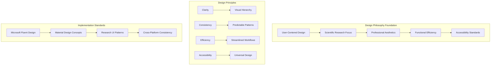
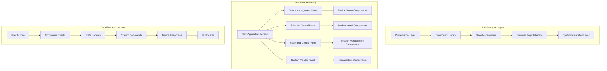
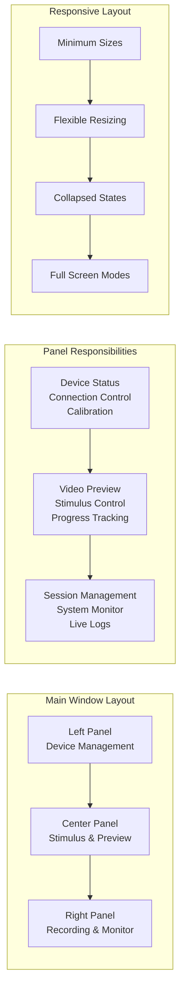

# User Interface Design Specification

## Table of Contents

1. [Interface Design Philosophy](#1-interface-design-philosophy)
   - 1.1 [Design Principles and Standards](#11-design-principles-and-standards)
   - 1.2 [User Experience Strategy](#12-user-experience-strategy)
   - 1.3 [Accessibility and Inclusivity](#13-accessibility-and-inclusivity)

2. [System Architecture Overview](#2-system-architecture-overview)
   - 2.1 [Component Architecture](#21-component-architecture)
   - 2.2 [Data Flow and Communication](#22-data-flow-and-communication)
   - 2.3 [Technology Stack](#23-technology-stack)

3. [Interface Components and Layouts](#3-interface-components-and-layouts)
   - 3.1 [Main Application Window](#31-main-application-window)
   - 3.2 [Device Management Panel](#32-device-management-panel)
   - 3.3 [Stimulus Control Interface](#33-stimulus-control-interface)
   - 3.4 [Recording Control System](#34-recording-control-system)
   - 3.5 [System Monitoring Dashboard](#35-system-monitoring-dashboard)

4. [Visual Design System](#4-visual-design-system)
   - 4.1 [Color Palette and Branding](#41-color-palette-and-branding)
   - 4.2 [Typography Specifications](#42-typography-specifications)
   - 4.3 [Spacing and Grid System](#43-spacing-and-grid-system)
   - 4.4 [Iconography and Visual Elements](#44-iconography-and-visual-elements)

5. [Custom UI Components](#5-custom-ui-components)
   - 5.1 [ModernButton Implementation](#51-modernbutton-implementation)
   - 5.2 [StatusIndicator System](#52-statusindicator-system)
   - 5.3 [ModernGroupBox Containers](#53-moderngroupbox-containers)
   - 5.4 [Real-Time Data Visualization](#54-real-time-data-visualization)

6. [User Interaction Patterns](#6-user-interaction-patterns)
   - 6.1 [Navigation and Workflow](#61-navigation-and-workflow)
   - 6.2 [Error Handling and Feedback](#62-error-handling-and-feedback)
   - 6.3 [Responsive Design Patterns](#63-responsive-design-patterns)

7. [Implementation Architecture](#7-implementation-architecture)
   - 7.1 [Technical Implementation](#71-technical-implementation)
   - 7.2 [Component Integration](#72-component-integration)
   - 7.3 [Performance Optimization](#73-performance-optimization)

8. [Testing and Quality Assurance](#8-testing-and-quality-assurance)
   - 8.1 [Usability Testing Methodology](#81-usability-testing-methodology)
   - 8.2 [Accessibility Compliance](#82-accessibility-compliance)
   - 8.3 [Cross-Platform Compatibility](#83-cross-platform-compatibility)

9. [Deployment and Integration](#9-deployment-and-integration)
   - 9.1 [Installation and Setup](#91-installation-and-setup)
   - 9.2 [Configuration Management](#92-configuration-management)
   - 9.3 [Update and Maintenance](#93-update-and-maintenance)

10. [Future Enhancements and Roadmap](#10-future-enhancements-and-roadmap)

## 1. Interface Design Philosophy

### 1.1 Design Principles and Standards

The user interface design for the Multi-Sensor Recording System Controller follows established principles from modern human-computer interaction research and industry best practices, with particular inspiration drawn from PsychoPy's clean, professional interface design and Microsoft's Fluent Design System. The design philosophy emphasizes clarity, efficiency, and accessibility while maintaining the sophisticated functionality required for advanced physiological monitoring research applications.

**Clarity and Visual Hierarchy:**
The interface prioritizes clear visual communication through careful use of typography, color, spacing, and layout to guide users naturally through complex research workflows. Information hierarchy is established through consistent use of size, contrast, and positioning to ensure that critical functions are immediately apparent while secondary features remain accessible without cluttering the primary workspace.

The visual hierarchy supports both novice users who require clear guidance through research procedures and expert users who need efficient access to advanced functionality. This dual-level approach ensures that the interface scales effectively with user expertise while maintaining consistency across different usage patterns.

**Consistency and Predictability:**
All interface elements follow consistent interaction patterns and visual conventions that enable users to build mental models of system behavior. Once users learn how to interact with one component, they can confidently predict how similar components will behave throughout the application. This consistency extends from low-level interactions like button behavior to high-level workflows such as session management and data collection.

Consistency is maintained across different functional areas through the use of standardized components, interaction patterns, and feedback mechanisms. This approach reduces cognitive load and training requirements while improving overall user efficiency and satisfaction.

**Functional Efficiency:**
The interface design optimizes for the specific workflows and tasks common in physiological monitoring research, with particular attention to reducing the number of steps required for common operations. Frequently used functions are positioned prominently and can be accessed with minimal navigation, while advanced features are organized logically to maintain accessibility without cluttering the primary interface.

Efficiency optimizations include keyboard shortcuts for power users, batch operations for managing multiple devices, and contextual controls that appear when needed rather than occupying permanent screen space. These optimizations reflect deep understanding of research workflows and user behavior patterns in scientific computing environments.

### 1.2 User Experience Strategy

**Workflow-Centered Design:**
The user experience strategy centers on supporting the complete research workflow from study setup through data collection to preliminary analysis. Each interface component is designed to integrate seamlessly with adjacent workflow steps, providing smooth transitions between different phases of the research process.

The workflow-centered approach recognizes that physiological monitoring research involves complex coordination of multiple devices, precise timing requirements, and careful attention to data quality. The interface design supports these requirements through visual feedback systems, automated quality checks, and clear status communication that enables researchers to maintain awareness of system state throughout data collection sessions.

**Adaptive Interface Complexity:**
The interface employs progressive disclosure principles to present appropriate levels of complexity based on user actions and system state. Basic operations are immediately accessible through simplified interfaces, while advanced features become available through contextual menus and expanded views that don't interfere with routine operations.

This adaptive approach enables the same interface to serve both routine data collection tasks and complex multi-device experimental setups without overwhelming users with unnecessary complexity or hiding essential functionality when it's needed.

**Error Prevention and Recovery:**
The user experience strategy emphasizes preventing errors before they occur through careful interface design, clear feedback systems, and intelligent defaults. When errors do occur, the interface provides clear guidance for recovery without losing work or compromising data integrity.

Error prevention strategies include input validation, confirmation dialogs for destructive actions, and automatic saving of configuration settings. Recovery mechanisms include undo functionality, session recovery after unexpected shutdowns, and detailed error logging that supports troubleshooting and system improvement.

### 1.3 Accessibility and Inclusivity

**Universal Design Principles:**
The interface design follows universal design principles that ensure usability across diverse user populations, including researchers with varying levels of technical expertise, different physical capabilities, and diverse cultural backgrounds. These principles are integrated into the fundamental design approach rather than added as afterthoughts.

Universal design considerations include high contrast color schemes that work for users with color vision differences, scalable text that accommodates different visual acuity levels, and interaction patterns that work effectively with assistive technologies such as screen readers and alternative input devices.

**Cross-Cultural Usability:**
The interface design considers the international nature of scientific research by avoiding culture-specific icons, color associations, or interaction patterns that might confuse users from different cultural backgrounds. Text is structured to support localization, and visual elements rely on universal conventions where possible.

Language considerations include support for left-to-right and right-to-left text direction, accommodation of different text length requirements during localization, and use of internationally recognized symbols and conventions for scientific instrumentation and data presentation.

**Assistive Technology Integration:**
The interface architecture includes native support for screen readers, keyboard navigation, and other assistive technologies commonly used by researchers with disabilities. This support is implemented at the component level to ensure consistent behavior across all interface elements.

Assistive technology integration includes proper semantic markup, descriptive labels for all interactive elements, logical tab order for keyboard navigation, and high contrast mode support that maintains functionality while improving visibility for users with visual impairments.

## 2. System Architecture Overview

### 2.1 Component Architecture

The user interface architecture employs a modular, component-based design that separates presentation logic from business logic while maintaining tight integration with the underlying physiological monitoring system. This architectural approach enables independent development and testing of interface components while ensuring consistent behavior and appearance across the entire application.

**Modular Component Design:**
Each major interface area is implemented as an independent module with well-defined interfaces and minimal coupling to other components. This modular approach enables parallel development of different interface areas, facilitates testing and validation, and provides flexibility for future enhancements or modifications.

The component architecture supports both composition and inheritance patterns, allowing complex interface elements to be built from simpler components while maintaining consistency and reusability. Custom components extend base PyQt5 widgets with enhanced functionality, standardized styling, and domain-specific behavior patterns.

**State Management Architecture:**
The interface employs a centralized state management system that maintains consistency between different interface components and the underlying system state. This architecture ensures that changes in one part of the interface are properly reflected throughout the entire application while providing clear audit trails for debugging and system optimization.

State management includes both user interface state (such as window positions and user preferences) and system state (such as device connectivity and recording status). The separation of these state categories enables efficient updates and reduces the complexity of maintaining consistency across the entire system.

**Integration Layer Design:**
The integration layer provides a clean abstraction between the user interface and the underlying physiological monitoring system, enabling the interface to work effectively with different hardware configurations and system capabilities. This abstraction layer handles device discovery, capability negotiation, and error recovery without exposing implementation details to interface components.

The integration layer also provides backward compatibility with existing system components while enabling gradual migration to enhanced functionality. This approach ensures that the enhanced interface can be deployed incrementally without disrupting existing research workflows or requiring immediate updates to all system components.

### 2.2 Data Flow and Communication

**Event-Driven Architecture:**
The user interface employs an event-driven architecture that responds to user actions, system events, and data updates through a consistent messaging system. This architecture enables loose coupling between interface components while maintaining responsive user interactions and real-time system monitoring capabilities.

Event handling includes both synchronous responses for immediate user feedback and asynchronous processing for long-running operations such as data collection and device communication. The event system provides proper error handling and timeout management to ensure robust operation under various system conditions.

**Real-Time Data Integration:**
The interface integrates real-time data streams from multiple physiological monitoring devices through efficient buffering and display update mechanisms. This integration maintains smooth user interface performance while providing immediate feedback about data quality, system performance, and collection progress.

Real-time integration includes adaptive update rates that balance responsiveness with system performance, intelligent filtering to highlight important events without overwhelming users with routine status updates, and automatic quality assessment that alerts users to potential data collection issues.

**Cross-Component Communication:**
Communication between different interface components follows established observer and signal-slot patterns that enable coordinated behavior without tight coupling. This communication architecture supports complex workflows that involve multiple interface areas while maintaining clear separation of concerns and testable component boundaries.

Cross-component communication includes status synchronization between device management and recording control systems, coordinated updates between stimulus presentation and data collection interfaces, and consistent error reporting across all interface components.

### 2.3 Technology Stack

**PyQt5 Framework Foundation:**
The interface is built on the PyQt5 framework, which provides comprehensive cross-platform GUI capabilities with native performance and appearance on Windows, macOS, and Linux systems. PyQt5 was selected for its mature widget set, excellent documentation, robust threading support, and strong integration with scientific Python libraries commonly used in physiological monitoring research.

PyQt5 provides the foundation for custom widget development, event handling, layout management, and graphics rendering required for real-time data visualization. The framework's signal-slot architecture aligns well with the event-driven interface design and provides reliable inter-component communication mechanisms.

**Scientific Computing Integration:**
The technology stack includes seamless integration with NumPy, SciPy, and Matplotlib for data processing and visualization capabilities. This integration enables real-time plotting of physiological signals, statistical analysis of data quality, and immediate feedback about collection parameters without requiring external analysis tools.

Scientific computing integration supports both basic visualization for system monitoring and advanced analysis for research validation. The integration architecture enables researchers to transition seamlessly from data collection to preliminary analysis within the same interface environment.

**System Integration Libraries:**
The interface integrates with system-level libraries for hardware communication, file system management, and network operations required for multi-device physiological monitoring. These integrations are abstracted through the integration layer to maintain cross-platform compatibility while leveraging platform-specific optimizations where available.

System integration includes USB device communication for thermal cameras, network protocols for smartphone coordination, and file system monitoring for automatic data backup and organization. These integrations are implemented with appropriate error handling and fallback mechanisms to ensure robust operation across different system configurations.

## 3. Interface Components and Layouts

### 3.1 Main Application Window

The main application window employs a three-panel layout that organizes functionality according to research workflow patterns while maintaining flexibility for different experimental configurations. The layout uses resizable splitter panels that enable users to adjust space allocation based on their specific research requirements and screen configurations.

**Window Structure and Organization:**
The main window structure reflects the logical flow of physiological monitoring research, from device setup through stimulus presentation to data collection and monitoring. This organization minimizes cognitive load by grouping related functions and providing clear visual separation between different phases of the research workflow.

The window structure includes a menu bar with standard application functions (File, Edit, View, Tools, Help), a main toolbar with frequently used commands, and a status bar that provides real-time information about system state, active connections, and current operations. These standard interface elements follow platform conventions to maintain consistency with users' expectations from other scientific applications.

**Layout Flexibility and Customization:**
The three-panel layout supports different research scenarios through configurable panel sizes, collapsible sections, and optional floating panels for multi-monitor setups. Users can customize the layout to optimize for their specific hardware configuration, research requirements, and personal preferences.

Layout customization includes saved workspace configurations that can be recalled for different types of experiments, automatic layout adaptation based on connected devices and available functionality, and support for external monitors that can display dedicated panels such as stimulus preview or real-time data visualization.

**Integration with System Themes:**
The main window integrates with operating system theme settings to provide consistent appearance with other applications while maintaining the specialized functionality required for physiological monitoring research. This integration includes support for light and dark themes, high contrast modes for accessibility, and custom styling that preserves scientific application conventions.

Theme integration maintains readability and functionality across different visual settings while ensuring that critical information such as device status indicators and data quality warnings remain clearly visible regardless of the selected theme configuration.

### 3.2 Device Management Panel

The device management panel provides centralized control for all connected physiological monitoring devices, including smartphones, thermal cameras, GSR sensors, and any additional instrumentation required for specific research protocols. The panel design emphasizes clear status communication and efficient batch operations for managing multiple devices simultaneously.

**Device Discovery and Connection Interface:**
The device discovery interface automatically detects available devices and presents them in a logical hierarchy that reflects their roles in the monitoring system. The interface provides clear visual indicators for device type, connection status, battery level (for wireless devices), and current operational mode.

Device connection controls include one-click connection for individual devices, batch connection operations for predefined device groups, and automatic reconnection for devices that experience temporary communication interruptions. The interface provides detailed feedback about connection progress and clear error messages when connection issues occur.

**Status Monitoring and Visualization:**
The device management panel includes real-time status visualization that enables researchers to quickly assess system readiness and identify potential issues before they affect data collection. Status indicators use color coding, progress bars, and textual information to communicate device state across multiple dimensions.

Status monitoring includes device health indicators (temperature, battery level, storage capacity), communication quality metrics (signal strength, latency, error rates), and operational status (recording state, calibration status, current settings). The monitoring system provides both immediate alerts for critical issues and trend information that helps identify developing problems.

**Calibration and Configuration Management:**
The panel includes streamlined interfaces for device calibration and configuration that reduce the complexity of managing multiple instruments while ensuring proper system setup. Calibration workflows are integrated into the device management interface to provide seamless transitions between setup and data collection phases.

Configuration management includes saved device profiles for different research protocols, batch configuration updates for multiple devices, and validation checks that ensure all devices are properly configured before data collection begins. The interface provides clear feedback about calibration status and automatic reminders for periodic recalibration requirements.

### 3.3 Stimulus Control Interface

The stimulus control interface manages the presentation of visual, auditory, or other stimuli that form part of the physiological monitoring research protocol. The interface design emphasizes precise timing control, clear preview capabilities, and seamless integration with data collection timing to ensure proper synchronization between stimulus presentation and physiological measurements.

**Media Management and Preview:**
The stimulus control interface includes comprehensive media management capabilities that support various file formats commonly used in psychological and physiological research. The preview system enables researchers to validate stimulus content and timing before beginning data collection sessions.

Media management includes file browser integration with support for network storage locations, preview capabilities for video and audio content, and metadata display that shows duration, resolution, frame rate, and other technical specifications relevant to research timing requirements. The interface provides batch loading capabilities for complex experimental protocols that involve multiple stimulus files.

**Playback Control and Timing:**
The playback control system provides precise timing control necessary for physiological monitoring research, including frame-accurate positioning, variable playback speeds, and programmable pause/resume sequences. The timing system integrates with the overall data collection system to ensure proper synchronization between stimulus events and physiological measurements.

Playback controls include standard media functions (play, pause, stop, seek) enhanced with research-specific features such as frame-by-frame advancement, loop regions for repeated stimulus presentation, and programmable markers that trigger data collection events or system notifications. The interface provides real-time timing information with millisecond precision.

**Synchronization and Coordination:**
The stimulus control interface coordinates closely with the data collection system to ensure that stimulus presentation timing is properly recorded and synchronized with physiological measurements. This coordination includes automatic timestamp generation, event logging, and integration with external timing systems when required.

Synchronization features include automatic offset calculation to compensate for display and processing delays, integration with hardware timing systems for precise event marking, and comprehensive logging of all stimulus events with high-resolution timestamps that enable accurate post-processing alignment with physiological data.

### 3.4 Recording Control System

The recording control system provides centralized management of data collection across all connected devices, with emphasis on session management, data quality monitoring, and automated backup procedures. The interface design ensures that researchers can focus on their experimental protocol while maintaining confidence in data integrity and system performance.

**Session Management Interface:**
The session management interface provides streamlined controls for starting, monitoring, and completing data collection sessions. The interface includes session naming conventions, metadata collection, and automatic organization of collected data according to research protocol requirements.

Session management includes pre-flight checks that verify system readiness before data collection begins, real-time monitoring of collection progress and data quality, and post-session validation that ensures all expected data has been properly collected and stored. The interface provides clear feedback about session status and automatic alerts for any issues that require researcher attention.

**Real-Time Data Quality Monitoring:**
The recording control system includes real-time data quality assessment that analyzes incoming physiological signals for common artifacts, technical issues, and data quality problems. This monitoring system provides immediate feedback that enables researchers to address issues during data collection rather than discovering problems during post-processing.

Data quality monitoring includes signal-to-noise ratio assessment, artifact detection for common physiological monitoring problems (motion artifacts, electrical interference, sensor disconnection), and statistical analysis of signal characteristics that indicate proper sensor function and data validity. The monitoring system provides both visual indicators and automated alerts for quality issues.

**Automated Backup and Data Management:**
The recording control system includes comprehensive data backup and management features that ensure data security and organization throughout the collection process. These features operate automatically to minimize researcher workload while providing configurable options for different research requirements and institutional policies.

Backup and management features include real-time data mirroring to secondary storage locations, automatic file naming and organization according to configurable schemas, and integrity checking that validates data completeness and detects corruption issues. The system provides progress indicators for backup operations and clear status reporting for data management activities.

### 3.5 System Monitoring Dashboard

The system monitoring dashboard provides comprehensive oversight of system performance, resource utilization, and operational status across all components of the physiological monitoring system. The dashboard design emphasizes clear visualization of system health and early warning of potential issues that could affect data collection quality or system reliability.

**Performance Metrics Visualization:**
The dashboard includes real-time visualization of key performance metrics including CPU utilization, memory usage, network bandwidth, storage capacity, and battery levels for wireless devices. These visualizations use clear graphics and trend information that enable researchers to assess system health at a glance.

Performance visualization includes both current status indicators and historical trend graphs that help identify patterns and predict potential issues. The dashboard provides configurable alert thresholds that notify researchers when performance metrics approach levels that could affect data collection quality or system stability.

**Network and Communication Monitoring:**
The system monitoring dashboard includes detailed information about network connections, communication quality, and data transfer status between different system components. This monitoring is particularly important for multi-device systems that rely on wireless communication for coordination and data transfer.

Network monitoring includes connection status for all devices, communication latency and reliability metrics, bandwidth utilization for data transfer operations, and error rates that indicate communication quality. The dashboard provides both real-time status and historical analysis that supports troubleshooting and system optimization.

**Log Management and Diagnostic Information:**
The dashboard includes integrated log management that collects, filters, and displays diagnostic information from all system components. The log system provides different detail levels appropriate for routine monitoring versus detailed troubleshooting, with search and filtering capabilities that enable efficient problem diagnosis.

Log management includes real-time display of system events, configurable filtering based on severity level and component source, search capabilities for finding specific events or error patterns, and export functions that support sharing diagnostic information with technical support or research collaborators. The log system maintains appropriate retention policies that balance diagnostic utility with storage requirements.

## 4. Visual Design System

### 4.1 Color Palette and Branding

The visual design system employs a carefully curated color palette derived from Microsoft's Fluent Design System, enhanced with additional colors specifically chosen for physiological monitoring applications. The color palette prioritizes accessibility, professional appearance, and clear communication of system status across different interface contexts.

**Primary Color Applications:**
The primary color palette serves specific functional roles throughout the interface, with Microsoft Blue (#0078d4) used for primary actions, navigation elements, and active states that require user attention. This color choice aligns with contemporary design standards while providing sufficient contrast against the light background for accessibility compliance.

Success Green (#107c10) indicates positive system states including successful connections, normal operation, and completed actions. The green color choice follows universal conventions for positive status indication while providing sufficient saturation to be clearly visible across different display types and ambient lighting conditions.

Warning Orange (#ff8c00) communicates situations that require user attention without indicating immediate critical problems. This includes low battery warnings, communication degradation, and configuration issues that should be addressed but don't prevent continued operation. The orange color provides clear differentiation from both positive and critical status indicators.

Error Red (#d13438) indicates critical issues that require immediate attention, including device failures, communication losses, and data integrity problems. The red color choice follows emergency communication conventions while providing maximum visibility and immediate recognition of critical system states.

**Accessibility and Contrast Considerations:**
The color palette meets WCAG 2.1 AA standards for color contrast, ensuring visibility for users with various forms of color vision differences. All color combinations used for text and background meet minimum contrast ratios, and critical information is never communicated through color alone.

Accessibility considerations include support for high contrast modes that maintain functionality while improving visibility for users with visual impairments. The color system provides alternative visual indicators (shapes, patterns, text labels) that supplement color-based communication for users who cannot distinguish specific color combinations.

**Semantic Color Mapping:**
Colors throughout the interface follow consistent semantic mapping that enables users to quickly understand system state and required actions. This semantic consistency extends across all interface components and maintains meaning across different functional areas of the application.

Semantic mapping includes consistent use of colors for similar functions across different interface components, logical color progression for status indicators (green for good, orange for caution, red for danger), and careful avoidance of color combinations that might confuse users familiar with standard conventions from other scientific or technical applications.

### 4.2 Typography Specifications

The typography system employs Segoe UI as the primary font family, chosen for its excellent readability across different display types, comprehensive character support for international users, and consistency with modern scientific application interfaces. The typography system includes carefully defined size scales, weight hierarchies, and spacing specifications that ensure clear information communication throughout the interface.

**Font Family and Fallbacks:**
Segoe UI serves as the primary font family with carefully chosen fallbacks that maintain consistent appearance across different operating systems. The fallback sequence includes system fonts that provide similar character width and readability characteristics to ensure consistent layout behavior regardless of the specific fonts available on different systems.

Monospace typography uses Consolas (Windows), Monaco (macOS), and Liberation Mono (Linux) for displaying code, timing information, log data, and other content where character alignment is important. The monospace font choices provide consistent character spacing and clear distinction between similar characters that is essential for technical information display.

**Typography Scale and Hierarchy:**
The typography system employs a modular scale that provides clear visual hierarchy while maintaining readability at different screen sizes and display densities. The scale includes specific sizes for different interface contexts, from large headings for main sections to small text for status indicators and technical information.

Heading hierarchy includes H1 (24px) for main section titles, H2 (20px) for subsection headers, H3 (16px) for component group labels, and H4 (14px) for detailed labels and captions. Body text uses 14px for primary content and 12px for secondary information, with careful attention to line spacing and paragraph spacing that supports sustained reading.

**Font Weight and Emphasis:**
The typography system uses two primary font weights: Regular (400) for body text and Semi-bold (600) for headings and emphasis. This limited weight palette maintains consistency while providing clear visual hierarchy and emphasis capabilities.

Font weight application follows consistent patterns throughout the interface, with semi-bold weights used for interactive elements such as buttons and navigation items, important status information, and section headings that require visual prominence. Regular weight text is used for body content, descriptions, and secondary information that supports primary content without competing for attention.

### 4.3 Spacing and Grid System

The spacing system employs a 12-pixel base unit that provides consistent visual rhythm throughout the interface while accommodating the dense information requirements of scientific applications. The grid system enables predictable layout behavior and maintains visual consistency across different interface components and screen sizes.

**Base Grid and Modular Spacing:**
The 12-pixel base unit creates a modular spacing system with common intervals of 12px, 24px, 36px, and 48px for different spacing contexts. This modular approach ensures consistent visual relationships between interface elements while providing sufficient flexibility for different content types and density requirements.

Spacing applications include 12px for standard margins between related elements, 24px for separation between component groups, 36px for major section boundaries, and 48px for top-level layout divisions. The modular system enables predictable layout calculations and maintains visual consistency even when different developers work on different interface components.

**Component Spacing Standards:**
Individual components follow standardized internal spacing that maintains consistency while optimizing for their specific content and interaction requirements. These standards include padding for clickable elements, margins for text content, and spacing for related control groups.

Component spacing includes 8px internal padding for buttons and interactive elements, 16px spacing between related form elements, 12px margins for text content blocks, and 24px separation between distinct component groups. These standards ensure comfortable interaction targets while maintaining efficient use of screen space.

**Responsive Spacing Adaptation:**
The spacing system includes responsive adaptation rules that maintain appropriate visual density across different screen sizes and resolutions. These adaptations ensure that the interface remains usable and visually balanced on different display types while preserving the essential spacing relationships that support usability.

Responsive adaptations include proportional scaling of spacing units for high-density displays, adaptive margins that accommodate different window sizes, and intelligent content reflow that maintains readability and interaction efficiency across different layout configurations.

### 4.4 Iconography and Visual Elements

The iconography system employs a consistent visual style that combines clarity, professional appearance, and semantic meaning appropriate for scientific applications. Icons follow established conventions from scientific instrumentation and software applications while maintaining visual consistency with the overall design system.

**Icon Style and Characteristics:**
Icons use a clean, outlined style with consistent stroke weight and corner radius that integrates seamlessly with the typography and overall visual design. The icon style emphasizes clarity at small sizes while maintaining visual interest and professional appearance at larger scales.

Icon characteristics include 2-pixel stroke weight for optimal visibility at standard display densities, 2-pixel corner radius for consistency with other interface elements, and 24-pixel standard size with scaling options for different contexts. The icon style avoids unnecessary detail while maintaining semantic clarity and visual appeal.

**Semantic Icon Selection:**
Icon selection follows established conventions from scientific instrumentation and research software to ensure immediate recognition by users familiar with physiological monitoring equipment. Icons maintain semantic consistency across similar functions and provide clear visual distinction between different types of actions and content.

Semantic applications include device-specific icons that reflect the actual appearance of monitoring equipment, status icons that follow universal conventions for connectivity and operational states, and action icons that clearly communicate their function through established visual metaphors from scientific and technical applications.

**Custom Icon Development:**
The system includes custom icons developed specifically for physiological monitoring functions that don't have established visual conventions. These custom icons maintain consistency with the overall icon system while providing clear visual communication for specialized research functions.

Custom icon development follows the established style guidelines and includes thorough testing for clarity and recognition across different user groups. The custom icons integrate seamlessly with standard icons while providing the specialized visual vocabulary required for advanced physiological monitoring research applications.

## 5. Custom UI Components

### 5.1 ModernButton Implementation

The ModernButton component provides enhanced button functionality with professional styling, interactive feedback, and accessibility features that exceed standard PyQt5 button capabilities. The implementation includes hover effects, pressed states, and semantic color variations that support different button roles throughout the interface.

**Enhanced Visual Feedback:**
The ModernButton implementation provides sophisticated visual feedback that communicates interaction state through subtle animations, color transitions, and shadow effects. The feedback system ensures that users receive immediate confirmation of their actions while maintaining professional appearance appropriate for scientific applications.

Visual feedback includes smooth color transitions on hover with 200ms duration for professional appearance, subtle shadow effects that provide depth perception and highlight interactive elements, pressed state feedback that provides tactile-like confirmation of button activation, and focus indicators that support keyboard navigation and accessibility requirements.

**Semantic Button Variants:**
The ModernButton system includes semantic variants that communicate different types of actions through appropriate color schemes and styling. These variants maintain visual consistency while providing clear communication about the nature and importance of different interface actions.

Primary buttons use the Microsoft Blue color scheme and are reserved for main actions within each interface context. Secondary buttons use neutral colors for supporting actions that don't require primary emphasis. Success, warning, and danger variants use appropriate semantic colors for actions that have specific consequences or importance levels.

**Accessibility and Keyboard Support:**
The ModernButton implementation includes comprehensive accessibility features that ensure usability with keyboard navigation, screen readers, and other assistive technologies. These features are integrated into the base implementation rather than added as optional enhancements.

Accessibility features include proper semantic markup that communicates button purpose to screen readers, keyboard navigation support with visual focus indicators, appropriate contrast ratios that meet WCAG guidelines, and integration with system accessibility settings for high contrast and large text modes.

**Performance Optimization:**
The ModernButton implementation optimizes performance for interfaces with many buttons through efficient rendering, shared resources, and intelligent update mechanisms. These optimizations ensure smooth interface performance even with complex layouts that include many interactive elements.

Performance optimizations include shared styling resources that reduce memory usage across multiple button instances, efficient event handling that minimizes processing overhead, lazy rendering of visual effects that aren't currently visible, and intelligent update batching that reduces rendering calls during complex interface updates.

### 5.2 StatusIndicator System

The StatusIndicator system provides clear, consistent visual communication of device status, system health, and operational state throughout the interface. The system employs color coding, animation, and progressive disclosure to communicate complex status information efficiently without cluttering the interface.

**Multi-Dimensional Status Communication:**
The StatusIndicator system communicates multiple dimensions of status information through layered visual elements that can be interpreted quickly at different levels of detail. The base indicator provides immediate status recognition, while additional details become available through hover states and expanded views.

Status dimensions include primary operational state (connected, disconnected, error), secondary status information (battery level, signal quality, operational mode), progress indicators for ongoing operations (connection attempts, data transfer, calibration procedures), and historical status information that provides context for current state.

**Animated State Transitions:**
The system includes smooth animated transitions between different status states that help users track changes in system condition and understand the progression of operations. These animations provide valuable feedback about system dynamics while avoiding distracting or unnecessary motion.

Animation implementations include fade transitions between different status colors with appropriate timing for state change recognition, pulse animations for active operations that indicate ongoing activity, progress animations for operations with known duration or completion percentage, and attention-drawing animations for critical status changes that require immediate user awareness.

**Contextual Status Grouping:**
StatusIndicators are designed to work effectively both individually and in groups that represent related system components. The grouping system provides hierarchical status information that enables users to assess overall system health while maintaining access to detailed component-level information.

Grouping features include summary indicators that aggregate status from multiple related components, expandable detail views that show individual component status when needed, logical organization that reflects system architecture and user mental models, and coordinated animations that show relationships between different status indicators during system operations.

### 5.3 ModernGroupBox Containers

The ModernGroupBox component provides sophisticated container functionality for organizing related interface elements with professional styling, flexible layout options, and accessibility features. The implementation enhances standard PyQt5 grouping capabilities with modern visual design and improved usability.

**Enhanced Visual Organization:**
ModernGroupBox containers use subtle visual cues to organize interface content without overwhelming users with heavy borders or excessive visual decoration. The design emphasizes content over decoration while providing clear organizational boundaries that support user understanding.

Visual organization features include clean borders with appropriate contrast for content separation, professional typography for group labels with consistent styling, flexible sizing that accommodates different content types and amounts, and integration with the overall design system for consistent appearance across all interface components.

**Collapsible and Expandable Content:**
The ModernGroupBox system includes optional collapsible functionality that enables users to focus on relevant content while maintaining access to less frequently used features. The collapsible behavior includes smooth animations and clear visual indicators that communicate current state.

Collapsible features include smooth expand/collapse animations with appropriate timing for comfortable user experience, persistent state management that remembers user preferences across sessions, keyboard shortcuts for power users who prefer keyboard navigation, and automatic layout adjustment that accommodates changing content size without disrupting overall interface layout.

**Nested Container Support:**
The ModernGroupBox implementation supports nested containers that enable complex interface organization while maintaining visual clarity and logical hierarchy. The nesting system provides appropriate visual cues for different organizational levels without becoming visually overwhelming.

Nesting features include intelligent styling that adjusts visual weight based on nesting level, consistent spacing systems that maintain proper visual hierarchy, coordinated behavior for operations that affect multiple nested levels, and accessibility support that ensures screen readers can properly navigate nested content structures.

### 5.4 Real-Time Data Visualization

The real-time data visualization system provides immediate feedback about physiological signals, system performance, and data quality through efficient plotting, interactive features, and intelligent scaling. The visualization system integrates seamlessly with the overall interface while providing specialized functionality for scientific data presentation.

**High-Performance Plotting Engine:**
The visualization system employs optimized plotting techniques that maintain smooth performance while displaying real-time physiological data streams. The plotting engine includes intelligent buffering, efficient rendering, and adaptive quality adjustment that ensures responsive interface performance.

Performance optimizations include circular buffers that efficiently manage streaming data without memory leaks, intelligent decimation that maintains visual fidelity while reducing computational load, adaptive frame rates that balance responsiveness with system performance, and lazy rendering techniques that optimize drawing operations for visible content only.

**Interactive Data Exploration:**
The visualization components include interactive features that enable users to explore data characteristics, identify patterns, and assess data quality during collection. These features maintain simplicity appropriate for real-time monitoring while providing access to detailed analysis when needed.

Interactive features include zoom and pan capabilities for detailed data examination, measurement tools that enable quantitative assessment of signal characteristics, overlay capabilities that enable comparison between different data streams or reference values, and snapshot functionality that captures interesting data segments for later analysis.

**Adaptive Scale and Range Management:**
The visualization system includes intelligent scaling that automatically adjusts display ranges based on data characteristics while providing manual override capabilities for users who need specific scale settings. The scaling system maintains readability while accommodating the wide dynamic range typical of physiological signals.

Scaling features include automatic range detection that maintains appropriate display characteristics, intelligent outlier handling that prevents unusual values from making normal data unreadable, user-configurable scale locking for consistent display across different time periods, and multiple scaling modes that accommodate different data analysis requirements.

## 6. User Interaction Patterns

### 6.1 Navigation and Workflow

The navigation system supports the complex workflows typical of physiological monitoring research through clear hierarchical organization, efficient task switching, and intelligent state management. The workflow design recognizes that research sessions involve coordination of multiple devices, precise timing requirements, and careful attention to data quality throughout the collection process.

**Workflow-Oriented Navigation:**
The navigation system organizes interface functionality according to research workflow phases rather than technical system architecture. This organization enables researchers to focus on their experimental objectives while providing logical access to the technical controls required for successful data collection.

Workflow organization includes setup phase navigation that guides users through device configuration and calibration, data collection phase controls that emphasize real-time monitoring and quality assessment, and post-collection functionality that supports immediate data validation and organization. The navigation system provides clear transitions between workflow phases while maintaining access to all functionality when needed.

**Context-Sensitive Interface Adaptation:**
The interface adapts contextually based on current workflow phase, connected devices, and user actions to present relevant functionality while minimizing cognitive load. This adaptation includes both visible interface changes and background functionality adjustments that optimize system behavior for current activities.

Contextual adaptations include device-specific controls that appear when relevant hardware is connected, workflow-phase emphasis that highlights current activities while maintaining access to other functions, intelligent defaults that reduce configuration requirements based on common usage patterns, and adaptive help systems that provide guidance relevant to current context and user actions.

**Efficient Task Switching:**
The navigation system supports efficient switching between different research tasks through persistent state management, quick access controls, and intelligent context preservation. This capability recognizes that research workflows often require attention to multiple aspects of system operation simultaneously.

Task switching features include tabbed interfaces for managing multiple concurrent activities, quick access toolbar for frequently used functions regardless of current context, persistent state management that preserves work when switching between different interface areas, and intelligent restoration of previous working state when returning to previously active tasks.

### 6.2 Error Handling and Feedback

The error handling system provides comprehensive coverage of potential issues while maintaining clear communication and providing actionable guidance for problem resolution. The system emphasizes preventing errors before they occur while providing effective recovery mechanisms when issues do arise.

**Proactive Error Prevention:**
The interface includes numerous proactive error prevention mechanisms that identify potential issues before they affect data collection or system operation. These mechanisms include validation systems, warning indicators, and automatic quality checks that alert users to developing problems.

Prevention mechanisms include input validation that prevents configuration errors before they can affect system operation, pre-flight checks that verify system readiness before beginning data collection, real-time monitoring that identifies developing problems before they become critical, and intelligent defaults that reduce the likelihood of user configuration errors.

**Clear Error Communication:**
When errors do occur, the interface provides clear, actionable communication that enables users to understand the problem and take appropriate corrective action. Error communication follows consistent patterns and uses appropriate visual hierarchy to ensure critical information receives immediate attention.

Error communication includes descriptive error messages that explain the problem in terms relevant to research workflow rather than technical implementation details, visual indicators that clearly identify error locations and severity levels, suggested actions that provide specific guidance for problem resolution, and escalation paths that connect users with additional support resources when needed.

**Graceful Recovery Mechanisms:**
The error handling system includes comprehensive recovery mechanisms that enable continued operation when possible and provide clear guidance for restoration when system recovery is required. Recovery mechanisms preserve user work and system state to minimize the impact of errors on research activities.

Recovery features include automatic error recovery for transient issues that don't require user intervention, session restoration capabilities that recover from unexpected shutdowns or system failures, data preservation mechanisms that protect collected research data from loss during error conditions, and clear recovery guidance that helps users restore normal operation efficiently.

### 6.3 Responsive Design Patterns

The responsive design system ensures effective interface operation across different screen sizes, resolutions, and device configurations commonly encountered in research environments. The responsive system maintains functionality and usability while adapting to physical constraints and user preferences.

**Adaptive Layout Systems:**
The interface employs adaptive layout techniques that maintain essential functionality while optimizing space utilization for different screen configurations. These adaptations include flexible component sizing, intelligent content prioritization, and configurable layout options that accommodate different research requirements.

Adaptive layout features include flexible panel sizing that accommodates different content amounts and screen proportions, intelligent content reflow that maintains readability and functionality across different layout configurations, configurable interface density that enables optimization for different user preferences and screen capabilities, and support for external monitors that enables expanded workspace configurations for complex research setups.

**Scalable Information Density:**
The responsive system includes mechanisms for adjusting information density based on screen space availability and user preferences. This capability enables the interface to serve both compact mobile displays and large desktop monitors effectively while maintaining consistent functionality.

Density adjustment features include progressive disclosure systems that reveal additional detail when space permits, scalable component sizing that maintains appropriate interaction targets across different display densities, intelligent information prioritization that emphasizes critical information when space is limited, and user-configurable density settings that enable personalization for different research contexts and user preferences.

**Cross-Device Compatibility:**
The responsive design system ensures consistent functionality across different computing platforms and device types commonly used in research environments. This compatibility includes both technical functionality and user experience consistency that enables researchers to work effectively regardless of their specific hardware configuration.

Compatibility features include consistent behavior across different operating systems and hardware configurations, intelligent feature adaptation that accommodates different device capabilities, seamless data synchronization that enables work across multiple devices, and platform-appropriate interface adaptations that leverage unique capabilities while maintaining overall consistency.

## 7. Implementation Architecture

### 7.1 Technical Implementation

The technical implementation architecture employs modern software engineering practices that ensure maintainable, extensible, and reliable code while meeting the performance requirements of real-time physiological monitoring applications. The architecture separates concerns effectively while providing clear interfaces between different system components.

```mermaid
graph TB
    subgraph "Implementation Architecture"
        A[Presentation Layer] --> B[Business Logic Layer]
        B --> C[Data Access Layer]
        C --> D[Hardware Interface Layer]
    end
    
    subgraph "Component Organization"
        E[UI Components] --> F[State Management]
        F --> G[Event Handling]
        G --> H[Device Communication]
        H --> I[Data Processing]
    end
    
    subgraph "Development Practices"
        J[Modular Design] --> K[Unit Testing]
        K --> L[Integration Testing]
        L --> M[Continuous Integration]
    end
```

**Modular Component Architecture:**
The implementation employs a modular architecture that separates different functional areas into independent components with well-defined interfaces. This modularity enables parallel development, comprehensive testing, and flexible deployment while maintaining clear separation of concerns.

Component separation includes presentation components that handle user interface rendering and interaction, business logic components that implement research workflow and data processing functionality, data access components that manage file operations and configuration persistence, and hardware interface components that abstract device communication and control operations.

**Event-Driven Communication:**
The implementation uses event-driven communication patterns that enable loose coupling between components while maintaining responsive user interaction and reliable system coordination. The event system provides proper error handling and ensures that component failures don't cascade throughout the system.

Event architecture includes signal-slot mechanisms for user interface event handling, observer patterns for status change notifications, message queuing for asynchronous operations that require coordination between components, and proper exception handling that ensures system stability during error conditions.

**Threading and Concurrency Management:**
The implementation includes sophisticated threading architecture that maintains responsive user interfaces while handling real-time data collection and processing requirements. The threading system provides proper synchronization and avoids common concurrency issues that could affect system reliability.

Threading implementation includes dedicated threads for hardware communication that prevent blocking user interface operations, worker threads for data processing that maintain system responsiveness during intensive computation, proper synchronization mechanisms that ensure thread safety without excessive locking overhead, and intelligent resource management that optimizes performance across different system configurations.

### 7.2 Component Integration

The component integration architecture provides seamless coordination between different interface components while maintaining independence and testability. The integration system includes proper dependency management, configuration systems, and deployment procedures that support reliable system operation.

**Dependency Injection and Configuration:**
The implementation employs dependency injection patterns that enable flexible component configuration while maintaining clear dependency relationships. This approach supports testing, deployment flexibility, and component reuse across different system configurations.

Dependency management includes configuration-driven component assembly that enables different deployment scenarios, interface-based programming that ensures proper abstraction between components, lifecycle management that coordinates component initialization and cleanup operations, and proper error handling that ensures graceful degradation when optional components are unavailable.

**Plugin Architecture and Extensibility:**
The integration system includes plugin architecture that enables extension of system functionality without modifying core components. This extensibility supports customization for different research requirements and enables community contribution to system capabilities.

Plugin architecture includes well-defined extension points that enable addition of new functionality, dynamic loading mechanisms that support runtime plugin addition and removal, proper versioning and compatibility management that ensures stable plugin operation, and comprehensive documentation that enables third-party plugin development.

**Configuration Management and Persistence:**
The implementation includes comprehensive configuration management that supports different research scenarios while maintaining appropriate defaults and providing clear upgrade paths for system evolution. Configuration management includes both user preferences and system settings.

Configuration features include hierarchical configuration systems that support both global and context-specific settings, automatic configuration backup and restoration capabilities, configuration validation that prevents invalid settings from affecting system operation, and migration systems that ensure smooth upgrades while preserving user customizations.

### 7.3 Performance Optimization

The performance optimization strategy addresses the specific requirements of real-time physiological monitoring while maintaining interface responsiveness and system reliability. Optimization efforts focus on critical paths that affect data collection quality and user experience.

**Memory Management and Resource Optimization:**
The implementation includes sophisticated memory management that handles large data streams efficiently while preventing memory leaks and excessive resource consumption. Memory optimization is particularly important for long-duration recording sessions common in physiological monitoring research.

Memory optimization includes intelligent buffering systems that manage streaming data without excessive memory allocation, resource pooling that reduces allocation overhead for frequently used objects, automatic garbage collection tuning that minimizes impact on real-time operations, and memory monitoring that provides early warning of resource exhaustion conditions.

**Real-Time Processing Optimization:**
The system includes optimization specifically for real-time processing requirements including low-latency data handling, efficient algorithms, and hardware acceleration where appropriate. These optimizations ensure that the interface can maintain performance during intensive data collection operations.

Real-time optimizations include optimized data structures that minimize processing overhead, efficient algorithms that maintain performance with large data volumes, hardware acceleration for computationally intensive operations, and adaptive processing that adjusts complexity based on system performance and user requirements.

**Network and I/O Optimization:**
The implementation includes optimization for network communication and file I/O operations that are critical for multi-device physiological monitoring systems. These optimizations ensure reliable communication while minimizing bandwidth requirements and storage overhead.

I/O optimizations include efficient serialization protocols that minimize network bandwidth requirements, asynchronous I/O operations that maintain interface responsiveness during file operations, intelligent caching that reduces redundant network and file operations, and compression algorithms that reduce storage requirements while maintaining data integrity.

## 8. Testing and Quality Assurance

### 8.1 Usability Testing Methodology

The usability testing methodology ensures that the interface design meets the complex requirements of physiological monitoring research while providing efficient, learnable, and error-resistant operation. Testing methodology includes both expert evaluation and user testing with representative research scenarios.

**Expert Evaluation and Heuristic Analysis:**
The testing methodology includes comprehensive expert evaluation using established usability heuristics adapted for scientific application requirements. Expert evaluation provides rapid identification of usability issues and design improvements that can be addressed before user testing.

Expert evaluation includes heuristic evaluation using Nielsen's usability principles adapted for scientific applications, cognitive walkthrough analysis that evaluates task completion efficiency, accessibility review that ensures compliance with relevant standards, and competitive analysis that benchmarks interface capabilities against other scientific software solutions.

**User Testing with Research Scenarios:**
The testing methodology includes user testing with realistic research scenarios that evaluate interface performance under conditions similar to actual research use. User testing provides insights into workflow efficiency, learning requirements, and error patterns that might not be apparent through expert evaluation alone.

User testing includes task-based testing with representative research protocols, think-aloud sessions that reveal user mental models and decision processes, error recovery testing that evaluates system behavior during problem conditions, and longitudinal testing that assesses interface performance during extended research sessions.

**Iterative Design and Validation:**
The testing methodology supports iterative design improvement through regular testing cycles, feedback integration, and validation of design changes. This iterative approach ensures that design improvements actually enhance user performance rather than simply addressing theoretical usability concerns.

Iterative validation includes rapid prototyping techniques that enable quick testing of design alternatives, A/B testing for specific interface elements where objective performance measurement is possible, continuous feedback collection that captures user experiences during actual research use, and systematic documentation of design decisions that supports future development and troubleshooting.

### 8.2 Accessibility Compliance

The accessibility compliance strategy ensures that the interface meets relevant accessibility standards while providing excellent usability for researchers with diverse capabilities and assistive technology requirements. Compliance verification includes both automated testing and manual evaluation with assistive technologies.

**WCAG 2.1 Compliance Verification:**
The compliance strategy includes comprehensive verification against WCAG 2.1 guidelines with particular attention to Level AA requirements that are essential for professional software applications. Compliance verification includes both automated testing tools and manual evaluation that identifies issues not caught by automated systems.

Compliance verification includes automated accessibility scanning that identifies common compliance issues, manual testing with screen readers and other assistive technologies, color contrast verification that ensures visibility across different visual capabilities, and keyboard navigation testing that ensures full functionality without mouse interaction.

**Assistive Technology Integration Testing:**
The testing strategy includes comprehensive evaluation with common assistive technologies to ensure that compliance standards translate into effective real-world usability. Integration testing identifies compatibility issues and usage patterns that might not be apparent through compliance checking alone.

Integration testing includes screen reader testing with multiple popular screen reader applications, keyboard navigation testing that evaluates efficiency and logical flow, voice control testing for users who rely on speech input, and switch navigation testing for users with motor impairments who use alternative input devices.

**Inclusive Design Validation:**
The accessibility strategy extends beyond compliance verification to include validation of inclusive design principles that ensure the interface works effectively for users with diverse capabilities, cultural backgrounds, and technical expertise levels.

Inclusive validation includes testing with users who have different types of disabilities and assistive technology configurations, evaluation of cultural assumptions and interface metaphors that might not translate across different user populations, assessment of cognitive load and learning requirements for users with different levels of technical expertise, and validation of error handling and recovery procedures for users who might have difficulty with complex troubleshooting procedures.

### 8.3 Cross-Platform Compatibility

The cross-platform compatibility strategy ensures consistent functionality and user experience across Windows, macOS, and Linux operating systems commonly used in research environments. Compatibility testing includes both functional verification and user experience consistency evaluation.

**Functional Compatibility Testing:**
The compatibility testing strategy includes comprehensive functional testing across target platforms to ensure that all features work correctly regardless of the specific operating system and hardware configuration. Functional testing identifies platform-specific issues and ensures appropriate fallback behavior when platform differences affect functionality.

Functional testing includes feature completeness verification across all target platforms, hardware interface testing that validates device communication across different operating systems, file system compatibility testing that ensures data portability, and network communication testing that verifies multi-device coordination across mixed-platform environments.

**User Experience Consistency Evaluation:**
The compatibility strategy includes evaluation of user experience consistency that ensures researchers can work effectively regardless of their chosen platform while maintaining familiarity when switching between different systems. Experience consistency evaluation identifies differences that might affect user efficiency or learning requirements.

Experience evaluation includes visual consistency assessment that identifies differences in appearance and layout, interaction pattern consistency that ensures similar behavior across platforms, performance consistency evaluation that identifies platform-specific performance differences, and workflow consistency testing that ensures research procedures work similarly across different operating systems.

**Platform-Specific Optimization:**
The compatibility strategy includes appropriate platform-specific optimization that leverages unique capabilities while maintaining overall consistency. Platform optimization enhances user experience on each platform while preserving the core functionality and workflow patterns that ensure consistent research capabilities.

Platform optimization includes native look and feel integration that provides familiar interface conventions for each operating system, performance optimization that leverages platform-specific capabilities for enhanced efficiency, hardware integration that takes advantage of platform-specific hardware capabilities, and deployment optimization that provides appropriate installation and update mechanisms for each platform.

## 9. Deployment and Integration

### 9.1 Installation and Setup

The installation and setup procedures provide streamlined deployment that minimizes technical complexity while ensuring reliable system configuration across different research environments. The installation system includes comprehensive validation, clear documentation, and automated procedures that reduce setup time and potential configuration errors.

**Automated Installation Procedures:**
The installation system provides automated procedures that handle dependency installation, configuration setup, and initial system validation with minimal user intervention. Automated installation reduces the potential for configuration errors while providing clear feedback about installation progress and any issues that require attention.

Installation automation includes dependency checking and automatic installation of required software components, configuration wizard that guides users through essential setup decisions with appropriate defaults, validation procedures that verify system functionality before first use, and comprehensive logging that supports troubleshooting if installation issues occur.

**Dependency Management and Verification:**
The installation system includes comprehensive dependency management that ensures all required software components are properly installed and configured. Dependency management includes both automatic installation where possible and clear guidance for components that require manual installation.

Dependency management includes automatic detection of existing software installations that can be reused, intelligent version checking that ensures compatibility while avoiding unnecessary updates, clear documentation of system requirements that enables advance planning, and fallback procedures for environments where automatic installation is not possible.

**Configuration Validation and Testing:**
The installation system includes comprehensive validation that ensures proper system configuration and identifies potential issues before they affect research activities. Validation procedures include both automated checks and guided testing that verifies system functionality with connected hardware.

Configuration validation includes hardware detection and communication testing that verifies device connectivity, network configuration testing that ensures multi-device coordination capabilities, performance benchmarking that identifies potential system limitations, and comprehensive system health checking that provides baseline performance measurements for future troubleshooting.

### 9.2 Configuration Management

The configuration management system provides flexible customization capabilities while maintaining system reliability and supporting different research requirements. Configuration management includes both user preferences and system settings with appropriate security and backup mechanisms.

**Hierarchical Configuration Architecture:**
The configuration system employs hierarchical architecture that enables both global system settings and context-specific customizations. This hierarchy supports different research groups, experimental protocols, and user preferences while maintaining appropriate defaults and avoiding configuration conflicts.

Configuration hierarchy includes system-level settings that affect overall application behavior, research group configurations that provide defaults for specific research teams or institutions, experimental protocol configurations that customize behavior for specific types of research, and user preference settings that enable individual customization without affecting other users.

**Configuration Backup and Restoration:**
The configuration management system includes comprehensive backup and restoration capabilities that protect user customizations and enable recovery from configuration problems. Backup procedures operate automatically while providing manual options for specific situations.

Backup capabilities include automatic configuration backup before system updates that enables rollback if updates cause compatibility issues, manual configuration export and import that supports sharing configurations between systems, configuration validation that ensures restored configurations are compatible with current system capabilities, and comprehensive documentation that enables manual configuration recreation if automatic restoration fails.

**Template and Profile Management:**
The configuration system includes template and profile management that enables efficient setup for common research scenarios while supporting customization for specific requirements. Template management reduces setup time while ensuring appropriate configuration for different types of research activities.

Template management includes predefined configuration templates for common research scenarios, profile management that enables quick switching between different research configurations, template customization capabilities that enable adaptation of standard configurations for specific requirements, and sharing mechanisms that enable research groups to distribute optimized configurations.

### 9.3 Update and Maintenance

The update and maintenance system provides reliable system evolution while minimizing disruption to ongoing research activities. The maintenance system includes both automatic updates for critical issues and controlled updates for feature enhancements that might affect research workflows.

**Automated Update Management:**
The update system provides intelligent automation that ensures security updates and critical bug fixes are applied promptly while providing user control over feature updates that might affect research procedures. Update automation includes rollback capabilities and comprehensive testing before automatic deployment.

Update automation includes automatic detection and installation of security updates that don't affect functionality, user-controlled installation of feature updates that might require workflow adaptation, comprehensive testing procedures that validate updates before deployment, and rollback capabilities that enable recovery if updates cause unexpected issues.

**Maintenance Scheduling and Planning:**
The maintenance system includes scheduling capabilities that enable research groups to plan maintenance activities around their research schedules while ensuring that critical updates are applied promptly. Maintenance scheduling supports both individual systems and coordinated updates across multiple research installations.

Maintenance scheduling includes configurable maintenance windows that accommodate different research schedules, notification systems that provide advance warning of required maintenance activities, coordination mechanisms that enable simultaneous updates across multiple systems, and comprehensive documentation that enables planning for maintenance-related downtime.

**System Health Monitoring and Diagnostics:**
The maintenance system includes continuous health monitoring that identifies potential issues before they affect research activities while providing comprehensive diagnostic information that supports efficient troubleshooting and optimization. Health monitoring operates transparently while providing detailed information when needed.

Health monitoring includes continuous performance monitoring that identifies degradation before it affects research activities, automatic diagnostic data collection that supports efficient troubleshooting, predictive maintenance capabilities that identify components or configurations that might require attention, and comprehensive reporting that enables research groups to optimize their system configurations for improved performance and reliability.

## 10. Future Enhancements and Roadmap

The future enhancement roadmap addresses emerging research requirements, technological advances, and user feedback while maintaining backward compatibility and system reliability. The roadmap includes both incremental improvements and major capability additions that will enhance the system's research value over time.

**Advanced Visualization and Analysis Integration:**
Future enhancements will include more sophisticated real-time visualization capabilities that enable researchers to assess data quality and identify patterns during collection rather than requiring post-processing analysis. These enhancements will integrate advanced signal processing and machine learning capabilities directly into the user interface.

Advanced visualization will include real-time signal quality assessment with immediate feedback about data collection parameters, pattern recognition capabilities that highlight interesting physiological responses during data collection, integrated statistical analysis that provides immediate summary information about collected data, and advanced plotting capabilities that support multi-dimensional data exploration and comparison.

**Enhanced Collaboration and Remote Operation:**
Future development will include enhanced collaboration capabilities that enable distributed research teams to coordinate data collection activities and share system configurations efficiently. Remote operation capabilities will enable expert support and coordination across different research sites.

Collaboration enhancements will include real-time collaboration tools that enable multiple researchers to coordinate data collection activities, remote monitoring capabilities that enable expert oversight of data collection sessions, configuration sharing mechanisms that enable rapid deployment of optimized research protocols, and integrated communication tools that support coordination between research team members during complex experimental procedures.

**Artificial Intelligence and Machine Learning Integration:**
Future enhancements will include deeper integration of artificial intelligence and machine learning capabilities that can provide intelligent assistance during research activities, automated quality assessment, and adaptive optimization of data collection parameters based on real-time analysis of physiological signals.

AI integration will include intelligent assistant capabilities that provide guidance during research setup and data collection, automated parameter optimization that adapts collection settings based on signal quality and research objectives, predictive maintenance that identifies potential system issues before they affect research activities, and advanced pattern recognition that can identify interesting physiological responses and suggest additional analysis approaches.

**Extended Hardware Support and Integration:**
The enhancement roadmap includes support for additional physiological monitoring hardware, integration with laboratory information management systems, and enhanced connectivity options that enable integration with other research infrastructure and external analysis tools.

Hardware expansion will include support for additional physiological sensors that complement GSR measurement, integration with standard laboratory equipment commonly used in physiological research, enhanced connectivity options that enable integration with institutional research infrastructure, and standardized data export formats that support integration with external analysis and publication tools.

This comprehensive user interface design specification provides the foundation for implementing a professional, efficient, and accessible interface that supports the complex requirements of physiological monitoring research while maintaining the flexibility and extensibility necessary for ongoing scientific advancement. The design balances sophisticated functionality with usable simplicity, ensuring that researchers can focus on their scientific objectives while maintaining confidence in their data collection infrastructure.