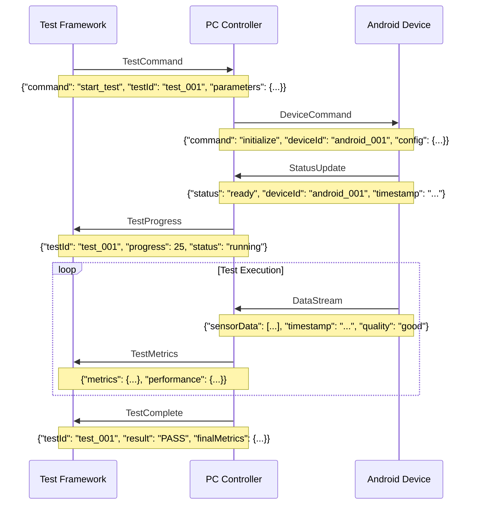

# Testing and Quality Assurance Framework - Protocol and Data Contract

## Overview

This document defines the data contracts, APIs, and communication protocols used within the Testing and Quality Assurance Framework of the Multi-Sensor Recording System. It serves as the authoritative reference for test data formats, validation protocols, and quality assurance interfaces.

## Test Execution Protocol

### Test Runner API Contract

#### Test Configuration Schema
```json
{
  "testConfiguration": {
    "type": "object",
    "required": ["testSuite", "environment", "parameters"],
    "properties": {
      "testSuite": {
        "type": "string",
        "enum": ["unit", "integration", "performance", "resilience", "comprehensive"],
        "description": "Test suite category to execute"
      },
      "environment": {
        "type": "object",
        "properties": {
          "pythonVersion": {"type": "string", "pattern": "^3\\.[8-9]"},
          "androidApiLevel": {"type": "integer", "minimum": 24},
          "deviceCount": {"type": "integer", "minimum": 1, "maximum": 8},
          "networkMode": {"type": "string", "enum": ["normal", "degraded", "offline"]}
        }
      },
      "parameters": {
        "type": "object",
        "properties": {
          "duration": {"type": "integer", "description": "Test duration in seconds"},
          "timeout": {"type": "integer", "description": "Test timeout in seconds"},
          "verboseLogging": {"type": "boolean", "default": false},
          "performanceMonitoring": {"type": "boolean", "default": true},
          "errorInjection": {"type": "boolean", "default": false}
        }
      }
    }
  }
}
```

#### Test Result Schema
```json
{
  "testResult": {
    "type": "object",
    "required": ["testId", "status", "timestamp", "metrics", "details"],
    "properties": {
      "testId": {"type": "string", "description": "Unique test execution identifier"},
      "status": {
        "type": "string", 
        "enum": ["PASS", "FAIL", "SKIP", "ERROR"],
        "description": "Overall test execution status"
      },
      "timestamp": {
        "type": "object",
        "properties": {
          "started": {"type": "string", "format": "date-time"},
          "completed": {"type": "string", "format": "date-time"},
          "duration": {"type": "number", "description": "Duration in seconds"}
        }
      },
      "metrics": {
        "type": "object",
        "properties": {
          "testsExecuted": {"type": "integer"},
          "testsPassed": {"type": "integer"},
          "testsFailed": {"type": "integer"},
          "testsSkipped": {"type": "integer"},
          "successRate": {"type": "number", "minimum": 0, "maximum": 100},
          "coveragePercentage": {"type": "number", "minimum": 0, "maximum": 100}
        }
      },
      "performance": {
        "type": "object",
        "properties": {
          "memoryUsage": {
            "type": "object",
            "properties": {
              "peak": {"type": "integer", "description": "Peak memory usage in MB"},
              "average": {"type": "integer", "description": "Average memory usage in MB"},
              "leakDetected": {"type": "boolean"}
            }
          },
          "cpuUsage": {
            "type": "object",
            "properties": {
              "peak": {"type": "number", "description": "Peak CPU usage percentage"},
              "average": {"type": "number", "description": "Average CPU usage percentage"}
            }
          },
          "networkMetrics": {
            "type": "object",
            "properties": {
              "throughput": {"type": "number", "description": "Average throughput in Mbps"},
              "latency": {"type": "number", "description": "Average latency in ms"},
              "packetLoss": {"type": "number", "description": "Packet loss percentage"}
            }
          }
        }
      },
      "details": {
        "type": "array",
        "items": {
          "type": "object",
          "properties": {
            "testName": {"type": "string"},
            "category": {"type": "string"},
            "status": {"type": "string"},
            "executionTime": {"type": "number"},
            "errorMessage": {"type": "string"},
            "stackTrace": {"type": "string"}
          }
        }
      }
    }
  }
}
```

## Test Data Formats

### Python Test Data Contract

#### Session Test Data Schema
```json
{
  "sessionTestData": {
    "type": "object",
    "required": ["sessionId", "devices", "sensors", "configuration"],
    "properties": {
      "sessionId": {
        "type": "string",
        "pattern": "^session_[0-9]{8}_[0-9]{6}$",
        "description": "Unique session identifier"
      },
      "devices": {
        "type": "array",
        "items": {
          "type": "object",
          "properties": {
            "deviceId": {"type": "string"},
            "deviceType": {"type": "string", "enum": ["android", "pc", "usb_camera"]},
            "status": {"type": "string", "enum": ["connected", "disconnected", "error"]},
            "capabilities": {
              "type": "array",
              "items": {"type": "string"}
            },
            "sensorData": {
              "type": "array",
              "items": {
                "type": "object",
                "properties": {
                  "timestamp": {"type": "number"},
                  "sensorType": {"type": "string"},
                  "value": {"type": "number"},
                  "unit": {"type": "string"},
                  "quality": {"type": "string", "enum": ["excellent", "good", "fair", "poor"]}
                }
              }
            }
          }
        }
      },
      "sensors": {
        "type": "object",
        "properties": {
          "shimmer": {
            "type": "array",
            "items": {
              "type": "object",
              "properties": {
                "deviceId": {"type": "string"},
                "batteryLevel": {"type": "integer", "minimum": 0, "maximum": 100},
                "samplingRate": {"type": "integer"},
                "sensors": {
                  "type": "array",
                  "items": {"type": "string", "enum": ["gsr", "ppg", "accelerometer", "gyroscope"]}
                }
              }
            }
          },
          "thermal": {
            "type": "array",
            "items": {
              "type": "object",
              "properties": {
                "deviceId": {"type": "string"},
                "resolution": {"type": "string"},
                "frameRate": {"type": "integer"},
                "temperatureRange": {
                  "type": "object",
                  "properties": {
                    "min": {"type": "number"},
                    "max": {"type": "number"}
                  }
                }
              }
            }
          }
        }
      },
      "configuration": {
        "type": "object",
        "properties": {
          "recordingDuration": {"type": "integer", "description": "Duration in seconds"},
          "synchronizationMode": {"type": "string", "enum": ["hardware", "software", "ntp"]},
          "dataFormat": {"type": "string", "enum": ["csv", "json", "binary"]},
          "qualityLevel": {"type": "string", "enum": ["research", "clinical", "consumer"]}
        }
      }
    }
  }
}
```

#### Performance Benchmark Data Schema
```json
{
  "performanceBenchmark": {
    "type": "object",
    "required": ["benchmarkId", "metrics", "baseline", "thresholds"],
    "properties": {
      "benchmarkId": {"type": "string"},
      "testEnvironment": {
        "type": "object",
        "properties": {
          "osVersion": {"type": "string"},
          "pythonVersion": {"type": "string"},
          "hardwareSpecs": {
            "type": "object",
            "properties": {
              "cpu": {"type": "string"},
              "memory": {"type": "string"},
              "storage": {"type": "string"},
              "network": {"type": "string"}
            }
          }
        }
      },
      "metrics": {
        "type": "object",
        "properties": {
          "executionTime": {
            "type": "object",
            "properties": {
              "initialization": {"type": "number", "description": "Initialization time in ms"},
              "recording": {"type": "number", "description": "Recording time per second"},
              "processing": {"type": "number", "description": "Data processing time in ms"},
              "cleanup": {"type": "number", "description": "Cleanup time in ms"}
            }
          },
          "resourceUsage": {
            "type": "object",
            "properties": {
              "memory": {
                "type": "object",
                "properties": {
                  "peak": {"type": "integer", "description": "Peak memory in MB"},
                  "average": {"type": "integer", "description": "Average memory in MB"},
                  "baseline": {"type": "integer", "description": "Baseline memory in MB"}
                }
              },
              "cpu": {
                "type": "object",
                "properties": {
                  "peak": {"type": "number", "description": "Peak CPU percentage"},
                  "average": {"type": "number", "description": "Average CPU percentage"}
                }
              },
              "storage": {
                "type": "object",
                "properties": {
                  "writeSpeed": {"type": "number", "description": "Write speed in MB/s"},
                  "readSpeed": {"type": "number", "description": "Read speed in MB/s"},
                  "spaceUsed": {"type": "integer", "description": "Storage space used in MB"}
                }
              }
            }
          },
          "networkPerformance": {
            "type": "object",
            "properties": {
              "bandwidth": {"type": "number", "description": "Bandwidth utilization in Mbps"},
              "latency": {"type": "number", "description": "Average latency in ms"},
              "jitter": {"type": "number", "description": "Latency jitter in ms"},
              "packetLoss": {"type": "number", "description": "Packet loss percentage"}
            }
          }
        }
      },
      "baseline": {
        "type": "object",
        "description": "Baseline performance metrics for comparison"
      },
      "thresholds": {
        "type": "object",
        "properties": {
          "responseTime": {"type": "number", "description": "Maximum acceptable response time in ms"},
          "memoryUsage": {"type": "integer", "description": "Maximum memory usage in MB"},
          "cpuUsage": {"type": "number", "description": "Maximum CPU usage percentage"},
          "regressionThreshold": {"type": "number", "description": "Maximum acceptable performance regression percentage"}
        }
      }
    }
  }
}
```

### Android Test Data Contract

#### Device State Schema
```json
{
  "deviceState": {
    "type": "object",
    "required": ["deviceId", "timestamp", "state", "capabilities"],
    "properties": {
      "deviceId": {"type": "string"},
      "timestamp": {"type": "string", "format": "date-time"},
      "state": {
        "type": "object",
        "properties": {
          "connectionStatus": {"type": "string", "enum": ["connected", "connecting", "disconnected", "error"]},
          "batteryLevel": {"type": "integer", "minimum": 0, "maximum": 100},
          "storageAvailable": {"type": "integer", "description": "Available storage in MB"},
          "networkQuality": {"type": "string", "enum": ["excellent", "good", "fair", "poor", "none"]},
          "thermalState": {"type": "string", "enum": ["normal", "warm", "hot", "critical"]}
        }
      },
      "capabilities": {
        "type": "object",
        "properties": {
          "camera": {
            "type": "object",
            "properties": {
              "resolution": {"type": "string"},
              "frameRate": {"type": "integer"},
              "videoCodec": {"type": "string"},
              "supportedFormats": {"type": "array", "items": {"type": "string"}}
            }
          },
          "thermal": {
            "type": "object",
            "properties": {
              "available": {"type": "boolean"},
              "resolution": {"type": "string"},
              "frameRate": {"type": "integer"},
              "temperatureRange": {
                "type": "object",
                "properties": {
                  "min": {"type": "number"},
                  "max": {"type": "number"}
                }
              }
            }
          },
          "sensors": {
            "type": "array",
            "items": {
              "type": "object",
              "properties": {
                "type": {"type": "string"},
                "available": {"type": "boolean"},
                "samplingRate": {"type": "integer"},
                "accuracy": {"type": "string"}
              }
            }
          }
        }
      },
      "errors": {
        "type": "array",
        "items": {
          "type": "object",
          "properties": {
            "timestamp": {"type": "string", "format": "date-time"},
            "errorCode": {"type": "string"},
            "errorMessage": {"type": "string"},
            "severity": {"type": "string", "enum": ["low", "medium", "high", "critical"]},
            "recoverable": {"type": "boolean"}
          }
        }
      }
    }
  }
}
```

#### UI Test State Schema
```json
{
  "uiTestState": {
    "type": "object",
    "required": ["testId", "screenState", "interactions", "assertions"],
    "properties": {
      "testId": {"type": "string"},
      "screenState": {
        "type": "object",
        "properties": {
          "currentActivity": {"type": "string"},
          "currentFragment": {"type": "string"},
          "orientation": {"type": "string", "enum": ["portrait", "landscape"]},
          "visibleElements": {
            "type": "array",
            "items": {
              "type": "object",
              "properties": {
                "elementId": {"type": "string"},
                "elementType": {"type": "string"},
                "visible": {"type": "boolean"},
                "enabled": {"type": "boolean"},
                "text": {"type": "string"},
                "bounds": {
                  "type": "object",
                  "properties": {
                    "left": {"type": "integer"},
                    "top": {"type": "integer"},
                    "right": {"type": "integer"},
                    "bottom": {"type": "integer"}
                  }
                }
              }
            }
          }
        }
      },
      "interactions": {
        "type": "array",
        "items": {
          "type": "object",
          "properties": {
            "timestamp": {"type": "string", "format": "date-time"},
            "action": {"type": "string", "enum": ["click", "longClick", "swipe", "type", "scroll"]},
            "targetElement": {"type": "string"},
            "parameters": {"type": "object"},
            "result": {"type": "string", "enum": ["success", "failure", "timeout"]},
            "responseTime": {"type": "number", "description": "Response time in ms"}
          }
        }
      },
      "assertions": {
        "type": "array",
        "items": {
          "type": "object",
          "properties": {
            "assertionType": {"type": "string"},
            "expected": {"type": "string"},
            "actual": {"type": "string"},
            "result": {"type": "boolean"},
            "errorMessage": {"type": "string"}
          }
        }
      }
    }
  }
}
```

## Network Communication Protocol

### Test Communication Messages

#### Test Command Protocol


#### Message Format Specifications

**Test Command Message:**
| Field Name | Data Type | Required | Description |
|------------|-----------|----------|-------------|
| command | string | Yes | Command type (start_test, stop_test, pause_test, resume_test) |
| testId | string | Yes | Unique test identifier |
| timestamp | string | Yes | ISO 8601 timestamp |
| parameters | object | No | Test-specific parameters |
| timeout | integer | No | Command timeout in seconds |
| priority | string | No | Command priority (low, normal, high, critical) |

**Status Update Message:**
| Field Name | Data Type | Required | Description |
|------------|-----------|----------|-------------|
| deviceId | string | Yes | Device identifier |
| status | string | Yes | Current device status |
| timestamp | string | Yes | ISO 8601 timestamp |
| batteryLevel | integer | No | Battery level percentage |
| memoryUsage | integer | No | Memory usage in MB |
| errorCount | integer | No | Number of errors since last update |
| lastError | string | No | Description of most recent error |

**Data Stream Message:**
| Field Name | Data Type | Required | Description |
|------------|-----------|----------|-------------|
| deviceId | string | Yes | Source device identifier |
| streamType | string | Yes | Data stream type (sensor, video, thermal) |
| timestamp | string | Yes | Data timestamp |
| sequenceNumber | integer | Yes | Sequence number for ordering |
| data | array | Yes | Actual sensor data |
| quality | string | No | Data quality indicator |
| checksum | string | No | Data integrity checksum |

## Quality Assurance Protocols

### Code Quality Metrics Schema
```json
{
  "codeQualityMetrics": {
    "type": "object",
    "required": ["projectId", "timestamp", "metrics", "violations"],
    "properties": {
      "projectId": {"type": "string"},
      "timestamp": {"type": "string", "format": "date-time"},
      "codebase": {
        "type": "object",
        "properties": {
          "linesOfCode": {"type": "integer"},
          "filesAnalyzed": {"type": "integer"},
          "testFiles": {"type": "integer"},
          "documentationFiles": {"type": "integer"}
        }
      },
      "metrics": {
        "type": "object",
        "properties": {
          "coverage": {
            "type": "object",
            "properties": {
              "linesCovered": {"type": "number"},
              "branchesCovered": {"type": "number"},
              "functionsCovered": {"type": "number"},
              "overallCoverage": {"type": "number"}
            }
          },
          "complexity": {
            "type": "object",
            "properties": {
              "cyclomaticComplexity": {"type": "number"},
              "cognitiveComplexity": {"type": "number"},
              "maintainabilityIndex": {"type": "number"}
            }
          },
          "quality": {
            "type": "object",
            "properties": {
              "duplicatedLines": {"type": "integer"},
              "techDebt": {"type": "string"},
              "reliabilityRating": {"type": "string"},
              "securityRating": {"type": "string"}
            }
          }
        }
      },
      "violations": {
        "type": "array",
        "items": {
          "type": "object",
          "properties": {
            "file": {"type": "string"},
            "line": {"type": "integer"},
            "rule": {"type": "string"},
            "severity": {"type": "string", "enum": ["info", "minor", "major", "critical", "blocker"]},
            "message": {"type": "string"},
            "category": {"type": "string"}
          }
        }
      }
    }
  }
}
```

### Security Scan Results Schema
```json
{
  "securityScanResults": {
    "type": "object",
    "required": ["scanId", "timestamp", "vulnerabilities", "summary"],
    "properties": {
      "scanId": {"type": "string"},
      "timestamp": {"type": "string", "format": "date-time"},
      "scanTool": {"type": "string"},
      "scanDuration": {"type": "integer", "description": "Scan duration in seconds"},
      "filesScanned": {"type": "integer"},
      "vulnerabilities": {
        "type": "array",
        "items": {
          "type": "object",
          "properties": {
            "id": {"type": "string"},
            "severity": {"type": "string", "enum": ["low", "medium", "high", "critical"]},
            "category": {"type": "string"},
            "description": {"type": "string"},
            "file": {"type": "string"},
            "line": {"type": "integer"},
            "column": {"type": "integer"},
            "cwe": {"type": "string", "description": "Common Weakness Enumeration ID"},
            "confidence": {"type": "string", "enum": ["low", "medium", "high"]},
            "recommendation": {"type": "string"}
          }
        }
      },
      "summary": {
        "type": "object",
        "properties": {
          "totalVulnerabilities": {"type": "integer"},
          "criticalCount": {"type": "integer"},
          "highCount": {"type": "integer"},
          "mediumCount": {"type": "integer"},
          "lowCount": {"type": "integer"},
          "riskScore": {"type": "number", "minimum": 0, "maximum": 100}
        }
      }
    }
  }
}
```

## Performance Monitoring Protocol

### Real-time Metrics Collection

#### System Performance Schema
```json
{
  "systemPerformance": {
    "type": "object",
    "required": ["timestamp", "system", "application", "network"],
    "properties": {
      "timestamp": {"type": "string", "format": "date-time"},
      "system": {
        "type": "object",
        "properties": {
          "cpu": {
            "type": "object",
            "properties": {
              "usage": {"type": "number", "description": "CPU usage percentage"},
              "cores": {"type": "integer"},
              "frequency": {"type": "number", "description": "CPU frequency in GHz"},
              "temperature": {"type": "number", "description": "CPU temperature in Celsius"}
            }
          },
          "memory": {
            "type": "object",
            "properties": {
              "total": {"type": "integer", "description": "Total memory in MB"},
              "used": {"type": "integer", "description": "Used memory in MB"},
              "available": {"type": "integer", "description": "Available memory in MB"},
              "percentage": {"type": "number", "description": "Memory usage percentage"}
            }
          },
          "storage": {
            "type": "object",
            "properties": {
              "total": {"type": "integer", "description": "Total storage in GB"},
              "used": {"type": "integer", "description": "Used storage in GB"},
              "available": {"type": "integer", "description": "Available storage in GB"},
              "ioReadSpeed": {"type": "number", "description": "Read speed in MB/s"},
              "ioWriteSpeed": {"type": "number", "description": "Write speed in MB/s"}
            }
          }
        }
      },
      "application": {
        "type": "object",
        "properties": {
          "processId": {"type": "integer"},
          "memoryUsage": {"type": "integer", "description": "Application memory usage in MB"},
          "cpuUsage": {"type": "number", "description": "Application CPU usage percentage"},
          "threadCount": {"type": "integer"},
          "openFiles": {"type": "integer"},
          "networkConnections": {"type": "integer"}
        }
      },
      "network": {
        "type": "object",
        "properties": {
          "interfaceName": {"type": "string"},
          "bytesReceived": {"type": "integer"},
          "bytesSent": {"type": "integer"},
          "packetsReceived": {"type": "integer"},
          "packetsSent": {"type": "integer"},
          "errors": {"type": "integer"},
          "drops": {"type": "integer"}
        }
      }
    }
  }
}
```

## Test Reporting API

### Report Generation Schema
```json
{
  "testReport": {
    "type": "object",
    "required": ["reportId", "generatedAt", "testSummary", "sections"],
    "properties": {
      "reportId": {"type": "string"},
      "generatedAt": {"type": "string", "format": "date-time"},
      "reportType": {"type": "string", "enum": ["executive", "technical", "performance", "security"]},
      "testSummary": {
        "type": "object",
        "properties": {
          "totalTests": {"type": "integer"},
          "passedTests": {"type": "integer"},
          "failedTests": {"type": "integer"},
          "skippedTests": {"type": "integer"},
          "executionTime": {"type": "number", "description": "Total execution time in minutes"},
          "overallStatus": {"type": "string", "enum": ["PASS", "FAIL", "WARNING"]}
        }
      },
      "sections": {
        "type": "array",
        "items": {
          "type": "object",
          "properties": {
            "sectionName": {"type": "string"},
            "status": {"type": "string"},
            "summary": {"type": "string"},
            "details": {"type": "object"},
            "recommendations": {"type": "array", "items": {"type": "string"}},
            "attachments": {"type": "array", "items": {"type": "string"}}
          }
        }
      },
      "qualityGates": {
        "type": "array",
        "items": {
          "type": "object",
          "properties": {
            "gateName": {"type": "string"},
            "status": {"type": "string", "enum": ["PASS", "FAIL"]},
            "threshold": {"type": "number"},
            "actualValue": {"type": "number"},
            "description": {"type": "string"}
          }
        }
      }
    }
  }
}
```

## Error Handling and Recovery Protocol

### Error Classification Schema
```json
{
  "errorClassification": {
    "type": "object",
    "required": ["errorId", "category", "severity", "recoverable"],
    "properties": {
      "errorId": {"type": "string"},
      "timestamp": {"type": "string", "format": "date-time"},
      "category": {
        "type": "string",
        "enum": ["network", "hardware", "software", "data", "configuration", "security"]
      },
      "severity": {
        "type": "string",
        "enum": ["low", "medium", "high", "critical"]
      },
      "recoverable": {"type": "boolean"},
      "description": {"type": "string"},
      "stackTrace": {"type": "string"},
      "context": {
        "type": "object",
        "properties": {
          "testId": {"type": "string"},
          "deviceId": {"type": "string"},
          "operation": {"type": "string"},
          "parameters": {"type": "object"}
        }
      },
      "recovery": {
        "type": "object",
        "properties": {
          "attempted": {"type": "boolean"},
          "successful": {"type": "boolean"},
          "method": {"type": "string"},
          "duration": {"type": "number", "description": "Recovery time in seconds"},
          "fallbackUsed": {"type": "boolean"}
        }
      }
    }
  }
}
```

This protocol documentation serves as the authoritative reference for all data contracts and communication interfaces within the Testing and Quality Assurance Framework, ensuring consistency and interoperability across all system components.