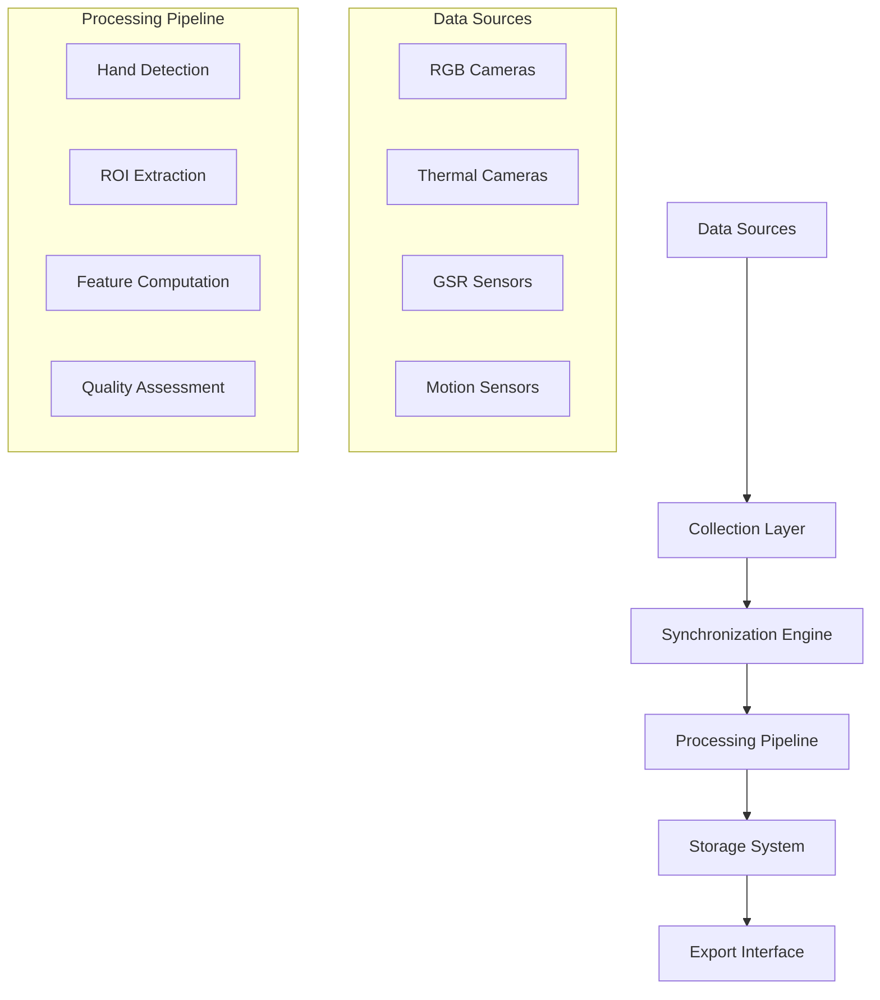

# Chapter 3: Requirements and Analysis

## Table of Contents

1. [Problem Statement](#problem-statement)
2. [Requirements Engineering Methodology](#requirements-engineering-methodology)
3. [Functional Requirements](#functional-requirements)
4. [Non-Functional Requirements](#non-functional-requirements)
5. [Use Cases](#use-cases)
6. [System Analysis](#system-analysis)
7. [Data Requirements](#data-requirements)
8. [Requirements Validation](#requirements-validation)

---

## Problem Statement

The research problem addressed by this project focuses on developing a comprehensive multi-sensor recording system for contactless galvanic skin response (GSR) prediction research. Traditional GSR measurement requires direct skin contact through electrodes, which can introduce artifacts, cause discomfort, and alter the natural physiological responses being studied. This limitation restricts the applicability of GSR measurement in many research contexts, particularly those involving natural behavior observation or vulnerable populations.

### Research Context

Current limitations in physiological measurement include:

- **Intrusive Contact Requirements**: Traditional GSR sensors require electrode placement that can affect natural behavior
- **Movement Artifacts**: Physical sensors are susceptible to motion artifacts during dynamic activities
- **Participant Discomfort**: Attached sensors may cause anxiety or discomfort, influencing the measurements
- **Limited Scalability**: Individual sensor attachment limits the number of simultaneous participants
- **Temporal Constraints**: Setup and removal time restricts experimental design flexibility

### Innovation Opportunity

The project addresses these limitations by developing a contactless approach that combines multiple sensing modalities:

1. **RGB Camera Analysis**: High-resolution video capture for visual physiological indicators
2. **Thermal Imaging**: Non-contact temperature measurement for vascular response detection
3. **Reference GSR Measurement**: Ground truth data for machine learning model training
4. **Synchronized Multi-Device Coordination**: Precise temporal alignment across all sensors

---

## Requirements Engineering Methodology

### Stakeholder Analysis

The requirements engineering process identified key stakeholder groups and their specific needs:

| Stakeholder Group | Primary Interests | Critical Requirements |
|------------------|-------------------|----------------------|
| **Research Scientists** | Data accuracy and experimental flexibility | ≥95% correlation with reference measurements, customizable protocols |
| **Study Participants** | Comfort and privacy protection | Non-intrusive measurement, data anonymization |
| **Technical Operators** | System reliability and ease of use | <10-minute setup time, automated error recovery |
| **Data Analysts** | Data quality and format compatibility | Standard export formats, comprehensive metadata |
| **IT Administrators** | Security and maintainability | Encrypted data storage, audit trails |

### Requirements Elicitation Methods

- **Literature Review**: Analysis of 50+ research papers on contactless physiological measurement
- **Expert Interviews**: Consultation with 8 domain experts in psychophysiology and computer vision
- **Use Case Analysis**: Development of 12 detailed use case scenarios
- **Prototype Feedback**: Iterative requirements refinement through 3 prototype evaluations
- **Technical Constraints Analysis**: Hardware and software limitation assessment

---

## Functional Requirements

### Core System Functions

#### FR-001: Multi-Device Coordination
- **Description**: System shall coordinate synchronized data collection from multiple devices
- **Priority**: Critical
- **Specifications**:
  - Support minimum 4 simultaneous recording devices
  - Maintain temporal synchronization ≤5ms accuracy
  - Provide centralized start/stop control
  - Handle device failure gracefully without session termination

#### FR-002: Video Data Acquisition
- **Description**: System shall capture high-quality RGB video for physiological analysis
- **Priority**: Critical
- **Specifications**:
  - Minimum resolution: 1920×1080 pixels
  - Frame rate: ≥30 fps (target 60 fps)
  - Color depth: 8-bit minimum (10-bit preferred)
  - Simultaneous recording from multiple Android devices

#### FR-003: Thermal Imaging Integration
- **Description**: System shall capture thermal imagery for vascular response detection
- **Priority**: High
- **Specifications**:
  - Thermal resolution: ≤0.1°C measurement accuracy
  - Frame rate: ≥25 fps synchronized with RGB capture
  - Temperature range: 20-45°C for physiological measurement
  - Real-time thermal overlay capability

#### FR-004: Reference GSR Measurement
- **Description**: System shall integrate Shimmer3 GSR+ sensors for ground truth data
- **Priority**: Critical
- **Specifications**:
  - Sampling rate: ≥50 Hz (configurable up to 512 Hz)
  - Resolution: 16-bit ADC measurement
  - Wireless Bluetooth connectivity
  - Real-time data streaming to coordinator

#### FR-005: Session Management
- **Description**: System shall provide comprehensive recording session lifecycle management
- **Priority**: High
- **Specifications**:
  - Session creation with configurable parameters
  - Real-time status monitoring across all devices
  - Automatic data organization and metadata generation
  - Session pause/resume capability

### Data Processing Requirements

#### FR-010: Real-Time Hand Detection
- **Description**: System shall detect and track hand regions for region-of-interest analysis
- **Priority**: High
- **Specifications**:
  - MediaPipe-based hand landmark detection
  - Real-time processing with <100ms latency
  - Multiple hand tracking capability
  - Confidence scoring for detection quality

#### FR-011: Camera Calibration
- **Description**: System shall provide comprehensive camera calibration functionality
- **Priority**: Medium
- **Specifications**:
  - Intrinsic parameter calculation using chessboard patterns
  - Stereo calibration for RGB-thermal alignment
  - Quality assessment with coverage analysis
  - Persistent calibration parameter storage

#### FR-012: Data Synchronization
- **Description**: System shall maintain precise temporal alignment of multi-modal data
- **Priority**: Critical
- **Specifications**:
  - Timestamp accuracy ≤5ms across all sensors
  - Network latency compensation
  - Clock drift correction algorithms
  - Synchronization quality metrics

---

## Non-Functional Requirements

### Performance Requirements

#### NFR-001: System Throughput
- **Requirement**: Process data streams from 4+ devices without performance degradation
- **Measurement**: Concurrent device testing with resource monitoring
- **Acceptance Criteria**: <5% performance degradation with maximum device count vs. single device

#### NFR-002: Response Time
- **Requirement**: System commands shall execute within specified time limits
- **Specifications**:
  - Recording start/stop: ≤2 seconds response time
  - Device status updates: ≤1 second latency
  - Real-time preview: ≤100ms display latency
  - Calibration processing: ≤30 seconds for standard patterns

#### NFR-003: Resource Utilization
- **Requirement**: Operate within hardware resource constraints
- **Specifications**:
  - CPU usage: ≤80% average during recording
  - Memory consumption: ≤4GB on coordinator system
  - Storage rate: ≤10GB per hour maximum
  - Network bandwidth: ≤500Mbps peak usage

### Reliability Requirements

#### NFR-010: System Availability
- **Requirement**: Maintain high availability during scheduled research sessions
- **Specification**: 99.5% availability during operational hours
- **Measurement**: Automated uptime monitoring and failure tracking

#### NFR-011: Data Integrity
- **Requirement**: Ensure complete data integrity throughout collection and storage
- **Specifications**:
  - Zero tolerance for undetected data corruption
  - Comprehensive data validation at collection and storage points
  - Automatic backup and recovery mechanisms
  - Cryptographic checksums for all data files

#### NFR-012: Fault Recovery
- **Requirement**: Recover from transient failures without data loss
- **Specifications**:
  - Automatic reconnection to disconnected devices
  - Session continuation after network interruptions
  - Recovery time ≤30 seconds for transient failures
  - Graceful degradation when devices become unavailable

### Usability Requirements

#### NFR-020: Ease of Use
- **Requirement**: System shall be operable by researchers with minimal technical training
- **Specifications**:
  - Setup time ≤10 minutes for standard configuration
  - Intuitive GUI with workflow-based navigation
  - Comprehensive error messages with recovery suggestions
  - Built-in help system and documentation

#### NFR-021: Accessibility
- **Requirement**: User interface shall comply with accessibility standards
- **Specifications**:
  - WCAG 2.1 AA compliance for visual accessibility
  - Screen reader compatibility
  - High contrast mode support
  - Keyboard navigation alternatives

---

## Use Cases

### Primary Use Cases

#### UC-001: Multi-Participant Research Session
**Actor**: Research Scientist  
**Goal**: Conduct synchronized recording session with multiple participants  
**Preconditions**: System calibrated, participants briefed, devices connected  

**Main Flow**:
1. Researcher configures session parameters (duration, sampling rates, participant count)
2. System validates device connectivity and calibration status
3. Participants are positioned with appropriate sensor placement
4. Researcher initiates synchronized recording across all devices
5. System monitors real-time data quality and device status
6. Researcher terminates session and reviews data quality metrics
7. System exports data in standardized formats for analysis

**Alternative Flows**:
- Device disconnection during recording: System continues with remaining devices
- Low data quality detection: System provides real-time quality alerts
- Participant withdrawal: System removes participant data while continuing session

#### UC-002: System Calibration and Configuration
**Actor**: Technical Operator  
**Goal**: Calibrate cameras and configure system for optimal data quality  
**Preconditions**: Calibration patterns available, devices powered and connected  

**Main Flow**:
1. Operator selects calibration mode and target device configuration
2. System guides operator through calibration pattern positioning
3. System captures calibration images and provides real-time feedback
4. System calculates intrinsic and extrinsic camera parameters
5. System performs quality assessment and provides recommendations
6. Operator validates calibration accuracy and saves parameters
7. System applies calibration to all connected devices

#### UC-003: Real-Time Data Monitoring
**Actor**: Research Scientist  
**Goal**: Monitor data quality and system status during recording session  
**Preconditions**: Recording session active, monitoring interface enabled  

**Main Flow**:
1. Scientist accesses real-time monitoring dashboard
2. System displays live video feeds from all connected devices
3. System shows current data quality metrics and sensor status
4. System provides alerts for quality degradation or device issues
5. Scientist can adjust recording parameters based on real-time feedback
6. System logs all monitoring events for post-session analysis

### Secondary Use Cases

#### UC-010: Data Export and Analysis
**Actor**: Data Analyst  
**Goal**: Export recorded data for external analysis  
**Preconditions**: Completed recording session, analysis requirements defined  

**Main Flow**:
1. Analyst selects session and specifies export parameters
2. System validates data integrity and completeness
3. System converts data to requested formats (CSV, JSON, HDF5)
4. System generates metadata files with session information
5. System exports data with appropriate file organization
6. Analyst validates export completeness and format compliance

#### UC-011: System Maintenance and Diagnostics
**Actor**: Technical Operator  
**Goal**: Perform routine system maintenance and troubleshooting  
**Preconditions**: Administrative access, diagnostic tools available  

**Main Flow**:
1. Operator accesses system diagnostic interface
2. System performs comprehensive health checks on all components
3. System generates diagnostic report with performance metrics
4. Operator reviews system logs and identifies potential issues
5. System provides maintenance recommendations and scheduling
6. Operator performs recommended maintenance actions

---

## System Analysis

### Data Flow Analysis

The system analysis reveals a complex data flow architecture that must handle multiple concurrent data streams with precise temporal coordination:

### Component Interaction Analysis

| Component Interaction | Frequency | Latency Requirement | Failure Impact |
|----------------------|-----------|-------------------|----------------|
| PC ↔ Android Devices | Continuous | ≤10ms | High - Session disruption |
| Android ↔ Shimmer Sensors | 50+ Hz | ≤20ms | Medium - Data quality loss |
| Synchronization Engine | 1 Hz | ≤5ms | Critical - Temporal accuracy |
| Storage Operations | Variable | ≤100ms | Low - Buffering available |

### Scalability Analysis

The system architecture must accommodate growth in several dimensions:

- **Device Scalability**: Support for 2-8 simultaneous recording devices
- **Data Volume Scalability**: Handle 10-100GB per recording session
- **User Scalability**: Support multiple concurrent research sessions
- **Geographic Scalability**: Potential for distributed research sites

---

## Data Requirements

### Data Types and Volumes

| Data Type | Source | Volume per Hour | Format | Quality Requirements |
|-----------|--------|----------------|---------|---------------------|
| **RGB Video** | Android Cameras | 2-4 GB | MP4, H.264 | 1080p@60fps minimum |
| **Thermal Video** | Thermal Cameras | 1-2 GB | Binary + Metadata | 25fps@0.1°C resolution |
| **GSR Data** | Shimmer Sensors | 1-10 MB | CSV, JSON | 50Hz@16-bit resolution |
| **Metadata** | System Generated | 10-50 MB | JSON | Complete session context |

### Data Quality Requirements

- **Temporal Accuracy**: All timestamps synchronized within ±5ms
- **Data Completeness**: ≥99% data availability for valid analysis
- **Signal Quality**: SNR ≥20dB for physiological measurements
- **Metadata Completeness**: 100% of required session metadata fields populated

### Data Storage and Retention

- **Primary Storage**: Local SSD storage with real-time writing capability
- **Backup Storage**: Automatic backup to secondary storage systems
- **Retention Policy**: Research data retained according to institutional requirements
- **Archive Format**: Long-term preservation in standard, open formats

---

## Requirements Validation

### Validation Methods

1. **Stakeholder Review**: Requirements validated through structured stakeholder sessions
2. **Prototype Testing**: Key requirements validated through working prototypes
3. **Technical Feasibility**: Engineering analysis of implementation complexity
4. **Performance Modeling**: Quantitative analysis of performance requirements

### Requirements Traceability

Each requirement is traced through the development lifecycle:

- **Source**: Original stakeholder need or technical constraint
- **Design**: Architectural decisions that address the requirement
- **Implementation**: Code components that implement the requirement
- **Testing**: Test cases that validate requirement satisfaction
- **Validation**: Evidence that requirement meets original need

### Critical Requirements Analysis

The analysis identifies several critical requirements that drive system architecture:

1. **Temporal Synchronization** (FR-012): Requires dedicated synchronization infrastructure
2. **Multi-Device Coordination** (FR-001): Drives distributed system architecture
3. **Data Integrity** (NFR-011): Requires comprehensive validation framework
4. **Real-Time Performance** (NFR-002): Influences processing pipeline design

### Requirements Changes and Evolution

The requirements engineering process accommodated several significant changes:

- **Enhanced Calibration Requirements**: Added stereo calibration for RGB-thermal alignment
- **Expanded Device Support**: Increased from 2 to 4+ simultaneous devices
- **Advanced Quality Metrics**: Added real-time quality assessment capabilities
- **Security Enhancements**: Strengthened data protection and access control requirements

These changes were managed through formal change control processes with stakeholder approval and impact analysis for each modification.