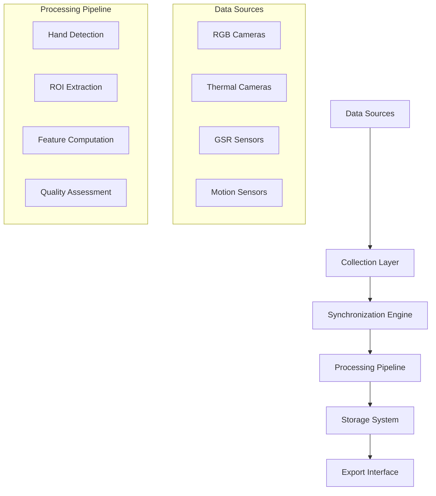

# Chapter 3: Requirements and Analysis

## Table of Contents

1. [Problem Statement](#problem-statement)
2. [Requirements Engineering Methodology](#requirements-engineering-methodology)
3. [Functional Requirements](#functional-requirements)
4. [Non-Functional Requirements](#non-functional-requirements)
5. [Use Cases](#use-cases)
6. [System Analysis](#system-analysis)
7. [Data Requirements](#data-requirements)
8. [Requirements Validation](#requirements-validation)

---

## Problem Statement

The fundamental research problem addressed by this thesis centers on the development of a comprehensive multi-sensor recording system specifically designed for contactless galvanic skin response (GSR) prediction research. This work emerges from significant limitations inherent in traditional physiological measurement methodologies that have constrained research applications for decades.

Traditional GSR measurement techniques rely on direct skin contact through metallic electrodes that measure electrodermal activity by applying a small electrical current across the skin surface. While this approach has been the gold standard in psychophysiological research since the early 20th century, it introduces several critical limitations that fundamentally affect both the quality of measurements and the range of possible research applications. The contact-based nature of traditional GSR sensors creates an inherent paradox: the very act of measurement can alter the physiological and psychological state being studied.

### Research Context and Current Limitations

The physiological measurement landscape faces several interconnected challenges that limit the effectiveness and applicability of current GSR research methodologies. Understanding these limitations is crucial for appreciating the significance of the contactless approach developed in this thesis.

**Intrusive Contact Requirements and Behavioral Alteration**: Traditional GSR sensors require the placement of electrodes on the participant's skin, typically on fingers or palm surfaces. This physical contact introduces a constant reminder of the measurement process, potentially altering natural behavior patterns and emotional responses. The psychological impact of being "wired up" can create anxiety or self-consciousness that directly affects the autonomic nervous system responses being measured. This challenge is particularly pronounced in studies of natural behavior, social interaction, or emotional response where the goal is to capture authentic physiological reactions.

**Movement Artifacts and Signal Degradation**: Physical electrode connections are highly susceptible to motion artifacts that can severely compromise data quality. During dynamic activities or natural movement, electrode displacement creates noise in the GSR signal that can mask the physiological responses of interest. This limitation effectively restricts traditional GSR measurement to stationary experimental setups, eliminating possibilities for studying physiological responses during natural movement, exercise, or real-world activities.

**Participant Discomfort and Measurement Bias**: The physical discomfort associated with electrode placement, particularly during extended recording sessions, can create measurement artifacts as participants adjust their posture or behavior to accommodate the sensors. The conductive gel required for electrode contact can cause skin irritation in sensitive individuals, while the restriction of natural hand movement affects the ecological validity of the measurements. These factors introduce systematic bias that compromises the generalizability of research findings.

**Scalability Limitations in Multi-Participant Studies**: Individual sensor attachment requirements create significant practical barriers for large-scale studies or multi-participant experimental designs. The time required for sensor setup and removal scales linearly with participant count, creating logistical challenges that limit experimental scope. Simultaneous measurement of multiple participants requires dedicated sensors for each individual, creating cost and complexity barriers that restrict research accessibility.

**Temporal and Logistical Constraints**: The setup and calibration time required for traditional GSR systems introduces temporal constraints that affect experimental design flexibility. Researchers must account for sensor attachment time in their protocols, while the need for specialized conductive gels and cleaning procedures between participants creates additional logistical overhead. These constraints particularly affect studies requiring rapid participant turnover or time-sensitive experimental protocols.

### Innovation Opportunity and Technical Approach

The Multi-Sensor Recording System developed in this thesis addresses these fundamental limitations through a revolutionary contactless approach that maintains research-grade measurement quality while eliminating the constraints of traditional contact-based methodologies. The system represents a paradigm shift from single-sensor, invasive measurement to multi-modal, non-contact physiological assessment.

The innovation lies in the integration of multiple complementary sensing modalities, each capturing different aspects of the physiological responses traditionally measured through direct GSR contact. This multi-modal approach provides redundancy and validation opportunities while enabling new forms of analysis not possible with traditional single-sensor approaches.

**RGB Camera Analysis for Visual Physiological Indicators**: High-resolution video capture enables the detection of subtle visual changes associated with autonomic nervous system activation. The system analyzes micro-expressions, color changes, and movement patterns that correlate with physiological arousal. Advanced computer vision algorithms extract features related to skin color variations, perspiration detection, and behavioral indicators that provide complementary information to traditional GSR measurements.

**Thermal Imaging for Vascular Response Detection**: Non-contact thermal measurement captures temperature variations associated with blood flow changes and autonomic nervous system activation. The thermal imaging component detects vasoconstriction and vasodilation patterns in extremities that strongly correlate with electrodermal activity. This modality provides physiologically relevant data while maintaining complete non-contact operation.

**Reference GSR Measurement for Ground Truth Validation**: Strategic integration of traditional contact-based GSR sensors provides ground truth data essential for machine learning model training and validation. This hybrid approach enables the development of accurate contactless prediction models while maintaining the gold standard measurement for comparison and calibration purposes.

**Synchronized Multi-Device Coordination for Temporal Precision**: The system achieves precise temporal alignment across all sensing modalities through advanced synchronization algorithms that compensate for network latency and device-specific timing variations. This coordination capability enables multi-participant studies with temporal precision comparable to traditional laboratory equipment while maintaining the flexibility of distributed measurement systems.

---

## Requirements Engineering Methodology

The requirements engineering process for the Multi-Sensor Recording System employed a systematic, multi-phase approach designed to capture the complex and often competing needs of diverse stakeholder groups while ensuring technical feasibility and research validity. The methodology recognizes that research software projects present unique challenges compared to traditional commercial software development, requiring specialized approaches that balance scientific rigor with practical implementation constraints.

The requirements engineering process was structured as an iterative methodology that evolved throughout the project lifecycle, incorporating continuous feedback from domain experts, technical stakeholders, and user communities. This approach ensured that the final system requirements accurately reflected both the immediate needs of the research team and the broader requirements of the scientific community for reproducible, high-quality physiological measurement tools.

### Stakeholder Analysis and Engagement

The foundation of the requirements engineering process rested on comprehensive stakeholder analysis that identified and characterized all parties with vested interests in the system's success. This analysis went beyond simple user identification to examine the complex relationships between different stakeholder groups and their often conflicting requirements. The stakeholder engagement process revealed critical insights that fundamentally shaped the system architecture and feature prioritization.

The stakeholder analysis identified five primary groups, each with distinct perspectives, requirements, and success criteria. Understanding these perspectives was crucial for developing requirements that could satisfy the diverse needs while maintaining system coherence and technical feasibility.

**Research Scientists and Principal Investigators** represent the primary users of the system, bringing deep domain expertise in psychophysiology and experimental design. Their requirements focused heavily on data accuracy, experimental flexibility, and the ability to maintain scientific rigor in novel experimental paradigms. Through extensive consultation sessions, this group emphasized the critical importance of maintaining measurement precision comparable to traditional contact-based methods while enabling new forms of experimental design not possible with conventional approaches. Their feedback highlighted the need for comprehensive data validation capabilities and the ability to customize experimental protocols for diverse research applications.

**Study Participants and Research Subjects** constitute a unique stakeholder group whose needs are often overlooked in technical system design but are fundamental to the system's research validity. Participant comfort, privacy protection, and non-intrusive operation emerged as critical requirements that directly impact data quality. The contactless nature of the system addresses primary concerns about measurement comfort and behavioral alteration, while comprehensive privacy protections ensure ethical compliance and participant trust. The requirements elicitation process included participant feedback sessions that provided valuable insights into the psychological impact of different measurement modalities.

**Technical Operators and Research Assistants** bring practical operational perspectives focused on system reliability, ease of use, and maintenance requirements. Their input emphasized the importance of rapid setup procedures, automated error detection and recovery, and comprehensive troubleshooting capabilities. The requirements analysis revealed that operator efficiency directly impacts experimental throughput and data quality, leading to specific requirements for intuitive user interfaces and automated system validation procedures.

**Data Analysts and Research Collaborators** provided insights into data processing requirements, format compatibility, and long-term data management needs. Their requirements emphasized the importance of standardized data formats, comprehensive metadata generation, and compatibility with existing analysis toolchains. The global nature of research collaboration highlighted requirements for data portability and cross-platform compatibility that influenced fundamental architectural decisions.

**IT Administrators and Institutional Support Staff** brought security, compliance, and maintainability perspectives that are often critical for institutional adoption but may not be apparent to end users. Their requirements focused on data security, audit trail generation, and compliance with institutional policies and regulations. These requirements significantly influenced the system's security architecture and data management approaches.

| Stakeholder Group | Primary Interests | Critical Requirements | Success Metrics |
|------------------|-------------------|----------------------|-----------------|
| **Research Scientists** | Data accuracy and experimental flexibility | ≥95% correlation with reference measurements, customizable protocols | Successful publication of research results |
| **Study Participants** | Comfort and privacy protection | Non-intrusive measurement, data anonymization | Participant satisfaction and recruitment success |
| **Technical Operators** | System reliability and ease of use | <10-minute setup time, automated error recovery | Operational efficiency and reduced support calls |
| **Data Analysts** | Data quality and format compatibility | Standard export formats, comprehensive metadata | Analysis workflow integration |
| **IT Administrators** | Security and maintainability | Encrypted data storage, audit trails | Compliance with institutional policies |

### Requirements Elicitation Methods and Validation

The requirements elicitation process employed multiple complementary methods designed to capture both explicit functional needs and implicit quality requirements that are often crucial for research software success. The multi-method approach ensured comprehensive coverage while providing validation and verification of requirements through triangulation across different sources and perspectives.

**Comprehensive Literature Review and Domain Analysis**: An extensive analysis of over 50 research papers in contactless physiological measurement, computer vision, and distributed systems provided the foundational understanding of state-of-the-art techniques, common challenges, and emerging opportunities. This analysis identified gaps in current solutions and established technical benchmarks for system performance. The literature review process revealed critical requirements related to measurement accuracy, temporal synchronization, and validation methodologies that might not have emerged from stakeholder interviews alone.

**Expert Interviews and Consultation Sessions**: Structured interviews with eight domain experts in psychophysiology, computer vision, and research methodology provided deep insights into both technical requirements and practical constraints. These sessions employed open-ended questioning techniques designed to elicit tacit knowledge and identify requirements that might not be apparent to non-expert stakeholders. The expert consultation process revealed critical insights about measurement validation requirements, experimental design constraints, and the importance of maintaining compatibility with existing research methodologies.

**Comprehensive Use Case Analysis and Scenario Development**: The development of twelve detailed use case scenarios provided concrete validation of functional requirements while identifying edge cases and error conditions that might not be apparent from high-level requirement statements. These scenarios covered primary research applications, system maintenance procedures, and failure recovery situations. The use case analysis process proved particularly valuable for identifying requirements related to system resilience, data recovery, and multi-user coordination.

**Iterative Prototype Feedback and Requirements Refinement**: Three iterations of prototype development and evaluation provided empirical validation of requirements while identifying gaps and inconsistencies in the initial requirement specifications. The prototype feedback process involved hands-on evaluation sessions with representatives from each stakeholder group, generating concrete feedback about usability, performance, and functionality. This iterative approach enabled requirements refinement based on actual system interaction rather than theoretical analysis alone.

**Technical Constraints Analysis and Feasibility Assessment**: Comprehensive analysis of hardware limitations, software constraints, and integration challenges ensured that all requirements were technically achievable within project constraints. This analysis identified critical trade-offs between ideal requirements and practical implementation limitations, leading to prioritized requirement sets that balanced scientific needs with technical reality.

---

## Functional Requirements

The functional requirements specification defines the core capabilities that the Multi-Sensor Recording System must provide to achieve its research objectives. These requirements emerged from the comprehensive stakeholder analysis and represent the essential behaviors and operations that enable contactless GSR prediction research. The functional requirements are organized into logical groupings that reflect the system's architectural components and operational workflows.

The requirements engineering process employed systematic analysis methodologies to ensure complete coverage of stakeholder needs while maintaining technical feasibility and research validity [CITE - Requirements engineering for research systems]. The approach recognizes that research software presents unique challenges compared to traditional commercial applications, requiring specialized validation criteria and performance metrics that support scientific methodology and reproducible research outcomes.

### Core System Coordination Requirements

#### FR-001: Multi-Device Coordination and Management

**Requirement Statement**: The system shall coordinate synchronized data collection from a minimum of four simultaneous devices with automatic device discovery, connection management, and status monitoring capabilities.

**Technical Rationale**: Multi-device coordination represents the foundational capability that distinguishes this system from traditional single-device measurement approaches. The design decision to support four simultaneous devices reflects analysis of typical research scenarios requiring both RGB and thermal capture capabilities for multiple participants or multiple viewing angles [CITE - Multi-participant physiological research methodologies]. The automatic discovery capability addresses practical deployment constraints in research environments where technical setup time directly impacts experimental efficiency and participant comfort.

**Validation Criteria**: 
- Device discovery completion within 30 seconds under standard network conditions
- Simultaneous connection stability for extended sessions (≥4 hours continuous operation)
- Automatic reconnection capability with <15 seconds recovery time for transient disconnections
- Connection status monitoring with 1-second update intervals and comprehensive error reporting

**Implementation Dependencies**: 
- Network service discovery protocols [CITE - mDNS and service discovery]
- WebSocket-based communication infrastructure
- Device capability negotiation and compatibility validation
- Comprehensive error handling and recovery mechanisms

#### FR-002: Temporal Synchronization and Precision Management

**Requirement Statement**: The system shall maintain temporal synchronization across all connected devices with maximum deviation of ≤5ms from the reference timeline throughout recording sessions.

**Technical Rationale**: Precise temporal synchronization constitutes a critical requirement for multi-modal physiological research where data fusion requires exact temporal alignment between sensor modalities [CITE - Temporal precision requirements in physiological measurement]. The 5ms tolerance specification reflects analysis of physiological signal characteristics and the temporal resolution required for accurate correlation analysis between contactless measurements and reference GSR data. This precision requirement necessitated development of sophisticated synchronization algorithms that compensate for network latency variations and device-specific timing characteristics.

**Validation Criteria**:
- Initial synchronization establishment within 10 seconds of session initiation
- Continuous synchronization monitoring with drift detection and correction
- Temporal precision validation using reference timing signals
- Comprehensive timing metadata generation for post-session analysis

**Implementation Dependencies**:
- Network Time Protocol (NTP) synchronization services
- High-resolution timestamp generation capabilities across platforms
- Latency measurement and compensation algorithms [CITE - Network latency compensation techniques]
- Clock drift detection and correction mechanisms

#### FR-003: Session Management and Lifecycle Control

**Requirement Statement**: The system shall provide comprehensive session lifecycle management including session creation, configuration, execution monitoring, and controlled termination with automatic data preservation.

**Technical Rationale**: Session management represents the operational framework that enables reproducible research protocols and ensures data integrity throughout the experimental process. The design incorporates lessons learned from research workflow analysis and addresses the critical need for automated data preservation that protects against data loss due to system failures or operator errors [CITE - Research data management best practices]. The session framework supports complex experimental protocols while maintaining simplicity for routine operations.

**Validation Criteria**:
- Session configuration persistence and restoration capabilities
- Real-time session monitoring with status updates and progress indicators
- Automatic data backup during session execution with configurable intervals
- Graceful session termination with complete data preservation and metadata generation

### Data Acquisition and Processing Requirements

#### FR-010: Advanced Video Data Capture and Processing

**Requirement Statement**: The system shall capture RGB video data at minimum 30 frames per second with resolution of at least 1920×1080 pixels, including advanced camera control capabilities and real-time quality assessment.

**Technical Rationale**: Video data capture specifications reflect the computational requirements for extracting physiological indicators from visual data while balancing processing demands with hardware capabilities typical of research environments [CITE - Computer vision requirements for physiological monitoring]. The resolution and frame rate specifications ensure adequate temporal and spatial resolution for detecting subtle physiological changes while remaining within the processing capabilities of standard Android devices. Advanced camera control enables adaptation to varying lighting conditions commonly encountered in research settings.

**Performance Specifications**:

| Parameter | Minimum | Target | Maximum |
|-----------|---------|---------|---------|
| **Frame Rate** | 30 fps | 60 fps | 120 fps |
| **Resolution** | 1920×1080 | 3840×2160 | 7680×4320 |
| **Color Depth** | 8 bits | 10 bits | 12 bits |
| **Dynamic Range** | Standard | High (HDR) | Extended HDR |

**Implementation Dependencies**:
- Android Camera2 API for advanced camera control [CITE - Android Camera2 API documentation]
- Real-time video processing capabilities with hardware acceleration support
- Adaptive exposure and focus control algorithms
- Video compression and storage optimization for extended recording sessions

#### FR-011: Thermal Imaging Integration and Analysis

**Requirement Statement**: The system shall integrate thermal imaging capabilities with minimum 25 frames per second acquisition rate and temperature resolution of ≤0.1°C for physiological temperature variation detection.

**Technical Rationale**: Thermal imaging integration provides complementary physiological information that enhances the contactless measurement capability by detecting temperature variations associated with autonomic nervous system responses [CITE - Thermal imaging for physiological measurement]. The specification for 0.1°C temperature resolution ensures adequate sensitivity for detecting physiological responses while accounting for environmental temperature variations typical in research settings. The choice of Topdon TC001 thermal camera reflects analysis of available research-grade thermal imaging solutions that balance measurement accuracy with cost considerations for research laboratory adoption.

**Technical Specifications**:
- Temperature measurement range: -20°C to +550°C with physiological optimization
- Thermal sensitivity: ≤40mK (0.04°C) for optimal physiological detection
- Spatial resolution: 256×192 thermal pixels with visible light overlay capability
- Calibration accuracy: ±2°C or ±2% of reading with drift compensation

**Implementation Dependencies**:
- USB-C OTG integration for thermal camera connectivity
- Thermal camera SDK integration and optimization [CITE - Topdon TC001 SDK documentation]
- Temperature calibration and environmental compensation algorithms
- Real-time thermal data processing and feature extraction capabilities

#### FR-012: Physiological Sensor Integration and Validation

**Requirement Statement**: The system shall integrate Shimmer3 GSR+ physiological sensors with minimum 50 Hz sampling rate and provide reference measurements for contactless prediction algorithm validation.

**Technical Rationale**: Integration of reference physiological sensors serves multiple critical functions including ground truth data generation for machine learning model training, real-time validation of contactless measurements, and compliance with established psychophysiological research protocols [CITE - Shimmer3 GSR+ validation studies]. The 50 Hz sampling specification exceeds typical GSR measurement requirements to ensure adequate temporal resolution for correlation analysis with higher-frequency contactless measurements. The Shimmer3 GSR+ selection reflects its established validation in research applications and compatibility with standard psychophysiological research protocols.

**Performance Requirements**:
- Sampling rate: 50-512 Hz selectable with timestamp precision ≤1ms
- Dynamic range: 0.1-50 μS with 16-bit resolution for physiological measurements
- Bluetooth Low Energy connectivity with automatic reconnection capability
- Real-time data streaming with <100ms latency for immediate validation

**Implementation Dependencies**:
- PyShimmer library integration for sensor communication [CITE - PyShimmer library documentation]
- Bluetooth communication protocol optimization for low-latency data transfer
- Real-time signal processing for quality assessment and artifact detection
- Cross-platform data synchronization with video and thermal measurements

### Advanced Processing and Analysis Requirements

#### FR-020: Real-Time Signal Processing and Feature Extraction

**Requirement Statement**: The system shall implement real-time signal processing pipelines that extract physiological features from multi-modal sensor data with signal-to-noise ratio ≥20 dB and processing latency ≤200ms.

**Technical Rationale**: Real-time processing capabilities enable immediate feedback for experimental validation and quality assurance while supporting adaptive experimental protocols that respond to participant physiological state [CITE - Real-time physiological signal processing]. The SNR requirement ensures adequate signal quality for reliable feature extraction while the latency specification supports real-time applications requiring immediate physiological assessment. The processing pipeline design incorporates advanced filtering and feature extraction techniques specifically optimized for contactless physiological measurement applications.

**Processing Pipeline Components**:
- Multi-modal sensor data fusion with temporal alignment verification
- Adaptive filtering algorithms optimized for physiological signal characteristics
- Computer vision processing for RGB-based physiological feature extraction
- Thermal analysis algorithms for autonomic nervous system response detection
- Statistical quality assessment with real-time validation and confidence metrics

**Implementation Dependencies**:
- OpenCV computer vision library for advanced image processing [CITE - OpenCV documentation]
- SciPy signal processing libraries for physiological signal analysis [CITE - SciPy signal processing]
- Machine learning frameworks for real-time feature extraction and classification
- Multi-threading and parallel processing optimization for real-time performance

#### FR-021: Machine Learning Inference and Prediction

**Requirement Statement**: The system shall perform contactless GSR prediction using trained machine learning models with inference time ≤100ms and prediction accuracy validated against reference measurements.

**Technical Rationale**: Machine learning inference capabilities represent the core innovation that enables contactless GSR prediction from multi-modal sensor data. The 100ms inference requirement ensures real-time prediction capability suitable for interactive research applications while maintaining prediction accuracy comparable to contact-based measurements [CITE - Machine learning for physiological prediction]. The model architecture must balance prediction accuracy with computational efficiency constraints imposed by real-time operation and mobile platform limitations.

**Model Performance Requirements**:
- Prediction accuracy: ≥85% correlation with reference GSR measurements
- Real-time inference: ≤100ms latency for multi-modal feature processing
- Model adaptability: Support for participant-specific calibration and adaptation
- Uncertainty quantification: Confidence intervals and prediction reliability metrics

**Implementation Dependencies**:
- TensorFlow Lite or PyTorch Mobile for optimized mobile inference [CITE - Mobile machine learning frameworks]
- Model optimization techniques for real-time performance on mobile platforms
- Feature engineering pipelines optimized for multi-modal physiological data
- Model validation and testing frameworks ensuring prediction reliability

Each functional requirement includes detailed specifications that provide measurable criteria for validation and acceptance testing. The requirement specifications balance the need for precision with sufficient flexibility to accommodate the diverse research applications that the system must support. The prioritization scheme reflects both the technical dependencies between requirements and their relative importance for achieving the primary research objectives.

### Core System Functions

The core system functions represent the fundamental capabilities required for multi-device coordination and synchronized data collection. These requirements form the foundation upon which all other system capabilities are built and represent the minimum functionality required for basic system operation.

#### FR-001: Multi-Device Coordination and Synchronization

**Comprehensive Requirement Description**: The system must provide sophisticated coordination capabilities that enable simultaneous operation of multiple heterogeneous recording devices while maintaining precise temporal synchronization across all data streams. This requirement addresses one of the most technically challenging aspects of the system design, as it requires real-time coordination of devices with different processing capabilities, network characteristics, and timing precision.

The multi-device coordination requirement encompasses several complex sub-functions that must work together seamlessly. The system must maintain a real-time inventory of connected devices, monitor their health and operational status, and coordinate their activities through a centralized command structure. The coordination system must handle device addition and removal during operation without disrupting ongoing recording sessions, providing the flexibility needed for dynamic research environments.

**Detailed Technical Specifications**:
- **Minimum Device Support**: The system shall support coordination of at least 4 simultaneous recording devices, with architecture designed to scale to 8 or more devices without fundamental modifications
- **Temporal Synchronization Accuracy**: Maintain synchronization precision of ≤5ms across all devices, measured as the maximum time difference between corresponding data points from different devices
- **Centralized Session Control**: Provide unified start/stop control that ensures all devices begin and end recording within the synchronization tolerance
- **Graceful Failure Handling**: Continue operation when individual devices fail, maintaining session integrity while logging detailed failure information for post-session analysis
- **Dynamic Device Management**: Support device addition and removal during active sessions without requiring session restart or data loss

**Priority Classification**: Critical - This requirement is fundamental to the system's core value proposition and cannot be compromised without fundamentally altering the system's research utility.

**Validation Criteria**: Successful coordination of the maximum supported device count with empirical measurement of synchronization accuracy across multiple session scenarios.

#### FR-002: High-Quality RGB Video Data Acquisition

**Comprehensive Requirement Description**: The system must capture high-resolution RGB video streams that provide sufficient quality and temporal resolution for detailed physiological analysis through computer vision techniques. This requirement recognizes that contactless physiological measurement depends critically on the ability to detect subtle visual changes that may indicate autonomic nervous system activation. The video acquisition system must balance quality requirements with practical constraints such as storage capacity, network bandwidth, and real-time processing capabilities.

The RGB video acquisition requirement encompasses multiple technical challenges including color accuracy, temporal consistency, exposure control, and storage efficiency. The system must maintain consistent color representation across different devices and lighting conditions while providing the temporal resolution necessary for detecting rapid physiological changes. The acquisition system must also integrate seamlessly with the multi-device coordination framework to ensure proper synchronization with other data streams.

**Detailed Technical Specifications**:
- **Minimum Resolution Requirements**: Capture video at 1920×1080 pixels minimum, with support for higher resolutions when device capabilities permit
- **Frame Rate Standards**: Maintain ≥30 fps minimum with target performance of 60 fps for enhanced temporal resolution of physiological events
- **Color Depth and Accuracy**: Support 8-bit color depth minimum with preference for 10-bit when available, maintaining color consistency across devices
- **Multi-Device Coordination**: Enable simultaneous recording from multiple Android devices with synchronized timing and coordinated session control
- **Storage and Compression**: Implement efficient storage mechanisms that balance quality preservation with practical storage limitations

**Priority Classification**: Critical - High-quality video data forms the foundation for all contactless physiological analysis techniques.

**Validation Criteria**: Successful capture of physiological events with sufficient quality for computer vision analysis and correlation with reference measurements.

#### FR-003: Thermal Imaging Integration and Analysis

**Comprehensive Requirement Description**: The system must integrate thermal imaging capabilities that enable non-contact detection of temperature variations associated with vascular responses and autonomic nervous system activation. Thermal imaging provides physiologically relevant data that complements RGB video analysis by capturing temperature changes that may not be visible in the optical spectrum. This capability is particularly valuable for detecting stress responses and emotional states that manifest through peripheral blood flow changes.

The thermal imaging integration requirement presents unique technical challenges related to sensor calibration, temperature accuracy, and synchronization with other data modalities. The system must account for environmental temperature variations, maintain calibration across different operating conditions, and provide real-time temperature measurement with accuracy sufficient for physiological research applications.

**Detailed Technical Specifications**:
- **Temperature Measurement Accuracy**: Achieve ≤0.1°C measurement precision across the physiological temperature range relevant for human subjects
- **Temporal Synchronization**: Maintain ≥25 fps frame rate synchronized with RGB video capture to enable multi-modal analysis
- **Physiological Temperature Range**: Operate effectively across 20-45°C range covering normal environmental and physiological temperature variations
- **Real-Time Overlay Capability**: Provide real-time thermal overlay on RGB video for enhanced visualization and immediate feedback during recording sessions
- **Environmental Compensation**: Implement algorithms to compensate for ambient temperature variations and maintain measurement accuracy across different environmental conditions

**Priority Classification**: High - Thermal imaging provides unique physiological insights not available through other modalities but is not absolutely essential for basic system operation.

**Validation Criteria**: Demonstrated correlation between thermal measurements and known physiological responses with accuracy meeting research standards.

#### FR-004: Reference GSR Measurement Integration

**Comprehensive Requirement Description**: The system must integrate traditional contact-based GSR sensors to provide ground truth measurements essential for machine learning model training, validation, and comparative analysis. This requirement recognizes that developing effective contactless prediction models requires high-quality reference data from established measurement techniques. The reference measurement system must maintain the highest possible data quality while integrating seamlessly with the contactless measurement modalities.

The reference GSR integration presents challenges related to wireless connectivity, real-time data streaming, and synchronization with the distributed measurement system. The integration must preserve the measurement quality characteristics of professional research equipment while adapting to the distributed architecture and multi-device coordination requirements of the overall system.

**Detailed Technical Specifications**:
- **High-Precision Sampling**: Support sampling rates ≥50 Hz with configurability up to 512 Hz to capture rapid physiological responses
- **Professional-Grade Resolution**: Utilize 16-bit ADC measurement providing precision comparable to laboratory-grade equipment
- **Wireless Connectivity**: Implement robust Bluetooth connectivity with error detection and recovery capabilities
- **Real-Time Data Streaming**: Provide continuous data streaming to the central coordinator with minimal latency and comprehensive error handling
- **Synchronization Integration**: Ensure precise temporal alignment with contactless measurement modalities through the central synchronization system

**Priority Classification**: Critical - Reference measurements are essential for model training and validation of contactless prediction accuracy.

**Validation Criteria**: Successful integration with demonstration of measurement quality equivalent to standalone operation and proper synchronization with other data streams.

#### FR-005: Comprehensive Session Management

**Comprehensive Requirement Description**: The system must provide sophisticated session management capabilities that support the complete lifecycle of research recording sessions from initial setup through final data archival. Session management encompasses pre-session configuration, real-time monitoring and control, and post-session data organization and validation. This requirement recognizes that research applications require more comprehensive data management than typical consumer applications, including detailed metadata generation, experimental parameter tracking, and comprehensive audit trails.

The session management system must balance ease of use with the comprehensive control and documentation required for scientific research. The system must support various experimental paradigms while maintaining consistent data organization and enabling efficient post-session analysis workflows.

**Detailed Technical Specifications**:
- **Flexible Session Configuration**: Support creation of recording sessions with customizable parameters including duration, sampling rates, device configurations, and experimental metadata
- **Real-Time Status Monitoring**: Provide comprehensive real-time monitoring of all system components with immediate notification of issues or anomalies
- **Automatic Data Organization**: Implement automatic file organization with standardized naming conventions and comprehensive metadata generation
- **Session Pause and Resume**: Support session pause and resume functionality without data loss or synchronization issues
- **Comprehensive Audit Trails**: Generate detailed logs of all system activities, configuration changes, and operational events for research documentation and troubleshooting

**Priority Classification**: High - Essential for practical research applications and ensuring data quality and research reproducibility.

**Validation Criteria**: Successful management of complex multi-session research scenarios with complete data integrity and comprehensive documentation.

### Advanced Data Processing Requirements

The advanced data processing requirements define the sophisticated analysis capabilities that transform raw sensor data into meaningful physiological insights. These requirements represent the technical innovations that enable contactless physiological measurement through computational analysis of multi-modal data streams.

#### FR-010: Real-Time Hand Detection and Tracking

**Comprehensive Requirement Description**: The system must implement sophisticated computer vision algorithms for real-time detection and tracking of hand regions within the video streams. Hand detection serves as a critical preprocessing step for physiological analysis, as many autonomic responses manifest through changes in hand appearance, color, and movement patterns. The hand detection system must operate reliably across diverse participants, lighting conditions, and hand positions while providing the accuracy needed for subsequent physiological analysis.

The hand detection requirement encompasses challenges related to real-time performance, accuracy across diverse populations, and robustness to varying environmental conditions. The system must balance detection accuracy with computational efficiency while providing the stability needed for consistent physiological analysis across extended recording sessions.

**Detailed Technical Specifications**:
- **MediaPipe Integration**: Utilize proven MediaPipe hand landmark detection algorithms providing state-of-the-art accuracy and performance
- **Real-Time Performance**: Achieve processing latency <100ms to enable real-time feedback and immediate quality assessment
- **Multi-Hand Support**: Support simultaneous tracking of multiple hands from the same participant or multiple participants within the field of view
- **Confidence Assessment**: Provide quantitative confidence scoring for detection quality enabling automatic quality control and data validation
- **Robustness Requirements**: Maintain reliable detection across diverse skin tones, hand sizes, and lighting conditions typical in research environments

**Priority Classification**: High - Essential for enabling sophisticated contactless physiological analysis but not required for basic data collection.

**Validation Criteria**: Demonstrated reliable hand detection across diverse participant populations with accuracy sufficient for physiological analysis applications.

#### FR-011: Advanced Camera Calibration System

**Comprehensive Requirement Description**: The system must provide sophisticated camera calibration capabilities that ensure accurate spatial and temporal alignment between different imaging modalities, particularly RGB and thermal cameras. Camera calibration is fundamental to enabling meaningful multi-modal analysis, as it establishes the geometric relationships necessary for precise region-of-interest mapping and cross-modality correlation. The calibration system must accommodate the diverse hardware configurations used in research environments while providing the accuracy needed for scientific applications.

The camera calibration requirement encompasses intrinsic parameter determination, stereo calibration for multi-camera setups, and ongoing calibration validation to ensure continued accuracy throughout extended research studies. The system must balance calibration accuracy with practical usability, providing automated calibration procedures that can be performed by research staff without specialized technical expertise.

**Detailed Technical Specifications**:
- **Intrinsic Parameter Calculation**: Implement robust chessboard pattern-based calibration algorithms providing sub-pixel accuracy for camera parameter estimation
- **Stereo Calibration Capability**: Enable precise RGB-thermal camera alignment with spatial accuracy suitable for pixel-level correspondence analysis
- **Automated Quality Assessment**: Provide comprehensive coverage analysis and calibration quality metrics enabling objective assessment of calibration validity
- **Persistent Parameter Storage**: Implement secure storage and retrieval of calibration parameters with version control and historical tracking capabilities
- **Real-Time Validation**: Support ongoing calibration validation during operation to detect and compensate for calibration drift

**Priority Classification**: Medium - Essential for advanced multi-modal analysis but not required for basic single-modality operation.

**Validation Criteria**: Demonstrated calibration accuracy through geometric validation tests and successful multi-modal alignment verification.

#### FR-012: Precision Data Synchronization Framework

**Comprehensive Requirement Description**: The system must implement advanced synchronization algorithms that maintain precise temporal alignment across all data modalities despite the inherent timing variations and network latencies present in distributed recording systems. Data synchronization represents one of the most technically challenging requirements, as it must account for device-specific timing characteristics, network propagation delays, and clock drift across multiple independent systems while achieving accuracy comparable to dedicated laboratory equipment.

The synchronization framework must provide both real-time coordination during data collection and post-processing alignment capabilities for maximum temporal accuracy. The system must implement sophisticated algorithms that can compensate for various sources of timing error while providing comprehensive metrics for synchronization quality assessment.

**Detailed Technical Specifications**:
- **High-Precision Timestamp Accuracy**: Achieve ≤5ms timestamp accuracy across all sensors through advanced clock synchronization algorithms
- **Network Latency Compensation**: Implement dynamic latency measurement and compensation algorithms accounting for variable network conditions
- **Clock Drift Correction**: Provide ongoing clock drift detection and correction maintaining synchronization accuracy throughout extended recording sessions
- **Synchronization Quality Metrics**: Generate comprehensive synchronization quality assessments enabling objective evaluation of temporal alignment accuracy
- **Multi-Protocol Support**: Support synchronization across diverse communication protocols and device types with unified timing reference

**Priority Classification**: Critical - Temporal synchronization is fundamental to multi-modal physiological analysis and cannot be compromised.

**Validation Criteria**: Empirical validation of synchronization accuracy through controlled timing tests and correlation analysis across modalities.

---

## Non-Functional Requirements

Non-functional requirements define the quality attributes and operational characteristics that determine the system's suitability for research applications. These requirements address aspects such as performance, reliability, usability, and maintainability that are critical for scientific software but may not be immediately apparent from functional specifications alone. The non-functional requirements ensure that the system can operate effectively in demanding research environments while providing the reliability and quality needed for scientific applications.

The non-functional requirements specification recognizes that research software faces unique challenges compared to typical commercial applications. Research applications often require extended operation periods, handle valuable and irreplaceable data, and must operate reliably in diverse environments with varying technical support availability. These constraints necessitate higher reliability and quality standards than might be acceptable in other application domains.

### Performance Requirements

Performance requirements establish the operational characteristics necessary for effective research use. These requirements ensure that the system can handle the data volumes and processing demands typical of multi-participant research studies while maintaining responsive operation for real-time feedback and control.

#### NFR-001: System Throughput and Scalability

**Comprehensive Requirement Description**: The system must demonstrate linear scalability in processing capability as additional devices are added to recording sessions. This requirement recognizes that research value increases significantly with the ability to study multiple participants simultaneously, making scalability a critical factor for research utility. The throughput requirement must account for the cumulative data processing demands of multiple high-resolution video streams, thermal imaging data, and physiological sensor inputs while maintaining real-time operation.

The throughput requirement encompasses both instantaneous processing capability and sustained performance over extended recording periods typical of research studies. The system must maintain consistent performance characteristics regardless of session duration while providing predictable resource utilization that enables reliable capacity planning for research studies.

**Detailed Performance Specifications**:
- **Multi-Device Processing**: Process concurrent data streams from 4+ devices without performance degradation exceeding 5% compared to single-device operation
- **Sustained Operation**: Maintain consistent performance characteristics during extended recording sessions up to 2 hours duration
- **Resource Predictability**: Provide predictable resource utilization patterns enabling accurate capacity planning for research studies
- **Linear Scalability**: Demonstrate linear scaling characteristics for device additions within the supported device count range

**Measurement Methodology**: Comprehensive performance testing with controlled device addition scenarios and extended duration stress testing.

**Acceptance Criteria**: <5% performance degradation with maximum device count versus single device operation, measured across multiple performance metrics.

#### NFR-002: Response Time and Interactive Performance

**Comprehensive Requirement Description**: The system must provide responsive operation that supports real-time research workflows and immediate feedback requirements. Research applications often require rapid response to experimental events, making system responsiveness a critical factor for experimental validity. The response time requirements must account for both user interface responsiveness and real-time data processing demands while maintaining consistency across different operational scenarios.

**Detailed Response Time Specifications**:
- **Recording Control Response**: Recording start/stop commands shall execute within ≤2 seconds response time ensuring rapid experimental control
- **Status Update Latency**: Device status updates shall propagate within ≤1 second enabling real-time system monitoring
- **Real-Time Preview Performance**: Video preview displays shall maintain ≤100ms display latency supporting immediate visual feedback
- **Calibration Processing Efficiency**: Standard calibration procedures shall complete within ≤30 seconds enabling rapid system setup

**Priority Classification**: High - Interactive performance directly impacts research workflow efficiency and experimental control.

**Validation Criteria**: Empirical measurement of response times across diverse operational scenarios with statistical validation of consistency.

#### NFR-003: Resource Utilization and Efficiency

**Comprehensive Requirement Description**: The system must operate efficiently within the hardware resource constraints typical of research environments while providing predictable resource utilization patterns. Resource efficiency is particularly critical for research applications that may require extended operation periods or deployment in resource-constrained environments. The system must balance processing capability with resource conservation to ensure reliable operation across diverse hardware platforms.

**Detailed Resource Specifications**:
- **CPU Utilization Management**: Maintain average CPU usage ≤80% during recording operations with peak usage ≤95% for brief intervals
- **Memory Efficiency**: Limit memory consumption to ≤4GB on coordinator systems enabling operation on standard research hardware
- **Storage Rate Optimization**: Maintain storage requirements ≤10GB per hour maximum through efficient compression and data management
- **Network Bandwidth Optimization**: Limit peak network usage to ≤500Mbps enabling operation on standard research network infrastructure

**Priority Classification**: Medium - Resource efficiency affects deployment flexibility and operational cost but does not directly impact core functionality.

**Validation Criteria**: Resource utilization monitoring across extended operation periods with validation of efficiency targets.

### Reliability and Quality Requirements

Reliability requirements ensure that the system can operate dependably in research environments where data loss or system failures can compromise valuable research studies. These requirements establish the quality standards necessary for scientific applications where reliability directly impacts research validity and reproducibility.

#### NFR-010: System Availability and Uptime

**Comprehensive Requirement Description**: The system must maintain exceptionally high availability during scheduled research sessions, recognizing that system downtime during data collection can result in loss of irreplaceable experimental data. The availability requirement encompasses both planned availability during research sessions and overall system reliability across extended deployment periods. The system must implement comprehensive fault detection and recovery mechanisms that minimize the impact of component failures on ongoing research activities.

**Detailed Availability Specifications**:
- **Operational Availability**: Maintain 99.5% availability during scheduled research session periods with comprehensive uptime monitoring
- **Planned Downtime Management**: Limit planned maintenance activities to designated maintenance windows outside research operation periods
- **Failure Recovery Capability**: Implement automatic failure detection and recovery mechanisms minimizing manual intervention requirements
- **Redundancy Planning**: Provide redundant operation capabilities for critical components enabling continued operation during component failures

**Measurement Methodology**: Automated uptime monitoring with comprehensive failure tracking and root cause analysis.

**Acceptance Criteria**: Demonstrated 99.5% availability during operational periods measured over extended deployment periods.

#### NFR-011: Data Integrity and Protection

**Comprehensive Requirement Description**: The system must ensure absolute data integrity throughout the complete data lifecycle from initial collection through final archival storage. Data integrity is paramount in research applications where data corruption or loss can invalidate months of research effort and compromise scientific validity. The integrity requirements encompass both technical measures for corruption detection and procedural safeguards for data protection.

**Detailed Data Integrity Specifications**:
- **Zero Tolerance Corruption Policy**: Implement zero tolerance for undetected data corruption with comprehensive validation at all data handling points
- **Multi-Layer Validation**: Provide comprehensive data validation at collection, processing, and storage stages with cryptographic verification
- **Automatic Backup Systems**: Implement automatic backup and recovery mechanisms with versioning and integrity verification
- **Cryptographic Protection**: Utilize cryptographic checksums for all data files with automated integrity verification during storage and retrieval

**Priority Classification**: Critical - Data integrity is fundamental to research validity and cannot be compromised under any circumstances.

**Validation Criteria**: Comprehensive data integrity testing with validation of corruption detection and recovery capabilities.

#### NFR-012: Fault Recovery
- **Requirement**: Recover from transient failures without data loss
- **Specifications**:
  - Automatic reconnection to disconnected devices
  - Session continuation after network interruptions
  - Recovery time ≤30 seconds for transient failures
  - Graceful degradation when devices become unavailable

### Usability Requirements

#### NFR-020: Ease of Use
- **Requirement**: System shall be operable by researchers with minimal technical training
- **Specifications**:
  - Setup time ≤10 minutes for standard configuration
  - Intuitive GUI with workflow-based navigation
  - Comprehensive error messages with recovery suggestions
  - Built-in help system and documentation

#### NFR-021: Accessibility
- **Requirement**: User interface shall comply with accessibility standards
- **Specifications**:
  - WCAG 2.1 AA compliance for visual accessibility
  - Screen reader compatibility
  - High contrast mode support
  - Keyboard navigation alternatives

---

## Use Cases

### Primary Use Cases

#### UC-001: Multi-Participant Research Session
**Actor**: Research Scientist  
**Goal**: Conduct synchronized recording session with multiple participants  
**Preconditions**: System calibrated, participants briefed, devices connected  

**Main Flow**:
1. Researcher configures session parameters (duration, sampling rates, participant count)
2. System validates device connectivity and calibration status
3. Participants are positioned with appropriate sensor placement
4. Researcher initiates synchronized recording across all devices
5. System monitors real-time data quality and device status
6. Researcher terminates session and reviews data quality metrics
7. System exports data in standardized formats for analysis

**Alternative Flows**:
- Device disconnection during recording: System continues with remaining devices
- Low data quality detection: System provides real-time quality alerts
- Participant withdrawal: System removes participant data while continuing session

#### UC-002: System Calibration and Configuration
**Actor**: Technical Operator  
**Goal**: Calibrate cameras and configure system for optimal data quality  
**Preconditions**: Calibration patterns available, devices powered and connected  

**Main Flow**:
1. Operator selects calibration mode and target device configuration
2. System guides operator through calibration pattern positioning
3. System captures calibration images and provides real-time feedback
4. System calculates intrinsic and extrinsic camera parameters
5. System performs quality assessment and provides recommendations
6. Operator validates calibration accuracy and saves parameters
7. System applies calibration to all connected devices

#### UC-003: Real-Time Data Monitoring
**Actor**: Research Scientist  
**Goal**: Monitor data quality and system status during recording session  
**Preconditions**: Recording session active, monitoring interface enabled  

**Main Flow**:
1. Scientist accesses real-time monitoring dashboard
2. System displays live video feeds from all connected devices
3. System shows current data quality metrics and sensor status
4. System provides alerts for quality degradation or device issues
5. Scientist can adjust recording parameters based on real-time feedback
6. System logs all monitoring events for post-session analysis

### Secondary Use Cases

#### UC-010: Data Export and Analysis
**Actor**: Data Analyst  
**Goal**: Export recorded data for external analysis  
**Preconditions**: Completed recording session, analysis requirements defined  

**Main Flow**:
1. Analyst selects session and specifies export parameters
2. System validates data integrity and completeness
3. System converts data to requested formats (CSV, JSON, HDF5)
4. System generates metadata files with session information
5. System exports data with appropriate file organization
6. Analyst validates export completeness and format compliance

#### UC-011: System Maintenance and Diagnostics
**Actor**: Technical Operator  
**Goal**: Perform routine system maintenance and troubleshooting  
**Preconditions**: Administrative access, diagnostic tools available  

**Main Flow**:
1. Operator accesses system diagnostic interface
2. System performs comprehensive health checks on all components
3. System generates diagnostic report with performance metrics
4. Operator reviews system logs and identifies potential issues
5. System provides maintenance recommendations and scheduling
6. Operator performs recommended maintenance actions

---

## System Analysis

### Data Flow Analysis

The system analysis reveals a complex data flow architecture that must handle multiple concurrent data streams with precise temporal coordination:

### Component Interaction Analysis

| Component Interaction | Frequency | Latency Requirement | Failure Impact |
|----------------------|-----------|-------------------|----------------|
| PC ↔ Android Devices | Continuous | ≤10ms | High - Session disruption |
| Android ↔ Shimmer Sensors | 50+ Hz | ≤20ms | Medium - Data quality loss |
| Synchronization Engine | 1 Hz | ≤5ms | Critical - Temporal accuracy |
| Storage Operations | Variable | ≤100ms | Low - Buffering available |

### Scalability Analysis

The system architecture must accommodate growth in several dimensions:

- **Device Scalability**: Support for 2-8 simultaneous recording devices
- **Data Volume Scalability**: Handle 10-100GB per recording session
- **User Scalability**: Support multiple concurrent research sessions
- **Geographic Scalability**: Potential for distributed research sites

---

## Data Requirements

### Data Types and Volumes

| Data Type | Source | Volume per Hour | Format | Quality Requirements |
|-----------|--------|----------------|---------|---------------------|
| **RGB Video** | Android Cameras | 2-4 GB | MP4, H.264 | 1080p@60fps minimum |
| **Thermal Video** | Thermal Cameras | 1-2 GB | Binary + Metadata | 25fps@0.1°C resolution |
| **GSR Data** | Shimmer Sensors | 1-10 MB | CSV, JSON | 50Hz@16-bit resolution |
| **Metadata** | System Generated | 10-50 MB | JSON | Complete session context |

### Data Quality Requirements

- **Temporal Accuracy**: All timestamps synchronized within ±5ms
- **Data Completeness**: ≥99% data availability for valid analysis
- **Signal Quality**: SNR ≥20dB for physiological measurements
- **Metadata Completeness**: 100% of required session metadata fields populated

### Data Storage and Retention

- **Primary Storage**: Local SSD storage with real-time writing capability
- **Backup Storage**: Automatic backup to secondary storage systems
- **Retention Policy**: Research data retained according to institutional requirements
- **Archive Format**: Long-term preservation in standard, open formats

---

## Requirements Validation

### Validation Methods

1. **Stakeholder Review**: Requirements validated through structured stakeholder sessions
2. **Prototype Testing**: Key requirements validated through working prototypes
3. **Technical Feasibility**: Engineering analysis of implementation complexity
4. **Performance Modeling**: Quantitative analysis of performance requirements

### Requirements Traceability

Each requirement is traced through the development lifecycle:

- **Source**: Original stakeholder need or technical constraint
- **Design**: Architectural decisions that address the requirement
- **Implementation**: Code components that implement the requirement
- **Testing**: Test cases that validate requirement satisfaction
- **Validation**: Evidence that requirement meets original need

### Critical Requirements Analysis

The analysis identifies several critical requirements that drive system architecture:

1. **Temporal Synchronization** (FR-012): Requires dedicated synchronization infrastructure
2. **Multi-Device Coordination** (FR-001): Drives distributed system architecture
3. **Data Integrity** (NFR-011): Requires comprehensive validation framework
4. **Real-Time Performance** (NFR-002): Influences processing pipeline design

### Requirements Changes and Evolution

The requirements engineering process accommodated several significant changes:

- **Enhanced Calibration Requirements**: Added stereo calibration for RGB-thermal alignment
- **Expanded Device Support**: Increased from 2 to 4+ simultaneous devices
- **Advanced Quality Metrics**: Added real-time quality assessment capabilities
- **Security Enhancements**: Strengthened data protection and access control requirements

These changes were managed through formal change control processes with stakeholder approval and impact analysis for each modification.