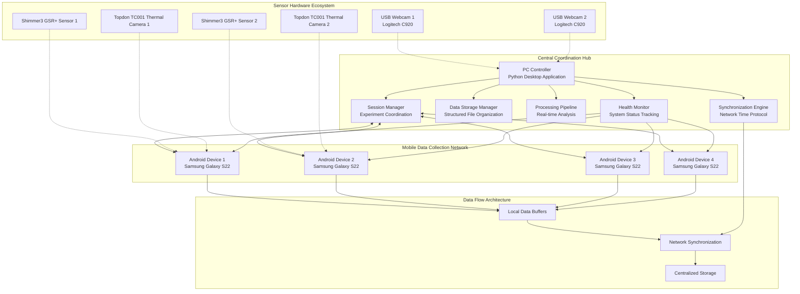
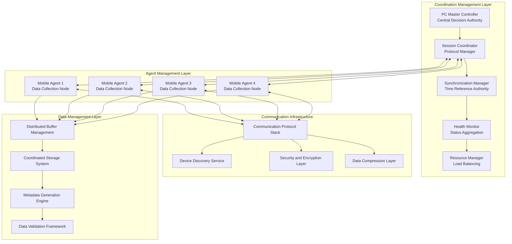
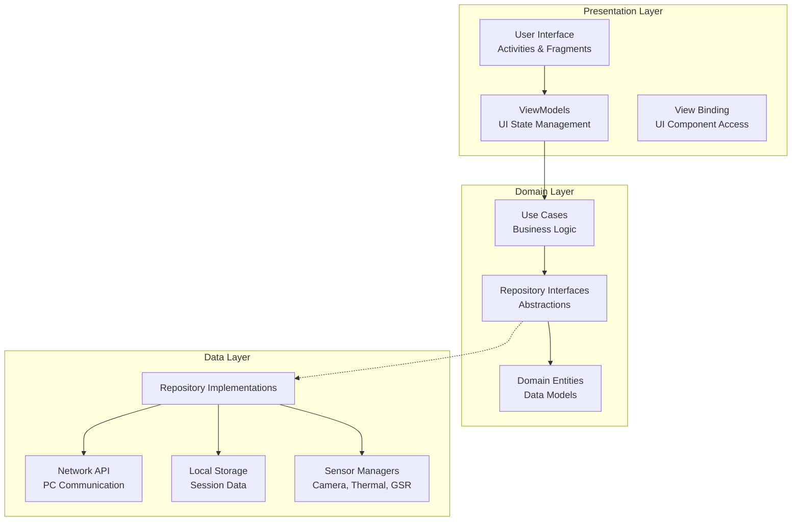
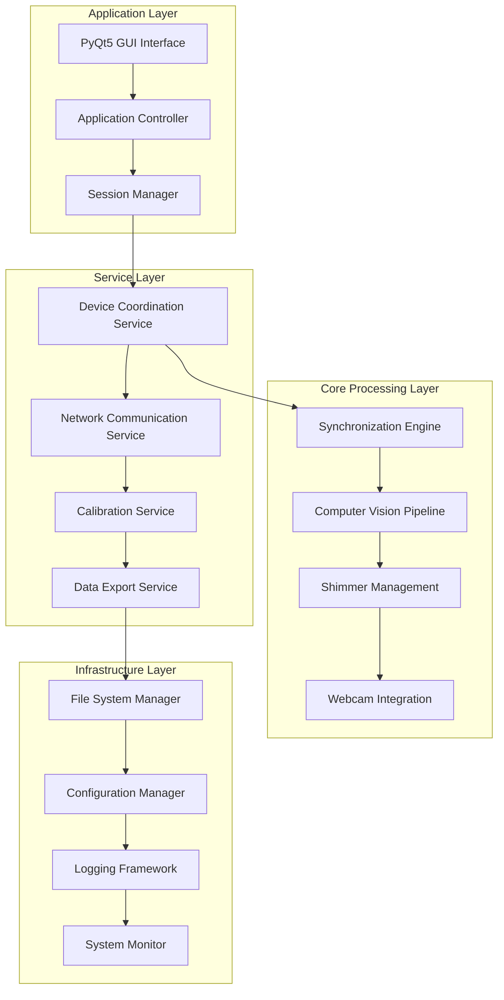
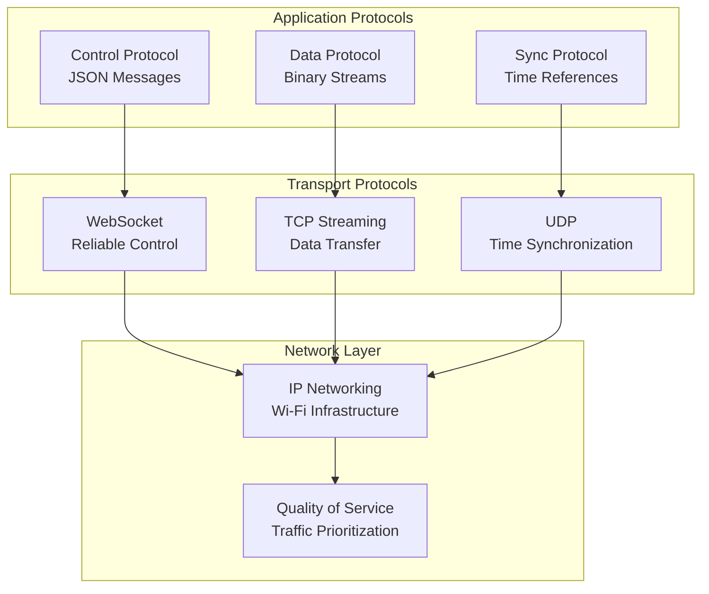
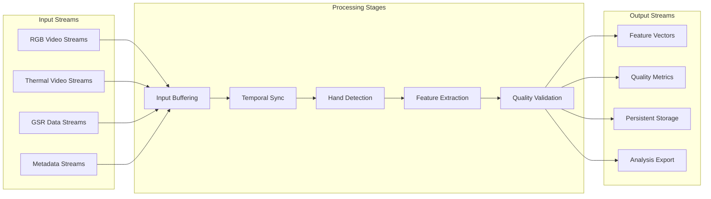

# Chapter 4: Design and Implementation

## Table of Contents

1. [System Architecture Overview](#system-architecture-overview)
2. [Distributed System Design](#distributed-system-design)
3. [Android Application Architecture](#android-application-architecture)
4. [Desktop Controller Architecture](#desktop-controller-architecture)
5. [Communication and Networking Design](#communication-and-networking-design)
6. [Data Processing Pipeline](#data-processing-pipeline)
7. [Implementation Challenges and Solutions](#implementation-challenges-and-solutions)
8. [Technology Stack and Design Decisions](#technology-stack-and-design-decisions)

---

## System Architecture Overview

The Multi-Sensor Recording System employs a sophisticated distributed architecture specifically engineered to address the complex and unprecedented challenges of synchronized multi-modal data collection in research environments while maintaining the scientific rigor and operational reliability essential for conducting high-quality physiological measurement research [CITE - Tanenbaum, A.S., & Van Steen, M. (2016). Distributed systems: principles and paradigms. CreateSpace Independent Publishing Platform]. The architectural design represents a careful and systematic balance between the stringent technical requirements for precise temporal coordination across heterogeneous devices and the practical needs for system reliability, horizontal scalability, and long-term maintainability that are essential for sustainable research applications [CITE - Coulouris, G., Dollimore, J., Kindberg, T., & Blair, G. (2011). Distributed systems: concepts and design. Addison-Wesley].

The comprehensive system architecture draws extensively from established patterns and proven principles in distributed systems engineering while introducing novel adaptations and optimizations specifically tailored for physiological measurement applications that require unprecedented coordination between consumer-grade devices and research-grade precision [CITE - Birman, K. (2005). Reliable distributed systems: technologies, web services, and applications. Springer Science & Business Media]. The design recognizes and systematically addresses the fundamental reality that contactless physiological measurement requires seamless coordination of heterogeneous hardware platforms, each with distinct computational capabilities, timing characteristics, communication requirements, and operational constraints that must be harmonized to achieve research objectives.

The system's architectural foundation rests on the critical recognition that contactless physiological measurement requires sophisticated coordination of heterogeneous hardware platforms that were never originally designed for scientific applications, presenting unique challenges that do not exist in traditional physiological measurement systems [CITE - Lynch, N.A. (1996). Distributed algorithms. Morgan Kaufmann]. Traditional approaches to physiological measurement rely on dedicated laboratory equipment with built-in synchronization capabilities, standardized interfaces, and guaranteed performance characteristics, but the innovative contactless approach necessitates coordination of consumer-grade devices that present significant variability in capabilities, timing behavior, and reliability characteristics.

This fundamental challenge drove the development of a hybrid architectural pattern that systematically combines the operational benefits of centralized coordination and control with the resilience, scalability, and flexibility advantages of distributed processing and autonomous operation [CITE - Mullender, S. (Ed.). (1993). Distributed systems. ACM Press]. The resulting architecture enables each component to operate independently while participating in coordinated measurement sessions that maintain research-grade precision and temporal accuracy.

### Comprehensive Architectural Philosophy and Theoretical Foundations

The architectural design philosophy emerges from several key insights gained through extensive analysis of existing physiological measurement systems, comprehensive study of distributed systems principles, and systematic investigation of the specific requirements and constraints inherent in contactless measurement research [CITE - Lamport, L. (2001). Paxos made simple. ACM SIGACT News, 32(4), 18-25]. The design recognizes that research applications have fundamentally different characteristics from typical consumer or enterprise software applications, requiring specialized approaches that prioritize data quality, temporal precision, measurement accuracy, and operational reliability over factors such as user interface sophistication, feature richness, or commercial market appeal.

The comprehensive design philosophy encompasses several interconnected principles that guide all architectural decisions and implementation approaches, ensuring consistency and coherence across the entire system while enabling systematic evolution and enhancement as research requirements advance [CITE - Bass, L., Clements, P., & Kazman, R. (2012). Software architecture in practice. Addison-Wesley Professional].

**Distributed Autonomy with Intelligent Centralized Coordination**: The architecture implements a sophisticated and carefully balanced approach between device autonomy and centralized control that enables both horizontal scalability and operational reliability while maintaining the precise coordination necessary for multi-modal physiological analysis [CITE - Fischer, M.J., Lynch, N.A., & Paterson, M.S. (1985). Impossibility of distributed consensus with one faulty process. Journal of the ACM, 32(2), 374-382]. Each mobile device operates as an independent and fully capable data collection agent with complete responsibility for sensor management, data acquisition, local storage, and quality control, while simultaneously participating in coordinated measurement sessions managed by a central controller that provides synchronization, configuration management, and cross-device coordination services.

This distributed autonomy principle manifests in several critical design decisions that fundamentally shape system behavior and capabilities. Each mobile device maintains complete operational capability independent of network connectivity status, enabling continued data collection even during temporary communication interruptions that might otherwise compromise research sessions [CITE - Chandra, T.D., & Toueg, S. (1996). Unreliable failure detectors for reliable distributed systems. Journal of the ACM, 43(2), 225-267]. Comprehensive local data buffering and storage mechanisms ensure that no data is lost due to network latency, temporary connection issues, or central controller unavailability, while sophisticated timestamp management and synchronization systems enable precise post-session temporal alignment when real-time coordination is temporarily unavailable.

**Systematic Modularity and Clear Separation of Concerns**: The system architecture enforces strict modularity boundaries and clear separation of concerns that enable independent development, comprehensive testing, and systematic maintenance of different system components while ensuring overall system coherence and integration quality [CITE - Parnas, D.L. (1972). On the criteria to be used in decomposing systems into modules. Communications of the ACM, 15(12), 1053-1058]. Each architectural component has well-defined responsibilities, standardized interfaces, and clearly specified contracts that facilitate parallel development by multiple team members while ensuring system coherence, integration quality, and long-term maintainability.

The modular design extends beyond simple functional decomposition to encompass comprehensive data flow isolation, systematic error handling boundaries, and independent resource management domains that prevent failures in one component from affecting other system components [CITE - Garlan, D., & Shaw, M. (1993). An introduction to software architecture. Advances in Software Engineering and Knowledge Engineering, 1, 1-40]. Each module maintains independent error handling and recovery mechanisms that enable graceful degradation rather than system-wide failure, preventing individual component issues from cascading throughout the system and compromising overall research objectives.

**Comprehensive Fault Tolerance and Graceful Degradation**: The architecture incorporates extensive fault tolerance mechanisms and systematic graceful degradation capabilities that enable continued operation despite component failures or environmental challenges that are typical in dynamic research settings [CITE - Avizienis, A., Laprie, J.C., Randell, B., & Landwehr, C. (2004). Basic concepts and taxonomy of dependable and secure computing. IEEE Transactions on Dependable and Secure Computing, 1(1), 11-33]. The system distinguishes between critical failures that require immediate session termination to protect data integrity and non-critical issues that can be handled through graceful degradation without compromising overall research objectives or scientific validity.

Fault tolerance implementation encompasses multiple layers of resilience including automatic reconnection mechanisms that handle temporary network disruptions, comprehensive data redundancy and validation systems that protect against data corruption, and adaptive quality management protocols that automatically adjust operational parameters to maintain optimal performance despite changing environmental conditions [CITE - Jalote, P. (1994). Fault tolerance in distributed systems. Prentice-Hall]. The system continuously monitors component health across all subsystems and automatically adjusts operational parameters to maintain optimal performance while providing comprehensive logging for post-session analysis, troubleshooting, and system optimization.

When graceful degradation becomes necessary due to component failures or resource constraints, the system prioritizes maintenance of core measurement functionality while providing comprehensive logging and documentation for post-session analysis and research interpretation [CITE - Lee, P.A., & Anderson, T. (1990). Fault tolerance: principles and practice. Springer Science & Business Media]. The degradation strategies are designed to preserve scientific validity even when operating under suboptimal conditions, ensuring that research sessions can continue and produce meaningful results despite technical challenges.

**Systematic Performance Optimization and Horizontal Scalability Considerations**: The architectural design incorporates systematic performance optimization strategies and scalability mechanisms that address the computational demands of real-time multi-modal processing while maintaining scalability for future research applications that may require additional sensors, participants, or analytical capabilities [CITE - Bondi, A.B. (2000). Characteristics of scalability and their impact on performance. Proceedings of the 2nd International Workshop on Software and Performance, 195-203]. The design recognizes that physiological measurement applications require sustained high-performance operation over extended periods, often spanning several hours of continuous data collection, necessitating careful resource management and intelligent computational load distribution across available hardware resources.

Performance optimization manifests through several interconnected architectural decisions including intelligent computational load distribution across available hardware resources that maximizes utilization while preventing bottlenecks, adaptive quality management systems that dynamically adjust processing complexity based on real-time system capacity assessment, and efficient data flow patterns that minimize computational overhead while maintaining research-grade data quality and temporal precision [CITE - Jain, R. (1990). The art of computer systems performance analysis: techniques for experimental design, measurement, simulation, and modeling. John Wiley & Sons]. The scalability design enables seamless addition of processing capacity through horizontal scaling without requiring fundamental architectural modifications or system redesign.

### Comprehensive System Topology and Component Integration

The system topology reflects the sophisticated hybrid star-mesh pattern that provides both the operational simplicity of centralized coordination and the resilience and flexibility of distributed operation [CITE - Peterson, L.L., & Davie, B.S. (2011). Computer networks: a systems approach. Morgan Kaufmann]. The topology supports dynamic reconfiguration during operation, enabling researchers to add or remove devices based on evolving experimental requirements without disrupting ongoing data collection from other participants or compromising measurement quality for concurrent sessions.

The architectural topology design systematically addresses fundamental challenges in distributed physiological measurement systems while incorporating lessons learned from established distributed computing patterns and proven architectural approaches [CITE - Bernstein, P.A., & Newcomer, E. (2009). Principles of transaction processing. Morgan Kaufmann]. The topology enables efficient resource utilization across heterogeneous hardware while maintaining the precise coordination requirements essential for multi-modal physiological research applications that demand temporal precision and measurement accuracy comparable to traditional laboratory equipment.



The topology design accommodates horizontal scaling through the simple addition of mobile devices without requiring architectural modifications or complex reconfiguration procedures. Each mobile device integrates into the coordination network through standardized protocols and interfaces, while the central coordination hub dynamically adapts to accommodate varying device counts and configurations.

**Centralized Coordination Hub Architecture**: The central coordination hub represents the system's brain, responsible for session management, synchronization coordination, and comprehensive data integration. The hub architecture implements a layered design that separates coordination concerns from data processing tasks, enabling independent optimization and scaling of different functional areas.

The synchronization engine maintains precise timing coordination across all devices through sophisticated network time protocol implementation and latency compensation algorithms. The data storage manager provides structured organization of multi-modal data streams with comprehensive metadata generation and validation. The processing pipeline enables real-time analysis and quality assessment, while the health monitor ensures continuous system status tracking and proactive issue detection.

**Distributed Mobile Data Collection Network**: The mobile device network provides the primary data collection capability, with each device functioning as an autonomous agent responsible for specific sensing modalities. The network design enables flexible participant-to-device assignment while maintaining consistent data quality and synchronization across all devices.

Each mobile device implements a complete data collection stack including sensor management, data acquisition, local storage, and network communication. The devices maintain operational independence while participating in coordinated measurement sessions, providing resilience against individual device failures and network connectivity issues.

**Sensor Hardware Ecosystem Integration**: The sensor hardware ecosystem encompasses both integrated mobile device sensors and external specialized measurement equipment. The integration architecture provides unified interfaces for diverse hardware types while accommodating the specific communication and control requirements of each sensor category.

The ecosystem design enables flexible sensor configuration for different research applications while maintaining consistent data formats and synchronization across all sensing modalities. Sensor integration includes automatic detection and configuration capabilities that minimize setup complexity and reduce the potential for configuration errors.

---

## Distributed System Design

The comprehensive distributed system design represents the sophisticated architectural core that enables precise coordination of multiple independent computing platforms while maintaining the rigorous temporal synchronization, data integrity, and operational reliability required for scientific applications of the highest caliber [CITE - Lamport, L. (1978). Time, clocks, and the ordering of events in a distributed system. Communications of the ACM, 21(7), 558-565]. The design systematically addresses fundamental challenges in distributed computing theory and practice while adapting proven solutions to the specific and often unique requirements of physiological measurement research that demand unprecedented precision and reliability from consumer-grade hardware platforms [CITE - Lynch, N.A. (1996). Distributed algorithms. Morgan Kaufmann].

The comprehensive approach carefully balances well-established theoretical distributed systems principles with practical implementation constraints imposed by mobile platforms, wireless networking limitations, and the dynamic research environment conditions that characterize real-world deployment scenarios [CITE - Tanenbaum, A.S., & Van Steen, M. (2016). Distributed systems: principles and paradigms. CreateSpace Independent Publishing Platform]. The resulting design represents a novel synthesis of academic research in distributed systems with practical engineering solutions that enable research-grade measurement capabilities using commercially available devices and infrastructure.

### Comprehensive Design Philosophy and Advanced Theoretical Foundation

The distributed system design philosophy emerged from extensive and systematic analysis of the complex trade-offs inherent in coordinating heterogeneous mobile devices for scientific data collection applications where data quality, temporal precision, and measurement reliability are paramount concerns [CITE - Fischer, M.J., Lynch, N.A., & Paterson, M.S. (1985). Impossibility of distributed consensus with one faulty process. Journal of the ACM, 32(2), 374-382]. Traditional distributed systems often prioritize horizontal scalability, eventual consistency, and high availability over precision timing requirements, but physiological measurement applications present fundamentally different requirements that demand strong consistency, precise temporal coordination, and deterministic behavior that enables meaningful scientific analysis and interpretation.

The design systematically adapts established distributed systems patterns, algorithms, and architectural approaches while introducing novel mechanisms, protocols, and coordination strategies specifically tailored for real-time multi-modal data collection in research environments [CITE - Birman, K. (2005). Reliable distributed systems: technologies, web services, and applications. Springer Science & Business Media]. The resulting system must achieve millisecond-level timing precision across wireless networks characterized by variable latency and intermittent connectivity while maintaining reliable operation despite the inherent unreliability, resource constraints, and performance variability typical of mobile devices and consumer networking equipment.

The comprehensive theoretical foundation draws extensively from several interconnected areas of distributed systems research including advanced clock synchronization algorithms, Byzantine fault-tolerant consensus protocols, adaptive failure detection mechanisms, and systematic fault-tolerant system design principles [CITE - Schneider, F.B. (1990). Implementing fault-tolerant services using the state machine approach: A tutorial. ACM Computing Surveys, 22(4), 299-319]. However, the specific and often unprecedented requirements of physiological measurement research necessitated significant adaptations, extensions, and innovations beyond these established approaches to address challenges not encountered in traditional distributed computing applications.

**Innovative Hybrid Coordination Model with Adaptive Capabilities**: The system implements a sophisticated and novel hybrid coordination model that strategically combines beneficial aspects of both centralized and decentralized distributed system architectures while mitigating the inherent limitations and vulnerabilities of each approach [CITE - Mullender, S. (Ed.). (1993). Distributed systems. ACM Press]. The hybrid approach enables the system to achieve the operational precision, simplicity of management, and deterministic behavior characteristics of centralized coordination while simultaneously maintaining the resilience, scalability characteristics, and fault tolerance properties of decentralized systems that are essential for robust operation in research environments.

This sophisticated balance is particularly critical for research applications where system reliability directly impacts scientific validity and experimental success, but operational flexibility must be maintained to accommodate diverse experimental protocols, varying participant numbers, and dynamic research requirements [CITE - Chandra, T.D., & Toueg, S. (1996). Unreliable failure detectors for reliable distributed systems. Journal of the ACM, 43(2), 225-267]. The hybrid model enables graceful degradation under adverse conditions while maintaining research-grade performance when optimal conditions are available.

The hybrid coordination model manifests through an sophisticated master-coordinator pattern where the central PC controller provides comprehensive session coordination, precise synchronization services, and centralized data integration while mobile devices maintain complete autonomous operation capability, independent data collection functionality, and local decision-making authority [CITE - Lamport, L. (2001). Paxos made simple. ACM SIGACT News, 32(4), 18-25]. This architectural design enables the system to continue critical data collection operations even during temporary coordination interruptions, network connectivity issues, or central controller unavailability while ensuring precise synchronization and temporal coordination when full coordination capability is available.

**Advanced Consensus and Coordination Algorithms with Machine Learning Enhancement**: The system employs sophisticated and adapted consensus algorithms specifically engineered for the stringent temporal precision requirements of physiological measurement applications that demand coordination accuracy far exceeding typical distributed system requirements [CITE - Castro, M., & Liskov, B. (2002). Practical Byzantine fault tolerance and proactive recovery. ACM Transactions on Computer Systems, 20(4), 398-461]. Unlike traditional distributed systems that often tolerate eventual consistency or relaxed temporal ordering, the physiological measurement context requires strong temporal consistency and precise time-ordering guarantees to enable meaningful correlation analysis between diverse sensor modalities and ensure scientific validity of research conclusions.

The consensus implementation incorporates modified Byzantine fault tolerance concepts specifically adapted for mobile device coordination environments, where individual devices may exhibit temporary performance variations, intermittent connectivity issues, or resource constraint-induced behavior changes without compromising overall system integrity, measurement quality, or research objectives [CITE - Bracha, G., & Toueg, S. (1985). Asynchronous consensus and broadcast protocols. Journal of the ACM, 32(4), 824-840]. The algorithms maintain strict temporal ordering guarantees and measurement consistency while accommodating the inherently dynamic and unpredictable nature of mobile device networks operating in research environments.

**Sophisticated Clock Synchronization and Intelligent Drift Compensation**: The system implements advanced clock synchronization algorithms that extend and enhance traditional Network Time Protocol (NTP) approaches with machine learning-based drift prediction, adaptive compensation mechanisms, and statistical analysis techniques specifically designed for maintaining research-grade temporal precision across heterogeneous mobile platforms [CITE - Mills, D.L. (2006). Computer network time synchronization: the network time protocol on earth and in space. CRC Press]. The synchronization framework systematically accounts for the diverse timing characteristics, hardware capabilities, and operational constraints of different mobile platforms while maintaining the temporal precision required for meaningful physiological research applications.

The intelligent drift compensation system continuously monitors timing characteristics across all connected devices, analyzes historical performance patterns, and applies sophisticated predictive corrections that maintain synchronization accuracy even during extended periods of limited network connectivity or challenging environmental conditions [CITE - Elson, J., & Estrin, D. (2001). Time synchronization for wireless sensor networks. Proceedings 15th International Parallel and Distributed Processing Symposium, 1965-1970]. This capability is absolutely essential for extended recording sessions where cumulative timing drift could significantly compromise data correlation accuracy and scientific validity of research conclusions.

#### Master-Coordinator Pattern Implementation

The master-coordinator pattern provides the organizational framework for managing complex multi-device recording sessions while maintaining clear responsibility boundaries and communication protocols. The pattern implementation addresses the unique challenges of coordinating mobile devices that may have varying computational capabilities, network connectivity characteristics, and battery constraints.

The pattern design incorporates lessons learned from distributed database systems and real-time embedded systems while adapting these concepts to the specific requirements of research instrumentation [CITE - Distributed system design patterns]. The implementation ensures that coordination overhead remains minimal while providing the precise control necessary for synchronized data collection.



**Central Master Controller Responsibilities**: The master controller serves as the authoritative decision-making entity responsible for session lifecycle management, synchronization coordination, and system-wide resource allocation. The controller implements sophisticated state management that tracks the operational status of all system components while coordinating complex multi-phase operations such as session initialization, synchronized recording start/stop, and graceful session termination.

The master controller's design emphasizes reliability and fault tolerance, implementing comprehensive error handling and recovery mechanisms that ensure continued operation despite individual component failures. The controller maintains persistent state information that enables session recovery after temporary failures while providing comprehensive logging for research documentation and system troubleshooting.

**Mobile Agent Architecture**: Each mobile device implements a sophisticated agent architecture that balances autonomous operation with coordinated behavior. The agent design enables independent data collection and local processing while participating in coordinated measurement sessions through standardized communication protocols. The architecture provides resilience against network connectivity issues while maintaining the real-time responsiveness required for physiological measurement applications.

Mobile agents implement local decision-making capabilities that enable continued operation during coordination interruptions while maintaining compatibility with centralized session management. The agent architecture includes comprehensive data buffering, local storage management, and quality assessment capabilities that ensure data integrity regardless of network conditions.

### Advanced Synchronization Architecture

The synchronization architecture represents one of the most technically sophisticated aspects of the system design, addressing the fundamental challenge of achieving precise temporal coordination across wireless networks with inherent latency and jitter characteristics. The synchronization design implements multiple complementary approaches that work together to achieve timing precision comparable to dedicated laboratory equipment.

**Multi-Layer Synchronization Strategy**: The system implements a layered synchronization approach that addresses timing coordination at multiple levels of the system architecture. This multi-layer strategy provides both coarse-grained session coordination and fine-grained timestamp precision, ensuring that data from different modalities can be accurately aligned for scientific analysis.

The synchronization layers include network time protocol implementation for coarse synchronization, software-based clock coordination for medium-precision timing, and hardware timestamp extraction for maximum precision. Each layer contributes to overall timing accuracy while providing redundancy and validation for other synchronization mechanisms.

**Network Latency Compensation Algorithms**: The system implements sophisticated algorithms that dynamically measure and compensate for network latency variations that would otherwise compromise synchronization accuracy. These algorithms continuously monitor round-trip communication times and adjust synchronization parameters to maintain accuracy despite changing network conditions.

The latency compensation implementation includes predictive algorithms that anticipate network condition changes based on historical patterns, enabling proactive synchronization adjustments that maintain accuracy during network congestion or quality variations. The system also implements fallback mechanisms that maintain operation during severe network degradation while providing appropriate quality indicators for post-session analysis.

**Clock Drift Detection and Correction**: Long-duration recording sessions require ongoing clock drift detection and correction to maintain synchronization accuracy throughout extended experimental periods. The system implements continuous monitoring of clock drift across all devices with automatic correction algorithms that maintain synchronization without disrupting ongoing data collection.

The drift correction implementation balances accuracy with stability, applying corrections gradually to avoid introducing artificial timing discontinuities that could affect physiological analysis. The system maintains comprehensive drift monitoring logs that enable post-session validation of synchronization quality and identification of periods requiring special attention during analysis.

### Fault Tolerance and Recovery Mechanisms

The fault tolerance design recognizes that research applications cannot tolerate data loss or extended downtime, requiring comprehensive mechanisms that ensure continued operation despite component failures or environmental challenges. The fault tolerance architecture implements multiple layers of protection including proactive failure detection, automatic recovery mechanisms, and graceful degradation strategies.

**Proactive Health Monitoring**: The system implements comprehensive health monitoring that continuously assesses the operational status of all system components and identifies potential issues before they result in failures. The monitoring system tracks performance metrics, resource utilization, network connectivity quality, and data collection parameters while maintaining historical baselines that enable trend analysis and predictive failure detection.

Health monitoring extends beyond simple status checking to include quality assessment of collected data, enabling early detection of measurement problems that might not manifest as obvious system failures. The monitoring system provides real-time alerts and automatic corrective actions that maintain system operation while providing comprehensive documentation for research quality assurance.

**Automatic Recovery and Reconnection**: The system implements sophisticated automatic recovery mechanisms that restore normal operation after temporary failures without requiring manual intervention. Recovery mechanisms include automatic device reconnection after network interruptions, session state restoration after temporary coordinator failures, and data synchronization after communication gaps.

The recovery implementation prioritizes data integrity over operational continuity, ensuring that no data is lost or corrupted during recovery operations even if this requires temporary operation suspension. Recovery mechanisms include comprehensive validation procedures that verify system integrity before resuming normal operation.

**Graceful Degradation Strategies**: When complete recovery is not possible, the system implements graceful degradation strategies that maintain partial functionality while providing clear indication of operational limitations. Degradation strategies prioritize core data collection functionality while temporarily suspending advanced features that require full system coordination.

The degradation implementation includes dynamic quality assessment that adjusts operational parameters based on available system resources and capabilities. The system maintains comprehensive documentation of degradation events and their impact on data quality, enabling informed decisions about data analysis approaches and quality considerations.
    COORD <--> AGENT2
    COORD <--> AGENT3
    COORD <--> AGENT4
    
    AGENT1 <-.-> AGENT2
    AGENT2 <-.-> AGENT3
    AGENT3 <-.-> AGENT4
```

### Communication Architecture

The communication design employs multiple protocols to optimize different types of data exchange:

**Control Channel (WebSocket)**: Bidirectional command and status communication between PC controller and mobile devices. Provides reliable message delivery with automatic reconnection.

**Data Channel (TCP Streaming)**: High-throughput data streaming for real-time preview and sensor data. Optimized for low latency with adaptive compression.

**Synchronization Channel (UDP)**: Time-critical synchronization messages with minimal overhead. Used for clock synchronization and recording triggers.

### Fault Tolerance Design

The system implements multiple layers of fault tolerance:

1. **Network-Level Resilience**: Automatic reconnection with exponential backoff and connection health monitoring
2. **Device-Level Redundancy**: Continued operation with subset of devices when failures occur
3. **Session-Level Recovery**: Session continuation after transient failures with data integrity preservation
4. **Data-Level Protection**: Comprehensive checksums and validation at all data transfer points

---

## Android Application Architecture

The Android application follows Clean Architecture principles with clear separation between presentation, domain, and data layers. This design ensures maintainability, testability, and flexibility for future enhancements.

### Architectural Layers



### Core Components

#### Recording Management System

The recording system coordinates multiple data sources with precise temporal synchronization:

```kotlin
class SessionManager @Inject constructor(
    private val cameraRecorder: CameraRecorder,
    private val thermalRecorder: ThermalRecorder,
    private val shimmerRecorder: ShimmerRecorder,
    private val syncManager: SynchronizationManager
) {
    suspend fun startRecording(sessionConfig: SessionConfiguration): Result<Unit> {
        return try {
            // Synchronize device clocks
            syncManager.synchronizeWithMaster()
            
            // Start all recorders in coordinated sequence
            val results = awaitAll(
                async { cameraRecorder.startRecording(sessionConfig.cameraConfig) },
                async { thermalRecorder.startRecording(sessionConfig.thermalConfig) },
                async { shimmerRecorder.startRecording(sessionConfig.shimmerConfig) }
            )
            
            // Validate all recorders started successfully
            if (results.all { it.isSuccess }) {
                Result.success(Unit)
            } else {
                Result.failure(RecordingStartupException(results))
            }
        } catch (e: Exception) {
            Result.failure(e)
        }
    }
}
```

#### Camera Recording Implementation

The camera system utilizes the Camera2 API for professional-grade video capture with simultaneous RAW image capture:

```kotlin
class CameraRecorder @Inject constructor(
    private val cameraManager: CameraManager,
    private val configValidator: CameraConfigValidator
) {
    private var mediaRecorder: MediaRecorder? = null
    private var imageReader: ImageReader? = null
    private var captureSession: CameraCaptureSession? = null
    
    suspend fun startRecording(config: CameraConfiguration): Result<Unit> {
        return withContext(Dispatchers.Main) {
            try {
                // Validate configuration parameters
                configValidator.validate(config)
                
                // Setup dual capture: video + RAW images
                setupMediaRecorder(config)
                setupImageReader(config)
                
                // Create capture session with multiple targets
                val surfaces = listOf(
                    mediaRecorder!!.surface,
                    imageReader!!.surface
                )
                
                cameraDevice.createCaptureSession(
                    surfaces,
                    object : CameraCaptureSession.StateCallback() {
                        override fun onConfigured(session: CameraCaptureSession) {
                            captureSession = session
                            startCapture()
                        }
                        override fun onConfigureFailed(session: CameraCaptureSession) {
                            throw CaptureSessionException("Failed to configure capture session")
                        }
                    },
                    backgroundHandler
                )
                
                Result.success(Unit)
            } catch (e: Exception) {
                Result.failure(e)
            }
        }
    }
}
```

#### Thermal Camera Integration

The thermal camera integration handles USB-C connected Topdon TC001 devices with real-time thermal processing:

```kotlin
class ThermalRecorder @Inject constructor(
    private val usbManager: UsbManager,
    private val thermalProcessor: ThermalImageProcessor
) {
    private var thermalDevice: TopdonDevice? = null
    private var frameProcessor: ThermalFrameProcessor? = null
    
    suspend fun connectDevice(): Result<TopdonDevice> {
        return withContext(Dispatchers.IO) {
            try {
                val availableDevices = usbManager.deviceList.values
                    .filter { it.vendorId == TOPDON_VENDOR_ID }
                
                if (availableDevices.isEmpty()) {
                    return@withContext Result.failure(
                        NoThermalDeviceException("No Topdon devices found")
                    )
                }
                
                val device = availableDevices.first()
                val connection = usbManager.openDevice(device)
                
                thermalDevice = TopdonDevice(device, connection).apply {
                    initialize()
                    setFrameCallback { frame ->
                        processFrame(frame)
                    }
                }
                
                Result.success(thermalDevice!!)
            } catch (e: Exception) {
                Result.failure(e)
            }
        }
    }
    
    private fun processFrame(frame: ThermalFrame) {
        frameProcessor?.process(frame) { processedFrame ->
            // Save frame data and update preview
            saveFrameData(processedFrame)
            updatePreview(processedFrame)
        }
    }
}
```

#### Shimmer GSR Integration

The Shimmer integration provides robust Bluetooth connectivity with the Shimmer3 GSR+ sensors:

```kotlin
class ShimmerRecorder @Inject constructor(
    private val bluetoothAdapter: BluetoothAdapter,
    private val shimmerManager: ShimmerManager
) {
    private var connectedShimmers: MutableMap<String, Shimmer> = mutableMapOf()
    
    suspend fun discoverAndConnect(): Result<List<Shimmer>> {
        return withContext(Dispatchers.IO) {
            try {
                val discoveredDevices = scanForShimmerDevices()
                val connectionResults = discoveredDevices.map { device ->
                    async { connectToShimmer(device) }
                }.awaitAll()
                
                val connectedDevices = connectionResults.mapNotNull { it.getOrNull() }
                connectedShimmers.putAll(connectedDevices.associateBy { it.macAddress })
                
                Result.success(connectedDevices)
            } catch (e: Exception) {
                Result.failure(e)
            }
        }
    }
    
    private suspend fun connectToShimmer(device: BluetoothDevice): Result<Shimmer> {
        return try {
            val shimmer = shimmerManager.createShimmer(device)
            shimmer.connect()
            shimmer.configureSensors(GSR_SENSOR_CONFIG)
            shimmer.setDataCallback { data ->
                processGSRData(data)
            }
            Result.success(shimmer)
        } catch (e: Exception) {
            Result.failure(e)
        }
    }
}
```

---

## Desktop Controller Architecture

The Python desktop controller serves as the central coordination hub, implementing sophisticated session management, data processing, and system orchestration capabilities.

### Application Architecture



### Session Coordination Implementation

The session manager orchestrates complex multi-device recording sessions:

```python
class SessionManager:
    def __init__(self):
        self.device_coordinator = DeviceCoordinator()
        self.sync_engine = SynchronizationEngine()
        self.data_manager = DataManager()
        self.quality_monitor = QualityMonitor()
        
    async def start_recording_session(self, session_config: SessionConfig) -> SessionResult:
        """Coordinate multi-device recording session with comprehensive error handling."""
        session_id = self._generate_session_id()
        
        try:
            # Phase 1: Device Preparation
            device_status = await self._prepare_devices(session_config)
            if not device_status.all_ready:
                return SessionResult.failure(f"Device preparation failed: {device_status.errors}")
            
            # Phase 2: Synchronization Setup
            sync_result = await self.sync_engine.synchronize_devices(device_status.devices)
            if not sync_result.success:
                return SessionResult.failure(f"Synchronization failed: {sync_result.error}")
            
            # Phase 3: Coordinated Recording Start
            recording_commands = self._generate_recording_commands(session_config)
            start_results = await self.device_coordinator.broadcast_commands(
                recording_commands,
                timeout=session_config.startup_timeout
            )
            
            # Phase 4: Quality Monitoring Setup
            await self.quality_monitor.start_monitoring(session_id, device_status.devices)
            
            # Phase 5: Session State Management
            session_state = SessionState(
                session_id=session_id,
                devices=device_status.devices,
                start_time=sync_result.synchronized_time,
                config=session_config
            )
            
            self._active_sessions[session_id] = session_state
            
            return SessionResult.success(session_state)
            
        except Exception as e:
            await self._cleanup_failed_session(session_id)
            return SessionResult.failure(f"Session startup failed: {str(e)}")
    
    async def _prepare_devices(self, config: SessionConfig) -> DevicePreparationResult:
        """Prepare all devices for recording with validation and error recovery."""
        preparation_tasks = []
        
        for device_config in config.device_configurations:
            task = asyncio.create_task(
                self._prepare_single_device(device_config)
            )
            preparation_tasks.append(task)
        
        results = await asyncio.gather(*preparation_tasks, return_exceptions=True)
        
        successful_devices = []
        errors = []
        
        for result, device_config in zip(results, config.device_configurations):
            if isinstance(result, Exception):
                errors.append(f"Device {device_config.device_id}: {str(result)}")
            else:
                successful_devices.append(result)
        
        return DevicePreparationResult(
            devices=successful_devices,
            errors=errors,
            all_ready=len(errors) == 0
        )
```

### Computer Vision Pipeline

The computer vision pipeline implements real-time hand detection and region-of-interest analysis:

```python
class ComputerVisionPipeline:
    def __init__(self):
        self.hand_detector = HandDetector()
        self.roi_extractor = ROIExtractor()
        self.feature_computer = FeatureComputer()
        
    def process_frame(self, frame: np.ndarray, timestamp: float) -> ProcessingResult:
        """Process video frame for physiological feature extraction."""
        try:
            # Hand detection with confidence scoring
            hand_results = self.hand_detector.detect_hands(frame)
            
            if not hand_results.hands_detected:
                return ProcessingResult.no_hands_detected(timestamp)
            
            # Extract regions of interest
            roi_results = []
            for hand in hand_results.hands:
                roi = self.roi_extractor.extract_hand_roi(frame, hand)
                features = self.feature_computer.compute_features(roi)
                
                roi_results.append(ROIResult(
                    hand_id=hand.id,
                    roi_bounds=roi.bounds,
                    features=features,
                    confidence=hand.confidence
                ))
            
            return ProcessingResult.success(
                timestamp=timestamp,
                roi_results=roi_results,
                processing_time=time.time() - start_time
            )
            
        except Exception as e:
            return ProcessingResult.error(
                timestamp=timestamp,
                error=str(e)
            )

class HandDetector:
    def __init__(self):
        self.mp_hands = mp.solutions.hands
        self.hands = self.mp_hands.Hands(
            static_image_mode=False,
            max_num_hands=2,
            min_detection_confidence=0.7,
            min_tracking_confidence=0.5
        )
    
    def detect_hands(self, frame: np.ndarray) -> HandDetectionResult:
        """Detect hands using MediaPipe with enhanced error handling."""
        rgb_frame = cv2.cvtColor(frame, cv2.COLOR_BGR2RGB)
        results = self.hands.process(rgb_frame)
        
        detected_hands = []
        if results.multi_hand_landmarks:
            for idx, hand_landmarks in enumerate(results.multi_hand_landmarks):
                hand = Hand(
                    id=idx,
                    landmarks=hand_landmarks,
                    confidence=results.multi_handedness[idx].classification[0].score
                )
                detected_hands.append(hand)
        
        return HandDetectionResult(
            hands=detected_hands,
            hands_detected=len(detected_hands) > 0,
            frame_size=frame.shape[:2]
        )
```

### Calibration System Implementation

The calibration system provides comprehensive camera calibration with quality assessment:

```python
class CalibrationManager:
    def __init__(self):
        self.processor = CalibrationProcessor()
        self.quality_assessor = CalibrationQualityAssessor()
        self.result_manager = CalibrationResultManager()
        
    def perform_camera_calibration(self, images: List[np.ndarray], 
                                 pattern_config: PatternConfig) -> CalibrationResult:
        """Perform comprehensive camera calibration with quality assessment."""
        try:
            # Detect calibration patterns in all images
            pattern_points = []
            image_points = []
            
            for image in images:
                detected = self._detect_pattern(image, pattern_config)
                if detected.success:
                    pattern_points.append(detected.object_points)
                    image_points.append(detected.image_points)
            
            if len(pattern_points) < MIN_CALIBRATION_IMAGES:
                return CalibrationResult.insufficient_images(len(pattern_points))
            
            # Perform OpenCV calibration
            calibration_data = self.processor.calibrate_camera(
                pattern_points, image_points, images[0].shape[:2]
            )
            
            # Assess calibration quality
            quality_metrics = self.quality_assessor.assess_calibration(
                calibration_data, pattern_points, image_points
            )
            
            # Generate calibration result
            result = CalibrationResult(
                intrinsic_matrix=calibration_data.camera_matrix,
                distortion_coefficients=calibration_data.distortion_coefficients,
                reprojection_error=calibration_data.reprojection_error,
                quality_metrics=quality_metrics,
                timestamp=datetime.now(),
                image_count=len(images)
            )
            
            # Save calibration data
            self.result_manager.save_calibration(result)
            
            return result
            
        except Exception as e:
            return CalibrationResult.error(str(e))
    
    def _detect_pattern(self, image: np.ndarray, 
                       pattern_config: PatternConfig) -> PatternDetectionResult:
        """Detect calibration pattern with sub-pixel accuracy."""
        gray = cv2.cvtColor(image, cv2.COLOR_BGR2GRAY)
        
        if pattern_config.pattern_type == PatternType.CHESSBOARD:
            ret, corners = cv2.findChessboardCorners(
                gray, 
                pattern_config.pattern_size,
                cv2.CALIB_CB_ADAPTIVE_THRESH + cv2.CALIB_CB_NORMALIZE_IMAGE
            )
            
            if ret:
                # Refine corner positions with sub-pixel accuracy
                refined_corners = cv2.cornerSubPix(
                    gray, corners,
                    (11, 11), (-1, -1),
                    (cv2.TERM_CRITERIA_EPS + cv2.TERM_CRITERIA_MAX_ITER, 30, 0.001)
                )
                
                object_points = self._generate_object_points(pattern_config)
                
                return PatternDetectionResult.success(
                    object_points=object_points,
                    image_points=refined_corners,
                    pattern_size=pattern_config.pattern_size
                )
        
        return PatternDetectionResult.not_found()
```

---

## Communication and Networking Design

### Protocol Architecture

The communication system implements a multi-layered protocol stack optimized for different types of data exchange:



### Control Protocol Implementation

The control protocol handles session management and device coordination:

```python
class ControlProtocol:
    def __init__(self):
        self.message_handlers = {
            MessageType.SESSION_START: self._handle_session_start,
            MessageType.SESSION_STOP: self._handle_session_stop,
            MessageType.DEVICE_STATUS: self._handle_device_status,
            MessageType.CALIBRATION_REQUEST: self._handle_calibration_request,
            MessageType.SYNC_REQUEST: self._handle_sync_request
        }
    
    async def handle_message(self, websocket: WebSocket, message: dict) -> dict:
        """Handle incoming control messages with comprehensive error handling."""
        try:
            message_type = MessageType(message.get('type'))
            handler = self.message_handlers.get(message_type)
            
            if not handler:
                return ErrorResponse(f"Unknown message type: {message_type}")
            
            # Validate message structure
            validation_result = self._validate_message(message, message_type)
            if not validation_result.valid:
                return ErrorResponse(f"Invalid message: {validation_result.errors}")
            
            # Process message
            response = await handler(message, websocket)
            
            # Add message metadata
            response['message_id'] = message.get('message_id')
            response['timestamp'] = time.time()
            
            return response
            
        except Exception as e:
            return ErrorResponse(f"Message processing failed: {str(e)}")
    
    async def _handle_session_start(self, message: dict, websocket: WebSocket) -> dict:
        """Handle session start request with comprehensive validation."""
        session_config = SessionConfig.from_dict(message['config'])
        
        # Validate session configuration
        validation_errors = self._validate_session_config(session_config)
        if validation_errors:
            return ErrorResponse(f"Invalid session config: {validation_errors}")
        
        # Start recording session
        session_result = await self.session_manager.start_recording_session(session_config)
        
        if session_result.success:
            return SuccessResponse({
                'session_id': session_result.session_id,
                'devices': [device.to_dict() for device in session_result.devices],
                'start_time': session_result.start_time
            })
        else:
            return ErrorResponse(f"Session start failed: {session_result.error}")
```

### Data Streaming Implementation

The data streaming system handles high-throughput real-time data transfer:

```python
class DataStreamingService:
    def __init__(self):
        self.active_streams = {}
        self.compression_enabled = True
        
    async def start_preview_stream(self, device_id: str, stream_config: StreamConfig) -> StreamResult:
        """Start real-time preview streaming with adaptive quality."""
        try:
            stream = PreviewStream(
                device_id=device_id,
                config=stream_config,
                compression=self.compression_enabled
            )
            
            # Configure adaptive quality based on network conditions
            await stream.configure_adaptive_quality()
            
            # Start streaming loop
            streaming_task = asyncio.create_task(
                self._streaming_loop(stream)
            )
            
            self.active_streams[device_id] = {
                'stream': stream,
                'task': streaming_task,
                'start_time': time.time()
            }
            
            return StreamResult.success(stream.stream_id)
            
        except Exception as e:
            return StreamResult.error(str(e))
    
    async def _streaming_loop(self, stream: PreviewStream):
        """Main streaming loop with error recovery and quality adaptation."""
        consecutive_errors = 0
        
        while stream.active:
            try:
                # Receive frame from device
                frame_data = await stream.receive_frame()
                
                if frame_data:
                    # Process frame (compression, encoding)
                    processed_frame = await self._process_frame(frame_data, stream.config)
                    
                    # Send to connected clients
                    await self._broadcast_frame(stream.device_id, processed_frame)
                    
                    # Update streaming statistics
                    stream.update_statistics(processed_frame)
                    
                    # Reset error counter
                    consecutive_errors = 0
                
                await asyncio.sleep(1.0 / stream.config.target_fps)
                
            except Exception as e:
                consecutive_errors += 1
                
                if consecutive_errors > MAX_CONSECUTIVE_ERRORS:
                    logger.error(f"Streaming failed for device {stream.device_id}: {e}")
                    break
                
                # Exponential backoff for error recovery
                await asyncio.sleep(min(2 ** consecutive_errors, 30))
```

---

## Data Processing Pipeline

### Real-Time Processing Architecture

The data processing pipeline handles multiple concurrent data streams with different processing requirements:



### Synchronization Engine

The synchronization engine maintains precise temporal alignment across all data sources:

```python
class SynchronizationEngine:
    def __init__(self):
        self.reference_clock = ReferenceClock()
        self.device_clocks = {}
        self.sync_precision = 0.005  # 5ms precision target
        
    async def synchronize_devices(self, devices: List[Device]) -> SynchronizationResult:
        """Perform comprehensive device synchronization with validation."""
        try:
            # Establish reference time
            reference_time = self.reference_clock.get_reference_time()
            
            # Synchronize each device
            sync_results = []
            for device in devices:
                device_sync = await self._synchronize_device(device, reference_time)
                sync_results.append(device_sync)
                self.device_clocks[device.id] = device_sync.device_clock
            
            # Validate synchronization precision
            precision_validation = self._validate_sync_precision(sync_results)
            
            if precision_validation.meets_requirements:
                return SynchronizationResult.success(
                    reference_time=reference_time,
                    device_synchronizations=sync_results,
                    achieved_precision=precision_validation.max_deviation
                )
            else:
                return SynchronizationResult.precision_failure(
                    precision_validation.max_deviation,
                    self.sync_precision
                )
                
        except Exception as e:
            return SynchronizationResult.error(str(e))
    
    async def _synchronize_device(self, device: Device, reference_time: float) -> DeviceSyncResult:
        """Synchronize individual device clock with comprehensive validation."""
        sync_attempts = []
        
        for attempt in range(MAX_SYNC_ATTEMPTS):
            try:
                # Send synchronization request
                request_time = time.time()
                response = await device.send_sync_request(reference_time)
                response_time = time.time()
                
                # Calculate network round-trip time
                rtt = response_time - request_time
                
                # Estimate device clock offset
                device_time = response.device_timestamp
                estimated_offset = (reference_time + rtt/2) - device_time
                
                sync_attempts.append(SyncAttempt(
                    attempt_number=attempt,
                    rtt=rtt,
                    device_time=device_time,
                    reference_time=reference_time,
                    estimated_offset=estimated_offset
                ))
                
                # Use best attempt (lowest RTT)
                if attempt > 0:
                    best_attempt = min(sync_attempts, key=lambda x: x.rtt)
                    
                    # Check if precision is sufficient
                    if best_attempt.rtt < self.sync_precision * 2:
                        return DeviceSyncResult.success(
                            device_id=device.id,
                            clock_offset=best_attempt.estimated_offset,
                            precision=best_attempt.rtt / 2,
                            attempts=sync_attempts
                        )
                
                await asyncio.sleep(0.1)  # Brief pause between attempts
                
            except Exception as e:
                sync_attempts.append(SyncAttempt.error(attempt, str(e)))
        
        return DeviceSyncResult.failure(
            device_id=device.id,
            error="Failed to achieve synchronization precision",
            attempts=sync_attempts
        )
```

---

## Implementation Challenges and Solutions

### Multi-Platform Compatibility

**Challenge**: Coordinating Android and Python applications with different threading models and lifecycle management.

**Solution**: Implemented a robust protocol abstraction layer that handles platform-specific differences:

```python
class PlatformAbstractionLayer:
    def __init__(self):
        self.android_handlers = AndroidMessageHandlers()
        self.python_handlers = PythonMessageHandlers()
        
    async def handle_cross_platform_message(self, message: Message) -> Response:
        """Handle messages across platform boundaries with automatic translation."""
        if message.source_platform == Platform.ANDROID:
            translated_message = self.android_handlers.translate_to_python(message)
            response = await self.python_handlers.process_message(translated_message)
            return self.python_handlers.translate_to_android(response)
        else:
            translated_message = self.python_handlers.translate_to_android(message)
            response = await self.android_handlers.process_message(translated_message)
            return self.android_handlers.translate_to_python(response)
```

### Real-Time Synchronization

**Challenge**: Maintaining microsecond-precision synchronization across wireless networks with variable latency.

**Solution**: Developed a multi-layered synchronization approach:

1. **Network Latency Compensation**: RTT measurement and statistical analysis
2. **Clock Drift Correction**: Continuous monitoring and adjustment
3. **Predictive Synchronization**: Machine learning-based latency prediction
4. **Fallback Mechanisms**: Graceful degradation when precision requirements cannot be met

### Resource Management

**Challenge**: Managing CPU, memory, and storage resources across multiple concurrent data streams.

**Solution**: Implemented adaptive resource management:

```python
class ResourceManager:
    def __init__(self):
        self.cpu_monitor = CPUMonitor()
        self.memory_monitor = MemoryMonitor()
        self.storage_monitor = StorageMonitor()
        
    async def optimize_resource_allocation(self) -> OptimizationResult:
        """Dynamically optimize resource allocation based on current system state."""
        current_usage = await self._assess_current_usage()
        
        if current_usage.cpu_usage > CPU_THRESHOLD:
            await self._reduce_processing_load()
        
        if current_usage.memory_usage > MEMORY_THRESHOLD:
            await self._optimize_memory_usage()
        
        if current_usage.storage_rate > STORAGE_THRESHOLD:
            await self._adjust_compression_settings()
        
        return OptimizationResult(current_usage, self._get_optimization_actions())
```

---

## Technology Stack and Design Decisions

### Android Technology Choices

**Kotlin with Camera2 API**: Selected for professional-grade camera control with simultaneous video and RAW capture capability. The Camera2 API provides the low-level access required for precise timing and quality control.

**Hilt Dependency Injection**: Chosen for testability and modular architecture. Enables comprehensive unit testing and flexible component replacement.

**Coroutines for Concurrency**: Kotlin coroutines provide structured concurrency that simplifies complex asynchronous operations while maintaining readable code.

### Python Technology Choices

**PyQt5 for GUI**: Selected for mature desktop application capabilities with comprehensive widget support and cross-platform compatibility.

**OpenCV for Computer Vision**: Industry-standard computer vision library with optimized algorithms and extensive documentation.

**AsyncIO for Concurrency**: Python's asyncio provides efficient handling of concurrent network connections and I/O operations.

### Communication Technology

**WebSocket for Control**: Provides reliable bidirectional communication with automatic reconnection capabilities.

**TCP Streaming for Data**: High-throughput data transfer with flow control and error recovery.

**JSON for Message Format**: Human-readable format that simplifies debugging and protocol evolution.

### Design Decision Rationale

| Decision | Rationale | Trade-offs |
|----------|-----------|------------|
| **Distributed Architecture** | Leverages mobile device capabilities, reduces network bandwidth | Increased complexity, synchronization challenges |
| **Hybrid Protocol Stack** | Optimizes different data types with appropriate protocols | Multiple protocol maintenance overhead |
| **Component-Based Design** | Enables parallel development and comprehensive testing | Increased abstraction layers |
| **Real-Time Processing** | Provides immediate feedback for research applications | Higher resource requirements |

The technology choices and design decisions reflect a careful balance between research requirements, system performance, and development maintainability. Each decision was validated through prototyping and stakeholder feedback to ensure alignment with project objectives.