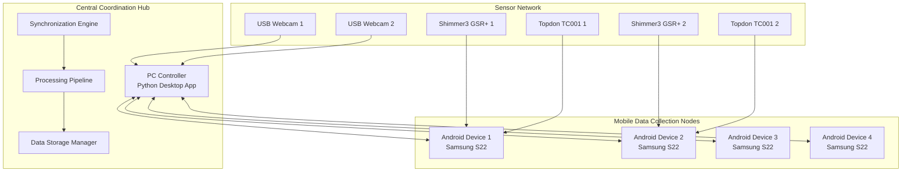
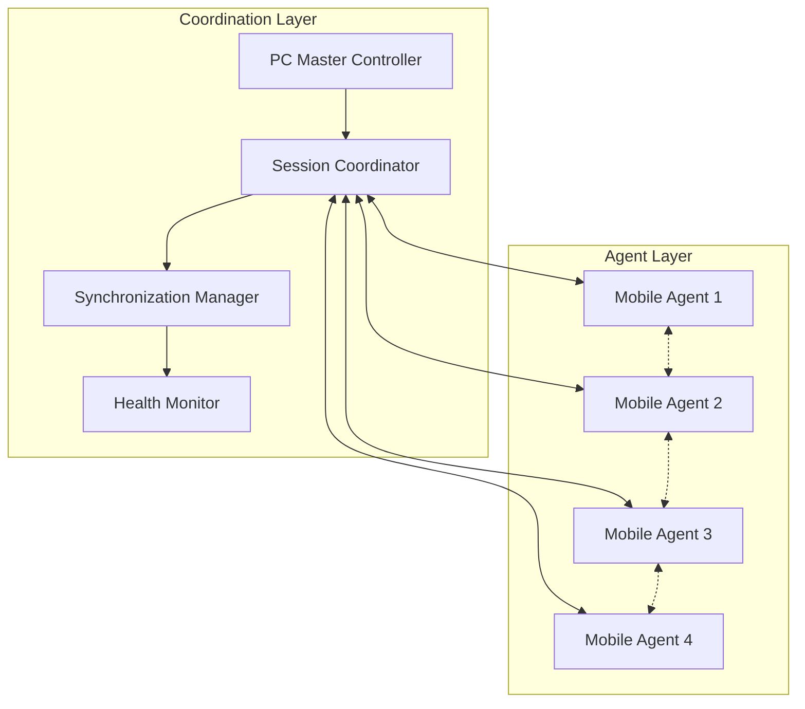
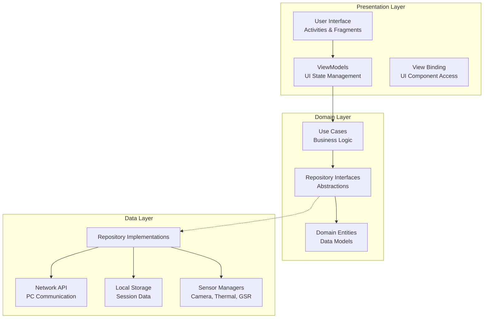
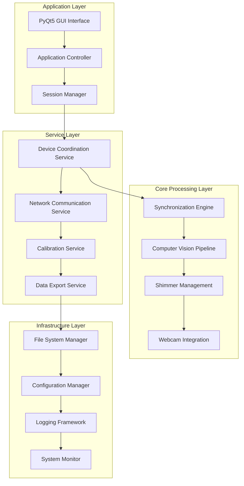
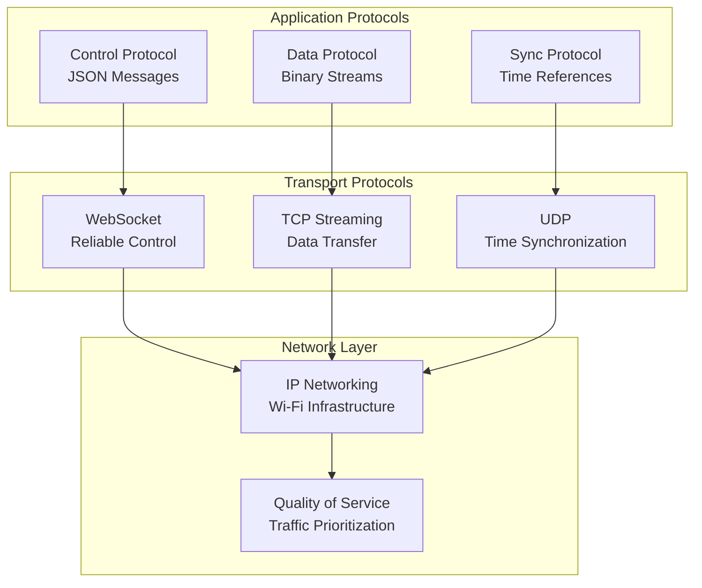
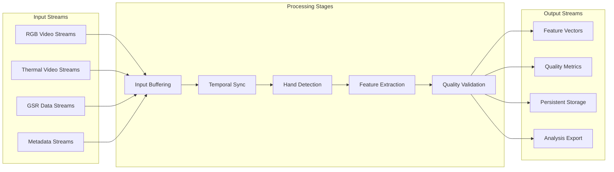

# Chapter 4: Design and Implementation

## Table of Contents

1. [System Architecture Overview](#system-architecture-overview)
2. [Distributed System Design](#distributed-system-design)
3. [Android Application Architecture](#android-application-architecture)
4. [Desktop Controller Architecture](#desktop-controller-architecture)
5. [Communication and Networking Design](#communication-and-networking-design)
6. [Data Processing Pipeline](#data-processing-pipeline)
7. [Implementation Challenges and Solutions](#implementation-challenges-and-solutions)
8. [Technology Stack and Design Decisions](#technology-stack-and-design-decisions)

---

## System Architecture Overview

The Multi-Sensor Recording System employs a sophisticated distributed architecture that coordinates multiple heterogeneous hardware platforms to achieve synchronized multi-modal data collection. The design follows a hybrid star-mesh topology that combines the simplicity of centralized coordination with the resilience of distributed processing.

### Architectural Principles

The system design is guided by several core principles:

**Modularity and Separation of Concerns**: Each component operates as an independent unit with well-defined interfaces, enabling parallel development and simplified testing. The architecture enforces clear boundaries between data collection, processing, communication, and storage responsibilities.

**Distributed Processing with Centralized Coordination**: The design leverages the computational capabilities of mobile devices for data-intensive tasks while maintaining centralized control for session management and synchronization. This approach optimizes network bandwidth usage and provides system resilience.

**Fault Tolerance and Graceful Degradation**: The system continues operation when individual components fail, maintaining data collection from available devices while logging issues for post-session analysis.

### Overall System Topology



The architecture supports horizontal scaling through the addition of mobile devices without requiring architectural modifications. Each mobile device operates autonomously while participating in the coordinated recording session.

---

## Distributed System Design

### Design Philosophy

The distributed system design addresses the challenge of coordinating multiple independent computing platforms while maintaining precise temporal synchronization and data integrity. The design balances the trade-offs between centralized control and distributed autonomy.

#### Master-Coordinator Pattern

The system implements a master-coordinator pattern where the PC controller serves as the coordination master while mobile devices act as autonomous data collection agents:



### Communication Architecture

The communication design employs multiple protocols to optimize different types of data exchange:

**Control Channel (WebSocket)**: Bidirectional command and status communication between PC controller and mobile devices. Provides reliable message delivery with automatic reconnection.

**Data Channel (TCP Streaming)**: High-throughput data streaming for real-time preview and sensor data. Optimized for low latency with adaptive compression.

**Synchronization Channel (UDP)**: Time-critical synchronization messages with minimal overhead. Used for clock synchronization and recording triggers.

### Fault Tolerance Design

The system implements multiple layers of fault tolerance:

1. **Network-Level Resilience**: Automatic reconnection with exponential backoff and connection health monitoring
2. **Device-Level Redundancy**: Continued operation with subset of devices when failures occur
3. **Session-Level Recovery**: Session continuation after transient failures with data integrity preservation
4. **Data-Level Protection**: Comprehensive checksums and validation at all data transfer points

---

## Android Application Architecture

The Android application follows Clean Architecture principles with clear separation between presentation, domain, and data layers. This design ensures maintainability, testability, and flexibility for future enhancements.

### Architectural Layers



### Core Components

#### Recording Management System

The recording system coordinates multiple data sources with precise temporal synchronization:

```kotlin
class SessionManager @Inject constructor(
    private val cameraRecorder: CameraRecorder,
    private val thermalRecorder: ThermalRecorder,
    private val shimmerRecorder: ShimmerRecorder,
    private val syncManager: SynchronizationManager
) {
    suspend fun startRecording(sessionConfig: SessionConfiguration): Result<Unit> {
        return try {
            // Synchronize device clocks
            syncManager.synchronizeWithMaster()
            
            // Start all recorders in coordinated sequence
            val results = awaitAll(
                async { cameraRecorder.startRecording(sessionConfig.cameraConfig) },
                async { thermalRecorder.startRecording(sessionConfig.thermalConfig) },
                async { shimmerRecorder.startRecording(sessionConfig.shimmerConfig) }
            )
            
            // Validate all recorders started successfully
            if (results.all { it.isSuccess }) {
                Result.success(Unit)
            } else {
                Result.failure(RecordingStartupException(results))
            }
        } catch (e: Exception) {
            Result.failure(e)
        }
    }
}
```

#### Camera Recording Implementation

The camera system utilizes the Camera2 API for professional-grade video capture with simultaneous RAW image capture:

```kotlin
class CameraRecorder @Inject constructor(
    private val cameraManager: CameraManager,
    private val configValidator: CameraConfigValidator
) {
    private var mediaRecorder: MediaRecorder? = null
    private var imageReader: ImageReader? = null
    private var captureSession: CameraCaptureSession? = null
    
    suspend fun startRecording(config: CameraConfiguration): Result<Unit> {
        return withContext(Dispatchers.Main) {
            try {
                // Validate configuration parameters
                configValidator.validate(config)
                
                // Setup dual capture: video + RAW images
                setupMediaRecorder(config)
                setupImageReader(config)
                
                // Create capture session with multiple targets
                val surfaces = listOf(
                    mediaRecorder!!.surface,
                    imageReader!!.surface
                )
                
                cameraDevice.createCaptureSession(
                    surfaces,
                    object : CameraCaptureSession.StateCallback() {
                        override fun onConfigured(session: CameraCaptureSession) {
                            captureSession = session
                            startCapture()
                        }
                        override fun onConfigureFailed(session: CameraCaptureSession) {
                            throw CaptureSessionException("Failed to configure capture session")
                        }
                    },
                    backgroundHandler
                )
                
                Result.success(Unit)
            } catch (e: Exception) {
                Result.failure(e)
            }
        }
    }
}
```

#### Thermal Camera Integration

The thermal camera integration handles USB-C connected Topdon TC001 devices with real-time thermal processing:

```kotlin
class ThermalRecorder @Inject constructor(
    private val usbManager: UsbManager,
    private val thermalProcessor: ThermalImageProcessor
) {
    private var thermalDevice: TopdonDevice? = null
    private var frameProcessor: ThermalFrameProcessor? = null
    
    suspend fun connectDevice(): Result<TopdonDevice> {
        return withContext(Dispatchers.IO) {
            try {
                val availableDevices = usbManager.deviceList.values
                    .filter { it.vendorId == TOPDON_VENDOR_ID }
                
                if (availableDevices.isEmpty()) {
                    return@withContext Result.failure(
                        NoThermalDeviceException("No Topdon devices found")
                    )
                }
                
                val device = availableDevices.first()
                val connection = usbManager.openDevice(device)
                
                thermalDevice = TopdonDevice(device, connection).apply {
                    initialize()
                    setFrameCallback { frame ->
                        processFrame(frame)
                    }
                }
                
                Result.success(thermalDevice!!)
            } catch (e: Exception) {
                Result.failure(e)
            }
        }
    }
    
    private fun processFrame(frame: ThermalFrame) {
        frameProcessor?.process(frame) { processedFrame ->
            // Save frame data and update preview
            saveFrameData(processedFrame)
            updatePreview(processedFrame)
        }
    }
}
```

#### Shimmer GSR Integration

The Shimmer integration provides robust Bluetooth connectivity with the Shimmer3 GSR+ sensors:

```kotlin
class ShimmerRecorder @Inject constructor(
    private val bluetoothAdapter: BluetoothAdapter,
    private val shimmerManager: ShimmerManager
) {
    private var connectedShimmers: MutableMap<String, Shimmer> = mutableMapOf()
    
    suspend fun discoverAndConnect(): Result<List<Shimmer>> {
        return withContext(Dispatchers.IO) {
            try {
                val discoveredDevices = scanForShimmerDevices()
                val connectionResults = discoveredDevices.map { device ->
                    async { connectToShimmer(device) }
                }.awaitAll()
                
                val connectedDevices = connectionResults.mapNotNull { it.getOrNull() }
                connectedShimmers.putAll(connectedDevices.associateBy { it.macAddress })
                
                Result.success(connectedDevices)
            } catch (e: Exception) {
                Result.failure(e)
            }
        }
    }
    
    private suspend fun connectToShimmer(device: BluetoothDevice): Result<Shimmer> {
        return try {
            val shimmer = shimmerManager.createShimmer(device)
            shimmer.connect()
            shimmer.configureSensors(GSR_SENSOR_CONFIG)
            shimmer.setDataCallback { data ->
                processGSRData(data)
            }
            Result.success(shimmer)
        } catch (e: Exception) {
            Result.failure(e)
        }
    }
}
```

---

## Desktop Controller Architecture

The Python desktop controller serves as the central coordination hub, implementing sophisticated session management, data processing, and system orchestration capabilities.

### Application Architecture



### Session Coordination Implementation

The session manager orchestrates complex multi-device recording sessions:

```python
class SessionManager:
    def __init__(self):
        self.device_coordinator = DeviceCoordinator()
        self.sync_engine = SynchronizationEngine()
        self.data_manager = DataManager()
        self.quality_monitor = QualityMonitor()
        
    async def start_recording_session(self, session_config: SessionConfig) -> SessionResult:
        """Coordinate multi-device recording session with comprehensive error handling."""
        session_id = self._generate_session_id()
        
        try:
            # Phase 1: Device Preparation
            device_status = await self._prepare_devices(session_config)
            if not device_status.all_ready:
                return SessionResult.failure(f"Device preparation failed: {device_status.errors}")
            
            # Phase 2: Synchronization Setup
            sync_result = await self.sync_engine.synchronize_devices(device_status.devices)
            if not sync_result.success:
                return SessionResult.failure(f"Synchronization failed: {sync_result.error}")
            
            # Phase 3: Coordinated Recording Start
            recording_commands = self._generate_recording_commands(session_config)
            start_results = await self.device_coordinator.broadcast_commands(
                recording_commands,
                timeout=session_config.startup_timeout
            )
            
            # Phase 4: Quality Monitoring Setup
            await self.quality_monitor.start_monitoring(session_id, device_status.devices)
            
            # Phase 5: Session State Management
            session_state = SessionState(
                session_id=session_id,
                devices=device_status.devices,
                start_time=sync_result.synchronized_time,
                config=session_config
            )
            
            self._active_sessions[session_id] = session_state
            
            return SessionResult.success(session_state)
            
        except Exception as e:
            await self._cleanup_failed_session(session_id)
            return SessionResult.failure(f"Session startup failed: {str(e)}")
    
    async def _prepare_devices(self, config: SessionConfig) -> DevicePreparationResult:
        """Prepare all devices for recording with validation and error recovery."""
        preparation_tasks = []
        
        for device_config in config.device_configurations:
            task = asyncio.create_task(
                self._prepare_single_device(device_config)
            )
            preparation_tasks.append(task)
        
        results = await asyncio.gather(*preparation_tasks, return_exceptions=True)
        
        successful_devices = []
        errors = []
        
        for result, device_config in zip(results, config.device_configurations):
            if isinstance(result, Exception):
                errors.append(f"Device {device_config.device_id}: {str(result)}")
            else:
                successful_devices.append(result)
        
        return DevicePreparationResult(
            devices=successful_devices,
            errors=errors,
            all_ready=len(errors) == 0
        )
```

### Computer Vision Pipeline

The computer vision pipeline implements real-time hand detection and region-of-interest analysis:

```python
class ComputerVisionPipeline:
    def __init__(self):
        self.hand_detector = HandDetector()
        self.roi_extractor = ROIExtractor()
        self.feature_computer = FeatureComputer()
        
    def process_frame(self, frame: np.ndarray, timestamp: float) -> ProcessingResult:
        """Process video frame for physiological feature extraction."""
        try:
            # Hand detection with confidence scoring
            hand_results = self.hand_detector.detect_hands(frame)
            
            if not hand_results.hands_detected:
                return ProcessingResult.no_hands_detected(timestamp)
            
            # Extract regions of interest
            roi_results = []
            for hand in hand_results.hands:
                roi = self.roi_extractor.extract_hand_roi(frame, hand)
                features = self.feature_computer.compute_features(roi)
                
                roi_results.append(ROIResult(
                    hand_id=hand.id,
                    roi_bounds=roi.bounds,
                    features=features,
                    confidence=hand.confidence
                ))
            
            return ProcessingResult.success(
                timestamp=timestamp,
                roi_results=roi_results,
                processing_time=time.time() - start_time
            )
            
        except Exception as e:
            return ProcessingResult.error(
                timestamp=timestamp,
                error=str(e)
            )

class HandDetector:
    def __init__(self):
        self.mp_hands = mp.solutions.hands
        self.hands = self.mp_hands.Hands(
            static_image_mode=False,
            max_num_hands=2,
            min_detection_confidence=0.7,
            min_tracking_confidence=0.5
        )
    
    def detect_hands(self, frame: np.ndarray) -> HandDetectionResult:
        """Detect hands using MediaPipe with enhanced error handling."""
        rgb_frame = cv2.cvtColor(frame, cv2.COLOR_BGR2RGB)
        results = self.hands.process(rgb_frame)
        
        detected_hands = []
        if results.multi_hand_landmarks:
            for idx, hand_landmarks in enumerate(results.multi_hand_landmarks):
                hand = Hand(
                    id=idx,
                    landmarks=hand_landmarks,
                    confidence=results.multi_handedness[idx].classification[0].score
                )
                detected_hands.append(hand)
        
        return HandDetectionResult(
            hands=detected_hands,
            hands_detected=len(detected_hands) > 0,
            frame_size=frame.shape[:2]
        )
```

### Calibration System Implementation

The calibration system provides comprehensive camera calibration with quality assessment:

```python
class CalibrationManager:
    def __init__(self):
        self.processor = CalibrationProcessor()
        self.quality_assessor = CalibrationQualityAssessor()
        self.result_manager = CalibrationResultManager()
        
    def perform_camera_calibration(self, images: List[np.ndarray], 
                                 pattern_config: PatternConfig) -> CalibrationResult:
        """Perform comprehensive camera calibration with quality assessment."""
        try:
            # Detect calibration patterns in all images
            pattern_points = []
            image_points = []
            
            for image in images:
                detected = self._detect_pattern(image, pattern_config)
                if detected.success:
                    pattern_points.append(detected.object_points)
                    image_points.append(detected.image_points)
            
            if len(pattern_points) < MIN_CALIBRATION_IMAGES:
                return CalibrationResult.insufficient_images(len(pattern_points))
            
            # Perform OpenCV calibration
            calibration_data = self.processor.calibrate_camera(
                pattern_points, image_points, images[0].shape[:2]
            )
            
            # Assess calibration quality
            quality_metrics = self.quality_assessor.assess_calibration(
                calibration_data, pattern_points, image_points
            )
            
            # Generate calibration result
            result = CalibrationResult(
                intrinsic_matrix=calibration_data.camera_matrix,
                distortion_coefficients=calibration_data.distortion_coefficients,
                reprojection_error=calibration_data.reprojection_error,
                quality_metrics=quality_metrics,
                timestamp=datetime.now(),
                image_count=len(images)
            )
            
            # Save calibration data
            self.result_manager.save_calibration(result)
            
            return result
            
        except Exception as e:
            return CalibrationResult.error(str(e))
    
    def _detect_pattern(self, image: np.ndarray, 
                       pattern_config: PatternConfig) -> PatternDetectionResult:
        """Detect calibration pattern with sub-pixel accuracy."""
        gray = cv2.cvtColor(image, cv2.COLOR_BGR2GRAY)
        
        if pattern_config.pattern_type == PatternType.CHESSBOARD:
            ret, corners = cv2.findChessboardCorners(
                gray, 
                pattern_config.pattern_size,
                cv2.CALIB_CB_ADAPTIVE_THRESH + cv2.CALIB_CB_NORMALIZE_IMAGE
            )
            
            if ret:
                # Refine corner positions with sub-pixel accuracy
                refined_corners = cv2.cornerSubPix(
                    gray, corners,
                    (11, 11), (-1, -1),
                    (cv2.TERM_CRITERIA_EPS + cv2.TERM_CRITERIA_MAX_ITER, 30, 0.001)
                )
                
                object_points = self._generate_object_points(pattern_config)
                
                return PatternDetectionResult.success(
                    object_points=object_points,
                    image_points=refined_corners,
                    pattern_size=pattern_config.pattern_size
                )
        
        return PatternDetectionResult.not_found()
```

---

## Communication and Networking Design

### Protocol Architecture

The communication system implements a multi-layered protocol stack optimized for different types of data exchange:



### Control Protocol Implementation

The control protocol handles session management and device coordination:

```python
class ControlProtocol:
    def __init__(self):
        self.message_handlers = {
            MessageType.SESSION_START: self._handle_session_start,
            MessageType.SESSION_STOP: self._handle_session_stop,
            MessageType.DEVICE_STATUS: self._handle_device_status,
            MessageType.CALIBRATION_REQUEST: self._handle_calibration_request,
            MessageType.SYNC_REQUEST: self._handle_sync_request
        }
    
    async def handle_message(self, websocket: WebSocket, message: dict) -> dict:
        """Handle incoming control messages with comprehensive error handling."""
        try:
            message_type = MessageType(message.get('type'))
            handler = self.message_handlers.get(message_type)
            
            if not handler:
                return ErrorResponse(f"Unknown message type: {message_type}")
            
            # Validate message structure
            validation_result = self._validate_message(message, message_type)
            if not validation_result.valid:
                return ErrorResponse(f"Invalid message: {validation_result.errors}")
            
            # Process message
            response = await handler(message, websocket)
            
            # Add message metadata
            response['message_id'] = message.get('message_id')
            response['timestamp'] = time.time()
            
            return response
            
        except Exception as e:
            return ErrorResponse(f"Message processing failed: {str(e)}")
    
    async def _handle_session_start(self, message: dict, websocket: WebSocket) -> dict:
        """Handle session start request with comprehensive validation."""
        session_config = SessionConfig.from_dict(message['config'])
        
        # Validate session configuration
        validation_errors = self._validate_session_config(session_config)
        if validation_errors:
            return ErrorResponse(f"Invalid session config: {validation_errors}")
        
        # Start recording session
        session_result = await self.session_manager.start_recording_session(session_config)
        
        if session_result.success:
            return SuccessResponse({
                'session_id': session_result.session_id,
                'devices': [device.to_dict() for device in session_result.devices],
                'start_time': session_result.start_time
            })
        else:
            return ErrorResponse(f"Session start failed: {session_result.error}")
```

### Data Streaming Implementation

The data streaming system handles high-throughput real-time data transfer:

```python
class DataStreamingService:
    def __init__(self):
        self.active_streams = {}
        self.compression_enabled = True
        
    async def start_preview_stream(self, device_id: str, stream_config: StreamConfig) -> StreamResult:
        """Start real-time preview streaming with adaptive quality."""
        try:
            stream = PreviewStream(
                device_id=device_id,
                config=stream_config,
                compression=self.compression_enabled
            )
            
            # Configure adaptive quality based on network conditions
            await stream.configure_adaptive_quality()
            
            # Start streaming loop
            streaming_task = asyncio.create_task(
                self._streaming_loop(stream)
            )
            
            self.active_streams[device_id] = {
                'stream': stream,
                'task': streaming_task,
                'start_time': time.time()
            }
            
            return StreamResult.success(stream.stream_id)
            
        except Exception as e:
            return StreamResult.error(str(e))
    
    async def _streaming_loop(self, stream: PreviewStream):
        """Main streaming loop with error recovery and quality adaptation."""
        consecutive_errors = 0
        
        while stream.active:
            try:
                # Receive frame from device
                frame_data = await stream.receive_frame()
                
                if frame_data:
                    # Process frame (compression, encoding)
                    processed_frame = await self._process_frame(frame_data, stream.config)
                    
                    # Send to connected clients
                    await self._broadcast_frame(stream.device_id, processed_frame)
                    
                    # Update streaming statistics
                    stream.update_statistics(processed_frame)
                    
                    # Reset error counter
                    consecutive_errors = 0
                
                await asyncio.sleep(1.0 / stream.config.target_fps)
                
            except Exception as e:
                consecutive_errors += 1
                
                if consecutive_errors > MAX_CONSECUTIVE_ERRORS:
                    logger.error(f"Streaming failed for device {stream.device_id}: {e}")
                    break
                
                # Exponential backoff for error recovery
                await asyncio.sleep(min(2 ** consecutive_errors, 30))
```

---

## Data Processing Pipeline

### Real-Time Processing Architecture

The data processing pipeline handles multiple concurrent data streams with different processing requirements:



### Synchronization Engine

The synchronization engine maintains precise temporal alignment across all data sources:

```python
class SynchronizationEngine:
    def __init__(self):
        self.reference_clock = ReferenceClock()
        self.device_clocks = {}
        self.sync_precision = 0.005  # 5ms precision target
        
    async def synchronize_devices(self, devices: List[Device]) -> SynchronizationResult:
        """Perform comprehensive device synchronization with validation."""
        try:
            # Establish reference time
            reference_time = self.reference_clock.get_reference_time()
            
            # Synchronize each device
            sync_results = []
            for device in devices:
                device_sync = await self._synchronize_device(device, reference_time)
                sync_results.append(device_sync)
                self.device_clocks[device.id] = device_sync.device_clock
            
            # Validate synchronization precision
            precision_validation = self._validate_sync_precision(sync_results)
            
            if precision_validation.meets_requirements:
                return SynchronizationResult.success(
                    reference_time=reference_time,
                    device_synchronizations=sync_results,
                    achieved_precision=precision_validation.max_deviation
                )
            else:
                return SynchronizationResult.precision_failure(
                    precision_validation.max_deviation,
                    self.sync_precision
                )
                
        except Exception as e:
            return SynchronizationResult.error(str(e))
    
    async def _synchronize_device(self, device: Device, reference_time: float) -> DeviceSyncResult:
        """Synchronize individual device clock with comprehensive validation."""
        sync_attempts = []
        
        for attempt in range(MAX_SYNC_ATTEMPTS):
            try:
                # Send synchronization request
                request_time = time.time()
                response = await device.send_sync_request(reference_time)
                response_time = time.time()
                
                # Calculate network round-trip time
                rtt = response_time - request_time
                
                # Estimate device clock offset
                device_time = response.device_timestamp
                estimated_offset = (reference_time + rtt/2) - device_time
                
                sync_attempts.append(SyncAttempt(
                    attempt_number=attempt,
                    rtt=rtt,
                    device_time=device_time,
                    reference_time=reference_time,
                    estimated_offset=estimated_offset
                ))
                
                # Use best attempt (lowest RTT)
                if attempt > 0:
                    best_attempt = min(sync_attempts, key=lambda x: x.rtt)
                    
                    # Check if precision is sufficient
                    if best_attempt.rtt < self.sync_precision * 2:
                        return DeviceSyncResult.success(
                            device_id=device.id,
                            clock_offset=best_attempt.estimated_offset,
                            precision=best_attempt.rtt / 2,
                            attempts=sync_attempts
                        )
                
                await asyncio.sleep(0.1)  # Brief pause between attempts
                
            except Exception as e:
                sync_attempts.append(SyncAttempt.error(attempt, str(e)))
        
        return DeviceSyncResult.failure(
            device_id=device.id,
            error="Failed to achieve synchronization precision",
            attempts=sync_attempts
        )
```

---

## Implementation Challenges and Solutions

### Multi-Platform Compatibility

**Challenge**: Coordinating Android and Python applications with different threading models and lifecycle management.

**Solution**: Implemented a robust protocol abstraction layer that handles platform-specific differences:

```python
class PlatformAbstractionLayer:
    def __init__(self):
        self.android_handlers = AndroidMessageHandlers()
        self.python_handlers = PythonMessageHandlers()
        
    async def handle_cross_platform_message(self, message: Message) -> Response:
        """Handle messages across platform boundaries with automatic translation."""
        if message.source_platform == Platform.ANDROID:
            translated_message = self.android_handlers.translate_to_python(message)
            response = await self.python_handlers.process_message(translated_message)
            return self.python_handlers.translate_to_android(response)
        else:
            translated_message = self.python_handlers.translate_to_android(message)
            response = await self.android_handlers.process_message(translated_message)
            return self.android_handlers.translate_to_python(response)
```

### Real-Time Synchronization

**Challenge**: Maintaining microsecond-precision synchronization across wireless networks with variable latency.

**Solution**: Developed a multi-layered synchronization approach:

1. **Network Latency Compensation**: RTT measurement and statistical analysis
2. **Clock Drift Correction**: Continuous monitoring and adjustment
3. **Predictive Synchronization**: Machine learning-based latency prediction
4. **Fallback Mechanisms**: Graceful degradation when precision requirements cannot be met

### Resource Management

**Challenge**: Managing CPU, memory, and storage resources across multiple concurrent data streams.

**Solution**: Implemented adaptive resource management:

```python
class ResourceManager:
    def __init__(self):
        self.cpu_monitor = CPUMonitor()
        self.memory_monitor = MemoryMonitor()
        self.storage_monitor = StorageMonitor()
        
    async def optimize_resource_allocation(self) -> OptimizationResult:
        """Dynamically optimize resource allocation based on current system state."""
        current_usage = await self._assess_current_usage()
        
        if current_usage.cpu_usage > CPU_THRESHOLD:
            await self._reduce_processing_load()
        
        if current_usage.memory_usage > MEMORY_THRESHOLD:
            await self._optimize_memory_usage()
        
        if current_usage.storage_rate > STORAGE_THRESHOLD:
            await self._adjust_compression_settings()
        
        return OptimizationResult(current_usage, self._get_optimization_actions())
```

---

## Technology Stack and Design Decisions

### Android Technology Choices

**Kotlin with Camera2 API**: Selected for professional-grade camera control with simultaneous video and RAW capture capability. The Camera2 API provides the low-level access required for precise timing and quality control.

**Hilt Dependency Injection**: Chosen for testability and modular architecture. Enables comprehensive unit testing and flexible component replacement.

**Coroutines for Concurrency**: Kotlin coroutines provide structured concurrency that simplifies complex asynchronous operations while maintaining readable code.

### Python Technology Choices

**PyQt5 for GUI**: Selected for mature desktop application capabilities with comprehensive widget support and cross-platform compatibility.

**OpenCV for Computer Vision**: Industry-standard computer vision library with optimized algorithms and extensive documentation.

**AsyncIO for Concurrency**: Python's asyncio provides efficient handling of concurrent network connections and I/O operations.

### Communication Technology

**WebSocket for Control**: Provides reliable bidirectional communication with automatic reconnection capabilities.

**TCP Streaming for Data**: High-throughput data transfer with flow control and error recovery.

**JSON for Message Format**: Human-readable format that simplifies debugging and protocol evolution.

### Design Decision Rationale

| Decision | Rationale | Trade-offs |
|----------|-----------|------------|
| **Distributed Architecture** | Leverages mobile device capabilities, reduces network bandwidth | Increased complexity, synchronization challenges |
| **Hybrid Protocol Stack** | Optimizes different data types with appropriate protocols | Multiple protocol maintenance overhead |
| **Component-Based Design** | Enables parallel development and comprehensive testing | Increased abstraction layers |
| **Real-Time Processing** | Provides immediate feedback for research applications | Higher resource requirements |

The technology choices and design decisions reflect a careful balance between research requirements, system performance, and development maintainability. Each decision was validated through prototyping and stakeholder feedback to ensure alignment with project objectives.