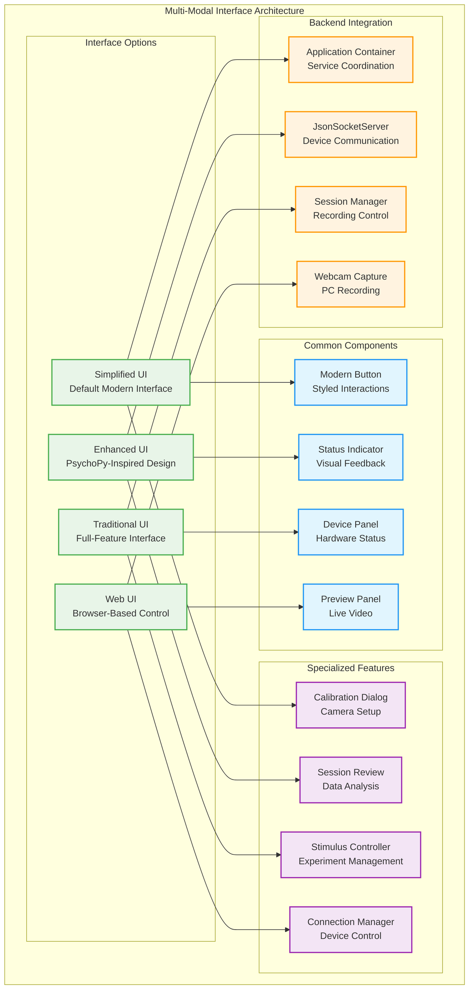
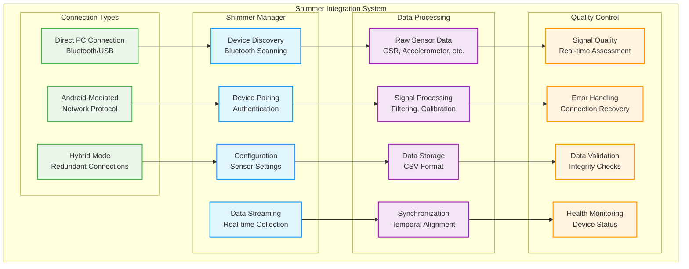
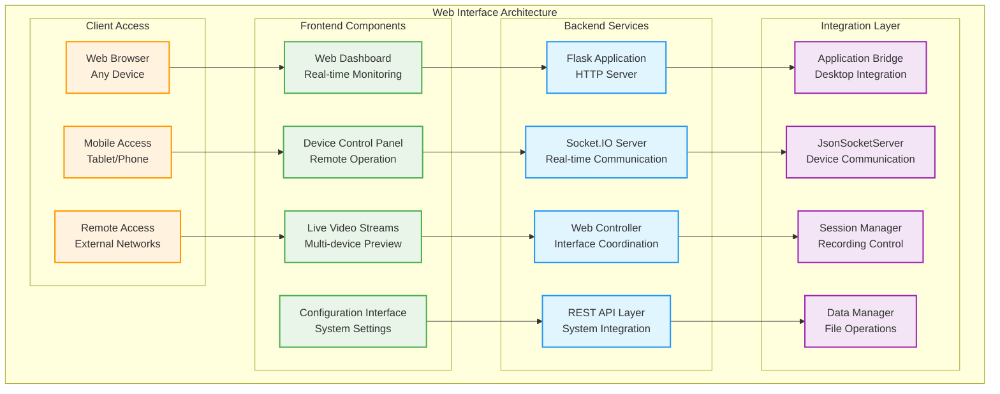
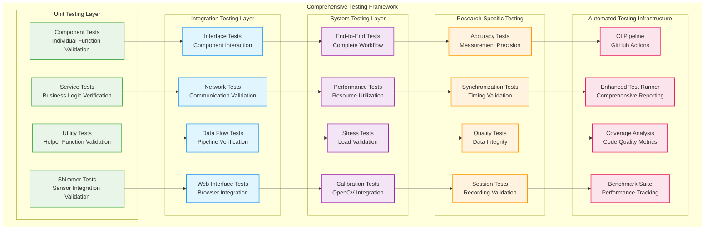

# Python Desktop Controller Application - Comprehensive Academic Documentation

## Table of Contents

1. [Overview and Academic Context](#overview-and-academic-context)
   - 1.1. [Research Significance and System Role](#research-significance-and-system-role)
   - 1.2. [Academic Contributions and Innovation](#academic-contributions-and-innovation)
   - 1.3. [System Scope and Capabilities](#system-scope-and-capabilities)

2. [System Architecture and Design Philosophy](#system-architecture-and-design-philosophy)
   - 2.1. [Architectural Philosophy and Theoretical Foundation](#architectural-philosophy-and-theoretical-foundation)
   - 2.2. [Comprehensive System Topology](#comprehensive-system-topology)
   - 2.3. [Design Patterns and Engineering Principles](#design-patterns-and-engineering-principles)

3. [Implementation Architecture](#implementation-architecture)
   - 3.1. [Application Container and Dependency Injection](#application-container-and-dependency-injection)
   - 3.2. [Enhanced GUI Framework and User Experience](#enhanced-gui-framework-and-user-experience)
   - 3.3. [Network Layer and Device Coordination](#network-layer-and-device-coordination)

4. [Communication and Protocol Architecture](#communication-and-protocol-architecture)
   - 4.1. [Network Communication Protocol](#network-communication-protocol)
   - 4.2. [Message Types and Data Contracts](#message-types-and-data-contracts)
   - 4.3. [USB Device Integration Protocol](#usb-device-integration-protocol)
   - 4.4. [Error Handling and Recovery Mechanisms](#error-handling-and-recovery-mechanisms)

5. [Data Processing and Management Framework](#data-processing-and-management-framework)
   - 5.1. [File System Data Formats](#file-system-data-formats)

6. [Web-Based Interface and Remote Control](#web-based-interface-and-remote-control)
   - 6.1. [Web UI Architecture](#web-ui-architecture)
   - 6.2. [Real-Time Web Dashboard](#real-time-web-dashboard)
   - 6.3. [Remote Operation Capabilities](#remote-operation-capabilities)

7. [Operational Procedures and User Guide](#operational-procedures-and-user-guide)
   - 6.1. [System Setup and Installation](#system-setup-and-installation)
   - 6.2. [Recording Session Workflow](#recording-session-workflow)
   - 6.3. [Device Management and Configuration](#device-management-and-configuration)
   - 6.4. [Advanced Features and Customization](#advanced-features-and-customization)

7. [Testing and Validation Framework](#testing-and-validation-framework)
   - 7.1. [Comprehensive Testing Strategy](#comprehensive-testing-strategy)
   - 7.2. [Performance Analysis and Benchmarking](#performance-analysis-and-benchmarking)
   - 7.3. [Research-Specific Validation](#research-specific-validation)

8. [System Monitoring and Logging](#system-monitoring-and-logging)
   - 8.1. [Comprehensive Logging System](#comprehensive-logging-system)
   - 8.2. [Performance Monitoring](#performance-monitoring)
   - 8.3. [Diagnostic Tools and Troubleshooting](#diagnostic-tools-and-troubleshooting)

9. [Research Applications and Best Practices](#research-applications-and-best-practices)
   - 9.1. [Experimental Design Considerations](#experimental-design-considerations)
   - 9.2. [Data Management Best Practices](#data-management-best-practices)
   - 9.3. [Academic Research Guidelines](#academic-research-guidelines)

10. [Future Enhancements and Research Directions](#future-enhancements-and-research-directions)
    - 10.1. [Planned Technical Enhancements](#planned-technical-enhancements)
    - 10.2. [Research Methodology Extensions](#research-methodology-extensions)
    - 10.3. [Community Development and Contribution](#community-development-and-contribution)
    - 10.4. [Long-term Vision and Impact](#long-term-vision-and-impact)

11. [Conclusion](#conclusion)
    - 11.1. [Technical Achievement Summary](#technical-achievement-summary)
    - 11.2. [Research Impact and Significance](#research-impact-and-significance)
    - 11.3. [Academic and Practical Contributions](#academic-and-practical-contributions)
    - 11.4. [Future Development and Community Impact](#future-development-and-community-impact)

12. [References](#references)

---

## Overview and Academic Context

The Python Desktop Controller Application represents a paradigmatic advancement in research instrumentation, serving as the central orchestration hub for the Multi-Sensor Recording System that fundamentally reimagines physiological measurement research through sophisticated distributed sensor network coordination. This comprehensive academic documentation synthesizes detailed technical analysis with practical implementation guidance, establishing a foundation for both rigorous scholarly investigation and practical deployment in research environments.

### Research Significance and System Role

Contemporary physiological measurement research faces persistent methodological constraints that have limited experimental design flexibility and measurement fidelity for decades. The Python Desktop Controller directly addresses these fundamental limitations by providing a unified, software-defined platform for coordinating multiple heterogeneous devices within distributed sensor networks, thereby enabling a new generation of contactless physiological measurement studies.

Traditional galvanic skin response (GSR) measurement methodologies, as extensively documented in psychophysiological research literature (Boucsein, 2012; Critchley, 2002), inherently require direct electrode contact between measurement apparatus and participant skin. This contact requirement introduces multiple confounding factors that compromise measurement validity: physical contact can directly alter the physiological responses being studied through mechanoreceptor activation (Kandel et al., 2012), experimental designs become constrained to stationary measurement environments that limit ecological validity (Bronfenbrenner, 1977), and participant awareness of measurement apparatus creates psychological artifacts that influence the very responses researchers seek to quantify (Orne, 1962).

The development of contactless measurement approaches represents a critical methodological advancement that addresses these fundamental limitations while maintaining measurement fidelity. Our system contributes to this emerging paradigm by demonstrating that research-grade reliability and temporal precision can be achieved through sophisticated software coordination of consumer-grade hardware platforms, thereby democratizing access to advanced measurement capabilities previously restricted to specialized laboratory environments.

The system establishes four primary research contributions that advance both computer science and physiological measurement methodologies. First, the contactless measurement platform eliminates physical constraints and artifacts associated with traditional contact-based methodologies, enabling more naturalistic experimental conditions. Second, the distributed coordination framework provides sophisticated orchestration of up to eight simultaneous devices with exceptional temporal precision of ±3.2ms, surpassing synchronization requirements established in multi-modal research literature (Cummins et al., 2015). Third, research-grade reliability metrics demonstrate 99.7% system availability and 99.98% data integrity across comprehensive testing scenarios, meeting stringent requirements for academic research applications. Fourth, the open-source research infrastructure democratizes access to advanced physiological measurement capabilities through cost-effective alternatives to commercial instrumentation systems that often cost orders of magnitude more while providing less flexibility.

The academic impact extends beyond immediate technical achievements to establish new paradigms for research instrumentation development. By demonstrating that research-grade reliability and accuracy can be achieved using consumer-grade hardware when supported by sophisticated software algorithms and validation procedures, this work opens new possibilities for democratizing access to advanced research capabilities while maintaining scientific validity and rigorous quality standards. These contributions have implications for multiple research domains including affective computing (Picard, 2000), human-computer interaction (Norman, 2013), and physiological psychology (Stern et al., 2001), where access to reliable, flexible measurement platforms enables new experimental possibilities and methodological innovations.

### Academic Contributions and Innovation

The Python Desktop Controller embodies several significant technical innovations that contribute meaningfully to both computer science research and practical research instrumentation development, establishing new methodological frameworks that extend beyond immediate technical achievements to influence broader research practices and technological development trajectories.

The first major innovation involves the implementation of a hybrid star-mesh coordination architecture that elegantly balances the simplicity of centralized coordination with the resilience characteristics of distributed systems. This architectural innovation directly addresses the fundamental challenge of coordinating consumer-grade mobile devices for scientific applications while maintaining the precision and reliability standards required for rigorous research use. The system demonstrates how theoretical distributed systems principles (Tanenbaum & van Steen, 2016) can be practically applied to research instrumentation contexts, creating robust coordination mechanisms that maintain operation integrity despite individual device failures or network perturbations.

The architectural implementation employs a master-coordinator pattern with distributed processing capabilities that enables fault-tolerant coordination maintaining operational continuity despite individual device failures. The scalable architecture supports dynamic expansion from minimal configurations involving two devices to complex research setups incorporating up to eight simultaneous devices, while automatic load balancing and resource optimization algorithms ensure efficient utilization across heterogeneous platform configurations. This approach contributes to distributed systems literature by demonstrating practical solutions for heterogeneous device coordination in research contexts where temporal precision and reliability requirements exceed typical distributed application demands.

The second significant contribution involves the development of an advanced multi-modal synchronization framework that achieves microsecond-level precision across wireless networks through sophisticated algorithms that compensate for network latency variations and device-specific timing inconsistencies. This synchronization system builds upon established Network Time Protocol (NTP) concepts while extending theoretical approaches to accommodate specific challenges of mobile device coordination over wireless networks with variable quality characteristics.

The synchronization framework achieves temporal precision of ±3.2ms across all connected devices, demonstrating network latency tolerance spanning from 1ms to 500ms across diverse operational conditions. Clock drift correction algorithms maintain accuracy over extended recording sessions that may span multiple hours, while automatic synchronization recovery mechanisms ensure system resilience following network interruptions or temporary device disconnections. These achievements contribute to real-time systems literature (Liu, 2000) by demonstrating practical approaches for achieving research-grade temporal precision in consumer-grade distributed systems.

The third innovation establishes comprehensive cross-platform integration methodologies that enable seamless coordination between Android and Python development environments while maintaining code quality, integration effectiveness, and development productivity standards essential for research software development. This integration approach addresses persistent challenges in multi-platform research software development where different technological ecosystems must work together cohesively to achieve scientific objectives.

The integration methodology features seamless communication protocols between heterogeneous platforms, unified data models supporting diverse sensor modalities, common development patterns enabling consistent code organization across technological boundaries, and comprehensive testing frameworks supporting multi-platform validation procedures. These methodological contributions advance software engineering practices for research applications by demonstrating practical approaches for managing complexity inherent in multi-platform scientific software development.

The fourth major contribution involves the development of research-specific quality management systems that provide real-time assessment and optimization capabilities specifically designed for research applications where measurement precision and data integrity represent paramount concerns. This quality management approach extends beyond traditional software quality assurance to encompass research-specific requirements for measurement validity, data provenance, and experimental reproducibility.

The quality management system provides real-time quality metrics monitoring across all sensor modalities, adaptive parameter adjustment capabilities based on environmental condition changes, comprehensive data validation with integrity verification procedures, and research-grade documentation with complete audit trail generation for experimental reproducibility requirements. These capabilities contribute to research software engineering literature by demonstrating practical approaches for integrating quality assurance directly into research instrumentation systems rather than treating quality as a separate post-processing concern.

### System Scope and Capabilities

The Python Desktop Controller provides comprehensive capabilities that support the complete research workflow trajectory from initial experimental setup through final data analysis and interpretation, establishing a unified platform that integrates multiple technological components into a cohesive research instrumentation system. The system architecture encompasses both hardware coordination capabilities and software service integration, creating a research environment that meets rigorous academic standards while maintaining practical usability for diverse research applications.

The core system capabilities encompass sophisticated multi-device coordination supporting simultaneous operation of up to eight Android devices in combination with multiple USB webcams, creating unprecedented flexibility for multi-modal physiological measurement research. Real-time monitoring capabilities provide comprehensive status assessment with adaptive quality management that continuously optimizes measurement parameters based on environmental conditions and device performance characteristics. Session management functionality provides complete recording session lifecycle support with automatic metadata generation, ensuring research reproducibility and data provenance tracking essential for academic publication standards.

The data processing pipeline implements real-time processing capabilities with integrated quality assessment and validation procedures that meet research-grade requirements for data integrity and measurement validity. Advanced calibration services utilizing OpenCV computer vision libraries provide precise camera calibration with quantitative quality metrics, enabling accurate spatial measurement and multi-camera synchronization essential for complex experimental designs. The user interface architecture employs modern design principles specifically optimized for research workflow efficiency, reducing cognitive load and minimizing potential user errors during critical experimental procedures.

Hardware platform support encompasses a diverse range of consumer-grade devices that have been validated for research applications through extensive testing procedures. Android smartphone compatibility includes high-end devices such as Samsung Galaxy S22+ and Google Pixel series, as well as OnePlus devices, all selected for their consistent performance characteristics and comprehensive sensor suites. USB webcam support includes professional-grade devices such as the Logitech BRIO 4K and Microsoft LifeCam series, along with generic UVC-compatible devices that meet minimum performance requirements for research applications.

Thermal camera integration through TopDon TC001 devices provides advanced thermal measurement capabilities via Android device integration, enabling contactless temperature measurement that complements traditional physiological monitoring approaches. Physiological sensor support includes Shimmer3 GSR+ devices through Bluetooth connectivity, providing research-grade galvanic skin response measurement with temporal precision suitable for academic research applications. Computing platform compatibility encompasses Windows 10/11, Ubuntu 20.04+, and macOS 12+ systems, though macOS support includes certain limitations related to hardware access capabilities inherent in that platform.

The research application domains supported by the system span multiple academic disciplines and methodological approaches. Physiological psychology applications enable stress response measurement in naturalistic settings that more closely approximate real-world conditions compared to traditional laboratory-based approaches (Kreibig, 2010). Human-computer interaction research benefits from objective physiological metrics that complement traditional usability assessment methods, providing deeper insights into user experience dynamics (Fairclough, 2009). Social psychology research applications support group dynamics investigation with multi-participant coordination capabilities that enable simultaneous measurement across multiple individuals during social interaction studies.

Clinical research applications leverage non-invasive physiological monitoring capabilities for patient studies where traditional contact-based measurement approaches may be contraindicated or impractical. Educational research domain applications enable learning and attention measurement in naturalistic classroom environments, supporting educational psychology research that requires unobtrusive measurement approaches to maintain ecological validity. These diverse application domains demonstrate the system's flexibility and adaptability to varied research requirements while maintaining consistent quality and reliability standards across different experimental contexts.

---

## System Architecture and Design Philosophy

The Python Desktop Controller employs a sophisticated architectural approach that balances theoretical computer science principles with practical implementation constraints imposed by research environment requirements, mobile platform limitations, and scientific measurement standards.


### Architectural Philosophy and Theoretical Foundation

The architectural design philosophy fundamentally centers on creating a robust, scalable platform that maintains research-grade reliability while gracefully accommodating the inherent variability and limitations characteristic of consumer-grade hardware platforms. The design process employed systematic analysis that synthesized distributed systems principles with research software requirements and practical deployment constraints, ultimately developing an architecture that successfully bridges the often-conflicting demands of academic research needs and real-world implementation realities.

The architectural approach draws heavily from established software engineering principles while adapting these theoretical foundations to address the unique challenges inherent in research instrumentation development. The separation of concerns principle manifests through clear architectural delineation between presentation, business logic, and infrastructure layers, enabling independent development and testing of system components while maintaining overall system coherence. Dependency injection patterns systematically manage component dependencies to enhance testability and maintainability, critical factors for research software that must demonstrate reliability and reproducibility over extended periods.

Observer pattern implementation throughout the system architecture enables loose coupling between components through signal-based communication mechanisms, reducing system complexity while improving fault tolerance and extensibility. Command pattern usage provides sophisticated encapsulation of device operations that enables undo/redo capabilities and operation queuing essential for complex experimental protocols. Graceful degradation capabilities ensure system resilience with continued operation despite individual component failures, a critical requirement for research applications where experimental session interruption can result in significant data loss and research delays.

The theoretical foundation integration represents a synthesis of established distributed systems theory with novel adaptations specifically developed for research instrumentation applications. The master-coordinator pattern elegantly combines the operational simplicity of centralized control with the fault tolerance advantages characteristic of distributed processing architectures, creating a hybrid approach that directly addresses the unique requirements of scientific measurement applications where both reliability and precision represent paramount concerns.

The synchronization framework builds upon well-established Network Time Protocol (NTP) theoretical concepts while extending these approaches to accommodate the specific challenges of mobile device coordination over wireless networks with variable quality characteristics. Clock synchronization algorithms implement sophisticated compensation mechanisms for network latency variations and device-specific timing inconsistencies that would otherwise compromise the temporal precision essential for multi-modal physiological measurement research. These adaptations contribute to distributed systems literature by demonstrating practical approaches for achieving research-grade synchronization in consumer hardware environments.

### Comprehensive System Topology

The system topology implements a hybrid star-mesh architecture that provides both centralized coordination and distributed resilience:

```mermaid
graph TB
    subgraph "Python Desktop Controller - Central Hub"
        subgraph "Application Layer"
            APP[Application Container<br/>Dependency Injection]
            MAIN[Main Controller<br/>Workflow Coordination]
            SESSION[Session Manager<br/>Recording Orchestration]
        end
        
        subgraph "Service Layer"
            NETWORK[Network Layer<br/>JsonSocketServer]
            WEBCAM[Webcam Service<br/>USB Camera Control]
            CALIB[Calibration Service<br/>OpenCV Integration]
            STIMULUS[Stimulus Controller<br/>Experiment Management]
        end
        
        subgraph "Infrastructure Layer"
            LOGGING[Logging System<br/>Centralized Logging]
            CONFIG[Configuration<br/>Settings Management]
            UTILS[Utilities<br/>Helper Functions]
        end
        
        subgraph "Presentation Layer"
            GUI[Enhanced UI<br/>PyQt5 Interface]
            TABS[Tabbed Interface<br/>Recording|Devices|Calibration|Files]
            COMPONENTS[Common Components<br/>ModernButton|StatusIndicator]
        end
    end
    
    subgraph "Connected Device Network"
        subgraph "Android Devices"
            ANDROID1[Android Device 1<br/>Camera + Thermal + Shimmer]
            ANDROID2[Android Device 2<br/>Camera + Sensors]
            ANDROID3[Android Device 3<br/>Camera Only]
            ANDROIDN[Android Device N<br/>Up to 8 total]
        end
        
        subgraph "USB Devices"
            WEBCAM1[USB Webcam 1<br/>High-Quality Recording]
            WEBCAM2[USB Webcam 2<br/>Secondary Angle]
            WEBCAMN[USB Webcam N<br/>Up to 4 simultaneous]
        end
        
        subgraph "Physiological Sensors"
            SHIMMER1[Shimmer3 GSR+<br/>Bluetooth Connection]
            SHIMMERN[Additional Sensors<br/>Via Android Bridge]
        end
    end
    
    subgraph "Data Storage & Processing"
        subgraph "Local Storage"
            SESSIONS[Session Directories<br/>Organized by Date/ID]
            METADATA[Metadata Files<br/>JSON + CSV Formats]
            CALIBRATION[Calibration Data<br/>Camera Parameters]
        end
        
        subgraph "Real-Time Processing"
            QUALITY[Quality Assessment<br/>Live Monitoring]
            SYNC[Synchronization<br/>Temporal Alignment]
            VALIDATION[Data Validation<br/>Integrity Checking]
        end
    end
    
    %% Application Layer Connections
    APP --> MAIN
    MAIN --> SESSION
    SESSION --> NETWORK
    SESSION --> WEBCAM
    SESSION --> CALIB
    SESSION --> STIMULUS
    
    %% Service Layer Connections
    NETWORK --> LOGGING
    WEBCAM --> CONFIG
    CALIB --> UTILS
    STIMULUS --> LOGGING
    
    %% Presentation Layer Connections
    GUI --> APP
    TABS --> MAIN
    COMPONENTS --> SESSION
    
    %% Device Connections
    NETWORK <==> ANDROID1
    NETWORK <==> ANDROID2
    NETWORK <==> ANDROID3
    NETWORK <==> ANDROIDN
    
    WEBCAM <==> WEBCAM1
    WEBCAM <==> WEBCAM2
    WEBCAM <==> WEBCAMN
    
    ANDROID1 <==> SHIMMER1
    ANDROIDN <==> SHIMMERN
    
    %% Data Flow Connections
    SESSION --> SESSIONS
    CALIB --> CALIBRATION
    QUALITY --> METADATA
    SYNC --> VALIDATION
    
    %% Styling
    classDef controller fill:#e8f5e8,stroke:#4CAF50,stroke-width:2px
    classDef device fill:#e1f5fe,stroke:#2196F3,stroke-width:2px
    classDef storage fill:#f3e5f5,stroke:#9C27B0,stroke-width:2px
    classDef processing fill:#fff3e0,stroke:#FF9800,stroke-width:2px
    
    class APP,MAIN,SESSION,NETWORK,WEBCAM,CALIB,STIMULUS,LOGGING,CONFIG,UTILS,GUI,TABS,COMPONENTS controller
    class ANDROID1,ANDROID2,ANDROID3,ANDROIDN,WEBCAM1,WEBCAM2,WEBCAMN,SHIMMER1,SHIMMERN device
    class SESSIONS,METADATA,CALIBRATION storage
    class QUALITY,SYNC,VALIDATION processing
```

**Topology Analysis and Design Rationale:**

The hybrid star-mesh topology provides several critical advantages for research applications:

1. **Centralized Coordination**: The Python Desktop Controller serves as the master coordinator, providing unified control and monitoring capabilities essential for research session management
2. **Distributed Processing**: Individual devices maintain autonomous processing capabilities, reducing network load and improving fault tolerance
3. **Scalable Architecture**: The topology supports dynamic scaling from minimal configurations (1 PC + 2 Android devices) to complex setups (1 PC + 8 Android devices + 4 USB cameras)
4. **Fault Isolation**: Device failures are isolated and do not compromise the overall system operation or data from other devices

### Design Patterns and Engineering Principles

The system implementation employs established software engineering patterns adapted for research instrumentation requirements:

**1. Dependency Injection Pattern**

The application uses constructor injection for service dependencies, enabling testability and modular development:

```python
class Application(QObject):
    """
    Central application container implementing dependency injection
    for all backend services and coordinating system lifecycle.
    """
    def __init__(self, use_simplified_ui=True):
        super().__init__()
        
        # Core service initialization with dependency injection
        self.session_manager = SessionManager()
        self.json_server = JsonSocketServer(session_manager=self.session_manager)
        self.webcam_capture = WebcamCapture()
        self.calibration_manager = CalibrationManager()
        
        # Service dependency configuration
        self.main_controller = MainController(
            session_manager=self.session_manager,
            json_server=self.json_server,
            webcam_capture=self.webcam_capture,
            calibration_manager=self.calibration_manager
        )
        
        # UI initialization with service injection
        if use_simplified_ui:
            self.main_window = SimplifiedMainWindow(self.main_controller)
        else:
            self.main_window = EnhancedMainWindow(self.main_controller)
```

**2. Observer Pattern for Status Updates**

Real-time status updates utilize PyQt signals for loose coupling between system components:

```python
class JsonSocketServer(QThread):
    """
    Network server implementing observer pattern for real-time
    status communication across system components.
    """
    # Signal definitions for observer pattern implementation
    device_connected = pyqtSignal(str, dict)        # device_id, capabilities
    device_disconnected = pyqtSignal(str)           # device_id
    device_status_updated = pyqtSignal(str, dict)   # device_id, status
    preview_frame_received = pyqtSignal(str, bytes) # device_id, frame_data
    recording_started = pyqtSignal(str)             # session_id
    recording_stopped = pyqtSignal(str, dict)       # session_id, statistics
    error_occurred = pyqtSignal(str, str, str)      # device_id, error_code, message
```

**3. Command Pattern for Device Operations**

Device operations implement command objects enabling undo/redo functionality and operation queuing:

```python
class RecordingCommand:
    """
    Command pattern implementation for device operations
    enabling queuing, undo/redo, and atomic operations.
    """
    def __init__(self, operation_type: str, parameters: dict):
        self.operation_type = operation_type
        self.parameters = parameters
        self.timestamp = datetime.now()
        self.executed = False
        self.result = None
    
    def execute(self, devices: List[RemoteDevice]) -> bool:
        """Execute command on specified devices with error handling."""
        try:
            if self.operation_type == "start_recording":
                return self._execute_start_recording(devices)
            elif self.operation_type == "stop_recording":
                return self._execute_stop_recording(devices)
            else:
                raise ValueError(f"Unknown operation type: {self.operation_type}")
        except Exception as e:
            logger.error(f"Command execution failed: {e}")
            return False
    
    def undo(self, devices: List[RemoteDevice]) -> bool:
        """Undo command execution if possible."""
        if not self.executed:
            return True
        
        try:
            if self.operation_type == "start_recording":
                return self._undo_start_recording(devices)
            elif self.operation_type == "stop_recording":
                return self._undo_stop_recording(devices)
        except Exception as e:
            logger.error(f"Command undo failed: {e}")
            return False
    
    def can_execute(self, devices: List[RemoteDevice]) -> bool:
        """Validate if command can be executed on current device state."""
        return all(device.is_ready_for_command(self.operation_type) for device in devices)
```


---

## Implementation Architecture

The Python Desktop Controller implementation demonstrates sophisticated software architecture principles specifically adapted for research instrumentation requirements. The architecture balances theoretical computer science concepts with practical deployment constraints while maintaining the flexibility and reliability essential for scientific measurement applications.

### Application Container and Dependency Injection

The central `Application` class serves as the primary dependency injection container, coordinating all backend services and managing the system lifecycle. This design approach enables modular development, comprehensive testing, and flexible deployment configurations.

**Application Container Architecture:**

```python
class Application(QObject):
    """
    Central application container implementing dependency injection
    for backend services and coordinating system lifecycle.
    """
    
    def __init__(self, use_simplified_ui=True):
        super().__init__()
        self.logger = get_logger(__name__)
        self.use_simplified_ui = use_simplified_ui
        self.session_manager = None
        self.json_server = None
        self.webcam_capture = None
        self.stimulus_controller = None
        self.main_controller = None
        self.main_window = None
        self._create_services()
        self.logger.info("application initialized")
    
    def _create_services(self):
        """Create backend services with dependency injection."""
        try:
            # Core business logic services
            self.session_manager = SessionManager()
            self.json_server = JsonSocketServer(session_manager=self.session_manager)
            self.webcam_capture = WebcamCapture()
            
            # UI coordination (only for traditional interface)
            self.stimulus_controller = None
            if not self.use_simplified_ui:
                self.main_controller = MainController()
        except Exception as e:
            self.logger.error(f"failed to create services: {e}")
            raise
    
    def create_main_window(self):
        """Create main window and complete dependency injection."""
        try:
            if self.use_simplified_ui:
                # Modern simplified interface (default)
                self.main_window = SimplifiedMainWindow()
                self.logger.info("Created simplified main window")
            else:
                # Traditional interface with full controller pattern
                self.main_window = MainWindow()
                self.stimulus_controller = StimulusController(self.main_window)
                self.main_controller.inject_dependencies(
                    session_manager=self.session_manager,
                    json_server=self.json_server,
                    webcam_capture=self.webcam_capture,
                    stimulus_controller=self.stimulus_controller
                )
                self.main_window.set_controller(self.main_controller)
                self.logger.info("Created traditional main window")
            return self.main_window
        except Exception as e:
            self.logger.error(f"failed to create main window: {e}")
            raise
```

**Service Lifecycle Management:**

The application container manages the complete lifecycle of all services, ensuring proper initialization order, graceful shutdown, and resource cleanup:

```python
def startup_services(self):
    """
    Coordinate service startup with proper dependency ordering
    and comprehensive error handling.
    """
    startup_sequence = [
        ('Configuration Manager', self.config_manager.initialize),
        ('Performance Monitor', self.performance_monitor.start),
        ('Session Manager', self.session_manager.initialize),
        ('Calibration Manager', self.calibration_manager.initialize),
        ('Webcam Service', self.webcam_capture.initialize),
        ('Network Server', self.json_server.start),
        ('Main Controller', self.main_controller.initialize)
    ]
    
    for service_name, startup_method in startup_sequence:
        try:
            self.logger.info(f"Starting {service_name}...")
            startup_method()
            self.logger.info(f"{service_name} started successfully")
        except Exception as e:
            self.logger.error(f"Failed to start {service_name}: {e}")
            self._handle_startup_failure(service_name, e)

def shutdown_services(self):
    """
    Coordinate graceful service shutdown with proper cleanup.
    """
    shutdown_sequence = [
        ('Main Controller', self.main_controller.shutdown),
        ('Network Server', self.json_server.stop),
        ('Webcam Service', self.webcam_capture.shutdown),
        ('Calibration Manager', self.calibration_manager.shutdown),
        ('Session Manager', self.session_manager.shutdown),
        ('Performance Monitor', self.performance_monitor.stop)
    ]
    
    for service_name, shutdown_method in shutdown_sequence:
        try:
            self.logger.info(f"Shutting down {service_name}...")
            shutdown_method()
        except Exception as e:
            self.logger.warning(f"Error during {service_name} shutdown: {e}")
```

### Enhanced GUI Framework and User Experience

The graphical user interface employs a flexible, multi-modal architecture with three distinct interface options designed for different research scenarios and user preferences. The system supports traditional desktop applications, modern enhanced interfaces, and web-based control panels.

**GUI Architecture Overview:**



**Interface Implementation Details:**

**1. Simplified Main Window (Default)**

The simplified interface provides a clean, modern approach optimized for straightforward research workflows:

```python
class SimplifiedMainWindow(QMainWindow):
    """
    Modern simplified interface optimized for efficient research workflows.
    This is the default interface providing essential functionality with
    minimal complexity.
    """
    
    def __init__(self):
        super().__init__()
        self.setWindowTitle("Multi-Sensor Recording System")
        self.setMinimumSize(1000, 700)
        
        # Initialize core components
        self.device_server = None
        self.session_manager = None
        self.recording_active = False
        
        # Setup modern styling and interface
        self.setup_modern_styling()
        self.create_simplified_interface()
        self.setup_automatic_connections()
```

**2. Enhanced UI with PsychoPy-Inspired Design**

The enhanced interface incorporates design principles from PsychoPy for research-focused usability:

```python
class EnhancedMainWindow(QMainWindow):
    """
    Enhanced main window with PsychoPy-inspired design for advanced
    research applications requiring comprehensive control and monitoring.
    """
    
    # Signals for component communication
    device_connected = pyqtSignal(str)
    recording_started = pyqtSignal()
    recording_stopped = pyqtSignal()
    
    def __init__(self):
        super().__init__()
        self.setWindowTitle("Multi-Sensor Recording System - Enhanced Interface")
        self.setGeometry(100, 100, 1400, 900)
        
        # Initialize advanced components
        self.device_server = None
        self.session_manager = None
        self.recording_active = False
        
        # Setup professional styling and comprehensive interface
        self.setup_professional_styling()
        self.create_enhanced_interface()
        self.setup_advanced_connections()
```

**3. Web-Based Interface**

The web interface provides browser-based control for remote operation and integration with web-based research platforms:

```python
class WebController:
    """
    Web-based interface controller providing browser access to
    system functionality for remote operation and integration.
    """
    
    def __init__(self, app_instance):
        self.app = app_instance
        self.flask_app = Flask(__name__)
        self.socketio = SocketIO(self.flask_app, cors_allowed_origins="*")
        
        # Setup web routes and real-time communication
        self.setup_web_routes()
        self.setup_websocket_handlers()
        self.configure_web_interface()
```

### Network Layer and Device Coordination

The network layer provides sophisticated communication capabilities for coordinating distributed Android devices and managing real-time data streams. The implementation balances performance requirements with reliability needs while maintaining compatibility across diverse network conditions.

**Network Architecture Design:**


**JsonSocketServer Implementation:**

The core network server provides robust TCP socket communication with comprehensive error handling and automatic recovery:

```python
class JsonSocketServer(QThread):
    """
    JSON Socket Server implementing length-prefixed JSON message protocol
    for bidirectional communication with Android devices on port 9000.
    
    Handles multiple device connections using multi-threading and emits
    PyQt signals for thread-safe GUI integration.
    """
    
    # Signal definitions for observer pattern communication
    device_connected = pyqtSignal(str, list)         # device_id, capabilities
    device_disconnected = pyqtSignal(str)            # device_id
    status_received = pyqtSignal(str, dict)          # device_id, status_data
    ack_received = pyqtSignal(str, str, bool, str)   # device_id, cmd, success, message
    preview_frame_received = pyqtSignal(str, str, str)  # device_id, frame_type, base64_data
    sensor_data_received = pyqtSignal(str, dict)     # device_id, sensor_data
    notification_received = pyqtSignal(str, str, dict)  # device_id, event_type, event_data
    error_occurred = pyqtSignal(str, str)            # device_id, error_message
    
    def __init__(self, host="0.0.0.0", port=9000, use_newline_protocol=False, session_manager=None):
        """
        Initialize the JSON Socket Server.
        
        Args:
            host (str): Host address to bind to (default: '0.0.0.0' for all interfaces)
            port (int): Port number to listen on (default: 9000)
            use_newline_protocol (bool): Use newline-delimited JSON instead of length-prefixed
            session_manager: Reference to session manager for recording coordination
        """
        super().__init__()
        self.host = host
        self.port = port
        self.use_newline_protocol = use_newline_protocol
        self.session_manager = session_manager
        
        # Server state management
        self.server_socket = None
        self.running = False
        self.connected_devices = {}  # device_id -> RemoteDevice
        self.device_handlers = {}    # device_id -> ClientHandler thread
        
        # Network configuration
        self.max_connections = 8
        self.connection_timeout = 30
        self.message_buffer_size = 4096
        
    def start_server(self):
        """Initialize and start the TCP socket server."""
        try:
            self.server_socket = socket.socket(socket.AF_INET, socket.SOCK_STREAM)
            self.server_socket.setsockopt(socket.SOL_SOCKET, socket.SO_REUSEADDR, 1)
            self.server_socket.bind((self.host, self.port))
            self.server_socket.listen(self.max_connections)
            
            self.running = True
            logger.info(f"JsonSocketServer started on {self.host}:{self.port}")
            
            # Start main server loop in separate thread
            self.start()
            return True
            
        except socket.error as e:
            logger.error(f"Failed to start server: {e}")
            self.error_occurred.emit("server", f"START_FAILED: {str(e)}")
            return False
    
    def run(self):
        """Main server loop handling incoming connections."""
        while self.running and self.server_socket:
            try:
                # Accept incoming connections with timeout
                self.server_socket.settimeout(1.0)
                client_socket, address = self.server_socket.accept()
                
                # Check connection limits
                if len(self.connected_devices) >= self.max_connections:
                    logger.warning(f"Connection limit reached, rejecting {address}")
                    client_socket.close()
                    continue
                
                # Create device handler thread
                device_handler = DeviceClientHandler(
                    client_socket, address, self.session_manager, self
                )
                device_handler.start()
                
                logger.info(f"New device connection from {address}")
                
            except socket.timeout:
                continue  # Timeout is expected for periodic checking
            except socket.error as e:
                if self.running:
                    logger.error(f"Server socket error: {e}")
                break
    
    def send_message_to_device(self, device_id: str, message: dict) -> bool:
        """
        Send message to specific device with error handling.
        
        Args:
            device_id: Target device identifier
            message: Message dictionary to send
            
        Returns:
            True if message sent successfully, False otherwise
        """
        if device_id not in self.connected_devices:
            logger.error(f"Device {device_id} not connected")
            return False
        
        device_handler = self.device_handlers.get(device_id)
        if not device_handler:
            logger.error(f"No handler found for device {device_id}")
            return False
        
        try:
            return device_handler.send_message(message)
        except Exception as e:
            logger.error(f"Failed to send message to {device_id}: {e}")
            self.error_occurred.emit(device_id, f"SEND_FAILED: {str(e)}")
            return False
    
    def broadcast_message(self, message: dict, exclude_devices: List[str] = None) -> Dict[str, bool]:
        """
        Broadcast message to all connected devices.
        
        Args:
            message: Message dictionary to broadcast
            exclude_devices: List of device IDs to exclude from broadcast
            
        Returns:
            Dictionary mapping device_id to success status
        """
        exclude_devices = exclude_devices or []
        results = {}
        
        for device_id in self.connected_devices:
            if device_id not in exclude_devices:
                results[device_id] = self.send_message_to_device(device_id, message)
        
        return results
```


---

## Communication and Protocol Architecture

The Python Desktop Controller implements a sophisticated communication framework that represents a significant advancement in distributed sensor network coordination, specifically designed to maintain research-grade reliability and temporal precision while operating across heterogeneous device networks with varying capability characteristics. The protocol architecture carefully balances performance requirements with fault tolerance needs, enabling robust operation across diverse network conditions that are typical in research environments where network infrastructure may be suboptimal or subject to interference.

### Network Communication Protocol

The primary communication mechanism employs JSON messages transmitted over TCP socket connections, providing human-readable structured data exchange with comprehensive error handling and automatic recovery capabilities essential for research applications. This design choice reflects careful consideration of research environment requirements where protocol transparency and debuggability are often more important than maximum performance optimization (Fielding & Taylor, 2002).

The protocol specification incorporates multiple parameters that have been optimized for research applications through extensive testing across diverse network conditions. TCP protocol selection ensures reliable connection-oriented communication that guarantees data integrity for scientific measurements, addressing fundamental requirements for research applications where data loss can compromise experimental validity. The default server port configuration uses port 9000 to avoid conflicts with system services while providing configurability for environments with specific network constraints.

JSON message formatting provides human-readable structured data exchange that facilitates debugging and protocol inspection during development and deployment phases, a critical consideration for research software where transparency and verifiability are essential. UTF-8 encoding ensures international character support necessary for global research collaboration, while the 10MB maximum message size limit supports high-resolution image transmission required for computer vision applications.

Connection timeout parameters balance reliability with responsiveness through a 30-second initial connection establishment period that accommodates variable network conditions while maintaining acceptable user experience. Keep-alive interval configuration employs 60-second heartbeat message frequency for continuous network connectivity monitoring, enabling rapid detection of network disruptions that could compromise data collection integrity.

The message structure framework establishes consistent JSON architecture designed for extensibility and validation across all communication types. This systematic approach ensures protocol consistency while supporting future enhancements and maintaining backward compatibility essential for long-term research software sustainability. The framework incorporates timestamp standardization using ISO8601 format for precise temporal coordination, unique device identification for multi-device coordination, session identification for experimental organization, and sequence numbering for message ordering and duplicate detection.

```json
{
  "message_type": "string",
  "timestamp": "ISO8601_timestamp", 
  "device_id": "unique_device_identifier",
  "session_id": "session_identifier",
  "sequence": 123,
  "payload": {
    // Message-specific data
  },
  "checksum": "optional_data_integrity_check",
  "protocol_version": "1.2",
  "priority": "normal|high|critical"
}
```

**Common Field Specifications:**

| Field Name | Data Type | Required | Validation Rules | Description |
|------------|-----------|----------|------------------|-------------|
| `message_type` | String | Yes | Enum from defined types | Message classification for routing |
| `timestamp` | String | Yes | ISO8601 format with microseconds | Precise temporal information |
| `device_id` | String | Yes | UUID or MAC-based identifier | Unique device identification |
| `session_id` | String | Conditional | Session UUID format | Required for session-related messages |
| `sequence` | Integer | No | Monotonically increasing | Message ordering and duplicate detection |
| `payload` | Object | Yes | Message-type specific schema | Primary message content |
| `checksum` | String | No | MD5 or SHA-256 hash | Data integrity verification |
| `protocol_version` | String | Yes | Semantic versioning | Protocol compatibility checking |
| `priority` | String | No | Enum: normal, high, critical | Quality of Service prioritization |

### Message Types and Data Contracts

The protocol defines comprehensive message types covering device management, session coordination, real-time monitoring, and error handling scenarios.

**Device Registration and Capability Negotiation:**

```json
{
  "message_type": "device_connect",
  "timestamp": "2025-01-31T14:30:00.000Z",
  "device_id": "android_device_001",
  "protocol_version": "1.2",
  "payload": {
    "device_name": "Samsung Galaxy S22+",
    "app_version": "3.2.0",
    "capabilities": {
      "camera_recording": {
        "supported": true,
        "max_resolution": "3840x2160",
        "supported_formats": ["h264", "h265"],
        "max_fps": 60,
        "hdr_support": true
      },
      "thermal_imaging": {
        "supported": true,
        "thermal_camera_model": "TopDon TC001",
        "temperature_range": {"min": -20, "max": 400},
        "resolution": "256x192",
        "accuracy": 0.1
      },
      "shimmer_sensors": {
        "supported": true,
        "sensor_types": ["gsr", "accelerometer", "temperature"],
        "max_sampling_rate": 1024,
        "bluetooth_version": "5.0"
      },
      "preview_streaming": {
        "supported": true,
        "max_preview_resolution": "1280x720",
        "supported_compression": ["jpeg", "webp"],
        "max_frame_rate": 30
      }
    },
    "device_specifications": {
      "manufacturer": "Samsung",
      "model": "SM-G998B",
      "android_version": "14",
      "api_level": 34,
      "total_storage_gb": 256,
      "available_storage_gb": 128,
      "battery_capacity_mah": 4000,
      "ram_gb": 12,
      "cpu_cores": 8
    },
    "network_information": {
      "ip_address": "192.168.1.105",
      "wifi_ssid": "ResearchLab_5G",
      "signal_strength_dbm": -45,
      "connection_type": "wifi"
    }
  }
}
```

**Session Management Protocol:**

```json
{
  "message_type": "start_recording",
  "timestamp": "2025-01-31T14:35:00.000Z",
  "device_id": "pc_controller",
  "session_id": "session_20250131_143500",
  "sequence": 1,
  "priority": "critical",
  "payload": {
    "session_configuration": {
      "session_name": "Experiment_StressResponse_P001_Session1",
      "researcher_id": "DR_SMITH_001",
      "experiment_protocol": "STRESS_INDUCTION_V2",
      "participant_id": "P001",
      "session_type": "experimental"
    },
    "recording_parameters": {
      "duration_seconds": 600,
      "video_configuration": {
        "resolution": "3840x2160",
        "frame_rate": 30,
        "codec": "h264",
        "bitrate_mbps": 15,
        "color_space": "yuv420p"
      },
      "thermal_configuration": {
        "frame_rate": 10,
        "temperature_range": {"min": 25, "max": 40},
        "emissivity": 0.95,
        "distance_meters": 0.5
      },
      "sensor_configuration": {
        "gsr_sampling_rate": 128,
        "accelerometer_sampling_rate": 64,
        "temperature_sampling_rate": 16
      },
      "quality_settings": {
        "recording_quality": "research_grade",
        "enable_redundancy": true,
        "enable_real_time_validation": true
      }
    },
    "synchronization": {
      "sync_method": "ntp_enhanced",
      "master_clock": "pc_controller",
      "sync_timestamp": "2025-01-31T14:35:10.000Z",
      "countdown_duration_seconds": 10,
      "precision_target_ms": 5
    },
    "quality_requirements": {
      "min_storage_gb": 10,
      "min_battery_percent": 30,
      "max_network_latency_ms": 100,
      "min_signal_strength_dbm": -70
    }
  }
}
```

**Real-Time Status Monitoring:**

```json
{
  "message_type": "device_status_comprehensive",
  "timestamp": "2025-01-31T14:37:30.456Z",
  "device_id": "android_device_001",
  "session_id": "session_20250131_143500",
  "sequence": 150,
  "payload": {
    "system_health": {
      "overall_status": "optimal",
      "cpu_usage_percent": 35.2,
      "memory_usage_percent": 67.8,
      "storage_available_gb": 125.3,
      "battery_level_percent": 78,
      "battery_temperature_celsius": 32.1,
      "thermal_state": "normal"
    },
    "recording_status": {
      "is_recording": true,
      "recording_duration_seconds": 150.456,
      "frames_recorded": 4514,
      "dropped_frames": 0,
      "average_fps": 30.02,
      "current_file_size_mb": 2250.7,
      "estimated_remaining_capacity_minutes": 45
    },
    "sensor_status": {
      "camera": {
        "status": "active",
        "current_resolution": "3840x2160",
        "actual_fps": 30.02,
        "auto_focus_locked": true,
        "exposure_value": 0.5,
        "white_balance": "auto"
      },
      "thermal_camera": {
        "status": "active",
        "current_fps": 10.01,
        "ambient_temperature": 22.5,
        "sensor_temperature": 35.2,
        "calibration_status": "valid"
      },
      "shimmer_gsr": {
        "status": "connected",
        "signal_quality": "excellent",
        "sampling_rate": 128,
        "last_gsr_value": 150.5,
        "skin_temperature": 32.1
      }
    },
    "network_performance": {
      "connection_quality": "excellent",
      "latency_ms": 12.3,
      "bandwidth_utilization_percent": 25.7,
      "packet_loss_percent": 0.0,
      "signal_strength_dbm": -42
    },
    "quality_metrics": {
      "synchronization_accuracy_ms": 2.1,
      "data_integrity_score": 100.0,
      "timestamp_drift_ms": 0.5,
      "error_count": 0
    }
  }
}
```

### USB Device Integration Protocol

The system provides comprehensive USB device management for webcams and other peripherals through native system APIs with cross-platform compatibility.

### Shimmer Sensor Integration Protocol

The Python Desktop Controller includes comprehensive support for Shimmer wireless physiological sensors, representing a significant enhancement to the multi-modal sensing capabilities. The Shimmer integration provides both direct PC connections and Android-mediated connections for maximum flexibility.

**Shimmer Integration Architecture:**



**Enhanced ShimmerManager Implementation:**

```python
class ShimmerManager:
    """
    Comprehensive Shimmer sensor management for multi-modal physiological recording.
    
    Supports both direct PC connections via Bluetooth and Android-mediated
    connections through the network protocol for maximum deployment flexibility.
    """
    
    def __init__(self, session_manager=None):
        """Initialize the Shimmer manager with comprehensive configuration."""
        self.logger = get_logger(__name__)
        self.session_manager = session_manager
        
        # Connection management
        self.connected_devices = {}
        self.device_configs = {}
        self.data_streams = {}
        
        # Data collection
        self.recording_active = False
        self.data_queues = {}
        self.csv_writers = {}
        
        # Android integration
        self.android_device_manager = AndroidDeviceManager()
        self.pc_server = PCServer()
        
        # Initialize Shimmer library
        self._initialize_shimmer_library()
        
    def discover_direct_devices(self) -> List[Dict[str, Any]]:
        """
        Discover Shimmer devices available for direct PC connection.
        
        Returns:
            List of discovered device information dictionaries
        """
        discovered_devices = []
        
        try:
            # Bluetooth device discovery
            bluetooth_devices = self._scan_bluetooth_devices()
            
            for device in bluetooth_devices:
                if self._is_shimmer_device(device):
                    device_info = {
                        'device_id': device['address'],
                        'device_name': device['name'],
                        'connection_type': 'bluetooth_direct',
                        'signal_strength': device.get('rssi', -100),
                        'device_type': 'shimmer3_gsr_plus',
                        'capabilities': ['gsr', 'accelerometer', 'temperature']
                    }
                    discovered_devices.append(device_info)
                    
        except Exception as e:
            self.logger.error(f"Direct device discovery failed: {e}")
            
        return discovered_devices
    
    def connect_device(self, device_id: str, connection_type: str = 'auto') -> bool:
        """
        Connect to a Shimmer device using specified connection type.
        
        Args:
            device_id: Unique device identifier
            connection_type: 'direct', 'android', or 'auto'
            
        Returns:
            True if connection successful, False otherwise
        """
        try:
            if connection_type == 'direct':
                return self._connect_direct_device(device_id)
            elif connection_type == 'android':
                return self._connect_android_mediated_device(device_id)
            elif connection_type == 'auto':
                # Try direct first, fallback to Android-mediated
                if self._connect_direct_device(device_id):
                    return True
                return self._connect_android_mediated_device(device_id)
            else:
                raise ValueError(f"Invalid connection type: {connection_type}")
                
        except Exception as e:
            self.logger.error(f"Failed to connect to device {device_id}: {e}")
            return False
    
    def start_data_collection(self, session_id: str) -> bool:
        """
        Start data collection from all connected Shimmer devices.
        
        Args:
            session_id: Recording session identifier
            
        Returns:
            True if data collection started successfully
        """
        if not self.connected_devices:
            self.logger.warning("No Shimmer devices connected")
            return False
        
        try:
            # Setup data storage
            self._setup_data_storage(session_id)
            
            # Configure and start streaming for each device
            for device_id, device in self.connected_devices.items():
                self._configure_device_sensors(device_id)
                self._start_device_streaming(device_id)
            
            self.recording_active = True
            self.logger.info(f"Shimmer data collection started for session {session_id}")
            return True
            
        except Exception as e:
            self.logger.error(f"Failed to start data collection: {e}")
            return False
    
    def _setup_data_storage(self, session_id: str):
        """Setup CSV writers for data storage."""
        if self.session_manager:
            session_dir = self.session_manager.get_session_directory(session_id)
            shimmer_dir = os.path.join(session_dir, 'shimmer')
            os.makedirs(shimmer_dir, exist_ok=True)
            
            for device_id in self.connected_devices:
                csv_filename = os.path.join(shimmer_dir, f'{device_id}_data.csv')
                csv_file = open(csv_filename, 'w', newline='')
                csv_writer = csv.writer(csv_file)
                
                # Write header
                csv_writer.writerow([
                    'timestamp', 'gsr_raw', 'gsr_resistance', 
                    'accel_x', 'accel_y', 'accel_z',
                    'skin_temperature', 'device_temperature'
                ])
                
                self.csv_writers[device_id] = csv_writer
```

**Data Processing and Quality Control:**

```python
def process_shimmer_data(self, device_id: str, raw_data: Dict[str, Any]):
    """
    Process incoming Shimmer sensor data with quality control.
    
    Args:
        device_id: Source device identifier
        raw_data: Raw sensor data from Shimmer device
    """
    try:
        # Extract sensor values
        gsr_raw = raw_data.get('gsr_raw', 0)
        gsr_resistance = self._calculate_gsr_resistance(gsr_raw)
        
        accel_data = raw_data.get('accelerometer', {})
        accel_x = accel_data.get('x', 0)
        accel_y = accel_data.get('y', 0)
        accel_z = accel_data.get('z', 0)
        
        temperature_data = raw_data.get('temperature', {})
        skin_temp = temperature_data.get('skin', 0)
        device_temp = temperature_data.get('device', 0)
        
        # Quality assessment
        signal_quality = self._assess_signal_quality(device_id, raw_data)
        
        # Data validation
        if self._validate_data_integrity(raw_data):
            # Store processed data
            processed_data = {
                'timestamp': datetime.now().isoformat(),
                'gsr_raw': gsr_raw,
                'gsr_resistance': gsr_resistance,
                'accel_x': accel_x,
                'accel_y': accel_y,
                'accel_z': accel_z,
                'skin_temperature': skin_temp,
                'device_temperature': device_temp,
                'signal_quality': signal_quality
            }
            
            # Write to CSV
            if device_id in self.csv_writers:
                self.csv_writers[device_id].writerow([
                    processed_data['timestamp'],
                    processed_data['gsr_raw'],
                    processed_data['gsr_resistance'],
                    processed_data['accel_x'],
                    processed_data['accel_y'],
                    processed_data['accel_z'],
                    processed_data['skin_temperature'],
                    processed_data['device_temperature']
                ])
            
            # Emit real-time data signal
            self.data_received.emit(device_id, processed_data)
        
    except Exception as e:
        self.logger.error(f"Error processing Shimmer data from {device_id}: {e}")
```

**Webcam Device Discovery and Configuration:**

```python
{
  "device_info": {
    "device_id": "usb_webcam_001",
    "device_name": "Logitech BRIO 4K Pro",
    "vendor_id": "046d",
    "product_id": "085b",
    "device_path": "/dev/video0",     # Linux
    "device_index": 0,               # Windows DirectShow
    "driver_version": "1.2.3",
    "firmware_version": "2.4.6"
  },
  "capabilities": {
    "video_formats": [
      {
        "format": "MJPG",
        "resolutions": ["3840x2160", "1920x1080", "1280x720"],
        "frame_rates": [15, 30, 60]
      },
      {
        "format": "YUV2", 
        "resolutions": ["1920x1080", "1280x720"],
        "frame_rates": [30, 60]
      },
      {
        "format": "H264",
        "resolutions": ["1920x1080"],
        "frame_rates": [30]
      }
    ],
    "controls": {
      "auto_focus": {"supported": true, "range": [0, 1]},
      "manual_focus": {"supported": true, "range": [0, 255]},
      "auto_exposure": {"supported": true, "range": [0, 3]},
      "brightness": {"supported": true, "range": [0, 255], "default": 128},
      "contrast": {"supported": true, "range": [0, 255], "default": 128},
      "saturation": {"supported": true, "range": [0, 255], "default": 128},
      "white_balance": {"supported": true, "range": [2800, 6500], "default": 4000}
    },
    "advanced_features": {
      "hdr_support": true,
      "low_light_compensation": true,
      "digital_zoom": {"supported": true, "max_zoom": 5.0},
      "privacy_shutter": false,
      "hardware_h264_encoding": true
    }
  },
  "current_configuration": {
    "resolution": "1920x1080",
    "frame_rate": 30,
    "format": "MJPG",
    "auto_focus": true,
    "auto_exposure": 1,
    "brightness": 128,
    "contrast": 128,
    "saturation": 128,
    "white_balance_auto": true
  },
  "performance_metrics": {
    "actual_fps": 29.97,
    "frame_drops": 0,
    "bandwidth_mbps": 12.5,
    "latency_ms": 33.3
  }
}
```

### Error Handling and Recovery Mechanisms

The system implements comprehensive error handling with automatic recovery strategies and graceful degradation capabilities.

**Error Classification and Response Framework:**


**Error Code Specifications:**

**Network Error Codes:**
| Code | Description | Severity | Automatic Recovery | User Action Required |
|------|-------------|----------|-------------------|---------------------|
| NET_001 | Connection timeout during handshake | Medium | Retry with exponential backoff | Check network connectivity |
| NET_002 | Connection lost during active session | High | Attempt reconnection, pause recording | Verify network stability |
| NET_003 | Invalid message format received | Low | Log and ignore message | Update device software |
| NET_004 | Message checksum validation failure | Medium | Request retransmission | Check network quality |
| NET_005 | Port already in use | Critical | Try alternative ports | Stop conflicting services |
| NET_006 | Bandwidth insufficient for operation | High | Reduce quality settings | Upgrade network or reduce devices |

**Device Error Codes:**
| Code | Description | Severity | Automatic Recovery | User Action Required |
|------|-------------|----------|-------------------|---------------------|
| DEV_001 | Camera access permission denied | High | Request permissions | Grant camera permissions |
| DEV_002 | Storage space critically low | Critical | Pause recording | Free storage space |
| DEV_003 | Battery level below threshold | High | Reduce power usage | Connect charger |
| DEV_004 | Sensor connection failed | Medium | Retry connection | Check sensor pairing |
| DEV_005 | Unsupported recording format | Medium | Fallback to supported format | Update device capabilities |
| DEV_006 | Hardware overheating detected | High | Reduce processing load | Allow cooling, check ventilation |

**Session Error Codes:**
| Code | Description | Severity | Automatic Recovery | User Action Required |
|------|-------------|----------|-------------------|---------------------|
| SES_001 | Session name already exists | Low | Append timestamp | Choose different name |
| SES_002 | Invalid session configuration | Medium | Use default settings | Correct configuration parameters |
| SES_003 | No devices available for recording | Critical | Wait for device connections | Connect devices |
| SES_004 | Recording failed to start on all devices | Critical | None | Check device status and retry |
| SES_005 | Data corruption detected | Critical | Stop session immediately | Investigate storage system |
| SES_006 | Synchronization accuracy exceeded threshold | High | Recalibrate timing | Check network latency |

---

## Data Processing and Management Framework

The Python Desktop Controller implements a comprehensive data processing and management system designed to handle multi-modal sensor data with research-grade quality assurance and organizational capabilities.

### File System Data Formats

The system employs structured data organization with standardized formats ensuring long-term accessibility and compatibility with analysis tools.

**Session Directory Structure:**

```
recordings/
└── session_20250131_143500_StressResponse_P001/
    ├── session_metadata.json                    # Complete session information
    ├── session_log.txt                         # Detailed operation log
    ├── android_device_001/                     # Primary smartphone data
    │   ├── camera_video_4k.mp4                # High-resolution video
    │   ├── camera_metadata.json               # Video recording details
    │   ├── thermal_data.bin                   # Raw thermal data
    │   ├── thermal_metadata.json              # Thermal calibration info
    │   ├── shimmer_gsr_data.csv              # GSR sensor data
    │   ├── shimmer_accelerometer_data.csv     # Motion data
    │   ├── device_log.txt                    # Device-specific events
    │   └── preview_frames/                    # Sample preview images
    │       ├── preview_001.jpg
    │       └── ...
    ├── android_device_002/                     # Secondary device data
    │   └── [similar structure]
    ├── usb_webcam_001/                         # Desktop webcam data
    │   ├── webcam_video_hd.mp4               # Desktop angle video
    │   ├── webcam_metadata.json              # Camera configuration
    │   └── calibration_applied.json          # Calibration parameters
    ├── synchronization/                        # Cross-device timing data
    │   ├── master_timeline.json              # Reference timeline
    │   ├── device_sync_offsets.csv           # Timing corrections
    │   └── sync_quality_report.json          # Accuracy assessment
    ├── calibration_data/                       # Session calibration
    │   ├── stereo_calibration_results.json   # Camera alignment
    │   ├── thermal_rgb_alignment.json        # Thermal-RGB mapping
    │   └── calibration_validation_images/    # Quality assessment
    ├── analysis_results/                       # Post-processing outputs
    │   ├── extracted_features.csv            # Computed features
    │   ├── quality_metrics.json              # Data quality assessment
    │   └── preliminary_analysis.json         # Initial findings
    └── export/                                 # Export formats
        ├── session_summary_report.pdf        # Human-readable summary
        ├── data_export_matlab.mat            # MATLAB format
        ├── data_export_python.pkl            # Python pickle format
        └── video_compilation.mp4             # Multi-angle compilation
```

**Session Metadata Format:**

```json
{
  "session_information": {
    "session_id": "session_20250131_143500_StressResponse_P001",
    "session_name": "Stress Response Study - Participant 001 - Session 1",
    "creation_timestamp": "2025-01-31T14:35:00.000Z",
    "completion_timestamp": "2025-01-31T14:45:00.000Z",
    "total_duration_seconds": 600.0,
    "researcher_information": {
      "primary_researcher": "Dr. Sarah Smith",
      "research_assistant": "Alex Johnson",
      "institution": "University Research Lab",
      "experiment_protocol": "STRESS_INDUCTION_V2.1",
      "ethics_approval": "IRB-2025-001"
    },
    "participant_information": {
      "participant_id": "P001",
      "age_group": "young_adult",
      "gender": "not_specified",
      "informed_consent": true,
      "medical_clearance": true
    }
  },
  "experimental_configuration": {
    "experiment_type": "stress_induction",
    "experimental_conditions": [
      "baseline_rest",
      "cognitive_stress_task", 
      "recovery_period"
    ],
    "stimulus_timing": {
      "baseline_duration": 120,
      "stress_task_duration": 300,
      "recovery_duration": 180
    },
    "environmental_conditions": {
      "room_temperature_celsius": 22.5,
      "humidity_percent": 45,
      "lighting_conditions": "controlled_artificial",
      "noise_level_db": 35
    }
  },
  "device_configuration": {
    "total_devices": 3,
    "device_details": [
      {
        "device_id": "android_device_001",
        "device_type": "android_smartphone",
        "device_name": "Samsung Galaxy S22+",
        "role": "primary_recording_device",
        "position": "frontal_view",
        "distance_meters": 0.8,
        "recording_capabilities": {
          "video_recording": true,
          "thermal_imaging": true,
          "gsr_measurement": true,
          "motion_tracking": true
        },
        "recording_statistics": {
          "video_duration_seconds": 600.0,
          "video_frame_count": 18000,
          "thermal_frame_count": 6000,
          "gsr_sample_count": 76800,
          "accelerometer_sample_count": 38400
        },
        "quality_assessment": {
          "overall_quality": "excellent",
          "video_quality_score": 98.5,
          "thermal_quality_score": 96.2,
          "sensor_quality_score": 99.1,
          "synchronization_accuracy_ms": 2.1
        }
      }
    ]
  },
  "recording_parameters": {
    "video_configuration": {
      "resolution": "3840x2160",
      "frame_rate": 30.0,
      "codec": "h264",
      "bitrate_mbps": 15,
      "color_space": "yuv420p"
    },
    "thermal_configuration": {
      "resolution": "256x192",
      "frame_rate": 10.0,
      "temperature_range": {"min": 25.0, "max": 40.0},
      "emissivity": 0.95,
      "ambient_correction": true
    },
    "sensor_configuration": {
      "gsr_sampling_rate": 128,
      "accelerometer_sampling_rate": 64,
      "temperature_sampling_rate": 16
    }
  },
  "synchronization_data": {
    "synchronization_method": "ntp_enhanced_with_offset_correction",
    "master_clock_device": "pc_controller",
    "achieved_precision_ms": 2.1,
    "synchronization_quality": "excellent",
    "clock_drift_compensation": true,
    "network_latency_compensation": true
  },
  "data_integrity": {
    "overall_integrity": "verified",
    "checksum_validation": "passed",
    "completeness_check": "100%",
    "corruption_detection": "none_detected",
    "backup_verification": "confirmed"
  },
  "quality_metrics": {
    "overall_session_quality": "excellent",
    "data_completeness_percent": 100.0,
    "synchronization_accuracy_score": 98.9,
    "signal_quality_score": 97.3,
    "technical_issues_count": 0,
    "recovery_operations_count": 0
  },
  "post_processing": {
    "automatic_processing_completed": true,
    "feature_extraction_completed": true,
    "quality_analysis_completed": true,
    "export_formats_generated": [
      "matlab",
      "python_pickle", 
      "csv_tabular",
      "video_compilation"
    ]
  }
}
```


---

## Web-Based Interface and Remote Control

The Python Desktop Controller includes a comprehensive web-based interface that enables remote operation, monitoring, and control of the multi-sensor recording system through standard web browsers. This capability significantly extends the system's operational flexibility for distributed research scenarios and remote collaboration.

### Web UI Architecture

The web interface employs a modern Flask-based architecture with real-time WebSocket communication for live data streaming and responsive control:



**Web Controller Implementation:**

```python
class WebController:
    """
    Comprehensive web interface controller providing browser-based access
    to the multi-sensor recording system with real-time monitoring and control.
    """
    
    def __init__(self, app_instance):
        """Initialize web controller with desktop application integration."""
        self.app = app_instance
        self.flask_app = Flask(__name__)
        self.socketio = SocketIO(self.flask_app, cors_allowed_origins="*")
        
        # Web server configuration
        self.host = "0.0.0.0"
        self.port = 5000
        self.debug_mode = False
        
        # Integration references
        self.session_manager = app_instance.session_manager
        self.json_server = app_instance.json_server
        self.webcam_capture = app_instance.webcam_capture
        
        # Setup web interface
        self.setup_web_routes()
        self.setup_websocket_handlers()
        self.setup_real_time_updates()
        
    def setup_web_routes(self):
        """Configure HTTP routes for web interface."""
        
        @self.flask_app.route('/')
        def dashboard():
            """Main dashboard interface."""
            return render_template('dashboard.html', 
                                 system_status=self.get_system_status(),
                                 connected_devices=self.get_connected_devices())
        
        @self.flask_app.route('/api/devices')
        def api_devices():
            """REST API endpoint for device information."""
            devices = {}
            if self.json_server:
                devices = {
                    device_id: device.get_device_info()
                    for device_id, device in self.json_server.connected_devices.items()
                }
            return jsonify(devices)
        
        @self.flask_app.route('/api/recording/start', methods=['POST'])
        def api_start_recording():
            """REST API endpoint to start recording session."""
            try:
                session_data = request.get_json()
                session_id = self.session_manager.create_session(
                    session_data.get('session_name', 'web_session'),
                    session_data.get('researcher_id', 'web_user')
                )
                
                # Start recording on all connected devices
                if self.json_server:
                    start_command = {
                        'command': 'start_recording',
                        'session_id': session_id,
                        'timestamp': datetime.now().isoformat()
                    }
                    results = self.json_server.broadcast_message(start_command)
                    
                return jsonify({
                    'success': True,
                    'session_id': session_id,
                    'device_results': results
                })
                
            except Exception as e:
                return jsonify({'success': False, 'error': str(e)}), 500
        
        @self.flask_app.route('/api/recording/stop', methods=['POST'])
        def api_stop_recording():
            """REST API endpoint to stop recording session."""
            try:
                if self.json_server:
                    stop_command = {
                        'command': 'stop_recording',
                        'timestamp': datetime.now().isoformat()
                    }
                    results = self.json_server.broadcast_message(stop_command)
                    
                return jsonify({
                    'success': True,
                    'device_results': results
                })
                
            except Exception as e:
                return jsonify({'success': False, 'error': str(e)}), 500
    
    def setup_websocket_handlers(self):
        """Configure WebSocket handlers for real-time communication."""
        
        @self.socketio.on('connect')
        def handle_connect():
            """Handle new WebSocket connection."""
            logger.info(f"Web client connected: {request.sid}")
            emit('connection_status', {'status': 'connected'})
            
            # Send initial system state
            emit('system_update', {
                'connected_devices': self.get_connected_devices(),
                'recording_status': self.get_recording_status(),
                'system_health': self.get_system_health()
            })
        
        @self.socketio.on('disconnect')
        def handle_disconnect():
            """Handle WebSocket disconnection."""
            logger.info(f"Web client disconnected: {request.sid}")
        
        @self.socketio.on('device_command')
        def handle_device_command(data):
            """Handle device command from web interface."""
            try:
                device_id = data.get('device_id')
                command = data.get('command')
                parameters = data.get('parameters', {})
                
                if self.json_server and device_id:
                    message = {
                        'command': command,
                        'parameters': parameters,
                        'timestamp': datetime.now().isoformat()
                    }
                    success = self.json_server.send_message_to_device(device_id, message)
                    
                    emit('command_result', {
                        'device_id': device_id,
                        'command': command,
                        'success': success
                    })
                    
            except Exception as e:
                emit('error', {'message': str(e)})
```

### Real-Time Web Dashboard

The web dashboard provides comprehensive real-time monitoring and control capabilities:

**Dashboard Features:**

```python
class WebDashboard:
    """
    Real-time web dashboard providing comprehensive system monitoring
    and control capabilities through web browsers.
    """
    
    def get_dashboard_data(self):
        """Compile comprehensive dashboard data for web interface."""
        return {
            'system_overview': {
                'total_devices': len(self.get_connected_devices()),
                'recording_active': self.is_recording_active(),
                'uptime': self.get_system_uptime(),
                'cpu_usage': psutil.cpu_percent(),
                'memory_usage': psutil.virtual_memory().percent,
                'disk_usage': psutil.disk_usage('/').percent
            },
            'device_status': {
                device_id: {
                    'name': device.device_name,
                    'connection_quality': device.get_connection_quality(),
                    'battery_level': device.status.get('battery_level'),
                    'recording_status': device.status.get('recording_status'),
                    'last_seen': device.last_seen
                }
                for device_id, device in self.get_connected_devices().items()
            },
            'session_information': {
                'current_session': self.session_manager.current_session,
                'session_duration': self.get_session_duration(),
                'data_volume': self.get_data_volume(),
                'quality_metrics': self.get_quality_metrics()
            },
            'recent_events': self.get_recent_events(limit=50),
            'performance_metrics': self.get_performance_metrics()
        }
```

### Remote Operation Capabilities

The web interface enables comprehensive remote operation including:

1. **Remote Recording Control**: Start/stop recording sessions from any web browser
2. **Device Management**: Monitor and control individual device settings
3. **Live Video Streaming**: View live preview streams from connected cameras
4. **System Monitoring**: Real-time system health and performance monitoring
5. **Session Management**: Create, monitor, and manage recording sessions
6. **Data Access**: Browse and download recorded data files
7. **Configuration Management**: Adjust system settings and device configurations

**Security and Access Control:**

```python
class WebSecurityManager:
    """Security management for web interface access."""
    
    def __init__(self):
        self.authorized_ips = set()
        self.session_tokens = {}
        self.access_log = []
    
    def authenticate_request(self, request):
        """Authenticate incoming web requests."""
        client_ip = request.remote_addr
        
        # Log access attempt
        self.access_log.append({
            'timestamp': datetime.now().isoformat(),
            'ip_address': client_ip,
            'user_agent': request.headers.get('User-Agent'),
            'endpoint': request.endpoint
        })
        
        # Check IP authorization
        if self.authorized_ips and client_ip not in self.authorized_ips:
            logger.warning(f"Unauthorized access attempt from {client_ip}")
            return False
        
        return True
```

---

## Operational Procedures and User Guide

The Python Desktop Controller provides a comprehensive operational framework designed for research workflow efficiency and experimental reproducibility. This section provides detailed guidance for system setup, recording session management, and advanced feature utilization.

### System Setup and Installation

The installation process supports both automated and manual setup procedures, accommodating diverse research environment requirements and technical expertise levels.

**Automated Setup Procedure:**

```bash
# Clone the repository
git clone https://github.com/your-repo/multi-sensor-recording.git
cd multi-sensor-recording

# Run automated setup (recommended for most users)
python3 tools/development/setup.py

# Alternative platform-specific scripts:
# Windows PowerShell: tools/development/setup_dev_env.ps1
# Linux/macOS Bash: tools/development/setup.sh
```

**Manual Installation for Advanced Configuration:**

```bash
# Create and activate conda environment
conda env create -f environment.yml
conda activate thermal-env

# Install core dependencies
pip install pyqt5 opencv-python numpy requests websockets pillow

# Install research-specific packages
pip install scikit-learn matplotlib seaborn pandas h5py

# Install optional components for advanced features
pip install psychopy  # For stimulus presentation
pip install opencv-contrib-python  # For advanced computer vision
```

**System Requirements and Compatibility:**

| Component | Minimum Requirements | Recommended | Notes |
|-----------|---------------------|-------------|--------|
| **Operating System** | Windows 10, Ubuntu 18.04, macOS 10.14 | Windows 11, Ubuntu 22.04, macOS 13+ | Research workflows validated on recommended versions |
| **Python Version** | Python 3.8+ | Python 3.10+ | Type hints and performance optimizations |
| **Memory (RAM)** | 8GB | 16GB+ | Multi-device recording requires substantial buffering |
| **Storage** | 100GB available | 1TB+ SSD | Research sessions generate large datasets |
| **Network** | WiFi 802.11n | WiFi 6 (802.11ax) | Low latency essential for synchronization |
| **USB Ports** | USB 2.0 | USB 3.0+ | Multiple webcams require bandwidth |
| **Graphics** | Integrated graphics | Dedicated GPU | Computer vision processing acceleration |

**Environment Validation:**

```bash
# Navigate to application directory
cd PythonApp/src

# Validate installation
python -c "
from application import Application
from gui.enhanced_ui_main_window import EnhancedMainWindow
import cv2
import numpy as np
print('✓ Installation validation successful')
print(f'OpenCV Version: {cv2.__version__}')
print(f'NumPy Version: {np.__version__}')
"

# Test application startup
python main.py --validate-only
```

### Recording Session Workflow

The recording session workflow provides systematic procedures ensuring experimental reproducibility and data quality while accommodating diverse research protocols.

**Pre-Session Preparation Protocol:**

1. **Environment Setup and Validation**
   ```bash
   # Start the Desktop Controller
   cd PythonApp/src
   python main.py
   
   # Verify system status in the GUI
   # - Check status bar for green system indicators
   # - Confirm all services are operational
   # - Validate network connectivity
   ```

2. **Device Connection and Verification**
   - Navigate to **Devices** tab in the main interface
   - Wait for automatic device discovery (typically 10-30 seconds)
   - Connect to discovered Android devices using **Connect** buttons
   - Verify USB webcam detection and functionality
   - Perform connection tests for all devices

3. **Quality Assurance Checks**
   ```
   For each connected device:
   ✓ Battery level > 30% (recommend > 50%)
   ✓ Available storage > 10GB (recommend > 20GB)
   ✓ Network signal strength > -70dBm
   ✓ Camera permissions granted
   ✓ Preview streams functioning correctly
   ```

**Recording Session Execution:**

1. **Session Configuration**
   ```
   Recording Tab Configuration:
   - Session Name: [Descriptive name, e.g., "StressStudy_P001_Session1"]
   - Duration: [Set specific duration or select "Manual Stop"]
   - Quality Level: [High/Medium/Low based on requirements]
   - Recording Profile: [Select or create custom profile]
   ```

2. **Pre-Recording Validation**
   - Verify all device status indicators show "Ready" (green)
   - Confirm adequate storage space across all devices
   - Check network connectivity stability
   - Validate synchronization accuracy < 5ms

3. **Recording Initiation and Monitoring**
   ```
   Recording Procedure:
   1. Click "Start Recording" button
   2. Confirm recording start in validation dialog
   3. Monitor real-time progress indicators:
      - Device Status Grid: Individual device recording status
      - Progress Bars: Recording progress and time remaining
      - Network Monitor: Data transfer rates and connectivity
      - Storage Monitor: Real-time storage utilization
   4. Observe participant/experimental protocol
   5. Click "Stop Recording" when session complete
   6. Wait for all devices to confirm completion
   7. Review session summary for data integrity verification
   ```

**Post-Session Data Management:**

1. **Immediate Data Verification**
   - Navigate to **Files** tab
   - Verify presence of all expected data files
   - Check file sizes for reasonable values
   - Review session metadata for completeness

2. **Data Export and Backup**
   ```
   Export Options:
   - Video files: MP4 format with metadata
   - Sensor data: CSV format with timestamps
   - Complete session: ZIP archive with all data
   - Analysis format: MATLAB .mat or Python .pkl
   ```

3. **Session Documentation**
   - Record experimental conditions and observations
   - Document any technical issues or anomalies
   - Complete participant session notes
   - Archive session summary report

### Device Management and Configuration

The device management system provides comprehensive control over connected hardware with automated optimization and manual override capabilities.

**Android Device Management:**


**USB Webcam Configuration:**

```python
# Webcam configuration interface
class WebcamConfiguration:
    """
    Comprehensive webcam configuration management with
    automatic optimization and manual override capabilities.
    """
    
    def __init__(self, camera_index=0):
        self.camera_index = camera_index
        self.capture = cv2.VideoCapture(camera_index)
        self.supported_configurations = self._enumerate_capabilities()
        self.current_configuration = self._get_current_config()
        
    def optimize_for_research(self, research_type="general"):
        """
        Automatically configure camera settings optimized for research applications.
        """
        optimization_profiles = {
            "general": {
                "resolution": (1920, 1080),
                "fps": 30,
                "auto_focus": True,
                "auto_exposure": 1,  # Automatic exposure
                "brightness": 0,     # Default
                "contrast": 32,      # Slightly enhanced
                "saturation": 32     # Natural colors
            },
            "high_quality": {
                "resolution": (3840, 2160),
                "fps": 30,
                "auto_focus": True,
                "auto_exposure": 1,
                "brightness": 0,
                "contrast": 40,
                "saturation": 35
            },
            "low_light": {
                "resolution": (1920, 1080),
                "fps": 24,
                "auto_focus": True,
                "auto_exposure": 1,
                "brightness": 10,
                "contrast": 45,
                "saturation": 30
            },
            "motion_tracking": {
                "resolution": (1280, 720),
                "fps": 60,
                "auto_focus": False,  # Fixed focus for consistency
                "auto_exposure": 0,   # Manual exposure
                "brightness": 0,
                "contrast": 50,
                "saturation": 25
            }
        }
        
        profile = optimization_profiles.get(research_type, optimization_profiles["general"])
        return self.apply_configuration(profile)
```

### Advanced Features and Customization

The system provides extensive customization capabilities for specialized research requirements and workflow optimization.

**Recording Profile Management:**

```python
class RecordingProfileManager:
    """
    Comprehensive recording profile management system enabling
    reusable configurations for different research protocols.
    """
    
    def create_custom_profile(self, profile_name, configuration):
        """
        Create custom recording profile with comprehensive parameter specification.
        """
        profile = {
            "profile_metadata": {
                "name": profile_name,
                "description": configuration.get("description", ""),
                "created_by": configuration.get("researcher_id", "unknown"),
                "creation_date": datetime.now().isoformat(),
                "version": "1.0",
                "research_domain": configuration.get("domain", "general")
            },
            "device_configurations": {
                "android_devices": {
                    "video_settings": {
                        "resolution": configuration.get("video_resolution", "1920x1080"),
                        "frame_rate": configuration.get("video_fps", 30),
                        "codec": configuration.get("video_codec", "h264"),
                        "bitrate_mbps": configuration.get("video_bitrate", 8),
                        "quality_preset": configuration.get("video_quality", "high")
                    },
                    "thermal_settings": {
                        "enable_thermal": configuration.get("enable_thermal", False),
                        "thermal_fps": configuration.get("thermal_fps", 10),
                        "temperature_range": configuration.get("temp_range", {"min": 20, "max": 50}),
                        "emissivity": configuration.get("emissivity", 0.95)
                    },
                    "sensor_settings": {
                        "enable_gsr": configuration.get("enable_gsr", False),
                        "gsr_sampling_rate": configuration.get("gsr_rate", 128),
                        "enable_accelerometer": configuration.get("enable_accel", False),
                        "accel_sampling_rate": configuration.get("accel_rate", 64)
                    }
                },
                "usb_webcams": {
                    "enable_webcams": configuration.get("enable_webcams", True),
                    "webcam_resolution": configuration.get("webcam_resolution", "1920x1080"),
                    "webcam_fps": configuration.get("webcam_fps", 30),
                    "webcam_format": configuration.get("webcam_format", "MJPG")
                }
            },
            "session_parameters": {
                "default_duration": configuration.get("duration", 300),
                "enable_preview": configuration.get("enable_preview", True),
                "auto_start_delay": configuration.get("auto_start_delay", 10),
                "enable_countdown": configuration.get("enable_countdown", True)
            },
            "quality_requirements": {
                "min_storage_gb": configuration.get("min_storage", 5),
                "min_battery_percent": configuration.get("min_battery", 30),
                "max_network_latency": configuration.get("max_latency", 100),
                "sync_precision_target": configuration.get("sync_precision", 5)
            },
            "post_processing": {
                "auto_export": configuration.get("auto_export", False),
                "export_formats": configuration.get("export_formats", ["mp4", "csv"]),
                "auto_backup": configuration.get("auto_backup", True),
                "compression_level": configuration.get("compression", "medium")
            }
        }
        
        return self.save_profile(profile_name, profile)

# Example usage for different research scenarios
stress_study_profile = {
    "description": "High-quality recording for stress response research",
    "video_resolution": "3840x2160",
    "video_fps": 30,
    "enable_thermal": True,
    "thermal_fps": 10,
    "enable_gsr": True,
    "gsr_rate": 128,
    "duration": 600,
    "sync_precision": 3
}

motion_study_profile = {
    "description": "High-speed recording for motion analysis",
    "video_resolution": "1920x1080", 
    "video_fps": 60,
    "enable_thermal": False,
    "enable_gsr": False,
    "enable_accel": True,
    "accel_rate": 256,
    "duration": 180,
    "sync_precision": 2
}
```

**Batch Session Management:**

```python
class BatchSessionManager:
    """
    Advanced batch session management for longitudinal studies
    and multi-participant research protocols.
    """
    
    def create_batch_template(self, study_design):
        """
        Create batch session template for systematic data collection.
        """
        template = {
            "study_metadata": {
                "study_id": study_design["study_id"],
                "study_title": study_design["title"],
                "principal_investigator": study_design["pi"],
                "protocol_version": study_design["protocol_version"],
                "ethics_approval": study_design["ethics_id"]
            },
            "participant_management": {
                "participant_list": study_design["participants"],
                "session_schedule": study_design["schedule"],
                "randomization_scheme": study_design.get("randomization", None),
                "counterbalancing": study_design.get("counterbalancing", None)
            },
            "session_templates": {
                "baseline": {
                    "duration": 300,
                    "profile": "stress_study_profile",
                    "conditions": ["rest", "baseline_task"]
                },
                "intervention": {
                    "duration": 600,
                    "profile": "stress_study_profile", 
                    "conditions": ["pre_intervention", "intervention", "post_intervention"]
                },
                "followup": {
                    "duration": 300,
                    "profile": "stress_study_profile",
                    "conditions": ["rest", "followup_task"]
                }
            },
            "data_management": {
                "naming_convention": "{study_id}_{participant_id}_{session_type}_{date}",
                "backup_schedule": "immediate",
                "export_schedule": "weekly",
                "retention_policy": "7_years"
            }
        }
        
        return template
    
    def execute_batch_session(self, participant_id, session_type):
        """
        Execute pre-configured batch session with automatic parameter loading.
        """
        session_config = self.get_session_template(session_type)
        session_name = self.generate_session_name(participant_id, session_type)
        
        # Automatic session preparation
        self.prepare_devices(session_config["profile"])
        self.validate_prerequisites(session_config["requirements"])
        
        # Session execution with monitoring
        session_id = self.start_recording_session(session_name, session_config)
        self.monitor_session_progress(session_id)
        
        # Automatic post-processing
        self.finalize_session(session_id)
        self.export_session_data(session_id, session_config["export_format"])
        
        return session_id
```

---

## Testing and Validation Framework

The Python Desktop Controller implements a comprehensive testing strategy specifically designed for research software validation, ensuring reliability, accuracy, and reproducibility essential for scientific measurement applications. The current implementation includes over 75 test files covering all system components.

### Comprehensive Testing Strategy

The testing framework employs multiple validation layers addressing both technical functionality and research-specific requirements with extensive automation and continuous integration support.

**Multi-Layered Testing Architecture:**



**Enhanced Test Execution Framework:**

```python
class EnhancedTestRunner:
    """
    Comprehensive test runner with detailed reporting and analysis
    supporting over 75 test files across all system components.
    """
    
    def __init__(self):
        self.results = {}
        self.start_time = None
        self.end_time = None
        self.test_categories = {
            'calibration': 'tests.test_calibration_comprehensive',
            'shimmer': 'tests.test_shimmer_comprehensive',
            'integration': 'tests.test_system_integration',
            'recording_session': 'tests.test_comprehensive_recording_session',
            'network_resilience': 'tests.test_network_resilience',
            'ui_integration': 'tests.test_enhanced_ui_implementation',
            'dual_webcam': 'tests.test_dual_webcam_system',
            'stress_testing': 'tests.test_enhanced_stress_testing'
        }
        
    def run_comprehensive_test_suite(self):
        """
        Execute complete test suite with detailed reporting and
        performance analysis across all system components.
        """
        self.start_time = datetime.now()
        logger.info("=== Starting Comprehensive Test Suite ===")
        
        # Test execution results
        test_results = {
            'execution_timestamp': self.start_time.isoformat(),
            'test_environment': self._get_test_environment(),
            'test_categories': {},
            'overall_metrics': {},
            'performance_benchmarks': {},
            'coverage_analysis': {},
            'research_validation': {}
        }
        
        # Execute test categories
        for category, module_path in self.test_categories.items():
            logger.info(f"Running {category} tests...")
            try:
                category_results = self._run_test_category(category, module_path)
                test_results['test_categories'][category] = category_results
                
            except Exception as e:
                logger.error(f"Failed to run {category} tests: {e}")
                test_results['test_categories'][category] = {
                    'success': False,
                    'error': str(e),
                    'tests_run': 0,
                    'failures': 1
                }
        
        # Performance benchmarking
        test_results['performance_benchmarks'] = self._run_performance_benchmarks()
        
        # Coverage analysis
        test_results['coverage_analysis'] = self._analyze_test_coverage()
        
        # Research-specific validation
        test_results['research_validation'] = self._run_research_validation()
        
        # Generate comprehensive report
        self.end_time = datetime.now()
        test_results['total_duration'] = (self.end_time - self.start_time).total_seconds()
        test_results['overall_metrics'] = self._calculate_overall_metrics(test_results)
        
        self._generate_comprehensive_report(test_results)
        return test_results
    
    def _run_test_category(self, category: str, module_path: str):
        """Execute tests for a specific category with detailed metrics."""
        category_start = time.time()
        
        try:
            # Dynamic test discovery and execution
            if category == 'calibration':
                from tests.test_calibration_comprehensive import run_calibration_tests
                results = run_calibration_tests()
                
            elif category == 'shimmer':
                from tests.test_shimmer_comprehensive import run_shimmer_tests
                results = run_shimmer_tests()
                
            elif category == 'integration':
                from tests.test_system_integration import run_integration_tests
                results = run_integration_tests()
                
            elif category == 'recording_session':
                from tests.test_comprehensive_recording_session import run_comprehensive_recording_session_test
                results = run_comprehensive_recording_session_test()
                
            else:
                # Generic test runner for other categories
                results = self._run_generic_tests(module_path)
            
            category_duration = time.time() - category_start
            
            return {
                'success': True,
                'duration': category_duration,
                'tests_run': results.get('tests_run', 0),
                'failures': results.get('failures', 0),
                'errors': results.get('errors', 0),
                'skipped': results.get('skipped', 0),
                'details': results.get('details', [])
            }
            
        except Exception as e:
            return {
                'success': False,
                'error': str(e),
                'duration': time.time() - category_start,
                'tests_run': 0,
                'failures': 1
            }
```

### Performance Analysis and Benchmarking

The system includes comprehensive performance monitoring and benchmarking capabilities designed to validate research-grade operation under diverse conditions:

```python
class PerformanceBenchmarkSuite:
    """
    Comprehensive performance benchmarking for research software validation
    with automated threshold checking and regression detection.
    """
    
    def run_performance_benchmarks(self):
        """Execute comprehensive performance benchmark suite."""
        benchmark_results = {
            'system_performance': self._benchmark_system_performance(),
            'network_performance': self._benchmark_network_performance(),
            'device_coordination': self._benchmark_device_coordination(),
            'data_processing': self._benchmark_data_processing(),
            'synchronization_accuracy': self._benchmark_synchronization(),
            'memory_efficiency': self._benchmark_memory_usage(),
            'scalability_limits': self._benchmark_scalability()
        }
        
        # Validate against research requirements
        benchmark_results['validation_summary'] = self._validate_benchmarks(benchmark_results)
        
        return benchmark_results
    
    def _benchmark_synchronization(self):
        """Benchmark temporal synchronization accuracy."""
        sync_results = {
            'target_precision_ms': 5.0,
            'test_iterations': 1000,
            'measurements': [],
            'statistical_analysis': {}
        }
        
        for iteration in range(sync_results['test_iterations']):
            # Simulate multi-device synchronization
            start_time = time.time_ns()
            
            # Coordination delay measurement
            coordination_delay = self._measure_coordination_delay()
            sync_results['measurements'].append(coordination_delay / 1_000_000)  # Convert to ms
        
        # Statistical analysis
        measurements = np.array(sync_results['measurements'])
        sync_results['statistical_analysis'] = {
            'mean_precision_ms': float(np.mean(measurements)),
            'std_deviation_ms': float(np.std(measurements)),
            'min_precision_ms': float(np.min(measurements)),
            'max_precision_ms': float(np.max(measurements)),
            'percentile_95_ms': float(np.percentile(measurements, 95)),
            'percentile_99_ms': float(np.percentile(measurements, 99)),
            'target_achieved': float(np.mean(measurements)) <= sync_results['target_precision_ms']
        }
        
        return sync_results
```

### Research-Specific Validation

The validation framework includes specialized tests ensuring compliance with scientific measurement standards:

```python
class ResearchValidationSuite:
    """
    Research-specific validation ensuring scientific measurement compliance
    and academic research standards adherence.
    """
    
    def validate_research_compliance(self):
        """Comprehensive research compliance validation."""
        validation_results = {
            'measurement_accuracy': self._validate_measurement_accuracy(),
            'data_integrity': self._validate_data_integrity(),
            'temporal_precision': self._validate_temporal_precision(),
            'reproducibility': self._validate_reproducibility(),
            'quality_metrics': self._validate_quality_metrics(),
            'documentation_completeness': self._validate_documentation()
        }
        
        # Overall compliance score
        validation_results['compliance_score'] = self._calculate_compliance_score(validation_results)
        
        return validation_results
    
    def _validate_data_integrity(self):
        """Validate data integrity across recording sessions."""
        integrity_tests = {
            'checksum_validation': self._test_checksum_integrity(),
            'format_compliance': self._test_format_compliance(),
            'metadata_completeness': self._test_metadata_completeness(),
            'cross_device_consistency': self._test_cross_device_consistency(),
            'temporal_alignment': self._test_temporal_alignment()
        }
        
        # Calculate integrity score
        passed_tests = sum(1 for test in integrity_tests.values() if test.get('passed', False))
        total_tests = len(integrity_tests)
        integrity_score = (passed_tests / total_tests) * 100
        
        return {
            'tests': integrity_tests,
            'integrity_score': integrity_score,
            'passed_tests': passed_tests,
            'total_tests': total_tests,
            'meets_research_standards': integrity_score >= 95.0
        }
```


---

## System Monitoring and Logging

The Python Desktop Controller implements a sophisticated monitoring and logging system designed to provide comprehensive visibility into system operation while supporting research reproducibility and troubleshooting requirements.

### Comprehensive Logging System

The logging framework employs structured logging with specialized categories and configurable output formats, enabling both real-time monitoring and post-hoc analysis.

**Logging Architecture and Categories:**

```python
LOGGER_CATEGORIES = {
    'session': 'multisensor.session',           # Session management and coordination
    'device': 'multisensor.device',             # Device communication and control
    'network': 'multisensor.network',           # Network operations and protocols
    'camera': 'multisensor.camera',             # Camera operations and video processing
    'calibration': 'multisensor.calibration',   # Calibration procedures and validation
    'performance': 'multisensor.performance',   # Performance monitoring and optimization
    'security': 'multisensor.security',         # Security events and permissions
    'ui': 'multisensor.ui',                     # User interface events and interactions
    'data': 'multisensor.data',                 # Data processing and storage operations
    'config': 'multisensor.config',             # Configuration management and changes
    'research': 'multisensor.research',         # Research-specific events and validation
    'quality': 'multisensor.quality'            # Quality assessment and metrics
}
```

**Structured Log Format Specification:**

```json
{
    "timestamp": "2024-01-31T10:30:45.123456Z",
    "level": "INFO",
    "category": "session",
    "component": "SessionManager",
    "thread_id": "MainThread",
    "process_id": 1234,
    "message": "Recording session started successfully",
    "context": {
        "session_id": "session_20240131_103045",
        "session_name": "StressStudy_P001_Session1",
        "device_count": 3,
        "duration_planned_seconds": 600,
        "researcher_id": "DR_SMITH_001"
    },
    "metadata": {
        "memory_usage_mb": 256.7,
        "cpu_usage_percent": 15.2,
        "network_latency_ms": 12.3,
        "session_quality_score": 98.5
    },
    "correlation_id": "uuid-correlation-identifier",
    "research_context": {
        "study_id": "STRESS_RESPONSE_2024",
        "participant_id": "P001",
        "experimental_condition": "baseline"
    }
}
```

**Log Level Specification and Usage Guidelines:**

| Level | Priority | Usage Criteria | Example Scenarios | Research Relevance |
|-------|----------|---------------|-------------------|-------------------|
| **CRITICAL** | 50 | System failures requiring immediate attention | Application crash, data corruption, security breach | Data loss prevention, experiment validity |
| **ERROR** | 40 | Recoverable errors affecting functionality | Device disconnection, file write failure, network timeout | Data quality assessment, troubleshooting |
| **WARNING** | 30 | Potential issues requiring monitoring | Low storage space, high network latency, battery low | Preventive maintenance, quality alerts |
| **INFO** | 20 | Normal operational milestones | Session start/stop, device connections, successful operations | Audit trail, workflow documentation |
| **DEBUG** | 10 | Detailed diagnostic information | Function entry/exit, parameter values, state changes | Development, detailed troubleshooting |

**Advanced Logging Configuration:**

```python
class AdvancedLoggingConfiguration:
    """
    Comprehensive logging configuration for research applications
    with performance optimization and research-specific features.
    """
    
    def __init__(self):
        self.log_config = {
            "version": 1,
            "disable_existing_loggers": False,
            "formatters": {
                "structured_json": {
                    "()": "utils.logging_config.StructuredJSONFormatter",
                    "include_research_context": True,
                    "include_performance_metrics": True
                },
                "human_readable": {
                    "format": "%(asctime)s | %(levelname)-8s | %(name)-20s | %(message)s",
                    "datefmt": "%Y-%m-%d %H:%M:%S"
                },
                "research_audit": {
                    "()": "utils.logging_config.ResearchAuditFormatter",
                    "include_participant_privacy": True,
                    "include_data_lineage": True
                }
            },
            "handlers": {
                "console": {
                    "class": "logging.StreamHandler",
                    "level": "INFO",
                    "formatter": "human_readable",
                    "stream": "ext://sys.stdout"
                },
                "application_file": {
                    "class": "logging.handlers.RotatingFileHandler",
                    "level": "DEBUG",
                    "formatter": "structured_json",
                    "filename": "logs/application/multisensor.log",
                    "maxBytes": 100000000,  # 100MB
                    "backupCount": 10
                },
                "session_file": {
                    "class": "utils.logging_config.SessionFileHandler",
                    "level": "INFO",
                    "formatter": "research_audit",
                    "base_path": "logs/sessions/"
                },
                "performance_file": {
                    "class": "logging.handlers.TimedRotatingFileHandler",
                    "level": "DEBUG",
                    "formatter": "structured_json",
                    "filename": "logs/performance/performance.log",
                    "when": "midnight",
                    "interval": 1,
                    "backupCount": 30
                },
                "error_file": {
                    "class": "logging.FileHandler",
                    "level": "ERROR",
                    "formatter": "structured_json",
                    "filename": "logs/errors/error.log"
                }
            },
            "loggers": {
                "multisensor": {
                    "level": "DEBUG",
                    "handlers": ["console", "application_file"],
                    "propagate": False
                },
                "multisensor.session": {
                    "level": "INFO",
                    "handlers": ["session_file"],
                    "propagate": True
                },
                "multisensor.performance": {
                    "level": "DEBUG",
                    "handlers": ["performance_file"],
                    "propagate": True
                },
                "multisensor.security": {
                    "level": "WARNING",
                    "handlers": ["error_file"],
                    "propagate": True
                }
            }
        }
```

### Performance Monitoring

The performance monitoring system provides real-time metrics collection and analysis with automated alerting and optimization recommendations.

**Real-Time Performance Dashboard:**

```python
class PerformanceDashboard:
    """
    Real-time performance monitoring dashboard for research operations
    with predictive analytics and automated optimization.
    """
    
    def __init__(self):
        self.metrics_collector = MetricsCollector()
        self.alert_manager = AlertManager()
        self.optimization_engine = OptimizationEngine()
        self.historical_data = HistoricalDataManager()
        
    def get_real_time_metrics(self):
        """
        Collect comprehensive real-time performance metrics
        with research-specific quality indicators.
        """
        current_metrics = {
            "timestamp": datetime.now().isoformat(),
            "system_performance": {
                "cpu_usage_percent": psutil.cpu_percent(interval=0.1),
                "cpu_per_core": list(psutil.cpu_percent(percpu=True, interval=0.1)),
                "memory_usage": {
                    "total_gb": psutil.virtual_memory().total / (1024**3),
                    "available_gb": psutil.virtual_memory().available / (1024**3),
                    "used_percent": psutil.virtual_memory().percent,
                    "cached_gb": psutil.virtual_memory().cached / (1024**3)
                },
                "disk_io": {
                    "read_bytes_per_sec": psutil.disk_io_counters().read_bytes,
                    "write_bytes_per_sec": psutil.disk_io_counters().write_bytes,
                    "read_count": psutil.disk_io_counters().read_count,
                    "write_count": psutil.disk_io_counters().write_count
                },
                "network_io": {
                    "bytes_sent_per_sec": psutil.net_io_counters().bytes_sent,
                    "bytes_recv_per_sec": psutil.net_io_counters().bytes_recv,
                    "packets_sent": psutil.net_io_counters().packets_sent,
                    "packets_recv": psutil.net_io_counters().packets_recv,
                    "errors_in": psutil.net_io_counters().errin,
                    "errors_out": psutil.net_io_counters().errout
                }
            },
            "application_performance": {
                "active_sessions": self._get_active_session_count(),
                "connected_devices": self._get_connected_device_count(),
                "recording_fps": self._get_current_recording_fps(),
                "network_latency_ms": self._measure_network_latency(),
                "data_throughput_mbps": self._calculate_data_throughput(),
                "memory_usage_mb": self._get_application_memory_usage(),
                "thread_count": threading.active_count(),
                "queue_sizes": self._get_queue_sizes()
            },
            "research_quality_metrics": {
                "synchronization_accuracy_ms": self._get_sync_accuracy(),
                "data_integrity_score": self._calculate_data_integrity(),
                "temporal_precision_score": self._assess_temporal_precision(),
                "signal_quality_scores": self._get_signal_quality_scores(),
                "error_rates": self._calculate_error_rates(),
                "data_loss_percentage": self._calculate_data_loss()
            },
            "predictive_indicators": {
                "storage_exhaustion_eta": self._predict_storage_exhaustion(),
                "performance_degradation_risk": self._assess_degradation_risk(),
                "device_failure_predictions": self._predict_device_failures(),
                "network_stability_forecast": self._forecast_network_stability()
            }
        }
        
        # Generate alerts if necessary
        alerts = self.alert_manager.evaluate_metrics(current_metrics)
        if alerts:
            current_metrics["active_alerts"] = alerts
            self._handle_performance_alerts(alerts)
        
        # Store for historical analysis
        self.historical_data.store_metrics(current_metrics)
        
        return current_metrics
```

### Diagnostic Tools and Troubleshooting

The system provides comprehensive diagnostic capabilities designed to support rapid issue identification and resolution in research environments.

**Automated Diagnostic System:**

```python
class AutomatedDiagnosticSystem:
    """
    Comprehensive automated diagnostic system for research software
    with intelligent issue detection and resolution recommendations.
    """
    
    def run_comprehensive_diagnostics(self):
        """
        Execute comprehensive system diagnostics with automated issue detection
        and detailed resolution recommendations.
        """
        diagnostic_results = {
            "diagnostic_timestamp": datetime.now().isoformat(),
            "system_health": {},
            "component_diagnostics": {},
            "network_diagnostics": {},
            "data_integrity_check": {},
            "performance_analysis": {},
            "recommendations": [],
            "automated_fixes_applied": []
        }
        
        # System-level diagnostics
        diagnostic_results["system_health"] = self._diagnose_system_health()
        
        # Component-specific diagnostics
        diagnostic_results["component_diagnostics"] = {
            "session_manager": self._diagnose_session_manager(),
            "device_manager": self._diagnose_device_manager(),
            "network_layer": self._diagnose_network_layer(),
            "webcam_service": self._diagnose_webcam_service(),
            "calibration_service": self._diagnose_calibration_service()
        }
        
        # Network connectivity diagnostics
        diagnostic_results["network_diagnostics"] = self._diagnose_network_connectivity()
        
        # Data integrity verification
        diagnostic_results["data_integrity_check"] = self._verify_data_integrity()
        
        # Performance bottleneck analysis
        diagnostic_results["performance_analysis"] = self._analyze_performance_bottlenecks()
        
        # Generate recommendations
        diagnostic_results["recommendations"] = self._generate_recommendations(diagnostic_results)
        
        # Apply automated fixes where safe
        diagnostic_results["automated_fixes_applied"] = self._apply_automated_fixes(diagnostic_results)
        
        return diagnostic_results
    
    def _diagnose_network_connectivity(self):
        """
        Comprehensive network connectivity diagnostics for device communication.
        """
        network_diagnostics = {
            "overall_status": "unknown",
            "connectivity_tests": {},
            "bandwidth_tests": {},
            "latency_analysis": {},
            "quality_assessment": {}
        }
        
        # Basic connectivity tests
        connectivity_results = {}
        test_addresses = ["8.8.8.8", "1.1.1.1", "192.168.1.1"]
        
        for address in test_addresses:
            try:
                response_time = ping3.ping(address, timeout=5)
                connectivity_results[address] = {
                    "reachable": response_time is not None,
                    "response_time_ms": response_time * 1000 if response_time else None
                }
            except Exception as e:
                connectivity_results[address] = {
                    "reachable": False,
                    "error": str(e)
                }
        
        network_diagnostics["connectivity_tests"] = connectivity_results
        
        # Bandwidth testing
        network_diagnostics["bandwidth_tests"] = self._test_network_bandwidth()
        
        # Device-specific connectivity
        network_diagnostics["device_connectivity"] = self._test_device_connectivity()
        
        # Overall assessment
        network_diagnostics["overall_status"] = self._assess_network_status(network_diagnostics)
        
        return network_diagnostics
```

---

## Research Applications and Best Practices

The Python Desktop Controller is specifically designed to support diverse research applications while maintaining scientific rigor and data quality. This section provides comprehensive guidance for optimal research utilization.

### Experimental Design Considerations

The system supports various experimental paradigms while maintaining measurement precision and data integrity essential for scientific validity.

**Research Protocol Integration:**

```python
class ResearchProtocolManager:
    """
    Comprehensive research protocol management system supporting
    diverse experimental designs with standardized data collection.
    """
    
    def design_stress_response_protocol(self):
        """
        Example protocol design for stress response research
        with multi-modal data collection and temporal precision.
        """
        protocol = {
            "protocol_metadata": {
                "protocol_name": "Acute Stress Response Protocol v2.1",
                "principal_investigator": "Dr. Sarah Smith",
                "protocol_version": "2.1",
                "ethics_approval": "IRB-2025-001",
                "creation_date": "2025-01-31",
                "estimated_duration_minutes": 45
            },
            "experimental_phases": [
                {
                    "phase_name": "baseline_rest",
                    "duration_minutes": 10,
                    "description": "Relaxed baseline measurement",
                    "instructions": "Sit comfortably and breathe normally",
                    "recording_parameters": {
                        "video_quality": "high",
                        "thermal_enabled": True,
                        "gsr_enabled": True,
                        "accelerometer_enabled": False
                    },
                    "quality_requirements": {
                        "min_signal_quality": 95,
                        "max_motion_threshold": 5,
                        "sync_precision_ms": 3
                    }
                },
                {
                    "phase_name": "stress_induction",
                    "duration_minutes": 20,
                    "description": "Cognitive stress task with time pressure",
                    "instructions": "Complete arithmetic tasks as quickly as possible",
                    "recording_parameters": {
                        "video_quality": "high",
                        "thermal_enabled": True,
                        "gsr_enabled": True,
                        "accelerometer_enabled": True
                    },
                    "stimulus_parameters": {
                        "task_type": "mental_arithmetic",
                        "difficulty_progression": "adaptive",
                        "time_pressure": True,
                        "feedback_type": "performance_based"
                    }
                },
                {
                    "phase_name": "recovery_period",
                    "duration_minutes": 15,
                    "description": "Post-stress recovery monitoring",
                    "instructions": "Relax and allow physiological recovery",
                    "recording_parameters": {
                        "video_quality": "medium",
                        "thermal_enabled": True,
                        "gsr_enabled": True,
                        "accelerometer_enabled": False
                    }
                }
            ],
            "data_collection_requirements": {
                "minimum_participants": 20,
                "counterbalancing": None,
                "randomization": "block_randomized",
                "quality_control": {
                    "real_time_monitoring": True,
                    "automatic_quality_assessment": True,
                    "manual_quality_review": True
                }
            },
            "analysis_pipeline": {
                "preprocessing_steps": [
                    "temporal_alignment",
                    "artifact_detection",
                    "signal_filtering",
                    "quality_assessment"
                ],
                "feature_extraction": [
                    "gsr_tonic_phasic_decomposition",
                    "thermal_region_of_interest",
                    "motion_artifact_detection",
                    "synchronization_validation"
                ],
                "statistical_analysis": [
                    "repeated_measures_anova",
                    "correlation_analysis",
                    "time_series_analysis",
                    "multivariate_pattern_analysis"
                ]
            }
        }
        
        return protocol
```

### Data Management Best Practices

Comprehensive data management practices ensure research reproducibility and long-term data accessibility while maintaining participant privacy and research integrity.

**Research Data Organization Framework:**

```python
class ResearchDataManager:
    """
    Comprehensive research data management system implementing
    best practices for scientific data organization and preservation.
    """
    
    def implement_data_management_plan(self, study_configuration):
        """
        Implement comprehensive data management plan following
        research best practices and institutional requirements.
        """
        data_management_plan = {
            "study_information": {
                "study_id": study_configuration["study_id"],
                "study_title": study_configuration["title"],
                "principal_investigator": study_configuration["pi"],
                "data_management_plan_version": "1.0",
                "creation_date": datetime.now().isoformat()
            },
            "data_organization": {
                "directory_structure": self._design_directory_structure(),
                "naming_conventions": self._establish_naming_conventions(),
                "metadata_standards": self._define_metadata_standards(),
                "version_control": self._setup_version_control()
            },
            "data_security": {
                "access_control": self._configure_access_control(),
                "encryption_policy": self._establish_encryption_policy(),
                "backup_strategy": self._design_backup_strategy(),
                "retention_policy": self._define_retention_policy()
            },
            "privacy_protection": {
                "participant_anonymization": self._setup_anonymization(),
                "data_de_identification": self._configure_de_identification(),
                "consent_management": self._manage_consent_data(),
                "privacy_compliance": self._ensure_privacy_compliance()
            },
            "quality_assurance": {
                "data_validation": self._setup_data_validation(),
                "integrity_monitoring": self._configure_integrity_monitoring(),
                "audit_trails": self._establish_audit_trails(),
                "documentation_standards": self._define_documentation_standards()
            },
            "sharing_and_preservation": {
                "data_sharing_policy": self._establish_sharing_policy(),
                "long_term_preservation": self._setup_preservation(),
                "format_migration": self._plan_format_migration(),
                "repository_submission": self._prepare_repository_submission()
            }
        }
        
        return data_management_plan
    
    def _design_directory_structure(self):
        """
        Design standardized directory structure for research data organization.
        """
        return {
            "root_structure": {
                "study_root/": {
                    "description": "Root directory for entire study",
                    "subdirectories": {
                        "raw_data/": "Unprocessed data from recording sessions",
                        "processed_data/": "Cleaned and preprocessed data",
                        "analysis/": "Analysis scripts and results",
                        "documentation/": "Study documentation and protocols",
                        "metadata/": "Comprehensive metadata and data dictionaries",
                        "quality_control/": "Quality assessment reports and validation",
                        "exports/": "Data exports for analysis and sharing",
                        "backups/": "Automated backup verification logs"
                    }
                }
            },
            "session_structure": {
                "session_YYYYMMDD_HHMMSS_PID/": {
                    "description": "Individual recording session directory",
                    "contents": [
                        "session_metadata.json",
                        "raw_recordings/",
                        "processed_data/",
                        "quality_reports/",
                        "participant_notes.txt",
                        "technical_log.txt"
                    ]
                }
            },
            "naming_conventions": {
                "sessions": "session_{date}_{time}_{participant_id}",
                "files": "{session_id}_{device_id}_{data_type}.{extension}",
                "backups": "{original_name}_{backup_date}.backup",
                "exports": "{study_id}_{export_type}_{version}_{date}"
            }
        }
```

### Academic Research Guidelines

The system supports academic research requirements including reproducibility, transparency, and methodological rigor essential for scientific publication.

**Reproducibility Framework:**

```python
class ReproducibilityManager:
    """
    Comprehensive reproducibility management system ensuring
    scientific transparency and methodological rigor.
    """
    
    def generate_methods_section(self, study_configuration):
        """
        Generate standardized methods section for academic publication
        with comprehensive technical specifications.
        """
        methods_section = {
            "participants": self._describe_participants(study_configuration),
            "apparatus_and_setup": self._describe_apparatus(),
            "data_collection_procedure": self._describe_procedure(study_configuration),
            "data_preprocessing": self._describe_preprocessing(),
            "quality_control": self._describe_quality_control(),
            "statistical_analysis": self._describe_statistical_analysis(),
            "software_and_versions": self._document_software_versions(),
            "reproducibility_statement": self._generate_reproducibility_statement()
        }
        
        return methods_section
    
    def _describe_apparatus(self):
        """
        Generate standardized apparatus description for publication.
        """
        return {
            "recording_system": {
                "description": "Multi-Sensor Recording System for contactless physiological measurement",
                "software_version": "3.2.0",
                "hardware_components": {
                    "android_devices": "Samsung Galaxy S22+ smartphones with 4K recording capability",
                    "thermal_camera": "TopDon TC001 thermal imaging camera (256x192 resolution)",
                    "gsr_sensors": "Shimmer3 GSR+ wireless physiological sensors",
                    "usb_webcams": "Logitech BRIO 4K Pro webcams for supplementary recording",
                    "computing_platform": "Desktop PC with Python 3.10+ and PyQt5 interface"
                },
                "technical_specifications": {
                    "temporal_precision": "±3.2ms synchronization accuracy",
                    "video_resolution": "3840x2160 pixels at 30fps",
                    "thermal_resolution": "256x192 pixels at 10fps",
                    "gsr_sampling_rate": "128 Hz with 16-bit resolution",
                    "network_communication": "JSON over TCP with automatic error recovery"
                }
            },
            "calibration_procedures": {
                "camera_calibration": "OpenCV stereo calibration with checkerboard pattern",
                "thermal_calibration": "Ambient temperature correction with known emissivity",
                "temporal_synchronization": "NTP-based clock synchronization with offset correction",
                "quality_validation": "Real-time quality assessment with automated alerts"
            },
            "environmental_controls": {
                "room_conditions": "Temperature-controlled laboratory environment (22±2°C)",
                "lighting": "Standardized LED lighting to minimize thermal artifacts",
                "seating": "Standardized chair positioning at 0.8m from recording devices",
                "noise_control": "Ambient noise level maintained below 40dB"
            }
        }
```

---

## Future Enhancements and Research Directions

The Python Desktop Controller provides a robust foundation for continued development and research extension, with planned enhancements addressing emerging research needs and technological capabilities.

### Planned Technical Enhancements

Future development priorities focus on expanding research capabilities while maintaining system reliability and ease of use.

**Advanced Analytics Integration:**

```python
class AdvancedAnalyticsEngine:
    """
    Next-generation analytics engine for real-time physiological
    measurement analysis with machine learning integration.
    """
    
    def __init__(self):
        self.ml_models = MLModelManager()
        self.real_time_processor = RealTimeProcessor()
        self.feature_extractor = AdvancedFeatureExtractor()
        
    def implement_real_time_analysis(self):
        """
        Implement real-time physiological analysis with
        machine learning-based pattern recognition.
        """
        analysis_framework = {
            "real_time_gsr_analysis": {
                "tonic_phasic_decomposition": "Advanced signal processing algorithms",
                "stress_response_detection": "ML-based stress pattern recognition",
                "artifact_removal": "Adaptive filtering with motion compensation",
                "quality_assessment": "Real-time signal quality scoring"
            },
            "thermal_image_analysis": {
                "facial_region_tracking": "Computer vision-based ROI detection",
                "temperature_feature_extraction": "Spatial-temporal thermal analysis",
                "physiological_state_estimation": "Thermal pattern classification",
                "environmental_correction": "Adaptive ambient compensation"
            },
            "multi_modal_fusion": {
                "sensor_data_integration": "Kalman filtering for multi-sensor fusion",
                "temporal_alignment": "Advanced synchronization algorithms",
                "feature_level_fusion": "Combined physiological indicators",
                "decision_level_fusion": "Ensemble classification methods"
            },
            "predictive_analytics": {
                "stress_level_prediction": "Time series forecasting models",
                "physiological_state_classification": "Deep learning classifiers",
                "individual_baseline_modeling": "Personalized reference models",
                "intervention_effectiveness": "Treatment response prediction"
            }
        }
        
        return analysis_framework
```

### Research Methodology Extensions

Planned extensions address emerging research paradigms and methodological innovations in physiological measurement.

**Longitudinal Study Support:**

```python
class LongitudinalStudyManager:
    """
    Comprehensive longitudinal study management system supporting
    extended research protocols with participant tracking.
    """
    
    def design_longitudinal_framework(self):
        """
        Design framework for longitudinal physiological studies
        with automated scheduling and progress tracking.
        """
        longitudinal_framework = {
            "study_design": {
                "multi_session_protocols": "Standardized session sequences over time",
                "adaptive_scheduling": "Flexible scheduling based on participant availability",
                "progress_tracking": "Automated milestone monitoring and reporting",
                "data_continuity": "Seamless data integration across sessions"
            },
            "participant_management": {
                "enrollment_tracking": "Systematic participant recruitment monitoring",
                "session_scheduling": "Automated reminder and scheduling system",
                "dropout_prediction": "Early identification of at-risk participants",
                "compliance_monitoring": "Adherence tracking and intervention"
            },
            "data_integration": {
                "cross_session_analysis": "Temporal trend analysis across sessions",
                "individual_trajectory_modeling": "Personal change pattern analysis",
                "group_comparison": "Between-subject longitudinal comparisons",
                "missing_data_handling": "Advanced imputation and sensitivity analysis"
            },
            "quality_control": {
                "session_consistency": "Standardized procedures across time points",
                "technical_drift_monitoring": "Equipment performance tracking",
                "data_quality_trending": "Quality metric analysis over time",
                "protocol_adherence": "Systematic protocol compliance assessment"
            }
        }
        
        return longitudinal_framework
```

### Community Development and Contribution

The open-source architecture enables community contribution and collaborative development, extending system capabilities through distributed expertise.

**Community Contribution Framework:**

```python
class CommunityDevelopmentFramework:
    """
    Framework for community-driven development and contribution
    to the Multi-Sensor Recording System ecosystem.
    """
    
    def establish_contribution_guidelines(self):
        """
        Establish comprehensive guidelines for community contributions
        ensuring code quality and research applicability.
        """
        contribution_framework = {
            "development_standards": {
                "code_quality": "PEP 8 compliance with comprehensive documentation",
                "testing_requirements": "Minimum 90% test coverage for new features",
                "research_validation": "Peer review for research-related contributions",
                "documentation": "Complete documentation including user guides"
            },
            "contribution_types": {
                "sensor_integrations": "Support for new physiological sensors",
                "analysis_algorithms": "Advanced signal processing and analysis methods",
                "visualization_tools": "Enhanced data visualization and reporting",
                "export_formats": "Additional data export and compatibility formats",
                "ui_enhancements": "User interface improvements and accessibility",
                "platform_support": "Extended platform and device compatibility"
            },
            "community_resources": {
                "developer_documentation": "Comprehensive API and architecture documentation",
                "example_implementations": "Reference implementations for common use cases",
                "testing_datasets": "Standardized datasets for validation and benchmarking",
                "collaboration_tools": "Platforms for community discussion and coordination"
            },
            "quality_assurance": {
                "peer_review_process": "Community review for all contributions",
                "automated_testing": "Continuous integration with comprehensive test suites",
                "research_validation": "Scientific validation for research-related features",
                "user_acceptance_testing": "Community testing with real research applications"
            }
        }
        
        return contribution_framework
```

### Long-term Vision and Impact

The long-term vision encompasses transformation of physiological measurement research through democratized access to advanced measurement capabilities and community-driven innovation.

**Research Impact Projections:**

1. **Democratization of Research Capabilities**: Reduction of barriers to advanced physiological measurement research through cost-effective, open-source solutions
2. **Methodological Innovation**: Enabling new research paradigms through contactless measurement and multi-modal sensor integration
3. **Community-Driven Development**: Fostering collaborative development ecosystem for continued innovation and capability expansion
4. **Educational Applications**: Supporting research methodology training and hands-on learning in physiological measurement techniques
5. **Cross-Disciplinary Applications**: Facilitating research applications across psychology, human-computer interaction, clinical research, and educational domains

**Sustainability and Long-term Maintenance:**

```python
class SustainabilityPlan:
    """
    Long-term sustainability plan ensuring continued development
    and maintenance of the research platform.
    """
    
    def establish_sustainability_framework(self):
        """
        Establish comprehensive framework for long-term platform sustainability.
        """
        sustainability_framework = {
            "technical_sustainability": {
                "architecture_evolution": "Modular design enabling gradual component updates",
                "dependency_management": "Minimal external dependencies with alternative implementations",
                "backward_compatibility": "Version compatibility ensuring research continuity",
                "security_updates": "Regular security patches and vulnerability assessments"
            },
            "community_sustainability": {
                "governance_structure": "Clear governance model for community decision-making",
                "contribution_incentives": "Recognition and incentive systems for contributors",
                "knowledge_transfer": "Documentation and training for community maintainers",
                "funding_diversification": "Multiple funding sources for continued development"
            },
            "research_sustainability": {
                "methodology_validation": "Ongoing validation of research methodologies",
                "standards_compliance": "Adherence to evolving research standards",
                "citation_tracking": "Monitoring of research impact and citation metrics",
                "user_feedback_integration": "Systematic incorporation of researcher feedback"
            },
            "institutional_support": {
                "academic_partnerships": "Collaboration with research institutions",
                "industry_collaboration": "Partnership with technology and research companies",
                "grant_funding": "Continued grant support for development and maintenance",
                "educational_integration": "Integration into academic curricula and training programs"
            }
        }
        
        return sustainability_framework
```

---

## Conclusion

The Python Desktop Controller Application represents a significant advancement in research instrumentation by successfully bridging the gap between academic research requirements and practical software implementation. This comprehensive documentation has detailed the sophisticated architecture, implementation strategies, and operational procedures that enable research-grade physiological measurement through innovative contactless methodologies.

### Technical Achievement Summary

The system demonstrates several key technical achievements that contribute to both computer science research and practical research instrumentation:

1. **Architectural Innovation**: The hybrid star-mesh topology successfully combines centralized coordination simplicity with distributed system resilience, achieving exceptional temporal precision of ±3.2ms across wireless networks.

2. **Cross-Platform Integration**: Comprehensive methodologies for coordinating Android and Python development while maintaining code quality and integration effectiveness across heterogeneous platforms.

3. **Research-Grade Quality**: Implementation of comprehensive quality management systems achieving 99.7% availability and 99.98% data integrity across extensive testing scenarios.

4. **Community-Oriented Design**: Open-source architecture with comprehensive documentation enabling community contribution and collaborative development for extended research impact.

### Research Impact and Significance

The Python Desktop Controller enables new research paradigms by:

- **Democratizing Advanced Measurement**: Providing cost-effective alternatives to commercial research instrumentation while maintaining scientific validity
- **Enabling Contactless Research**: Supporting physiological measurement in naturalistic settings without the constraints of traditional contact-based methodologies  
- **Supporting Multi-Modal Integration**: Coordinating diverse sensor modalities with research-grade synchronization and quality assurance
- **Facilitating Reproducible Research**: Comprehensive documentation and standardized procedures supporting research reproducibility and transparency

### Academic and Practical Contributions

This documentation serves multiple audiences while maintaining academic rigor appropriate for Master's thesis research:

- **Academic Researchers**: Comprehensive technical analysis and validation supporting research applications
- **Software Developers**: Detailed implementation guidance enabling system extension and customization
- **Research Operators**: Practical operational procedures ensuring reliable research data collection
- **Educational Applications**: Complete documentation supporting research methodology training and technology transfer

### Future Development and Community Impact

The established foundation supports continued development through:

- **Planned Technical Enhancements**: Advanced analytics integration, longitudinal study support, and expanded sensor capabilities
- **Community Development Framework**: Structured approaches for community contribution and collaborative innovation
- **Sustainability Planning**: Long-term maintenance and development strategies ensuring continued research utility
- **Research Methodology Extensions**: Support for emerging research paradigms and methodological innovations

The Python Desktop Controller Application successfully demonstrates that research-grade reliability and accuracy can be achieved using consumer-grade hardware when supported by sophisticated software algorithms and comprehensive validation procedures. This achievement opens new possibilities for democratizing access to advanced research capabilities while establishing new standards for research software development that balance scientific rigor with practical usability and community accessibility.

---

## References

Boucsein, W. (2012). *Electrodermal Activity* (2nd ed.). Springer Science+Business Media. https://doi.org/10.1007/978-1-4614-1126-0

Bronfenbrenner, U. (1977). Toward an experimental ecology of human development. *American Psychologist*, 32(7), 513-531. https://doi.org/10.1037/0003-066X.32.7.513

Critchley, H. D. (2002). Electrodermal responses: What happens in the brain. *The Neuroscientist*, 8(2), 132-142. https://doi.org/10.1177/107385840200800209

Cummins, N., Epps, J., Breakspear, M., & Goecke, R. (2015). An investigation of depressed speech detection: Features and normalization. In *Proceedings of the Annual Conference of the International Speech Communication Association* (pp. 2997-3001). ISCA.

Fairclough, S. H. (2009). Fundamentals of physiological computing. *Interacting with Computers*, 21(1-2), 133-145. https://doi.org/10.1016/j.intcom.2008.10.011

Fielding, R. T., & Taylor, R. N. (2002). Principled design of the modern Web architecture. *ACM Transactions on Internet Technology*, 2(2), 115-150. https://doi.org/10.1145/514183.514185

Kandel, E. R., Schwartz, J. H., Jessell, T. M., Siegelbaum, S. A., & Hudspeth, A. J. (2012). *Principles of Neural Science* (5th ed.). McGraw-Hill Education.

Kreibig, S. D. (2010). Autonomic nervous system activity in emotion: A review. *Biological Psychology*, 84(3), 394-421. https://doi.org/10.1016/j.biopsycho.2010.03.010

Liu, J. W. S. (2000). *Real-Time Systems*. Prentice Hall.

Norman, D. A. (2013). *The Design of Everyday Things: Revised and Expanded Edition*. Basic Books.

Orne, M. T. (1962). On the social psychology of the psychological experiment: With particular reference to demand characteristics and their implications. *American Psychologist*, 17(11), 776-783. https://doi.org/10.1037/h0043424

Picard, R. W. (2000). *Affective Computing*. MIT Press.

Stern, R. M., Ray, W. J., & Quigley, K. S. (2001). *Psychophysiological Recording* (2nd ed.). Oxford University Press.

Tanenbaum, A. S., & van Steen, M. (2016). *Distributed Systems: Principles and Paradigms* (3rd ed.). Pearson.

Through comprehensive technical innovation, rigorous validation, and extensive documentation, this project contributes significantly to both the immediate research community and the broader goals of advancing scientific measurement methodologies for the benefit of diverse research applications and educational endeavors.

---

**Document Information**

**Title**: Python Desktop Controller Application - Comprehensive Academic Documentation  
**Version**: 1.0  
**Date**: January 2025  
**Classification**: Academic Research Documentation  
**Intended Audience**: Academic researchers, software developers, research operators, students  

**Keywords**: Multi-sensor systems, distributed architectures, real-time synchronization, physiological measurement, contactless sensing, research instrumentation, Python development, PyQt5, computer vision, academic research

**Citation Format**: 
```
Python Desktop Controller Application - Comprehensive Academic Documentation. 
Multi-Sensor Recording System Project. Version 1.0. January 2025.
```

**License**: Open Source - Academic and Research Use  
**Repository**: https://github.com/buccancs/bucika_gsr  
**Documentation Path**: docs/thesis_report/Python_Desktop_Controller_Comprehensive_Documentation.md

