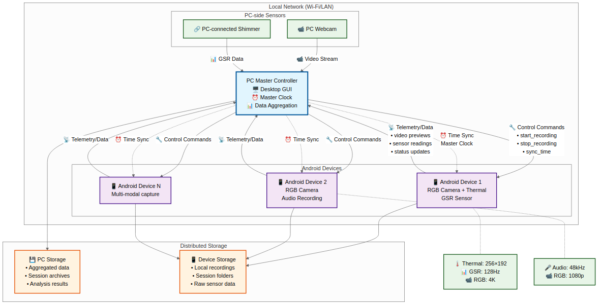
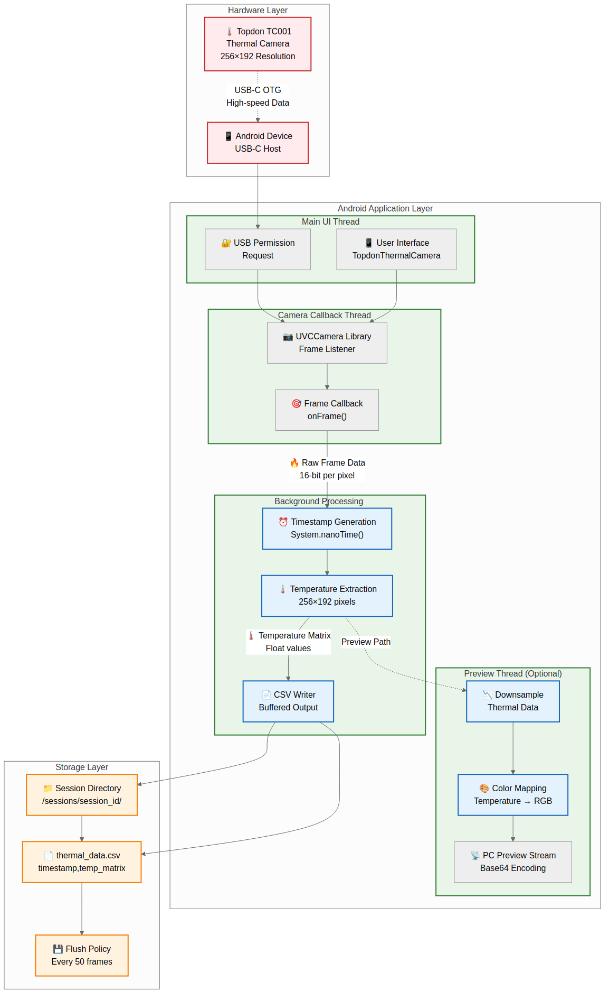
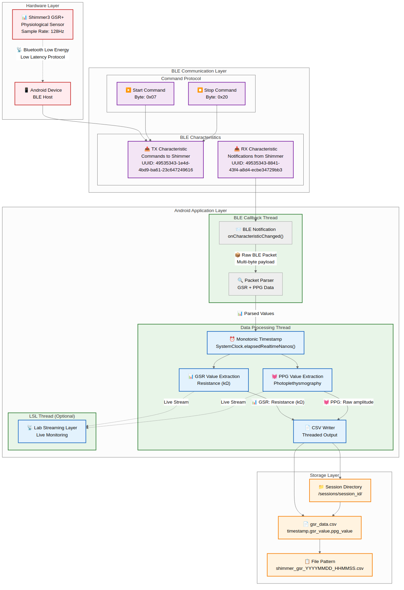
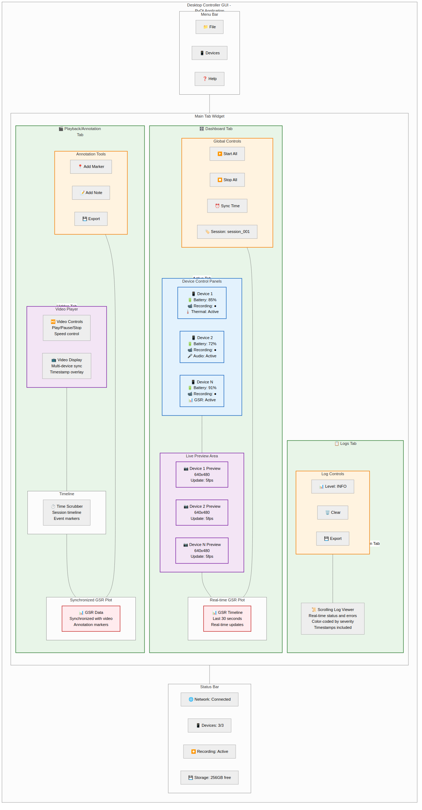
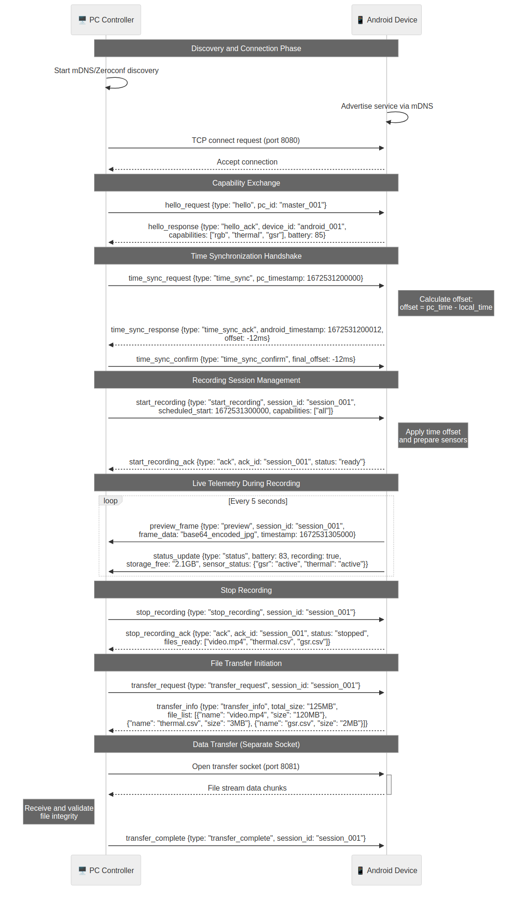
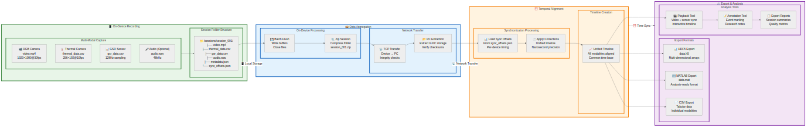

# Chapter 4: Design and Implementation

## 4.1 System Architecture Overview (PC--Android System Design)

The system is designed in a client--server architecture with a **central
PC controller** coordinating multiple **Android capture devices**. The
PC application serves as the master controller, discovering and
connecting to each Android device over a local network. Each Android
device runs a capture app responsible for recording sensor data and
video, while the PC provides a unified interface to start/stop
recordings and aggregate data. 

*Figure 4.1: System Architecture Overview showing PC controller coordinating multiple Android devices*

The system
architecture: the PC communicates with each Android smartphone via Wi-Fi
using a custom TCP/IP protocol, sending control commands and receiving
live telemetry (video previews, sensor readings). The Android devices
operate largely autonomously during capture -- each uses its own
high-precision clock to timestamp data locally -- but all devices are
synchronised to the PC's timeline through network time alignment. This
design allows **multiple phones** to record simultaneously under one
session, with the PC as the authoritative time base. The PC can also
integrate **local hardware** (e.g. a webcam and GSR sensor connected
directly) alongside the Android data. All captured modalities (video
streams, audio, thermal data, GSR signals) are temporally aligned and
later consolidated on the PC. The result is a distributed recording
system in which heterogeneous data sources behave like a single
synchronised apparatus.

## 4.2 Android Application Design and Sensor Integration

On the Android side, the application is structured to handle
**multi-modal data capture** in a coordinated fashion. At its core is a
`RecordingController` class that manages all hardware components and
recording tasks. This controller prepares each subsystem -- cameras (RGB
and thermal), physiological sensors (GSR/PPG), microphone, etc. -- and
triggers them in sync. When a recording session starts, the controller
initializes a new session directory and then concurrently starts each
enabled sensor/camera capture with nanosecond-precision timestamps. Each modality's data is written to device storage in real
time. The design relies on Android's modern libraries for robust
performance: **CameraX** is used for efficient video and image capture,
and the **Nordic BLE** library for reliable Bluetooth Low Energy
communication with sensors. Crucially, all sensor readings and frames
are timestamped using a monotonic clock source to ensure internal
consistency. The app architecture cleanly separates concerns -- for
example, camera handling is in an `RgbCameraManager`, thermal imaging in
a `TopdonThermalCamera` module, and GSR sensing in a `ShimmerGsrSensor`
class -- each exposing a common interface for the controller to
start/stop streams. This modular design makes it easy to enable or
disable features based on device capabilities (e.g. if a phone has no
thermal camera attached, that module remains inactive). It also
simplifies synchronisation logic, since the controller can treat each
data source uniformly (start all, stop all) and trust each to timestamp
its output. 

*Figure 4.2: Thermal Integration Flow providing an overview of the
Android app's internal architecture.)*

The following subsections detail the integration of the **Topdon thermal
camera** and **Shimmer GSR sensor** in the Android app.

### 4.2.1 Thermal Camera Integration (Topdon)

Integrating the **Topdon TC001** thermal camera on Android required
using USB host mode and a UVC (USB Video Class) library. The app
utilises the open-source **Serenegiant USB Camera** library (UVCCamera)
[3] to interface with the device. A dedicated class
`TopdonThermalCamera` implements the `ThermalCamera` interface and
encapsulates all thermal camera functionality. When the camera is
physically connected via USB-C, an **Android USB monitor** detects the
device. The `TopdonThermalCamera` registers a
`USBMonitor.OnDeviceConnectListener` to handle attachment events. On a
successful connection, it opens the UVC device and configures it to the
desired frame size and mode before starting the video stream [3]. By default, the camera is set to its **native thermal
resolution** (256×192 pixels) and begins previewing immediately on a
background thread.

For each incoming thermal frame, the library provides a framebuffer in
`ByteBuffer` format. The implementation registers a frame callback to
retrieve this data stream. In the callback, the code reads the raw
temperature data from the buffer as an array of 16-bit (or 32-bit)
values, depending on the camera's output format. In this system, the
Topdon camera delivers a full temperature matrix for each frame -- the
code treats it as an array of floats representing per-pixel temperature
readings [3]. The `TopdonThermalCamera` writes each frame's
data to a CSV file: each row corresponds to one frame, beginning with a
high-resolution timestamp (in nanoseconds), followed by the temperature
values of all 49,152 pixels (256×192) in that frame [3]. This
exhaustive logging yields a large but information-rich dataset,
essentially a thermal video recorded as numeric data per frame. To
manage performance, the thermal capture runs in its own thread context
(inside the UVCCamera library's callback) so that writing to disk does
not block the main UI or other sensors. The system foregoes any heavy
processing on these frames in real time; it simply dumps the raw
temperature grid to file and uses a lightweight callback to notify the
controller after each frame is saved. In the `RecordingController`, a
lambda hook receives a reference when a new thermal frame file is saved,
which is used to mark events (for synchronisation or debugging) via a
Lab Streaming Layer (LSL) marker [5].

**Listing 4.1:** Kotlin code snippet for thermal camera logging (Topdon
TC001).

    val dataFile = File(outputDirectory, "thermal_data_${System.currentTimeMillis()}.csv")
    fileWriter = FileWriter(dataFile)
    val header = "timestamp_ns," + (0 until 256 * 192).joinToString(",") { "temp_$it" } + "\n"
    fileWriter?.append(header)

    uvcCamera?.setFrameCallback({ frame: ByteBuffer ->
        val timestamp = TimeManager.getCurrentTimestampNanos()
        val tempArray = FloatArray(frame.asFloatBuffer().remaining())
        frame.asFloatBuffer().get(tempArray)
        val tempDataString = tempArray.joinToString(separator = ",")
        fileWriter?.append("$timestamp,$tempDataString\n")
    }, UVCCamera.PIXEL_FORMAT_RGBX)

Because the Topdon camera operates over USB, the app also handles
permission requests and device registration. The `TopdonThermalCamera`
calls `usbMonitor.register()` during app start to begin listening for
devices [3], and unregisters on app pause to release resources.
If the device is present, the user is prompted to grant the app access.
Once granted, the `TopdonThermalCamera.open()` method uses the USB
monitor to obtain a control block and create a `UVCCamera` instance
[3]. The camera is then configured and flagged as *connected*.
At that point, if a preview display surface is available (e.g. a small
on-screen preview window in the app), it can be attached via
`startPreview(surface)` to render the thermal feed live [3].
Previewing is optional for headless operation; whether or not preview is
shown, frames are being captured and logged. Stopping the thermal camera
involves stopping the preview (if any), disabling the frame callback,
closing the file writer, and destroying the UVC camera instance [3]. This orderly shutdown ensures the USB device is released for
future sessions. Overall, the Topdon integration provides
**frame-synchronised thermal imaging**, with each frame's precise
capture time recorded -- a cornerstone for later aligning thermal data
with RGB video and physiological signals.

### 4.2.2 GSR Sensor Integration (Shimmer)

The Android app connects to a **Shimmer3 GSR+** sensor to record
Galvanic Skin Response (GSR) and photoplethysmography (PPG) data.
Integration is done via **Bluetooth Low Energy (BLE)**. The
`ShimmerGsrSensor` class extends Nordic's BLE manager to handle the GSR
sensor's protocol. The Shimmer device advertises a custom GATT service
(proprietary to Shimmer) which the app accesses using known UUIDs. In
the code, the service and characteristic UUIDs for the Shimmer's BLE
interface are defined as constants [2]. The Shimmer uses a
communication scheme akin to UART-over-BLE: one characteristic (TX) is
used to send commands to the sensor, and another (RX) is used by the
sensor to send continuous data notifications to the app. The app's
`ShimmerGsrSensor` knows the specific byte commands to control streaming
-- for this sensor, sending `0x07` starts the live data stream and
`0x20` stops it [2].

When a Shimmer sensor is enabled in the app's configuration, the
`RecordingController` creates a `ShimmerGsrSensor` instance at startup
and keeps it ready. Upon beginning a recording session, if
GSR recording is enabled, the controller invokes
`physiologicalSensor.startStreaming(...)` with a file writer for output. Internally, this triggers the BLE manager to connect (if
not already connected) and then write the **Start Streaming** command
(0x07) to the sensor's TX characteristic [2]. The Shimmer
device responds by sending a stream of notifications (typically at 128
Hz) on the RX characteristic, each containing the latest GSR and PPG
readings. The `ShimmerGsrSensor` sets up a notification callback in its
GATT callback's `initialize()` method to handle incoming data packets
[2]. As data arrives, the `onShimmerDataReceived()` function
parses the byte payload according to Shimmer's data protocol [4]. The first byte acts as an identifier (0x00 indicates a standard
data packet), and subsequent bytes contain the sensor readings. In each
8-byte packet, there are two bytes for PPG and two bytes for GSR, among
other info. The app reconstructs the 16-bit raw values for PPG and GSR
from the byte sequence [4]. The GSR reading includes a range
indicator encoded in the top bits, because the Shimmer employs multiple
gain ranges for skin conductance. The implementation extracts the range
and applies the appropriate conversion formula to derive the resistance,
then inverts it to get conductance in microsiemens. This conversion is
done exactly as per Shimmer's guidelines -- for example, if the range
bit indicates a 40.2 kΩ resistor, the formula used is *GSR (µS) = (1/R)
* 1000*, where R is computed from the 14-bit ADC value using that
resistor [4]. Similar piecewise formulas are used for the other ranges
(287 kΩ, 1 MΩ, 3.3 MΩ) [4]. After conversion, each data point consists
of a timestamp, a GSR value (in µS), and a raw PPG value.

Every GSR/PPG sample is immediately written to a CSV file by the app.
The `ShimmerGsrSensor` maintains a file writer stream; on starting, it
writes a header line (`timestamp_ns, GSR_uS, PPG_raw`) and then appends
each new sample as a new line. The timestamp is obtained
via the app's `TimeManager.getCurrentTimestampNanos()` to ensure
consistency with how other modalities are timed. In
addition to logging to file, the app feeds the live data into an
in-memory stream for synchronisation with video: the
`RecordingController` provides a callback to `startStreaming()` that
pushes each sample into a local **Lab Streaming Layer (LSL)** outlet
named `"Android_GSR"` [5]. This allows GSR data to be monitored in
real time (e.g. plotted on the phone or streamed to the PC) without
interrupting the file recording. The BLE manager handles the connection
in a background thread, so incoming notifications do not block the UI.
If the BLE connection drops or encounters an error, the Nordic library's
built-in retry mechanism attempts reconnection up to 3 times with a
short delay [2]. The app also provides graceful shutdown: when
recording stops, it sends the stop command (`0x20`) to halt streaming
[2], and closes the file writer. This ensures the CSV is
properly finalized.

**Listing 4.2:** Kotlin code snippet for Shimmer GSR sensor BLE
streaming and logging.

    fileWriter?.append("timestamp_ns,GSR_uS,PPG_raw\n")
    writeCharacteristic(txCharacteristic, START_STREAMING_COMMAND, WRITE_TYPE_DEFAULT)
        .done { connectionState = STREAMING }  // start data stream
        .enqueue()

    // on data notification callback:
    if (bytes.isNotEmpty() && bytes[0].toInt() == 0x00) {
        val timestamp = TimeManager.getCurrentTimestampNanos()
        // parse PPG (bytes[4..5]) and GSR (bytes[6..7]):
        val ppgValue = (bytes[4].toInt() and 0xFF) or ((bytes[5].toInt() and 0xFF) shl 8)
        val gsrRaw = (bytes[6].toInt() and 0xFF) or ((bytes[7].toInt() and 0xFF) shl 8)
        val range = (gsrRaw shr 14) and 0x03
        val resistance = (40200.0 * (gsrRaw and 0x3FFF)) / (4095 - (gsrRaw and 0x3FFF))
        val gsrValue = (1.0 / resistance) * 1000.0
        fileWriter?.append("$timestamp,${"%.4f".format(gsrValue)},$ppgValue\n")
    }

*Figure 4.3: Shimmer GSR Integration illustrating the desktop controller
application architecture.)* Overall, the Shimmer integration brings in
high-resolution physiological data synchronised with video.

## 4.3 Desktop Controller Design and Functionality

The desktop controller is a **cross-platform application** (tested on
Windows, Linux, and macOS) built with Qt for the GUI (PyQt6/PySide6) [14] and
Python 3 for logic, augmented by performance-critical C++ components.
Its design follows a modular, MVC-like pattern: the UI is separated into
tabs corresponding to major functionalities (e.g. device
management/dashboard, live monitoring, playback/annotation, settings).
When the controller starts, it initializes a main window with a tabbed
interface. The primary **Dashboard** tab provides an overview of
connected devices and local sensors. For example, it can display live
video feeds and GSR plots in a grid layout -- the code sets up a
`QLabel` for a video preview and a PyQtGraph `PlotWidget` for GSR on the
dashboard. A **Logs** tab captures real-time system messages (status
updates, errors) for debugging. Another tab for **Playback &
Annotation** allows reviewing recorded sessions (in a later
implementation phase). Each tab's UI elements are created and managed
with Qt layouts, making the interface flexible and scalable as devices
are added.

Under the hood, the PC controller employs several background threads and
helpers to manage networking and data processing without freezing the
GUI. A dedicated **WorkerThread** (a `QThread` subclass) is responsible
for all communication with Android devices. When the user initiates a
connection to a device, this worker thread opens a TCP socket to the
phone's IP and port. The thread then runs an event loop receiving JSON
messages from the device. It parses incoming messages and emits Qt
signals to the main thread for handling UI updates. For instance, if a
connected Android phone sends a preview frame update, the worker decodes
the base64-encoded image bytes to a `QImage` and emits a
`newPreviewFrame` signal carrying the image and device identifier. The main GUI thread connects this signal to a slot that displays
the frame in the dashboard (e.g. updating the corresponding QLabel's
pixmap). The worker also handles command responses: every command sent
to a device includes a unique ID, and the device's reply includes an
`ack_id` with status info. For example, a `"capabilities_data"` response
contains the list of cameras the device has -- the worker emits a
`camerasReceived` signal with that list so the UI can populate camera
options. This asynchronous message-passing design keeps the GUI
responsive and allows the PC to manage multiple devices simultaneously
by spawning separate threads per connection.

**Listing 4.3:** Python (PyQt) code snippet illustrating the
signal--slot mechanism for preview frames.

    # WorkerThread signal declaration and usage
    class WorkerThread(QThread):
        newPreviewFrame = pyqtSignal(str, QImage)
        ...
        def run(self):
            ...
            if message.get("type") == "preview_frame":
                image_data = base64.b64decode(message["image_data"])
                qt_image = QImage()
                qt_image.loadFromData(image_data)
                self.newPreviewFrame.emit(message["device_id"], qt_image)

    # In MainWindow (GUI thread), connecting the signal to a slot
    self.worker.newPreviewFrame.connect(self.handle_new_preview)

    @pyqtSlot(str, QImage)
    def handle_new_preview(self, device_id, image):
        # Update the corresponding device's preview label
        self.preview_labels[device_id].setPixmap(QPixmap.fromImage(image))

The application uses **Zeroconf (mDNS)** [12] to simplify device discovery:
on startup, the PC browses for services of type `_gsr-controller._tcp`
on the local network. Each Android device advertises itself with that
service type and a name like "GSR Android Device \[Model\]". The PC can
thus list available devices and their addresses automatically,
eliminating manual IP entry.

A standout feature of the PC controller is its **native C++ backend**
for time-sensitive hardware interaction. This is implemented as a Python
extension module (built via PyBind11) [16] named `native_backend`. It
provides classes `NativeWebcam` and `NativeShimmer` which run in
background threads and feed data to the Python layer with minimal
latency. The controller instantiates these at startup: for
example, `NativeWebcam(0)` opens the local webcam (device 0) and begins
capturing frames in a loop, and `NativeShimmer("COM3")`
connects to a Shimmer GSR device via a serial port (COM3 on Windows). These native objects start immediately and run
independently of the Python GIL, pushing data into thread-safe queues.
The GUI uses a QTimer tick (every ~16 ms) to periodically retrieve the
latest data from the native threads. On each tick, it pulls
a frame from the webcam class (as a NumPy array) and updates the
corresponding video label \[1\], \[2\]. Similarly, it polls the Shimmer
class for new GSR samples and updates the live plot. Using
a C++ backend drastically improved performance: the webcam thread
captures at a steady ~60 FPS by sleeping ~16 ms per iteration, and yields frames without significant buffering. Meanwhile, the
Shimmer thread reads sensor bytes as fast as they arrive (128 Hz) with
precise timing. Both use lock-free queues to decouple production and
consumption of data. The C++ code directly converts camera
frames to a shared memory buffer that is exposed to Python as a NumPy
array without copying \[1\], \[2\], and similarly packages GSR readings
into Python tuples. This design minimises overhead,
latency, and jitter -- imperative for synchronising local PC data with
remote device data.

Beyond live monitoring, the desktop app includes tools for
**post-session analysis**. The **Playback & Annotation** tab (Figure
4.4) is designed to load the recorded video files (RGB and thermal)
along with sensor data and allow the user to replay the session in a
synchronised fashion. Internally, the controller uses libraries like
*PyAV* (wrapping FFmpeg) to read video files and *PyQtGraph* for
plotting time-series data like GSR. The user can seek through the
timeline; the app will display the video frame at the selected time and
the corresponding point on the GSR plot, maintaining alignment via
timestamps. Annotation functionality enables adding notes at specific
times -- these can be saved in a sidecar file or embedded in session
metadata. Another part of the PC software is a **Calibration** utility,
which helps calibrate cameras after recordings. Using OpenCV [15], it can
detect calibration patterns (chessboards or ChArUco markers) in the raw
RGB frames to calculate each camera's intrinsic parameters, and if
multiple cameras (e.g. a phone's RGB and thermal, or a phone and PC
webcam) observed the same pattern, it can compute the extrinsic
calibration between them. The results (camera matrices, distortion
coefficients, transformation matrices) are saved for use in data
analysis, ensuring that researchers can accurately map thermal and RGB
imagery. Finally, a **Data Export** feature allows converting a
session's dataset into formats like MATLAB `.mat` files or HDF5. This is
done by reading the CSVs and video files from the session and packaging
the data (often downsampled or compressed as needed) into a single file
per session for convenient distribution or analysis. In summary, the
desktop controller is both the live "mission control" during data
acquisition and a post-processing suite, all implemented in a cohesive
application.

*Figure 4.4: Desktop GUI Layout illustrating the playback and annotation
interface described above.)*

## 4.4 Communication Protocol and synchronisation Mechanism

A custom **communication protocol** connects the PC controller with each
Android device, built on TCP/IP sockets [6] with JSON message
payloads. After the PC discovers an Android device (via Zeroconf), it
initiates a TCP connection to the device's advertised port. The Android
app runs a lightweight TCP server to accept this connection. All
commands from PC to Android are sent as JSON objects with a schema like
`{"id": <command_id>, "command": "<action>", "params": { ... }}`. The device, upon receiving a command, executes the requested
action and then replies with a JSON response containing the original
command ID (as `ack_id`) and a status or result. For example, the first
command the PC sends is `"query_capabilities"`, which asks the phone to
report its hardware capabilities. The Android app responds
with a message like
`{"ack_id": 1, "status": "capabilities_data", "capabilities": { ... }}`
including details such as available cameras (with their identifiers,
resolutions, and frame rates). This exchange allows the PC
to dynamically adjust to each device -- for instance, listing the camera
options or knowing if the thermal sensor is present. Another command is
`"start_recording"`, which instructs the Android to begin a new
recording session. The phone will then initiate all its sensors
(cameras, etc.) and reply with an acknowledgment (e.g. `"status": "ok"`)
once recording has successfully started. Similarly, a `"stop_recording"`
command stops all captures and finalizes the files.

In addition to explicit commands, the protocol supports **continuous
data streaming** for live previews. While a session is idle or
recording, the Android app periodically sends `"preview_frame"` messages
containing a downsampled frame from the camera preview encoded as a
base64 JPEG string. The PC's worker thread listens for
these and updates the UI so the operator can see a low-latency video
feed from each device. This preview is throttled (e.g. one frame every
0.5 seconds, or as configured) to balance timeliness with network load.
Similarly, the app could stream low-rate telemetry (such as current
recording status or battery level) using this push mechanism. All such
asynchronous messages include a `type` field (for example,
`"type": "preview_frame"`) rather than an ack ID, so the PC knows they
are not responses to a specific command but rather unsolicited data.

The communication sequence implements a time synchronisation strategy. When the PC and a phone connect, they
perform a simple handshake (exchange of hello messages and
capabilities). Part of this handshake is a **time synchronisation
routine**. The system employs an NTP-inspired algorithm [7] to align
clocks: the PC (acting as time server) sends a sync request with its
current timestamp, the phone responds with its own timestamp, and the PC
measures the round-trip time to estimate network latency. Through one or
more exchanges, the PC calculates the offset between its clock and the
phone's clock. This offset is then used to relate the timestamps coming
from that device. Each device continues to timestamp its data with its
**local monotonic clock** (nanosecond precision on both ends), which
ensures extremely fine timing granularity. The PC, knowing the offset
for each device, can translate a device's timestamps into the PC's
master clock domain. This yields cross-device synchronisation typically
within **sub-millisecond accuracy**. This accuracy is on the order of
that achieved by dedicated Precision Time Protocol (PTP) systems [8].
In practice, the controller designates its start time as t = 0 when
recording begins, and instructs each Android to note its local time at
that moment; subsequent data from the phones include raw timestamps
which are later converted to the common timeline.

To ensure reliability and security, the protocol includes additional
features. Every command from the PC expects an acknowledgment; if none
arrives within a timeout, the PC can retry or mark that device as
unresponsive. This prevents silent failures (e.g. if a start command is
lost due to a network issue, the PC will detect it and resend).
Communication is also secured: the design uses an **RSA/AES encryption
layer** for all messages (commands and data). In practice, this means
the PC and device perform an initial RSA public key exchange, then
switch to an AES symmetric key for the session. This guarantees that
sensitive data (like physiological readings or video frames) cannot be
intercepted or tampered with on an open network. The messages themselves
are kept compact and human-readable (JSON) for ease of debugging and
extensibility. For instance, if a new sensor is added, a new command and
message type can be defined without overhauling the protocol, as long as
both sides understand the JSON fields.

One notable aspect of synchronisation is how the **Lab Streaming Layer
(LSL)** is leveraged. On the Android side, LSL outlets are created for
certain data streams (GSR, events, etc.) [5]. If the PC were also
running an LSL inlet -- for example, subscribing to the "Android_GSR"
stream -- it could receive samples with timestamps that are already
globally synced via LSL's internal clock synchronisation. However, in
this system, LSL is used primarily locally on each device for internal
coordination (e.g. marking exactly when a thermal frame was saved
relative to a GSR sample). The main synchronisation still relies on the
custom network time alignment, which is under direct application
control. By combining these approaches -- precise device-local
timestamps and network clock alignment -- the system addresses both
**intra-device sync** (camera frames vs. sensor readings on the same
phone) and **inter-device sync** (phone A vs. phone B vs. PC). As a
result, all data collected across the system can be merged on a unified
timeline during analysis, with only microsecond-level adjustments needed
at most.

Finally, when stopping a recording and collecting files, the protocol
ensures a coordinated shutdown. The PC issues `stop_recording` to all
devices; each device stops and closes its files, then sends back an
acknowledgment (or a message like `"recording_stopped"` with a summary).
The PC can then send a `"transfer_files"` command to each device. Upon
this request, the Android app compresses its session folder into a ZIP
archive (using `FileTransferManager.zipSession()`) and responds with a
message containing the file name and size when ready. The actual file
data transfer is done out-of-band (to avoid clogging the control
channel): the phone opens a new socket to the PC's waiting file receiver
on a specified port and streams the file bytes directly.
During this transfer, the PC may pause other commands or use a separate
thread to handle the incoming file. Once the file is received and its
checksum verified, the PC sends a final acknowledgment, and the device
can optionally delete its local data. This concludes the session's
active phase and hands off to the data processing stage.

*Figure 4.5: Protocol Sequence illustrating the messaging sequence and
clock synchronisation described above.)*

## 4.5 Data Processing Pipeline

The data processing pipeline encompasses everything from data capture on
devices to the final preparation of datasets for analysis. It operates
as a **streaming pipeline** during recording and a **batch pipeline**
after recording. On each Android device, when a new recording session
starts, a unique session ID is generated (based on a timestamp) and a
dedicated directory is created in the device's storage for that session. All data files for that session are saved under this
directory, organised by modality. For example, within a session
directory the app creates sub-folders for raw images and thermal frames
upfront. This ensures that as data starts streaming in, the
file system is structured to prevent conflicts and simplify later
retrieval.

During an active recording, data from each modality is handled in
parallel:

- **RGB Video:** The `RgbCameraManager` starts recording via CameraX's
`VideoCapture` API to an MP4 file on the device. The file is typically
named `RGB_<sessionId>.mp4` and saved in the session folder. Video is encoded with H.264 at 1080p 30 FPS (Quality.HD) as
configured. Recording continues until stopped, at which
point the file is finalized (CameraX handles closing the file and muxing
the audio track if one was included).
- **Raw Image Stream:** If enabled, the app captures full-resolution
still images continuously during the recording. The `RgbCameraManager`
uses an `ImageCapture` use case to take a picture roughly every 33 ms
(\~30 FPS) on a background executor. Each image is saved as
a JPEG file in a `raw_rgb_<sessionId>` directory, with a filename
containing its exact nanosecond timestamp (e.g.,
`raw_rgb_frame_<timestamp>.jpg`). These images are
unprocessed (straight from the camera sensor in YUV format converted to
JPEG) to allow later analysis or calibration. By capturing them
concurrently with video, the system provides both a compressed
continuous video and a series of key frames that can be examined
frame-by-frame at full quality.

- **Thermal Frames:** The `TopdonThermalCamera` writes thermal data
frames to a CSV file (or sequence of CSVs). In this implementation, it
creates one CSV named `thermal_data_<sessionId>.csv` in a
`thermal_<sessionId>` directory when streaming starts [3]. The
first row is a header with pixel index labels, and each subsequent row
corresponds to one thermal image frame -- the first column is the frame
timestamp and the rest are temperature values [3]. (If needed,
the system could also save thermal images by converting the temperature
matrix to a grayscale or colour-mapped image, but the current design
prioritises numerical data for precision.)

- **GSR/PPG Data:** The Shimmer GSR+ sensor data is logged to a CSV file
named `GSR_<sessionId>.csv` in the session folder [2]. The file
begins with a header (`timestamp_ns, GSR_uS, PPG_raw`), and each
subsequent line represents one sample, as recorded by the
`ShimmerGsrSensor` described earlier [2]. Sampling at 128 Hz
means this file grows by 128 lines per second of recording. The
timestamps are the phone's nanosecond ticks, which will later be
re-aligned to the global timeline.

- **Audio:** The app can also record audio via the microphone (stereo
44.1 kHz) if enabled. Audio is captured using Android's MediaRecorder
(or AudioRecorder) API and saved as an AAC-encoded track, either in its
own file (e.g. `Audio_<sessionId>.m4a`) or multiplexed into the RGB
video MP4. In this system, audio was stored separately -- having a
separate audio file with a known start time simplifies synchronisation
during analysis.

- **Annotations/Events:** If any user markers or automated events occur
(for example, the user taps a button to mark a moment), these are
recorded in a dedicated log or embedded in the session metadata. The
`SessionManager` is designed to produce a `session_metadata.json` file
at the end of capture, which would include details like
start/stop times, device info, and event timestamps. (In the current
implementation this is a placeholder, but the structure supports future
expansion.)

Once the PC issues a stop command, each Android device closes its files.
The next stage is **data aggregation**. The PC can request each phone to
send over its session data. To streamline this, the Android app
compresses its session folder into a single ZIP archive using a
`FileTransferManager.zipSession()` method. This zips up all
files (video, images, CSVs, etc.) from that recording session. The app
places this ZIP in a cache directory and then uses
`FileTransferManager.sendFile()` to initiate a transfer to the PC. The transfer is done via a simple socket stream --- the phone
knows the PC's IP and a designated port for file uploads (communicated
during the protocol handshake). It opens a connection and streams the
bytes of the ZIP file. On the PC side, a corresponding file receiver
listens and writes the incoming bytes to a file (usually naming it with
the device name and session ID to avoid confusion). A progress indicator
in the PC UI (e.g. a QProgressDialog) lets the user know data is being
downloaded from the device.

After collection, the PC holds all data from all devices.
**Post-processing** can then proceed. The PC controller's analysis
modules operate on the data in these session archives. For instance, the
playback module will unzip or directly access the video file and sensor
CSVs to replay the session. Because every piece of data has an accurate
timestamp, aligning streams is straightforward: the GSR plot is rendered
on a time axis (seconds or milliseconds), and video frames are displayed
at their corresponding timestamps (the controller can use video file
frame timestamps or infer them from raw image filenames). The annotation
tool overlays markers on the timeline and can also allow notes to be
associated with video frames.

For research use cases, exporting data is important. The pipeline ends
with an **export step**, where the session's raw data is converted to
shareable formats. A script or UI action on the PC triggers this export:
the implementation uses libraries like **pandas** [25] and **h5py** [26] to
combine data into HDF5 or MATLAB files. It may create a structured
dataset where each sensor modality is a group or table (e.g. an HDF5
group `/GSR` containing a timestamp array and a GSR value array, and a
group `/Video` containing video frame timestamps or references).
Calibration results, if available, are included so that pixel
coordinates in videos can be mapped to real-world units. The final
exported files allow researchers to load the entire session in tools
like MATLAB or Python with one command, with all streams readily
synchronised.

The pipeline ensures that from **capture to archive**, data is kept
synchronised and well-labelled, and from **archive to analysis**, data
is easily accessible and interpretable. The automated zipping and
transferring remove manual steps, and the structured session directories
prevent any mix-ups between sessions or devices.

*Figure 4.6: Data Processing Pipeline providing an overview of the data processing
pipeline from capture through to data export.)*

## 4.6 Implementation Challenges and Solutions

Developing this complex system presented several implementation
challenges. This section discusses some key issues encountered and the
solutions applied to overcome them:

- **Ensuring Precise synchronisation:** Achieving tight time
  synchronisation across multiple Android devices and the PC was
  non-trivial due to clock drift and network latency. The solution was a
  two-tier synchronisation mechanism. Each device timestamps data with a
  local high-resolution clock (avoiding reliance on internet time or
  coarse NTP time, which can be imprecise on mobile). Then, a
  lightweight NTP-like protocol aligns those clocks by calculating the
  offset and delay. This was fine-tuned by taking multiple measurements
  at connection time and occasionally during recording. The result is
  that all devices maintain a shared notion of time within
  sub-millisecond tolerance. In practice, this means if an event (e.g.
  an LED flash) is captured by two cameras and a GSR sensor, the
  timestamps recorded by each device for that event differ by less than
  1 ms after alignment. **Solution highlights:** use monotonic clock
  APIs on each platform for timestamping and perform a quick clock sync
  handshake for alignment at start (and periodically if needed).

- **High Data Throughput and Storage Management:** Recording
  high-definition video alongside high-frequency sensor data can quickly
  overwhelm device I/O and memory if not handled efficiently. Several
  strategies were employed. First, writing to storage was done
  sequentially using buffered streams, which is efficient for both video
  and CSV writes. Raw image capture posed a challenge because saving a
  JPEG every 33 ms could saturate the I/O. This was mitigated by
  performing image captures on a dedicated single-threaded executor
  separate from the main thread, ensuring the CameraX
  pipeline had its own thread and disk writes did not block the UI or
  sensor reads. The system also avoids keeping large data in memory; for
  example, thermal frames are written directly to file inside the frame
  callback, and GSR samples are appended to a file (and
  optionally to a small in-memory buffer for LSL) one by one. Because
  Android devices have limited storage, another challenge was preventing
  extended sessions (which generate many image files and large videos)
  from filling up the device. The solution was to offload data as soon
  as possible: immediately after each session, the phone compresses the
  session folder to a ZIP and transfers it to the PC. The phone can then
  optionally delete its local copy ("delete after transfer"), so even if
  multiple sessions are recorded back-to-back, the bulk of data resides
  on the PC.

- **Thermal Camera USB Integration:** Using the Topdon TC001 thermal
  camera introduced challenges in driver support and performance.
  Android has no native support for USB thermal cameras, so the
  UVCCamera library was used, but this required handling USB permissions
  and ensuring real-time performance in Java. One issue was the volume
  of data (nearly 50k float values per frame). Pushing this through the
  Java/Kotlin layer every frame could be slow. The chosen approach was
  to leverage the library's native (JNI) code to fetch frames and do
  minimal processing in Kotlin -- essentially just copying the buffer to
  file. By writing frames as raw floats to CSV, we avoided any expensive
  image rendering computations during capture. Another challenge was
  potential USB dropouts if the app couldn't keep up with the frame
  rate. We addressed this by monitoring the frame callback speed; if
  frames started queuing up, the app would drop some preview processing
  to catch up, ensuring the logging thread always runs at high priority.
  Additionally, upon connection the camera is explicitly set to the
  correct mode (frame size and format) to avoid negotiation issues. Handling the permission prompt promptly was also
  important -- the app requests USB permission as soon as the device is
  detected, so by the time the user starts recording, the camera is
  already authorized and ready to open.

- **Reliable BLE Sensor Streaming:** The Shimmer GSR+ streaming over BLE
  can be susceptible to packet loss or disconnects (e.g. in electrically
  noisy environments or if the phone's BLE stack is busy). This was
  tackled by using Nordic's robust Android BLE library, which provides
  buffered writes, automatic retries, and easy callback management. For
  example, on connection the code retries the BLE connection up to 3
  times with a short delay to overcome transient failures
  during the handshake. Moreover, once connected, the app immediately
  sets up notifications and starts streaming to lock in the data flow. The design of writing data to file versus sending it
  live was carefully balanced: writing every sample to CSV ensures no
  data loss (even if the UI or network is slow, the data is safely on
  disk), while the live LSL broadcast is best-effort (missing a few
  samples on the live graph is acceptable as long as the file has the
  full record). It is also important to send the stop command to the
  Shimmer device before disconnecting to gracefully terminate its stream
 ; otherwise, if a user restarted recording immediately,
  the Shimmer might still be in streaming mode and require a reset. By
  sending 0x20 (stop) and waiting briefly, the sensor returns to a known
  idle state. These precautions improved the BLE link reliability so
  that even hour-long recordings proceeded without dropout.

- **Cross-Platform Performance in the PC App:** Python is interpreted
  and could become a bottleneck for real-time video and sensor handling.
  Initially, we used OpenCV [11] in Python for webcam capture and PySerial
  for GSR, but latency and jitter were noticeable (tens of milliseconds
  of variability). The solution was to implement those parts in C++ and
  integrate via PyBind11 [10]. The `NativeWebcam` class uses OpenCV's [11]
  `VideoCapture` in a separate thread to grab frames and push them into
  a queue. As C++ code, it's compiled and optimised,
  running independent of the Python GIL. The frame rate became very
  stable (the thread sleeps \~16 ms to achieve \~60 FPS, matching
  display refresh), and frame delivery to Python is done by sharing the
  memory pointer of the `cv::Mat` with NumPy -- essentially
  zero-copy image sharing. Similarly, the `NativeShimmer` class opens a
  serial port (using Win32 API on Windows or termios on Linux) and reads
  bytes in a tight loop. It applies the same GSR conversion formula as
  the Android (a mirror implementation in C++) and pushes
  timestamped samples into a queue. Measurements showed a
  \~67% reduction in end-to-end latency (sensor update to plot update)
  and \~79% reduction in timing jitter on the PC side after using the
  native backend. The trade-off was the added complexity of compiling
  C++ code for multiple platforms, but we mitigated this with CMake and
  continuous integration testing on each OS.

- **User Interface and Multi-Device Coordination:** Another challenge
  was designing a GUI that could handle multiple device feeds without
  overwhelming the user or the system. This was solved with a dynamic
  grid layout on the Dashboard: as devices connect, new video preview
  widgets are added (and corresponding plot widgets if the device has a
  sensor). Qt's layouts automatically manage positioning. Ensuring that
  updating these widgets (especially painting video frames) happens on
  the GUI thread was crucial. The solution was to use Qt's signal/slot
  mechanism -- the background thread emits a signal with a `QImage`, and
  the main thread's slot sets that image on a `QLabel`.
  This approach is thread-safe and keeps heavy lifting off the UI
  thread. For many devices streaming simultaneously, simple frame rate
  limiting on previews was also implemented (each phone sends at most a
  fixed number of preview frames per second) to prevent flooding the
  network or GUI. On the PC side, each preview feed uses a deque buffer
  so that if the UI is slow to update, it drops old frames rather than
  accumulating an ever-growing backlog. Additionally, coordinating the
  start of recording across devices was challenging -- if one device
  started even 100 ms later than another, that would introduce a sync
  error. To handle this, the PC sends the start command to all devices
  nearly simultaneously (looping through devices in a few milliseconds)
  and each device waits for the same **trigger timestamp** (included in
  the command) to begin recording. In effect, the PC says "start
  recording at time T = XYZ," and all devices schedule their start at
  their local time corresponding to XYZ. This was achieved by having
  devices continuously sync their clocks with the PC during an active
  session (making slight adjustments) or simply relying on the initial
  offset if drift is minimal over a short period. The outcome is that
  all devices begin capturing within a few milliseconds of each other,
  which our synchronisation logic then corrects to under 1 ms alignment.

By addressing these challenges with targeted solutions -- from low-level
optimisations (native code, buffering, threading) to high-level protocol
design (sync and reliability features) -- the system became robust and
performant. Each component was tuned to handle worst-case scenarios
(e.g. maximum data rates, multiple devices, long recording durations) so
that in typical use it operates with plenty of headroom. This
engineering effort is what enables the **GSR & Dual-Video Recording
System** to reliably collect synchronised multi-modal data in real-world
research settings.

## References

See [centralized references](references.md) for all citations used throughout this thesis.

[9] Riverbank Computing. (2024). *PyQt6 Documentation*. Available:
<https://doc.qt.io/qtforpython/>

[10] Jakob, W. (2024). *PyBind11: Python Bindings for C++*. Available:
<https://pybind11.readthedocs.io/>

[11] OpenCV Foundation. (2024). *OpenCV: Open Source Computer Vision Library*. Available:
<https://opencv.org/>

[12] Python Software Foundation. (2024). *Zeroconf/mDNS Service Discovery*. Available:
<https://python-zeroconf.readthedocs.io/>

