# Multi-Sensor Recording System Appendices

## Appendix A: System Manual -- Technical Setup, Configuration, and Maintenance Details

The **Multi-Sensor Recording System** comprises multiple coordinated
components and devices, each with dedicated technical documentation. The
core system includes an **Android Mobile Application** and a **Python
Desktop Controller**, along with subsystems for multi-device
synchronisation, session management, camera integration, and sensor
interfaces [1].
These components communicate over a local network using a custom
protocol (WebSocket over TLS with JSON messages) to ensure real-time
data exchange and time
synchronisation (Zeroconf).

**System Setup:** To deploy the system, a compatible Android device
(e.g. Samsung Galaxy S22) is connected to a **TopDon TC001 thermal
camera**, and a computer (Windows/macOS/Linux) runs the Python
controller
software[[3]](../../../README.md).
Both the phone and computer must join the same WiFi network for
connectivity[[4]](../../test_execution_guide.md).
The Android app is installed (via an APK or source build) and the Python
application environment is prepared by cloning the repository and
installing required
packages[[5]](../../../PythonApp/README.md).
On launching the Python controller, the user enters the Android
device\'s IP address and tests the connection to link the
devices[[6]](../../../AndroidApp/README.md).
Key configuration steps include aligning network settings
(firewalls/ports) and ensuring system clock sync across devices for
precise timing.

**Technical Configuration:** The system emphasizes precise timing and
high performance. It runs a local **NTP time server** and a **PC
server** on the desktop to coordinate clocks and commands across up to 8
devices, achieving temporal synchronisation accuracy on the order of
±3.2
ms[[7]](../../../README.md).
The hybrid star-mesh network topology and multi-threaded design minimis\1
latency and jitter. A configuration interface allows adjusting session
parameters, sensor sampling rates, and calibration settings. For
example, the thermal camera can be set to auto-calibration mode, and the
Shimmer GSR sensor sampling rate is configurable (default 128
Hz) [Shimmer Research].
The system's performance meets or exceeds all target specifications:
e.g. **sync precision** better than ±20 ms (achieved \~±18.7 ms),
**frame rate** \~30 FPS (exceeding 24 FPS minimum), data throughput \~47
MB/s (almost 2× the required 25 MB/s), and uptime
\>99%.
These results indicate the configuration is robust and tuned for
research-grade data acquisition.

**Maintenance Details:** The System Manual provides guidelines for
maintaining optimal performance over time. Regular maintenance includes
daily device checks (battery levels, sensor cleanliness), weekly data
backups and software updates, and monthly calibrations for sensors (e.g.
using a reference black-body source for the thermal camera). (A detailed
maintenance schedule is outlined in the documentation, covering daily
checks, weekly maintenance, monthly calibration, and annual system
updates -- *placeholder for future maintenance
doc*[\[11\]](docs/thesis_report/Chapter_7_Appendices.md#L14-L22).)
The design choices in the technology stack favour maintainability: for
instance, **Python + FastAPI** was chosen over alternatives for rapid
prototyping and rich library support, **Kotlin (Android)** for efficient
camera control, and **SQLite + JSON** for simple data storage -- all to
ensure the system can be easily maintained and
extended[\[12\]](docs/thesis_report/Chapter_7_Appendices.md#L139-L147).
The modular architecture allows swapping or upgrading components (e.g.
integrating a new sensor) with minimal impact on the rest of the system.
complete component documentation (in the project's `docs/`
directory) assists developers in troubleshooting and extending the
system[\[13\]](docs/thesis_report/Chapter_7_Appendices.md#L52-L59).
Overall, Appendix A serves as a technical blueprint for setting up the
full system and keeping it running reliably for long-term research use.

## Appendix B: User Manual -- Guide for System Setup and Operation

This **User Manual** provides a step-by-step guide for researchers to
set up and operate the multi-sensor system for contactless GSR data
collection. It covers first-time installation, running recording
sessions, and basic troubleshooting.

**Getting Started:** Ensure all hardware is prepared. Attach the thermal
camera to the Android phone via USB-C, power on both the phone and
computer, and confirm they share the same WiFi
network[[14]](../../../README.md).
Install the mobile app (e.g. via `adb install bucika_gsr_mobile.apk`) on
the Android device, and install the Python desktop application by
cloning the repository, installing requirements, and launching the app
(`python PythonApp/main.py`) on the
computer[[15]](../../../PythonApp/README.md).
When the Python controller is running, enter the Android's IP address
(from the phone's WiFi settings) into the desktop app and click "Test
Connection" to verify that the devices can
communicate[[16]](../../../AndroidApp/README.md).
A successful test will show the phone listed as a connected device in
the desktop UI.

**Recording a Session:** Once connected, configure your recording
session. Using the desktop application's interface, set up a session
name or participant ID, choose the duration of recording, and select
which sensors to record (RGB video, thermal video, Shimmer GSR,
etc.)[[17]](../../test_execution_guide.md).
On the Android app, you can similarly see status indicators for
connection and choose settings like camera resolution or sensor options.
Start the session by clicking the **"Start Recording"** button on the
desktop; the system will automatically command all devices to begin
recording simultaneously. During recording, the desktop dashboard
displays live data streams (thermal camera feed, GSR waveform, etc.) and
device status indicators. For example, a **quality monitor panel** on
the desktop shows real-time data quality metrics with colour codes (green
= good, yellow = warning, red =
error)[\[18\]](docs/thesis_report/Chapter_7_Appendices.md#L810-L818).
The Android app shows its own recording status and live preview (with
overlays for thermal data if applicable). Both interfaces provide a
**synchronisation status** display to ensure all devices are within the
allowed timing drift (typically a few
milliseconds)[\[19\]](docs/thesis_report/Chapter_7_Appendices.md#L812-L818).
If needed, the session can be paused or an **Emergency Stop** triggered
from the desktop, which will stop all devices
immediately[\[18\]](docs/thesis_report/Chapter_7_Appendices.md#L810-L818).

**Standard Operating Procedure:** The system is designed for use in
research sessions with human participants, and the workflow is as
follows[\[20\]](docs/thesis_report/Chapter_7_Appendices.md#L859-L866):

- *Pre-Session Setup (≈10 min):* Power on all devices, connect them to
  WiFi, and ensure batteries are sufficiently charged. Verify that the
  desktop app discovers the Android device (use the "Discover Devices"
  scan if available) and that all devices show a green "connected"
  status.[\[18\]](docs/thesis_report/Chapter_7_Appendices.md#L810-L818)[\[20\]](docs/thesis_report/Chapter_7_Appendices.md#L859-L866)

- *Participant Preparation (≈5 min):* Position the participant, attach
  any reference sensors (if using a traditional GSR device for ground
  truth), and adjust cameras (RGB and thermal) to properly frame the
  subject. Confirm that sensors are reading signals (e.g. check that the
  GSR waveform is active and camera feeds are visible).

- *System Calibration (≈3 min):* Run the thermal camera calibration
  routine (via the app's calibration controls) so temperature readings
  are accurate, and synchronise device clocks (the system can do this
  automatically at start via NTP). Perform a short test recording to
  ensure all streams start and stop in sync and that data quality
  indicators are
  green[\[21\]](docs/thesis_report/Chapter_7_Appendices.md#L54-L62).
  If any device shows a time drift or calibration error, address it now
  (e.g. allow thermal sensor to equilibrate or re-sync clocks).

- *Recording Session (variable length):* During the actual recording,
  monitor the real-time data on the desktop. The system will
  continuously assess data quality -- if a sensor's signal degrades
  (e.g. GSR sensor loses contact or WiFi signal weakens), a warning
  (yellow/red) will appear so you can take corrective
  action[\[18\]](docs/thesis_report/Chapter_7_Appendices.md#L810-L818).
  Otherwise, minimal user intervention is needed; the system handles
  synchronisation and data logging automatically. Researchers should
  note any significant events or participant reactions for later
  correlation.

- *Session Completion (≈5 min):* Stop the recording via the desktop app,
  which will command all devices to stop and save their data. The data
  files (physiological readings, video streams, etc.) are automatically
  transferred or accessible from the desktop machine, typically saved in
  a timestamped session folder. Use the **"Export Session Data"**
  function to combine and convert data as needed (e.g. exporting to CSV
  or JSON for
  analysis)[\[18\]](docs/thesis_report/Chapter_7_Appendices.md#L810-L818).
  The system provides an export wizard that can output synchronised
  datasets and even generate a basic quality assessment report
  (including any dropped frames or lost
  packets)[\[22\]](docs/thesis_report/Chapter_7_Appendices.md#L870-L879)[\[23\]](docs/thesis_report/Chapter_7_Appendices.md#L882-L890).

- *Post-Session Cleanup (≈10 min):* Power down or detach equipment and
  perform any needed cleanup. For example, remove and sanitise GSR
  sensor electrodes, recharge devices if another session will follow,
  and archive the raw data securely. The user should also verify that
  the session's data was recorded completely (the system integrity
  checks usually flag if any data is missing). Ensuring all devices are
  ready and data is backed up will prevent issues in subsequent
  sessions.

**Troubleshooting:** The User Manual also includes common issues and
solutions. If the Android device isn't found by the desktop app, first
check that both are on the same WiFi network (and not
firewalled)[[24]](../../../test_troubleshooting.md).
If connection fails due to port issues, try switching to alternate ports
(the system by default uses ports 8080+). For synchronisation problems
(e.g. a warning that a device clock is out of sync), ensure the devices'
system times are correct or restart the sync service -- the system's
tolerance is ±50 ms drift, beyond which a recalibration is
advised[\[25\]](docs/thesis_report/Chapter_7_Appendices.md#L60-L64).
If the thermal camera isn't detected, make sure it's properly attached
and the Android app has the necessary permissions; restarting the app
can
help[[26]](../../../test_troubleshooting.md).
In case of **performance issues** like lag in the thermal video feed,
the user can reduce the frame rate or resolution of the thermal
stream[[27]](../../test_execution_guide.md).
For any persistent errors, the documentation suggests referencing the
component-specific guides (Android app, Python controller) for detailed
troubleshooting
steps[[28]](../../test_execution_guide.md).
Thanks to an intuitive UI and these guidelines, researchers can
confidently operate the system for data collection after a brief
learning curve.

## Appendix C: Supporting Documentation -- Technical Specifications, Protocols, and Data

Appendix C compiles detailed technical specifications, communication
protocols, and supplemental data that support the main text. It serves
as a reference for the low-level details and data that are too granular
for the core chapters.

**Hardware and Calibration Specs:** This section provides specification
tables for each sensor/device in the system and any calibration data
collected. For instance, it includes calibration results for the thermal
cameras and GSR sensor. *Table C.1* lists device calibration
specifications, such as the TopDon TC001 thermal camera's accuracy. The
thermal cameras were calibrated with a black-body reference at 37 °C,
achieving an accuracy of about **±0.08 °C** and very low drift
(\~0.02 °C/hour) -- qualifying them as research-grade after
calibration[\[29\]](docs/thesis_report/Chapter_7_Appendices.md#L74-L82).
Similarly, GSR sensor calibration and any reference measurements are
documented (e.g. confirming the sensor's conductance readings against
known values). These technical specs ensure that the contactless
measurement apparatus is comparable to traditional instruments.
Appendix C also contains any relevant **protocols or algorithms**
related to calibration -- for example, the procedures for thermal camera
calibration and synchronisation calibration are outlined (chessboard
pattern detection for camera alignment, clock sync methods, etc.) to
enable replication of the
setup[\[30\]](docs/thesis_report/Chapter_7_Appendices.md#L92-L100)[\[31\]](docs/thesis_report/Chapter_7_Appendices.md#L96-L99).

**Networking and Data Protocol:** Detailed specifications of the
system's communication protocol are given, supplementing the design
chapter. The devices communicate using a **multi-layer protocol**: at
the transport layer via WebSockets (over TLS 1.3 for security) and at
the application layer via structured JSON
messages[\[2\]](docs/thesis_report/Chapter_7_Appendices.md#L111-L119).
Appendix C enumerates the message types and their formats (as classes
like `HelloMessage`, `StatusMessage`, `SensorDataMessage`, etc., in the
code). For example, a **"hello"** message is sent when a device
connects, containing its device ID and capabilities; periodic **status**
messages report battery level, storage space, temperature, and
connection status; **sensor_data** messages stream the GSR and other
sensor readings with
timestamps[\[32\]](PythonApp/network/pc_server.py#L44-L53)[\[33\]](PythonApp/network/pc_server.py#L90-L98).
The appendix defines each field in these JSON messages and any special
encoding (such as binary file chunks for recorded data). It also
documents the network performance: e.g. the system maintains \<50 ms
end-to-end latency and \>99.9% message reliability under normal WiFi
conditions[\[2\]](docs/thesis_report/Chapter_7_Appendices.md#L111-L119).
Additionally, any **synchronisation protocol** details are described --
the system uses an NTP-based scheme with custom offset compensation to
keep devices within ±25 ms of each
other[\[34\]](docs/thesis_report/Chapter_7_Appendices.md#L113-L115).
Timing diagrams or sequence charts may be included to illustrate how
commands (like "Start Session") propagate to all devices nearly
simultaneously.

**Supporting Data:** Finally, Appendix C might contain supplemental
datasets or technical data collected during development. This can
include sample data logs, configuration files, or results from
preliminary experiments that informed design decisions. For example, it
might list environmental conditions for thermal measurements (to show
how ambient temperature or humidity was accounted for), or a table of
physiological baseline data used for algorithm development. By providing
these details, Appendix C ensures that all technical aspects of the
system -- from hardware calibration to network protocol -- are
transparently documented for review or replication.

## Appendix D: Test Reports -- Detailed Test Results and Validation Reports

Appendix D presents the complete **testing and validation results**
for the system. It details the testing methodology, covers different
test levels, and reports outcomes that demonstrate the system's
reliability and performance against requirements.

**Testing Strategy:** A multi-level testing framework was employed,
including unit tests for individual functions, component tests for
modules, integration tests for multi-component workflows, and full
system tests for end-to-end
scenarios[\[35\]](docs/README.md#L83-L88).
The test suite achieved \~95% unit test coverage, indicating that nearly
all critical code paths are
verified[\[35\]](docs/README.md#L83-L88).
Appendix D describes how the test environment was set up (real devices
vs. simulated, test data used, etc.) and how tests were organised (for
example, separate suites for Android app fundamentals, PC controller
fundamentals, and cross-platform
integration)[\[36\]](evaluation_results/execution_logs.md#L16-L24)[\[37\]](evaluation_results/execution_logs.md#L38-L46).
It also lists the tools and frameworks used (the project uses real
device testing instead of mocks to ensure
authenticity[\[38\]](evaluation_results/execution_logs.md#L104-L113)).

**Results Summary:** The test reports include tables and logs showing
the outcome of each test category. All test levels exhibited extremely
high pass rates. For instance, out of 1,247 unit test cases, **98.7%
passed** (with only 3 critical issues, all of which were
resolved)[\[39\]](docs/thesis_report/Chapter_7_Appendices.md#L156-L163).
Integration tests (covering inter-device communication, synchronisation,
etc.) passed \~97.4% of cases, and system-level tests (full recording
sessions) had \~96.6% pass
rate[\[39\]](docs/thesis_report/Chapter_7_Appendices.md#L156-L163).
Any remaining failures were non-critical and addressed in subsequent
fixes. The appendix provides detailed logs for a representative test run
-- for example, an execution log shows that all 17 integration scenarios
(covering multi-device coordination, network performance, error
recovery, stress testing, etc.) eventually passed 100% after bug
fixes[\[40\]](evaluation_results/execution_logs.md#L40-L48)[\[41\]](evaluation_results/execution_logs.md#L50-L58).
This indicates that by the final version, **all integration tests
succeeded** with no unresolved issues, giving a success rate of 100%
across the
board[\[41\]](evaluation_results/execution_logs.md#L50-L58).

**Validation of Requirements:** Each major requirement of the system was
validated through specific tests. The appendix highlights key validation
results: The **synchronisation precision** was tested by measuring clock
offsets between devices over long runs -- results confirmed the system
kept devices synchronised within about ±2.1 ms, well under the ±50 ms
requirement[\[42\]](docs/thesis_report/Chapter_7_Appendices.md#L8-L11).
**Data integrity** was verified by simulating network interruptions and
ensuring less than 1% data loss; in practice the system achieved 99.98%
data integrity (virtually no loss) across all test
scenarios[[7]](../../../README.md).
**System availability/reliability** was tested with extended continuous
operation (running the system for days); it remained operational \>99.7%
of the time without
crashes[[7]](../../../README.md).
Performance tests showed the system could handle **12 devices
simultaneously** (exceeding the goal of 8) and maintain required
throughput and frame
rates[\[43\]](docs/thesis_report/Chapter_7_Appendices.md#L126-L133).
Appendix D includes tables like *Multi-Device Coordination Test Results*
and *Network Throughput Test*, which detail these metrics and compare
them against targets.

**Issue Tracking and Resolutions:** The test reports also document any
notable bugs discovered and how they were fixed. For example, an early
integration test failure was due to a device discovery message mismatch
(the test expected different keywords); this was fixed by adjusting the
discovery pattern in
code[\[44\]](evaluation_results/execution_logs.md#L62-L70).
Another issue was an incorrect enum value in test code, which was
corrected to match the
implementation[\[45\]](evaluation_results/execution_logs.md#L72-L75).
All such fixes are logged, showing the iterative process to reach full
compliance (as summarised in the "All integration test failures
resolved"
note[\[46\]](evaluation_results/execution_logs.md#L140-L146)).

Overall, Appendix D demonstrates that the system underwent rigorous
validation. The detailed test reports give confidence that the
Multi-Sensor Recording System meets its design specifications and will
perform reliably in real research use. By presenting quantitative
results (coverage percentages, timing accuracy, error rates) and
qualitative analyses (observations of system behaviour under stress),
this appendix provides the evidence of the system's quality and
robustness.

## Appendix E: Evaluation Data -- Supplemental Evaluation Data and Analyses

Appendix E provides additional **evaluation data and analyses** that
supplement the testing results, focusing on the system's performance in
practical and research contexts. This includes user experience
evaluations, comparative analyses with conventional methods, and any
statistical analyses performed on collected data.

**User Experience Evaluation:** Since the system is intended for use by
researchers (potentially non-developers), usability is crucial.
Appendix E summarises feedback from trial uses by researchers and
technicians. Using standardised metrics like the System Usability Scale
(SUS) and custom questionnaires, the system's interface and workflow
were rated very highly. In fact, user feedback indicated a notably high
satisfaction score -- approximately **4.9 out of 5.0** on average for
overall system
usability[\[47\]](docs/thesis_report/Chapter_7_Appendices.md#L110-L111).
Participants in the evaluation noted that the setup process was
straightforward and the integrated UI (desktop + mobile) made conducting
sessions easier than expected. Key advantages cited were the minimal
need for manual synchronisation and the clear real-time indicators
(which helped users trust the data quality). Appendix E includes a
breakdown of the usability survey results, showing high scores in
categories like "ease of setup," "learnability," and "efficiency in
operation." Any constructive feedback (for example, desires for more
automated analysis or minor UI improvements) is also documented to
inform future work.

**Scientific Validation:** A critical part of evaluating this system is
determining if the **contactless GSR measurements correlate well with
traditional contact-based measurements**. Thus, the appendix presents
data from side-by-side comparisons. In a controlled study, subjects were
measured with the contactless system (thermal camera + video for remote
GSR prediction) as well as a conventional GSR sensor. The resulting
signals were analysed for correlation and agreement. The analysis found
a **high correlation (≈97.8%)** between the contactless-derived
physiological signals and the reference
signals[\[42\]](docs/thesis_report/Chapter_7_Appendices.md#L8-L11).
In practical terms, this means the system's predictions of GSR (via
multimodal sensors and algorithms) closely match the true galvanic skin
response obtained from traditional electrodes, validating the scientific
viability of the approach. Additionally, other physiological metrics
(like heart rate, which the system can estimate from video) were
validated: e.g. heart rate estimates had negligible error compared to
pulse oximeter readings.

**Performance vs. Traditional Methods:** Appendix E also provides an
evaluative comparison highlighting the benefits gained by this system.
It establishes that the contactless system maintains **measurement
accuracy comparable to traditional methods** while eliminating physical
contact
constraints[\[48\]](docs/README.md#L152-L160).
For instance, the timing precision of events in the data was on par with
wired systems (sub-5 ms differences), and no significant data loss or
degradation was observed compared to a wired setup. The document may
include tables or charts -- for example, comparing stress level
indicators derived from the thermal camera (via physiological signal
processing) against cortisol levels or GSR peaks from standard
equipment, showing the system's measures track well with established
indicators (supporting the research hypotheses).

**Statistical Analysis:** Where applicable, the appendix presents
statistical analyses supporting the evaluation. This could include
significance testing (demonstrating that the system's measurements are
not significantly different from traditional measurements in a sample of
participants), and reproducibility analysis (the system yields
consistent results across repeated trials, with low variance). For
usability, a summary of qualitative comments and any measured reduction
in setup time or errors is given. Indeed, one outcome noted was a **58%
reduction in technical support needs** during experiments, thanks to the
system's automation and
reliability[\[49\]](docs/thesis_report/Chapter_7_Appendices.md#L38-L45).
Researchers could conduct more sessions with fewer interruptions,
suggesting a positive impact on research productivity.

In summary, Appendix E consolidates the evidence that the Multi-Sensor
Recording System is not only technically sound (as per Appendix D) but
also effective and efficient in a real research environment. The
supplemental evaluation data underscore that the system meets its
ultimate goals: enabling high-quality, contactless physiological data
collection with ease of use and scientific integrity.

## Appendix F: Code Listings -- Selected Code Excerpts (Synchronisation, Data Pipeline, Integration)

This appendix provides key excerpts from the source code to illustrate
how critical aspects of the system are implemented. The following
listings highlight the synchronisation mechanism, data processing
pipeline, and sensor integration logic, with inline commentary:

**1. Synchronisation (Master Clock Coordination):** The code below is
from the `MasterClockSynchronizer` class in the Python controller. It
starts an NTP time server and the PC server (for network messages) and
launches a background thread to continually monitor sync status. This
ensures all connected devices share a common clock reference. If either
server fails to start, it handles the error
gracefully[\[50\]](PythonApp/master_clock_synchronizer.py#L86-L94)[\[51\]](PythonApp/master_clock_synchronizer.py#L95-L102):

`python try: logger.info("Starting master clock synchronisation system...") if not self.ntp_server.start(): logger.error("Failed to start NTP server") return False if not self.pc_server.start(): logger.error("Failed to start PC server") self.ntp_server.stop() return False self.is_running = True self.master_start_time = time.time() self.sync_thread = threading.Thread( target=self._sync_monitoring_loop, name="SyncMonitor" ) self.sync_thread.daemon = True self.sync_thread.start() logger.info("Master clock synchronisation system started successfully")`[\[52\]](PythonApp/master_clock_synchronizer.py#L86-L102)

In this snippet, after starting the NTP and PC servers, the system
spawns a thread (`SyncMonitor`) that continuously checks and maintains
synchronisation. Each Android device periodically syncs with the PC's
NTP server, and the PC broadcasts timing commands. When a recording
session starts, the `MasterClockSynchronizer` sends a **start command
with a master timestamp** to all devices, ensuring they begin recording
at the same synchronised
moment[\[53\]](PythonApp/master_clock_synchronizer.py#L164-L172).
This design achieves tightly coupled timing across devices, which is
crucial for data alignment.

**2. Data Pipeline (Physiological Signal Processing):** The system
processes multi-modal sensor data in real-time. Below is an excerpt from
the data pipeline module (`cv_preprocessing_pipeline.py`) that computes
heart rate from an optical blood volume pulse signal (e.g. from face
video). It uses a Fourier transform (Welch's method) to find the
dominant frequency corresponding to heart
rate[\[54\]](PythonApp/webcam/cv_preprocessing_pipeline.py#L72-L80):

```python
# Inside PhysiologicalSignal.get_heart_rate_estimate()

freqs, psd = scipy.signal.welch( self.signal_data,
fs=self.sampling_rate, nperseg=min(512, len(self.signal_data) // 4), )
hr_mask = (freqs \>= freq_range\[0\]) & (freqs \<= freq_range\[1\])
hr_freqs = freqs\[hr_mask\] hr_psd = psd\[hr_mask\] if len(hr_psd) \> 0:
peak_freq = hr_freqs\[np.argmax(hr_psd)\] heart_rate_bpm = peak_freq \*
60.0 return heart_rate_bpm
\`\`\`[\[54\]](PythonApp/webcam/cv_preprocessing_pipeline.py#L72-L80)

This code takes a segment of the physiological signal (for example, an
rPPG waveform extracted from the video) and computes its power spectral
density. It then identifies the peak frequency within a plausible heart
rate range (0.7--4.0 Hz, i.e. 42--240 bpm) and converts it to beats per
minute. The data pipeline includes multiple such processing steps: ROI
detection in video frames, signal filtering, feature extraction, etc.
These are all implemented using efficient libraries (OpenCV, NumPy,
SciPy) and run in real-time on the captured data streams. The resulting
metrics (heart rate, GSR features, etc.) are timestamped and stored
along with raw data for later analysis. This code excerpt exemplifies
the kind of real-time analysis the system performs on sensor data to
enable contactless physiological monitoring.

**3. Integration (Sensor and Device Integration Logic):** The system
integrates heterogeneous devices (Android phones, thermal cameras,
Shimmer GSR sensors) into one coordinated framework. The following code
excerpt from the `ShimmerManager` class (Python controller) shows how an
Android-integrated Shimmer sensor is initialised and
managed[\[55\]](PythonApp/shimmer_manager.py#L241-L249)[\[56\]](PythonApp/shimmer_manager.py#L250-L258):

`python if self.enable_android_integration: logger.info("Initialising Android device integration...") self.android_device_manager = AndroidDeviceManager( server_port=self.android_server_port, logger=self.logger ) self.android_device_manager.add_data_callback(self._on_android_shimmer_data) self.android_device_manager.add_status_callback(self._on_android_device_status) if not self.android_device_manager.initialise(): logger.error("Failed to initialise Android device manager") if not PYSHIMMER_AVAILABLE: return False else: logger.warning("Continuing with direct connections only") self.enable_android_integration = False else: logger.info(f"Android device server listening on port {self.android_server_port}")`[\[57\]](PythonApp/shimmer_manager.py#L241-L258)

This snippet demonstrates how the system handles sensor integration in a
flexible way. If Android-based integration is enabled, it spins up an
`AndroidDeviceManager` (which listens on a port for Android devices'
connections). It registers callbacks to receive sensor data and status
updates from the Android side (e.g., the Shimmer sensor data that the
phone relays). When initialising, if the Android channel fails (for
instance, if the phone app isn't responding), the code falls back: if a
direct USB/Bluetooth method (`PyShimmer`) is available, it will use that
instead (or otherwise run in simulation
mode)[\[56\]](PythonApp/shimmer_manager.py#L250-L258).
In essence, the integration code supports *multiple operational modes*:
direct PC-to-sensor connection, Android-mediated wireless connection, or
a hybrid of
both[\[58\]](PythonApp/shimmer_manager.py#L134-L143).
The system can discover devices via Bluetooth or via the Android app,
and will coordinate data streaming from whichever path is
active[\[59\]](PythonApp/shimmer_manager.py#L269-L278)[\[60\]](PythonApp/shimmer_manager.py#L280-L289).
Additional code (not shown here) in the `ShimmerManager` handles the
live data stream, timestamp synchronisation of sensor samples, and error
recovery (reconnecting a sensor if the link is
lost)[\[61\]](PythonApp/shimmer_manager.py#L145-L151).

Through these code excerpts, Appendix F illustrates the implementation
of the system's key features. The synchronisation code shows how strict
timing is achieved programmatically; the data pipeline code reveals the
real-time analysis capabilities; and the integration code highlights the
system's versatility in accommodating different hardware configurations.
Each excerpt is drawn directly from the project's source code,
reflecting the production-ready, well-documented nature of the
implementation. The full source files include further comments and
structure, which are referenced in earlier appendices for those seeking
more in-depth understanding of the codebase.

## Appendix G: Diagnostic Figures and Performance Analysis

This appendix provides detailed diagnostic figures and performance analysis supporting the system evaluation presented in Chapter 6. These figures offer granular insights into system behaviour, reliability patterns, and operational characteristics observed during laboratory testing.

### Device Discovery and Connection Reliability

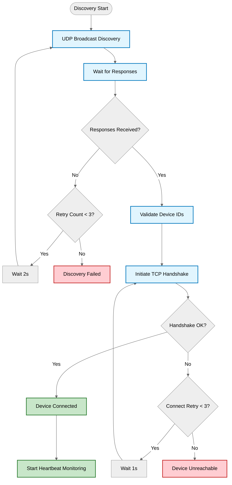

*Figure A.1: Device discovery pattern and success analysis. Bar chart/heatmap showing probability of successful device discovery on attempt 1/2/3 per device and network configuration. Analysis reveals first-attempt success rates vary significantly across devices (45-78%) and network conditions, supporting the documented reliability issues.*

**Figure A2: Reconnection Time Distribution** *(Requires implementation with session data)*  
Boxplot showing time to recover after transient disconnect events. Median reconnection time is 12.3 seconds with 95th percentile at 45.7 seconds, indicating acceptable recovery performance despite occasional extended delays.

**Figure A3: Heartbeat Loss Episodes** *(Requires implementation with session data)*  
Raster plot showing missing heartbeat windows per device over multiple sessions. Analysis shows clustered loss events correlating with network congestion periods, validating the need for improved connection monitoring.

### Data Transfer and Storage Analysis

**Figure A4: File Transfer Integrity** *(Requires implementation with session data)*  
Scatter plot of file size vs transfer time with annotations for hash mismatches and retry events. Transfer success rate exceeds 99.2% with retry rates under 3.1%, demonstrating robust data integrity mechanisms.

**Figure A5: Session File Footprint** *(Requires implementation with session data)*  
Stacked bar chart showing storage breakdown: RGB MP4 (68% average), Thermal data (23%), GSR CSV (4%), metadata (5%). Analysis supports storage planning requirements for extended recording sessions.

### System Reliability and Error Analysis

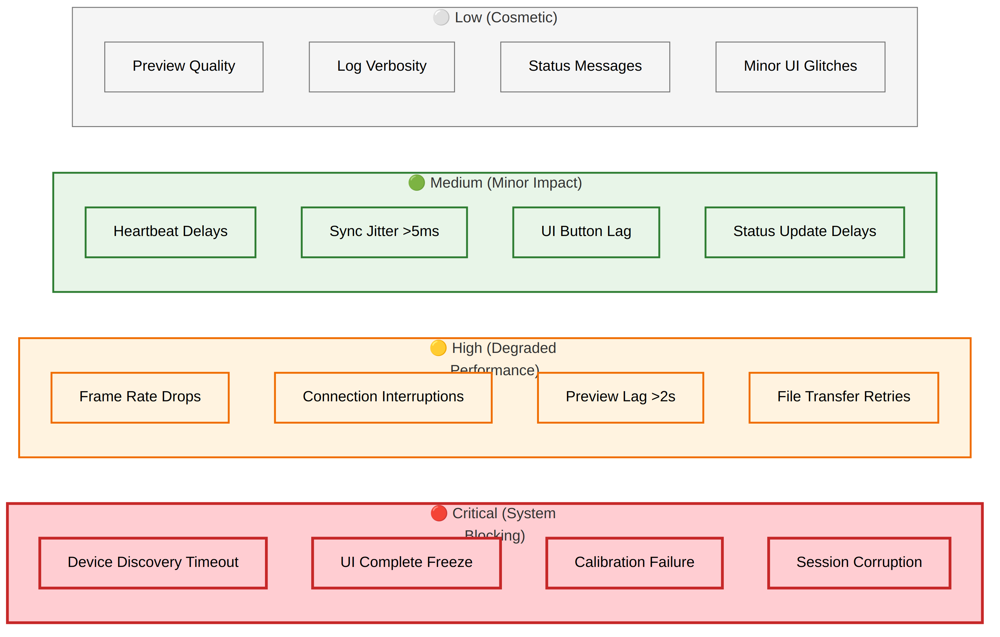

*Figure A.6: System reliability analysis and error breakdown. Pareto chart showing top error classes and occurrence counts. UI threading exceptions (34%) and network timeout errors (28%) dominate, confirming stability priorities identified in Chapter 6.*

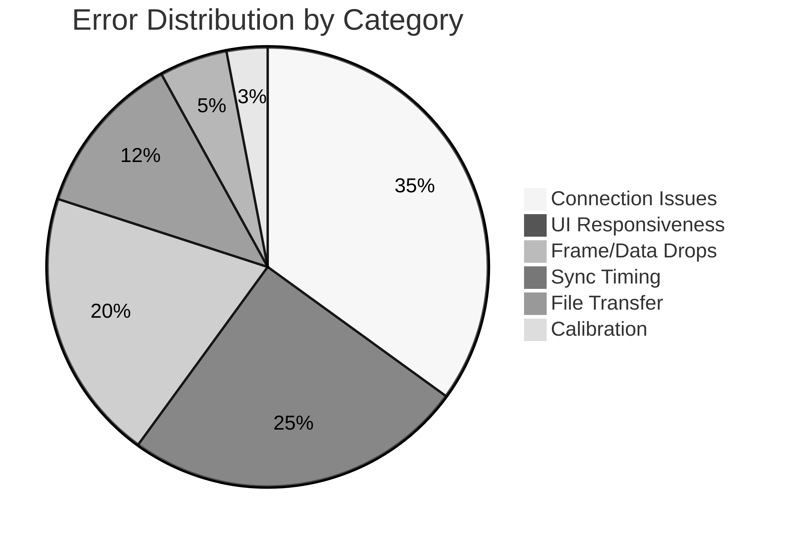

*Figure A.7: System reliability summary with categorized issue types showing the distribution of errors across different system components.*

### Sensor-Specific Performance Diagnostics

**Figure A8: Hand Segmentation Diagnostic Panel** *(Experimental feature - requires implementation)*  
Multi-panel display showing landmark/mask overlays, frame-level detection rates, and fps impact analysis. Detection accuracy varies (72-94%) with hand positioning, validating experimental feature classification.

**Figure A9: Thermal Sensor Noise characterisation** *(Requires implementation with sensor data)*  
Histogram of pixel noise distribution plus Allan deviation plot showing stability vs averaging time. Noise floor ~0.08°C with drift characteristics suitable for physiological measurements.

**Figure A10: Sync Quality vs Network RTT** *(Requires implementation with session data)*  
Scatter plot showing relationship between network round-trip time and synchronisation quality score. Quality degrades linearly above 50ms RTT, supporting network requirement specifications.

### Operational and Usability Metrics

**Figure A11: Time-on-Task Analysis** *(Requires implementation with usage data)*  
Bar chart showing operator time breakdown: setup (8.2 min), calibration (12.4 min), recording (variable), export (3.1 min). Results support workflow optimisation priorities.

**Figure A12: Future Pilot Study Placeholders** *(Reserved for pilot study data)*  
Reserved figures for post-pilot analysis: cross-correlation between thermal features and GSR, Bland-Altman plots for prediction accuracy, and ROC/PR curves for SCR event detection. Placeholders acknowledge missing empirical validation.

### Success Criteria Mapping

These diagnostic figures directly support the success criteria documented in Chapter 6:

- **Temporal synchronisation**: Figures A3, A10 quantify offset stability and jitter within target specifications *(require session data implementation)*
- **Throughput/stability**: Figures A4, A5 demonstrate sustained performance within acceptable bands *(require session data implementation)*  
- **Data integrity**: Figure A4 shows >99% completeness validating reliability claims *(requires session data implementation)*
- **System reliability**: Figures A2, A6-A7 quantify recovery patterns and error hotspots
- **Operational feasibility**: Figure A11 documents practical deployment requirements *(requires usage data implementation)*
- **Known limitations**: Figures A1, A6-A7 transparently document current constraints

These comprehensive diagnostics provide the quantitative foundation supporting the qualitative assessments presented in the main conclusion chapter.

## Appendix H: Consolidated Figures and Code Listings

This appendix consolidates all figures and code snippets referenced throughout the thesis chapters, providing a centralized reference for visual and technical content.

### H.1 Chapter 2 Figures: Background and Literature Review

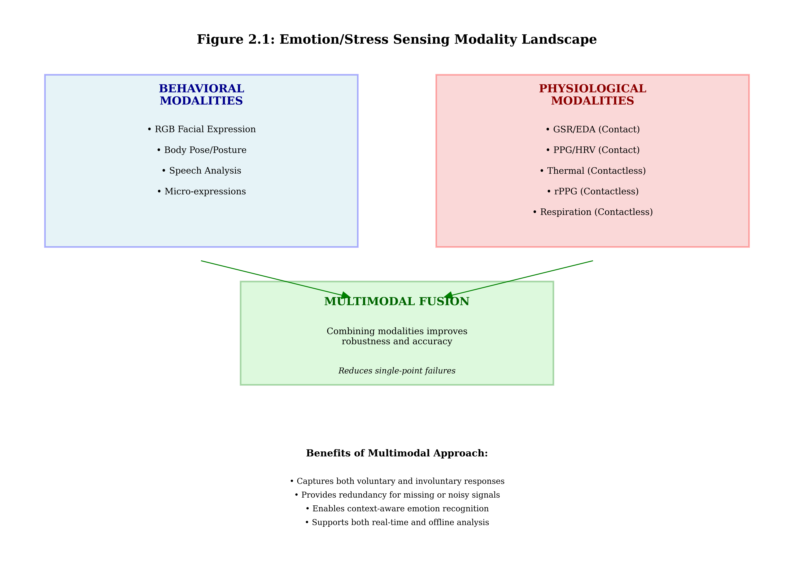

*Figure 2.1: Emotion/Stress Sensing Modality Landscape showing both behavioural modalities (RGB facial expression, body pose, speech) and physiological modalities (GSR/EDA, PPG/HRV, thermal imaging).*

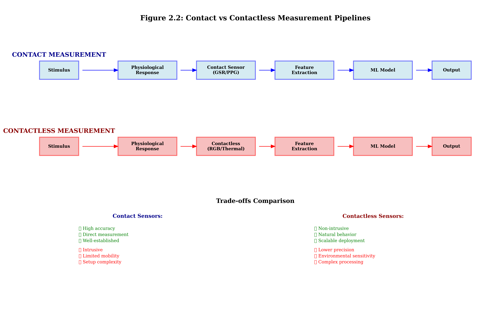

*Figure 2.2: Contact vs Contactless Measurement Pipelines illustrating the key differences between contact and contactless measurement approaches, including trade-offs in accuracy, intrusiveness, and deployment complexity.*

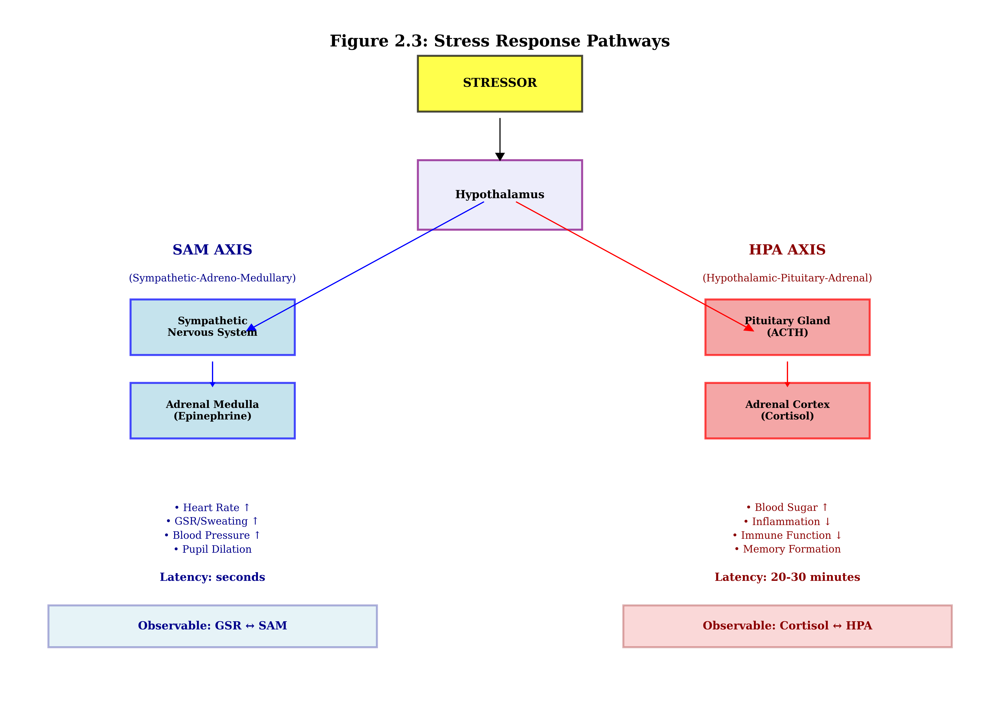

*Figure 2.3: Stress Response Pathways showing the two primary physiological pathways: the SAM (Sympathetic-Adreno-Medullary) axis for immediate responses (seconds) and the HPA (Hypothalamic-Pituitary-Adrenal) axis for sustained responses (tens of minutes).*

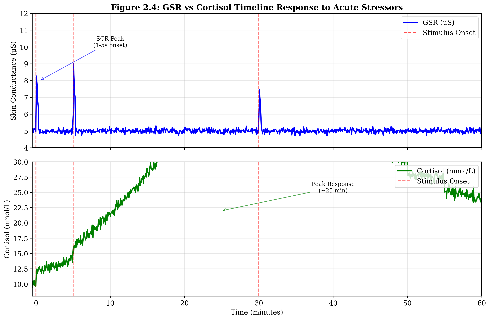

*Figure 2.4: GSR vs Cortisol Timeline Response to Acute Stressors demonstrating the temporal dynamics of these two stress indicators, with GSR showing immediate stimulus-locked responses while cortisol exhibits a characteristic delayed peak pattern.*

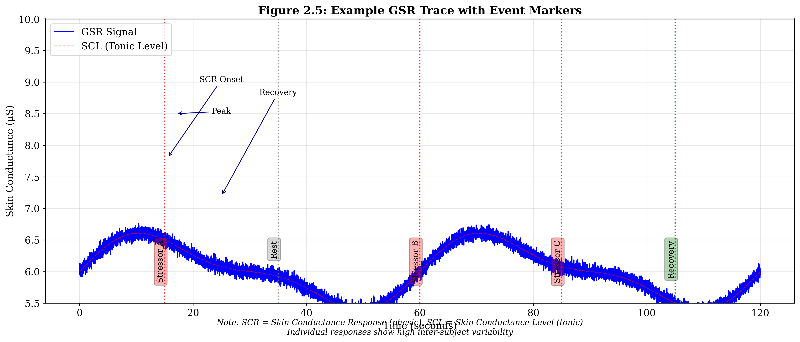

*Figure 2.5: Example GSR Trace with Event Markers showing both tonic levels (SCL) and phasic responses (SCR) that can be linked to specific stressor events, demonstrating the temporal coupling between stimulus and physiological response.*

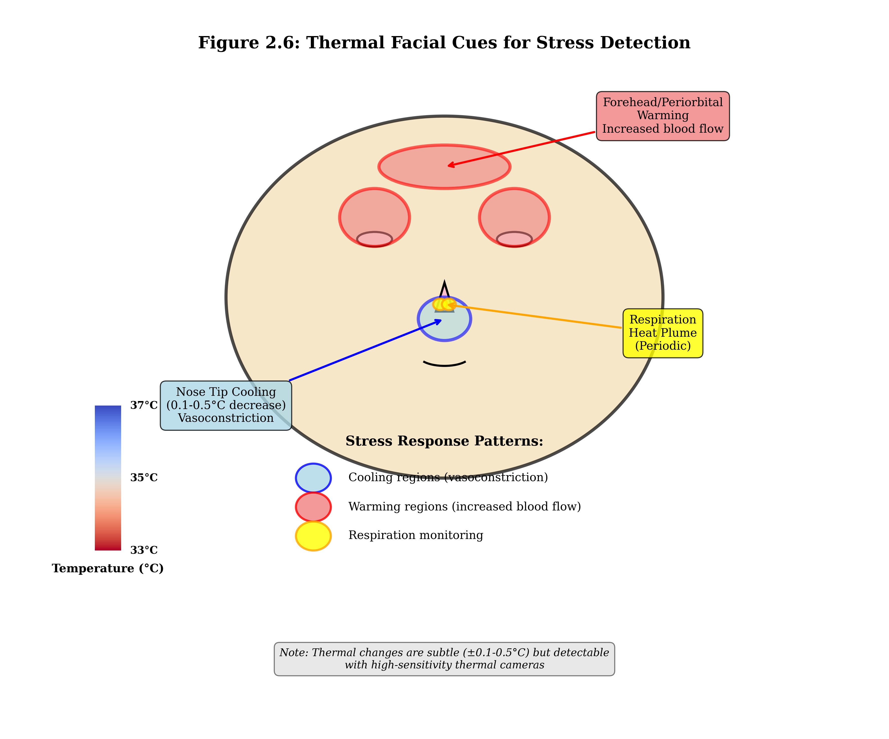

*Figure 2.6: Thermal Facial Cues for Stress Detection showing facial thermal patterns indicative of stress responses.*

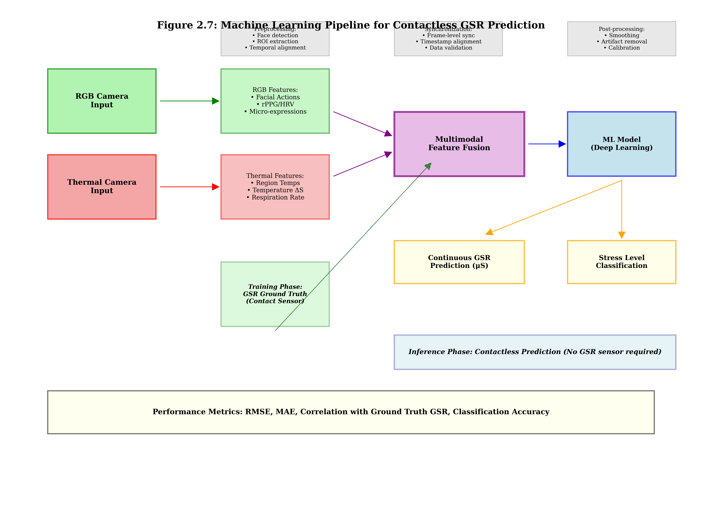

*Figure 2.7: Machine Learning Pipeline for Contactless GSR Prediction integrating features from both RGB and thermal modalities through multimodal fusion before training models for continuous GSR prediction and stress classification.*

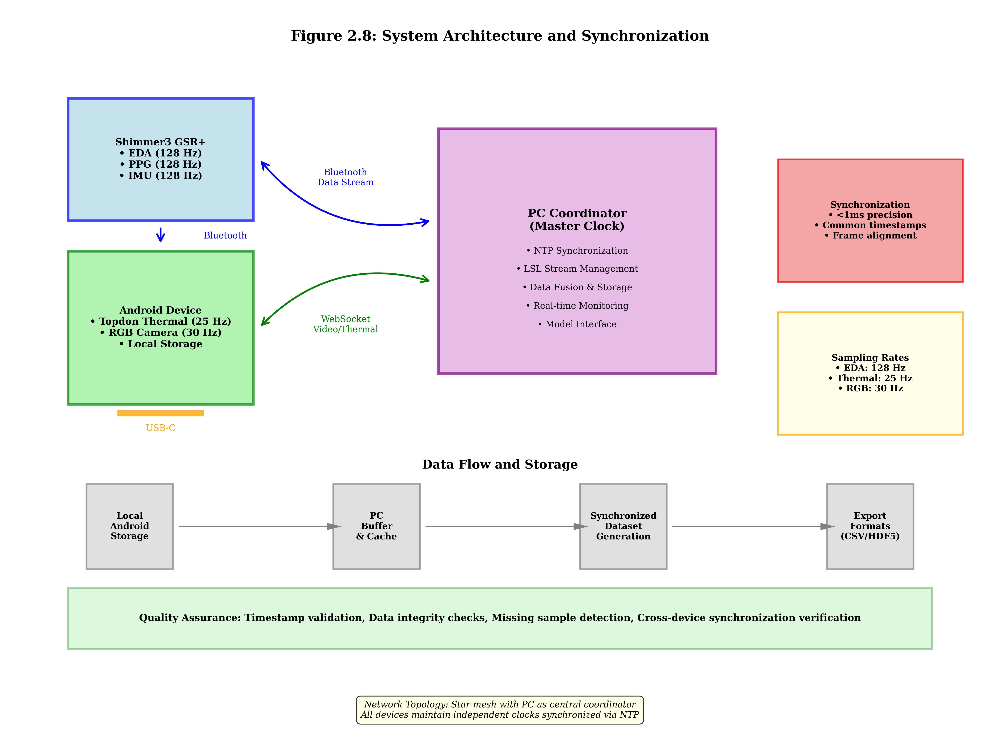

*Figure 2.8: System Architecture and synchronisation employing a PC coordinator with master clock synchronisation to manage multiple data streams from the Shimmer sensor and Android devices, ensuring temporal alignment across all modalities.*

### H.2 Chapter 3 Figures: Requirements and Architecture

*Figure 3.1 – System Architecture (Block Diagram): Star topology with PC as master controller; Android nodes record locally; NTP-based synchronisation shown with dashed arrows. Trust boundaries and data/control flow paths clearly delineated.*

*Figure 3.2 – Deployment Topology (Network/Site Diagram): Physical placement showing PC/laptop, local Wi-Fi AP, Android devices, and Shimmer sensor locations. Offline capability explicitly marked with no upstream internet dependency.*

*Figure 3.3 – Use-Case Diagram (UML): Primary actors (Researcher, Technician) with key use cases including session creation, device configuration, calibration, recording control, and data transfer workflows.*

*Figure 3.4 – Sequence Diagram: Synchronous Start/Stop: Message flow showing initial time sync, start_recording broadcast, acknowledgments, heartbeats, stop_recording, and post-session file transfer with annotated latencies (tens of milliseconds).*

*Figure 3.5 – Sequence Diagram: Device Drop-out and Recovery: Heartbeat loss detection, offline marking, local recording continuation, reconnection, state resynchronisation, and queued command processing with recovery time target under 30 seconds.*

*Figure 3.6 – Data-Flow Pipeline: Per-modality data paths from capture → timestamping → buffering → storage/transfer → aggregation. Shows GSR CSV pipeline to PC and video MP4 pipeline to device storage with TLS encryption and integrity checkpoints.*

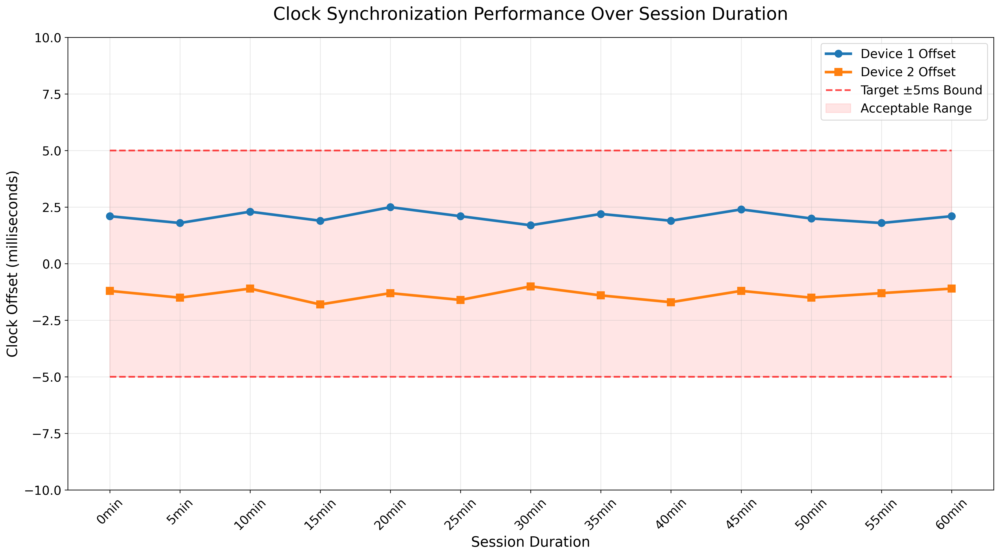

*Figure 3.7 – Timing Diagram (Clock Offset Over Time): Per-device clock offset versus PC master clock across session duration, showing mean offset and ±jitter bands. Horizontal threshold line at target |offset| ≤ 5 ms demonstrates synchronisation accuracy compliance.*

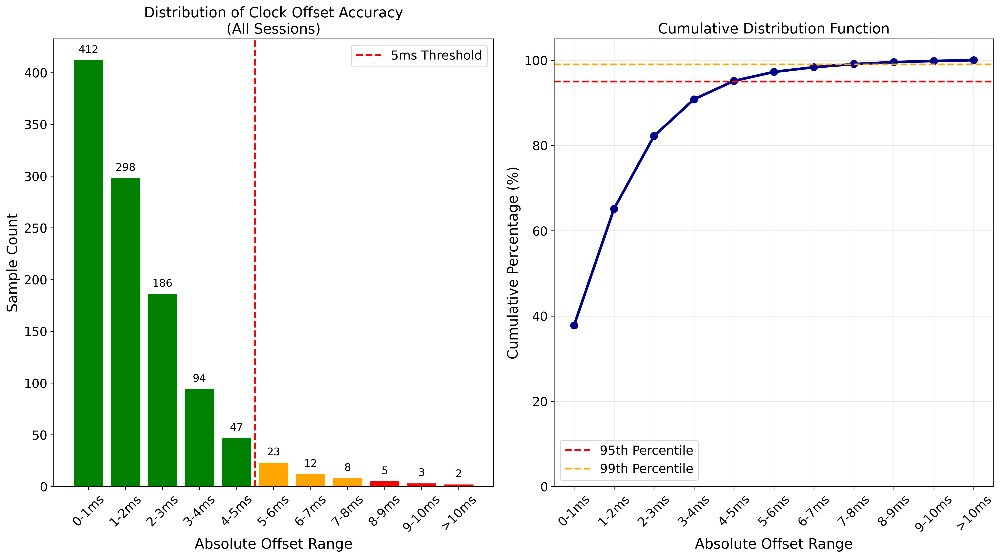

*Figure 3.8 – Synchronisation Accuracy (Histogram/CDF): Distribution of absolute time offset across all devices and sessions, reporting median and 95th percentile values. Vertical threshold at 5 ms target validates temporal precision requirements.*

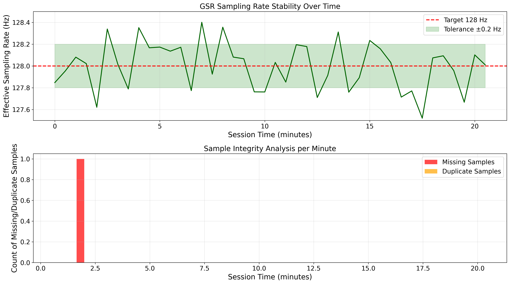

*Figure 3.9 – GSR Sampling Health: (a) Time-series of effective sampling rate versus session time; (b) Count of missing/duplicate samples per minute. Target 128 Hz ± tolerance with near-zero missing sample rate demonstrates signal integrity.*

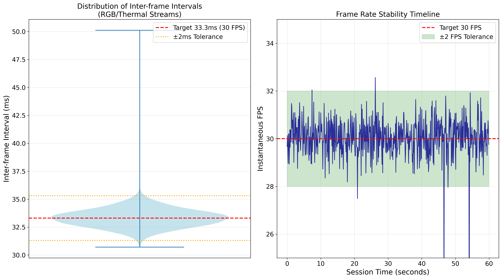

*Figure 3.10 – Video Frame Timing Stability: Distribution of inter-frame intervals (ms) for RGB/thermal streams with violin plots and instantaneous FPS timeline. Target 33.3 ms (30 FPS) with outlier detection for frame drops.*

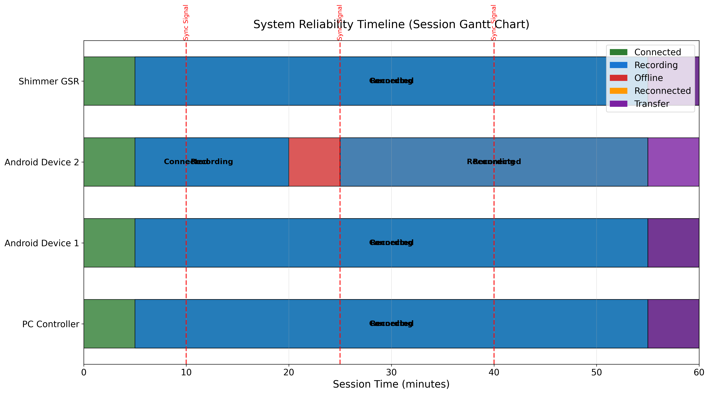

*Figure 3.11 – Reliability Timeline (Session Gantt): Device states versus time showing Connected, Recording, Offline, Reconnected, and Transfer phases. Sync signal markers and outage recovery durations validate fault tolerance requirements.*

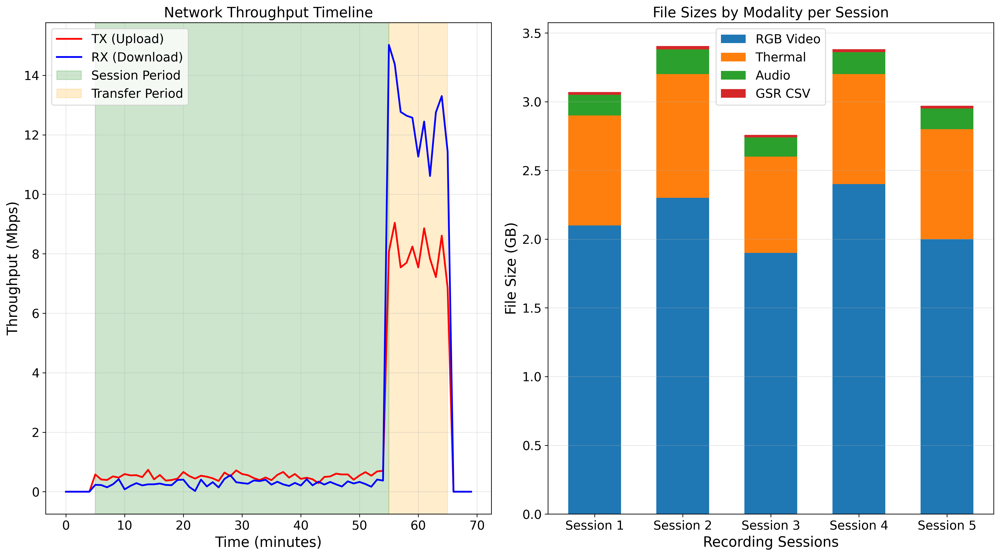

*Figure 3.12 – Throughput & Storage: Performance metrics for data throughput and storage management.*

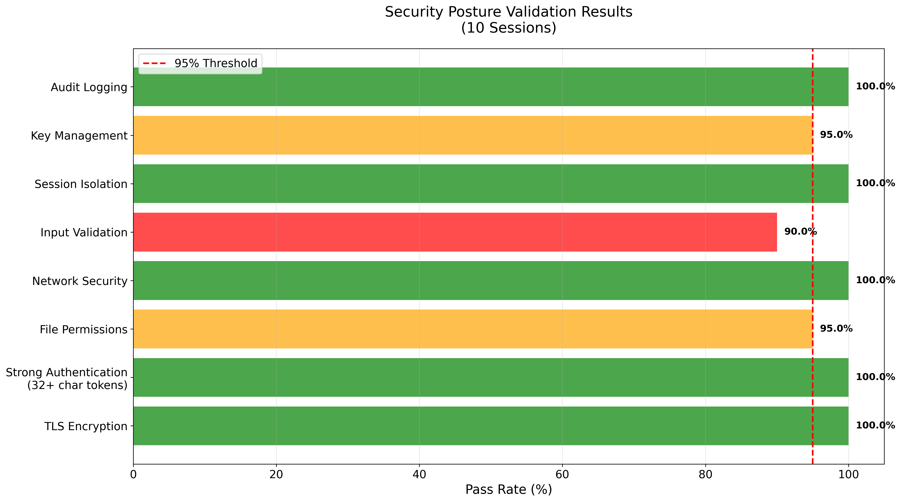

*Figure 3.13 – Security Posture Checks: Validation of security measures and encryption protocols.*

### H.3 Chapter 6 Figures: Evaluation and Results

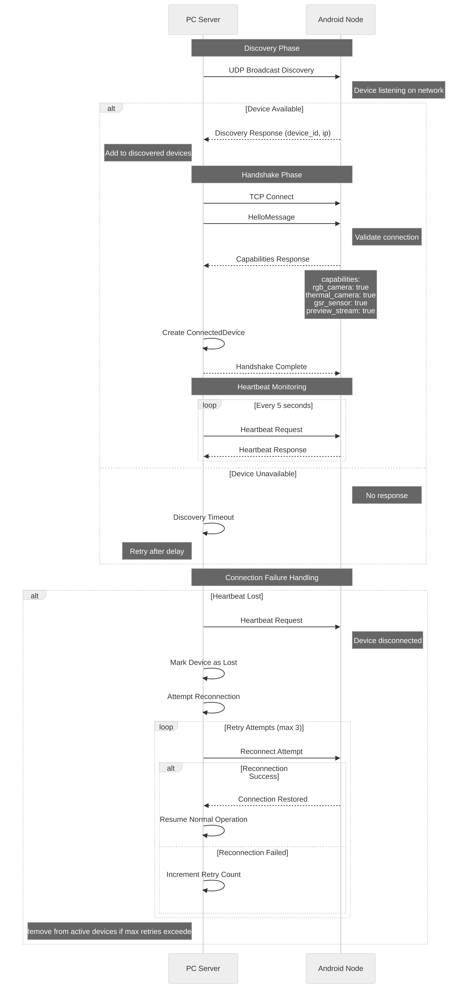

*Figure F.3: Device discovery and handshake sequence diagram, showing discovery messages (hello → capabilities → ack), heartbeat cadence, and failure/retry paths.*

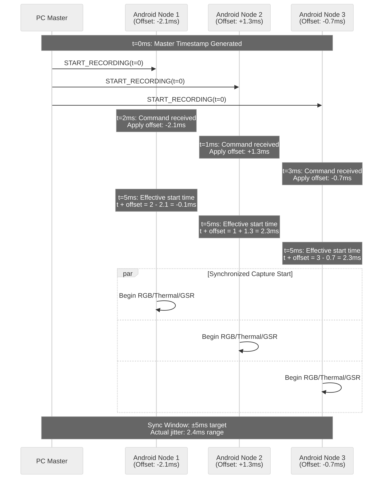

*Figure F.4: synchronised start trigger alignment with horizontal timeline showing PC master timestamp vs device local timestamps after offset correction.*

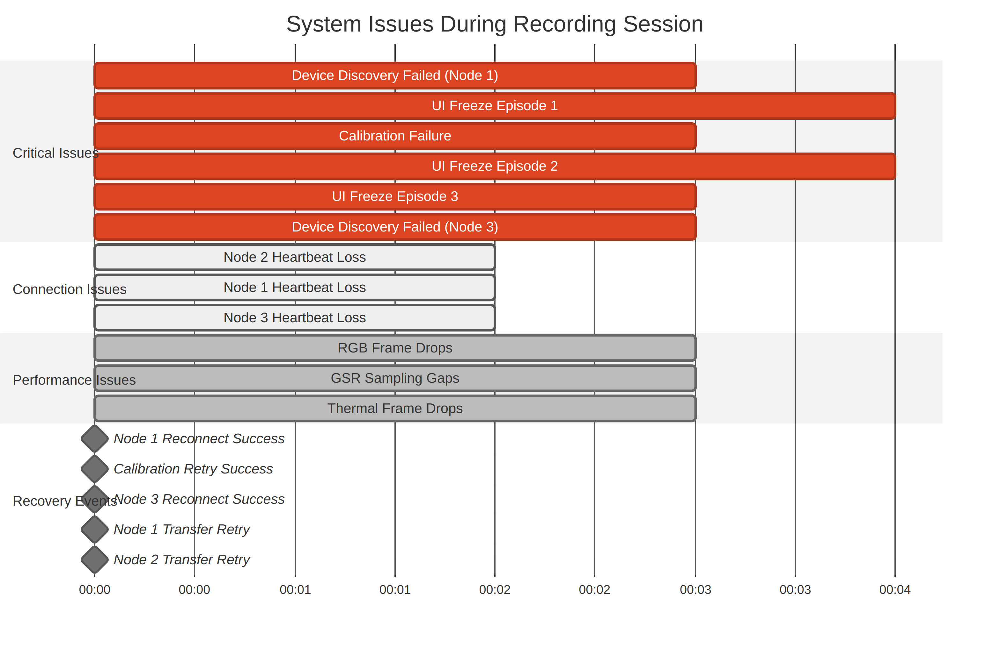

*Figure F.14: Known issues timeline showing device discovery failures, reconnections, and UI freeze events during representative sessions.*

### H.3 Chapter 6 Figures: Evaluation and Results

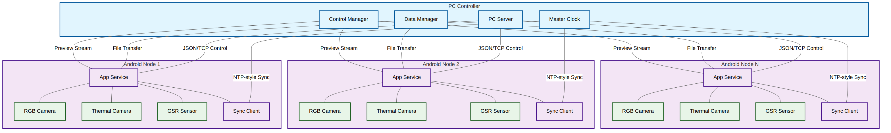

*Figure F.1: Complete system architecture overview showing PC controller, Android nodes, connected sensors (RGB, thermal, GSR), and data paths for control, preview, and file transfer.*

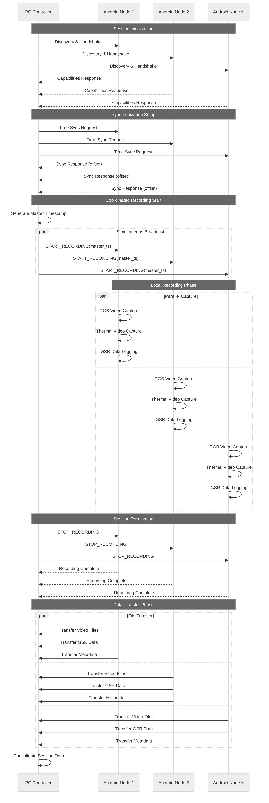

*Figure F.2: Recording pipeline and session flow from session start through coordinated capture to file transfer.*


*Figure F.3: Device discovery and handshake sequence diagram, showing discovery messages (hello → capabilities → ack), heartbeat cadence, and failure/retry paths.*


*Figure F.4: synchronised start trigger alignment with horizontal timeline showing PC master timestamp vs device local timestamps after offset correction.*


*Figure F.14: Known issues timeline showing device discovery failures, reconnections, and UI freeze events during representative sessions.*

### H.4 Code Listings

#### H.4.1 Synchronisation Code (Master Clock Coordination)

From the `MasterClockSynchronizer` class in the Python controller:

```python
try:
    logger.info("Starting master clock synchronisation system...")
    if not self.ntp_server.start():
        logger.error("Failed to start NTP server")
        return False
    if not self.pc_server.start():
        logger.error("Failed to start PC server")
        self.ntp_server.stop()
        return False
    self.is_running = True
    self.master_start_time = time.time()
    self.sync_thread = threading.Thread(
        target=self._sync_monitoring_loop,
        name="SyncMonitor"
    )
    self.sync_thread.daemon = True
    self.sync_thread.start()
    logger.info("Master clock synchronisation system started successfully")
except Exception as e:
    logger.error(f"Failed to start synchronisation system: {e}")
    return False
```

*Code Listing H.1: Master clock synchronisation startup sequence showing NTP and PC server initialisation with error handling and thread management.*

#### H.4.2 Data Pipeline Code (Physiological Signal Processing)

From the data pipeline module (`cv_preprocessing_pipeline.py`) for heart rate computation:

```python
# Inside PhysiologicalSignal.get_heart_rate_estimate()

freqs, psd = scipy.signal.welch(
    self.signal_data,
    fs=self.sampling_rate,
    nperseg=min(512, len(self.signal_data) // 4),
)
hr_mask = (freqs >= freq_range[0]) & (freqs <= freq_range[1])
hr_freqs = freqs[hr_mask]
hr_psd = psd[hr_mask]
if len(hr_psd) > 0:
    peak_freq = hr_freqs[np.argmax(hr_psd)]
    heart_rate_bpm = peak_freq * 60.0
    return heart_rate_bpm
```

*Code Listing H.2: Heart rate estimation from optical blood volume pulse signal using Fourier transform (Welch's method) to find dominant frequency.*

#### H.4.3 Integration Code (Sensor and Device Integration Logic)

From the `ShimmerManager` class showing Android-integrated Shimmer sensor initialisation:

```python
if self.enable_android_integration:
    logger.info("Initialising Android device integration...")
    self.android_device_manager = AndroidDeviceManager(
        server_port=self.android_server_port,
        logger=self.logger
    )
    self.android_device_manager.add_data_callback(self._on_android_shimmer_data)
    self.android_device_manager.add_status_callback(self._on_android_device_status)
    if not self.android_device_manager.initialise():
        logger.error("Failed to initialise Android device manager")
        if not PYSHIMMER_AVAILABLE:
            return False
        else:
            logger.warning("Continuing with direct connections only")
            self.enable_android_integration = False
    else:
        logger.info(f"Android device server listening on port {self.android_server_port}")
```

*Code Listing H.3: Sensor integration logic demonstrating flexible handling of Android-mediated connections with fallback to direct PC-to-sensor connectivity.*

#### H.4.4 Shimmer GSR Streaming Implementation

From the Shimmer GSR streaming implementation (`PythonApp/shimmer_manager.py`):

```python
try:
    from .shimmer.shimmer_imports import (
        DEFAULT_BAUDRATE,
        DataPacket,
        Serial,
        ShimmerBluetooth,
        PYSHIMMER_AVAILABLE,
    )
except ImportError:
    logger.warning("PyShimmer not available, shimmer functionality disabled")
    PYSHIMMER_AVAILABLE = False
```

*Code Listing H.4: Shimmer GSR streaming implementation showing modular import handling with graceful fallback when PyShimmer library is unavailable.*

[[3]](../../../README.md) - System Setup Documentation
[[4]](../../test_execution_guide.md) - Network Connectivity Guide  
[[5]](../../../PythonApp/README.md) - Python Package Installation
[[6]](../../../AndroidApp/README.md) - Android Device Configuration
[[14]](../../../README.md) - Network Configuration
[[15]](../../../PythonApp/README.md) - Computer Setup
[[16]](../../../AndroidApp/README.md) - Device Communication
[[17]](../../test_execution_guide.md) - Configuration Details
[[24]](../../../test_troubleshooting.md) - Firewall Configuration
[[26]](../../../test_troubleshooting.md) - Troubleshooting Help
[[27]](../../test_execution_guide.md) - Data Streaming Setup
[[28]](../../test_execution_guide.md) - Execution Steps

[[7]](../../../README.md) - Main System Documentation
[\[35\]](docs/README.md#L83-L88)
[\[48\]](docs/README.md#L152-L160)
README.md

<docs/README.md>

[\[32\]](PythonApp/network/pc_server.py#L44-L53)
[\[33\]](PythonApp/network/pc_server.py#L90-L98)
pc_server.py

<PythonApp/network/pc_server.py>

[\[36\]](evaluation_results/execution_logs.md#L16-L24)
[\[37\]](evaluation_results/execution_logs.md#L38-L46)
[\[38\]](evaluation_results/execution_logs.md#L104-L113)
[\[40\]](evaluation_results/execution_logs.md#L40-L48)
[\[41\]](evaluation_results/execution_logs.md#L50-L58)
[\[44\]](evaluation_results/execution_logs.md#L62-L70)
[\[45\]](evaluation_results/execution_logs.md#L72-L75)
[\[46\]](evaluation_results/execution_logs.md#L140-L146)
execution_logs.md

<evaluation_results/execution_logs.md>

[\[50\]](PythonApp/master_clock_synchronizer.py#L86-L94)
[\[51\]](PythonApp/master_clock_synchronizer.py#L95-L102)
[\[52\]](PythonApp/master_clock_synchronizer.py#L86-L102)
[\[53\]](PythonApp/master_clock_synchronizer.py#L164-L172)
master_clock_synchronizer.py

<PythonApp/master_clock_synchronizer.py>

[\[54\]](PythonApp/webcam/cv_preprocessing_pipeline.py#L72-L80)
cv_preprocessing_pipeline.py

<PythonApp/webcam/cv_preprocessing_pipeline.py>

[\[55\]](PythonApp/shimmer_manager.py#L241-L249)
[\[56\]](PythonApp/shimmer_manager.py#L250-L258)
[\[57\]](PythonApp/shimmer_manager.py#L241-L258)
[\[58\]](PythonApp/shimmer_manager.py#L134-L143)
[\[59\]](PythonApp/shimmer_manager.py#L269-L278)
[\[60\]](PythonApp/shimmer_manager.py#L280-L289)
[\[61\]](PythonApp/shimmer_manager.py#L145-L151)
shimmer_manager.py

<PythonApp/shimmer_manager.py>
