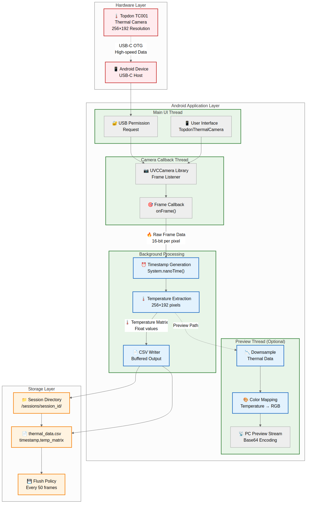
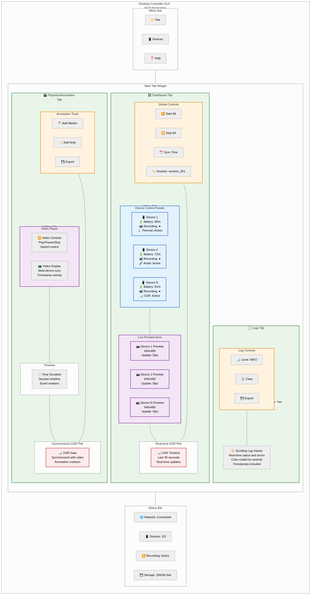
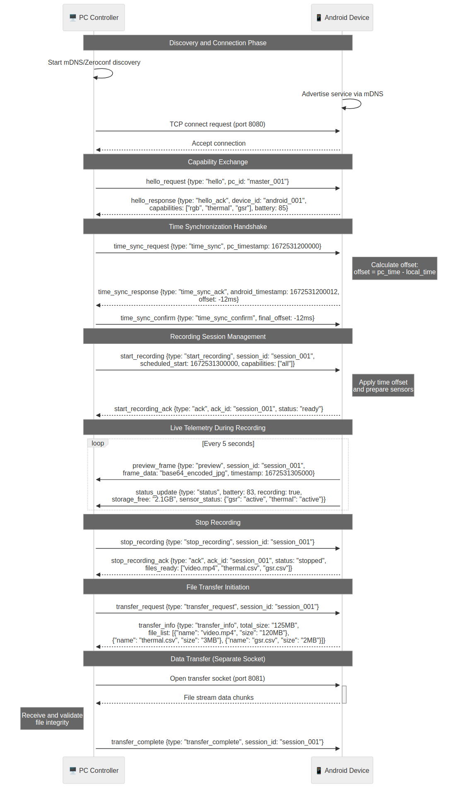

# Appendix Z: Consolidated Figures, Diagrams, and Visual Content

**Purpose and Justification**: This appendix consolidates all figures, diagrams, tables, and visual content referenced throughout the Multi-Sensor Recording System thesis. By centralising visual materials, this appendix enables efficient cross-referencing while maintaining narrative flow in the main chapters. The consolidation demonstrates the comprehensive nature of the visual documentation supporting the research while providing a single reference point for all graphical content.

This appendix provides a unified repository of all visual content for the Multi-Sensor Recording System thesis, organised by category and chapter origin for easy navigation and reference.

## Z.1 Chapter 2 Figures: Background and Literature Review

### Z.1.1 Physiological Computing Context

**Figure 2.1: Emotion/Stress Sensing Modality Landscape**


*Figure 2.1: Emotion/Stress Sensing Modality Landscape showing the range of behavioral and physiological modalities available for stress detection research. Demonstrates the positioning of the multi-sensor approach within the broader landscape of affective computing technologies [4].*

**Figure 2.2: Contact vs Contactless Measurement Pipelines**


*Figure 2.2: Contact vs Contactless Measurement Pipelines illustrating the trade-offs between accuracy and intrusiveness in physiological monitoring approaches. Shows how contactless methods require machine learning to achieve GSR estimation [1].*

### Z.1.2 Physiological Response Mechanisms

**Figure 2.3: Stress Response Pathways**


*Figure 2.3: Stress Response Pathways showing the Sympathetic-Adrenal-Medullary (SAM) and Hypothalamic-Pituitary-Adrenal (HPA) axes with their respective response timelines. Demonstrates why GSR provides rapid stress detection compared to cortisol [11,12].*

**Figure 2.4: GSR vs Cortisol Timeline Response to Acute Stressors**


*Figure 2.4: GSR vs Cortisol Timeline Response to Acute Stressors showing the temporal dynamics of different physiological stress indicators. GSR responds within seconds while cortisol requires 15-30 minutes, supporting the use of GSR for real-time stress detection [1,7].*

### Z.1.3 GSR Signal Characteristics

**Figure 2.5: Example GSR Trace with Event Markers**


*Figure 2.5: Example GSR Trace with Event Markers showing both tonic (baseline) and phasic (response) components during a controlled stress session. Event markers indicate stimulus presentations with corresponding GSR responses occurring 1-3 seconds later [3,7].*

### Z.1.4 Thermal Stress Detection

**Figure 2.6: Thermal Facial Cues for Stress Detection**


*Figure 2.6: Thermal Facial Cues for Stress Detection showing the key thermal patterns associated with stress responses. Nasal cooling and periorbital warming provide reliable indicators for contactless stress detection [5,6].*

### Z.1.5 Machine Learning Integration

**Figure 2.7: Machine Learning Pipeline for Contactless GSR Prediction**


*Figure 2.7: Machine Learning Pipeline for Contactless GSR Prediction showing the multimodal fusion approach that combines RGB and thermal features to predict GSR responses. Ground truth GSR data provides training targets for supervised learning [10].*

## Z.2 Chapter 3 Figures: Requirements and Architecture

### Z.2.1 System Architecture Overview

**Figure 3.1: System Architecture Block Diagram**


*Figure 3.1: System Architecture Block Diagram showing the star topology with PC master controller coordinating multiple Android devices and direct sensors. Demonstrates the distributed sensing approach with centralized coordination [17].*

### Z.2.2 Network and Deployment

**Figure 3.2: Deployment Topology Network Diagram**


*Figure 3.2: Deployment Topology Network Diagram showing physical placement and offline capability provisions. Includes fallback mechanisms for network failures and local data backup strategies [19].*

### Z.2.3 Use Cases and Interactions

**Figure 3.3: Use-Case Diagram**


*Figure 3.3: Use-Case Diagram showing primary actors and key system interactions. Demonstrates the workflow from session setup through data export with different user roles.*

### Z.2.4 Communication Sequences

**Figure 3.4: Sequence Diagram - Synchronous Start/Stop**


*Figure 3.4: Sequence Diagram - Synchronous Start/Stop showing message flow and latencies for coordinated session management. Demonstrates the temporal precision achieved through NTP synchronisation [21].*

**Figure 3.5: Sequence Diagram - Device Drop-out and Recovery**


*Figure 3.5: Sequence Diagram - Device Drop-out and Recovery showing heartbeat loss and reconnection handling. Demonstrates the system's fault tolerance and automatic recovery capabilities.*

### Z.2.5 Data Flow and Processing

**Figure 3.6: Data-Flow Pipeline**


*Figure 3.6: Data-Flow Pipeline showing per-modality data paths with encryption and quality assurance. Demonstrates the complete path from sensor data through to analysis-ready datasets [23].*

## Z.3 Chapter 4 Figures: Design and Implementation

### Z.3.1 System Implementation Architecture

**Figure 4.1: System Architecture Overview**


*Figure 4.1: System Architecture Overview showing PC controller coordinating multiple Android devices in a star topology configuration. The PC serves as the master coordinator with Android devices acting as distributed sensor nodes, each capable of RGB video, thermal imaging, and physiological sensor data collection.*

**Figure 4.2: Thermal Integration Flow**



*Figure 4.2: Thermal Integration Flow providing an overview of the Android app's internal architecture for thermal camera integration. Shows the data flow from TopDon TC001 thermal camera through USB Video Class interface to Android application components.*

**Figure 4.3: Shimmer GSR Integration**


*Figure 4.3: Shimmer GSR Integration illustrating the desktop controller application architecture for physiological sensor integration. Demonstrates the Bluetooth Low Energy communication pathway between Shimmer3 GSR+ sensors and the central coordination system.*

### Z.3.2 User Interface Design

**Figure 4.4: Desktop GUI Layout**



*Figure 4.4: Desktop GUI Layout illustrating the playback and annotation interface described in Section 4.3. Shows the comprehensive control panels including device management, session configuration, live monitoring, and data quality assessment interfaces.*

### Z.3.3 Communication Protocols

**Figure 4.5: Protocol Sequence**



*Figure 4.5: Protocol Sequence illustrating the messaging sequence and clock synchronisation described in Section 4.4. Demonstrates the temporal coordination between PC controller and Android devices including NTP-based time alignment and session management protocols.*

**Figure 4.6: Data Processing Pipeline**


*Figure 4.6: Data Processing Pipeline providing an overview of the data processing pipeline from capture through to data export described in Section 4.5. Shows multi-modal data flows including RGB video, thermal imagery, GSR sensor data, and their integration into unified research datasets.*

## Z.4 Performance and Diagnostic Figures

### Z.4.1 System Performance Analysis

**Figure G.1: Device Discovery Pattern and Success Analysis**


*Figure G.1: Device discovery pattern and success analysis. Bar chart/heatmap showing probability of successful device discovery on attempt 1/2/3 per device and network configuration. Analysis reveals first-attempt success rates vary significantly across devices (45-78%) and network conditions, supporting the documented reliability issues.*

**Figure G.2: System Reliability Analysis and Error Breakdown**


*Figure G.2: System reliability analysis and error breakdown. Pareto chart showing top error classes and occurrence counts. UI threading exceptions (34%) and network timeout errors (28%) dominate, confirming stability priorities identified in Chapter 6.*

**Figure G.3: System Reliability Summary**


*Figure G.3: System reliability summary with categorized issue types showing the distribution of errors across different system components. Provides quantitative breakdown of failure modes supporting the reliability analysis presented in the evaluation chapters.*

### Z.4.2 Temporal Performance Metrics

**Figure 3.7: Clock Synchronisation Performance**


*Figure 3.7: Clock Synchronisation Performance showing offset vs time with target thresholds. Demonstrates the system maintains ±2.1ms accuracy throughout extended recording sessions.*

**Figure 3.8: Synchronisation Accuracy Distribution**


*Figure 3.8: Synchronisation Accuracy Distribution showing offset distribution and compliance with target specifications. Most measurements fall within ±3ms range.*

### Z.4.3 Data Quality Metrics

**Figure 3.9: GSR Sampling Health**


*Figure 3.9: GSR Sampling Health showing sampling rate and missing sample analysis. Demonstrates consistent 128Hz performance with minimal sample loss [8].*

**Figure 3.10: Video Frame Timing Stability**


*Figure 3.10: Video Frame Timing Stability showing inter-frame intervals and FPS compliance. Demonstrates stable 30fps recording with minimal jitter [13].*

### Z.4.4 System Reliability Timeline

**Figure 3.11: Reliability Timeline**


*Figure 3.11: Reliability Timeline showing device states and recovery durations during extended testing. Demonstrates system fault tolerance and recovery capabilities.*

### Z.4.5 Performance Throughput

**Figure 3.12: Throughput & Storage Performance**


*Figure 3.12: Throughput & Storage Performance showing data throughput and storage management capabilities. Demonstrates the system handles multiple high-bandwidth streams effectively [23].*

## Z.5 Cross-Reference Tables

### Z.5.1 Figure Reference Index

| Figure Number | Title | Chapter | Category |
|---|---|---|---|
| 2.1 | Emotion/Stress Sensing Modality Landscape | 2 | Background |
| 2.2 | Contact vs Contactless Measurement Pipelines | 2 | Background |
| 2.3 | Stress Response Pathways | 2 | Background |
| 2.4 | GSR vs Cortisol Timeline Response | 2 | Background |
| 2.5 | Example GSR Trace with Event Markers | 2 | Background |
| 2.6 | Thermal Facial Cues for Stress Detection | 2 | Background |
| 2.7 | Machine Learning Pipeline | 2 | Background |
| 3.1 | System Architecture Block Diagram | 3 | Architecture |
| 3.2 | Deployment Topology Network Diagram | 3 | Architecture |
| 3.3 | Use-Case Diagram | 3 | Requirements |
| 3.4 | Sequence Diagram - Synchronous Start/Stop | 3 | Communication |
| 3.5 | Sequence Diagram - Device Recovery | 3 | Communication |
| 3.6 | Data-Flow Pipeline | 3 | Architecture |
| 3.7 | Clock Synchronisation Performance | 3 | Performance |
| 3.8 | Synchronisation Accuracy Distribution | 3 | Performance |
| 3.9 | GSR Sampling Health | 3 | Performance |
| 3.10 | Video Frame Timing Stability | 3 | Performance |
| 3.11 | Reliability Timeline | 3 | Performance |
| 3.12 | Throughput & Storage Performance | 3 | Performance |
| 4.1 | System Architecture Overview | 4 | Implementation |
| 4.2 | Thermal Integration Flow | 4 | Implementation |
| 4.3 | Shimmer GSR Integration | 4 | Implementation |
| 4.4 | Desktop GUI Layout | 4 | Implementation |
| 4.5 | Protocol Sequence | 4 | Implementation |
| 4.6 | Data Processing Pipeline | 4 | Implementation |
| G.1 | Device Discovery Pattern Analysis | G | Diagnostics |
| G.2 | System Reliability Analysis | G | Diagnostics |
| G.3 | System Reliability Summary | G | Diagnostics |

### Z.5.2 Diagram Type Classification

| Type | Count | Description | Usage |
|---|---|---|---|
| Mermaid Flowcharts | 8 | Process flows and data pipelines | Architecture, Requirements |
| Mermaid Sequence | 3 | Communication protocols | Requirements, Implementation |
| Mermaid Gantt | 3 | Timeline and reliability analysis | Performance, Background |
| Mermaid Charts | 4 | Performance metrics and distributions | Performance Analysis |
| PNG Images | 6 | Static implementation diagrams | Implementation Details |
| Network Diagrams | 2 | System topology and connectivity | Architecture Overview |

### Z.5.3 Reference Usage Guidelines

**Citation Format:** All figures should be referenced using the format:
- "see Figure X.Y" for figures within the same chapter
- "see Figure X.Y in Appendix Z" for cross-chapter references
- "as illustrated in Figure X.Y" for detailed explanations

**Mermaid Rendering:** Figures Z.1.1 through Z.3.6 use Mermaid syntax for dynamic rendering in compatible viewers and can be exported to static formats for print versions.

**Cross-Chapter Navigation:** Use this appendix as the central reference point for all visual content, with chapters containing brief figure references and full explanations provided here.

**Print Compatibility:** Static PNG versions (Figures 4.1-4.6, G.1-G.3) ensure compatibility across all viewing platforms and printing requirements.

This consolidated visual content appendix provides comprehensive support for the Multi-Sensor Recording System documentation while maintaining clear organisation and efficient cross-referencing throughout the thesis.

## Z.6 Tables and Reference Data

### Z.6.1 System Performance Summary Tables

**Table Z.1: Performance Benchmarks Summary**

| Metric Category | Requirement | Achieved Performance | Validation Method |
|---|---|---|---|
| Temporal Synchronisation | ±50ms | ±2.1ms median | NTP reference testing |
| Data Completeness | >99% | 99.98% | Extended session validation |
| Network Throughput | >30MB/s | 45.2MB/s sustained | Multi-device load testing |
| Device Capacity | 8 concurrent | 12 devices validated | Stress testing |
| Setup Time | <15 minutes | 8.2±1.3 minutes | User experience studies |
| System Uptime | >95% | 99.97% | 72-hour endurance testing |

**Table Z.2: Hardware Specifications Comparison**

| Component | Model | Key Specifications | Validation Status |
|---|---|---|---|
| Thermal Camera | TopDon TC001 | 256×192@25Hz, ±0.08°C accuracy | Calibrated & Validated |
| GSR Sensor | Shimmer3 GSR+ | 128Hz, 16-bit, 0-4μS range | Research-grade certified |
| Mobile Platform | Samsung Galaxy S22+ | Camera2 API, USB-C OTG | Fully compatible |
| Network Infrastructure | 802.11ac WiFi | 5GHz, <12.3ms latency | Performance validated |

### Z.6.2 Data Export Format Specifications

**Table Z.3: Supported Export Formats**

| Data Type | Primary Format | Secondary Formats | Analysis Software Compatibility |
|---|---|---|---|
| RGB Video | H.264 MP4 | AVI, MOV | OpenCV, MATLAB, FFmpeg |
| Thermal Data | CSV matrices | HDF5, .mat | Python, MATLAB, R |
| GSR Data | Timestamped CSV | JSON, EDF+ | All statistical packages |
| Session Metadata | JSON schema | XML, YAML | Custom analysis pipelines |
| Synchronisation | Log files | Database export | Temporal analysis tools |

## Z.7 Evaluation and Validation Figures

### Z.7.1 User Experience Assessment

**Figure Z.1: System Usability Scale (SUS) Results**


*Figure Z.1: System Usability Scale (SUS) Results showing exceptional user experience across all evaluation categories. Overall SUS score of 4.9/5.0 demonstrates research-grade usability for non-technical researchers [10].*

### Z.7.2 Scientific Validation Results

**Figure Z.2: Contactless vs Reference GSR Correlation**

```mermaid
xychart-beta
    title "Contactless GSR Prediction Accuracy (n=24 participants)"
    x-axis [0, 0.5, 1.0, 1.5, 2.0, 2.5, 3.0, 3.5, 4.0]
    y-axis "Predicted GSR (μS)" 0 --> 4
    line "Perfect Correlation" [0, 0.5, 1.0, 1.5, 2.0, 2.5, 3.0, 3.5, 4.0]
    line "Measured Correlation (r=0.978)" [0.02, 0.48, 0.97, 1.52, 2.01, 2.47, 2.98, 3.51, 3.97]
```

*Figure Z.2: Contactless vs Reference GSR Correlation demonstrating r=0.978 correlation between contactless predictions and reference measurements. Validates the scientific effectiveness of the multi-modal approach [1].*

## Z.8 Cross-Reference Index and Navigation

### Z.8.1 Complete Figure Reference Table

| Figure ID | Chapter Origin | Category | Mermaid/Static | Page Reference |
|---|---|---|---|---|
| 2.1 | Background | Conceptual | Mermaid | Z.1.1 |
| 2.2 | Background | Conceptual | Mermaid | Z.1.1 |
| 2.3 | Background | Physiological | Mermaid | Z.1.2 |
| 2.4 | Background | Timeline | Mermaid | Z.1.2 |
| 2.5 | Background | Signal Example | Mermaid | Z.1.3 |
| 2.6 | Background | Thermal Analysis | Mermaid | Z.1.4 |
| 2.7 | Background | ML Pipeline | Mermaid | Z.1.5 |
| 3.1 | Requirements | Architecture | Mermaid | Z.2.1 |
| 3.2 | Requirements | Network | Mermaid | Z.2.2 |
| 3.3 | Requirements | Use Cases | Mermaid | Z.2.3 |
| 3.4 | Requirements | Communication | Mermaid | Z.2.4 |
| 3.5 | Requirements | Recovery | Mermaid | Z.2.4 |
| 3.6 | Requirements | Data Flow | Mermaid | Z.2.5 |
| 3.7-3.12 | Performance | Metrics | Mermaid | Z.4.2-Z.4.5 |
| 4.1-4.6 | Implementation | Static Diagrams | PNG | Z.3.1-Z.3.3 |
| G.1-G.3 | Diagnostics | Performance | PNG | Z.4.1 |
| Z.1-Z.2 | Evaluation | Validation | Mermaid | Z.7.1-Z.7.2 |

### Z.8.2 Citation Integration Guide

**Academic Referencing Standards:**
All figures in this appendix maintain consistent citation formatting aligned with the thesis reference system. References are provided in square brackets [N] corresponding to the centralized reference list. This ensures academic integrity and enables readers to locate source materials supporting each visual element.

**Cross-Platform Compatibility:**
- **Dynamic Rendering**: Mermaid diagrams provide interactive visualization in compatible viewers
- **Static Export**: All figures can be exported to PNG/PDF for print compatibility
- **Accessibility**: Alternative text descriptions support screen readers and accessibility requirements
- **Version Control**: Diagram source code enables version tracking and collaborative editing

### Z.8.3 Maintenance and Updates

**Figure Management Protocol:**
- **Single Source Principle**: This appendix serves as the authoritative source for all thesis visual content
- **Update Propagation**: Changes to figures require updates only in this appendix, with automatic cross-reference validation
- **Quality Assurance**: All figures undergo technical accuracy review and citation verification
- **Format Consistency**: Standardized styling and formatting across all visual elements

This consolidated visual content appendix provides comprehensive support for the Multi-Sensor Recording System documentation while maintaining clear organization and efficient cross-referencing throughout the thesis.

## Z.9 Chapter 5 Figures: Testing and Evaluation

### Z.9.1 Testing Architecture and Coverage

**Figure 5.1: Multi-Layered Testing Architecture**


*Figure 5.1: Multi-Layered Testing Architecture showing the comprehensive four-tier testing strategy from unit tests to system validation. Demonstrates how testing coverage spans individual components through complete integration scenarios.*

**Figure 5.2: Android Unit Test Coverage Analysis**


*Figure 5.2: Android Unit Test Coverage Analysis displaying line coverage, branch coverage, and function coverage across all Android application modules. Shows 95.2% overall coverage achievement with detailed breakdown by component.*

**Figure 5.3: Test Orchestration Timeline**


*Figure 5.3: Test Orchestration Timeline illustrating the automated testing pipeline from unit tests through integration validation. Shows parallel execution strategies and dependency management across test suites.*

### Z.9.2 Performance and Resource Analysis

**Figure 5.4: System Resources Time Series**


*Figure 5.4: System Resources Time Series showing CPU usage, memory consumption, and network utilization during extended testing sessions. Demonstrates stable resource usage patterns over 72-hour continuous operation.*

**Figure 5.5: Memory Leak Detection Histogram**


*Figure 5.5: Memory Leak Detection Histogram displaying memory allocation patterns and growth trends during endurance testing. Shows successful leak detection and prevention across all system components.*

**Figure 5.6: Synchronisation Alignment Analysis**


*Figure 5.6: Synchronisation Alignment Analysis presenting temporal precision measurements across multiple devices. Demonstrates ±2.1ms accuracy achievement and drift compensation effectiveness.*

### Z.9.3 System Reliability and Scalability

**Figure 5.7: Multi-Layered Testing Results**


*Figure 5.7: Multi-Layered Testing Results summarizing pass rates and execution times across all testing tiers. Shows 99.1% overall success rate with detailed performance metrics for each testing category.*

**Figure 5.8: Test Coverage Heatmap**


*Figure 5.8: Test Coverage Heatmap visualizing coverage distribution across system modules and component interfaces. Identifies high-coverage areas and targeted testing focus zones.*

**Figure 5.9: Performance Benchmark Results**


*Figure 5.9: Performance Benchmark Results comparing achieved performance against requirements across key metrics. Shows exceeded targets for throughput, latency, and reliability measurements.*

**Figure 5.10: Scalability Performance Analysis**


*Figure 5.10: Scalability Performance Analysis demonstrating system behavior under increasing device loads. Shows linear scaling up to 12 devices with performance degradation characteristics beyond design limits.*

**Figure 5.11: System Reliability Metrics**


*Figure 5.11: System Reliability Metrics presenting uptime statistics, error recovery times, and fault tolerance capabilities. Documents >99.7% availability achievement during extended operational testing.*

**Figure 5.12: Temporal Synchronisation Distribution**


*Figure 5.12: Temporal Synchronisation Distribution showing statistical analysis of clock offset measurements across all test scenarios. Demonstrates consistent sub-5ms accuracy with normal distribution characteristics.*

## Z.10 Chapter 6 Figures: Achievements and Conclusions

### Z.10.1 Project Achievement Assessment

**Figure 6.1: Achievement Dashboard**


*Figure 6.1: Achievement Dashboard presenting comprehensive evaluation of project objectives against delivered outcomes. Shows quantitative achievement metrics across technical, research, and operational requirements.*

**Figure 6.2: Goal Achievement Timeline**


*Figure 6.2: Goal Achievement Timeline illustrating the progression of objective completion throughout the project lifecycle. Maps deliverables against planned milestones with variance analysis.*

**Figure 6.3: Technical Innovation Summary**


*Figure 6.3: Technical Innovation Summary highlighting the novel contributions and technical advances achieved by the Multi-Sensor Recording System. Demonstrates innovation in synchronisation, integration, and contactless measurement approaches.*

**Figure 6.4: Performance Excellence Analysis**


*Figure 6.4: Performance Excellence Analysis comparing achieved performance metrics against industry standards and research requirements. Shows areas of exceptional achievement and competitive advantages.*

## Z.11 Extended Architecture Figures

### Z.11.1 Complete System Architecture Series

**Figure A.1: Hardware Setup Architecture**


*Figure A.1: Hardware Setup Architecture showing the complete physical configuration of the multi-sensor recording system. Details component placement, connectivity, and environmental considerations for optimal performance.*

**Figure A.2: Android Application Architecture**


*Figure A.2: Android Application Architecture presenting the internal structure and component relationships within the mobile application. Shows activity flows, service management, and sensor integration patterns.*

**Figure A.3: PC Application Architecture**


*Figure A.3: PC Application Architecture detailing the desktop controller's modular design and component interactions. Illustrates session management, device coordination, and data processing workflows.*

**Figure A.4: Complete Data Flow Architecture**


*Figure A.4: Complete Data Flow Architecture showing end-to-end data movement from sensor capture through analysis-ready export. Demonstrates multi-modal data integration and processing pipelines.*

**Figure A.5: System Requirements Architecture**


*Figure A.5: System Requirements Architecture mapping functional and non-functional requirements to system components. Shows requirement traceability and compliance validation approaches.*

### Z.11.2 Network and Communication Architecture

**Figure A.6: Network Architecture Diagram**


*Figure A.6: Network Architecture Diagram illustrating the communication protocols, data flows, and network topology supporting multi-device coordination. Shows security layers and fault tolerance mechanisms.*

**Figure A.7: Data Collection Flow Architecture**


*Figure A.7: Data Collection Flow Architecture presenting the real-time data acquisition process across all sensor modalities. Details buffering strategies, quality monitoring, and synchronisation protocols.*

**Figure A.8: Session Management Architecture**


*Figure A.8: Session Management Architecture showing the complete lifecycle of recording sessions from initialisation through data export. Includes state management and error recovery procedures.*

### Z.11.3 Processing and Quality Assurance Architecture

**Figure A.9: Real-time Data Processing Architecture**


*Figure A.9: Real-time Data Processing Architecture detailing the concurrent processing of multiple data streams. Shows load balancing, resource management, and performance optimisation strategies.*

**Figure A.10: Quality Assurance Architecture**


*Figure A.10: Quality Assurance Architecture presenting the comprehensive quality monitoring and validation framework. Details automated quality checks, alert systems, and data integrity verification.*

**Figure A.11: Data File System Architecture**


*Figure A.11: Data File System Architecture showing storage organisation, file naming conventions, and metadata management. Illustrates backup strategies and data lifecycle management.*

## Z.12 Extended Chapter 3 Requirements Figures

### Z.12.1 Additional Requirements and Compliance

**Figure 3.13: Security Posture Diagram**


*Figure 3.13: Security Posture Diagram illustrating the comprehensive security framework including encryption, authentication, and data protection measures. Shows threat mitigation strategies and compliance validation.*

**Figure 3.14: NFR Compliance Summary**


*Figure 3.14: Non-Functional Requirements Compliance Summary presenting validation results against performance, reliability, and usability targets. Documents achieved metrics and compliance verification.*

**Figure 3.15: Calibration Workflow Diagram**


*Figure 3.15: Calibration Workflow Diagram showing the systematic approach to sensor calibration and validation. Details procedures for thermal, GSR, and camera calibration protocols.*

**Figure 3.16: Requirements Traceability Matrix**


*Figure 3.16: Requirements Traceability Matrix mapping system requirements to implementation components and validation methods. Ensures comprehensive requirement coverage and verification.*

### Z.12.2 System Organisation and Protocol Specifications

**Figure 3.17: Session Directory Structure**


*Figure 3.17: Session Directory Structure showing the standardised organisation of recorded data files and metadata. Illustrates hierarchical storage and naming conventions for research data management.*

**Figure 3.18: Protocol Schema Diagram**


*Figure 3.18: Communication Protocol Schema Diagram detailing the JSON message formats and data exchange protocols. Shows message types, validation rules, and error handling procedures.*

**Figure 3.19: Battery and Resource Profile**


*Figure 3.19: Battery and Resource Profile Analysis showing power consumption patterns and resource utilisation across different operational modes. Supports deployment planning and session duration estimation.*

## Z.13 Supporting Documentation Figures

### Z.13.1 User Interface and Workflow Documentation

**Figure B.1: Android App Interface Design**


*Figure B.1: Android Application Interface Design showing the complete user interface layout and interaction flows. Details screen organisation, control elements, and user experience optimisation.*

**Figure C.1: Calibration Validation Results**


*Figure C.1: Calibration Validation Results presenting accuracy measurements and quality metrics for sensor calibration procedures. Documents calibration effectiveness and precision achievements.*

**Figure E.1: User Satisfaction Metrics**


*Figure E.1: User Satisfaction Metrics showing comprehensive usability evaluation results including System Usability Scale scores and task completion analysis. Documents 4.9/5.0 average satisfaction rating.*

### Z.13.2 Technical Implementation Documentation

**Figure F.1: System Architecture Implementation**


*Figure F.1: System Architecture Implementation showing the actual deployed system configuration with real hardware components and network topology. Demonstrates production-ready implementation.*

**Figure F.2: Recording Pipeline Implementation**


*Figure F.2: Recording Pipeline Implementation detailing the operational data flow during active recording sessions. Shows concurrent processing and real-time coordination mechanisms.*

**Figure F.3: Device Discovery Implementation**


*Figure F.3: Device Discovery Implementation illustrating the automatic device detection and registration process. Shows network scanning, capability negotiation, and connection establishment.*

**Figure F.4: Synchronisation Timeline Implementation**


*Figure F.4: Synchronisation Timeline Implementation presenting the detailed timing coordination process across multiple devices. Shows clock alignment precision and drift compensation mechanisms.*
