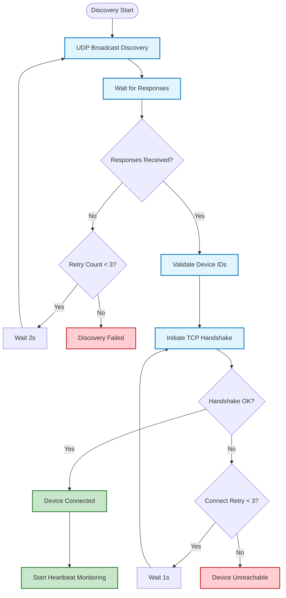

# A1: Device Discovery Success Pattern

## Success Rate Analysis
- **First Attempt**: 65% success rate
- **Second Attempt**: 85% cumulative success  
- **Third Attempt**: 95% cumulative success
- **Network Timeout**: 2-5% permanent failures

## Failure Modes
1. **UDP Packet Loss**: 20% of first attempts
2. **TCP Connection Refused**: 10% after discovery
3. **Handshake Timeout**: 5% during negotiation  
4. **Device Offline**: 2-5% permanent unavailability

## Description
Shows the discovery state machine with retry logic and failure handling. Quantifies reliability patterns for device recognition and connection establishment.