# A6: System Reliability - Error Classification

```mermaid
flowchart LR
    subgraph Critical["🔴 Critical (System Blocking)"]
        C1[Device Discovery Timeout]
        C2[UI Complete Freeze]
        C3[Calibration Failure]
        C4[Session Corruption]
    end
    
    subgraph High["🟡 High (Degraded Performance)"]
        H1[Frame Rate Drops]
        H2[Connection Interruptions]
        H3[Preview Lag >2s]
        H4[File Transfer Retries]
    end
    
    subgraph Medium["🟢 Medium (Minor Impact)"]
        M1[Heartbeat Delays]
        M2[Sync Jitter >5ms]
        M3[UI Button Lag]
        M4[Status Update Delays]
    end
    
    subgraph Low["⚪ Low (Cosmetic)"]
        L1[Preview Quality]
        L2[Log Verbosity]
        L3[Status Messages]
        L4[Minor UI Glitches]
    end
    
    classDef criticalStyle fill:#ffcdd2,stroke:#c62828,stroke-width:3px
    classDef highStyle fill:#fff3e0,stroke:#ef6c00,stroke-width:2px
    classDef mediumStyle fill:#e8f5e8,stroke:#2e7d32,stroke-width:2px
    classDef lowStyle fill:#f5f5f5,stroke:#757575,stroke-width:1px
    
    class Critical,C1,C2,C3,C4 criticalStyle
    class High,H1,H2,H3,H4 highStyle
    class Medium,M1,M2,M3,M4 mediumStyle
    class Low,L1,L2,L3,L4 lowStyle
```

## Reliability Metrics

### Mean Time Between Failures (MTBF)
- **Critical Issues**: 45 minutes average
- **High Impact**: 12 minutes average  
- **Medium Impact**: 3 minutes average

### Recovery Times
- **Discovery Failures**: 5-8 seconds (automatic)
- **UI Freezes**: 4-6 seconds (manual restart)
- **Connection Loss**: 2-4 seconds (automatic reconnect)
- **File Transfer**: 10-15 seconds (automatic retry)

### Success Rates
- **Session Completion**: 92% without intervention
- **Device Recognition**: 95% within 3 attempts
- **Data Integrity**: 98.5% completeness
- **Synchronization**: 89% within ±5ms target

## Description
Hierarchical classification of system errors by severity and impact. Provides quantitative assessment of reliability patterns, recovery characteristics, and current system stability limitations.