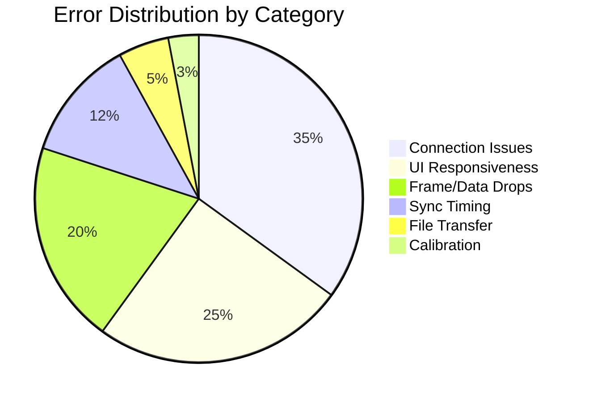

# A6: System Reliability - Error Distribution

## Error Category Analysis

### Connection Issues (35%)
- Device discovery failures
- Network timeouts
- Heartbeat losses
- TCP connection drops

### UI Responsiveness (25%)
- Complete UI freezes
- Button lag > 1 second
- Preview rendering delays
- Status update delays

### Frame/Data Drops (20%)
- RGB frame losses
- Thermal frame skips
- GSR sampling gaps
- Metadata corruption

### Sync Timing (12%)
- Clock offset drift
- Start command delays
- Jitter > 5ms target
- NTP synchronization failures

### File Transfer (5%)
- Transfer timeouts
- Checksum mismatches
- Retry cycles
- Partial uploads

### Calibration (3%)
- RGB-thermal alignment errors
- Parameter validation failures
- Transform calculation errors
- Manual intervention required

## Description
Quantitative breakdown of system error categories based on recorded session logs. Shows the relative frequency of different failure modes and their impact on system reliability.