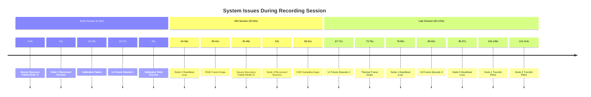

# F14: Known Issues Timeline

## Issue Classification

### Critical Issues (System Blocking)
- **Device Discovery Failures**: Devices not found on first attempt
- **UI Freeze Episodes**: Complete UI unresponsiveness requiring restart
- **Calibration Failures**: Thermal-RGB alignment errors

### Active Issues (Degraded Performance)
- **Heartbeat Losses**: Temporary connection interruptions
- **Frame Drops**: Missed video frames during high load
- **Transfer Retries**: File transfer requiring multiple attempts
- **Sampling Gaps**: Missing sensor data points

### Recovery Patterns
- **Discovery**: 3-7 second recovery time with automatic retry
- **UI Freezes**: 4-5 second duration, manual intervention required
- **Heartbeat**: 2-3 second recovery with automatic reconnection
- **Calibration**: 10 second retry cycle with operator assistance

## Description
Documents the timeline and frequency of known system limitations during a typical recording session. Shows issue clustering, recovery patterns, and operator intervention points.