# F1: System Architecture Overview

```mermaid
flowchart TD
    subgraph PC["PC Controller"]
        PS[PC Server]
        MC[Master Clock]
        CM[Control Manager]
        DM[Data Manager]
    end
    
    subgraph AN1["Android Node 1"]
        AS1[App Service]
        RGB1[RGB Camera]
        TH1[Thermal Camera]
        GSR1[GSR Sensor]
        SC1[Sync Client]
    end
    
    subgraph AN2["Android Node 2"]
        AS2[App Service]
        RGB2[RGB Camera]
        TH2[Thermal Camera]
        GSR2[GSR Sensor]
        SC2[Sync Client]
    end
    
    subgraph AN3["Android Node N"]
        AS3[App Service]
        RGB3[RGB Camera]
        TH3[Thermal Camera]
        GSR3[GSR Sensor]
        SC3[Sync Client]
    end
    
    %% Control connections
    PS ---|JSON/TCP Control| AS1
    PS ---|JSON/TCP Control| AS2
    PS ---|JSON/TCP Control| AS3
    
    %% Time sync connections
    MC ---|NTP-style Sync| SC1
    MC ---|NTP-style Sync| SC2
    MC ---|NTP-style Sync| SC3
    
    %% Data flow within nodes
    AS1 --- RGB1
    AS1 --- TH1
    AS1 --- GSR1
    AS1 --- SC1
    
    AS2 --- RGB2
    AS2 --- TH2
    AS2 --- GSR2
    AS2 --- SC2
    
    AS3 --- RGB3
    AS3 --- TH3
    AS3 --- GSR3
    AS3 --- SC3
    
    %% File transfer
    DM ---|File Transfer| AS1
    DM ---|File Transfer| AS2
    DM ---|File Transfer| AS3
    
    %% Preview streams
    CM ---|Preview Stream| AS1
    CM ---|Preview Stream| AS2
    CM ---|Preview Stream| AS3
    
    classDef pcStyle fill:#e1f5fe,stroke:#01579b,stroke-width:2px
    classDef androidStyle fill:#f3e5f5,stroke:#4a148c,stroke-width:2px
    classDef sensorStyle fill:#e8f5e8,stroke:#1b5e20,stroke-width:2px
    
    class PC,PS,MC,CM,DM pcStyle
    class AN1,AN2,AN3,AS1,AS2,AS3,SC1,SC2,SC3 androidStyle
    class RGB1,RGB2,RGB3,TH1,TH2,TH3,GSR1,GSR2,GSR3 sensorStyle
```

## Description
Shows the distributed system architecture with PC master controller managing multiple Android nodes. Each node has RGB camera, thermal camera, and GSR sensor with synchronized data capture and unified control protocol.