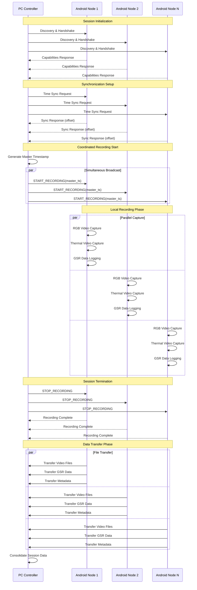

# F2: Recording Pipeline & Session Flow

## Description
Illustrates the complete recording workflow from device discovery through data consolidation. Shows parallel capture coordination and the offline-first approach with post-session file transfer.