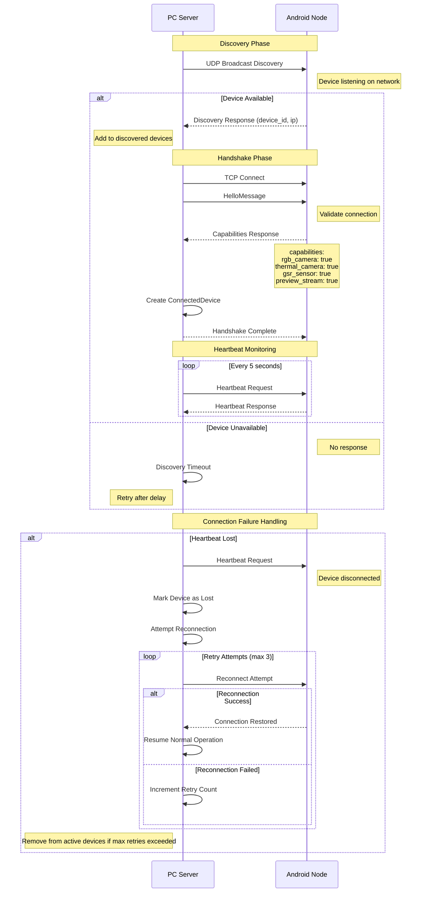

# F3: Device Discovery & Handshake Sequence

## Description
Details the device discovery protocol with UDP broadcast, TCP handshake, capability negotiation, and failure recovery mechanisms. Shows the reliability patterns for maintaining device connections.