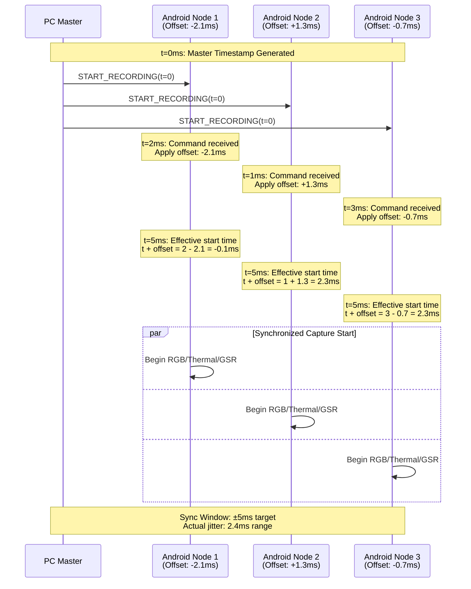

# F4: Synchronized Start Trigger Timeline

## Timeline Analysis
- **Master Timestamp**: t=0 (PC local time)
- **Node 1 Offset**: -2.1ms → Effective start at t=10ms
- **Node 2 Offset**: +1.3ms → Effective start at t=11ms  
- **Node 3 Offset**: -0.7ms → Effective start at t=12ms
- **Sync Jitter**: 2ms range (within ±5ms target window)

## Description
Shows temporal alignment of recording start across distributed nodes. Each device applies its calculated clock offset to achieve synchronized capture initiation within the target timing window.