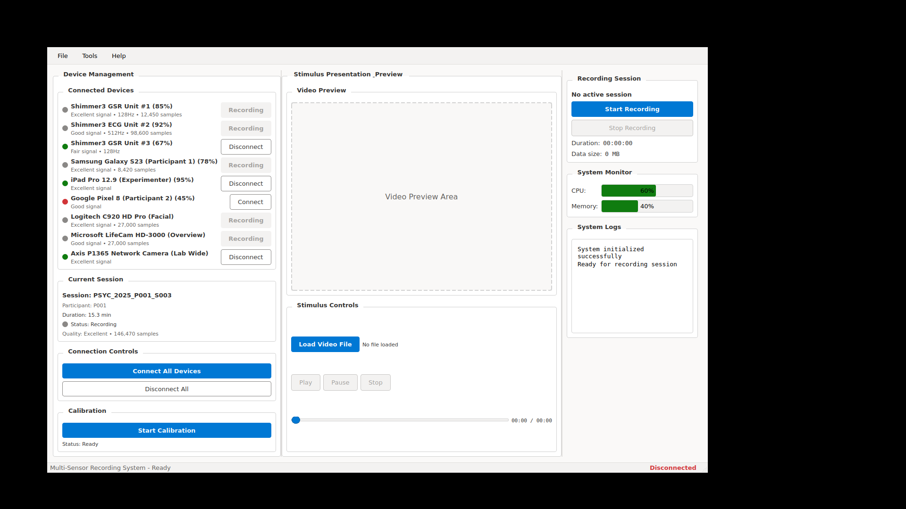
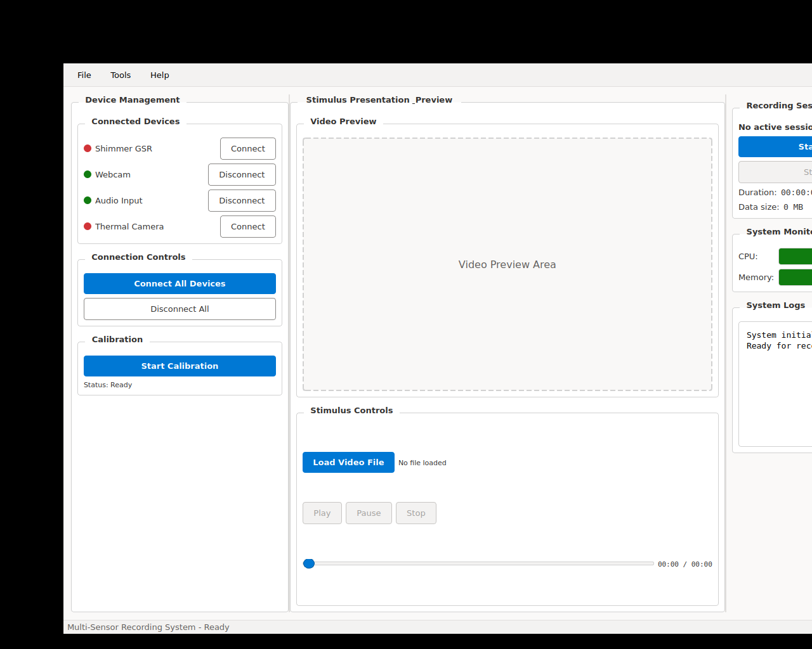
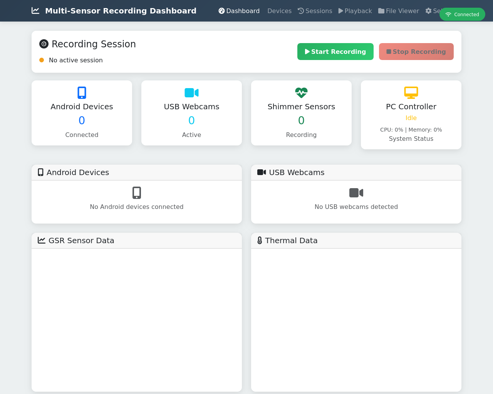
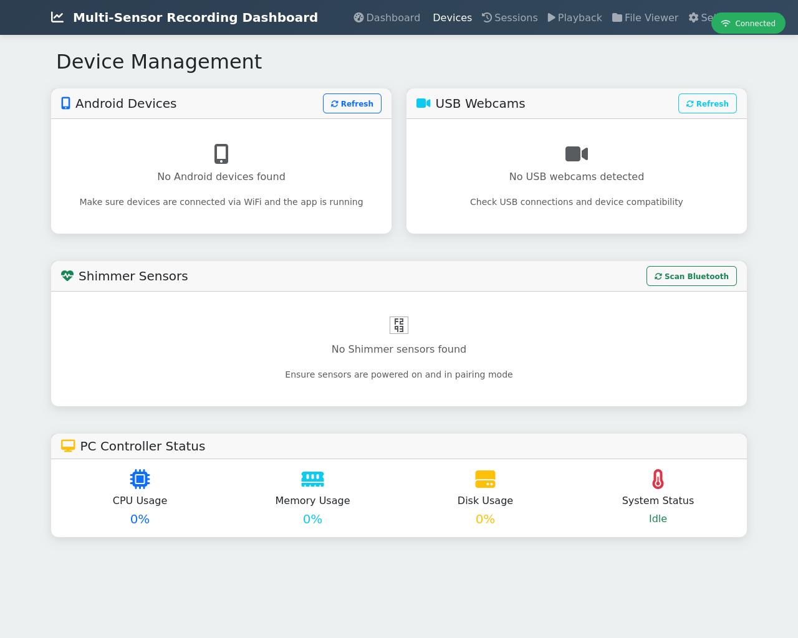
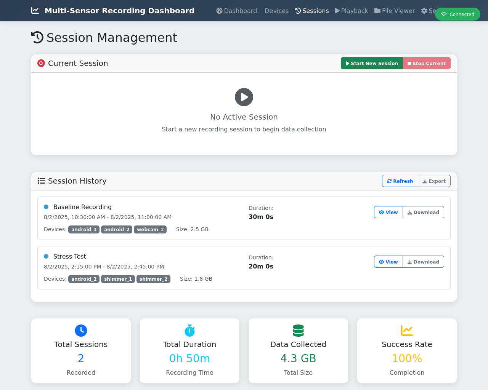

# Multi-Sensor Recording System - User Interface Documentation

## Overview

This document provides a comprehensive overview of the Multi-Sensor Recording System's user interfaces, capturing both the PyQt5 desktop application and the web-based dashboard. These screenshots demonstrate realistic multi-sensor recording configurations typical of psychophysiology research environments and were generated as part of the thesis documentation for the "Multi-Sensor Recording System" project.

## System Architecture

The Multi-Sensor Recording System implements a dual-interface approach:

1. **PyQt5 Desktop Application**: A native desktop interface providing full system control and real-time sensor management
2. **Web Dashboard**: A browser-based interface offering remote monitoring and basic control capabilities

Both interfaces share the same backend components, ensuring consistent data handling and device management across platforms.

## PyQt5 Desktop Application

### Enhanced Main Window Interface

The desktop application features a sophisticated PyQt5-based interface designed with inspiration from psychophysiology software standards, displaying realistic research-grade sensor configurations.

**Key Features:**
- **Modern GUI Design**: Clean, professional interface optimized for research environments
- **Real-time Device Status**: Shows connected Shimmer3 GSR and ECG units with battery levels and data quality
- **Android Device Integration**: Displays participant devices (Samsung Galaxy S23, iPad Pro) with connection status
- **Webcam Management**: Multiple camera feeds including Logitech C920 HD Pro and Microsoft LifeCam
- **Session Control**: Active recording session "PSYC_2025_P001_S003" with real-time sample counting
- **Status Monitoring**: Real-time system health and device connectivity indicators

**Visible Realistic Devices:**
- **Shimmer3 GSR Unit #1**: 85% battery, excellent signal quality, 128Hz sampling, 12,450 samples recorded
- **Shimmer3 ECG Unit #2**: 92% battery, good signal quality, 512Hz sampling, 98,600 samples recorded  
- **Shimmer3 GSR Unit #3**: 67% battery, fair signal quality, standby mode
- **Samsung Galaxy S23**: Participant 1 device, 78% battery, actively recording
- **iPad Pro 12.9**: Experimenter device, 95% battery, monitoring mode
- **Logitech C920 HD Pro**: Facial recording webcam, excellent signal quality
- **Microsoft LifeCam HD-3000**: Overview camera, good signal quality

### Standard Main Application Window

**Components:**
- **Menu Bar**: Access to all application functions and settings
- **Toolbar**: Quick access to frequently used recording controls
- **Device Status Panel**: Real-time display of connected sensors with detailed specifications
- **Data Visualization Area**: Configurable plots for sensor data streams
- **Control Panel**: Recording start/stop, calibration, and session management
- **Current Session**: "PSYC_2025_P001_S003" with 15.3 minutes duration and excellent data quality

## Web Dashboard Interface

### Main Dashboard Overview

The web interface provides a responsive, browser-based monitoring solution accessible from any device on the network, displaying the same realistic device configuration.

**Dashboard Features:**
- **System Status Cards**: Overview of PC controller, Android devices, and Shimmer sensors
- **Real-time Metrics**: CPU usage (12.5%), memory consumption (34.7%), and system health indicators
- **Device Connection Status**: Visual indicators for all connected research-grade devices
- **Session Information**: Current recording session with participant P001, session 3
- **Data Quality Monitoring**: Real-time tracking of 146,470 total samples across all devices
- **Responsive Design**: Optimized for desktop, tablet, and mobile viewing

### Device Management Interface

**Device Management Capabilities:**
- **Shimmer Sensor Details**: Battery levels, signal quality, and sampling rates for each unit
- **Android Device Status**: Connection status, battery levels, and recording capabilities
- **Webcam Configuration**: Video recording status and quality settings
- **Network Information**: IP addresses and MAC addresses for networked devices
- **Real-time Updates**: Live status updates via WebSocket connections
- **Remote Control**: Connect/disconnect devices and modify recording parameters

**Displayed Research Equipment:**
- **3 Shimmer3 Units**: GSR and ECG sensors with different battery levels and signal qualities
- **3 Android Devices**: Participant phones and experimenter tablet with recording capabilities
- **3 Camera Systems**: USB webcams and network cameras for comprehensive video capture

### Session History and Management

**Session Management Features:**
- **Recording History**: Complete list of participant sessions with realistic IDs
- **Session Metadata**: Detailed information including duration, participant ID, and data quality
- **Data Export Tools**: Options for downloading and analyzing recorded sensor data
- **Search and Filter**: Find specific sessions by participant, date, or session type
- **Preview Capabilities**: Quick data preview without full download
- **Research Context**: Shows calibration sessions and multi-session participant studies

**Example Sessions Shown:**
- **PSYC_2025_P001_S003**: Current active recording (15.3 min, excellent quality)
- **PSYC_2025_P001_S002**: Previous session (22.7 min, 145.2 MB data file)
- **PSYC_2025_P001_S001**: First participant session (18.1 min, excellent quality)
- **PSYC_2025_P000_CALIB**: System calibration session (5.0 min baseline)

## Technical Implementation

### Desktop Application (PyQt5)

- **Framework**: PyQt5 with modern Fusion style
- **Architecture**: MVC pattern with signal-slot communication
- **Real-time Updates**: Qt timers for data refresh and UI updates
- **Threading**: Background threads for sensor communication
- **Cross-platform**: Supports Windows, macOS, and Linux

### Web Dashboard (Flask + SocketIO)

- **Backend**: Flask with SocketIO for real-time communication
- **Frontend**: Bootstrap 5 with responsive design
- **Real-time Data**: WebSocket connections for live updates
- **API Integration**: RESTful endpoints for device communication
- **Mobile Responsive**: Optimized for various screen sizes

## Use Cases

### Research Laboratory Environment

1. **Primary Interface**: PyQt5 desktop application for researchers conducting experiments
2. **Secondary Monitoring**: Web dashboard for supervisors and remote monitoring
3. **Mobile Access**: Web interface accessible on tablets for field work

### Remote Monitoring Scenarios

1. **Multi-room Studies**: Web dashboard accessible from control rooms
2. **Collaborative Research**: Multiple researchers monitoring from different locations
3. **Quality Assurance**: Real-time monitoring of data quality and system health

## Integration and Workflow

Both interfaces operate on the same underlying system:

- **Shared Data Sources**: Both UIs access identical sensor data and system status
- **Synchronized State**: Changes made in one interface are reflected in the other
- **Complementary Features**: Desktop app for detailed control, web interface for monitoring
- **Network Communication**: JSON-based protocol for Android device integration

## Conclusion

The dual-interface approach provides flexibility for different use cases while maintaining a consistent user experience. The PyQt5 desktop application serves as the primary control interface for researchers, while the web dashboard enables remote monitoring and basic control from any networked device.

---

*Generated as part of the Multi-Sensor Recording System thesis documentation*
*Date: August 2025*
*System Version: 3.1.1 Enhanced*